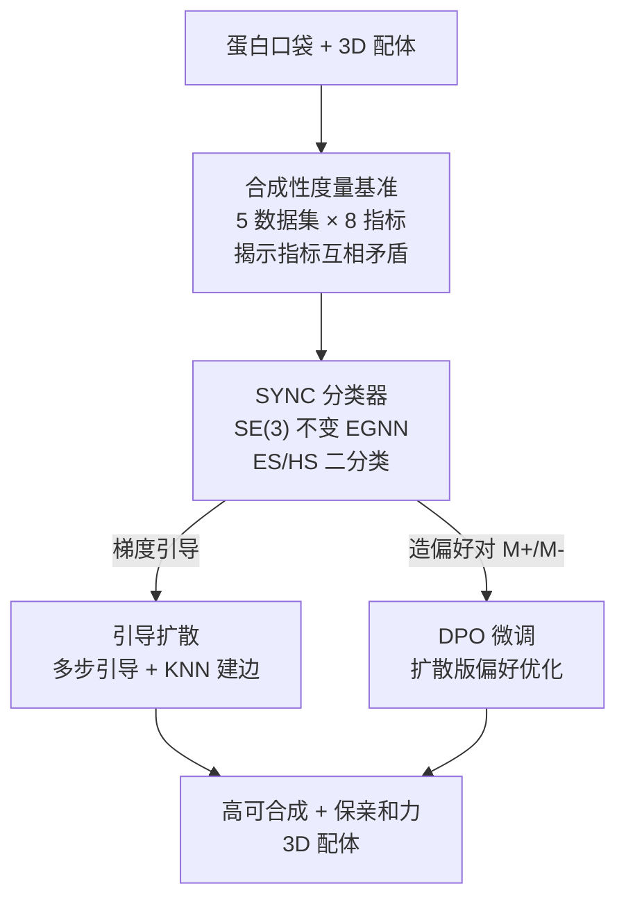

# SYNC: Measuring and Advancing Synthesizability in Structure-Based Drug Design

**会议**: ICLR 2026  
**OpenReview**: [https://openreview.net/forum?id=y1tPw4Uuzg](https://openreview.net/forum?id=y1tPw4Uuzg)  
**代码**: https://github.com/XYxiyang/SYNC  
**领域**: 计算生物 / 药物设计 / 扩散模型  
**关键词**: 基于结构的药物设计, 可合成性, SE(3)不变, 引导扩散, DPO

## 一句话总结
这篇论文先用 8 个经典合成性指标在 11 个 SBDD 模型上做基准测试、揭示这些指标互相打架不可靠，进而提出一个轻量的 SE(3) 不变可合成性分类器 SYNC，并把它当作即插即用模块塞进扩散过程（引导扩散 + DPO），在几乎不损失结合亲和力的前提下让生成分子的可合成性大幅提升。

## 研究背景与动机
**领域现状**：基于结构的药物设计（SBDD）的目标是给定一个蛋白口袋，生成能与之高亲和力结合的 3D 配体分子。主流做法把它建模成「以口袋为条件」的生成任务，从早期的自回归模型（逐原子/逐片段生成）发展到如今的扩散模型（TargetDiff、DecompDiff 等同时去噪原子类型、坐标、化学键）。这些方法在 docking score 等结合相关指标上越做越好。

**现有痛点**：结合得再好，分子合成不出来就无法进入实验验证，这是横在 SBDD 和落地之间最大的障碍。而「一个分子到底好不好合成」本身就难以计算评估。现有合成性评估分三类——规则法（SA、SYBA，快但只能定性、泛化差）、逆合成法（AizynthFinder，给出合成路径因而真阳性率最高，但受限于库存前体且极其耗时，10K 分子要跑 17 万秒）、学习法（RAScore、GASA、FSScore，灵活但大多只用粗粒度特征、完全忽略 3D 构象）。

**核心矛盾**：作者把 8 个指标在 11 个 SBDD 方法上排名一摆（Figure 1），发现它们之间存在巨大的不一致——比如对 FLAG 的合成性，8 个指标里 3 个说差、5 个说好。指标互相矛盾、各有缺陷，导致根本无法对「合成性」下一个可靠结论，更没法用它去指导生成。同时，SBDD 生成的是 3D 构象，而几乎所有现成指标都是 1D/2D 的，丢掉了键角、空间位阻这些直接决定能否合成的 3D 信息。

**本文目标**：(1) 建立一个能横向公平比较合成性指标的基准；(2) 造一个又快又准、还能塞进生成过程指导生成的合成性度量；(3) 在不牺牲结合亲和力的前提下，让 SBDD 直接生成可合成分子。

**切入角度**：可合成性应当对平移/旋转不变（SE(3) 不变），而键角、位阻这些只在 3D 空间才看得见——所以一个「3D 感知 + SE(3) 不变 + 可微 + 快」的分类器，既能当度量、又能当扩散过程的梯度引导信号。

**核心 idea**：用一个 SE(3) 不变的 EGNN 分类器 SYNC 替代杂乱的传统指标，并把它做成即插即用模块，通过引导扩散和 DPO 两条路把「可合成性」直接灌进生成分子里。

## 方法详解

### 整体框架
论文分三块：先做**度量基准**回答「现有指标到底靠不靠谱」，再造**SYNC 分类器**作为更好的度量，最后把 SYNC 当插件接到扩散里，用**引导扩散**和 **DPO** 两条路径把可合成性注入生成。

基准这块，难点在于「不可合成」的分子很难标注（要靠昂贵的湿实验），作者退而求其次用「易合成（ES）/难合成（HS）」作为廉价代理：拿 Enamine 库存当 ES，再收集 TS1/TS2/TS3 和 Nonpher-Test 四个含 ES/HS 标注的数据集，共 5 个数据集上跑 8 个经典指标，得出它们泛化差、互相矛盾的结论。

SYNC 这块，输入是分子的 3D 构象（原子坐标 $x_M$、原子类型 $v_M$、键 $e_M$），用 $L$ 层 EGNN 抽 SE(3) 不变特征，最后一个非线性头输出 ES/HS 二分类概率。由于它可微，就能给扩散过程提供梯度。

下游两条路径都以 SYNC 输出 $p_\phi(y\mid M)$ 为信号：引导扩散在采样时把 SYNC 对预测干净分子 $\hat M_0$ 的梯度加到原子坐标和类型上，把分子往「易合成」方向推；DPO 则先用引导扩散造出成对的 (易合成 $M^+$, 难合成 $M^-$) 偏好数据，再用扩散版 DPO 损失去微调生成模型。

### 关键设计

**1. ES/HS 合成性度量基准：用易/难合成代理「能不能合成」**

要评估「合成性指标准不准」，得有一批标注了「能合成 vs 不能合成」的分子，但「绝对不能合成」几乎无法廉价标注。作者的巧办法是用「易合成（ES）/ 难合成（HS）」作为替代——可购买的分子天然是 ES，而 HS 比「绝对不可合成」好收集得多。基于此搭起 5 个数据集（Enamine 库存作 ES，TS1/TS2/TS3 与 Nonpher-Test 含 ES/HS 标注），在上面跑 8 个经典指标做分类准确率对比。结论很扎实：规则法在特定数据集上塌方（SA、SYBA 在 TS3 上准确率掉到 0.57 左右），逆合成法 AizynthFinder 虽真阳性高却会漏判、且 10K 分子要 17 万秒不可用于大规模筛选，学习法整体更好但算力重。这套基准既是后文 SYNC 的擂台，也第一次把「指标互相矛盾」量化了出来。

**2. SYNC：SE(3) 不变 3D 分类器，把键角与位阻这些 3D 信息纳入合成性判断**

针对现有学习法忽略 3D 构象的痛点，作者论证一个好的合成性分类器应同时满足四条性质：**快**（能大规模筛选）、**可微**（能接进扩散做引导）、**3D 感知**（键角、空间位阻这类决定可合成性的因素只在 3D 才看得见）、**SE(3) 不变**（合成性本就不该随平移旋转改变）。SYNC 用 $L$ 层 EGNN（EGCL 层）作骨干：每层以 $x_M^{(l)}, v_M^{(l)}, e_M$ 为输入更新坐标与类型特征，最终从 $x_M^{(L)}$ 经非线性变换预测合成性，满足 $\mathrm{SYNC}(T_g(x_M,v_M,e_M))=\mathrm{SYNC}(x_M,v_M,e_M)$ 对任意 SE(3) 变换 $T_g$ 成立。作者刻意没把网络做复杂，优先保证推理速度。效果上 SYNC 在 5 数据集平均排名第 1（2.0），既胜过规则/逆合成法，也因 3D 信息超过传统学习法——消融里把它换成 1D 指纹、1D SMILES、2D 图都明显变差，验证了 3D 的价值。

**3. 引导扩散：用 SYNC 梯度把采样推向「易合成」，并解决扩散里的键缺失问题**

把 SYNC 当作预训练分类器 $p_\phi(y\mid M_t)$ 接进去噪过程：$p_{\theta,\phi}(M_{t-1}\mid M_t,P,y)\propto p_\theta(M_{t-1}\mid M_t,P)\,p_\phi(y\mid M_t)$。但 SYNC 只在真实构象上训过、没见过扩散中间态，条件分数难算，于是用去噪网络预测的干净分子 $\hat M_0=p_\theta(M_0\mid M_t,t,P)$ 来近似 $\nabla p_\phi(y\mid M_t)\approx\nabla p_\phi(y\mid \hat M_0)$，再把这个梯度分别加到连续原子坐标采样和（经 Gumbel-softmax 的）离散原子类型采样上，强度由 $\lambda_x,\lambda_v$ 控制。

这里有两个关键工程设计。其一是**多步引导**：扩散步 $t\to 0$ 时模型会「扩散固化」、原子被钉死在某些空间模式，单纯放大 $\lambda_x$ 又会把原子推得太远导致键断裂、分子碎成孤立原子——所以改为在单个扩散步内做多次引导，在后期把合成性猛拉一把。其二是 **KNN 建边**：扩散过程本身不含化学键，而 SYNC 需要键。作者训练 SYNC 时只用真实键的连接、忽略键类型（消融证明无害），引导时按每个原子的最大化合价找 K 近邻连边、过滤掉长于 2.0 Å 的键并保证双向，从而解决扩散生成里的原子-键不一致。

**4. DPO with SYNC：用 SYNC 造高质量偏好对，再微调生成模型**

引导扩散是免训练的，DPO 则把可合成性「固化」进模型权重。DPO 的命门是偏好数据从哪来——直接用扩散模型采样不行，因为绝大多数生成分子都是难合成的。作者的做法是复用上面的引导机制：对同一口袋，加梯度生成易合成的 $M^+$、减梯度生成难合成的 $M^-$，凑成成对偏好数据。与「直接拿分类器当 reward」的旧路线不同，这里 SYNC 是用来「造数据」的。随后用扩散版 DPO 损失微调：

$$L_\theta=-\mathbb{E}_{(P,M^+,M^-)\sim D,\,t\sim U(0,T)}\log\sigma\Big(-\beta T\omega(\lambda_t)\big[L_D(M^+,p_\theta)-L_D(M^+,p_{\mathrm{ref}})-L_D(M^-,p_\theta)+L_D(M^-,p_{\mathrm{ref}})\big]\Big)$$

其中 $L_D$ 是原始扩散损失，$p_{\mathrm{ref}}$ 是冻结的原模型防止跑偏，$\beta$ 控制 DPO 强度。直觉上它鼓励模型在 $M^+$ 上比在 $M^-$ 上有更高生成概率，从而整体提升合成性。相比引导扩散，DPO 推理时不必反复算梯度，因此更快；代价是 SYNC 指标上的提升不如直接梯度引导那么猛。

### 损失函数 / 训练策略
SYNC 在一个含数百万 3D 分子、且剔除测试分子的独立数据集上训练。DPO 微调用 CrossDocked2020 训练集采样的成对数据（为防泄露从训练集采 10K 对、过滤出 TargetDiff 的 3431 对、DecompDiff 的 1991 对），batch size 4，约 1800 次迭代（≈2 个 epoch）达到峰值，再训会因过拟合偏好集而生成碎裂分子。

## 实验关键数据

### 主实验
合成性度量基准（5 数据集分类准确率，越高越好；SYNC 平均排名第 1）：

| 指标 | TS1 | TS2 | TS3 | Nonpher-Test | Enamine | 平均排名 |
|------|------|------|------|------|------|------|
| AizynthFinder（逆合成） | 0.9535 | 0.7509 | 0.7511 | 0.5688 | 0.8061 | 6.0 |
| SA（规则） | 0.9853 | 0.8090 | 0.5667 | 0.8313 | 0.9844 | 4.0 |
| GASA（学习） | 0.9850 | 0.8010 | 0.7590 | 0.9188 | 0.9538 | 3.0 |
| **SYNC（本文）** | **0.9911** | **0.8406** | 0.7564 | **0.9313** | 0.9520 | **2.0** |

把 SYNC 接进 SBDD 范式后，生成分子的合成性几乎在所有指标上一致提升（以 TargetDiff 为骨干，SYNC 指标提升尤为显著）：

| 方法 | SYNC↑ | SA↑ | Aizynth↑ | SYBA↑ |
|------|------|------|------|------|
| TargetDiff（骨干） | 0.1958 | 0.601 | 0.1124 | -41.991 |
| TargetDiff-Guide | 0.3977 (+100.3%) | 0.626 (+4.2%) | 0.1365 (+21.4%) | -33.123 (+21.1%) |
| TargetDiff-DPO | 0.2385 (+21.8%) | 0.626 (+4.2%) | 0.1283 (+14.1%) | -34.396 (+18.1%) |

结合亲和力基本不掉甚至偶有提升（Vina Dock，越负越好）：TargetDiff 平均 -7.42 → Guide -7.75（-0.33）、DPO -7.58（-0.16），即合成性大涨的同时亲和力还略好。

### 消融实验

| 配置 | 关键观察 | 说明 |
|------|---------|------|
| SYNC (3D) | 5 数据集多数第一 | 完整模型 |
| SYNC-1D-FPS / 1D-SMILES / 2D-Graphs | 普遍下降（如 1D-FPS 在 Nonpher-Test 仅 0.825） | 去掉 3D 信息明显变差 |
| SYNC-Edge | 与 SYNC 差距极小 | 建模键类型对合成性不关键 |
| 引导：Constant | 比 vanilla 还差 | 早期分子未成形，引导有害 |
| 引导：Strong | 合成性升但分子碎裂 | $\lambda$ 过大把原子推太远 |
| 引导：Multi-Step | 后期合成性陡升 | 本文主设置（step 600 起） |

### 关键发现
- **3D 信息是 SYNC 的胜负手**：换成 1D/2D 模态全面掉点，印证键角、空间位阻只能在 3D 体现。
- **引导时机比强度更重要**：早期（Constant）引导反而有害，因为分子还没成形；只在后半程做多步引导才能在最后阶段把合成性拉起来，单纯加大强度会撕碎分子。
- **Guide vs DPO 的取舍**：引导扩散在 SYNC 指标上提升最猛（直接吃梯度），但推理慢；DPO 提升温和却推理快、且把能力固化进权重，1800 迭代（≈2 epoch）后过拟合开始生成碎裂分子。
- **骨干越复杂收益越小**：DecompDiff 生成更大分子、天然更难合成，提升幅度低于 TargetDiff。

## 亮点与洞察
- **用 ES/HS 代理「可合成性」绕开标注难题**：绝对不可合成的分子几乎无法廉价标注，改用易/难合成对比，既能建基准又务实，是可迁移到任何「难标注负样本」场景的思路。
- **一个分类器三用**：SYNC 既是评估度量、又是扩散梯度引导信号、还是 DPO 偏好数据的生成器——「可微 + SE(3) 不变」这两条性质让它身兼数职。
- **「造数据」而非「当 reward」喂 DPO**：用引导机制主动合成正负偏好对，绕开了「直接采样几乎全是难合成分子」的数据困境，这点比把分类器直接当 reward 更聪明。
- **合成性与亲和力非零和**：可合成分子往往构象更稳定、更贴合口袋，所以提升合成性时亲和力没掉甚至略升，挑战了「优化合成性必牺牲结合」的直觉。

## 局限与展望
- 作者明确承认这是一项探索性工作，**缺少湿实验验证**，留作未来工作——SYNC 再准也只是计算代理。
- 度量基准建立在「ES/HS 代理不可合成性」的假设上，ES/HS 标签本身来自前人不同工作，可能引入标注偏差；SYNC 也是在这些代理标签上学的，存在「评估者和被评估范式同源」的隐忧。
- 只在 TargetDiff、DecompDiff 两个骨干上验证，且对更复杂、生成更大分子的 DecompDiff 提升明显变小，方法对「天然难合成」骨干的适用性有限。
- 引导扩散推理慢、强度敏感（Strong 撕碎分子、Weak 几乎无效、Constant 有害），实际部署需要小心调 $\lambda_x,\lambda_v$ 和引导时机。

## 相关工作与启发
- **vs 传统合成性指标（SA / AizynthFinder / GASA 等）**：它们要么只定性（规则法）、要么极慢（逆合成法）、要么忽略 3D（学习法）且互相矛盾；SYNC 用 SE(3) 不变 3D 分类器在准确率和速度间取得最佳折中，还可微可引导。
- **vs building-block / GFlowNet 类可合成分子设计**：那些方法基于可购买片段和反应模板生成，大多只产 2D 分子、要额外把 2D docking 进 3D 口袋；本文直接在 3D 生成、一步出可合成且高亲和力的构象，无需 2D→3D 映射和多次 docking。
- **vs ChemProjector（把分子投影到可购买片段）**：ChemProjector 逐片段投影会大改结构；本文主要通过对原子类型/坐标的局部微调提升合成性，结构改动更小、更保亲和力。
- **vs DecompOPT / 直接拿分类器当 reward 的 DPO**：本文不把 SYNC 当 reward，而是用它生成高质量偏好对再做扩散版 DPO，绕开了偏好数据全是难合成分子的困境。

## 评分
- 新颖性: ⭐⭐⭐⭐ 「分类器即度量 + 即引导 + 即数据生成器」三位一体的设计很巧，但单个组件（EGNN、引导扩散、DPO）都是已有积木的组合。
- 实验充分度: ⭐⭐⭐⭐ 5 数据集基准 + 8 指标 + 11 SBDD 方法 + 9 合成性指标 + 亲和力 + 多项消融，相当扎实；缺湿实验验证。
- 写作质量: ⭐⭐⭐⭐ 动机清晰、基准→度量→范式三段递进，公式与图表完整。
- 价值: ⭐⭐⭐⭐ 直指 SBDD 落地的可合成性瓶颈，即插即用、不损亲和力，对实际药物设计有现实意义。

<!-- RELATED:START -->

## 相关论文

- [\[ICML 2025\] Piloting Structure-Based Drug Design via Modality-Specific Optimal Schedule](../../ICML2025/computational_biology/piloting_structure-based_drug_design_via_modality-specific_optimal_schedule.md)
- [\[ICML 2026\] EvoEGF-Mol: Evolving Exponential Geodesic Flow for Structure-based Drug Design](../../ICML2026/computational_biology/evoegf-mol_evolving_exponential_geodesic_flow_for_structure-based_drug_design.md)
- [\[ICLR 2026\] I2Mole: Interaction-aware Invariant Molecular Learning for Generalizable Drug-Drug Interaction Prediction](i2mole_interaction-aware_invariant_molecular_learning_for_generalizable_property.md)
- [\[ICLR 2026\] A Joint Diffusion Model with Pre-Trained Priors for RNA Sequence-Structure Co-Design](a_joint_diffusion_model_with_pre-trained_priors_for_rna_sequence-structure_co-de.md)
- [\[ICLR 2026\] ProteinAE: Protein Diffusion Autoencoders for Structure Encoding](proteinae_protein_diffusion_autoencoders_for_structure_encoding.md)

<!-- RELATED:END -->
