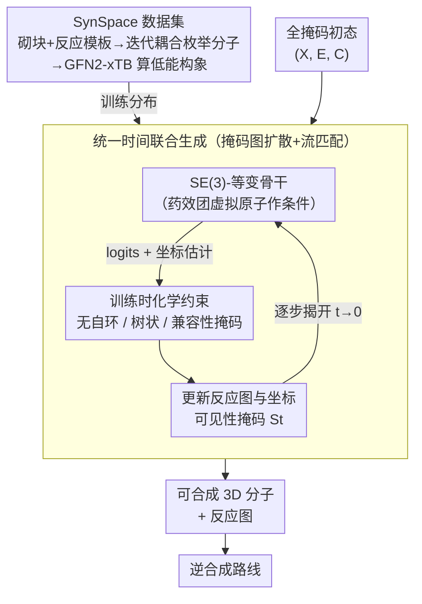

# SynCoGen: Synthesizable 3D Molecule Generation via Joint Reaction and Coordinate Modeling

**会议**: ICLR 2026  
**arXiv**: [2507.11818](https://arxiv.org/abs/2507.11818)  
**代码**: [GitHub](https://github.com/andreirekesh/SynCoGen)  
**领域**: 医学图像/分子生成  
**关键词**: 可合成分子生成, 3D构象生成, 掩码图扩散, 流匹配, 药物发现

## 一句话总结

SynCoGen 提出了一种结合掩码图扩散和流匹配的多模态生成框架，能够同时采样分子构建块反应图和3D原子坐标，在保证合成可行性的同时实现高质量的3D分子生成。

## 研究背景与动机

生成式分子设计在药物发现中具有重要价值，但一个关键瓶颈是**合成可及性**（synthetic accessibility）——生成的分子往往难以在实验室中合成。现有方法存在两大缺陷：

**基于模板的合成方法**（如 GFlowNet、Transformer）只能生成2D分子图，无法建模3D几何结构，而3D信息对药物的化学/生物性质至关重要。

**3D分子生成方法**（如 SemlaFlow、MiDi）可以生成原子坐标，但不考虑合成路径，生成的分子往往不可合成。

SynCoGen 旨在**弥合3D分子生成与合成可行性之间的鸿沟**，在一个统一框架中同时生成可合成的分子图和物理上合理的3D构象。

## 方法详解

### 整体框架

SynCoGen 把一个分子表示成三元组 $(X, E, C)$，其中 $X \in \{0,1\}^{N \times (|\mathcal{B}|+1)}$ 编码每个节点选了哪个构建块（building block，外加一个掩码态），$E \in \{0,1\}^{N \times N \times (|\mathcal{R}|V_{\max}^2+2)}$ 编码节点之间用哪个反应、在哪个反应中心相连，$C \in \mathbb{R}^{N \times M \times 3}$ 则是所有原子的 3D 坐标。整套方法分两层：先用 SynSpace 数据集把"只能生成可合成分子"这个约束烤进训练分布；再让一个 SE(3)-等变骨干从一个全掩码初态出发，对离散的"装配蓝图" $(X,E)$ 和连续的"几何形状" $C$ 在同一条时间轴上同步去噪——$(X,E)$ 走吸收式（掩码）扩散逐步揭开反应图，$C$ 走可见性感知的流匹配同步雕刻坐标，每一步还对骨干预测的 logits 施加化学约束堵死非法装配。采样结束时直接得到一张可逆推出合成路线、又带物理合理构象的分子。

### 关键设计

**1. SynSpace 数据集：把"可合成"写进训练数据本身**

模型想学会只生成可合成分子，前提是训练集里全是可合成分子。作者用一批低成本、高产率的砌块和反应模板，通过迭代耦合构建块枚举出合法分子，再用半经验方法 GFN2-xTB 给每个分子算出多个低能量构象，构成 120 万可合成分子、750 万构象的 SynSpace。核心集用 93 个砌块 + 19 个反应模板（虚拟合成空间超十亿分子），扩展集 SynSpace-L 放大到 378 个砌块 + 26 个反应（超万亿分子）。所选反应都满足"产物原子全部来自两个反应物、每个反应物至多一个离去基团"，因而能保留反应物到产物的原子映射、干净地确定砌块图上的边。这样模型在数据分布层面就被锁在"化学上能合出来"的子空间里，而不是事后再去筛。

**2. 掩码图扩散 + 流匹配的统一时间联合生成：让蓝图和坐标同步生长**

离散反应图和连续坐标本是两种生成范式，分别处理会导致图变了但坐标对不上。SynCoGen 让二者共享同一时间步 $t$：反应图 $(X,E)$ 走 MDLM 式的吸收（掩码）扩散，坐标 $C$ 走条件流匹配（CFM），形成一个"耦合调度、两种分辨率"的多模态采样——砌块/反应这层做离散扩散，原子坐标这层做连续流。难点在于原子数随砌块选择而变——某个节点还是掩码态时，它对应的原子根本不该有坐标信息泄露。为此引入**可见性掩码** $S_t$，当一个砌块在第 $t$ 步仍被掩码时，其原子坐标对模型一致地隐藏，从而干净地支持可变原子数，避免模型"偷看"尚未确定的几何。

**3. 训练时化学约束：用结构性掩码堵死无效分子**

即便数据干净，自由采样仍可能拼出违反化学规则的图。作者在采样的每一步直接对骨干输出的 logits 施加三类硬约束：对角线置零禁止砌块与自身反应（无自环）；限制 $n$ 个砌块最多 $n-1$ 条边，保证装配出树状而非杂乱多环；以及兼容性掩码——一旦某条反应边定下来，就把相连节点的候选砌块裁剪到化学上能匹配该反应的那些。消融显示这组化学敏感约束是有效性指标的最大贡献者，去掉后 Validity 大幅下滑。

**4. SE(3)-等变骨干与药效团虚拟原子：几何对称性 + 条件生成共用一套网络**

上面三件事都要落在同一个网络上完成。骨干基于 SemlaFlow 改造，使其在同一前向里既预测砌块与反应的 logits $L_t^X, L_t^E$，又回归坐标估计 $\hat{\tilde{C}}_0^t$，并保持 SE(3) 等变以尊重 3D 旋转平移对称性。做药效团条件生成时，作者不另起炉灶，而是把目标药效团当作"虚拟原子"塞进同一套等变-不变动力学模块，让它和真实原子交互，从而用一个摊销（amortized）模型覆盖无条件生成、片段链接、药效团条件设计等多种任务，无需对每个靶标重训。

### 损失函数 / 训练策略

总损失是三项加权和 $\mathcal{L} = \mathcal{L}_{\text{graph}} + \mathcal{L}_{\text{MSE}} + \mathcal{L}_{\text{pair}}$：$\mathcal{L}_{\text{graph}}$ 是对 $(X, E)$ 的交叉熵，监督反应图恢复；$\mathcal{L}_{\text{MSE}}$ 是被掩码原子坐标的均方误差，驱动流匹配预测；$\mathcal{L}_{\text{pair}}$ 是一项短程成对距离正则，约束邻近原子间距落在合理范围，避免出现键长崩坏的非物理构象。

## 实验关键数据

### 主实验

| 方法 | Valid.↑ | AiZyn.↑ | Synth.↑ | GFN-FF↓ | xTB↓ | PB↑ | FCD↓ |
|------|---------|---------|---------|---------|------|-----|------|
| **SynCoGen** | **96.7** | **50** | **72** | **3.01** | **-0.91** | **87.2** | **2.91** |
| SemlaFlow | 93.3 | 38 | 36 | 5.96 | -0.72 | 87.2 | 7.21 |
| JODO | 91.1 | 38 | 31 | 4.72 | -0.74 | 84.1 | 4.22 |
| EQGAT-diff | 85.9 | 37 | 24 | 4.89 | -0.73 | 78.9 | 6.75 |
| MiDi | 74.4 | 33 | 31 | 4.90 | -0.74 | 63.0 | 6.00 |

SynCoGen 在合成可行性（AiZyn +12, Synth +36 vs SemlaFlow）和构象能量质量上显著领先。

### 消融实验

| 配置 | 关键指标 | 说明 |
|------|---------|------|
| 去掉化学约束 | Valid. 大幅下降 | 化学敏感的图约束是最大性能贡献者 |
| 去掉自条件(self-conditioning) | Valid./FCD 下降 | 自条件对质量有重要贡献 |
| SemlaFlow重训于SynSpace | Valid. 72.0 | 证明性能提升来自训练策略而非数据/架构 |
| SynSpace-L (更大搜索空间) | 保持高质量 | 可扩展至更大构建块词汇 |

### 关键发现

- **片段链接(Fragment Linking)**: 在3个FDA批准药物靶标上，SynCoGen 生成的链接分子 docking 得分与天然配体相当或更优，且逆合成解析率达58-79%（DiffLinker为0%）
- **药效团条件生成**: 在10个PDB/LIT-PCBA靶标中，SynCoGen 在8/10上获得最佳 docking 得分，逆合成解析率比所有基线高15-65%
- **零样本构象生成**: 给定随机反应图时，可达到接近 ETKDG（RDKit）的构象生成质量

## 亮点与洞察

1. **"合成即生成"的范式突破**: 将合成约束直接编码进生成过程，而非后处理筛选，从根本上保证可合成性
2. **多分辨率多模态**: 在构建块级做离散扩散，在原子级做连续流匹配——"两分辨率统一时间"的设计非常优雅
3. **零样本条件设计**: 不需要针对特定靶标重训练，单一摊销(amortized)模型即可完成多种药物设计任务
4. **数据贡献突出**: SynSpace 包含120万+可合成分子和750万+构象，是该领域重要的公开资源

## 局限与展望

1. **构建块词汇有限**: 当前最大词汇仅378个构建块，化学多样性受限
2. **不支持大环(macrocycle)**: 训练时约束限制了边数，无法生成大环分子
3. **缺乏湿实验验证**: 尚未对生成的分子进行实际合成和生物活性测试
4. **合成解析率上限**: AiZynthFinder 本身只能解析50-70%的已知药物分子，评估可能低估真实合成可行性

## 相关工作与启发

- 与 **CGFlow** (GFlowNet + 流匹配) 相比，SynCoGen 无需对每个靶标重训、无需外部奖励函数
- **SemlaFlow** 提供了等变骨干架构基础，但缺乏合成约束
- **DiffLinker** 是专用的片段链接模型，但生成分子完全不可合成
- 对计算化学和AI制药领域都有重要启发：合成约束可以被"内嵌"到生成模型中

## 评分

- **新颖性**: ⭐⭐⭐⭐⭐ 首个同时建模合成路径和3D结构的联合生成框架，范式创新
- **实验充分度**: ⭐⭐⭐⭐⭐ 无条件生成、片段链接、药效团条件生成三大任务，消融充分
- **写作质量**: ⭐⭐⭐⭐ 整体清晰，但符号系统较复杂
- **价值**: ⭐⭐⭐⭐⭐ 对AI驱动药物发现具有直接应用价值，数据集和代码均开源

<!-- RELATED:START -->

## 相关论文

- [\[ICLR 2026\] FlexRibbon: Joint Sequence and Structure Pretraining for Protein Modeling](flexribbon_joint_sequence_and_structure_pretraining_for_protein_modeling.md)
- [\[ICML 2025\] Scalable Non-Equivariant 3D Molecule Generation via Rotational Alignment](../../ICML2025/computational_biology/scalable_non-equivariant_3d_molecule_generation_via_rotational_alignment.md)
- [\[AAAI 2026\] Apo2Mol: 3D Molecule Generation via Dynamic Pocket-Aware Diffusion Models](../../AAAI2026/computational_biology/apo2mol_3d_molecule_generation_via_dynamic_pocket-aware_diff.md)
- [\[ICLR 2026\] A Genetic Algorithm for Navigating Synthesizable Molecular Spaces](a_genetic_algorithm_for_navigating_synthesizable_molecular_spaces.md)
- [\[ICLR 2026\] GAGA: Gaussianity-Aware Gaussian Approximation for Efficient 3D Molecular Generation](gaga_gaussianity-aware_gaussian_approximation_for_efficient_3d_molecular_generat.md)

<!-- RELATED:END -->
