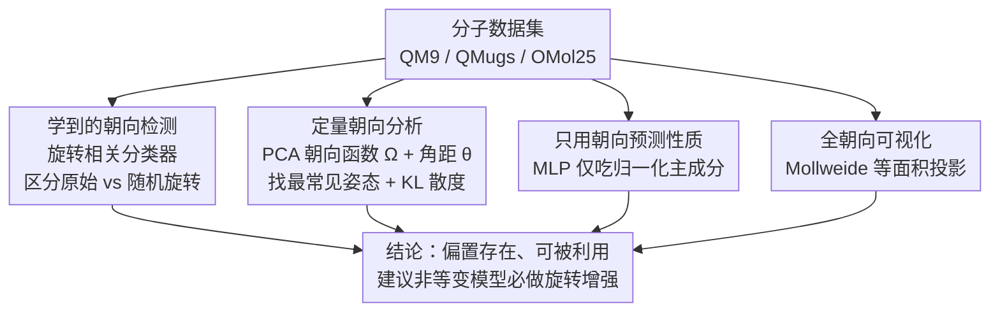

# Take Note: Your Molecular Dataset Is Probably Aligned

**会议**: ICLR 2026  
**OpenReview**: [https://openreview.net/forum?id=zrCGvLOrTL](https://openreview.net/forum?id=zrCGvLOrTL)  
**代码**: https://github.com/sciai-lab/are-my-molecules-aligned  
**领域**: 几何深度学习 / 分子机器学习  
**关键词**: 朝向偏置, 等变性, 数据增强, QM9, SO(3)

## 一句话总结
这篇论文系统性地揭露并量化了 QM9、QMugs、OMol25 等主流分子数据集中"分子并非随机朝向"这一被机器学习新人普遍忽视的陷阱：一个简单分类器就能把原始样本和随机旋转后的样本高精度区分开，神经网络甚至能"只看朝向"就预测出分子性质，从而提醒大家——非等变模型若不做旋转增强，其测试性能会被这种虚假信号人为抬高。

## 研究背景与动机

**领域现状**：分子机器学习近年突飞猛进，很大程度上靠的是 QM9、QMugs、OMol25 这类大规模数据集。这些数据集由计算化学软件（如 Corina 生成初始构象 + DFT 弛豫）批量生产，而这些代码在生成 3D 几何时**通常不会随机化分子的姿态/朝向**。与此同时，几何深度学习的一条主线是用 SO(3)-等变网络处理坐标系的任意性——等变模型对"仅相差一个旋转"的输入会给出一致预测，因此天然对数据集里分子的朝向不敏感。

**现有痛点**：严格等变架构虽然原理上优雅，但依赖张量积、特殊归一化、特殊非线性等"非标准积木"，计算昂贵且实践中难调。于是"放松等变约束、学习近似对称性、甚至主动打破内建等变性"成了一股(重新)兴起的潮流（AlphaFold 3 就是显眼例子）。可一旦模型不再严格等变，数据集里潜藏的朝向偏置就会悄悄渗进训练流程。

**核心矛盾**：分子数据集**不是随机朝向**这件事，化学信息学专家心知肚明，但对刚入门的机器学习研究者却是个隐形地雷。仅靠肉眼看 3D 结构很难察觉这种偏置（QMugs、OMol25 用肉眼几乎看不出对齐），但它真实存在，且会被模型当成"捷径"利用——非等变模型可能靠这种虚假的朝向信号在缺乏随机旋转测试集时刷出虚高指标；即便后续用等变架构，若训练目标（如格点上的电子密度）本身定义在非球对称的笛卡尔网格上，朝向偏置也会引入系统性偏差。

**本文目标**：把"分子数据集存在朝向偏置"这件事从"专家默会知识"变成**可检测、可量化、可视化、有实证危害**的公开结论，并给出实操建议。

**切入角度**：作者沿用并扩展 Lawrence 等人（2025a）的思路，但不止于"检测有没有偏置"，而是引入一套互补方法去**系统刻画分子朝向的整个分布**——既要证明偏置存在，又要证明它能被网络利用，还要让人一眼看见它长什么样。

**核心 idea**：把"是否随机朝向"转化为三个可证伪的实验——(1) 训练一个**旋转相关**(而非等变/不变)的分类器去区分"原始 vs 随机旋转"；(2) 用 PCA 定义朝向函数并统计朝向分布的非均匀性；(3) 只把"朝向"喂给 MLP 看它能否预测化学性质——三管齐下坐实偏置的存在与危害。

## 方法详解

### 整体框架

这篇论文不提新架构，它的"方法"是一套**诊断分子数据集朝向偏置的工具箱**。给定一个分子数据集（每个分子是一组原子电荷与坐标 $\{(z_a, x_a)\}$），作者从四个角度对它做体检：先用一个分类器**证明偏置可被检测**，再用 PCA + 统计量**量化偏置有多强、最常见的姿态是什么**，接着用一个只吃朝向的回归器**证明偏置会被模型利用**，最后用投影可视化**让人肉眼看见**化学相似的分子朝向也相似。这四步针对同一批数据并行展开，共同支撑"你的分子数据集八成是对齐的"这一结论。

### 关键设计

**1. 学到的朝向检测：用一个"旋转相关"分类器把对齐曝光**

如果一个数据集真是朝向不变的，那么"判断某个分子是原始姿态还是被随机旋转过"这个任务应该不可能做得比瞎猜更好——这正是文献里的 classifier two-sample test。作者据此训练一个简单的三层消息传递网络：对每个样本，以一定概率从 SO(3) 均匀采样一个旋转矩阵作用上去，网络则用二元交叉熵学着判断"这个分子被随机旋转过吗"。消息传递写作 $f_i^{(k+1)} = \bigoplus_{j\in\mathcal{N}(i)} \mathrm{MLP}(f_j^{(k)}, \mathrm{emb}(x_i-x_j))$，其中对相对位移向量 $x_i-x_j$ 的**角度部分和径向部分**都用高斯基函数嵌入——关键在于这个网络**既不旋转等变也不旋转不变，而是被刻意设计成"旋转相关"**，否则它根本无法感知朝向。

为了排除"网络只是抓住某条边恰好对齐坐标轴"这种平凡捷径，作者在待检测旋转之前还先给原子坐标加最高 $\delta=1\,\text{Å}$ 的高斯噪声、再叠加一个最大 $\alpha$ 度的随机旋转。$1\,\text{Å}$ 的扰动相当可观（碳碳单键才 $1.5\,\text{Å}$）。结果是：即便加了如此强的扰动、即便预旋转角 $\alpha$ 高达 $90°$，分类器在 QM9/QMugs/OMol25 上仍保持很高的测试准确率，证明这些数据集的"标准姿态"高度一致且可检测，绝非肉眼可见的单一边对齐那么简单。

**2. 定量朝向分析：用 PCA 朝向函数 + 角距统计把"有多偏"压成一个数**

要系统比较不同分子的朝向，先得给每个分子定义一个朝向。作者构造映射 $\Omega: M \to SO(3)$，要求它**对旋转等变**：当分子被 $R$ 旋转时，$\Omega(RM)=\Omega(M)R^T$，即这个参考系跟着分子一起转。一个简单实现是取**中心化原子坐标的归一化主成分**作为三个基向量 $e_1,e_2,e_3$；因为特征向量符号有歧义，前两个主成分的符号被定为"指向投影绝对值最大的方向"（$\max_a |x_a\cdot e_i| = \max_a x_a\cdot e_i$），第三个由 $\det=1$ 固定。

有了朝向就能比较朝向之间的差异：两个旋转 $R_1,R_2$ 的"距离"取相对旋转矩阵的转角 $\theta(R_1,R_2)=\arccos\!\big(\frac{\mathrm{tr}(R_1^T R_2)-1}{2}\big)$。若数据集朝向真随机（在 SO(3) 上服从 Haar 测度），则到任一参考姿态的角距应服从理论分布 $p(\theta)=\frac{2}{\pi}\sin^2(\theta/2)$。作者对全数据集算两两角距矩阵 $\Theta_{ij}$，再用以 $\theta=0$ 为中心的高斯核做核密度估计，密度最高的那个分子的朝向即"最常见姿态" $\Omega(M_{i^*})$。实测三个数据集的经验角距分布都显著偏离理论随机分布，且在 $\theta=\pi$ 处还有一个峰（对应主成分翻转 $180°$ 的同一姿态）。最后用一个适配到 SO(3) 曲面的 Kozachenko-Leonenko 估计器算经验分布对均匀分布的 **KL 散度**，把"非均匀程度"压成单个数字：QM9 为 $0.90$、QMugs 为 $1.76$、OMol25 为 $1.04$（数值越大越不均匀），并据此给 OMol25 的各子集排序，排序结果与可视化高度一致。

**3. 只用朝向预测性质：证明偏置会被网络当捷径利用**

前两步证明了偏置存在，但还没回答"它会不会影响模型"。作者设计了一个极端实验：让一个简单 MLP **只拿归一化主成分**（即朝向信息，不含任何成分/几何信息）作为输入去回归分子性质，分别在"标准姿态"和"随机旋转后"两个版本上训练。这里随机旋转用样本索引决定的确定性旋转，保证同一分子每次取到同样的旋转，等价于"预先把数据集每个分子旋转一次"。在 MSE 损失下，若朝向真随机，主成分就不含化学信息，模型最优只能输出目标均值（$\mathrm{mean}(\{y_i\})=\arg\min_x\sum_i(x-y_i)^2$）；因此**只要模型 MSE 显著低于"预测均值"的基线，就说明它从朝向里学到了非平凡的模式**。

结果（Tab. 1）正是如此：在标准姿态上训练的 MLP，对 QM9 的 $\epsilon_{\text{LUMO}}$、ZPVE、$c_V$，QMugs 的 $U_{RT}$、$\hat V_{ee}$，OMol25 的 $E_{\text{tot}}$ 等性质，测试 MSE 都明显优于均值基线；而在随机旋转版本上训练的同一模型则退化到均值水平（与理论预期一致）。这直接证明化学相似的分子默认就有相似朝向，非等变模型完全可能把"朝向→性质"这种**非物理的虚假映射**学进去，在没有随机旋转测试集时刷出虚高指标。

**4. 全朝向可视化：让"化学相似→朝向相似"肉眼可见**

为了把抽象的朝向分布变得直观，作者把每个分子的三个归一化主成分 $e_1,e_2,e_3\in S^2$ 用**等面积的 Mollweide 投影**画到 2D 平面，三个主轴分别用蓝/黄/品红着色，于是一个分子的朝向就是投影上一组正交的三点。用等面积投影的好处是：真正均匀的分布看上去也会均匀，所以一旦图上出现明显聚集，就是真有偏置。可视化清楚显示 QMugs、OMol25 最常见的主轴朝向与标准笛卡尔坐标系对齐，QM9 也呈现明显非均匀结构；再把某个化学性质当热力图叠上去，可见朝向与性质确实相关。作者还据角距挑出两组朝向几乎相同、化学构成也相似的 QM9 分子作为佐证，并展示 OMol25 不同子集的偏置强弱差异巨大（GEOM、ANI-2X 强对齐，SPICE2、Biomolecules 近乎均匀），提醒即使是肉眼看不出的小偏置也不能掉以轻心。

### 损失函数 / 训练策略
检测器用二元交叉熵训练（标签是"是否被随机旋转"），三个数据集共用同一套点云架构（径向截断 $10\,\text{Å}$，主成分初始化节点特征结合原子类型嵌入）；性质回归器用 MSE 损失、5 次重复取均值±标准差。

## 实验关键数据

### 主实验：只用朝向就能预测性质（Tab. 1 节选）
"MSE of mean" 是只预测目标均值的理论最优基线，"MSE of MLP" 是只吃归一化主成分的 MLP。标准姿态下 MLP 显著优于均值基线，随机旋转后则退化到均值水平。

| 数据集 | 性质 | 随机旋转 | 均值基线 MSE | MLP MSE（测试） |
|--------|------|----------|--------------|------------------|
| QM9 | $\epsilon_{\text{LUMO}}$ [eV] | 否 | 1.6355 | **1.4237 ± 0.0048** |
| QM9 | $\epsilon_{\text{LUMO}}$ [eV] | 是 | 1.6355 | 1.6367 ± 0.0001 |
| QM9 | ZPVE [eV] | 否 | 0.8107 | **0.6204 ± 0.0011** |
| QM9 | $c_V$ | 否 | 16.169 | **13.814 ± 0.083** |
| QMugs | $U_{RT}$ [Eh] | 否 | 890.54 | **843.48 ± 0.09** |
| OMol25 | $E_{\text{tot}}$ [eV] | 否 | $14394.3\times10^6$ | $\mathbf{(13689.1\pm1.7)\times10^6}$ |

### 朝向非均匀性量化（KL 散度估计）

| 数据集 | 估计 KL 散度（越大越不均匀） |
|--------|------------------------------|
| QMugs | 1.76 |
| OMol25 | 1.04 |
| QM9 | 0.90 |

OMol25 子集内部差异巨大：GEOM (5.613)、ANI-2X (4.328) 强对齐，而 SPICE2 (0.005)、Biomolecules (0.070) 近乎均匀。

### 关键发现
- **检测器对强扰动鲁棒**：即便加 $1\,\text{Å}$ 高斯噪声、预旋转最高 $90°$，分类器仍能高精度区分原始/随机旋转样本，说明对齐信号不是单一边对齐这种脆弱捷径，而是分布层面的系统性偏置。
- **"只看朝向"即可预测性质**是最有冲击力的证据：不给任何成分/几何信息，仅凭主成分朝向就能击败理论最优均值基线，坐实了非等变模型可借此刷出虚高指标。
- **偏置无法靠肉眼可靠排除**：QMugs/OMol25 肉眼几乎看不出对齐，Biomolecules 子集偏置微弱却仍存在——所以"看起来没对齐"不能作为跳过随机增强的理由。

## 亮点与洞察
- **把"专家默会"做成可证伪实验**：朝向偏置在化学信息学界是常识，但本文用 classifier two-sample test + 只吃朝向的回归器，把它变成机器学习语境下可量化、可复现的结论，弥合了两个社区的认知鸿沟。
- **"旋转相关"网络是反直觉但精妙的工具选择**：几何深度学习一直追求等变/不变，这里却故意要一个对旋转敏感的网络当探针——目标不是做好任务，而是把数据里的对称性破缺暴露出来。
- **用 KL 散度把朝向偏置压成单一标量**，便于跨数据集、跨子集排序与比较，可直接迁移到任何几何数据集的偏置审计（如点云、蛋白结构）。
- **最优均值基线作为"零信息上界"**的论证干净利落：MSE 下最优常数预测就是均值，凡是低于它的就一定学到了非平凡模式，无需复杂统计检验即可下定论。

## 局限与展望
- 这是一篇**意识唤醒/审计型**论文而非新方法，没有提出能消除偏置危害的训练算法，落脚点是"建议做随机旋转增强、报告等变误差"这类最佳实践。
- 性质回归用的是简单 MLP 的极端设定，正文承认还需用真实的非等变 Transformer（附录 E.5）进一步验证偏置对实用模型的影响幅度有多大。
- PCA 朝向函数只是众多可能朝向函数中的一种简单选择，对接近球对称或主成分退化（特征值接近）的分子可能不稳定，作者用符号约定缓解但未深入讨论退化情形。
- 改进方向：把这套审计工具标准化进数据集发布流程，或反过来在确有合理 canonical 朝向时显式利用它（如 Baker 等人 2024 的工作），把"偏置"转化为"先验"。

## 相关工作与启发
- **vs Lawrence et al. (2025a)**：他们最早提出分子数据集存在朝向偏置、侧重"检测有没有"；本文在其基础上引入一套互补方法系统刻画**朝向的整个分布**（PCA 朝向函数、角距统计、KL 散度、Mollweide 可视化），从"有无"走向"多强、什么姿态、会不会被利用"。
- **vs 严格等变架构（Tensor Field Networks / MACE 等）**：等变模型天然对朝向不敏感，因此不受偏置影响，但代价是非标准积木、计算昂贵难调；本文恰恰是在"放松等变"成为潮流的背景下，提醒这条路必须配合随机增强。
- **vs canonicalization 类方法（如 Baker et al. 2024）**：本文一面警示朝向偏置的危害，一面也指出在朝向确有意义时，显式利用 canonical 朝向反而可能有益——两者是一体两面。

## 评分
- 新颖性: ⭐⭐⭐⭐ 不是新架构，但把一个被忽视的系统性陷阱做成可量化、可视化、有实证危害的完整证据链，视角新颖。
- 实验充分度: ⭐⭐⭐⭐ 三个主流数据集 + 多角度交叉验证（检测/量化/利用/可视化），但对实用模型的影响主要放在附录。
- 写作质量: ⭐⭐⭐⭐⭐ 论证层层递进、动机清晰，把跨社区的认知差讲得很透。
- 价值: ⭐⭐⭐⭐⭐ 直接关系到分子机器学习的评测严谨性，"非等变模型必做旋转增强"是可立即落地的实操建议。

<!-- RELATED:START -->

## 相关论文

- [\[ICLR 2026\] SAIR: Enabling Deep Learning for Protein-Ligand Interactions with a Synthetic Structural Dataset](sair_enabling_deep_learning_for_protein-ligand_interactions_with_a_synthetic_str.md)
- [\[NeurIPS 2025\] FGBench: A Dataset and Benchmark for Molecular Property Reasoning at Functional Group-Level in Large Language Models](../../NeurIPS2025/computational_biology/fgbench_a_dataset_and_benchmark_for_molecular_property_reasoning_at_functional_g.md)
- [\[ICLR 2026\] A Genetic Algorithm for Navigating Synthesizable Molecular Spaces](a_genetic_algorithm_for_navigating_synthesizable_molecular_spaces.md)
- [\[ICLR 2026\] Graph Diffusion Transformers are In-Context Molecular Designers](graph_diffusion_transformers_are_in-context_molecular_designers.md)
- [\[ICLR 2026\] Hierarchical Multi-Scale Molecular Conformer Generation](hierarchical_multi-scale_molecular_conformer_generation.md)

<!-- RELATED:END -->
