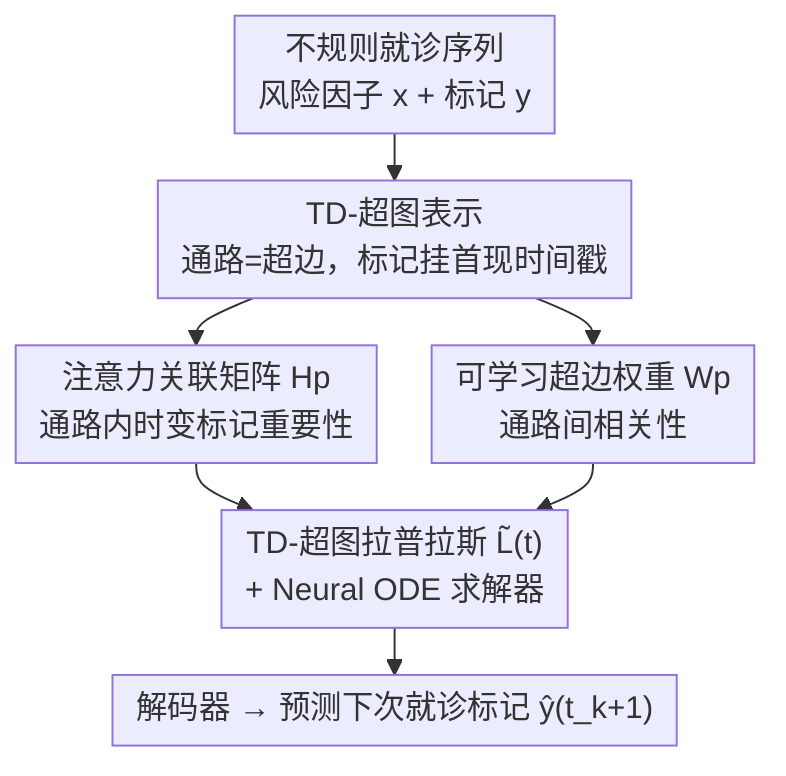

# Temporally Detailed Hypergraph Neural ODEs for Disease Progression Modeling

**会议**: ICLR 2026  
**OpenReview**: [https://openreview.net/forum?id=3XRAkZtMPK](https://openreview.net/forum?id=3XRAkZtMPK)  
**代码**: 随补充材料提供（论文未给独立仓库链接）  
**领域**: 计算生物 / 临床时序建模 / 图神经网络  
**关键词**: 疾病进展建模, 超图神经ODE, 电子病历, 连续时间动力学, 患者亚型

## 一句话总结
把临床公认的疾病进展通路建模成"带逐标记时间戳"的时序细化超图（TD-Hypergraph），再用一个由可学习超图拉普拉斯算子驱动的 Neural ODE 来刻画不规则就诊数据下的连续时间进展动力学，在两个真实 EHR 数据集上预测下一次就诊的并发症标记，F1 显著超过 LSTM / Transformer / 时序图网络 / Neural ODE 等多类基线。

## 研究背景与动机

**领域现状**：疾病进展建模（disease progression modeling）的目标是从纵向电子病历（EHR）中刻画并预测一个患者的并发症如何随时间恶化——每次就诊有一组风险因子（化验、用药、生命体征）和一组并发症标记（是否有高血压、房颤、心衰、脑血管病、中风等），任务是预测下一次就诊时的标记向量。现有方法分两类：机制模型（把病理生理过程写进模型，可解释但难以从真实数据自适应）和数据驱动模型（隐马尔可夫、LSTM、Transformer、Neural ODE 等）。

**现有痛点**：三方面都不令人满意。其一，就诊时间是**不规则采样**的，而底层疾病状态在连续时间里演化，离散序列模型（LSTM/Transformer）天然不匹配。其二，很多慢病（2型糖尿病、阿尔茨海默、慢性肾病、心血管病）有**临床公认的进展通路**，这些通路被常规用于指导治疗，但把它们结构化地塞进数据驱动模型并不容易——通路里是多步、高阶的依赖，不是简单的两两关系。其三，患者**异质性**强：进展速率和路径都不同（有人迅速发生肾损伤，有人多年稳定）。

**核心矛盾**：能捕捉连续时间动力学的 Neural ODE（如 NODE）不会用临床验证的进展通路；能表示通路的连续时间图神经网络只建模**两两关系**（一个并发症和它的直接前驱/后继），漏掉了一条通路上所有标记节点之间的**高阶交互**。而即便用了超图来表达高阶关系，已有的时序超图网络也只在**整条超边**上挂时间戳，无法刻画超边内部"哪个标记什么时候出现"的细粒度时间进展。

**本文目标**：构造一个既能编码临床通路高阶依赖、又能在不规则连续时间上自适应学习患者个体动力学的统一框架。

**切入角度**：把一条进展通路（如高血压→房颤→心衰）整体建成**一条超边**，并给超边内每个标记挂上"首次出现时间戳"，得到时序细化超图；进展的连续时间梯度由这张超图的拉普拉斯算子来支配。

**核心 idea**：用一个**可学习、随时间自适应的 TD-超图拉普拉斯算子** $\tilde{L}(t)$ 去替换 Neural ODE 里固定的动力学算子——其中注意力关联矩阵编码"通路内"时变标记重要性，可学习超边权重编码"通路间"相关性，两者一起把临床知识注入连续时间进展动力学。

## 方法详解

### 整体框架

TD-HNODE 的输入是某患者到当前为止的不规则就诊序列（每次就诊的风险因子 $x(t_k)$ 与并发症标记 $y(t_k)$）以及由临床通路构造的时序细化超图 $H_u$；输出是对下一次就诊 $t_{k+1}$ 时刻并发症标记向量 $\hat{y}(t_{k+1})$ 的预测。整体是一个"超图驱动的 Neural ODE"：把临床进展通路表示成超图（节点=并发症标记，超边=一条进展通路），在每个就诊时刻把风险因子和标记嵌入成节点表示，据此构造一个可学习的 TD-超图拉普拉斯算子 $\tilde{L}(t)$，再把它连同风险因子和隐状态 $S(t_k)$ 一起交给 Neural ODE 求解器把隐状态从 $t_k$ 积分到 $t_{k+1}$，最后解码出标记预测。

整张超图的关键在于拉普拉斯算子 $\tilde{L}(t)$ 是怎么"长出来"的：它由**注意力关联矩阵 $H_p$**（捕捉通路内、随时间变化的标记重要性）和**可学习超边权重矩阵 $W_p$**（捕捉通路间的相关性）拼装而成，二者都依赖于"当前最近一次就诊 $t_{k_0}$"这个时间锚点，因此 $\tilde{L}$ 随疾病进展而演化，写作 $\tilde{L}(t)$。

### 关键设计

**1. TD-超图表示：给临床通路里的每个标记挂上首现时间戳**

针对"通路是多步高阶依赖、普通图只能两两建模"的痛点，本文先把每条临床公认通路 $p_j=\langle v_1^j, v_2^j, \dots\rangle$ 整体表示成**一条超边** $e_j$，让一条超边一次性连接通路上的所有标记节点，从而表达超越两两关系的高阶依赖；不同超边又通过共享标记（如多条糖尿病通路都从高血压起步）天然重叠，便于刻画通路间的交叉依赖。在此基础上引入**时序细化**：每条超边不只记录有哪些标记，还记录每个标记**首次被观测到的时间戳**，$e_j^u=\{(v_1^j,t_1),(v_2^j,t_2),\dots,(v_{k}^j,t_k),(v_{k+1}^j,\infty),\dots\}$——已出现的标记带真实时间戳，尚未出现的用占位符 $\infty$。由于患者未必走完整条通路，观测到的片段可能短于完整通路。这与已有时序超图方法的本质区别在于：后者把时间戳挂在**整条超边**上，而 TD-超图把时间戳下沉到**超边内每个标记**，于是同一条超边里"已发生 vs 可能将发生"的标记可以被区别对待，超图也因此随时间演化。标记被假设为不可逆（0→1 或保持），契合糖尿病等慢病的不可逆进展特性。

**2. 注意力关联矩阵 $H_p$：用交叉注意力建模通路内的时变标记重要性**

针对静态拉普拉斯把超边内所有标记一视同仁（关联矩阵 $H$ 是 0/1 二值）这一缺陷，本文用基于交叉注意力的自适应关联矩阵替换它。以最近一次就诊 $t_{k_0}$ 对应的标记 $v_{k_0}$ 作为"当前进展点"，它把通路切成**过去集** $O_j=\{v_1,\dots,v_{k_0}\}$（已观测）和**潜在集** $F_j=\{v_{k_0+1},\dots\}$（尚未观测）。每个标记的初始嵌入再叠加位置编码，但两组用不同编码：已观测标记有真实时间戳，用连续时间编码 $\phi_{\text{time}}(t_i)$；未来标记没有时间，用离散索引编码 $\phi_{\text{idx}}(i)$。随后以当前进展点为 query，对过去集和潜在集分别做 softmax 归一化的注意力：

$$\alpha_j(i,k_0)=\begin{cases}\exp\!\big(q^{\text{time}}_{k_0}\!\cdot k^{\text{time}}_i/\sqrt{d}\big)/Z_O, & v_i\in O_j,\\[4pt]\exp\!\big(q^{\text{idx}}_{k_0}\!\cdot k^{\text{idx}}_i/\sqrt{d}\big)/Z_F, & v_i\in F_j.\end{cases}$$

再把注意力权重调制进关联矩阵：$H_p(i,j)=H(i,j)\cdot\alpha_j(i,k_0)$。这样关联矩阵就同时编码了结构关系（标记是否属于该通路）和方向性、时间感知的重要性（当前进展点该多关注哪个标记），反映每个标记在进展过程中"角色随时间变化"的事实。

**3. 可学习超边权重矩阵 $W_p$：从超边表示推断通路间相关性**

传统超图给超边一个**固定**的对角权重矩阵 $W$，无法表达患者个体在不同通路间强弱不一的相关性。本文改为从数据中学出超边权重：先对每个标记在其所属子集（过去集或潜在集）内做自注意力得到上下文增强表示 $\tilde{v}_i$，再在超边内聚合（如平均池化）成通路级表示 $g_j$；把所有通路堆成矩阵 $G\in\mathbb{R}^{m\times d}$ 并线性投影到隐空间 $\tilde{G}=GW_E$，最后用内积得到通路相关矩阵，即可学习超边权重 $W_p=\tilde{G}\tilde{G}^\top\in\mathbb{R}^{m\times m}$。它捕捉所有通路两两之间的数据驱动相似度，让模型对更相关的进展通路加权——例如糖尿病患者中视网膜病变通路与肾病通路因共享早期标记、常常共同进展而获得较高的相关权重。

**4. 知识注入拉普拉斯 $\tilde{L}(t)$ + Neural ODE：把临床知识塞进连续时间动力学**

把自适应关联矩阵 $H_p$ 与可学习超边权重 $W_p$ 组装成知识注入的 TD-超图拉普拉斯：

$$\tilde{L}=I-D_v^{-1/2}H_p W_p D_e^{-1}H_p^\top D_v^{-1/2},$$

于是 $\tilde{L}$ 通过 $H_p$ 编码通路内时间敏感的标记依赖、通过 $W_p$ 编码通路间相关性。由于 $H_p$、$W_p$ 都依赖最近就诊 $t_{k_0}$，$\tilde{L}$ 随时间变化记作 $\tilde{L}(t)$：在每个积分区间 $[t_k,t_{k+1}]$ 内，拉普拉斯由截至 $t_k$ 的全部就诊构造、并在该区间积分步内保持固定（因为两次就诊之间没有新观测进来）。把它代入 Neural ODE 的动力学得到最终的进展模型：

$$\frac{dS(t)}{dt}=-\tilde{L}(t)\big(S(t)+h(x(t))\big)\Theta.$$

其中负号模拟标记间扩散式传播，$h(x(t))$ 把风险因子映射到隐状态空间、把患者初始条件注入（隐状态初始化为 $S(t_1)=0$）。求解器（RK4）把隐状态积分到下次就诊，再解码预测标记，训练用二元交叉熵损失。

### 损失函数 / 训练策略
目标是最小化对下次就诊标记的二元交叉熵：$\min_\Theta \frac{1}{N}\sum_u L(\hat{y}_u(t_{k+1}), y_u(t_{k+1}))$。ODE 求解器用 RK4，默认 10 步；嵌入维度 $d=128$。由于标记类别极不平衡且需要尽早发现进展，评测时**侧重 Recall**。

## 实验关键数据

### 主实验
两个真实 EHR 数据集：University Hospital（2,415 名患者）与公开的 MIMIC-IV（902 条患者序列），34 个风险因子、21 个并发症标记，超图由临床合作者验证的通路构造。指标为 Accuracy / Precision / Recall / F1（%）。

| 数据集 | 指标 | TD-HNODE | 最强基线 ContiFormer | 提升 |
|--------|------|----------|----------------------|------|
| University Hospital | Accuracy | **79.4** | 77.2 | +2.2 |
| University Hospital | F1-score | **20.4** | 16.7 | +3.7 |
| MIMIC-IV | Accuracy | **87.9** | 86.2 | +1.7 |
| MIMIC-IV | F1-score | **42.9** | 36.5 | +6.4 |
| MIMIC-IV | Recall | **85.7** | 82.1（ContiFormer）/ 62.3（NODE） | +23.4 vs NODE |

TD-HNODE 在两个数据集全部 4 个指标上都最优。相比无结构的 T-LSTM / NODE / CODE-RNN，Recall 与 F1 提升尤其大（MIMIC-IV 上 Recall 比 NODE 高 23.4）；相比时序图网络 TGNE，Recall 在两数据集分别高 3.9 和 12.9，印证用超边建模高阶多节点交互比两两边更有表达力。

### 消融实验
两个核心组件：自适应关联矩阵 $H_p$、可学习超边权重 $W_p$（F1，%）。

| $H_p$ | $W_p$ | University Hospital F1 | MIMIC-IV F1 | 说明 |
|:---:|:---:|:---:|:---:|------|
| ✓ | ✓ | **20.4** | **42.9** | 完整模型 |
| ✗ | ✓ | 18.9 | 36.6 | 去掉通路内时变注意力 |
| ✓ | ✗ | 18.7 | 38.5 | 去掉通路间相关建模 |
| ✗ | ✗ | 15.5 | 30.8 | 退化为静态超图拉普拉斯 |

### 关键发现
- **两个组件各自有效、且互补**：单加 $H_p$ 把 UH 上 F1 从 15.5 提到 18.7，单加 $W_p$ 提到 18.9，两者同开到 20.4；MIMIC-IV 上从 30.8 一路到 42.9，去掉任一都明显掉点，说明通路内时变重要性与通路间相关性是两个独立增益来源。
- **超参敏感性**：嵌入维度从 64→128 时 Recall 明显上升（MIMIC-IV 从 0.747→0.857），再大则收益递减或过拟合，故取 128；ODE 步数 4/6 时欠拟合，约 10 步后稳定。
- **患者亚型可解释**：对去掉解码器前的患者嵌入做 t-SNE + 层次聚类得到 3 个清晰簇，按各标记平均发病时间排序，Cluster 2 进展最快——相比 Cluster 3，其心脏血运重建早 9 个月、失明早 18 个月、充血性心衰早 12 个月，说明模型确实捕捉到队列内的进展异质性。

## 亮点与洞察
- **"时间戳下沉到标记"是关键区别点**：已有时序超图把时间挂在整条超边上，本文把首现时间戳挂到超边内每个标记，并用"当前进展点"把通路切成过去/潜在两组、用连续时间编码 vs 离散索引编码分别处理——这一刀切得很自然，直接对应"已发生的事有真实时间、将发生的事只有顺序"的临床直觉。
- **拉普拉斯当作 Neural ODE 的可学习算子**：把"知识注入"落到拉普拉斯 $\tilde{L}(t)$ 上、再驱动连续时间扩散动力学，等于把临床通路图结构和不规则时间两个难点用一个算子统一解决，思路可迁移到任何"有先验图 + 不规则时间序列"的场景。
- **$W_p=\tilde{G}\tilde{G}^\top$ 的相关矩阵**让超边权重从固定对角阵升级为数据驱动的通路间相似度，且自带可解释性（共享早期标记的通路相关性高）。

## 局限与展望
- 作者承认框架**只针对已知通路**：超图由临床验证的进展路径预先构造，无法发现未知或部分刻画的轨迹；展望用频繁模式挖掘 / 贝叶斯网络去推断未知通路。
- 计划引入**因果推断**评估复杂治疗方案的影响——当前是纯预测模型，没有干预/反事实建模。
- 自己观察：Precision 绝对值偏低（UH 仅 14.3%），虽然临床上侧重 Recall 合理，但部署时假阳性成本仍需关注；两个数据集规模都不大（千级患者），跨机构泛化与对通路标注质量的依赖有待更大规模验证；不可逆标记假设对部分可逆/波动性病程未必成立。

## 相关工作与启发
- **vs Neural ODE（NODE / CODE-RNN）**：它们能建模不规则连续时间动力学但不用临床通路结构，本文把超图拉普拉斯作为 ODE 算子注入通路知识，Recall/F1 大幅领先（MIMIC-IV Recall +23.4 vs NODE）。
- **vs 连续时间图网络（TGNE / MegaCRN）**：只建模两两边关系，漏掉一条通路上所有标记的高阶交互；本文用超边一次性连接整条通路，表达力更强。
- **vs 时序超图网络（DHSL / HyperTime）**：把时间戳挂在整条超边上、用快照建模，超边在区间内是静态单元；本文把时间戳下沉到标记级，刻画超边内部的细粒度时间进展。
- **vs 序列模型（T-LSTM / ContiFormer）**：把就诊当离散序列，缺乏显式通路结构；本文兼顾结构（超图高阶）与连续时间（Neural ODE），在 ContiFormer 之上仍有稳定增益。

## 评分
- 新颖性: ⭐⭐⭐⭐⭐ 把时间戳下沉到超边内标记级、并将可学习超图拉普拉斯作为 Neural ODE 算子，是干净且少见的组合。
- 实验充分度: ⭐⭐⭐⭐ 两数据集 + 8 类基线 + 消融 + 敏感性 + 亚型 case study 较完整，但数据规模偏小、心血管结果在附录。
- 写作质量: ⭐⭐⭐⭐⭐ 问题定义、TD-超图构造与公式推导清晰，图示到位。
- 价值: ⭐⭐⭐⭐ 对慢病进展建模与患者亚型有实际临床意义，框架可迁移到其它"先验通路 + 不规则时序"任务。

<!-- RELATED:START -->

## 相关论文

- [\[ICLR 2026\] Automatic and Structure-Aware Sparsification of Hybrid Neural ODEs with Application to Glucose Prediction](automatic_and_structure-aware_sparsification_of_hybrid_neural_odes_with_applicat.md)
- [\[ICLR 2026\] Intrinsic Lorentz Neural Network](intrinsic_lorentz_neural_network.md)
- [\[ICML 2026\] Disentangling Latent Risk Pathways via Bayesian Hypergraph Inference](../../ICML2026/computational_biology/disentangling_latent_risk_pathways_via_bayesian_hypergraph_inference.md)
- [\[ICLR 2026\] AntigenLM: Structure-Aware DNA Language Modeling for Influenza](antigenlm_structure-aware_dna_language_modeling_for_influenza.md)
- [\[ICLR 2026\] Animal behavioral analysis and neural encoding with transformer-based self-supervised pretraining](animal_behavioral_analysis_and_neural_encoding_with_transformer-based_self-super.md)

<!-- RELATED:END -->
