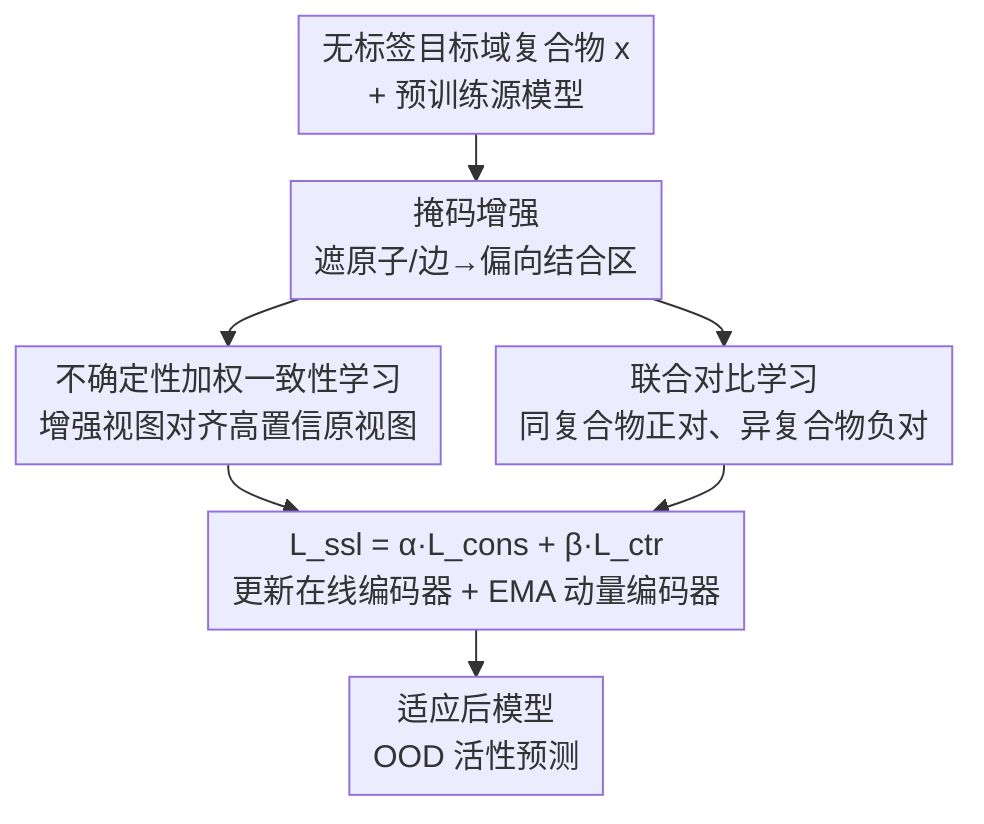

# Test-Time Adaptation without Source Data for Out-of-Domain Bioactivity Prediction

**会议**: ICLR 2026  
**OpenReview**: [https://openreview.net/forum?id=0R6HLWvWYk](https://openreview.net/forum?id=0R6HLWvWYk)  
**代码**: 无  
**领域**: 计算生物 / 药物发现 / 测试时自适应  
**关键词**: 生物活性预测, 分布外泛化, 测试时自适应, 无源数据, 对比学习

## 一句话总结
针对"拿不到源训练数据、只有一个预训练好的源模型"这种真实药物发现场景，本文提出 TAB——一个测试时自适应框架，用不确定性加权的一致性学习把模型注意力逼向真实结合区域、压制对捷径子结构的依赖，再用对比学习防止表征坍缩，从而在 scaffold / protein / assay 三类分布漂移下都稳定超过需要源数据的 SOTA 方法。

## 研究背景与动机

**领域现状**：蛋白-配体生物活性预测（预测一个小分子配体能多大程度调控目标蛋白的功能，输出 IC50 / EC50 / Kd / Ki 等亲和力数值）是现代药物发现的基石。近年主流做法是把"口袋-配体复合物"建成图，用图神经网络（GNN）来建模，代表性模型如 DTIGN、GIGN 把配体和蛋白的几何交互图整合起来，能较好刻画结合模式。

**现有痛点**：这些方法几乎都建立在"训练和测试数据来自同一分布"的假设上。但真实场景是动态且不确定的——实验条件在变、出现全新的分子骨架（scaffold）、碰到从未见过的蛋白（COVID-19 这种事件甚至会凭空带来全新的靶标蛋白）。一旦遇到这种分布外（OOD）情形，模型泛化能力急剧下降。

**核心矛盾**：已有的不变学习（IRM、GroupDRO）、图泛化（EERM、SR-GNN）等方法虽然能缓解 OOD，但它们**都要求完整访问源数据**：要么靠源数据构造多个训练环境来学不变性，要么靠源数据生成增强样本，要么分析源图结构找可迁移子图。而在现实中，源数据常常因为机密性、隐私或知识产权限制而**根本拿不到**——你只能拿到一个别人训练好的源模型。这个"无源数据 + OOD"的设定此前从未被研究过。

**切入角度**：作者抓住一个生物学事实——生物活性本质上由口袋-配体复合物内部**特定的结合相互作用**决定，配体不能独立起作用，活性高度依赖靶蛋白及其周围空间的几何排布。但模型容易染上"特权子结构偏置"（privileged substructure bias）：某些配体基团或蛋白表面模式在活性复合物里反复出现，却并非结合的因果决定因素（如激酶抑制剂数据集里大量带甲基取代苯环的活性配体）。模型会把这些**非因果捷径**当成预测信号，导致过拟合、跨域崩盘。

**核心 idea**：既然拿不到源数据，就在**测试时**用自监督目标直接更新模型——用一致性学习把注意力从捷径子结构引向真实结合区域，用对比学习保持表征可区分性，两者互补，从而在不碰任何源数据的前提下学到"对生物活性敏感、对分布漂移不变"的表征。

## 方法详解

### 整体框架

TAB（Test-time Adaptation for Bioactivity prediction）的输入是一批**无标签的目标域**口袋-配体复合物图 $x=(V,E)$（节点是原子、边是化学键），监督信号只有一个预训练源模型；输出是适应后模型在目标域上的活性预测。整个适应过程就是在测试集上最小化一个自监督损失 $\min_\theta \mathbb{E}_{x\sim D_{test}}[L_{ssl}(f_\theta(x))]$，不需要任何标签、不接触任何源样本/特征/统计量。

具体地，对每个复合物，先用"随机掩码原子和边特征"生成增强视图。由于结合界面只占整个复合物很小一部分，被掩掉的内容大多落在结合位点之外，于是掩码天然把注意力导向结合区域。基于增强视图，TAB 同时跑两条自监督支路：上半部分是**不确定性加权的一致性学习**——让增强视图向"高置信度的原始视图"对齐（最小化余弦特征距离），并用 Monte-Carlo dropout 估计的置信度给每个样本加权；下半部分是**联合对比学习**——把同一复合物的两个增强视图当正对、不同复合物当负对拉开，配一个 MoCo 式的动量编码器和记忆队列来稳定特征空间、扩充负样本。总损失 $L_{ssl}=\alpha L_{cons}+\beta L_{ctr}$ 联合优化在线编码器，动量编码器用 EMA 跟随更新。

### 关键设计

**1. 无源数据测试时自适应设定 + 掩码增强：把"够不到源数据"变成可解的自监督问题**

本文第一个贡献其实是问题设定本身。已有的 fine-tuning、持续学习、域适应都至少需要目标标签或源数据中的一部分（见原文 Table 1 的对照），唯独不能覆盖"源数据、目标标签都没有、只有源模型"这种最受限的现实场景。TAB 把适应过程形式化为在无标签目标集上最小化自监督损失 $\min_\theta \mathbb{E}_{x\sim D_{test}}[L_{ssl}(f_\theta(x))]$，从而绕开对源数据的依赖。

支撑整个自监督的基础操作是**随机掩码原子和边特征**生成增强视图 $T(x)$。这一步看似简单，却精准切中"特权子结构偏置"：因为结合界面只占复合物极小比例，被掩掉的绝大部分是结合位点外围的原子和边，模型被迫不能依赖那些反复出现的外围捷径子结构；同时即便偶尔遮住个别关键原子，核心的几何线索和结合姿态仍大体保留，所以注意力被自然引向结合区域而不破坏关键信号。掩码增强既是消除捷径的手段，也是后面一致性/对比两条支路共享的"扰动源"。

**2. 不确定性加权的一致性学习：让增强视图向可信的原始视图看齐，且只信得过的样本说话**

一致性支路的目标是"对齐每个复合物的原始表征 $f^o_i=f_\theta(x_i)$ 和它扰动后的表征 $f^a_i=f_\theta(T(x_i))$"，用最小化余弦距离 $1-\frac{f^o_i\cdot f^a_i}{\|f^o_i\|\|f^a_i\|}$ 实现。直觉是：如果模型真的抓住了结合相关的不变特征，那么遮掉一堆外围捷径子结构后，表征不应该大变；反过来强行让两者一致，就会逼模型放弃对捷径的依赖、聚焦结合区域。

但并非所有样本都同样可信，盲目对齐噪声样本会让适应失稳。为此作者引入**不确定性加权**：用 Monte-Carlo dropout 对原始输入做 $K$ 次随机前向，得到 $K$ 个特征样本，算出均值 $\mu_i$ 和方差 $\sigma^2_i=\frac{1}{K-1}\sum_k\|f^{(k)}_\theta(x_i)-\mu_i\|^2$，把置信度定义为方差的倒数 $w_i=1/(\sigma^2_i+\epsilon)$。方差小（预测稳定）的样本权重大，方差大（模型自己都拿不准）的样本被压低。最终一致性损失为

$$L_{cons}=\frac{1}{B}\sum_{i=1}^{B} w_i\cdot\Big(1-\frac{f^o_i\cdot f^a_i}{\|f^o_i\|\|f^a_i\|}\Big).$$

这样高置信样本主导适应方向，避免错误在 OOD 这种本就难的条件下被放大传播。

**3. 联合对比学习 + 动量编码器：防止只做一致性导致的表征坍缩**

只做一致性学习有个隐患：一味拉近正对会把表征压得过于紧凑，不同复合物的特征都挤到一起，丧失可区分性（消融里"w/o contr"和"只用一致性"反而偶尔不如基线，正是这个原因）。对比支路就是来补这一刀的：它把**同一复合物的两个增强视图** $T(x)$ 与 $T(x)'$ 当正对、不同复合物当负对，按 instance-discrimination 原则拉近正对、推远负对，强化结合相关信号、锐化"活性相关 vs 无关特征"的边界。

为了扩充负样本多样性，作者维护一个 FIFO 的**记忆队列** $Q$ 存历史 mini-batch 的特征；为了稳住特征空间、避免每个 batch 剧烈抖动，采用 MoCo 式**动量编码器** $f_{\theta'}$，其参数从源权重初始化、用 EMA 更新 $\theta'\leftarrow m\theta'+(1-m)\theta$，无需每个 batch 反传就能提供稳定的特征。对比损失为

$$L_{ctr}=-\frac{1}{B}\sum_{i=1}^{B}\log\frac{\exp(f^a_i\cdot f^{a'}_i/\tau_c)}{\sum_{j=1}^{B}\exp(f^a_i\cdot f^{a'}_j/\tau_c)+\sum_{q=1}^{|Q|}\exp(f^a_i\cdot f^a_q/\tau_c)},$$

其中 $f^a$ 是在线编码器输出、$f^{a'}$ 是动量编码器输出（不回传梯度并入队），$\tau_c$ 是温度。一致性与对比两条支路互补——前者把注意力锚定在结合区域，后者保证表征不坍缩，合起来才得到"不变又有判别力"的生物活性感知表征。

### 损失函数 / 训练策略
总自监督损失 $L_{ssl}=\alpha L_{cons}+\beta L_{ctr}$，$\alpha,\beta$ 分别为一致性/对比权重。每个 batch 流程（见原文 Algorithm 1）：① 取原视图 $x^o=x$、增强视图 $x^a=T(x)$；② MC dropout 算置信度权重 $w$；③ 算一致性损失 $L_{cons}$；④ 再生成一个增强视图 $x^{a'}=T(x)'$，算对比损失 $L_{ctr}$；⑤ 梯度下降更新在线编码器 $\theta$；⑥ EMA 更新动量编码器 $\theta'$。所有实验统一用 DTIGN 作骨干，保证公平对比。

## 实验关键数据

### 主实验

DTIGN（scaffold OOD，8 个蛋白靶标子集取平均）上 TAB 全面领先。注意所有对比方法都**需要访问源数据**，而 TAB 是无源的：

| 数据集 | 指标 | 本文 TAB | 最优基线 | 提升 |
|--------|------|---------|----------|------|
| DTIGN (avg) | RMSE ↓ | 1.157 | ~1.209 (ERM) | -4.3% |
| DTIGN (avg) | Pearson R ↑ | 0.448 | 0.414 (ERM) | +8.2% |
| DTIGN (avg) | Kendall τ ↑ | 0.312 | 0.295 | +5.8% |
| SIU 0.6 (Kd) | R / τ / ρ ↑ | 0.393 / 0.283 / 0.419 | 0.384 / 0.257 / 0.381 (SR-GNN) | 全面领先 |
| SIU 0.6 (Ki) | R / τ / ρ ↑ | 0.141 / 0.115 / 0.175 | 0.123 / 0.060 / 0.091 (ERM) | 大幅提升 |
| DrugOOD (assay) | R / τ ↑ | 0.388 / 0.230 | 0.269 / 0.170 | 显著提升 |
| DrugOOD (protein) | RMSE ↓ / R ↑ | 1.319 / 0.144 | 1.367 / 0.018 (ERM) | -3.5% / +0.126 |

一个有意思的现象：在 DTIGN 上，许多需要源数据的 OOD 方法（IRM、GroupDRO、Mixup-GNN 等）平均下来**还不如最朴素的 ERM**，说明强行套用通用 OOD 技巧到生物活性预测并不奏效；而 TAB 在几乎所有指标上稳定超越。DrugOOD 的 assay 任务上 TAB 的 RMSE（1.552）略高于 ERM（1.506），但相关性指标（R 从 0.119→0.388）大幅领先——说明 TAB 更擅长把活性的**相对排序**预测对，这对药物筛选更有价值。

### 消融实验

DTIGN 8 子集平均（"w/o contr"去对比、"w/o cons"去一致性）：

| 配置 | RMSE ↓ | R ↑ | τ ↑ | 说明 |
|------|--------|-----|-----|------|
| TAB (full) | 1.157 | 0.448 | 0.312 | 完整模型，全部最优 |
| w/o contrastive | 1.191 | 0.432 | 0.285 | 去掉对比，τ 掉得最明显 |
| w/o consistency | 1.201 | 0.427 | 0.295 | 去掉一致性，R 下降 |
| ERM | 1.209 | 0.414 | 0.295 | 不适应基线 |

### 关键发现
- **两个模块缺一不可且互补**：单独用一致性或单独用对比，有时甚至会低于基线——只做一致性会让表征过度压缩、判别性变弱；只做对比则可能在缺乏正则下放大虚假差异。两者合起来才稳定超过 ERM，验证了"一致性锚定结合区域 + 对比防坍缩"的互补设计。
- **TAB 真的看对了地方**：作者用扰动归因（随机移除配体原子、相连口袋原子及分子间边，看预测变化 $\Delta\hat{y}=\hat{y}_{ori}-\hat{y}_{per}$）做 case study。破坏结合相互作用后活性理应下降，$\Delta\hat{y}$ 应为正；但 ERM 基线竟出现**负值**，暴露它依赖了无关位点；TAB 则稳定给出显著更大的正 $\Delta\hat{y}$，证明它真正聚焦在相关结合区域。
- **相关性指标受益最大**：TAB 在 R / τ / ρ 这类排序相关指标上的提升通常远大于 RMSE，说明无源 TTA 主要修复的是"跨域排序错乱"而非绝对数值标定。

## 亮点与洞察
- **把"拿不到源数据"这个现实约束正式化并给出首个方案**：机密性/隐私/知识产权在药物发现里是硬约束，本文是第一个研究无源数据 OOD 生物活性预测的工作，问题设定本身就有价值。
- **掩码增强一举两得**：因为结合界面占比小，随机掩码大概率掩到外围捷径子结构，既消除特权子结构偏置又顺带把注意力导向结合区域，无需额外的注意力监督。这个"利用结构稀疏性"的思路可迁移到其他界面占比小的生物结构任务。
- **不确定性加权用 MC dropout 现成实现**：方差倒数当置信度，零额外标注、零源数据，就能在 OOD 这种高噪声场景下稳住适应方向，是个轻量可复用的 trick。
- **把 CV 里成熟的一致性 + MoCo 对比迁到分子图 TTA**：作者指出分子数据有结构复杂、子结构偏置、结合区域建模等独有挑战，CV 的 TTA 不能直接照搬，本文做了首个面向生物活性的定制化 TTA。

## 局限与展望
- **DrugOOD 需要先做分子对接**：DrugOOD 只给 SMILES 和氨基酸序列，缺交互信息，作者靠 molecular docking 补全 3D 结构（细节在附录）。对接质量会直接影响结果，且对接本身有计算成本和误差。
- **assay 任务 RMSE 反而略升**：在 DrugOOD assay 上 RMSE 比 ERM 高，说明 TAB 优化的是排序一致性，绝对数值标定不一定更好——若下游需要精确活性数值而非排序，收益有限。
- **骨干受限**：全部实验固定 DTIGN 作骨干，TAB 在其他类型（如序列模型、非几何 GNN）骨干上的适应效果未验证。
- **超参依赖**：MC dropout 次数 $K$、温度 $\tau_c$、动量 $m$、权重 $\alpha/\beta$ 等都需调，论文正文未给敏感性分析（在附录），实际部署在全新靶标上时调参成本未知。

## 相关工作与启发
- **vs 不变学习（IRM / GroupDRO / CIA-LRA / CaNet）**：它们靠源数据构造多训练环境学不变性，TAB 在测试时无源适应；DTIGN 实验里这些方法常不及 ERM，TAB 稳定超越。
- **vs 图 OOD（EERM / SR-GNN）**：它们分析源图结构找可迁移子图，仍需源数据；TAB 不碰源图，靠掩码 + 一致性自己逼出不变子结构。
- **vs CV 的 TTA（TTT / TTT-MAE / SHOT / MEMO）**：它们针对图像的旋转预测、掩码重建、伪标签等代理任务；TAB 针对分子图的结合区域建模和子结构偏置设计专门的一致性 + 对比目标，是首个生物活性 TTA。
- **vs 域适应（DANN / AFSE）**：需要源、目标数据同时在场训练；TAB 仅需目标数据。

## 评分
- 新颖性: ⭐⭐⭐⭐⭐ 首次提出并解决无源数据 OOD 生物活性预测，问题设定和方法都新。
- 实验充分度: ⭐⭐⭐⭐ 三个 benchmark、scaffold/protein/assay 三类漂移、消融 + 归因 case study 齐全；但缺超参敏感性正文展示、骨干单一。
- 写作质量: ⭐⭐⭐⭐ 动机（结合区域 vs 捷径子结构）讲得清楚，图 1/图 2 直观。
- 价值: ⭐⭐⭐⭐⭐ 直击药物发现中数据不可共享的真实痛点，无源适应实用性强。

<!-- RELATED:START -->

## 相关论文

- [\[ICLR 2026\] A New Paradigm for Genome-wide DNA Methylation Prediction Without Methylation Input](a_new_paradigm_for_genome-wide_dna_methylation_prediction_without_methylation_in.md)
- [\[AAAI 2026\] GP-MoLFormer-Sim: Test Time Molecular Optimization through Contextual Similarity Guidance](../../AAAI2026/computational_biology/gp-molformer-sim_test_time_molecular_optimization_through_contextual_similarity_.md)
- [\[ICLR 2026\] Adaptive Data-Knowledge Alignment in Genetic Perturbation Prediction](adaptive_data-knowledge_alignment_in_genetic_perturbation_prediction.md)
- [\[ICLR 2026\] Towards Knowledge-and-Data-Driven Organic Reaction Prediction: RAG-Enhanced and Reasoning-Powered Hybrid System with LLMs](towards_knowledgeanddatadriven_organic_reaction_prediction_ragenhanced_and_reaso.md)
- [\[ICLR 2026\] Refine Drugs, Don't Complete Them: Uniform-Source Discrete Flows for Fragment-Based Drug Discovery](refine_drugs_dont_complete_them_uniform-source_discrete_flows_for_fragment-based.md)

<!-- RELATED:END -->
