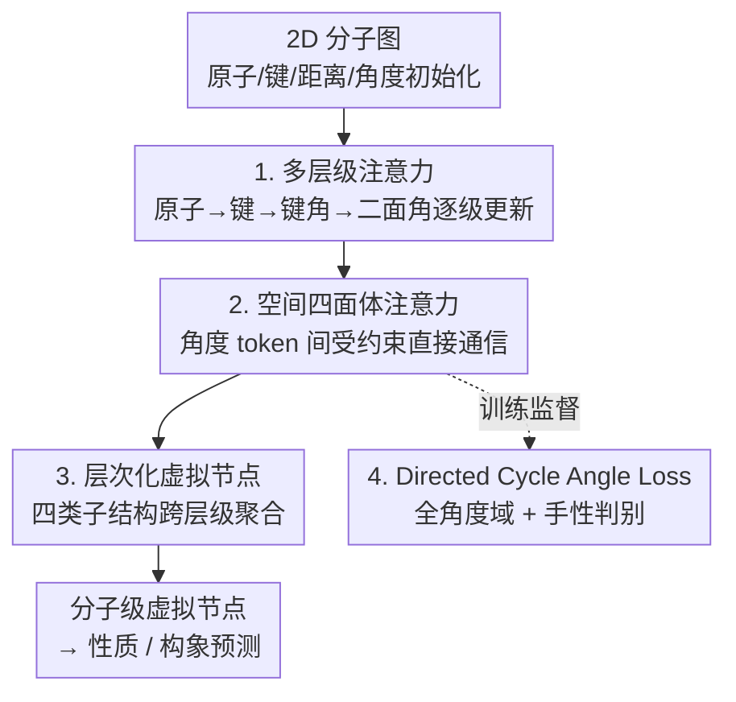

# TetraGT: Tetrahedral Geometry-Driven Explicit Token Interactions with Graph Transformer for Molecular Representation Learning

**会议**: ICLR 2026  
**OpenReview**: [https://openreview.net/forum?id=3WVihbSW0i](https://openreview.net/forum?id=3WVihbSW0i)  
**代码**: https://github.com/xkxxfyf/TetraGT  
**领域**: 计算生物 / 分子表示学习 / 图 Transformer  
**关键词**: 分子几何、键角与二面角、四面体注意力、手性判别、构象预训练

## 一句话总结
TetraGT 首次把分子的键角、二面角当成显式 token 喂进图 Transformer，用一套受四面体几何约束的"空间四面体注意力"让这些角度 token 直接互相通信，再配上能判别手性的有向循环角损失和层次化虚拟节点，在 PCQM4Mv2、OC20 IS2RE 等量子化学基准上刷到 SOTA，并在 QM9、PDBBind、Peptides、LIT-PCBA 等下游迁移任务上同样领先。

## 研究背景与动机

**领域现状**：预测酶催化活性、药物活性、分子光谱这类性质，本质上取决于分子的三维构象，而键角、二面角又是决定构象稳定性的关键几何参数。沿着 Transformer 的成功，图 Transformer（Graphormer、EGT、Uni-Mol+、TGT 等）成为分子表示学习的主流，近期工作还借鉴 AlphaFold 引入了"三角不等式约束"的原子间距离预测，证明了几何约束能显著提升性质预测精度。

**现有痛点**：但这些方法只把分子表示为节点 token（原子）和边 token（键），更高阶的几何结构（键角、二面角）始终是从原子/边的组合里**间接**算出来的。作者总结出三个具体毛病：(1) **缺乏局部手性**——手性不同的分子可能产生几乎一样的距离矩阵，只靠距离根本分不开"左右手"；(2) **几何结构隐式建模**——像 QuinNet、ViSNet 这类引入四原子、五原子交互的模型，高阶信息仍是通过原子 token 间的组合运算隐式编码，几何参数的偏差会在间接表示里层层传播、累积；(3) **忽视结构间依赖**——现有方法没有显式刻画键角与二面角之间的相互约束关系，而正是这些关系共同决定了整体构象。

**核心矛盾**：高阶几何信息（角度）一旦只能"借"原子/边来表达，就既会累积误差，又丢掉了角度之间的物理约束（比如一个四面体里几个面角、二面角必须同时满足的不等式），导致预测出的构象物理上不自洽、还分不清手性。

**本文目标**：把键角、二面角提升为模型里的"一等公民"——直接作为结构化 token 表示和交互，同时在交互中显式注入四面体几何约束，并让模型能判别手性、能从零预测几何（不依赖 RDKit 之类的初始 3D 坐标）。

**切入角度**：作者搬出空间立体几何里的"面角与二面角不等式"——任意四个不共面原子构成一个四面体（几何 3-单纯形，不是化学上的 sp³ 中心），其面角、二面角必然满足一组不等式和一条面角-二面角换算公式。这给"角度之间该怎么互相约束"提供了现成的物理先验。

**核心 idea**：用"显式角度 token + 受四面体不等式约束的注意力"取代"原子组合隐式推角度"，让键角、二面角直接对话并自然满足几何一致性。

## 方法详解

### 整体框架
TetraGT 是一个 $L$ 层的图 Transformer，每层同时维护四种 token 的 embedding：节点 $h^{(l)}$（原子）、边 $e^{(l)}$（键）、键角 $b^{(l)}$、二面角 $t^{(l)}$。输入是原子特征 $X\in\mathbb{R}^{n\times d_x}$、边特征 $E$、距离矩阵 $D$、全部键角 $B\in\mathbb{R}^{n_b}$ 和二面角 $T\in\mathbb{R}^{n_t}$；二面角 token 在初始化时就用原子、边表示再叠加面角信息构造，从而把四面体约束"种"进表示里。一层之内分两步走：先用**多层级注意力**沿"原子 → 键 → 键角 → 二面角"逐级更新表示，再用**空间四面体注意力**让同一顶点/同一公共面的角度 token 之间直接交互；穿插**层次化虚拟节点**做跨层级的全局聚合；训练侧再用 **Directed Cycle Angle Loss** 监督角度并判别手性。

整篇方法围绕"让角度 token 显式存在、并在满足四面体几何约束的前提下高效通信"这条主线展开，pipeline 清晰，给出框架图便于图文对照：

### 关键设计

**1. 多层级注意力：让角度 token 显式存在并逐级更新**

针对"高阶几何只能从原子组合里间接推"的痛点，TetraGT 在每一层都把四类子结构当成真正的 token 来更新。节点和边先走标准的注意力，节点表示由边引导聚合、边表示由 Query-Key 内积加上一层的边表示构成：

$$h^{(l)} = \mathrm{softmax}\!\left(e^{(l)}\,\sigma(e^{(l-1)}W^{(l,e)}_G)\right)h^{(l-1)}W^{(l,h)}_V,\quad e^{(l)} = \frac{h^{(l-1)}W^{(l,h)}_Q\,(h^{(l-1)}W^{(l,h)}_K)^\top}{\sqrt{d_h}} + e^{(l-1)}W^{(l,e)}_E$$

关键在角度怎么更新：键角 $b^{(l)}_{ijk}$ 直接由组成它的两条边 $(ij),(jk)$ 的**当前层**边表示相加、再叠加上一层键角表示得到；二面角 $t^{(l)}_{ijkl}$ 则由三条连续边 $(ij),(jk),(kl)$ 的边表示相加得到。这样表示就沿"原子 → 键 → 键角 → 二面角"的层级自然往上长，高阶结构有了独立、可学习的载体，几何参数的偏差不必再绕着原子/边间接传播。

**2. 空间四面体注意力：让角度 token 在四面体约束下直接通信**

光有角度 token 还不够——它们之间得能交互，但"任意三元组、四元组都两两交互"在原子数变大时计算量爆炸（$O(N^3)$），而且很多任意子结构在物理上没有意义。TetraGT 的解法是只在**四面体结构**内选择性地建模有意义的高阶交互，并用局部采样把每个角度只对其 $w$ 个最近邻做注意力，把复杂度降到 $O(wN^2)$。

以一个中心键角 $(i,j,k)$ 为例，它和共享顶点 $k$ 的邻居键角做"面交互"：

$$o^f_{jki} = \sum_{l\in N_w(j)} a^f_{ijkl}\,v^f_{lkj},\quad a^f_{ijkl} = \mathrm{softmax}_l\!\left(\frac{q^f(b_{jki})\cdot p^f(t_{lkj})}{\sqrt{d}} + b^f(b_{lki})\right)\sigma\!\big(g^f(b_{lki})\big)$$

二面角之间的"二面交互"形式对称，固定的几个原子天然构成公共底面键角，保证参与交互的二面角不会是完全不相连的原子拼出来的。这里最巧的是偏置项 $b^f$ 和门控项 $g^f$ 都是从角度 embedding 派生的标量，分别注入了 Lemma 1 的面角不等式（$\theta_1+\theta_2>\theta_3$、$\theta_1+\theta_2+\theta_3<2\pi$）、二面角不等式以及面角-二面角换算关系

$$\cos(t_{ijkl}) = \frac{\cos(b_{jki}) - \cos(b_{lki})\cos(b_{lkj})}{\sin(b_{lki})\sin(b_{lkj})}$$

也就是说，注意力不只是学相似度，还被几何约束"掰"向物理上合法的交互，让预测出的构象全局一致、物理可行。交互后用残差加 FFN 更新角度表示：$b^{(l)} = b^{(l-1)} + \mathrm{FFN}(o^f_{jki})$，$t^{(l)} = t^{(l-1)} + \mathrm{FFN}(o^d_{ijkl})$。

**3. Directed Cycle Angle Loss：用方向性把手性显式判别出来**

距离矩阵分不清手性——手性翻转时，至少有一个角度会在固定参考方向上从 $\sigma$ 变成 $2\pi-\sigma$，但两种取值对应的距离矩阵完全相同，在分子末端这种手性引起的距离差异更是几乎不可见。以往做法常把角度限制在 $0$–$\pi$，恰好把手性变化抹掉了。TetraGT 把角度预测范围扩到 $(0,2\pi)$、以逆时针为主方向，从而能容纳所有手性情形；并且把角度离散成 bin、用一个**有向循环分箱损失**：

$$\mathcal{L}_{\mathrm{DCA}} = \min\!\left(-\sum_{i=1}^{N} q_i\log(p_i),\; -\sum_{i=1}^{N} q_i\log(p_{(i+1)\bmod N})\right)$$

取相邻 bin 的循环最小值，是为了照顾边界情况：359° 和 1° 在概念上很接近，但数值上离很远，循环结构避免了对这种"近邻角度"的过度惩罚。靠把方向性显式编进角度，TetraGT 成为首个通过角度建模实现手性感知的分子表示方法。

**4. 层次化虚拟节点：缓解跨阶信息压缩的瓶颈**

虚拟节点能缩短图上的信息瓶颈，但以往要么把所有原子信息压成一个虚拟节点（丢掉结构细节），要么只在原子层级加虚拟节点（不足以表达 3D 交互）。TetraGT 给原子、边、键角、二面角**每类子结构各配一个专属虚拟节点**，分别用合适的机制与同类型 token 交互：原子用 FFN、边用三元组交互、键角和二面角用四面体交互。最后再用一个分子级虚拟节点连接这四个子结构虚拟节点，作为做性质预测的最终表示，从而在不同结构阶之间做多尺度聚合而不互相挤压。

### 损失函数 / 训练策略
TetraGT 的性质预测任务走**三阶段**训练。① **构象预测阶段**：训练一个构象预测器，从 2D 分子图（可选地附带 RDKit 初始距离估计）预测全部原子间距离、键角、二面角；距离用交叉熵、角度用上面的 DCA loss，且仿照 TGT 预测分箱角度而非连续值（因为二面角不稳定、易随能量涨落突变）。② **预训练阶段**：在带噪的真实 3D 构象上训练任务预测器，距离/角度预测作为辅助去噪任务，和预训练数据集主任务（如 HOMO-LUMO gap）一起做多任务学习，使任务预测器对输入噪声鲁棒。③ **微调阶段**：冻结预训练好的构象预测器（以带 dropout 的随机模式生成高精度 3D 特征），把预测的距离、键角、二面角喂给任务预测器，在下游数据集上联合优化主任务与距离/角度辅助任务。

## 实验关键数据

### 主实验
TetraGT 在大规模量子化学基准上刷新 SOTA：

| 数据集 | 指标 | 本文 | 之前 SOTA | 提升 |
|--------|------|------|----------|------|
| PCQM4Mv2 (valid) | MAE (meV)↓ | 65.9（24层+RDKit） | 67.1 (TGT+RDKit) | -1.2 meV |
| PCQM4Mv2 (valid) | MAE (meV)↓ | 67.1（24层，纯2D） | 67.1 (TGT 需 RDKit) | 纯 2D 追平 |
| OC20 IS2RE | Energy MAE (meV)↓ (AVG) | 397.7 | 403.0 (TGT) | -5.3 meV |
| OC20 IS2RE | EwT (%)↑ (AVG) | 9.14 | 8.82 (TGT) | +0.32 |
| LIT-PCBA | ROC-AUC (%)↑ | 82.4 | 81.5 (TGT/GEM-2) | +0.9 |
| PDBBind core | R↑ / MAE↓ | 0.852 / 0.909 | 0.830 / 0.940 (Transformer-M) | R +0.022 |
| Peptides-struct | MAE↓ | 0.2421 | 0.2449 (Graph ViT) | -0.0028 |
| Peptides-func | AP (%)↑ | 72.86 | 71.50 (DRew) | +1.36 |

值得注意的是：纯靠 2D 分子图、不输入 RDKit 构象的 24 层 TetraGT 就能追平用了 RDKit 的 TGT，说明显式建模高阶子结构确实能"从零预测几何"。QM9 上 TetraGT 在 12 项性质中拿下 5 项 SOTA，并在所有目标上超过 TGT，尤其在 HOMO ($\epsilon_H$)、LUMO ($\epsilon_L$)、gap ($\Delta\epsilon$) 这些与预训练目标最对齐的轨道能量任务上优势明显；而依赖长程极化/全局形状的性质提升相对有限，与"预训练监督偏向能量/轨道"这一物理直觉吻合。

### 消融实验
角度交互机制对比（PCQM4Mv2 validation-3D，Table 7）：

| 配置 | 距离交叉熵↓ | 角度交叉熵↓ | 每 epoch 耗时 |
|------|------------|------------|--------------|
| 无注意力 | 1.204 | - | 1.00× |
| 轴向注意力 | 1.164 | 1.310 | 1.36× |
| 全注意力 | 1.179 | 1.307 | 1.43× |
| 四面体注意力（本文） | 1.125 | 1.231 | 1.12× |

三大设计逐项消融（PCQM4Mv2，Table 8）：

| 配置 | Val. MAE (meV)↓ | 说明 |
|------|-----------------|------|
| 全去掉 | 73.6 | 朴素图 Transformer 基线 |
| + 四面体交互模块 | 71.0 | 贡献最大（-2.6） |
| + DCA loss | 70.6 | 进一步稳定优化 |
| + 层次化虚拟节点 (1:1) | 70.2 | 多尺度聚合 |
| 距离:角度损失比最优 | 68.8 | 最佳损失配比（⚠️ 表中标 4:1、正文文字写 1:4，方向以原文为准） |

### 关键发现
- **四面体交互模块贡献最大**：在三大设计中，从 73.6 → 71.0 的单步降幅最显著；它既比轴向/全注意力更准（距离交叉熵 1.125 最低），额外开销又最小（仅 1.12× 每 epoch，远低于全注意力的 1.43×），说明"按四面体几何选择性交互 + 局部采样"是精度与效率兼得的关键。
- **几何约束注入有效**：把 Lemma 1 的不等式与面角-二面角换算塞进注意力的偏置/门控项，让预测构象更物理自洽，这也是纯 2D 输入就能追平用 RDKit 方法的原因。
- **效率友好**：6/12/24 层模型在 PCQM4Mv2 和 OC20 上都能用相当或更短的训练/推理时间打过 Uni-Mol+ 和 TGT；OC20 预训练成本仅 33 A100 GPU-days，不到 Uni-Mol+（112）的三分之一。
- **更深才能编码更高阶结构**：12 层与 24 层之间仍有明显差距，提示编码高阶子结构需要更深的网络和更大容量。

## 亮点与洞察
- **把"几何不等式"变成注意力的偏置/门控**：不是软约束 loss，而是直接在注意力打分里注入四面体面角/二面角不等式和换算公式，让交互被物理先验"掰"向合法构象——这种"几何先验即归纳偏置"的做法可迁移到任何需要满足结构约束的 token 交互。
- **手性靠"方向 + 循环损失"解决得很优雅**：把角度域从 $0$–$\pi$ 扩到 $(0,2\pi)$、用循环最小损失处理 359° vs 1° 的边界，既判别了手性又不被分箱边界误伤，是一个很可复用的角度回归技巧。
- **层次化虚拟节点给每个结构阶各留一个"总线"**：相比一股脑压成单个全局节点，按原子/边/键角/二面角分别配虚拟节点再汇总，缓解了跨阶信息压缩瓶颈，思路可借到任何多粒度图任务。
- **局部采样把 $O(N^3)$ 降到 $O(wN^2)$**：只对最近的 $w$ 个邻居做高阶交互，让"显式高阶 token"在大分子上仍然算得起。

## 局限与展望
- 作者展望的方向是研究分子几何参数的**动态表示**（空间立体化学），给结构预测加更有效、合理的几何约束——暗示当前模型主要刻画静态构象。
- 训练是三阶段、且依赖在 PCQM4Mv2 上做几何/性质预训练，pipeline 偏重，迁移到全新化学空间时预训练分布是否够覆盖值得关注。
- 消融里损失配比"4:1 vs 1:4"在表格与正文之间存在标注不一致（⚠️ 以原文为准），说明距离/角度损失权重对结果较敏感，需谨慎调参。
- 显式建模二面角带来表达力，但更深才有效（12 层 vs 24 层差距明显），算力门槛随之上升；对超大分子体系的可扩展性主要靠局部采样支撑，极端规模下的精度损失未充分讨论。

## 相关工作与启发
- **vs Uni-Mol+ / TGT**：它们把 AlphaFold 式的"三角不等式约束"用在**边级**的原子间距离预测上，几何约束止步于边；TetraGT 把不等式原理从边推广到更高阶元素——用**四面体不等式**约束键角、二面角之间的交互，相当于"从三角形升维到四面体"，并因此能从零预测几何、还能判手性。
- **vs QuinNet / ViSNet**：它们引入四原子、五原子交互来增强表达力，但高阶信息仍是原子 token 间的**隐式组合**，偏差会累积；TetraGT 把键角/二面角做成**显式一等 token**，从源头减少间接表示带来的误差传播。
- **vs Graphormer / EGT 系**：Graphormer 类以原子为 token、靠位置编码和注意力偏置隐式编码键和空间结构；EGT 类把边 embedding 当 token。两者都只到节点级/边级；TetraGT 在它们之上补齐了键角级、二面角级 token 及其相互依赖建模。

## 评分
- 新颖性: ⭐⭐⭐⭐⭐ 首次把键角/二面角作显式 token 并用四面体不等式约束其交互，手性判别角度也很巧
- 实验充分度: ⭐⭐⭐⭐⭐ 覆盖量子化学、催化、结合亲和、肽、药物发现多基准 + 完整消融与效率分析
- 写作质量: ⭐⭐⭐⭐ 几何理论铺陈清晰，但部分公式符号密集、损失配比标注存在前后不一致
- 价值: ⭐⭐⭐⭐⭐ 给分子表示提供了"几何先验即归纳偏置"的可迁移范式，且效率友好、能纯 2D 预测几何

<!-- RELATED:START -->

## 相关论文

- [\[ICLR 2026\] Enhancing Molecular Property Predictions by Learning from Bond Modelling and Interactions](enhancing_molecular_property_predictions_by_learning_from_bond_modelling_and_int.md)
- [\[ICLR 2026\] Learning Explicit Single-Cell Dynamics Using ODE Representations](learning_explicit_single-cell_dynamics_using_ode_representations.md)
- [\[ICLR 2026\] Learning Brain Representation with Hierarchical Visual Embeddings](learning_brain_representation_with_hierarchical_visual_embeddings.md)
- [\[ICLR 2026\] SAIR: Enabling Deep Learning for Protein-Ligand Interactions with a Synthetic Structural Dataset](sair_enabling_deep_learning_for_protein-ligand_interactions_with_a_synthetic_str.md)
- [\[ICLR 2026\] Graph Diffusion Transformers are In-Context Molecular Designers](graph_diffusion_transformers_are_in-context_molecular_designers.md)

<!-- RELATED:END -->
