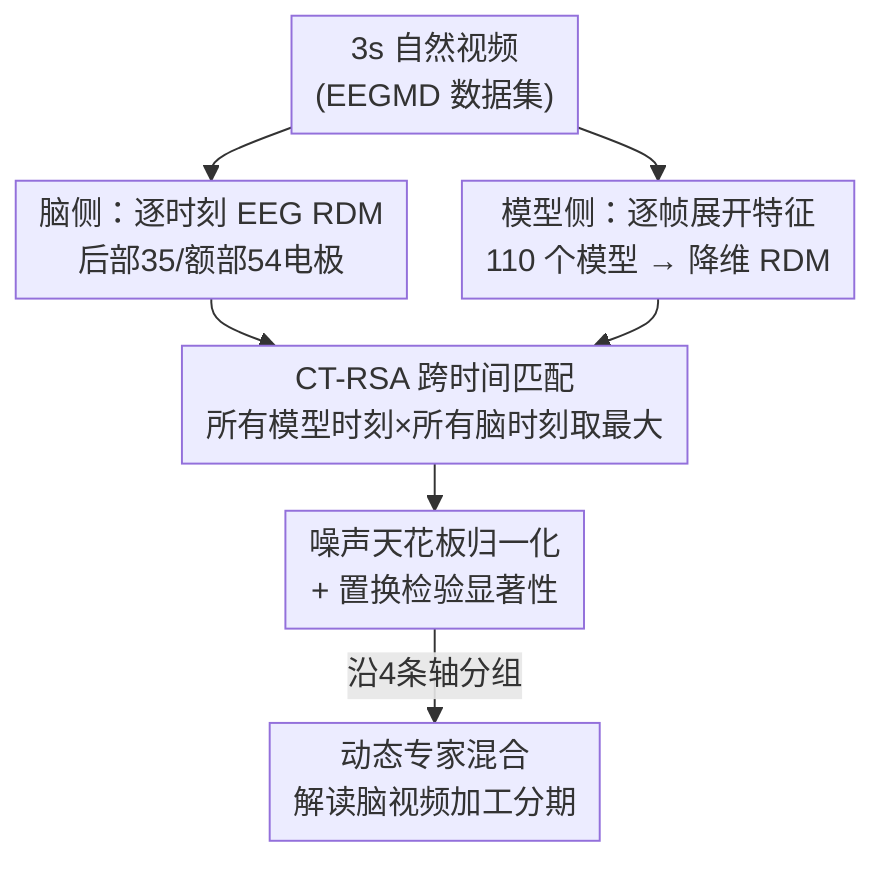

# The Human Brain as a Dynamic Mixture of Expert Models in Video Understanding

**会议**: ICLR 2026  
**OpenReview**: [https://openreview.net/forum?id=bSsNSfyj8m](https://openreview.net/forum?id=bSsNSfyj8m)  
**代码**: https://github.com/cvai-roig-lab/Net2Brain （CT-RSA 已并入 Net2Brain 库）  
**领域**: 计算神经科学 / 视频理解 / 表征对齐  
**关键词**: EEG、模型-脑对齐、视频理解、时序整合、表征相似性分析

## 一句话总结
作者首次在大规模 EEG（脑电）动态记录上对 110 个视频/图像深度模型做"模型-脑表征对齐"基准，提出跨时间表征相似性分析（CT-RSA）把模型逐帧特征与脑响应逐毫秒匹配，发现大脑在看 3 秒短视频时的神经偏好随时间不断切换（从静态低级→静态高级物体→中级时序动作），不同脑区（后部 vs 额部）和不同时刻偏爱不同类型的模型，因此最佳"对齐模型"不存在于任何单一网络，而更像一个能动态切换的"专家混合体"。

## 研究背景与动机
**领域现状**：表征对齐（representational alignment）是计算认知神经科学的核心工具——把任务训练好的深度网络的内部表征拿来和大脑活动比对，谁对得越好，就说明它越可能捕捉到大脑解决某类视觉任务所用的机制。过去十几年这条路线在视觉皮层上很成功，但绝大多数工作只用 **fMRI**（功能磁共振）做对齐。

**现有痛点**：fMRI 受限于缓慢的血氧（BOLD）响应，时间分辨率以秒计，根本无法刻画大脑在毫秒尺度上的精细动态。而真实世界是**动态视频**，时间上下文会强烈改变视觉加工方式（神经响应有时间适应、动作信息需要上下文整合）。用静态图像得到的结论不会自动推广到真实视频场景。已有的视频 fMRI 基准（Sartzetaki 等 2025）揭示了架构/任务/时序整合三条变化轴对脑对齐的影响，但因为 fMRI 时间太糊，既看不到脑响应的丰富动态，也没用上模型特征自身随时间展开的那一维。

**核心矛盾**：一边是大脑在看视频时神经表征**随时间剧烈演化**（毫秒级），一边是测量手段（fMRI）把时间糊掉了；同时模型特征本身也是逐帧展开的时序对象，但以往对齐方法把它压成一个静态向量，丢掉了"模型时间 ↔ 脑时间"这层对应关系。

**本文目标**：(1) 建立第一个面向自然视频的大规模 **EEG** 模型-脑对齐基准；(2) 设计一种能把模型逐帧特征与脑逐时刻响应做无假设匹配的对齐度量；(3) 沿时序整合、分类任务、架构、预训练四条轴系统比较 110 个模型，刻画大脑视频加工的动态规律。

**切入角度**：既然 EEG 有毫秒级时间分辨率、又能拿到逐帧的模型特征，那就别再假设"第几帧对应第几毫秒"，而是把所有模型时刻 × 所有脑时刻全配一遍，让数据自己告诉我们哪一刻的模型特征最像哪一刻的大脑。

**核心 idea**：用"跨时间最大匹配"代替"固定帧-时刻对应"，在毫秒级 EEG 上观察不同类型模型随时间此消彼长的对齐强度，从而把大脑的视频加工解读为一个**随时间动态切换的专家混合模型**。

## 方法详解

### 整体框架
方法要解决的是：怎么把"模型逐帧特征"和"大脑逐毫秒 EEG 响应"在不预设时间对应关系的前提下比对，并从海量比对里提炼出可解释的规律。整体分两步走——左半是**双系统时序表征抽取**，右半是**CT-RSA 跨时间对齐**。

第一步，对每段 3 秒短视频，分别从大脑和模型抽出"沿时间展开"的表征：大脑侧用 EEG 的某个电极子集（后部 35 通道 / 额部 54 通道），在每个 EEG 时刻 $t_N$ 构造一个跨被试平均的表征差异矩阵（RDM）；模型侧把每层、每个模型时刻 $t_M$ 的特征图拉平降维到 100 个主成分，得到逐时刻的特征向量，每层每时刻也构造一个 RDM。第二步，CT-RSA 把模型所有 $(L, t_M)$ 组合的 RDM 与脑所有 $t_N$ 的 RDM 两两算 Spearman 相关，对每个 EEG 时刻只保留相关最高的那个模型层和模型时刻，得到一条"脑时间 → 最佳对齐分数"的曲线。对 110 个模型、两个电极分区跑下来要处理超过 $10^7$ 个 RSA 分数，再用噪声天花板（noise ceiling）归一化、置换检验定显著性。最后沿四条变化轴（时序整合 / 任务 / 架构 / 预训练）分组比较曲线，读出大脑随时间切换偏好的图景。

### 关键设计

**1. CT-RSA：跨时间最大匹配，不预设模型帧与脑时刻的对应**

这是全文的方法核心，直接针对"模型在子采样帧间隔上算表征、而哪一帧对应哪一毫秒脑响应根本未知"这个痛点。传统 RSA（Kriegeskorte 2008）只比一对静态表征，作者把它扩展到时间维：对每个模型层 $l$ 和模型时刻 $t_M$、每个 EEG 时刻 $t_N$ 都算一遍 RDM 之间的 Spearman 相关 $R_{l\text{-}t_M t_N} = \rho(B_{t_N}, M_{l\text{-}t_M})$，然后**对每个 EEG 时刻只取所有层和模型时刻中相关最高的那一个**：$R_{t_N} = \max_{l\text{-}t_M}(R_{l\text{-}t_M t_N})$。其中脑 RDM 由跨被试平均得到，$B_{t_N}=\text{avg}_s(B_{s\text{-}t_N})$、$B^{ij}_{s\text{-}t_N}=1-r(v^i_{s\text{-}t_N}, v^j_{s\text{-}t_N})$，$r$ 为皮尔逊相关。这个"取最大"是关键——它不强加任何时间映射假设，让数据自己挑出每一刻最贴合大脑的模型特征，从而能从约 1000 个 RSA 分数里（层 × 时刻全组合）抽出可解释的对齐轨迹，并顺带支持研究动态预测与时间泛化。代价是"取最大"会在刺激出现前也制造虚高相关，作者在统计检验里专门减掉刺激前的平均观测相关来校正。

**2. 时序展开特征抽取 + 双系统逐时刻 RDM**

要做跨时间匹配，前提是模型和大脑两侧都得有"沿时间排开"的表征序列。痛点在于：以往对齐把模型特征压成一个静态向量，丢掉了模型内部随时间演化的那一维。作者的做法是把每段视频切成 $S$ 个长度为 $T$ 的子片段（每个模型的 $T$、采样率不同），对每层抽出形状 $(T, C, H, W)$ 的特征，再把时间维展开成 $T\times S = M$ 个模型时刻、每个形状 $(C, H, W)$ 的特征。每个特征图先经稀疏随机投影再 PCA 降到 100 个主成分得到 $f_{l\text{-}t_M}$，按 $M^{ij}_{l\text{-}t_M}=1-r(f^i_{l\text{-}t_M}, f^j_{l\text{-}t_M})$ 构造逐时刻 RDM。大脑侧对称地在每个 EEG 时刻（数据降采样到 50 Hz、做过多元噪声归一化 MVNN）构造跨被试平均 RDM。这样两侧都成了"时间 × RDM"的序列，CT-RSA 才有东西可配。

**3. 噪声天花板归一化与分组置换检验，让海量分数可比可信**

跨 110 个模型、两个分区、上百个时刻，会产出超过 $10^7$ 个 RSA 分数；不同电极子集、不同被试的信噪比天差地别，直接比大小会被噪声主导。作者按领域标准做法计算上/下噪声天花板（UNC/LNC）：UNC 取所有被试 RDM 的均值再与每个被试 RDM 求相关取平均，代表给定噪声水平下能解释的最大方差；所有报告分数都除以 UNC 归一化。显著性用置换检验：对每个 EEG 时刻取最佳层-时刻的模型 RDM，行列置换 10000 次构造零分布，对一组模型与零做双尾符号检验（并减掉刺激前相关校正虚高），两组模型间差异也用符号检验，最后跨时间点用 FDR 多重比较校正、要求连续两个时间点成簇才算显著。正是这套统计护栏，才让"后部电极某阶段视频模型显著超过图像模型"这类结论站得住。

### 损失函数 / 训练策略
本文不训练新模型、无损失函数。所用 110 个计算机视觉模型均为现成预训练网络：44 个 ImageNet 物体识别图像模型、10 个 Kinetics-400 动作识别图像模型、49 个 Kinetics-400 动作识别视频模型（含新增 3 个 VisionMamba、8 个 VideoMamba 状态空间模型），外加 7 个在 Kinetics-710 / Something-Something-v2 上训练的动作模型。EEG 数据来自新采集的 EEG Moments Dataset（EEGMD），对应 fMRI BOLD Moments Dataset 的同一批 1102 段 3 秒自然视频，6 名被试、128 电极、1000 Hz 采样，分析用 102 段测试集（24 次重复、信噪比更高）。

## 实验关键数据

### 主实验
分析沿四条轴展开，核心是把 3 秒视频加工切成四个时间阶段（I: 0.06–0.24s，II: 0.24–0.8s，III: 0.8–2s，IV: 2–3s），看哪类模型在哪个阶段、哪个脑区对齐最好。

| 脑区 / 阶段 | 主导表征类型 | 最佳对齐模型 | 关键现象 |
|------|------|------|------|
| 后部 阶段 I | 静态低级特征 | AlexNet | 图像模型显著超视频模型，靠早期层 |
| 后部 阶段 II | 静态高级物体 | DenseNet | 物体识别模型称霸，靠晚期层 |
| 后部 阶段 III | 中级时序动作 | MViT-v2 | 视频（时序整合）模型反超 |
| 后部 阶段 IV | 中级时序动作 | MViT-v2 | 视频模型维持优势但差距缩小 |
| 额部 阶段 I–II | 静态高级动作 | 静态动作识别模型 | 0.5s 处峰值最强，0.8s 后无显著对齐 |

后部电极还显示出**强时序对应**：早 EEG 时刻最匹配早模型时刻（接近 0），晚 EEG 时刻匹配渐晚的模型时刻（但只到约 0.6s）；额部电极则**完全没有**这种模型时间↔脑时间对应，跨模型分散很大。

### 消融实验

| 变化轴 / 配置 | 关键发现 | 说明 |
|------|---------|------|
| 上下文窗口 & 采样率 | 后部 III/IV 阶段对齐随帧数/fps 显著正相关 | 印证晚期后部加工依赖时序整合 |
| 架构：SSM vs CNN/Transformer | SSM 在后部 I–II（尤其 II）对齐最好，靠中深层 | 递归时序处理利于中间响应对齐 |
| 架构：CNN | 早期对齐处于劣势 | 暗示全局注意力对早期对齐有用 |
| 架构：静态 SSM | 后部 II 优势消失 | SSM 优势源于跨时间递归而非跨 patch |
| 预训练：自监督 | 后部 II 阶段对齐最优 | 通用预训练任务利于物体阶段泛化 |
| 预训练：无预训练 | 后部 III 阶段反而最优 | 避免预训练带来的捷径学习 |

### 关键发现
- **最反直觉的点**：经典认知神经科学认为存在严格的"时间层级"（低级→高级单向递进），但本文把观察窗口拉到 1s 以上后发现，**中级时序动作特征一直对齐到视频结束**，挑战了"严格时间层级"的说法——大脑后部在静态物体加工后会重新转入中级动作的持续整合。
- **脑区分工清晰**：后部（视觉皮层）高度时序化、随视频内容持续更新；额部（前额）早而稳定，只在前 0.8s 用静态高级动作信息加工、且与视频内动态无对应，提示可能存在额→后的反馈调控。
- **架构与预训练存在"切换"**：状态空间模型（SSM）的优势仅出现在需要跨时间递归的中间阶段且依赖"跨时间"而非"跨 patch"的递归；自监督预训练在物体阶段（II）有利、而到时序整合阶段（III）反而"无预训练"最好，两者优势在不同架构下都稳健。

## 亮点与洞察
- **CT-RSA 的"取最大"很巧**：用一个无假设的跨时间最大匹配，既绕开了"模型第几帧对应脑第几毫秒"的难题，又把上百万分数压成一条可解释的对齐轨迹；这套思路（时间泛化矩阵 + 取最优）可迁移到任何"两个时序系统对齐"的问题。
- **"动态专家混合"的隐喻是真正的 aha**：不同时刻、不同脑区偏爱不同类型模型，说明没有任何单一网络能全程最优——大脑更像在动态切换专家。这反过来给视频表征学习指了路：理想模型应同时具备并能动态切换"静态物体 / 中级时序动作"等能力。
- **首个自然视频 EEG 大规模对齐基准**：填补了 M/EEG 自然视频数据缺失的空白，且 CT-RSA 已开源进 Net2Brain 库，可直接复用。

## 局限与展望
- 额部电极的纳入是探索性的、空间定位粗（仅"后 vs 额"二分），无法精确定位脑区；EEG 本身空间分辨率低，难以做细粒度皮层映射。
- "取最大"机制天然会在刺激前制造虚高相关，虽用刺激前校正缓解，但最大化带来的乐观偏置仍需读者警惕；横向比较不同阶段/不同任务模型的分数高低时也需注意任务难度不可直接比。
- 仅 6 名被试、且主分析基于组平均；视频限定 3 秒短视频，结论能否推广到更长、更复杂的真实视频未知。
- "额→后反馈调控塑造晚期后部加工"目前只是基于时序先后的假设，本文方法（相关性对齐）无法证明因果方向。

## 相关工作与启发
- **vs Sartzetaki et al. (2025)（视频 fMRI 对齐基准）**: 本文直接基于其模型集与变化轴，但把测量从 fMRI 换成毫秒级 EEG、并新增模型时序展开维与 CT-RSA。fMRI 工作发现时序视频模型经中层在 EVC 对齐好，本文把这一优势**精确定位到 0.8s 之后的 III/IV 阶段**，并发现物体表征其实在更早期短暂地最具预测力——这是 fMRI 因时间太糊看不到的。
- **vs Tang et al. (2025) / Garcia et al. (2025)（其他视频 fMRI 基准）**: 它们同样停留在 fMRI、无法触及精细时间动态，且没用上模型内部随时间演化的特征维；本文是首个在 EEG 上做、并显式利用模型时序维的工作。
- **vs 静态图像 M/EEG 时间层级研究（Cichy 等、Zimmermann 等）**: 那些工作在前 500ms 内发现物体早于动作的时间层级，本文在 I–II 阶段复现了这一层级，但把窗口拉长后发现中级动作特征持续对齐到视频末尾，**修正/扩展**了严格时间层级的图景。

## 评分
- 新颖性: ⭐⭐⭐⭐⭐ 首个自然视频 EEG 大规模模型-脑对齐基准 + CT-RSA 新度量 + "动态专家混合"新视角
- 实验充分度: ⭐⭐⭐⭐⭐ 110 模型 × 四条变化轴 × 两分区 × 全时程，统计护栏严谨
- 写作质量: ⭐⭐⭐⭐ 跨学科叙述清晰，但术语密集、阶段划分需对照图才好读
- 价值: ⭐⭐⭐⭐⭐ 既深化对大脑视频加工的理解，也为类脑视频表征学习给出可操作启示

<!-- RELATED:START -->

## 相关论文

- [\[ICLR 2026\] Towards Understanding the Shape of Representations in Protein Language Models](towards_understanding_the_shape_of_representations_in_protein_language_models.md)
- [\[ICLR 2026\] Riemannian High-Order Pooling for Brain Foundation Models](riemannian_high-order_pooling_for_brain_foundation_models.md)
- [\[ICLR 2026\] TRIBE: Trimodal Brain Encoder for Whole-Brain fMRI Response Prediction](tribe_trimodal_brain_encoder_for_whole-brain_fmri_response_prediction.md)
- [\[ICLR 2026\] OmniMouse: Scaling properties of multi-modal, multi-task Brain Models on 150B Neural Tokens](omnimouse_scaling_properties_of_multi-modal_multi-task_brain_models_on_150b_neur.md)
- [\[ICLR 2026\] MindPilot: Closed-loop Visual Stimulation Optimization for Brain Modulation with EEG-guided Diffusion](mindpilot_closed-loop_visual_stimulation_optimization_for_brain_modulation_with_.md)

<!-- RELATED:END -->
