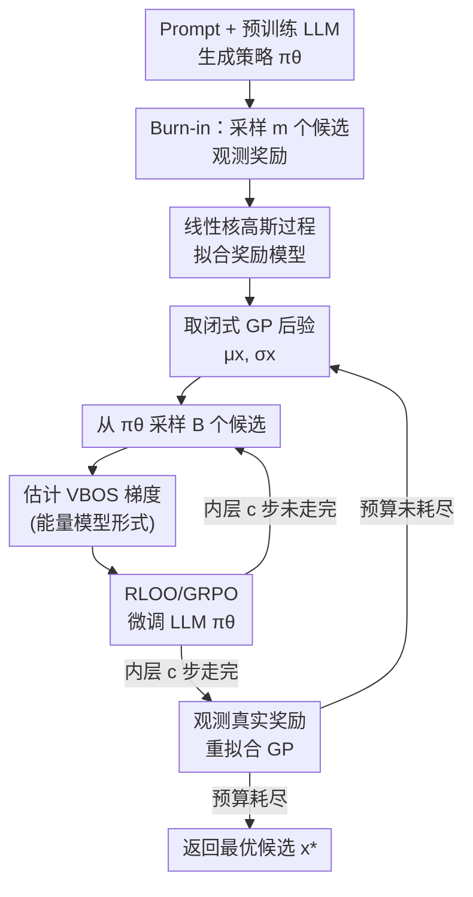

# Thompson Sampling via Fine-Tuning of LLMs

- **会议**: ICLR 2026
- **arXiv**: [2510.13328](https://arxiv.org/abs/2510.13328)
- **代码**: [GitHub](https://github.com/IBM/thompson-sampling-via-fine-tuning-of-llms)
- **领域**: 医学图像
- **关键词**: Thompson Sampling, Bayesian Optimization, LLM Fine-Tuning, Probability of Maximality, VBOS

## 一句话总结

提出 ToSFiT，通过微调大语言模型直接参数化最大概率（Probability of Maximality），将 Thompson Sampling 扩展到大规模非结构化离散空间，避免了获取函数最大化的难题。

## 研究背景与动机

贝叶斯优化在大规模非结构化离散空间（如氨基酸序列、量子电路设计）中面临核心挑战：由于缺乏梯度信息，获取函数（acquisition function）的最大化在组合级别大的离散域中不可行。例如，20种氨基酸、长度100的蛋白质序列空间已超过宇宙原子数。

Thompson Sampling（TS）是一种经典的贝叶斯优化策略，通过从奖励后验中采样并选择最大化该样本的点来进行探索-利用平衡。其采样分布本质上就是最大概率（Probability of Maximality, PoM）。然而在大规模离散域中，直接从 PoM 采样同样需要遍历所有点。

**核心思路**：既然 LLM 已经通过预训练编码了丰富的先验知识，能否直接用 LLM 的生成分布来参数化 PoM，从而将 Thompson Sampling 转化为 LLM 微调问题？

## 方法详解

### 整体框架

ToSFiT 要解决的是：在氨基酸序列、量子电路这类组合级别巨大的离散空间里，传统贝叶斯优化每一步都要"最大化获取函数"，而这等价于扫遍所有点、根本算不动。它的核心转念是把"选下一个候选点"重新理解为让 LLM 的生成分布 $\pi^\theta$ 去逼近奖励的**最大概率分布（Probability of Maximality, PoM）**——既然从 LLM 直接采样就近似于从 PoM 采样，Thompson Sampling 便退化成"把 LLM 微调到当前后验"这一件事。

具体怎么转：算法先用 prompt 条件下的预训练 LLM 生成一批 burn-in 候选、观测奖励、拟合一个高斯过程（GP）奖励模型；随后进入外循环，每一轮先从 GP 取闭式后验 $\mu_x, \sigma_x$，再走若干内层梯度步——每步从 LLM 采样一批候选、用 VBOS 目标的梯度信号对 LLM 做一小步更新，让生成分布缓慢爬向当前后验下的 PoM；内层走完后观测这批候选的真实奖励、重新拟合 GP，再进入下一轮，直到预算耗尽返回最优候选。

### 关键设计

**1. 变分贝叶斯乐观采样（VBOS）：用一个可微目标替代无法枚举的 PoM**

在 $|X|$ 大到无法遍历的离散空间里，直接从 PoM 采样需要扫描所有点，正是整体框架里要绕开的那一步。ToSFiT 沿用 O'Donoghue & Lattimore (2021) 的思路，让策略 $\pi$ 去最大化变分目标 $\mathcal{V}(\pi) = \mathbb{E}_{x \sim \pi}\left[\mu_x + \sqrt{-2\ln(\pi_x)} \cdot \sigma_x\right]$，其中 $\mu_x$、$\sigma_x$ 是 GP 给出的后验均值与标准差。$\mu_x$ 项鼓励利用高奖励区域，而 $\sqrt{-2\ln(\pi_x)} \cdot \sigma_x$ 项随着策略对某点越自信（$\pi_x$ 越大）而衰减，相当于一个自适应的 UCB 探索奖励——它让目标的最优解恰好对应 PoM，从而把"枚举采样"换成了"优化一个分布"，而分布正好可以用 LLM 来参数化。

**2. VBOS 梯度的能量模型形式：把后验偏差直接翻译成生成概率的增减**

有了可微目标，还要能算它对 LLM 参数的梯度。对 $\mathcal{V}(\pi^\theta)$ 求导（Proposition 1）得到 $\frac{d}{d\theta}\mathcal{V}(\pi^\theta) = \mathbb{E}_{x \sim \pi^\theta}\left[(\mu_x - \xi - v^{-1}(\pi_x^\theta) \cdot \sigma_x) \cdot \frac{d}{d\theta}\ln\pi_x^\theta\right]$，其中 $v^{-1}(u) = \sqrt{-2\ln u} - 1/\sqrt{-2\ln u}$。这个形式天然带有能量模型的解释：括号里相当于"真实后验奖励"减去"LLM 当前隐含估计"，当 LLM 低估了某个点的期望奖励时，括号为正，于是 $\ln\pi_x^\theta$ 被推高、该候选的生成概率上升；反之则被压低。这样一来微调信号不需要人工设计奖励，而是直接由 GP 后验与策略当前置信的差距给出。

**3. RLOO 基线与方差归一化：让高方差的策略梯度估计稳定可训**

上式是蒙特卡洛策略梯度，方差很大、直接用会让微调不稳。ToSFiT 在每批样本上用 RLOO（Reinforce Leave-One-Out）基线，把每个候选的基线 $\xi_i$ 取成同批其余样本伪奖励的均值 $\xi_i = \frac{1}{B-1}\sum_{j\neq i}\hat{\hat{r}}^\theta_{x_j}$ 以降低方差，再用优势函数的经验标准差做归一化得到一个方差自适应的学习率。这两步组合在数学上等价于 GRPO（Group Relative Policy Optimization），因此可以直接复用成熟的 LLM 强化学习训练栈，而不必从头实现一套优化器。

**4. 线性核高斯过程：让奖励模型的拟合开销与观测数量解耦**

整体框架里 GP 要被反复重拟合，但标准 GP 推断随观测数立方增长，在迭代上千轮的 BO 里不可承受。ToSFiT 借 Moore–Aronszajn 定理把任意核写成特征映射 $\phi: X \to \mathbb{H}$ 下的线性核 $K(x,z)=\langle\phi(x),\phi(z)\rangle$，使后验更新的复杂度变为 $\Theta(\dim(\mathbb{H})^2)$，只依赖特征维度而与观测数量无关。表达力则由 $\phi$ 的选择保留（固定嵌入模型、在线学习或针对任务设计）。这样即便采样越来越多，每轮重新拟合 GP 的成本也保持恒定，保证整个外循环可以长期运行。

### 损失函数 / 训练策略

实际训练时用一批 $B$ 个采样候选对 VBOS 梯度做经验估计：$\frac{d}{d\theta}\mathcal{V}(\pi^\theta) \approx \frac{1}{B}\sum_i \frac{\hat{\hat{r}}_{x_i}^\theta - \xi_i}{\widehat{\text{advantage std}}} \cdot \frac{d}{d\theta}\ln\pi_{x_i}^\theta$，其中分子是 RLOO 校正后的优势、分母是优势的经验标准差。为了不抹掉预训练与上下文带来的先验，微调采用小学习率、每轮只走少量梯度步，让策略缓慢漂移而非被单轮观测带跑。

## 理论分析

**Theorem 1（核心理论贡献）**：将精确 VBOS 的累积遗憾上界从 $\tilde{\mathcal{O}}(\sqrt{T|X|})$ 改进到 $\tilde{\mathcal{O}}(\sqrt{T\gamma^T})$（$\gamma^T$ 为最大信息增益），并首次给出近似 VBOS 的遗憾上界：

$$\mathbb{E}\left[\sum_{t=1}^T R^* - R_{x^t}\right] \leq \sqrt{C_{\sigma_n} H T \gamma^T} + \mathbb{E}\sum_{t=1}^T D_{\sigma^t}(\pi^t, \tilde{\pi}^t)$$

关键 insight：策略初始化必须接近先验（预训练+上下文），微调需要谨慎（小学习率）以保持先验知识。

## 实验

### 三个任务

| 任务 | 模型 | 搜索空间 | 奖励 |
|------|------|----------|------|
| FAQ 回答优化 | Qwen3-1.7B/8B | 所有 token 序列 | 语义对齐分数 |
| 蛋白质搜索 | ProtGPT2-0.7B | 氨基酸序列 | 热稳定性指数 |
| 量子电路设计 | Qwen2.5-Coder-1.5B/7B | Qiskit 电路代码 | 能量负值 |

### 主要结果

ToSFiT 在所有三个任务中均取得 SOTA 的样本效率和计算效率，显著优于7个基线方法（包括上下文BO、强化学习、进化搜索）。

### 关键发现

- **强先验的重要性**：去除 prompt 中的关键信息（如量子比特数）会显著降低性能
- **谨慎微调**：过大学习率会导致遗忘先验并陷入停滞
- **批量优化有效**：批量大小增大会降低样本效率但提升迭代效率
- **计算-样本效率权衡**：增加每轮梯度步数可进一步提升样本效率

### 消融实验

| 消融 | 效果 |
|------|------|
| 去除先验上下文 | 性能显著下降 |
| 大学习率 | 初始提升但后续停滞 |
| 增加梯度步数 | 样本效率提升 |
| 增大批量 | 迭代效率提升 |

## 亮点

1. 理论与实践完美结合：新的遗憾上界直接指导了算法设计
2. 巧妙利用 LLM 预训练先验，避免了离散空间获取函数最大化
3. VBOS 梯度的能量模型解释优雅且直观
4. 三个高度多样化的实验任务（NLP、蛋白质、量子计算）验证了通用性

## 局限性

1. 使用固定特征映射，未与 GP 联合学习
2. 微调全模型带来计算和内存开销
3. 假设线性核的可扩展 GP，限制了奖励模型的表达能力
4. 仅评估了序列生成任务，未涉及图结构等其他离散空间

## 相关工作

- **离散域 BO**：Bal et al. (2025) 假设笛卡尔积分解；Swersky et al. (2020) 通过局部突变策略优化
- **VAE 松弛**：Kusner et al. (2017) 等将离散空间松弛到连续空间
- **深度核学习**：Ranković & Schwaller (2025) 在线学习特征映射

## 评分

- **创新性**: ⭐⭐⭐⭐⭐ — 将 Thompson Sampling 与 LLM 微调结合，理论和方法上都有重要贡献
- **实用性**: ⭐⭐⭐⭐ — 适用于蛋白质设计、电路优化等实际场景
- **清晰度**: ⭐⭐⭐⭐⭐ — 理论推导清晰，实验设计well-motivated
- **意义**: ⭐⭐⭐⭐⭐ — 为 LLM 与贝叶斯优化结合开辟了新方向

<!-- RELATED:START -->

## 相关论文

- [\[ICML 2025\] SToFM: a Multi-scale Foundation Model for Spatial Transcriptomics](../../ICML2025/computational_biology/stofm_a_multi-scale_foundation_model_for_spatial_transcriptomics.md)
- [\[ICML 2025\] Protein Structure Tokenization: Benchmarking and New Recipe](../../ICML2025/computational_biology/protein_structure_tokenization_benchmarking_and_new_recipe.md)
- [\[ICCV 2025\] MolParser: End-to-end Visual Recognition of Molecule Structures in the Wild](../../ICCV2025/computational_biology/molparser_end-to-end_visual_recognition_of_molecule_structures_in_the_wild.md)
- [\[ICML 2025\] Scalable Non-Equivariant 3D Molecule Generation via Rotational Alignment](../../ICML2025/computational_biology/scalable_non-equivariant_3d_molecule_generation_via_rotational_alignment.md)
- [\[ICLR 2026\] Fine-Tuning Diffusion Models via Intermediate Distribution Shaping](fine-tuning_diffusion_models_via_intermediate_distribution_shaping.md)

<!-- RELATED:END -->
