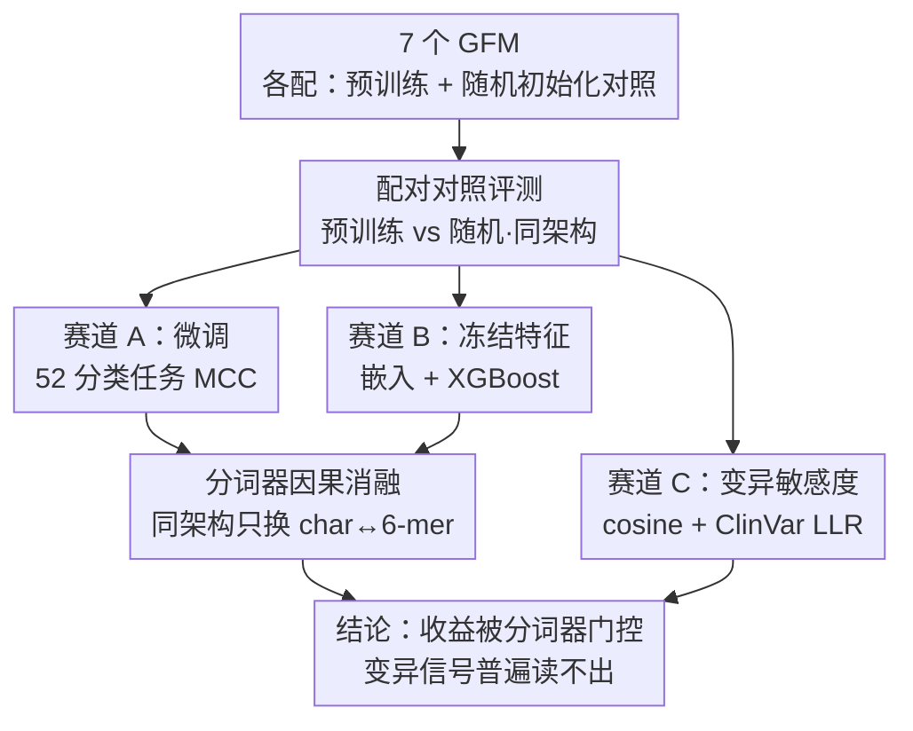

# Tokenization to Transfer: Do Genomic Foundation Models Learn Good Representations?

**会议**: ICLR 2026  
**OpenReview**: [https://openreview.net/forum?id=4UY1NHG5Ge](https://openreview.net/forum?id=4UY1NHG5Ge)  
**代码**: https://github.com/m42-health/gfm-random-eval  
**领域**: 计算生物学 / 表示学习 / 基础模型评测  
**关键词**: 基因组基础模型, 无监督预训练, 分词器归纳偏置, 随机初始化基线, 变异敏感度

## 一句话总结
作者把 7 个基因组基础模型（GFM）和它们「权重随机初始化」的同架构对照版本放在 52 个基因组任务上系统对打，发现随机初始化基线强得惊人、预训练的收益被分词器牢牢卡住（字符级几乎不涨、子词级才涨），而且无论是否预训练，这些模型都几乎读不出临床相关的单核苷酸突变——结论是当前照搬 NLP 的预训练范式在基因组上只带来「分词器门控的微弱提升」。

## 研究背景与动机
**领域现状**：大语言模型（LLM）的成功被原样搬到基因组学，催生了一批基因组基础模型（GFM，如 DNABERT-2、Nucleotide Transformer、HyenaDNA、Caduceus、GENA-LM 等）。它们沿用 LLM 的两段式范式——先在海量 DNA 序列上做无监督预训练（next-token 或 masked language modeling），再在下游任务上微调，期望把基因组知识压进参数里、产出一个通用的「基础模型」。

**现有痛点**：预训练阶段动辄需要几百 M 参数、数十万到上百万 token 的长序列和上 T 的数据，算力开销巨大；但已有研究里**没有任何一个 GFM 能稳定地最好**，预训练表现和下游表现之间的关系一直说不清。换句话说，大家在花巨量算力做预训练，却不知道这笔钱到底买到了多少下游收益。

**核心矛盾**：评测 GFM 时几乎所有论文都只报「预训练模型 vs 别的预训练模型」，却很少有人问一个更尖锐的问题——把同一个模型的权重**随机初始化、不做任何预训练**，它在下游任务上到底差多少？如果差不多，那预训练这步的价值就要打上大问号。

**本文目标**：拆成三个子问题——(1) 微调任务上，预训练相比随机初始化到底涨多少、被什么因素决定；(2) 冻结特征（不更新权重）时预训练特征是否真的更好；(3) 在最有临床价值的「单核苷酸变异检测」上，GFM 的嵌入到底能不能反映突变。

**切入角度**：作者的关键操作是给每个 GFM 配一个**完全同架构、同配置、只是权重随机**的对照组（apples-to-apples），把「预训练带来的增量」从「架构/分词器本身带来的能力」中干净地剥离出来。这个对照在以往评测里是缺失的。

**核心 idea**：不提新模型，而是用「预训练 vs 随机初始化」的配对实验 + 分词器因果消融 + 变异敏感度探针，去证伪「基因组预训练一定有用」这个默认假设，并把收益归因到**分词器的归纳偏置**而非预训练本身。

## 方法详解

### 整体框架
这是一篇**评测/审视型**论文，「方法」即一套受控实验设计。核心骨架是：选 7 个在架构（编码器/解码器、Transformer/状态空间）、分词器（字符 / k-mer / BPE）、规模（450K–580M）上差异巨大的 GFM（见 Table 1），每个都准备「预训练 checkpoint」和「随机初始化同架构对照」两个版本，然后让它们在三条评测赛道上对打，覆盖 52 个任务、近 1 万次微调实验。三条赛道分别压测**判别能力（微调）**、**特征质量（冻结嵌入）**、**变异敏感度（单碱基级别）**，再叠加一个只换分词器的因果消融，把观察到的差异归因到分词器。

### 关键设计

**1. 预训练 vs 随机初始化的配对对照：把预训练的真实增量从架构能力里剥出来**

以往评测把不同 GFM 横向比，混淆了「架构/分词器本身有多强」和「预训练加了多少」。本文给每个模型配一个**逐位对齐的随机初始化版本**（同模型大小、同分词器、同超参搜索预算），用 Fig. 1 把横轴（随机初始化分数）对纵轴（预训练分数）画散点：落在对角线上方才说明预训练有正收益，垂直距离就是增量本身。为公平起见，微调侧对每个 (模型, 任务) 都做了覆盖学习率、weight decay、batch size、warm-up、LoRA vs 全量微调的大规模超参搜索，并发现**全量微调一致优于 LoRA**——这条很关键，因为如果用 LoRA 调随机基线，会系统性低估随机基线、从而虚高预训练的价值。结果是随机初始化基线强得离谱：8M 参数的随机 Caduceus 在 NT Benchmark 最难的组蛋白/增强子任务上平均 MCC≈0.62，反超 NT-500M、NTv2-50M、GENA-LM 等更大的预训练模型；在 GUE 上随机 Caduceus 甚至比自己的预训练版高 0.114 MCC。即便预训练保留优势，增量通常也只有 2–3%。

**2. 分词器因果消融：证明分词器的归纳偏置才是主导，预训练 loss 是误导性代理**

前一个设计是观察性的，无法断言「是分词器导致差异」。于是作者做了一个干净的因果实验：训练两个**完全相同的 HyenaDNA**（同大小、同人类参考基因组数据、同训练步数），唯一区别是分词器——一个用字符级、一个用 6-mer（Table 3）。结果反直觉：字符级模型预训练 loss 更低（1.180 vs 1.215），但 6-mer 模型下游平均 MCC 高出 +0.187。两个推论随之成立：(i) **预训练 perplexity 不是下游性能的好代理**——语言建模目标拟合的是 token 可预测性，未必对齐下游标签；(ii) **分词器的归纳偏置可以脱离 loss 主导下游表现**。直觉解释是：紧凑的字符词表（只有 4 类碱基）给随机模型造了一个「容易」的输入空间，所以随机基线本就很强、预训练没多少空间可加；而大词表的子词分词造出稀疏、难学的输入空间，这时预训练去学 token 表示才真正值钱——这正解释了为什么子词模型（k-mer/BPE）从预训练涨得多、字符模型涨得少且不稳定，且该规律在 1–5% 标签的低资源场景里更明显（Fig. 3）。

**3. 变异敏感度探针：用 cosine 相似度 + ClinVar 对数似然比，量化模型对单碱基突变的「迟钝」**

基因组最有临床价值的应用（致病性预测、eQTL/sQTL）都依赖单核苷酸级别的差异，但前两条赛道是功能元件分类，压不到这一层。作者设计了三类探针：(a) **突变敏感度**——对一条参考序列逐步注入 1/64/.../1024 个 SNP，测参考嵌入与突变嵌入的 cosine 相似度（含全局 last/cls 池化与只在突变位点池化两种），相似度越低说明越敏感；(b) **ClinVar 真实变异**——在 TP53/BRCA2/CFTR 上取良性 vs 致病外显子变异，比较嵌入相似度（Table 5）；(c) **对数似然比检验**——对每个 SNP 计算 $\text{LLR}=\log \frac{P(\text{ALT})}{P(\text{REF})}$（编码器模型用 masked 位置 softmax 近似），用 LLR 区分致病/良性并算 AUROC（Table 4）。结论极为负面：即便改掉序列里一半碱基，部分 GFM 嵌入 cosine 相似度仍 >0.99（随突变数增多甚至因平均效应回升）；ClinVar LLR 的 AUROC 落在 0.345–0.536，逼近随机猜测。这说明无论是否预训练、用什么分词器，现有 GFM 都不能可靠编码等位基因级别的信息。

### 损失函数 / 训练策略
本文不引入新训练目标，沿用各 GFM 原生的预训练目标（解码器的 next-token、编码器的 masked language modeling）。值得记的实验约定：微调侧最终以 6 个学习率的扫描取最优值上报；低资源实验固定 30 epoch、扫 4 个学习率（1e-5/5e-5/1e-4/5e-4）；冻结特征用 max pooling + XGBoost 在 9 类 biotype 上分类；变异实验固定 1024 长度序列以避开分块与上下文窗口的混淆。作者还专门指出 NT-500M 虽然在 1000G 变异上预训练过，但 MLM 的 15% 掩码率远高于自然突变率（0.5%）、加上 6-mer 分词难以捕捉单碱基变化，可能正是它对变异不敏感的原因。

## 实验关键数据

### 主实验
横轴随机初始化、纵轴预训练（MCC），落在对角线上方才有预训练增益。下表摘取代表性数字（NT Benchmark 组蛋白任务的预训练-随机增量 $\Delta$）：

| 模型 | 分词器 | 预训练−随机 $\Delta$ (NT 组蛋白) | 备注 |
|------|--------|-------------------------------|------|
| Caduceus (8M) | Char | +0.014 | 随机基线已≈0.62，反超多个大模型 |
| HyenaDNA | Char | +0.031 | 字符级，增量小 |
| Mistral (580M) | Char | +0.148 | 字符级但架构好，仍受益 |
| DNABERT-2 | BPE | +0.059 | 子词，受益 |
| GENA-LM | BPE | +0.121 | 子词，受益 |
| NT-500M | k-mer | +0.111（GUE 上 +0.242） | 子词，预训练涨最多 |
| NTv2-50M | k-mer | +0.177 | 子词，受益 |

关键现象：字符级随机基线天生强、预训练加不动；子词模型随机基线弱、预训练才是涨分主力（NT-500M 在 GUE 上 $\Delta$+0.242 MCC 最大）。

### 消融实验
分词器因果消融（同架构 HyenaDNA，只换分词器，Table 3）：

| 指标 | Character | 6-mer | 差异 |
|------|-----------|-------|------|
| 预训练 Loss ↓ | **1.180** | 1.215 | 字符更低 |
| H3K4me3 (MCC) ↑ | 0.138 | **0.323** | k-mer +0.185 |
| H3K9ac (MCC) ↑ | 0.141 | **0.349** | k-mer +0.208 |
| Enhancers (MCC) ↑ | 0.139 | **0.305** | k-mer +0.166 |
| 平均下游 MCC ↑ | 0.139 | **0.326** | k-mer +0.187 |

冻结特征 biotype 分类（Table 2 摘要）：随机模型从默认分词器换成字符分词器后，NTv2-50M 的 F1 从 0.48 → 0.64；再把嵌入维度调大，5/7 的随机模型反超自己的预训练版（最后一行「预训练−随机」多为负，如 -29.4%、-11.5%）。配对扫维度（Fig. 5）显示预训练只在 d=64 有优势，d≥128 后随机版追平甚至反超。

### 关键发现
- **分词器决定随机基线，预训练增益由分词器门控**：字符级（4 类碱基词表）给随机模型一个易学的输入空间，基线天生强、预训练没空间可加；子词大词表造出稀疏难学空间，预训练去学 token 表示才值钱。
- **预训练 loss 是误导性代理**：字符模型 loss 更低却下游差 0.187 MCC，说明语言建模困惑度和判别性下游性能不对齐。
- **容量比预训练更重要（冻结特征场景）**：把随机模型的嵌入维度调大（HyenaDNA 到 4096 维 F1≈0.75；NTv2-50M 从 0.53→0.71）就能让随机特征反超预训练特征。
- **变异敏感度是系统性短板**：改一半碱基 cosine 仍 >0.99，ClinVar LLR AUROC 0.345–0.536 近随机，无论是否预训练、何种分词器都失败——这是当前 GFM 最致命的缺口。

## 亮点与洞察
- **「随机初始化对照」是被整个领域忽略的最强基线**：给每个 GFM 配一个同架构随机版本，一下子就把「预训练增量」从「架构本身能力」里剥干净，这个对照设计简单却极有杀伤力，可直接迁移到任何「基础模型到底有没有用」的质疑性评测里。
- **用因果消融把相关性升级为因果**：固定架构只换分词器、配合「loss 更低但下游更差」的反直觉证据，干净地证明了分词器归纳偏置主导下游、而非预训练——这种「控制变量 + 反直觉对照」的范式很值得学。
- **「困惑度≠下游性能」在基因组上的具体反例**：给「不要拿预训练 loss 当下游代理」提供了一个量化的、可复现的证据点。
- **把矛头指向 building blocks 而非 scale**：结论不是「再加大算力」，而是「重新设计生物学知情的分词器 + 变异感知的训练目标 + 真正压测等位基因敏感度的 benchmark」，给整个方向指了一条更务实的路。

## 局限与展望
- **任务范围偏判别式分类**：只测了序列分类和冻结特征质量，没覆盖生成式序列设计、长程建模（基因表达回归、增强子-启动子连接），这些任务上 Evo2、Enformer 类专用模型仍是强基线，结论不能外推过去。
- **上下文窗口受限**：多个被评模型上下文只有 128–1024，无法做需要 100k+ 长程依赖的实验。
- **模型覆盖有限**：只分析 7 个 GFM，量化模型、图结构模型等未纳入。
- **变异敏感度的度量较朴素**：主要用 cosine 相似度和位点级 LLR，可能低估了某些更精巧探针能挖出的信号；作者也承认这只是一种近似。
- **改进方向**：生物学知情的分词（保留单碱基信号）、变异感知的预训练目标（如把掩码率对齐自然突变率）、以及直接压测等位基因敏感度的新 benchmark。

## 相关工作与启发
- **vs Nucleotide Transformer / DNABERT-2 / GENA-LM（被评对象）**：它们各自主张预训练带来强表示，本文用同架构随机对照证明这些收益大多被分词器门控、且变异敏感度普遍不足，是对这批工作「有用性」的系统性再审视。
- **vs GFM scaling laws 研究（Nguyen et al. 2023/2024）**：那条线在追问「更大更多数据能涨多少」，本文反过来问「不预训练会差多少」，结论是当前范式下答案常常是「差不了多少」，提示单纯 scale 并非正解。
- **vs CV/NLP 的基础模型范式（CLIP、GPT-3）**：在视觉和语言里预训练通常带来显著下游提升，而基因组里却勉强超过随机基线，说明 NLP 经验不能想当然地照搬到基因组这种「小词表、信号稀疏到单碱基」的模态。

## 评分
- 新颖性: ⭐⭐⭐⭐ 不提新模型，但「随机初始化配对对照 + 分词器因果消融」的评测视角在基因组领域是稀缺且尖锐的。
- 实验充分度: ⭐⭐⭐⭐⭐ 7 模型 × 52 任务 × 近 1 万次微调，三条赛道 + 因果消融 + ClinVar 真实变异，证据链完整。
- 写作质量: ⭐⭐⭐⭐ 论点清晰、图表自洽，结论有节制（明确划定只覆盖判别式任务）。
- 价值: ⭐⭐⭐⭐⭐ 对「基因组预训练值不值」给出量化答案，并把研究重心从 scale 拨回分词器与变异目标，对整个方向有校正作用。

<!-- RELATED:START -->

## 相关论文

- [\[ICLR 2026\] Low rank adaptation of chemical foundation models generate effective odorant representations](low_rank_adaptation_of_chemical_foundation_models_generate_effective_odorant_rep.md)
- [\[ICLR 2026\] Towards Understanding the Shape of Representations in Protein Language Models](towards_understanding_the_shape_of_representations_in_protein_language_models.md)
- [\[ICLR 2026\] Riemannian High-Order Pooling for Brain Foundation Models](riemannian_high-order_pooling_for_brain_foundation_models.md)
- [\[ICLR 2026\] Towards All-atom Foundation Models for Biomolecular Binding Affinity Prediction](towards_all-atom_foundation_models_for_biomolecular_binding_affinity_prediction.md)
- [\[ICML 2026\] DNAChunker: Learnable Tokenization for DNA Language Models](../../ICML2026/computational_biology/dnachunker_learnable_tokenization_for_dna_language_models.md)

<!-- RELATED:END -->
