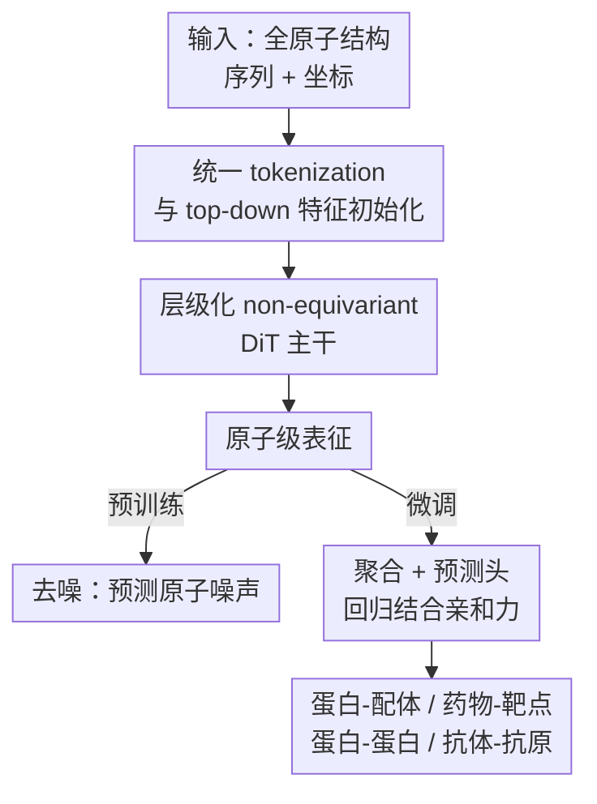

# Towards All-atom Foundation Models for Biomolecular Binding Affinity Prediction

**会议**: ICLR 2026  
**OpenReview**: [https://openreview.net/forum?id=o0Qfsq1fK8](https://openreview.net/forum?id=o0Qfsq1fK8)  
**代码**: https://github.com/VectorShi/ADiT  
**领域**: 计算生物 / 全原子表征学习 / 结合亲和力预测  
**关键词**: 结合亲和力, AlphaFold 3, 扩散 Transformer, 全原子建模, 去噪预训练

## 一句话总结
本文把 AlphaFold 3 的架构从"生成式结构预测"改造成"表征学习器"，提出全原子扩散 Transformer ADiT：用统一 tokenization 同时编码蛋白质与小分子、砍掉重条件 trunk 与 MSA/模板依赖、在 PDB 上做去噪预训练，单一模型就在蛋白-配体、药物-靶点、蛋白-蛋白、抗体-抗原四类亲和力任务上达到或逼近 SOTA，并随模型增大稳定提升。

## 研究背景与动机
**领域现状**：AlphaFold 3 等方法已经能从序列高精度预测生物分子复合物的三维结构，但结构预测只是中间产物——真正的目标是设计出对特定靶点有强结合亲和力的功能蛋白。然而结合亲和力预测一直很难，根本瓶颈是高质量实验亲和力标签极度稀缺。

**现有痛点**：现有亲和力预测方法大多"各做各的"——RDE-Network、DiffAffinity、Prompt-DDG 专门做蛋白-蛋白，MGraph-DTA、HGNN-DTA、ProFSA 专门做蛋白-配体。这种针对单一交互类型的专门化设计严重限制了泛化性，一个模型换个任务类型就用不了。同时很多方法只用序列输入，或者只在残基级（coarse-grained）建模，没吃到结构预测的红利，也没法刻画决定亲和力的全原子细节。

**核心矛盾**：一边是 NLP/CV 里"大规模预训练 + 微调"的基础模型范式（BERT、GPT、SAM、CLIP）已经证明能靠数据规模换泛化；另一边生物分子交互领域却还停留在每类任务一个专用模型、且受困于标签稀缺。缺的是一个统一的、能跨交互类型迁移的结构基础模型。

**本文目标**：构建一个通用的、基于结构的全原子基础模型，一次预训练后能迁移到蛋白-配体、药物-靶点、蛋白-蛋白、抗体-抗原等多种亲和力任务。

**切入角度**：AlphaFold 3 本身就是一个能联合编码序列与结构、跨多种交互类型的 Transformer 架构，是天然的起点。但它是个生成模型，直接拿来做下游表征往往效果不好（生成目标优化的是"重建结构"，不是"刻画功能/交互特征"）。作者提出三个关键洞察：(i) 当目标从"预测几何"变成"编码已知几何"时，那个为生成而设的重条件 trunk 模块就不再关键，可以大幅简化；(ii) 原子-序列双层级的 Transformer 架构天然适合联合编码结构与序列；(iii) 在大规模结构数据上预训练，有望缓解亲和力标签稀缺、提升跨任务泛化。

**核心 idea**：把 AlphaFold 3 从生成式结构预测器"重新工程化"成一个表征学习器——去掉 MSA/模板和重 trunk、改用去噪预训练，得到全原子扩散 Transformer ADiT，用一套模型统一各类生物分子结合亲和力预测。

## 方法详解

### 整体框架
ADiT 接收一个生物分子复合物的全原子结构（序列 $A \in \{1,...,20\}^L$ 与坐标 $x \in \mathbb{R}^{L\times3}$）作为输入，经过统一的特征初始化、层级化的扩散 Transformer 主干，输出原子级表征；预训练阶段用去噪目标自监督学习，微调阶段把原子表征逐级聚合成复合物级表征后接预测头，回归结合亲和力。整条管线把"生成式 AlphaFold 3"重塑为"编码式表征学习器"：砍掉为结构生成服务的重条件 trunk、丢掉 MSA 与模板，只保留可扩展的扩散 Transformer 堆叠。

### 关键设计

**1. 从 AlphaFold 3 到 ADiT：砍掉重条件 trunk、换成去噪目标**

这一条针对的痛点是：直接微调 AlphaFold 3 这类生成模型做下游任务效果不佳，因为生成目标优化的是"重建几何"而非"刻画交互特征"。作者的核心判断是——当结构已经作为输入给定、模型角色从"推断几何"变成"编码已知几何"时，AlphaFold 3 里那个整合序列/MSA/模板的多模态 trunk 条件模块就变得没那么关键了。于是 ADiT 做了四处实质性改造：(1) 目标上，从生成式结构预测改成更简单的去噪表征学习；(2) 输入上，去掉计算昂贵且不总可得的 MSA 与结构模板，改用预训练蛋白语言模型 ESM-2 提供进化信息、用 RDKit 显式特征描述小分子；(3) 架构上，移除重 trunk 与计算密集的 Pairformer 块，只保留可扩展的扩散 Transformer 堆叠；(4) 保留 AlphaFold 3 里好用的现代组件（SwiGLU、门控、原子/token 双层级交替）。这套"减法"既省算力又更适合学通用表征，是 ADiT 能用单一模型覆盖多任务的前提。

**2. 统一 tokenization 与 top-down 特征初始化**

为了让一套模型既能吃蛋白又能吃小分子，ADiT 用了泛化的 tokenization：蛋白里每个残基是一个 token，小分子里每个重原子是一个 token。特征采用自顶向下（top-down）方式初始化——先建 token 级特征，再把 token 级信息向下传播、和原子专属信息融合得到原子级特征。token 条件表征由两部分组成：ESM-2-650M 给出的序列特征（只对残基 token 计算，小分子 token 置零）+ 区分蛋白/小分子来源的 token 类型嵌入；token pair 表征则把成对 token 条件拼接、再叠加相对序列距离与链距离编码（这里刻意只用拼接+线性层，避开了 AlphaFold 3 昂贵的 Pairformer）。

一个值得注意的细节是，ADiT 在原子级显式区分了"单表征" $s_{atom}$ 与"条件" $c_{atom}$：后续扩散 Transformer **以条件为锚、从单表征里抽结构信息**，所以条件 $c_{atom}$ 只编码化学与进化信息（原子类型、原子名 + token 条件），而单表征 $s_{atom}$ 才包含坐标这类结构信息。原子 pair 表征 $z_{atom}$ 则融合原子条件、用 RBF 核嵌入欧氏距离、并编码两原子是否属于同一 token，最后再叠加对应的 token pair 表征以同时捕捉局部与全局交互。这种"结构信息只进单表征、不进条件"的分工，正是把生成式扩散结构借来做表征学习的关键适配。

**3. 层级化 non-equivariant DiT 主干**

主干用扩散 Transformer（DiT）做层级化表征学习，在原子层级与 token 层级之间交替。流程是：先用 $N^{atom}_{block}$ 个原子 DiT 块更新原子表征 → 经 "Atom2Token" 平均池化得到 token 表征 → 用 $N^{token}_{block}$ 个 token DiT 块精炼 → 经线性层 + "Token2Atom" 广播（非学习的展开操作）还原成原子表征，并通过 skip 连接与之前的原子表征相加 → 再用 $N^{atom}_{block}$ 个原子 DiT 块进一步精炼。每个 DiT 块含自适应 LayerNorm、多头自注意力与 transition 函数，并加 skip 连接稳训练。注意力写作

$$A^h_{ij} \leftarrow \text{softmax}_j\!\left(\frac{q^{h\top}_i k^h_j}{\sqrt{d}} + \text{Linear}^h_b(z_{ij}) + \beta_{ij}\right)$$

其中 $\beta_{ij}$ 控制是否建模 $(i,j)$ 之间的交互：token 级全为 0（全连接），原子级则做稀疏化——每 32 个原子只关注序列上邻近的 128 个原子，省去全原子两两注意力的开销。

这条设计最反主流的一点是 **non-equivariant（非等变）**：ADiT 只用一个线性层嵌入所有原子坐标，不引入 SE(3) 等变、局部性等几何归纳偏置；所需的旋转/平移不变性靠输入坐标质心居中 + 预训练时随机旋转数据增强来近似。作者的假设是，过强的等变约束反而会束缚模型，去掉它能更灵活地捕捉决定结合热力学的非几何特征（如静电相互作用、来自 RDKit/ESM-2 的化学语义），而且非等变 Transformer 架构更简单、更易扩展，更适合堆成基础模型。

### 损失函数 / 训练策略
采用"先预训练、后微调"两阶段。**预训练**用去噪自监督：给每个原子坐标加高斯噪声 $\varepsilon \sim \mathcal{N}(0, \sigma^2 I)$，把加噪结构喂进 ADiT，再用噪声预测头从原子表征里预测噪声；因为是非等变模型，配合随机旋转做数据增强；噪声尺度按 (Zaidi et al., 2023) 取固定值，初步实验发现 $\sigma = 0.5\text{Å}$ 最好（变噪声尺度未见明显收益）。预训练数据全部来自 PDB（433,297 条单链、481,382 个蛋白-蛋白、427,947 个蛋白-配体样本，聚类成 150,009 簇），且**不使用任何功能标签**以避免数据泄漏。**微调**用更小的学习率：输入干净结构、经 "Atom2Token" 平均池化与 "Token2Complex" 求和池化得到复合物级表征再接预测头；由于目标是从干净样本学表征而非从噪声生成，微调时扩散时间步恒置 0（对应干净样本），不再条件于时间步。作者训了 ADiT-S（12M）、ADiT-M（35M）、ADiT-L（253M）三档，其中 ADiT-L 的层数与隐藏维度对齐 AlphaFold 3。

## 实验关键数据

### 主实验
在四类交互任务上评测，ADiT-L 几乎全面达到或逼近 SOTA，连 12M 的 ADiT-S 都能超过多数专用基线。

| 任务 | 数据集 | 指标 | ADiT-L | 之前最好 | 提升 |
|------|--------|------|--------|----------|------|
| 蛋白-配体 | LBA-30 | Pearson↑ | 0.645 | GET 0.633 | +1.9% |
| 蛋白-配体 | LBA-60 | RMSE↓ | 1.246 | ProNet 1.343 | −7.2% |
| 蛋白-配体 | LBA-60 | Pearson↑ | 0.797 | ProFSA 0.764 | +4.2% |
| 药物-靶点 | Davis | MSE↓ | 0.198 | NHGNN-DTA 0.196 | 持平 SOTA |
| 药物-靶点 | Davis | $r^2_m$↑ | 0.751 | NHGNN-DTA 0.744 | +0.9% |
| 蛋白-蛋白 | SKEMPIv2 | Pearson↑ | 0.691 | Prompt-DDG 0.677 | +2.1% |
| 抗体-抗原 | HER2 | Pearson↑ | 0.567 | GearBind+P 0.515 | +10.1% |

值得一提的是，作者还专门微调了 Protenix（AlphaFold3 的开源复现）作为"直接微调生成模型"的对照，ADiT 在蛋白-配体所有指标上全面胜过 Protenix（如 LBA-60 Pearson 0.797 vs 0.707），印证了"直接拿生成模型做表征不够"的判断。此外，GET、ProNet 这类专用方法常出现"LBA-30 好就 LBA-60 差"的偏科，而 ADiT 在两个 split 上都稳。

### 消融实验
在 SKEMPIv2 上基于 ADiT-M 做单因子消融（Table 4）。

| 配置 | Pearson↑ | Spearman↑ | RMSE↓ | MAE↓ | 说明 |
|------|---------|-----------|-------|------|------|
| ADiT-M（完整） | 0.683 | 0.539 | 1.559 | 1.098 | 基线 |
| w/o 预训练 | 0.649 | 0.511 | 1.624 | 1.169 | 随机初始化，Pearson 掉 5.2% |
| w/o 全原子信息 | 0.658 | 0.517 | 1.606 | 1.153 | 仅骨架，Pearson 掉 3.7% |
| w/ 更大（ADiT-L 253M） | 0.691 | 0.560 | 1.540 | 1.088 | 放大稳定涨 |
| w/ 更小（ADiT-S 12M） | 0.660 | 0.524 | 1.597 | 1.132 | 缩小稳定降 |

### 关键发现
- **预训练贡献最大**：去掉预训练用随机初始化，Pearson 掉 5.2%、Spearman 掉 5.5%、RMSE 退 4%、MAE 退 6%，证明大规模结构去噪预训练是缓解标签稀缺的核心。
- **全原子建模有用**：把全原子换成仅骨架（backbone-only），各指标一致下降，说明侧链等全原子细节对刻画亲和力确有价值。
- **稳定的 scaling 趋势**：12M→35M→253M 三档在多个 benchmark 上一致提升，复现了其他领域的规模律。
- **真实抗体优化可用**：在 HER2 抗体（相对 Trastuzumab 平均编辑距离 7.6，属困难分布外样本）上仍领先；案例研究里 ADiT 能把 7 个湿实验验证的增亲和力突变（如 Anti-5T4 UdAb 的 S54Y、S57W；CR3022 的 SH103W/Y、IL34W）排到靠前，显示其作为抗体优化工具的潜力。

## 亮点与洞察
- **"生成模型→表征学习器"的系统化改造范式**：不是简单把 AlphaFold 3 拿来微调，而是从目标、输入、架构、训练四个维度同步重构（去噪替生成、ESM-2+RDKit 替 MSA/模板、砍 trunk/Pairformer、时间步恒 0）。这套"如何把昂贵生成大模型蒸成轻量编码器"的思路可迁移到其他结构生成模型。
- **反等变潮流的押注**：当下结构建模普遍堆 SE(3) 等变层，本文反其道用纯非等变 Transformer + 质心居中 + 随机旋转近似不变性，换来架构简洁与可扩展性，并论证强几何偏置可能压制静电、化学语义等非几何特征——这个 trade-off 观点很有启发。
- **单表征 vs 条件的显式解耦**：把"结构信息只进单表征、化学/进化信息进条件"这一分工讲清楚，是借扩散结构做表征学习时一个容易忽略但关键的设计点。
- **一套 token 化通吃蛋白与小分子**：残基=token、重原子=token 的统一方案让单模型跨四类交互复用，是"通用基础模型"落地的工程基础。

## 局限与展望
- **依赖给定结构作为输入**：ADiT 编码的是"已知几何"，对蛋白-蛋白/抗体任务还需借 FoldX 生成突变体结构，结构质量会直接影响下游亲和力预测，端到端从序列到亲和力尚未打通。
- **固定噪声尺度**：作者承认只用了单一 $\sigma=0.5\text{Å}$，受算力所限没探索"精心设计的噪声尺度分布"，未来可能用多尺度噪声同时捕捉粗/细粒度特征。
- **近似不变性而非严格保证**：用随机旋转+质心居中近似不变性，理论上不如等变层严格；在数据/旋转覆盖不足的极端情况下鲁棒性如何，仍待更系统验证。
- **排序型任务上 RMSE/MAE 略逊**：在 SKEMPIv2 这类排序任务上，ADiT 的 Pearson 最强但 RMSE/MAE 只是与最强基线持平，绝对误差并非全面领先。

## 相关工作与启发
- **vs AlphaFold 3 / Protenix**: AF3 是为结构预测设计的生成模型，依赖 MSA/模板与重 trunk；ADiT 把它改造成表征学习器（去噪目标、ESM-2+RDKit 替代 MSA、砍 trunk/Pairformer）。直接微调 Protenix 在蛋白-配体各指标全面不如 ADiT，说明"生成模型≠好表征"。
- **vs 专用亲和力方法（RDE-Network / DiffAffinity / Prompt-DDG / ProFSA / GET）**: 它们各自专攻蛋白-蛋白或蛋白-配体单一任务、泛化受限且常在不同 split 间偏科；ADiT 用单一全原子基础模型统一四类交互，并在多 split 上更稳。
- **vs 残基级结构表征方法**: 许多结构表征学习只在残基/骨架粗粒度建模且仅限蛋白；ADiT 做全原子、且同时覆盖蛋白与小分子，消融显示全原子信息确有增益。
- **vs 等变结构模型（GET 等几何等变方法）**: 主流靠 SE(3) 等变注入几何偏置；ADiT 反向用非等变 Transformer + 数据增强近似不变性，主打简洁可扩展，并质疑强几何偏置会压制非几何化学特征。

## 评分
- 新颖性: ⭐⭐⭐⭐ 把 AF3 系统化改造成统一全原子表征学习器、并押注非等变设计，思路新颖且自洽。
- 实验充分度: ⭐⭐⭐⭐ 覆盖四类交互 + 三档规模 + 消融 + 湿实验案例，但多为已知结构输入、未端到端。
- 写作质量: ⭐⭐⭐⭐ 动机与改造逻辑清晰，三点洞察串起全文。
- 价值: ⭐⭐⭐⭐ 提供了一个可扩展、跨任务的生物分子亲和力基础模型范式，并开源实现。

<!-- RELATED:START -->

## 相关论文

- [\[ICLR 2026\] Pallatom-Ligand: an All-Atom Diffusion Model for Designing Ligand-Binding Proteins](pallatom-ligand_an_all-atom_diffusion_model_for_designing_ligand-binding_protein.md)
- [\[ICLR 2026\] BioMD: All-atom Generative Model for Biomolecular Dynamics Simulation](biomd_all-atom_generative_model_for_biomolecular_dynamics_simulation.md)
- [\[ICLR 2026\] Riemannian High-Order Pooling for Brain Foundation Models](riemannian_high-order_pooling_for_brain_foundation_models.md)
- [\[ICLR 2026\] Beyond Ensembles: Simulating All-Atom Protein Dynamics in a Learned Latent Space](beyond_ensembles_simulating_all-atom_protein_dynamics_in_a_learned_latent_space.md)
- [\[ICLR 2026\] Iterative Distillation for Reward-Guided Fine-Tuning of Diffusion Models in Biomolecular Design](iterative_distillation_for_reward-guided_fine-tuning_of_diffusion_models_in_biom.md)

<!-- RELATED:END -->
