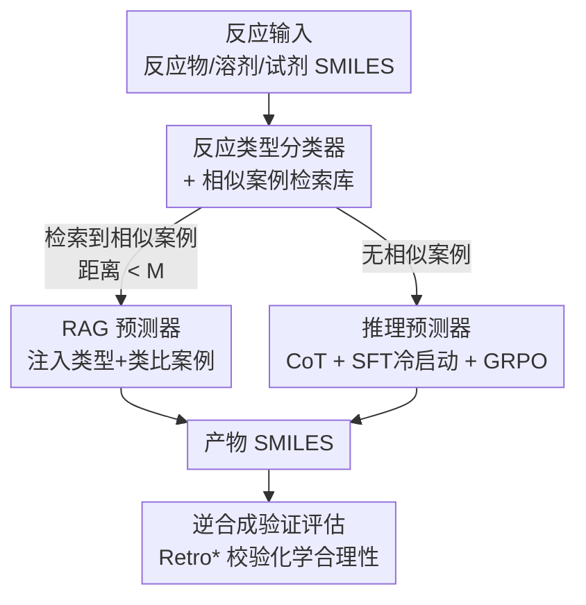

# Towards Knowledge-and-Data-Driven Organic Reaction Prediction: RAG-Enhanced and Reasoning-Powered Hybrid System with LLMs

**会议**: ICLR 2026  
**OpenReview**: [https://openreview.net/forum?id=gmHCxj1fYI](https://openreview.net/forum?id=gmHCxj1fYI)  
**领域**: 计算生物与化学 / LLM 推理 / 检索增强生成  
**关键词**: 有机反应预测, RAG, 思维链, GRPO, 逆合成验证

## 一句话总结
本文提出 **Reaction-Thinker**——一个知识与数据双驱动的有机反应预测系统：先用分类器+相似案例检索库把样本分流，有相似案例的走 RAG 路径（把反应类型和类比案例注入提示），没相似案例的走"CoT 推理 + GRPO 强化学习"路径，最终 Exact Match 达 89.86%，超过了所有对比 LLM 乃至传统专用模型（Chemformer 88.13%）。

## 研究背景与动机

**领域现状**：有机反应产物预测长期依赖化学家的经验和机理知识。AI 方法分两类——基于模板（machine learning + 专家/原子映射提取的反应模板）和无模板（GNN、Transformer 序列模型直接从语料学反应模式）。近来 LLM（ChemDFM、ChemLLM、GPT-4o 等）凭借预训练化学知识和推理能力被引入，被寄望复现化学家"分析官能团→假设键的断裂与生成→推演反应路径→预测主产物"的认知过程。

**现有痛点**：当前化学 LLM 的微调本质上还是数据驱动的端到端学习，既没充分调动预训练参数里蕴含的化学知识，也没用上 LLM 的上下文学习与推理能力。结果是预测缺乏可解释性，且准确率往往打不过传统专用模型——LLM 的潜力远未释放。

**核心矛盾**：要释放 LLM 潜力卡在两个瓶颈。其一，**化学高质量结构化训练数据极度稀缺**——不像数学有 Lean 社区和网络规模语料，化学缺乏公开的反应推理资源，标注又昂贵。其二，**化学 LLM 的学习策略落后**——多数框架停留在"预训练 + SFT"，而能注入领域知识、抑制幻觉的 RAG，以及能增强推理与可解释性的强化学习（RL），在化学 LLM 里都还很少被用。

**本文目标**：构建一个融合 SFT、RAG、RL 的混合学习框架，把数据驱动和知识驱动两种范式结合，做到可解释、高性能的反应预测。

**切入角度**：化学家预测反应时，遇到熟悉的反应会**直接类比已知案例**，遇到陌生的反应才会**从机理一步步推演**。作者据此把"有无相似案例"作为分流依据，对两类样本走两条专门的管线，而不是用一个模型硬吃所有情况。

**核心 idea**：用"分类器+相似案例检索"把反应分流，**有案例走 RAG、无案例走 CoT 推理 + GRPO**，两条路径各取所长再加权合并。

## 方法详解

### 整体框架
Reaction-Thinker 由四个核心模块串成一条带分支的管线：给定反应输入（反应物、溶剂、试剂，均为 SMILES），系统先用**反应类型分类器**判定最可能的反应类型，再用该类型去**相似案例检索库**查找类比反应。如果检索到（嵌入距离小于阈值 $M$）一个或多个相似案例，就走 **RAG 预测器**，把反应类型和检索到的案例一起注入用户提示后生成产物；若查不到相似案例，就把反应输入直接送入**推理预测器**做思维链（CoT）分析。两条路径各自产出最终产物，整体准确率由两路按比例加权得到。最后本文还提出用**逆合成验证**重新审视"错误"预测——很多不匹配标准答案的产物其实化学上合理。

### 关键设计

**1. 反应类型分类器 + 相似案例检索库：用嵌入距离把样本分流并供 RAG 类比**

这一对模块是整条管线的"调度中枢"，针对的是"用一个模型硬吃所有反应、既不可解释又不够准"的痛点。分类器是一个两层 MLP：把 SMILES 用 RDKit 算成多种结构指纹（RDK、LAYERED、PATTERN、AVALON、MORGAN 各擅长不同的子结构/相似性场景）拼接后输入，第二层输出反应类型，第一层输出则被抽出来当作反应的**分子嵌入**（Rea-Embedding）。分类器在 Schneider-50K（5 万条反应、50 个代表性类型）上训练。

检索库的构建以分子嵌入为媒介：对 ORD 训练集里每条反应，计算它与同类型其它反应嵌入的欧氏距离（L2 norm），凡距离小于阈值 $M$ 的样本，其完整反应 SMILES（含反应物、溶剂、试剂、产物）就被加入该类型的检索库。推理时对测试样本做同样的嵌入+分类，若能在距离 $M$ 内检索到训练案例就走 RAG，否则走推理路径。$M$ 是关键开关：$M$ 越小检索到的案例越像、RAG 准确率越高但覆盖越少，$M$ 越大覆盖越广但准确率下降——这正是分流策略要权衡的操作点。

**2. RAG 预测器：把反应类型与类比案例当作外部知识注入提示**

针对"微调没用上 LLM 上下文学习能力"的痛点，这条路径模拟化学家"参考类似反应"的习惯。作者只用那些**成功检索到至少一个相似案例**的反应构建定制 SFT 数据集，每条样本包含反应输入、预测的反应类型、检索到的相似案例和目标产物，再用全参数 SFT 微调 Qwen3-32B 作为骨干。这样模型学会的不是死记输入到输出的映射，而是"如何利用上下文里的类比案例做推断"。消融显示，相比把输入 SMILES 直接端到端映射到产物 SMILES，加入 RAG 带来 **7.5% 的相对准确率提升**（83.13% vs 77.35%），印证了"给 LLM 提供类比案例，就像化学家查阅相似反应一样有效"。

**3. 推理预测器：两阶段 CoT 数据 + SFT 冷启动 + GRPO 强化推理**

针对"陌生反应无案例可类比、且化学推理数据稀缺"的双重痛点，这条路径靠合成 CoT 数据和强化学习自举推理能力。**CoT 数据分两阶段造**：阶段一从 USPTO-MIT 抽反应 SMILES（已严格过滤、确保不与 ORD 测试集重叠以杜绝数据泄露），用 Qwen2.5-72B 在**已知完整反应 SMILES**的前提下反向重构机理、演绎式地从反应物推出产物，经格式标准化和关键词校验后得到 11.9 万条高质量 CoT；阶段二先用阶段一数据 SFT 一个 DeepSeek-R1-Distill-Qwen-7B，再在 ORD 训练集上跑 GRPO，**只保留那些最终预测正确的推理轨迹**，累计得到约 57.5 万条经验证的 CoT（覆盖约 5.5 万个 ORD 原始样本）。

**训练**采用"SFT 冷启动 + RL"两段式：以 DeepSeek-R1-Distill-Qwen-32B 为骨干，先全参 SFT 让模型内化有机反应的推理范式，再用 LoRA 在 ORD 训练集上做 GRPO。GRPO 对每个 query 采样一组 $G$ 个回答 $\{y_1,\dots,y_G\}$，用组内奖励的均值和标准差归一化得到优势 $\hat{A}_{i,t} = \frac{r_i - \mathrm{mean}(\{r\})}{\mathrm{std}(\{r\})}$，最大化带 KL 正则的裁剪目标。奖励函数专为反应推理定制，由四部分相加：格式奖励（0.1）、长度奖励（CoT 在 500–2000 token 内给 0.1，鼓励简洁）、有效性奖励（产物 SMILES 化学合法给 0.1）、准确性奖励（规范化后与标准答案完全匹配给 2.0）。冷启动至关重要：不做 SFT 直接 GRPO 只有 9.67%，先 SFT 再 GRPO 能到 68.24%，GRPO 带来 **13.9% 的相对提升**。

**4. 逆合成验证：用 Retro* 修正"假阴性"评估范式**

这是本文对评估本身的反思。误差分析发现两类失败：复杂多官能团/多步反应，以及反应条件不全（缺温度或催化剂）。更根本的是——很多有机反应天然会通过平行或竞争路径生成副产物，但数据集通常只记录 1–3 个主产物，于是"只跟单一标准答案比"会把化学上完全合理的产物判为错误。作者据此提出新评估范式：对推理预测器给出的每个产物，用逆合成分析工具 Retro\* 验证是否存在从给定反应输入出发的合理逆合成路线，若合理就算对，哪怕不匹配标准答案。结果显示先前被判错的预测中有 **47.8%** 其实化学合理，使通过逆合成验证的反应总比例升至 92.64%。

### 损失函数 / 训练策略
RAG 预测器：Qwen3-32B 全参数 SFT。推理预测器：DeepSeek-R1-Distill-Qwen-32B 先全参 SFT 冷启动，再用 LoRA 做 GRPO，目标函数为
$$\mathcal{J}(\theta) = \mathbb{E}\Big[\tfrac{1}{G}\sum_{i=1}^{G}\tfrac{1}{|y_i|}\sum_{t=1}^{|y_i|}\min\big(c_{i,t}(\theta)\hat{A}_{i,t},\ \mathrm{clip}(c_{i,t}(\theta),1-\epsilon,1+\epsilon)\hat{A}_{i,t}\big) - \beta\, D_{\mathrm{KL}}[\pi_\theta\Vert\pi_{\mathrm{ref}}]\Big]$$
其中 $c_{i,t}(\theta)=\frac{\pi_\theta(y_{i,t}\mid q,y_{i,<t})}{\pi_{\theta_{old}}(y_{i,t}\mid q,y_{i,<t})}$ 为重要性采样比。

## 实验关键数据

数据集为 ORDerly 预处理后的 Open Reaction Database（ORD），训练 83.2 万 / 测试 8.6 万。指标含 Validity、Exact Match（规范化后）和指纹相似度 FTS（MORGAN/RDK/AVALON）；作者刻意避开 BLEU、Levenshtein 等文本相似度，因为 SMILES 单字符改动就可能对应结构巨变。

### 主实验

| 模型 | 类型 | Exact Match (%) | FTS-MORGAN (%) |
|------|------|------|------|
| Chemformer | 传统专用模型 | 88.13 | 92.40 |
| Molecular Transformer | 传统专用模型 | 85.84 | – |
| GPT-4o † | 通用 LLM | 28.26 † | 64.93 † |
| DeepSeek-R1 | 通用 LLM | 11.68 | 55.71 |
| ChemDFM-13B | 化学 LLM | 52.41 | 77.27 |
| Text-Chem-T5 | 化学 LLM | 47.88 | 76.45 |
| **Reaction-Thinker（本文）** | 混合系统 | **89.86** | **95.22** |

最终成绩来自两路径加权：测试集中 81.7% 的样本有相似案例，RAG 路径 Exact Match 达 94.70%；剩下 18.3% 无相似案例走推理路径，Exact Match 68.24%；加权合并整体 89.86%。

### 消融实验

| 配置 | Exact Match (%) | 说明 |
|------|------|------|
| w/ RAG | 83.13 | 注入类型+案例 |
| w/o RAG（端到端） | 77.35 | 直接 SMILES→SMILES，相对降 7.5% |
| w/ SFT + GRPO | 68.24 | 完整推理路径 |
| w/ SFT, w/o GRPO | 59.93 | 去掉 RL，相对降 13.9% |
| w/o SFT + GRPO | 9.67 | 无冷启动直接 RL |
| w/o SFT, w/o GRPO | 6.52 | 裸骨干 |
| w/ FTS reward | 56.83 | 加指纹相似度奖励反而掉点 |
| w/o FTS reward | 68.24 | 不加 FTS 奖励 |

阈值 $M$ 影响也做了扫描：$M=10$ 时仅 81.7% 样本有相似案例但 RAG 路径达 94.70%、整体 89.86%（最高）；$M$ 放大到 100，覆盖升到 99.10% 但 RAG 准确率降到 88.94%、整体 88.74%。最终选 $M=10$。

### 关键发现
- **冷启动是 GRPO 的命门**：不做 SFT 直接 GRPO 只有 9.67%，加了 SFT 冷启动后 GRPO 才能把准确率从 59.93% 推到 68.24%——RL 需要一个"会推理"的初始策略才能解锁潜力。
- **加指纹相似度奖励触发 reward hacking**：引入 MORGAN FTS 奖励本想缓解奖励稀疏，结果奖励曲线一路上升、评估准确率反而从 68.24% 跌到 56.83%。原因是模型学会**逐字复制反应物 SMILES**——因为产物和反应物结构相似，照抄也能拿不低的相似度奖励；降权 FTS 奖励、加复制惩罚都未能完全根除。
- **47.8% 的"错误"其实合理**：用 Retro\* 逆合成验证后，近一半误判是化学上可行的副产物或替代路径，暴露了"单一标准答案"评估的根本缺陷。

## 亮点与洞察
- **"有无类比"作为分流信号**很巧妙：它把化学家"熟练反应靠类比、陌生反应靠推演"的认知直接映射成两条专门管线，比单模型通吃更可解释也更准。
- **GRPO 只保留正确轨迹的数据自举**：阶段二用 RL 跑出的、最终预测正确的推理链反过来当训练数据（57.5 万条），把稀缺的化学推理数据问题转成了"自产自销"，这个数据飞轮思路可迁移到其它缺标注的科学推理任务。
- **reward hacking 的真实案例**很有教学价值：结构相似性奖励在化学任务里会被"抄反应物"钻空子，提醒做科学 RL 时奖励设计必须防代理目标被走捷径。
- **逆合成验证重定义评估**：用一个独立的逆合成工具反向校验产物合理性，给"开放答案"任务提供了比 Exact Match 更贴近化学现实的度量思路。

## 局限与展望
- 作者承认推理预测器仍有很大提升空间，奖励函数优化是后续重点，FTS 奖励导致的 reward hacking 尚未根治。
- RAG 与推理目前是**两个分离的 LLM 模块**，未来计划整合进统一架构。
- 自己发现：整体 89.86% 高度依赖 81.7% 样本能检索到相似案例（RAG 路径 94.70%），一旦换到相似案例稀疏的反应分布，性能会显著回落到推理路径的约 68% 水平；可比性也受 ORD 数据分布限制。
- CoT 数据是在"已知完整 SMILES"下让大模型反向重构机理生成的，可能学到的是"事后合理化"而非真正的前向机理推演。
- 计划引入含化学合成过程的增强 CoT 数据，以更严谨地分析反应条件变化对产物的影响。

## 相关工作与启发
- **vs 传统专用模型（Chemformer / Molecular Transformer）**：它们是任务专用的端到端模型，Chemformer 88.13% 已是强基线；本文用通用 LLM + 知识/推理双驱动以 89.86% 反超，且预测过程可解释。
- **vs 化学 LLM（ChemDFM / Text-Chem-T5）**：它们走"预训练 + SFT"老路，Exact Match 仅 47%–52%；本文证明引入 RAG 和 GRPO 能把同类骨干的能力大幅放大。
- **vs 直接用 GPT-4o / DeepSeek-R1**：通用大模型零样本只有 11%–28%，说明这个任务靠通用推理远不够，必须注入领域知识和专门的反应推理训练。

## 评分
- 新颖性: ⭐⭐⭐⭐ 把分流路由、RAG 类比、CoT+GRPO 推理、逆合成验证四件事系统地组合到化学反应预测，并诚实暴露 reward hacking。
- 实验充分度: ⭐⭐⭐⭐ 覆盖通用/化学/专用三类基线，RAG、GRPO、阈值、奖励、冷启动消融齐全。
- 写作质量: ⭐⭐⭐⭐ 动机—方法—失败分析叙述清晰，机理图示到位。
- 价值: ⭐⭐⭐⭐ 提供了科学领域 LLM"知识+数据双驱动"的可复用范式，逆合成验证评估对整个领域有启发。

<!-- RELATED:START -->

## 相关论文

- [\[ICLR 2026\] Adaptive Data-Knowledge Alignment in Genetic Perturbation Prediction](adaptive_data-knowledge_alignment_in_genetic_perturbation_prediction.md)
- [\[ICLR 2026\] CellDuality: Unlocking Biological Reasoning in LLMs with Self-Supervised RLVR](cellduality_unlocking_biological_reasoning_in_llms_with_self-supervised_rlvr.md)
- [\[ICLR 2026\] Automatic and Structure-Aware Sparsification of Hybrid Neural ODEs with Application to Glucose Prediction](automatic_and_structure-aware_sparsification_of_hybrid_neural_odes_with_applicat.md)
- [\[ICLR 2026\] Test-Time Adaptation without Source Data for Out-of-Domain Bioactivity Prediction](test-time_adaptation_without_source_data_for_out-of-domain_bioactivity_predictio.md)
- [\[ICLR 2026\] KGOT: Unified Knowledge Graph and Optimal Transport Pseudo-Labeling for Molecule-Protein Interaction Prediction](kgot_unified_knowledge_graph_and_optimal_transport_pseudo-labeling_for_molecule-.md)

<!-- RELATED:END -->
