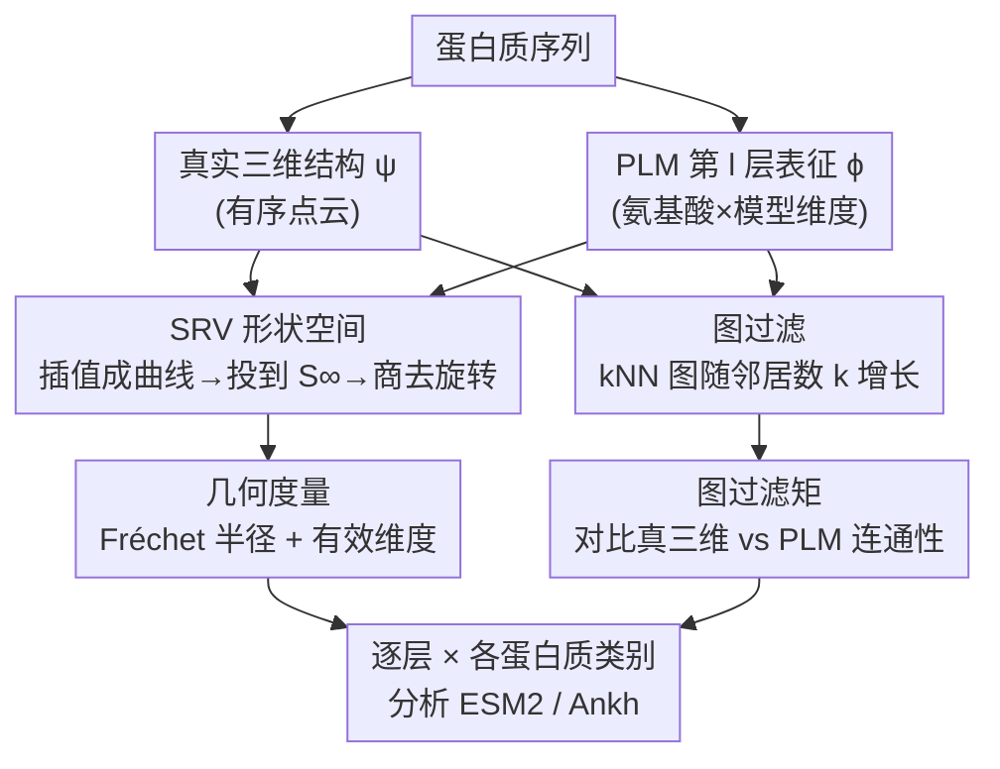

# Towards Understanding the Shape of Representations in Protein Language Models

**会议**: ICLR 2026  
**OpenReview**: [https://openreview.net/forum?id=Dnn8SSBJaY](https://openreview.net/forum?id=Dnn8SSBJaY)  
**代码**: https://github.com/KBeshkov/ProtGeom (有)  
**领域**: 计算生物 / 蛋白质语言模型 / 表征几何 / 可解释性  
**关键词**: 蛋白质语言模型, ESM2, 形状空间, SRV 表征, 图过滤

## 一句话总结
本文不去解释蛋白质语言模型（PLM）如何处理单条序列，而是借用形状分析里的平方根速度（SRV）表征和图过滤工具，把"整个蛋白质空间被 PLM 怎样变形"刻画成可度量的几何对象，进而发现 ESM2 的各层表征会先膨胀后收缩，且在倒数第二层附近最忠实地编码三维结构、最擅长捕捉约 2 个和约 8 个残基的局部上下文。

## 研究背景与动机

**领域现状**：以 ESM2 为代表的蛋白质语言模型已经成为蛋白质折叠预测、序列设计、功能打分的主力工具，人们普遍相信它们的隐藏表征里编码了蛋白质的物理、进化和功能属性，并且这些表征是折叠模型（如 ESMFold）的良好初始化。

**现有痛点**：现有的 PLM 可解释性工作——无论是用 categorical Jacobian 揭示共进化残基的成对统计、还是用稀疏自编码器找出"结合位点 / 结构基序 / 功能域 / Gene Ontology 项"这类人可理解的特征——都只盯着**单条序列如何被映射成一个高维向量**。它们回答的是"一个蛋白质长什么样"，却没有回答"不同蛋白质之间的关系在 PLM 隐空间里被怎样重排"。

**核心矛盾**：如果"结构决定功能、相似结构意味着相似功能"，那么真正有价值的信息其实藏在**蛋白质两两之间的几何关系**里。但现有做法有两个盲点：一是只看单点不看点与点之间的度量结构；二是 PLM 表征本是一个 `氨基酸数 × 模型维度` 的张量，大量应用图省事直接沿氨基酸维度做平均，这一步**把表征的"形状"信息整个抹掉了**。

**本文目标**：把"蛋白质的度量空间"和"PLM 表征的形状度量空间"放在一起对照，弄清楚两件事——(1) PLM 各层把整个蛋白质空间的几何（维度、铺展程度）变成了什么样；(2) PLM 在多大的上下文尺度上、在哪一层最忠实地保留了真实的三维结构。

**切入角度**：作者把成熟的**形状分析（shape analysis）**框架搬进 PLM 研究。蛋白质结构对比早有 RMSD、TM-score、FATCAT 这类基于"最优叠合"的度量工具，但从没人拿它们去量 PLM 的隐藏表征。关键观察是：只要把蛋白质（或它的 PLM 表征）当成 $\mathbb{R}^m$ 里的**有序点云→曲线**，就能定义一个对旋转平移不变、且能比较不同长度蛋白质的度量空间。

**核心 idea**：用"曲线的形状空间"代替"平均池化的向量"，再配一套"图过滤"探针，把 PLM 对整个蛋白质空间的变形刻画成可计算的几何统计量。

## 方法详解

### 整体框架

整篇工作不是提出一个新模型，而是搭一套**几何分析管线**：给定一条蛋白质序列，一边映射到它真实的三维结构（$\psi$），一边送进 PLM 取某一层的隐藏表征（$\phi$）；两者都是有序点云，于是用两条互补的路径去度量它们——一条把点云插值成曲线、投到 SRV 形状空间，算"整个蛋白质集合在该层的几何"（铺展程度与维度）；另一条把点云转成 k 近邻图、做图过滤，算"PLM 表征的连通结构和真三维结构有多像"。把这两套度量沿 ESM2 / Ankh 的逐层、按 SCOPe 的不同蛋白质类别扫一遍，就得到本文的全部结论。

### 关键设计

**1. SRV 形状空间：把蛋白质和表征都当成"曲线"再消掉旋转平移**

直接比较 $\mathbb{R}^3$ 里的真实结构和 $\mathbb{R}^m$（$m \gg 3$）里的 PLM 表征是没意义的——维度都不一样，而且不同蛋白质氨基酸数不同，点云无法直接对齐。本文的解法是把"蛋白质"统一抽象成连续曲线 $\gamma:[0,1]\to\mathbb{R}^m$：用二次样条把有序点云插值成一条曲线（作者刻意选最低阶但仍可微的二次样条，避免高阶样条往点云里注入虚假结构），这样无论蛋白质多长，得到的都是同一种"曲线"对象。

接着套用平方根速度（square-root velocity, SRV）表征
$$q(t) = \dot\gamma(t)\big/\sqrt{\lVert\dot\gamma(t)\rVert_2}$$
分母里的归一化把曲线投到无穷维球面 $S^\infty$，于是测地线、距离都变得好算，且自动消除了平移。剩下的旋转用 SVD 求最优叠合 $\hat R=\arg\min_{R\in SO(n)}\lVert q_1-Rq_2\rVert_2$ 商掉，两条曲线的距离定义为 $d(q_1,q_2)=\lVert q_1-\hat R q_2\rVert_2$。这样得到的形状空间 $H=S^\infty/SO(m)$ 带有黎曼结构，所有 SE(m) 等价的曲线落在同一个点（其原像称为一根纤维 fiber）。它的好处是：不再依赖"平均池化成一个向量"，而是把整条表征的形状原汁原味地保留下来，并且给出一个能在不同长度蛋白质之间一致计算的度量。

**2. 两个形状空间几何量：Fréchet 半径量铺展、有效维度量自由度**

有了带黎曼结构的形状空间，就能定义蛋白质集合在该空间里的统计量。第一个是 **Fréchet 半径**：先用梯度下降求 Fréchet 均值 $p_F=\arg\min_{x\in H}\sum d(x,y_i)$，再取 $r_F=\mathbb{E}_{y_i\in Y}[d(y_i,p_F)]$，直观上衡量"不同蛋白质的形状彼此铺得有多开"——半径小说明 PLM 把不同蛋白质压成了相似形状，大则相反。第二个是 **有效维度**，借用协方差特征值定义
$$\lambda_{\text{eff}} = \frac{(\sum_k \lambda_k)^2}{\sum_k \lambda_k^2}$$
但因为数据活在弯曲流形上，需先用对数映射把所有点投到 Fréchet 均值的切空间（$z_i=\log_{p_F}(y_i)$），再在切空间做 tangent PCA。有效维度大意味着 PLM 表征需要许多种不同的形状变形才能描述彼此差异，小则说明寥寥几个形状描述子就够了。这两个量一个测"散布"一个测"自由度"，合起来刻画 PLM 各层形状空间的几何形态。

**3. 图过滤矩：用 kNN 图在多尺度上对比"结构编码得有多忠实"**

形状空间的全局几何说不清"PLM 在多大上下文尺度上保留了结构"这种局部问题，因为语言模型本质是按上下文工作的，而对 PLM 表征来说并不存在"6–12 Å 接触阈值"这样的物理单位。本文用**图过滤**绕过阈值选择：对真三维结构和 PLM 表征各自构造 k 近邻图，随着邻居数 $k$ 增大形成一族嵌套的邻接矩阵 $A^t$。同一条长度 $L$ 的蛋白质，两种邻接矩阵都活在 $\{0,1\}^{L\times L}$，于是可以直接用逐元素 1-范数比较 $d_A(\psi(P),\phi(P))=\lVert\psi(A^t)-\phi(A^t)\rVert_1$。

随 $k$ 变化的距离天然服从超几何分布，作者用"真蛋白质 vs 随机点云"的经验分布做归一化，得到**图过滤矩**：
$$\mathbb{E}_{P_i\in P}[d(P_i,\phi(P_i))]_{\text{norm}} = \frac{\mathbb{E}_{P_i\in P}[d_A(\psi(P_i),\phi(P_i))]}{\mathbb{E}_{P_i\in P,\,R_i\in R}[d_A(\psi(P_i),R_i)]}$$
取值 $\geq 1$ 表示 PLM 把残基排成了随机点云（没编码结构），越小则表示三维结构被编码得越忠实。沿 $k$ 扫过去就能看出 PLM 在哪个上下文尺度上、哪一层最像真结构——这正是定位"局部 vs 全局结构编码"的探针。

## 实验关键数据

### 主实验

分析基于 SCOPe 数据集随机采样的 **1377 条蛋白质结构**，覆盖 8 个类别（Alpha、Beta、Alpha/Beta、Alpha+Beta、Alpha and Beta、膜与细胞表面蛋白、小蛋白、设计蛋白），每类最多 200 条；模型为不同规模的 ESM2 与通用蛋白质模型 Ankh。

| 分析维度 | 度量 | 关键观察 |
|--------|------|----------|
| 形状空间铺展 | Fréchet 半径 | 随层数加深而下降；PLM 表征远小于真三维结构；几乎不随模型规模变化 |
| 形状空间自由度 | 有效维度 | 前几层维度膨胀、后几层收缩；大模型膨胀更剧烈且出现第二个峰；末层维度极低 |
| 结构编码忠实度 | 图过滤矩 | 双峰：约 2 个邻居与约 8 个邻居处最像真结构；最忠实编码出现在临近末层但非末层 |

### 消融 / 鲁棒性分析

| 配置 | 关键结果 | 说明 |
|------|---------|------|
| ESM2（多种规模） | 膨胀-收缩模式，大模型更明显 | 主分析模型 |
| Ankh（通用蛋白质模型） | 出现同样的膨胀-收缩模式，但后层降维更剧烈 | 验证现象不限于 ESM2 |
| 样条阶数 / 插值采样点 | 结论稳健（Fig. 6） | 二次样条已足够，高阶样条会引入虚假结构 |
| 蛋白质长度 vs 图过滤矩 | 浅层偶有相关、深层（尤其大模型）无相关 | 局部上下文结构的编码与蛋白质长度无关 |

### 关键发现
- **膨胀后收缩的两段式**：PLM 前几层把形状空间的有效维度撑大（高抽象阶段），后几层猛烈压缩到低维子空间（语义聚焦阶段）——这与传统语言模型里观察到的"高维抽象相变"高度吻合，说明 PLM 用"少数几种形状变形"就能高效游走表征空间。
- **结构编码的双峰**：PLM 在约 2 个残基（最近邻一致）和约 8 个残基处最忠实地保留三维结构；第二个谷在 Beta 类里不明显，作者推测可能与 Alpha 螺旋的表征有关，但承认尚需更多研究。
- **倒数第二层最忠实**：结构在临近末层（而非末层）编码得最好，意味着 unmasking 的最后一步并不需要结构信息，但中间层把"编码结构"当作了重要的处理步骤——这也解释了为何 ESMFold 受益于预训练 PLM，并暗示在最优结构层而非整模型上训练折叠头可能更好。
- **类别差异**：Alpha/Beta 蛋白的 PLM 表征与真三维结构最像，小蛋白和设计蛋白则被表示成更"另类"的形状。

## 亮点与洞察
- **把形状分析搬进 PLM 可解释性**：用 SRV + 黎曼形状空间替代"平均池化成向量"，第一次把整条表征的"形状"作为分析对象，捕回了被平均掉的丰富信息——这套度量天然对旋转平移不变、还能跨不同长度蛋白质比较。
- **图过滤巧妙绕开阈值难题**：PLM 隐空间没有"埃"这种物理单位，无法设接触阈值；用 kNN 图随 $k$ 的过滤一次性扫过所有上下文尺度，再用随机点云归一化，把"结构编码"变成一条可读的曲线。
- **"PLM 居然编码了结构"本身就值得玩味**：模型只被训练去做掩码氨基酸预测，从没被要求学结构，却自发编码了三维结构，暗示 unmasking 与折叠这两个函数高度相关——这是个可迁移到其他模态"涌现结构"分析的视角。
- **可直接落地的结论**：既然结构在倒数第二层附近最忠实，折叠模型完全可以只取最优层而非整个模型来做初始化。

## 局限与展望
- **折叠假设未被验证**：作者自承用线性模型或小网络在"最优结构层上训折叠头"的初步尝试**没能泛化**（data not shown），验证这一核心推论需要训练更大的模型。
- **第二个谷（~8 邻居）解释不清**：双峰中较远的那个峰只能"推测"与 Alpha 螺旋有关，缺乏机制层面的确证。
- **样本与类别受限**：仅 1377 条 SCOPe 蛋白、部分因缺 pdb 被排除；为什么 Alpha/Beta 编码得最好、小/设计蛋白最差，作者明说留作未来工作。
- **结论偏现象学**：膨胀-收缩对应的"具体是哪些形状变形"、收缩阶段的少数变形到底是什么，本文只给出几何统计量，没有打开里面的语义内容。

## 相关工作与启发
- **vs categorical Jacobian（Zhang et al. 2024）**：他们用 Jacobian 论证 PLM 编码共进化残基的成对统计，关注单序列内部的残基关系；本文跳到"蛋白质之间"的度量几何，回答的是整个序列空间被如何重排。
- **vs 稀疏自编码器（Simon & Zou 2024 / Gujral et al. 2025）**：SAE 路线把单条表征拆成人可理解的特征（结合、基序、GO 项）；本文不拆特征，而是直接度量表征集合的形状几何与结构忠实度。
- **vs 内在维度 / IsoScore（Aghajanyan 2020；Hakim et al. 2025）**：以往用内在维度或 IsoScore 说明 PLM 表征维度很低（单蛋白 2–14 维），本文在形状空间流形上算有效维度，给出"膨胀-收缩"的逐层动态，并与 NLP 里的高维抽象相变（Cheng et al. 2024）相互印证。

## 评分
- 新颖性: ⭐⭐⭐⭐⭐ 首次把 SRV 形状空间与图过滤引入 PLM 表征几何分析，视角独特
- 实验充分度: ⭐⭐⭐⭐ 覆盖多规模 ESM2 + Ankh、8 个蛋白质类别且做了鲁棒性检验，但折叠落地假设未被验证
- 写作质量: ⭐⭐⭐⭐ 数学框架交代清晰，但部分现象（第二个谷）解释偏推测
- 价值: ⭐⭐⭐⭐ 给"用哪一层做折叠初始化"等实践问题提供了几何依据，方法可迁移到其他涌现结构分析

<!-- RELATED:START -->

## 相关论文

- [\[ICLR 2026\] Reverse Distillation: Consistently Scaling Protein Language Model Representations](reverse_distillation_consistently_scaling_protein_language_model_representations.md)
- [\[ICLR 2026\] Controlling Repetition in Protein Language Models](controlling_repetition_in_protein_language_models.md)
- [\[ICLR 2026\] The Human Brain as a Dynamic Mixture of Expert Models in Video Understanding](the_human_brain_as_a_dynamic_mixture_of_expert_models_in_video_understanding.md)
- [\[ICLR 2026\] ProTDyn: A Foundation Protein Language Model for Thermodynamics and Dynamics Generation](protdyn_a_foundation_protein_language_model_for_thermodynamics_and_dynamics_gene.md)
- [\[ICML 2025\] Steering Protein Language Models](../../ICML2025/computational_biology/steering_protein_language_models.md)

<!-- RELATED:END -->
