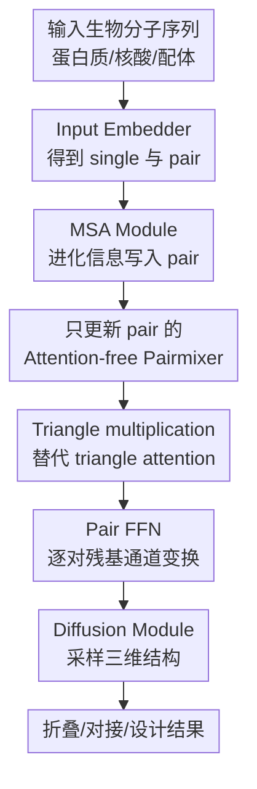

# Triangle Multiplication is All You Need for Biomolecular Structure Representations

**会议**: ICLR2026  
**OpenReview**: [https://openreview.net/forum?id=CrXcfMLR9q](https://openreview.net/forum?id=CrXcfMLR9q)  
**代码**: https://github.com/genesistherapeutics/pairmixer  
**领域**: 计算生物学 / 生物分子结构表示  
**关键词**: 生物分子结构预测, Pairmixer, triangle multiplication, Pairformer, 蛋白质设计

## 一句话总结
这篇论文提出 Pairmixer：在 AlphaFold3/Boltz-1 风格的共折叠模型中去掉昂贵的 triangle attention 和 sequence update，只保留 pair representation 上的 triangle multiplication 与 FFN，就能接近 Pairformer 的结构预测精度，同时显著降低训练、推理和蛋白质设计中的计算开销。

## 研究背景与动机
**领域现状**：AlphaFold 系列模型已经把蛋白质结构预测推到非常高的精度，后续的 AlphaFold3、Boltz-1、Chai-1 等模型进一步把任务扩展到蛋白质-蛋白质、蛋白质-配体、抗体-抗原、蛋白质-核酸和 RNA 等复杂生物分子共折叠场景。这类模型通常先把输入序列、MSA、模板或构象信息编码成 single representation 和 pair representation，再用 Pairformer/Evoformer 风格的 backbone 反复更新表示，最后由 diffusion module 采样三维原子坐标。

**现有痛点**：真正把这些模型用到大规模药筛、蛋白质互作组建模、全蛋白质组折叠或 de novo binder design 时，瓶颈不再只是精度，而是每次推理的时间和显存。论文中给出的例子很直观：Boltz-1 在 A100 上处理 2048-token 序列可能需要十几分钟，而下游筛选或设计往往要跑成千上万甚至更多次结构预测。Pairformer 的 pair 表示是 $L \times L$ 的二维张量，triangle primitives 又随序列长度呈三次复杂度增长，因此长序列和大复合物会很快撞上计算墙。

**核心矛盾**：Pairformer 的强处在于能在 pair representation 中建模残基三元组的几何约束，但它同时用了多种重型模块：sequence attention with pair bias、triangle attention、triangle multiplication 和 pair FFN。问题是，这些模块是否都必要？如果 triangle attention 和 sequence update 只是增加复杂度，却不是结构表示能力的关键来源，那么继续保留它们会让模型在大规模应用中付出不必要的成本。

**本文目标**：作者希望找到一个更小、更快、但仍保留结构预测核心几何推理能力的 backbone。具体来说，它要在不改 diffusion module 的前提下替换 Boltz-1 的 Pairformer；要能在 RCSB、CASP15、蛋白质-配体、抗体-抗原、蛋白质-核酸和 RNA 等 benchmark 上接近原模型；还要在长序列推理和 binder design 这种计算密集场景中真正带来速度与显存收益。

**切入角度**：论文的关键观察是，现代共折叠模型已经用浅层 MSA module 把进化信息压进 pair representation $z_{msa}$，后续 backbone 未必还需要大量 sequence update；而 triangle multiplication 虽然也是三次复杂度，但可以用矩阵乘法高效实现，比对每一行/列反复做 attention 的 triangle attention 更省。换句话说，作者不是把结构预测退回到纯序列 Transformer，而是押注二维 pair representation 本身才是承载结构几何的核心中介。

**核心 idea**：用一个只更新 pair representation 的 attention-free backbone 替代 Pairformer，让 triangle multiplication 负责残基三元组几何混合，FFN 负责每对残基的通道变换，从而在保留结构表示能力的同时去掉最贵的 attention 路径。

## 方法详解

### 整体框架
Pairmixer 被放在 Boltz-1/AlphaFold3 式结构预测管线的 backbone 位置：输入序列先经过 input embedder 和 MSA module，得到初始 single representation $s_{init}$ 与带进化信息的 pair representation $z_{msa}$；Pairmixer 不再更新 $s_{init}$，只对 $z_{msa}$ 做多层 triangle multiplication 和 FFN；最后 diffusion module 接收未改动的 $s_{init}$ 与更新后的 $z_N$，采样全原子三维结构。

这个框架的重点不是重新设计整个结构预测系统，而是把 Pairformer 的 backbone 缩成一个更干净的 pair mixer。它保留了二维 pair 表示和三元组推理，删除了 sequence attention、triangle attention，以及 MSA module 中的 triangle attention，从而把“结构几何表示”与“昂贵 attention 机制”拆开检验。

Pairmixer 的每一层非常短：先做 incoming triangle multiplication，再做 outgoing triangle multiplication，最后做 pair FFN，并且都以残差形式加回 pair representation。用算法写就是 $z_0=z_{msa}$，第 $l$ 层依次执行 $z_l \leftarrow z_l+\mathrm{TriMulIncoming}(z_l)$、$z_l \leftarrow z_l+\mathrm{TriMulOutgoing}(z_l)$、$z_{l+1}\leftarrow z_l+\mathrm{FFN}(z_l)$。最终输出 $z_N$ 作为 backbone pair feature。

### 关键设计
**1. 只更新 pair 的 Attention-free Pairmixer：把结构推理集中到二维残基关系上**

Pairformer 同时维护 single representation $s$ 和 pair representation $z$，看起来更完整，但本文认为在 AlphaFold3 风格的共折叠模型里，后续 sequence update 的边际价值并不高。原因是 MSA module 已经先把同源序列中的进化耦合编码进 $z_{msa}$，而 diffusion module 也主要依赖 pair feature 来获得残基间距离、界面关系和配体局部环境。于是 Pairmixer 直接让 $s_{backbone}=s_{init}$，把所有 backbone 计算预算集中到 $z$ 上。

这个选择比“把 Pairformer 换成普通 Transformer”更保守，也更符合结构预测的物理直觉。三维折叠不是只靠一维序列上下文就能完成，核心困难是远距离残基在空间中相互接触、多个链之间形成界面、小分子与蛋白 pocket 对齐。二维 pair representation 天然对应 token-pair 的关系，因此 Pairmixer 删除的是 sequence attention 这条路径，而不是删除 pair 表示本身。实验中 sequence-only Transformer 在 lDDT、DockQ、lDDT-PLI 等指标上明显落后，也反过来说明“保留 pair 表示”是这个简化能成立的前提。

**2. Triangle multiplication 替代 triangle attention：保留三元组几何约束但换成更高效的混合方式**

Pairformer 中的 triangle attention 和 triangle multiplication 都是在 pair graph 上看三元组 $(i,j,k)$，但计算形态不同。triangle attention 对每个 residue $i$ 的一整行 pair feature 做 attention，并用完整 pair representation 作为 bias；这相当于要做 $L$ 次长度为 $L$ 的 attention，内存和 runtime 开销很高。Pairmixer 则只保留 triangle multiplication，用矩阵乘法式的聚合更新每条边 $z_{ij}$：

$$
\mathrm{TriMul}(z)_{ij}=\sum_{k=1}^{L}(W_a z_{ik}) \odot (W_b z_{jk}).
$$

这条公式的含义是，更新 $i$ 与 $j$ 的关系时，模型会遍历所有中间点 $k$，同时查看 $i-k$ 与 $j-k$ 两条边的特征。如果某个 $k$ 同时与 $i$、$j$ 形成有意义的几何约束，那么它会通过逐通道乘积影响 $z_{ij}$。这仍然是三元组级别的推理，只是没有显式 attention 权重。作者的判断是：对结构预测而言，关键不是 attention 这个算子本身，而是 pair 表示能否反复通过三元组关系传播几何约束；triangle multiplication 已经能做到这一点，并且可以用高效的 `einsum`/矩阵乘法实现。

**3. Incoming/Outgoing 双向三角混合加 Pair FFN：用极简层结构覆盖不同方向的边关系**

生物分子复合物里的 pair graph 是带方向实现的二维张量，$z_{ij}$ 和 $z_{ji}$ 在模型里可以承载不同通道信息。Pairmixer 每层同时使用 incoming 和 outgoing triangle multiplication，相当于从行/列两个方向汇聚经过第三个 token $k$ 的关系，再用 FFN 对每个 pair entry 的通道做非线性变换。这样一层虽然只有三步，但能交替完成“跨 token 的几何混合”和“每条边内部的特征重整”。

这个设计也解释了为什么简单替代物不够好。论文在附录中比较了 FFT mixer、AvgPool mixer、只保留行方向 triangle multiplication 和完整双向 TriMul。FFT 或平均池化只是在位置维度上粗略混合，无法区分跨链不连续位置、空间接触和真实三元组约束；只做单向 TriMul 也会损失一部分边方向信息。完整 incoming/outgoing triangle multiplication 在 lDDT、DockQ 和配体指标上更稳，说明 Pairmixer 的“简化”不是把所有结构归纳偏置都拿掉，而是只留下最有效的那一类。

**4. 固定 diffusion module 做公平替换：把收益归因到 backbone 而不是下游解码器**

Pairmixer 的实现建立在 Boltz-1 上，作者只替换 Pairformer backbone，并额外移除 MSA Module 中的 triangle attention；diffusion module 的 Transformer 解码器保持不变。这一点很重要，因为如果同时改 diffusion module，很难判断性能来自更强的坐标采样器，还是来自更高效的结构表示。固定 diffusion module 后，Pairmixer 输出的 $z_N$ 必须真的能提供足够好的距离和界面信息，才能让同一个解码器生成接近 Pairformer 的结构。

论文还用 distogram 结果进一步排除“diffusion module 自动补救一切”的解释。distogram head 直接从 backbone feature $z_{backbone}$ 预测离散距离矩阵，Pairmixer 在 global/inter-chain Top-1、Top-5 accuracy 和 contact precision 上都接近 Pairformer。这说明 Pairmixer 不是靠后端 diffusion 把差表示硬修好，而是本身学到了可用的 pairwise distance representation。

### 一个完整示例
可以把一个蛋白质-配体复合物的预测过程想成这样：输入端把蛋白序列、配体 heavy atoms 和必要的链间位置关系拼成 token 序列，input embedder 得到每个 token 的 single feature，以及每对 token 的初始 pair feature。MSA module 读取蛋白序列的同源序列，把保守位点、共进化信号和可能的接触关系压进 $z_{msa}$。

进入 Pairmixer 后，假设模型要更新一个 pocket 残基 $i$ 与配体原子 $j$ 的关系。triangle multiplication 会检查所有中间 token $k$：有些 $k$ 是 pocket 中与 $i$ 空间邻近的残基，有些 $k$ 是配体上与 $j$ 同属于同一化学基团的原子，还有些 $k$ 可能是远距离但通过折叠后接触形成约束的残基。若 $z_{ik}$ 和 $z_{jk}$ 的投影在某些通道上同时激活，它们的逐通道乘积就会增强 $z_{ij}$ 中对应的几何证据。

经过多层 incoming/outgoing TriMul 与 FFN 后，$z_N$ 不只是“第 $i$ 个 token 和第 $j$ 个 token 的局部相似度”，而是包含了许多第三方 token 传来的约束。diffusion module 再依据这些 pair features 去 denoise 原子坐标，因此 pocket 形状、界面接触和配体姿态都能被同时考虑。这个过程没有显式 triangle attention，但依然保留了通过残基三元组累积几何一致性的能力。

### 损失函数 / 训练策略
论文沿用 Boltz-1 的训练日程与 diffusion 结构预测目标。第一阶段在 PDB 与 OpenFold distillation dataset 上训练 53k iterations，使用 384 token / 3456 atom crops；第二阶段在 PDB 上 finetune 15k iterations，crop 增大到 512 token / 4608 atoms。推理默认使用 10 个 recycling steps 和 200 个 sampling steps，主评测中每个复合物采样 5 个 pose，并报告 top pose 的 oracle 指标。

模型规模方面，作者训练了 small、medium、large 三种配置。large 配置对齐 Boltz-1，包含 48 层 backbone 与 24 层 diffusion Transformer；small/medium 则减少 backbone 或 diffusion 层数，用来观察效率-性能曲线。训练时还保留 Pairformer 和 sequence-only Transformer 作为对照，前者检验 Pairmixer 是否能替代当前主流 backbone，后者检验只靠一维序列 attention 是否足够。

## 实验关键数据

### 主实验
主实验首先比较了 RCSB test set 上不同规模模型的性能与训练成本。Pairmixer 在 large phase 2 阶段达到与 Pairformer 相同的 lDDT，同时 GPU-days 约为 Pairformer 的 $269/421\approx64\%$，与论文正文“训练成本降低约 34%”一致。更小规模下，Pairmixer 也通常接近或超过 Pairformer，并明显优于 sequence-only Transformer。

| 设置 | 架构 | GPU-days | lDDT | DockQ>0.23 | lDDT-PLI | RMSD<2Å |
|------|------|----------|------|------------|----------|---------|
| Small, 68 epoch | Transformer | 86 | 0.68 | 0.51 | 0.47 | 0.43 |
| Small, 68 epoch | Pairformer | 125 | 0.74 | 0.58 | 0.52 | 0.48 |
| Small, 68 epoch | Pairmixer | 98 | 0.73 | 0.59 | 0.51 | 0.45 |
| Medium, 68 epoch | Pairformer | 194 | 0.75 | 0.60 | 0.53 | 0.49 |
| Medium, 68 epoch | Pairmixer | 146 | 0.76 | 0.60 | 0.54 | 0.53 |
| Large Phase 2 | Pairformer | 421 | 0.78 | 0.64 | 0.57 | 0.54 |
| Large Phase 2 | Pairmixer | 269 | 0.78 | 0.63 | 0.57 | 0.55 |

推理速度方面，Pairmixer 的优势随序列长度增大而更明显。在默认 512 token、4608 atom、MSA depth 4096、10 recycles、48 blocks 和 200 sampling steps 的设置下，Boltz-1/Pairformer 在 GH200 上单样本约 34 秒，Pairmixer 约 21 秒，达到 1.6× speedup。到 1024 tokens 时加速约 2×；到 2048 tokens 时，Pairformer 约 1000 秒，Pairmixer 约 250 秒，加速约 4×。

| 场景 | Pairformer / Boltz-1 | Pairmixer | 速度收益 |
|------|----------------------|-----------|----------|
| 512 tokens 默认设置 | 34 秒 | 21 秒 | 1.6× |
| 1024 tokens | 未列具体秒数 | 未列具体秒数 | 约 2× |
| 2048 tokens | 约 1000 秒 | 约 250 秒 | 约 4× |
| Large Phase 2 训练 | 421 GPU-days | 269 GPU-days | 约 34% 成本下降 |

### 消融实验
Pairformer 模块消融显示，在短训练 schedule 下，triangle attention 和 triangle multiplication 都有贡献，但 sequence update 的影响很小；这支持 Pairmixer 首先删除 sequence update 的判断。Pairmixer 进一步通过更长训练恢复性能，说明一开始去掉 triangle attention 会降低学习速度或早期性能，但不是最终表达能力的硬缺口。

| 配置 | GPU-days | lDDT | DockQ>0.23 | lDDT-PLI | RMSD<2Å | 说明 |
|------|----------|------|------------|----------|---------|------|
| Pairformer 完整小模型 | 82 | 0.74 | 0.57 | 0.52 | 0.50 | 原始模块都保留 |
| No Seq Update | 80 | 0.73 | 0.57 | 0.54 | 0.49 | 去掉 sequence update 后影响很小 |
| No Tri Att | 66 | 0.70 | 0.55 | 0.50 | 0.48 | 短训下 triangle attention 有帮助 |
| No Tri Mul | 71 | 0.70 | 0.53 | 0.49 | 0.46 | triangle multiplication 同样关键 |

作者还分析了 triangle multiplication 内部到底是否在学习稀疏长程关系。他们在推理时对 TriMul 施加 dropout：随机删 interaction 很快伤害性能，而删掉低范数 interaction 即使比例很高也比较稳定；这说明模型真正依赖的是少量高强度 pair interaction，而不是平均使用所有三元组。进一步的 blockwise dropout 只保留局部窗口时，性能从 $B=512$ 就开始下降，在 $B=256$ 有明显下滑，说明这些关键三元组很多是长程相互作用。

| 分析设置 | 观察结果 | 解释 |
|----------|----------|------|
| 随机 dropout 超过 25% | lDDT、DockQ、lDDT-PLI 等快速下降 | 随机删除会破坏关键 interaction |
| low-norm dropout 到 75% | 性能仍接近原模型 | 低范数 interaction 多数不是关键约束 |
| blockwise dropout, $B=512$ | 性能开始下降 | 只保留局部窗口不足以描述结构 |
| blockwise dropout, $B=256$ | 多个指标明显下降 | TriMul 依赖稀疏但长程的三元组关系 |

### 关键发现
- Pairmixer 与 Pairformer 的主要差距不在主流 cofolding accuracy 上，而在极端或特定任务上会有轻微波动。例如 RCSB 系统比较中，Pairmixer oracle 的 mean lDDT 与 Boltz-1 oracle 都约为 0.79，DockQ 略低，配体 RMSD<2Å 略高或相近。
- sequence-only Transformer 虽然计算更快，但在大多数结构指标上落后，尤其 Pairmixer 在 lDDT head-to-head 中 93.7% case 优于 Transformer，说明 pair representation 对局部距离准确性非常关键。
- 在多样任务上，Pairmixer 基本追平 Pairformer：PoseBusters 蛋白质-配体 RMSD<2 为 0.67 vs 0.68，抗体-抗原 DockQ>0.23 为 0.23 vs 0.23，蛋白质-核酸 ICS/IPS 为 0.51/0.66 vs 0.50/0.65，RNA lDDT 为 0.59 vs 0.58。
- 在 binder design 里，Pairmixer 的价值更直接：BindFast 对 140 到 607 总长度的目标有 2.01× 到 2.60× 的加速，并把可处理 target length 从约 500 residues 提升到约 650 residues；更大的 805-length PSA 两者都 OOM。

## 亮点与洞察
- Pairmixer 的最大亮点是把“Pairformer 强”拆解成“pair representation 强”和“attention 强”两个命题，并用实验证明前者比后者更核心。很多高效模型会直接砍掉二维表示，本文反而保留 $L\times L$ pair tensor，只删最重的 attention 路径，这个取舍很精准。
- triangle multiplication 在这里不只是省算力的替代算子，而是一种与结构几何匹配的归纳偏置。它每次更新 $z_{ij}$ 都显式经过第三个点 $k$，天然对应三角几何约束，比普通 token mixer 更贴近残基接触、链间界面和配体 pocket 的关系。
- 论文没有只停留在 benchmark 分数，而是把加速放到 BoltzDesign/BindFast 这种下游闭环设计场景里验证。结构预测被当作可微 scoring function 反复调用时，2× 以上速度和更高显存上限会直接改变能探索的设计空间。
- dropout 分析很有启发：triangle multiplication 看似 dense aggregation，但模型实际学到的是少量高范数、长程的关键 interaction。这为未来做稀疏 TriMul、低秩 pair mixer 或动态 interaction pruning 提供了很自然的方向。

## 局限与展望
- Pairmixer 仍然保留 $L\times L$ pair representation 和三次复杂度的 triangle multiplication，所以它不是从根本上把结构预测变成线性或近线性模型。对于更长的复合物、全蛋白质组级别批量预测或超大装配体，pair tensor 本身仍会是显存瓶颈。
- 论文主要证明 triangle attention 可以在当前训练规模和任务设置下被移除，但并没有完全说明哪些结构类别最依赖 triangle attention。DockQ 等界面指标上 Pairmixer 有时略低，复杂多链装配、柔性界面或稀有 RNA/核酸结构可能还需要更细的误差分解。
- Pairmixer 能通过更多训练恢复去掉 triangle attention 的性能，但这意味着“架构更省”与“训练 schedule 如何最优”之间仍有空间。未来可以研究专门为 Pairmixer 设计的 curriculum、distogram 辅助 loss 或稀疏长程约束采样，而不是沿用 Pairformer 的训练策略。
- Binder design 结果主要是 runtime 与 qualitative visualization，还缺少湿实验或更系统的 in-silico success-rate 验证。Pairmixer 生成得更快，并不自动等于设计出的 binder 更容易表达、折叠或结合。
- 一个很自然的后续方向是把 low-norm dropout 的发现变成训练时的稀疏化机制：如果大多数三元组 interaction 可丢弃，模型也许可以动态选择 top interactions，在保持精度的同时进一步降低长序列推理成本。

## 相关工作与启发
- **vs AlphaFold3 / Boltz-1 Pairformer**: Pairformer 同时使用 sequence attention、triangle attention、triangle multiplication 和 FFN 来更新 single/pair representation；Pairmixer 删除 sequence update 和 triangle attention，只保留 pair 上的 TriMul + FFN。优势是训练和推理更快、显存更省；代价是某些界面指标可能略低，且仍依赖二次 pair tensor。
- **vs SimpleFold / sequence-only Transformer**: SimpleFold 类方法强调结构预测可以由更简单的一维模型完成，而本文的 Transformer baseline 表明，在多模态共折叠和配体/界面预测中，只靠 sequence representation 不够稳。Pairmixer 的启发是：可以简化 attention，但不应轻易放弃 pair representation。
- **vs MiniFold / Miniformer**: MiniFold 也利用 triangle multiplication 简化单体蛋白折叠 backbone；Pairmixer 把类似思想推进到 AlphaFold3 风格的 cofolding 模型，覆盖蛋白质-配体、抗体-抗原、蛋白质-核酸和 RNA 等更广泛的生物分子任务。
- **vs attention-free architectures like FNet / MLP-Mixer**: FNet、MLP-Mixer 等证明 attention 不是所有任务都必需，但它们的 token mixing 通常不包含结构几何先验。Pairmixer 的关键不是“无 attention”本身，而是用 triangle multiplication 这种结构化 mixer 取代 attention。
- **对其他领域的启发**: 如果任务的核心对象本来就是 pair 或 graph edge，例如分子性质预测、接触图建模、机器人多体约束、视觉中的关系图推理，那么与其把所有信息压进一维 token，不如显式维护 pair representation，再用适合三元组/闭环约束的 mixer 做更新。

## 评分
- 新颖性: ⭐⭐⭐⭐☆ 不是发明 triangle multiplication，但用系统实验说明 cofolding backbone 可以去掉 triangle attention 和 sequence update，结论简洁且有冲击力。
- 实验充分度: ⭐⭐⭐⭐⭐ 覆盖 RCSB、CASP15、多类生物分子任务、runtime、binder design、Pairformer 消融、TriMul 稀疏性分析和 distogram 验证，证据链比较完整。
- 写作质量: ⭐⭐⭐⭐☆ 主线清楚，图表和消融有说服力；部分 benchmark 与附录数据较多，读者需要自己在系统指标和机制分析之间来回对照。
- 价值: ⭐⭐⭐⭐⭐ 对大规模结构预测和蛋白质设计很实用，也给“pair representation + 结构化 mixer”这条架构路线提供了强基线。

<!-- RELATED:START -->

## 相关论文

- [\[ICLR 2026\] One Protein Is All You Need](one_protein_is_all_you_need.md)
- [\[ICLR 2026\] BioMD: All-atom Generative Model for Biomolecular Dynamics Simulation](biomd_all-atom_generative_model_for_biomolecular_dynamics_simulation.md)
- [\[ICLR 2026\] Extending Sequence Length is Not All You Need: Effective Integration of Multimodal Signals for Gene Expression Prediction](extending_sequence_length_is_not_all_you_need_effective_integration_of_multimoda.md)
- [\[NeurIPS 2025\] Is Sequence Information All You Need for Bayesian Optimization of Antibodies?](../../NeurIPS2025/computational_biology/is_sequence_information_all_you_need_for_bayesian_optimization_of_antibodies.md)
- [\[ICLR 2026\] Towards All-atom Foundation Models for Biomolecular Binding Affinity Prediction](towards_all-atom_foundation_models_for_biomolecular_binding_affinity_prediction.md)

<!-- RELATED:END -->
