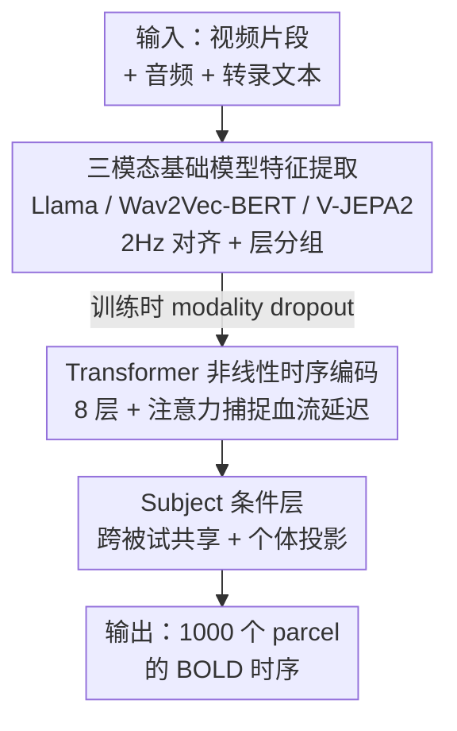

# TRIBE: Trimodal Brain Encoder for Whole-Brain fMRI Response Prediction

**会议**: ICLR 2026  
**OpenReview**: [https://openreview.net/forum?id=biegtqdqmg](https://openreview.net/forum?id=biegtqdqmg)  
**代码**: https://github.com/facebookresearch/algonauts-2025  
**领域**: 计算神经科学 / 脑编码 / 多模态  
**关键词**: 脑编码, fMRI 响应预测, 多模态融合, Transformer, 跨被试建模

## 一句话总结
TRIBE 把文本、音频、视频三个预训练基础模型的中间层表征喂给一个时序 Transformer，端到端地预测被试看视频时全脑 1000 个 parcel 的 fMRI 响应，凭借「非线性 + 跨被试 + 多模态」三位一体的设计在 Algonauts 2025 脑编码竞赛中以明显优势从 267 支队伍中夺冠。

## 研究背景与动机

**领域现状**：神经科学长期靠「分而治之」推进——把视觉细分到 V5 的运动感知、梭状回的人脸识别等专门脑区。脑编码（brain encoding）这一支则借助 AI 模型表征与大脑表征的部分对齐，用神经网络激活去预测大脑对自然刺激的响应，已经在图像、语音、文本各自的单模态上做出了不少工作。

**现有痛点**：现有脑编码模型有三个共性缺陷。其一是**线性**：主流做法用 ridge 回归把 AI 表征线性映射到大脑响应，假设两套表征线性等价，而这个假设很可能不成立。其二是**被试特异性**：由于个体间大脑响应差异大，现有方法往往给每个被试单独训一个模型，无法利用不同大脑之间的共性。其三是**单模态**：大多数方法只从单一模态刺激预测响应，捕捉不到大脑对多模态信息的整合——而跨模态交互不仅发生在多感觉联合区，连初级感觉皮层也存在。

**核心矛盾**：真实观影是文本、声音、画面同时涌入并被大脑动态整合的过程，但现有编码管线在「线性映射 / 单被试 / 单模态」三处都与这个事实背道而驰，于是在高级联合皮层（associative cortices）这种最需要多模态整合的地方表现最差。

**本文目标**：建立一个同时**非线性、跨被试、多模态**的全脑编码模型，预测被试看视频时全脑各 parcel 的 BOLD 时序响应。

**切入角度**：既然文本、音频、视频各自都有强大的预训练基础模型，且它们的表征已被证明与大脑部分对齐，那就不要再用线性 ridge 去硬拼，而是用一个 Transformer 学习如何随时间动态地融合三模态表征、并跨被试共享参数。

**核心 idea**：用「三模态基础模型抽特征 + 时序 Transformer 非线性编码 + 跨被试条件层」一站式取代「单模态特征 + ridge 回归 + 单被试模型」。

## 方法详解

### 整体框架

TRIBE 把脑编码框成一个回归任务：输入是被试正在观看的视频片段，外加对应的音频与转录文本；输出是 fMRI 设备每个 TR（重复时间 1.49s）记录、按 Schaefer atlas 切分成的 1000 个皮层 parcel 的 BOLD 信号时序。评价指标是预测曲线与真实曲线在所有 TR 上的 Pearson 相关 $\rho$，再对 1000 个 parcel 取平均，论文称之为「encoding score」。

整条管线分三步走：先用三个冻结的基础模型（Llama-3.2-3B 抽文本、Wav2Vec-BERT-2.0 抽音频、V-JEPA 2 抽视频）把三模态刺激各自抽成 2Hz 的时序嵌入并对齐拼接；再把这串多模态嵌入加上可学习位置编码喂进一个 8 层 Transformer 编码器，让不同时间步互相交换信息、由注意力自动选出与当前 BOLD 最相关的时间窗（对应血流动力学延迟）；最后经过一个按被试切换投影矩阵的 subject 条件层，把 Transformer 输出映射到 1000 维的 parcel 空间。训练时还引入 modality dropout 和上千个模型的集成来增强鲁棒性与泛化。

### 关键设计

**1. 三模态基础模型特征提取：把异构刺激对齐成同频时序嵌入**

要做多模态脑编码，第一关是把帧率、采样率、信息粒度都不同的文本、音频、视频拉到同一时间轴上。TRIBE 对三模态各用一个 SOTA 生成式模型抽中间层表征：文本端对每个词前置 $k=1024$ 个上文词喂入 Llama-3.2-3B 得到上下文化词嵌入（$D_\text{text}=3072$），再在 $f=2$ Hz 的时间网格上把落入同一 bin 的词嵌入求和；音频端把音频切 60 秒块喂入 Wav2Vec-BERT-2.0，把 50 Hz 隐表征重采样到 2 Hz（$D_\text{audio}=1024$，且因双向编码而同时携带过去与未来信息）；视频端在每个 2Hz bin 上取前 4 秒的 64 帧喂入 V-JEPA 2 gigantic，对所有 patch token 做空间平均得到 $D_\text{video}=1408$ 的时序（空间平均虽降了维，却丢掉了位置信息，作者预期这会损害有视网膜拓扑映射的低级视觉区）。

光抽特征还不够，深层与浅层信息要兼顾。作者对每个模态把 $L_m$ 层分成 $L$ 组、组内沿层维平均压成 $[L, D_m]$；实验发现深层嵌入在联合皮层编码更好，最优配置是 $L=2$ 组、取相对深度 0.5–0.75 与 0.75–1。随后拼接、过线性层统一到 $D=1024$ 并 LayerNorm，三模态再拼成 $3\times1024$ 的时序，作为 Transformer 的输入。这一步把「三套异构基础模型」收敛成一条干净的同频多模态序列，是后续非线性融合的前提。

**2. Transformer 非线性时序编码：用注意力替代 ridge 回归与固定血流核**

这是 TRIBE 打破「线性假设」的核心。它给多模态嵌入加上可学习位置编码，过一个 8 层、8 头的 Transformer 编码器，让不同时间步之间充分交换信息；输出端用自适应平均池化把长度 $fT$ 的序列压成 $N$，每个 TR 对应一个嵌入。窗口长度 $T=N\times TR$，在固定显存预算下采样频率 $f$ 与窗口长度 $N$ 之间存在权衡，网格搜索得到 $f=2$ Hz、$N=100$ 最优。

更巧妙的是对血流动力学延迟（hemodynamic lag）的处理。传统线性编码要把输入与一个时间响应函数做卷积，TRIBE 直接把目标相对输入偏移 5 秒以避免边界效应，然后**让注意力自己去选最相关的时间步**：分析显示注意力权重在相对当前时刻 5–10 秒处达到峰值，恰好与预期的血流动力学响应函数吻合。消融证明这一非线性 Transformer 至关重要——去掉它 encoding score 从 0.31 直接掉到 0.23。

**3. 跨被试共享 + Subject 条件层：一个模型吃下所有被试**

大脑对同一刺激的响应因人而异，过去因此每个被试单训一个模型，浪费了大脑间的共性。TRIBE 让所有被试共享同一个特征提取与 Transformer 主干，只在最后接一个 **subject 条件层**：它为每个被试选择一套不同的线性投影，把 Transformer 输出映射到 1000 维 parcel 空间，且窗口内所有时间步同时预测，推理特别高效。这样主干能跨被试积累统计强度，又用个体投影吸收个体差异。消融显示去掉多被试训练 encoding score 从 0.31 掉到 0.29，验证了跨被试共享确有增益。

**4. Modality dropout 与千模型集成：兼顾缺模态鲁棒性与泛化**

一个理想的多模态编码器应当在缺某个模态（如默片、播客）时仍给出合理预测，同时避免过度依赖单一模态。为此 TRIBE 在训练时引入 **modality dropout**：以概率 $p$ 随机把某个模态输入张量置零、但保证至少留一个模态，逼模型学会在任意模态子集下工作；推理时也正是靠屏蔽其余模态来探测各模态对每个 parcel 的贡献（即后文模态-脑区映射分析的工具）。在泛化层面，作者集成 $M=1000$ 个不同初始化/打乱种子、且超参从网格里均匀采样的模型，对每个 parcel 单独算各模型验证分、再用温度 0.3 的 softmax 得到每个模型在该 parcel 的加权权重。两者叠加，让单一确定性网络升级为对缺模态稳健、对分布外更泛化的集成系统。

### 损失函数 / 训练策略
损失为预测与真实 BOLD 的 MSE，指标为 Pearson。用 AdamW、batch size 16 训至多 15 epoch，学习率前 10% 步线性升温到 $10^{-4}$ 再 cosine 衰减；按验证 Pearson 早停，并用随机权重平均（SWA）在验证指标趋于平台后平均各 epoch 末权重。TRIBE 本体 980M 可训练参数，单张 32GB V100 训练 24 小时；三模态特征抽取在 128 张 V100 上耗时 24 小时并以 Numpy memmap 缓存以加速训练读取。

## 实验关键数据

### 主实验

Algonauts 2025 竞赛在 267 支队伍中排名第一，且与第二名的差距大于第二到第五名的差距：

| 排名 | Mean score | Subject 1 | Subject 2 | Subject 3 | Subject 5 |
|------|-----------|-----------|-----------|-----------|-----------|
| 1（本文） | 0.2146 ± 0.0312 | 0.2381 | 0.2105 | 0.2377 | 0.1720 |
| 2 | 0.2096 ± 0.0283 | 0.2353 | 0.2046 | 0.2268 | 0.1718 |
| 3 | 0.2094 ± 0.0215 | 0.2233 | 0.2072 | 0.2271 | 0.1798 |
| 5 | 0.2055 ± 0.0291 | 0.2306 | 0.2010 | 0.2240 | 0.1662 |

分布内（Friends 第七季）mean score 0.3195，分布外平均 0.2146；即便在卡通（World of Tomorrow 0.1924）、自然纪录片（Planet Earth 0.1886）、黑白默片（Charlie Chaplin 0.1686）这类极端 OOD 刺激上仍保持稳健。全脑层面 1000 个 parcel 全部显著优于随机（$q_\text{FDR}<10^{-3}$），归一化 Pearson 平均 0.54 ± 0.1（捕获约一半可解释方差），听觉与语言皮层处可捕获 80% 以上可解释方差。

### 消融实验

| 配置 | Validation Pearson | 说明 |
|------|-------------------|------|
| Full（A+T+V） | 0.31 | 三模态完整模型 |
| 最优双模态（T+V） | 0.30 | 任意双模态都显著优于单模态 |
| 单模态 video | 0.25 | 三个单模态里最高 |
| 单模态 audio | 0.24 | 居中 |
| 单模态 text | 0.22 | 单模态最低 |
| w/o 多被试训练 | 0.29 | 改为逐被试单训，掉 0.02 |
| w/o Transformer | 0.23 | 去掉非线性时序编码，掉 0.08，掉点最猛 |

### 关键发现
- **非线性 Transformer 贡献最大**：去掉它 encoding score 从 0.31 掉到 0.23，远超去掉多被试（掉到 0.29），说明打破线性假设是首要增益来源。
- **多模态的好处集中在联合皮层**：多模态相对最优单模态在前额叶、顶枕颞等联合区提升最高可达 30%；但在高度依赖视觉特征的初级视觉皮层，多模态反而略逊于纯视觉模型。
- **模态-脑区映射符合神经科学预期**：屏蔽其余模态单独探测时，音频主导颞上回、视频主导枕叶与部分顶叶、文本（语义最强）主导大片顶叶与前额叶；text+audio（黄）出现在颞上叶、video+audio（青）出现在腹背侧视觉皮层。
- **scaling 尚未饱和**：encoding score 随训练 session 数持续上升未见平台；文本上下文从短到 1024 词一路提升编码性能，印证模型捕获了远超词/句级的高级语义。

## 亮点与洞察
- **让注意力替代固定血流核**：传统线性编码要手工卷积一个时间响应函数，TRIBE 直接偏移目标 5 秒并让注意力自己学，结果注意力峰值落在 5–10 秒，与血流动力学响应函数自然吻合——既省了先验设计，又给出了可解释的副产物。
- **modality dropout 一物两用**：训练时它是防过度依赖单模态、保证缺模态可用的正则；推理时同一套屏蔽机制直接变成探测各模态脑区贡献的分析工具，设计很经济。
- **集成做到 parcel 级权重**：1000 个模型不是简单平均，而是对每个 parcel 单独用温度 0.3 softmax 算权重，让不同脑区挑各自最擅长的模型，思路可迁移到任何「输出空间分区、各区难度不一」的回归集成。
- **跨被试共享主干 + 个体投影**：把「共性进主干、差异进末层投影」的范式用在脑编码上，既积累统计强度又留出个体自由度，是脑数据稀缺场景下值得复用的结构。

## 局限与展望
- 作者承认：目前在 1000 parcel 的粗粒度上工作，平滑掉了体素级信号、无法捕捉高度局部化现象，体素级预测是重要未来方向。
- 仅限 fMRI，捕捉不到神经活动的精细时间动态；迁移到 EEG/MEG 信号会很有价值。
- 只用了四名被试（虽每人记录量空前），能否零样本/少样本泛化到未见被试仍是开放问题，需要更大被试池的数据集（如 HCP）。
- 模型从感知输入确定性地预测响应，无法刻画无刺激时默认模式网络的复杂动态；要捕捉这类现象需转向扩散等生成式方法。
- 当前只覆盖感知与理解，行为、记忆、决策等认知成分尚未纳入。

## 相关工作与启发
- **vs 线性 ridge 编码**：传统方法用 ridge 把 AI 表征线性映射到大脑，假设两者线性等价；TRIBE 用 Transformer 做非线性时序映射，消融证明去掉非线性掉点最猛（0.31→0.23）。
- **vs 单模态循环/微调编码**（Güçlü & Van Gerven 等）：这些工作虽放松了线性假设，却仍局限于单一感觉模态，捕捉不到跨模态整合；TRIBE 端到端融合三模态，且多模态增益恰在联合皮层最大。
- **vs 基于视觉-语言 Transformer 的编码**（Dong & Toneva、Oota 等）：它们在多模态 Transformer 之上仍只接线性映射，且多模态 Transformer 常只整合静态图文、性能落后于单模态模型；TRIBE 改为直接组合各单模态最强基础模型、并由自家 Transformer 学习如何随时间融合，避开了「多模态预训练模型整合方式未必像大脑」的隐患。

## 评分
- 新颖性: ⭐⭐⭐⭐ 首个同时非线性、跨被试、多模态的全脑编码管线，思路清晰但模块多为已有技术的巧妙组合。
- 实验充分度: ⭐⭐⭐⭐⭐ 竞赛夺冠 + 全脑显著性检验 + 噪声天花板 + 模态/被试/Transformer 多维消融 + scaling law，证据链完整。
- 写作质量: ⭐⭐⭐⭐⭐ 技术报告式叙述清晰，图文与神经科学解释结合得当。
- 价值: ⭐⭐⭐⭐⭐ 为「整合式脑认知模型」与 in silico 神经科学实验铺路，竞赛第一给了方法很强的背书。

<!-- RELATED:START -->

## 相关论文

- [\[ICLR 2026\] Beyond Grid-Locked Voxels: Neural Response Functions for Continuous Brain Encoding](beyond_grid-locked_voxels_neural_response_functions_for_continuous_brain_encodin.md)
- [\[ICLR 2026\] Learning Brain Representation with Hierarchical Visual Embeddings](learning_brain_representation_with_hierarchical_visual_embeddings.md)
- [\[ICLR 2026\] Riemannian High-Order Pooling for Brain Foundation Models](riemannian_high-order_pooling_for_brain_foundation_models.md)
- [\[ICLR 2026\] The Human Brain as a Dynamic Mixture of Expert Models in Video Understanding](the_human_brain_as_a_dynamic_mixture_of_expert_models_in_video_understanding.md)
- [\[ICLR 2026\] MindPilot: Closed-loop Visual Stimulation Optimization for Brain Modulation with EEG-guided Diffusion](mindpilot_closed-loop_visual_stimulation_optimization_for_brain_modulation_with_.md)

<!-- RELATED:END -->
