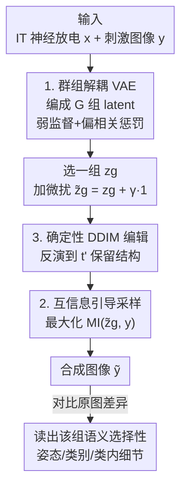

# Uncovering Semantic Selectivity of Latent Groups in Higher Visual Cortex with Mutual Information-Guided Diffusion

**会议**: ICLR 2026  
**OpenReview**: [https://openreview.net/forum?id=pWX9PUbqPj](https://openreview.net/forum?id=pWX9PUbqPj)  
**代码**: https://github.com/BRAINML-GT/MIG-Vis  
**领域**: 计算神经科学 / 可解释性 / 扩散模型  
**关键词**: 高级视觉皮层, 语义选择性, 群组解耦, 互信息引导扩散, IT 皮层

## 一句话总结
本文提出 MIG-Vis：先用「群组解耦 VAE」把猕猴 IT 皮层的神经放电编成多个低维 latent 组，再用「互信息引导的确定性 DDIM 编辑」把每组 latent 的微扰可视化成图像变化，从而**直接看见**高级视觉皮层里哪一簇神经元负责姿态、哪一簇负责类别、哪一簇负责类内细节。

## 研究背景与动机
**领域现状**：「高级视觉皮层（如灵长类 IT 皮层）如何编码以物体为中心的视觉信息」是计算神经科学的核心问题。主流做法有两类：一是做「表征对齐」，证明为物体识别训练的深度网络（尤其是解耦表征的网络）与 IT 皮层活动高度相似；二是「解码类」方法，从神经活动里读出类别、视角等语义属性。

**现有痛点**：表征对齐是**间接证据**——它依赖人工网络结构和专门设计的相似度指标，告诉你「像」却说不清神经群体内部到底怎么组织信息。解码方法能读出语义，却**不揭示这些语义在神经群体里是怎么排布的**。更麻烦的是，IT 皮层单个神经元天然带「混合选择性」（mixed selectivity）：同一个神经元同时对旋转这种低级姿态和类别这种高级语义都有贡献（本文 Fig.1 在猕猴被动识别任务上复现了这一现象），因此**逐神经元分析根本无法干净地拆出某个语义对应哪群神经元**。

**核心矛盾**：单神经元层面是「混合选择性」的一团乱麻，但群体层面可能存在**结构化、语义有意义的子空间**——问题在于现有方法既没有从电生理记录里提取出可解释的神经表征，也没有把神经群体的组织结构映射到不同视觉属性上。

**本文目标**：(1) 从 IT 皮层放电数据里学出一组**可解释的神经 latent 子空间**；(2) 把每个子空间编码的视觉语义**可视化**出来并加以验证。

**切入角度**：作者假设**多个 latent 维度组成一个「组」，一个组编码一类语义**（比如类别由一组负责、旋转由另一组负责），组内不同维度还能进一步捕捉同类语义的不同侧面（形状、纹理、光照）。要看一个组编码什么，就**微扰该组 latent、生成对应图像、和原图对比**，看语义怎么变。

**核心 idea**：用**群组解耦 VAE** 把混合选择性拆成结构化的 latent 组，再用**最大化「图像 ↔ 微扰 latent」互信息**来引导扩散合成——以此代替传统的 neural-to-image 解码器或「最大化激活幅值/方差」式引导，避免语义变化被平均成一张模糊重建。

## 方法详解

### 整体框架
MIG-Vis 要解决的是「看见每组神经 latent 编码什么语义」。整条 pipeline 分两段：**先学一个结构化的神经 latent 空间，再把每组 latent 的微扰翻译成可见的图像变化**。

第一段，输入是每个 trial 的「神经放电向量 $x \in \mathbb{R}^N$ + 对应刺激图像 $y$」，用群组解耦 VAE 把神经活动编码成 $z=[z_1,\dots,z_G]^\top \in \mathbb{R}^D$，切成 $G$ 个等维 latent 组（$D = G \times d_g$）；其中前几组用图像的旋转角、类别标签做弱监督，后几组无监督自学。

第二段是「语义可视化」：拿一张原图 $y_0$ 先用确定性 DDIM 反演（inversion）加噪到中间时刻 $t'$（破坏语义、保留结构轮廓），再从 $t'$ 反向去噪生成图像——这个去噪过程被一个**互信息引导项**牵引，使生成图像 $\tilde{y}$ 反映被微扰的 latent 组 $\tilde{z}_g$。对比 $\tilde{y}$ 与 $y_0$ 的差异，就读出第 $g$ 组 latent 的语义选择性。沿不同 $\gamma$（微扰强度）正负遍历，就能看出该组对应的语义维度。

### 关键设计

**1. 群组解耦 VAE：把混合选择性拆成「一组管一类语义」的子空间**

传统解耦 VAE（β-VAE、β-TCVAE）假设「一个语义因子 = 一个独立 latent 维度」，但对 3D 旋转、物体类别这种高级属性，一个维度根本表达不下。本文放宽这个假设，用**群组解耦 VAE**：鼓励多维 latent 组之间统计独立，而组内允许多个维度协同表达同一类语义。由于纯无监督几乎学不出干净解耦（Locatello 等的结论），作者引入**弱监督**——把旋转角、类别 id 拼成监督向量 $u \in \mathbb{R}^M$，把 latent 拆成监督组 $z^{(s)}$ 与无监督组 $z^{(u)}$，$z=[z^{(s)}, z^{(u)}]^\top$。

训练目标是证据下界，含四项：神经重建项 $\mathbb{E}[\log p_\xi(x|z)]$、弱标签监督项 $\mathbb{E}[\log p_\xi(u|z^{(s)})]$、先验正则 KL 项，以及**偏相关（Partial Correlation）惩罚** $-\beta\, D_{KL}\big(q_\psi(z)\,\|\,\prod_{g=1}^{G} q_\psi(z_g)\big)$——后者强制各组的聚合后验互相独立，是「组间解耦」的关键。其中群组分解密度不可解，用重要性采样估计。这样做让混合选择性在群体层面被重新组织成「姿态组 / 类别组 / 类内组」这类可解释结构，而 Table 1 证明加了监督和偏相关惩罚只让神经重建 $R^2$ 掉约 1–2%，信息基本没丢。

**2. 互信息最大化引导：用「图像真表达了 latent 的信息」代替「编码器认得出」**

要看一组 latent 编码什么，最朴素的办法是训一个 neural-to-image 解码器把微扰 latent 直接映成图像；但解码器只学到最主导的模式，会把细微变化抹平成一张「最佳重建」，小微扰看不出语义差别。fMRI 文献里的另一类做法是用「最大化目标维度的激活幅值或方差」来引导扩散——可本文的 latent 是学出来的，正负值都带不同的有意义语义，单纯放大幅值/方差并不对应有意义的语义变化。

本文改为**最大化合成图像 $y$ 与微扰 latent 组 $\tilde{z}_g$ 之间的互信息**。在分类器引导扩散框架下，条件 score 写成 $\nabla_{y_t}\log p_\eta(y_t|z_g) = \nabla_{y_t}\log p_\theta(y_t) + \eta\,\nabla_{y_t}\mathrm{MI}(z_g, y_t)$，第一项是无条件 score（由去噪器 $\epsilon_\theta$ 给出），第二项就是 MI 引导。MI 不可解，借 InfoNCE 用网络 $s_\phi(z_g, y)$ 估计密度比 $p(y|z_g)/p(y)$：对图像 $y$，正样本是其对应神经信号编出的 $z_g$，负样本来自无关神经信号；噪声对比损失

$$\mathcal{L}_N(\phi) = -\,\mathbb{E}_{p(z_g,y)}\left[\log \frac{\exp\big(s_\phi(z_g^{(1)}, y)\big)}{\sum_{z_g^{(i)}\in Z_g}\exp\big(s_\phi(z_g^{(i)}, y)\big)}\right]$$

满足 $\mathrm{MI}(z_g,y) \ge \log(B) - \mathcal{L}_N$，于是 $\nabla_{y_t}\log p_\phi(z_g|y_t) = -\nabla_{y_t}\mathcal{L}_N \approx \nabla_{y_t}\mathrm{MI}(z_g, y_t)$。直觉上，似然引导问的是「编码器认不认得这张图带 $z_g$」（单边、依赖编码器，多张不同图可能映到相近 latent、语义被平均），而 MI 引导问的是「这张图是否真的表达了 $z_g$ 里的信息」——这是更强的约束，对类别这种复杂非线性语义尤其重要，能产出平滑、真实的跨类别过渡。

**3. 确定性 DDIM 编辑：只破坏语义、不动结构，让语义变化可被干净归因**

扩散里早期加噪主要扰动语义属性（物体、类别身份），而较多保留结构信息（布局、轮廓、配色）。本文要看的恰是「神经 latent 编码的概念性语义」，所以采用图像编辑式做法（SDEdit 思路）：**只把加噪过程停在中间时刻 $t' \in (0,T)$，再从那里反向合成**，而不是从纯噪声重建——否则连结构都重新生成，就没法把变化干净地归因到神经语义上。具体是两段确定性流程：先对原图 $y_0$ 做**确定性 DDIM 反演**到 $t'$（标定到「腐蚀语义、保留结构」的程度），再从 $t'$ 用分类器引导的**确定性 DDIM 采样**反向到 0，引导项就是上面的 MI 目标。用确定性 DDIM（而非标准随机反向）是为了排除采样噪声干扰，保证「图像变化只来自 latent 微扰」这一科学解释的可靠性。实现上设 $T=150$、$t'=135$。

### 损失函数 / 训练策略
- **VAE 端**：优化式 (2) 的 ELBO，含神经重建 + 弱标签监督 + 先验 KL + 偏相关惩罚（系数 $\beta$ 控制组间解耦强度），偏相关项用重要性采样估计。
- **MI 引导端**：用 InfoNCE 损失 $\mathcal{L}_N$ 训练密度比网络 $s_\phi$（三层 CNN）。采样时每步先估 $\hat{y}_0=(y_t-\sqrt{1-\alpha_t}\,\epsilon_\theta)/\sqrt{\alpha_t}$ 再喂给 $s_\phi$。
- **配置**：VAE 编/解码器均为两层 MLP，$D=24$、$G=4$、组维 $d_g=6$；Group 1 用 3D 旋转角监督、Group 2 用 8 类 one-hot 类别监督，Group 3/4 无监督。图像先抽 DINO (ViT-B/16) 嵌入，扩散用 U-Net、分辨率 $128\times128$。

## 实验关键数据

数据集：两只猕猴（M1 / M2）IT 皮层单元放电，被动物体识别任务，分别记录 58 / 110 个 IT 通道；5760 张灰度图、8 个基础类别，刺激呈现 100 ms、取刺激后 70–170 ms 窗口的神经响应。论文以**合成图像的定性可视化**为主，并辅以神经重建质量的定量对比。

### 主实验：各 latent 组的语义选择性（定性）
在 $\gamma \in \{-10,-5,5,10\}$ 下正负遍历各组 latent，用人脸/汽车/草莓/桌子为原图：

| Latent 组 | 监督 | 发现的语义角色 |
|-----------|------|----------------|
| Group 1 | 旋转角 | **姿态**：调制人脸/汽车的旋转，且类别保持不变（姿态与内容分离） |
| Group 2 | 类别 id | **跨类别语义**：虽只给类别监督，却学会跨类语义属性（人脸→草莓）；$\|\gamma\|$ 越大语义距离越远 |
| Group 3 | 无监督 | **类内细节**：主要改人脸/草莓外观，对汽车几乎无影响 |
| Group 4 | 无监督 | **类内细节**：显著改汽车/桌子，对人脸影响极小 |

关键观察：Group 3/4 的「按类别挑对象」说明神经 latent 流形是**局部结构化、各向异性且弯曲**的——不同物体占据流形不同区域、沿不同方向变化，类内变化被组织成各自的局部切方向，而非一条全局共享轴。

### 基线对比 / 消融
以人脸为原图，对比三个把各自核心「神经引导」抽出来的基线：

| 方法 | Group 1（姿态） | Group 2（跨类别） |
|------|----------------|-------------------|
| SLT（解码器 latent 遍历） | 有旋转但不够干净 | 类别不变（解码器生成的局限） |
| AP-CFG（BrainACTIV 的激活探测 + CFG） | 旋转捕捉尚可 | 跨类变化不如本文干净 |
| Ours w/o MI（似然引导 $\nabla\log p(z_g\|y)$） | 旋转可中等捕捉 | 跨类过渡不一致/不真实 |
| **MIG-Vis（MI 引导）** | **干净的旋转** | **平滑、真实的跨类别过渡** |

### 神经重建评估（定量，Table 1，$R^2$%，5 次均值±std）

| 受试 | 方法 | $R^2$(%) ↑ |
|------|------|-----------|
| M1 | Standard VAE | 78.62 (±0.58) |
| M1 | Ours w/o Sup. | 76.90 (±0.53) |
| M1 | Ours w/o PC. | 77.30 (±0.62) |
| M1 | **Ours** | 76.58 (±0.64) |
| M2 | Standard VAE | 83.72 (±0.47) |
| M2 | **Ours** | 81.86 (±0.51) |

### 关键发现
- **MI 引导 vs 似然引导是分胜负的关键**：对旋转这种低维语义，似然引导（只要编码器认得）就够；但跨类别语义结构复杂非线性，似然引导「单边、依赖编码器」太弱，会把语义平均掉，只有 MI 的「图像必须真表达 latent 信息」这种双向强约束才产出干净的跨类过渡。
- **弱监督只「旋转」了子空间、不损重建**：加监督和偏相关惩罚后 $R^2$ 仅掉约 1–2%，说明重建所需信息保留完好，监督只是把 latent 子空间转了个方向使其语义可解释。
- **不同语义对应不同几何**：Group 1（姿态）跨物体语义一致（同一轴永远是旋转，作者推测是**环面/torus 流形**，人脸顺时针、汽车逆时针只是落在环面不同位置）；Group 3（类内）则高度弯曲、各向异性，同一 latent 方向在人脸上改注视方向、在草莓上改纹理光照——语义只能**局部**解释。

## 亮点与洞察
- **把「混合选择性」从 bug 变成可拆解的结构**：单神经元混合选择性长期是解释难点，本文用群组解耦 VAE 在群体层面把它重排成「姿态组/类别组/类内组」，这是从电生理数据直接得到语义可解释神经表征的第一步。
- **MI 引导是对 fMRI 式「幅值/方差最大化」引导的本质修正**：当 latent 在学习空间里正负都带语义时，放大幅值毫无意义；改为最大化「图像↔latent 互信息」抓的是全统计依赖，这个洞察可迁移到任何「latent 双向语义」的引导生成任务。
- **可视化即假设生成器**：通过观察旋转方向跨物体的一致/相反，作者反推出 torus 流形假说——MIG-Vis 不只是看图，还能为神经子空间几何提出可检验的科学假设。
- **确定性 DDIM + 部分反演保证因果归因**：用 $t'$ 截断 + 确定性采样排除随机噪声，使「图变 = latent 变」成立，这是把生成模型用于科学解释（而非好看）时的必要严谨。

## 局限与展望
- **结论以定性可视化为主**：核心证据是合成图像的人工判读（旋转、类别变化），缺乏对「语义选择性」的大规模量化指标，可重复性与客观性依赖观察者。
- **依赖弱监督标签**：Group 1/2 的可解释性建立在数据集自带的旋转角/类别标签上，没有这些监督能否自发涌现同样干净的解耦仍是开放问题（作者也引 Locatello 等承认无监督解耦之难）。
- **流形几何只到「假设」层面**：torus / 弯曲流形是从可视化推断的定性图景，论文也明说把「形式化刻画神经子空间几何」留给未来工作。
- **数据范围窄**：仅两只猕猴 IT 皮层、8 类灰度图、被动识别任务；能否推广到更高级皮层区、彩色/自然刺激、主动任务待验证。

## 相关工作与启发
- **vs 表征对齐（DNN ↔ IT 皮层）**：对齐类工作证明「DNN 像皮层」但属间接证据、依赖人工指标；本文直接从神经数据里提取可解释 latent 组并可视化语义，给的是直接、可解释的群体编码证据。
- **vs 解码类方法（Chang & Tsao 等）**：解码能从神经活动读出类别/视角，但不揭示语义在群体里如何组织；MIG-Vis 补的正是「组织结构 → 视觉属性」的映射。
- **vs fMRI + 预训练扩散（Luo / BrainACTIV 等）**：那些工作在 fMRI 上直接操纵激活、用幅值/CFG 引导验证脑区类别偏好；本文针对电生理 latent 的「正负皆有语义」特性，改用 MI 引导 + 群组解耦，并把 AP-CFG 作为基线证明其跨类过渡更干净。
- **vs 标准解耦 VAE（β-VAE / β-TCVAE）**：单维=单因子假设对高级视觉属性太弱；群组解耦放宽为「多维一组」，组内可表达同类语义的多个侧面。

## 评分
- 新颖性: ⭐⭐⭐⭐⭐ 首个从电生理数据提取语义可解释神经 latent 组并用 MI 引导扩散可视化，问题与方法都新。
- 实验充分度: ⭐⭐⭐⭐ 可视化丰富、基线/消融到位且有重建定量对比，但核心证据偏定性、数据范围窄。
- 写作质量: ⭐⭐⭐⭐⭐ 动机层层递进，MI vs 似然引导的直觉解释清晰，流形几何讨论有洞见。
- 价值: ⭐⭐⭐⭐⭐ 为理解高级视觉皮层的组合式多维编码提供了直接、可解释的新工具与新证据。

<!-- RELATED:START -->

## 相关论文

- [\[ICLR 2026\] Model-Guided Microstimulation Steers Primate Visual Behavior](model-guided_microstimulation_steers_primate_visual_behavior.md)
- [\[ICLR 2026\] MindPilot: Closed-loop Visual Stimulation Optimization for Brain Modulation with EEG-guided Diffusion](mindpilot_closed-loop_visual_stimulation_optimization_for_brain_modulation_with_.md)
- [\[ICML 2026\] Neural Estimation of Pairwise Mutual Information in Masked Discrete Sequence Models](../../ICML2026/computational_biology/neural_estimation_of_pairwise_mutual_information_in_masked_discrete_sequence_mod.md)
- [\[ICLR 2026\] Clustering by Denoising: Latent Plug-and-Play Diffusion for Single-Cell Embeddings](clustering_by_denoising_latent_plug-and-play_diffusion_for_single-cell_embedding.md)
- [\[ICLR 2026\] Learning Brain Representation with Hierarchical Visual Embeddings](learning_brain_representation_with_hierarchical_visual_embeddings.md)

<!-- RELATED:END -->
