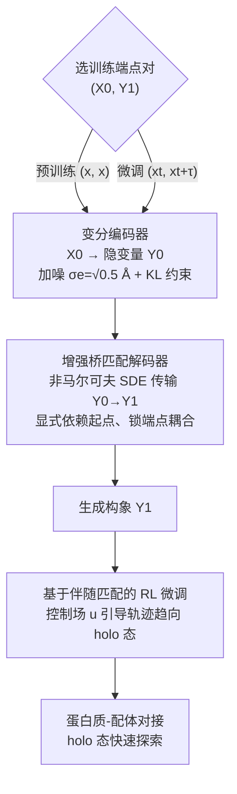

# Unified Biomolecular Trajectory Generation via Pretrained Variational Bridge

**会议**: ICLR 2026  
**arXiv**: [2602.07588](https://arxiv.org/abs/2602.07588)  
**代码**: 无  
**领域**: 计算生物  
**关键词**: 分子动力学, 轨迹生成, 变分桥匹配, 预训练, 强化学习微调

## 一句话总结
PVB（Pretrained Variational Bridge）通过编码器-解码器架构结合增强桥匹配，统一了单结构预训练和配对轨迹微调的训练目标，实现了跨领域生物分子轨迹生成，并通过RL微调加速蛋白质-配体holo态探索。

## 研究背景与动机

**领域现状**：分子动力学（MD）模拟是表征分子行为的基本工具，但计算代价极高（需要飞秒级时间步长）。近年来，深度生成模型开始学习粗化时间步长上的动力学，以高效生成轨迹。

**现有痛点**：现有方法存在三个关键问题——（1）跨分子系统泛化能力不足；（2）轨迹数据的分子多样性有限，无法充分利用结构信息；（3）单分子模拟居多，蛋白质-配体复合物等多分子系统研究较少。

**核心矛盾**：最相关的前作 UniSim 虽然通过3D分子预训练实现了跨领域泛化，但预训练（无条件生成单结构 $x$）和微调（条件生成轨迹对 $(x_t, x_{t+\tau})$）之间的训练目标不一致，导致预训练知识传递不充分。

**本文目标**：（1）如何设计统一的训练框架，使预训练和微调共享相同的生成目标？（2）如何将生成轨迹应用于蛋白质-配体对接的holo态快速探索？

**切入角度**：引入隐变量 $\mathbf{Y}_0$，将生成过程建模为马尔可夫链 $\mathbf{X}_0 \to \mathbf{Y}_0 \to \mathbf{Y}_1$，通过变分编码器将初始结构映射到噪声隐空间，再用增强桥匹配解码器传输到目标状态。

**核心 idea**：通过编码器-解码器+增强桥匹配的统一框架，消除预训练与微调间的目标不一致，并通过基于伴随匹配的RL微调加速holo态探索。

## 方法详解

### 整体框架

PVB 把轨迹生成统一成一条「编码器 → 解码器」的生成链：输入是分子构象 $(z, C, x)$（原子序号、共价键、3D 坐标），变分编码器先把初始状态 $\mathbf{X}_0$ 映射到一个带噪的隐变量 $\mathbf{Y}_0$，增强桥匹配解码器再把 $\mathbf{Y}_0$ 传输到目标状态 $\mathbf{Y}_1$，整个过程构成马尔可夫链 $\mathbf{X}_0 \to \mathbf{Y}_0 \to \mathbf{Y}_1$。这套设计的关键在于预训练和微调**共用同一条生成链**，只是喂入的端点对 $(\mathbf{X}_0, \mathbf{Y}_1)$ 不同：预训练在海量单结构数据上设 $(x, x)$，微调在 MD 轨迹配对数据上设 $(x_t, x_{t+\tau})$，从而消除了前作 UniSim「预训练做无条件生成、微调做条件生成」的目标错位。训练好的模型还能再接一段基于伴随匹配的 RL 微调，用奖励信号把生成轨迹直接引向蛋白质-配体的 holo 态。

### 关键设计

**1. 变分编码器：用隐变量把单结构预训练从退化的 Dirac 分布里救出来**

预训练阶段设 $(\mathbf{X}_0, \mathbf{Y}_1) = (x, x)$，若直接学这个恒等映射，条件分布会塌缩成一个 Dirac 测度，模型学不到任何可迁移的东西。编码器先把初始状态 $\mathbf{X}_0$ 映射到一个带噪的隐变量 $\mathbf{Y}_0$ 来打破这种退化：设先验为 $q_e(d\mathbf{Y}_0|\mathbf{X}_0) \coloneqq \mathcal{N}(x_0, \sigma_e^2 I)$，取 $\sigma_e = \sqrt{0.5}$ Å，再用神经网络 $\varphi_e$ 学后验分布 $p_e$，训练时最小化 KL 散度

$$\mathcal{L}_{KL} = -\frac{1}{2}\mathbb{E}\Big[1 + \log \mathbf{V} - 2\log\sigma_e - \frac{\mathbf{V}}{\sigma_e^2}\Big].$$

之所以把 $\sigma_e$ 取得偏大，是因为它要同时满足两头：噪声足够大才能保证解码不退化成平凡映射，但又不能大到把原结构信息淹掉——$\sqrt{0.5}$ Å 这个量级正好让编码后的隐空间既保留了足够的构象信息、又留出了生成所需的随机性。

**2. 增强桥匹配解码器：在生成的同时锁住端点耦合，才能忠实复现动力学**

解码器要从隐变量 $\mathbf{Y}_0$ 生成目标状态 $\mathbf{Y}_1$，但普通的桥匹配只保证边缘分布对、不保证 $(\mathbf{Y}_0, \mathbf{Y}_1)$ 这一对端点的耦合，而 MD 的动力学性质恰恰藏在这种成对关系里。增强桥匹配的做法是定义布朗桥路径测度，训练向量场 $\varphi_d$ 去拟合桥的漂移项：

$$\mathcal{L}_{ABM} = \mathbb{E}_{t, (\mathbf{Y}_0, \mathbf{Y}_1)}\Big[\big\|\varphi_d(t, \mathbf{Y}_0, \mathbf{Y}_t) - \tfrac{\mathbf{Y}_1 - \mathbf{Y}_t}{1-t}\big\|^2\Big].$$

推理时模拟一条非马尔可夫 SDE $d\mathbf{Y}_t = \varphi_d^*(t, \mathbf{Y}_0, \mathbf{Y}_t)\,dt + \sigma\, d\mathbf{B}_t$ 把隐变量传输到目标。关键在于向量场显式依赖起点 $\mathbf{Y}_0$，这让端点耦合 $\Pi_{0,1}$ 在整个生成过程中被精确保持；Proposition 1 进一步证明编码器-解码器的组合能无偏地估计目标条件分布，从而把预训练（生成 $x$）和微调（生成轨迹对 $x_t \to x_{t+\tau}$）统一到同一个生成目标下。

**3. 基于伴随匹配的 RL 微调：用奖励引导绕过毫秒级的局部探索**

直接从 apo 态模拟到 holo 态需要毫秒级时间尺度，逐步局部探索在算力上根本走不通。RL 微调引入一个控制向量场 $u$ 来调节生成分布，让轨迹直接朝蛋白质-配体的 holo 态收敛，优化的是 KL 正则化目标

$$\max_u\ \mathbb{E}\Big[r(\mathbf{Y}_1) - \frac{\beta}{2}\int_0^1 \|u\|^2\, dt\Big].$$

借助 Girsanov 定理和伴随匹配（adjoint matching），这个随机最优控制（SOC）问题被转化为一个回归损失 $\mathcal{L}_{adj} = \mathbb{E}[\|u(t, \mathbf{Y}_0, \mathbf{Y}_t) + \sigma\tilde{a}(t)\|^2]$，其中精简伴随状态 $\tilde{a}$ 通过 ODE 反向传播求得。相比直接对长轨迹做梯度累积，伴随匹配只需反传伴随状态，因此训练内存开销显著更低——这正是让 RL 微调在长生成链上可行的关键。

### 损失函数 / 训练策略

- **预训练+微调阶段**：$\mathcal{L} = w_{KL} \cdot \mathcal{L}_{KL} + w_{ABM} \cdot \mathcal{L}_{ABM}$
- **RL微调阶段**：$\mathcal{L}_{adj}$，奖励函数为 $r(\mathbf{X}) = -\text{rmsd}(\mathbf{X}, \mathbf{X}_{ref})$
- 控制向量场重参数化：$u = \frac{1}{\sigma}(\varphi_d^u - \varphi_d^*)$，无需引入额外网络
- 预训练数据：PCQM4Mv2 + ANI-1x（小分子）、PDB（蛋白质）、PDBBind2020（蛋白质-配体复合物）

## 实验关键数据

### 主实验（ATLAS蛋白质轨迹生成）

| 模型 | JSD-Rg ↓ | JSD-TIC ↓ | JSD-MSM ↓ | VAL-CA ↑ | Decorr-TIC0 ↑ |
|------|----------|-----------|-----------|----------|---------------|
| MD (10ns) | 0.379 | 0.684 | 0.596 | 0.926 | 0.000 |
| ITO | 0.792 | 0.400 | 0.469 | 0.001 | 0.714 |
| MDGEN | 0.493 | 0.400 | 0.463 | 0.098 | 0.857 |
| UniSim | 0.538 | 0.372 | 0.344 | 0.106 | 0.786 |
| **PVB** | **0.457** | **0.371** | **0.333** | **0.975** | **0.929** |

### 消融实验 / 蛋白质-配体复合物（MISATO）

| 模型 | EMD-ligand ↓ | EMD-CoM ↓ | RMSE-CONTACT ↓ |
|------|-------------|-----------|----------------|
| ITO | 0.494 | 0.479 | 0.987 |
| UniSim | 0.196 | 0.128 | **0.049** |
| **PVB** | **0.133** | **0.089** | 0.055 |

### 关键发现
- PVB 在 VAL-CA（构象有效性）上远超所有基线（0.975 vs UniSim的0.106），说明生成的构象物理合理性极高
- 在慢动力学模式（TIC、MSM）上，PVB超过了10ns的MD模拟，且去相关率最高（0.929）
- 在蛋白质-配体复合物上，PVB比UniSim的配体RMSD误差低32%
- RL微调后，在蛋白质-配体对接任务上，PVB的中位数配体RMSD比Vina+PVB（无RL）降低约18%

## 亮点与洞察
- **统一预训练-微调框架**：通过隐变量+增强桥匹配巧妙解决了单结构预训练与配对轨迹微调的目标不一致问题，这一思想可以迁移到其他需要跨任务迁移的生成模型中
- **VAL-CA的巨大优势**：PVB生成的构象几乎不存在键断裂或原子碰撞（97.5%有效），远超ITO的0.1%，这得益于编码器-解码器架构对结构信息的良好保持
- **伴随匹配的应用**：将SOC理论引入分子轨迹生成的RL微调，实现了内存高效的训练，这一范式可推广到其他需要引导生成方向的扩散/流匹配模型

## 局限与展望
- 目前仅考虑重原子，未建模氢原子和溶剂效应
- RL微调需要已知holo态作为奖励信号，限制了在真实盲对接场景中的应用
- 预训练数据规模仍有限，特别是蛋白质-配体复合物的结构数据
- 生成轨迹的时间分辨率受限于粗化时间步长 $\tau$

## 相关工作与启发
- **vs UniSim**: 同样使用预训练策略，但UniSim的预训练只产生原子表示模型，而PVB将生成模型整合到预训练中，通过隐空间实现了目标一致性
- **vs AlphaFlow**: AlphaFlow生成独立同分布的蛋白质构象样本，无法保留时间依赖性，因此无法估计动力学可观测量
- **vs ITO/MDGEN**: 从头训练，缺乏跨域泛化能力；ITO的构象有效性极低

## 评分
- 新颖性: ⭐⭐⭐⭐ 编码器-解码器+增强桥匹配的统一框架设计精巧，伴随匹配RL微调有新意
- 实验充分度: ⭐⭐⭐⭐⭐ 覆盖了蛋白质单体（ATLAS+mdCATH）和蛋白质-配体复合物（MISATO+PDBBind），评价指标全面
- 写作质量: ⭐⭐⭐⭐ 数学推导严谨，框架描述清晰
- 价值: ⭐⭐⭐⭐ 为跨域分子动力学模拟提供了统一高效的方案，构象有效性的巨大提升具有实际应用价值

<!-- RELATED:START -->

## 相关论文

- [\[ICLR 2026\] Diffusion Alignment as Variational Expectation-Maximization](diffusion_alignment_as_variational_expectation-maximization.md)
- [\[ICLR 2026\] Discrete Diffusion Trajectory Alignment via Stepwise Decomposition](discrete_diffusion_trajectory_alignment_via_stepwise_decomposition.md)
- [\[ICLR 2026\] Riemannian Variational Flow Matching for Material and Protein Design](riemannian_variational_flow_matching_for_material_and_protein_design.md)
- [\[ICML 2026\] Advancing Ligand-based Virtual Screening and Molecular Generation with Pretrained Molecular Embedding Distance](../../ICML2026/computational_biology/advancing_ligand-based_virtual_screening_and_molecular_generation_with_pretraine.md)
- [\[ICLR 2026\] BioMD: All-atom Generative Model for Biomolecular Dynamics Simulation](biomd_all-atom_generative_model_for_biomolecular_dynamics_simulation.md)

<!-- RELATED:END -->
