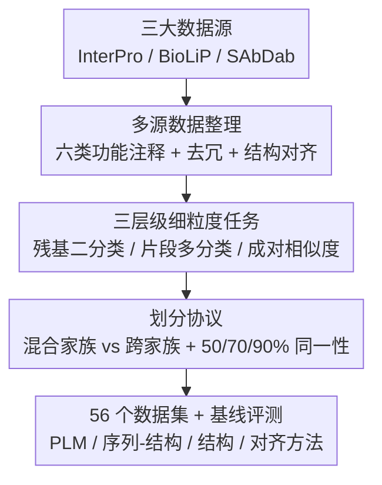

# VenusX: Unlocking Fine-Grained Functional Understanding of Proteins

**会议**: ICLR 2026  
**OpenReview**: [https://openreview.net/forum?id=zcmL592XRG](https://openreview.net/forum?id=zcmL592XRG)  
**代码**: https://github.com/（VenusX GitHub / HuggingFace 数据集 / Leaderboard，论文中给出）  
**领域**: 计算生物学 / 蛋白质表示学习 / 基准测试  
**关键词**: 蛋白质功能理解, 细粒度基准, 残基级预测, 跨家族泛化, 表示学习

## 一句话总结
VenusX 是首个面向**蛋白质内部细粒度功能理解**的大规模基准，把活性位点、结合位点、保守位点、motif、domain、表位这六类残基级注释整理成「残基级二分类 / 片段级多分类 / 成对功能相似度打分」三大任务（共 56 个数据集、87.8 万样本），并用混合家族 / 跨家族两种划分系统评测了一批主流蛋白质模型，揭示出「全局蛋白级表现强 ≠ 细粒度功能理解强」。

## 研究背景与动机

**领域现状**：深度学习在蛋白质上的成功（AlphaFold 结构预测、序列工程、功能注释）很大程度依赖高质量基准。现有基准（TAPE、PEER、ProteinGym、ProteinBench 等）绝大多数面向**蛋白级（protein-level）属性**——给整条蛋白或一对蛋白打一个标签，比如功能注释、PPI 预测、适应度估计。

**现有痛点**：但生物功能往往由蛋白内部的**特定子区域**决定，而非整条分子。全局标签会掩盖机制细节，甚至诱导模型依赖生物学上不合理的特征做预测，导致对噪声过拟合、可解释性差，并在「局部特征关键」的任务（功能注释、抗体表位设计）上精度受损。

**核心矛盾**：现有评测的粒度（整条蛋白一个标签）与生物功能的真实粒度（残基 / 片段 / 结构域）之间存在错配。模型可能只是抓住了「序列相似性」这种全局分布线索，而没有真正捕捉局部的生物学信号——但没有合适的基准能把这两者区分开。

**本文目标**：构建一个细粒度、生物学上有根据的基准，能在残基、motif、片段、结构域多个亚蛋白层级上，同时评测模型的拟合能力、鲁棒性和跨家族泛化能力。

**切入角度**：作者把「细粒度功能理解」拆成三类可量化的任务——逐残基判断是否功能关键、把功能片段归到具体生物角色、在无标签下度量两条蛋白/片段的功能相似度——并刻意设计**跨家族划分**来逼出 OOD 场景，看模型能否超越序列同源性做泛化。

**核心 idea**：用「残基 + 片段 + 成对」三层级任务 + 「混合家族 / 跨家族」双划分，把蛋白模型的细粒度功能理解能力从全局蛋白级表现里**剥离出来单独考核**。

## 方法详解

### 整体框架

VenusX 本质是一条「数据整理 → 任务定义 → 划分协议 → 基线评测」的基准构建流水线。输入是三个权威数据库（InterPro、BioLiP、SAbDab）的原始残基级注释，输出是 56 个命名规范的数据集 + 一张公开 leaderboard。中间经过三步：先把六类功能注释清洗去冗、和结构/序列对齐；再围绕这些注释定义三大类任务；最后用混合家族 / 跨家族、三档序列同一性阈值切出 in-distribution 与 out-of-distribution 两种评测面，冻结一批主流模型当特征提取器跑分。

### 关键设计

**1. 三层级细粒度任务：把"功能理解"拆成残基、片段、成对三个可量化考题**

针对「全局标签掩盖机制细节」这个痛点，VenusX 不再让模型对整条蛋白打一个标签，而是设计了三类逐渐抽象的任务。**残基级二分类**逐个氨基酸判断它是否对功能（催化、结合、进化约束、结构域边界）关键，共 7 个子任务（Act 活性位点、BindI/BindB 两来源的结合位点、Evo 进化压力、Motif、Dom、Epi 表位）；由于绝大多数残基是非功能性的（正例占比低至 4%），类别极度不均衡，因此用正类的 precision/recall/F1 加 AUPR 评测。**片段级多分类**只把已识别出的功能片段（连续序列 motif，不人为拼接非连续残基）作为输入，要求归到对应的 InterPro 家族——类别数从几百到上万（Dom 高达 13,459 类），用 ACC 和 macro-F1 同时反映整体正确率与类均衡表现。**成对功能相似度打分**在零样本无监督下给两条蛋白/片段输出相似度分，正例定义为同属一个 InterPro 家族，用 AUC 评测，embedding 方法取余弦相似度、对齐方法取 $-\log(\text{E-value})$ 或双向平均 TM-score。三层级共同覆盖了「定位关键残基 → 标注功能角色 → 检索功能近邻」这条实际推理链。

**2. 多源数据整理：用三个权威数据库 + 距离判据把六类注释落到残基**

针对「细粒度监督信号稀缺」的痛点，作者从三个互补数据库严格整理出 87.8 万高置信样本。**InterPro** 提供活性位点、结合位点、保守位点、motif、domain 五类注释，配 UniProt 规范序列与 AlphaFold 预测结构，并对「同一蛋白多个片段标同一功能」的情况合并去冗。**BioLiP** 补充实验解析的配体结合位点，判据是残基任一原子落在相互作用原子对范德华半径之和 + 0.5 Å 经验余量内。**SAbDab** 贡献「抗体无关表位预测」这个任务——从抗体-抗原复合物里抽表位，判据是抗原残基 Cα 与任一抗体 Cα 的欧氏距离 < 10 Å，这一几何判据能同时捕捉序列相邻的连续表位和空间聚集但序列远离的构象表位。三套数据各自定义清晰、来源可追溯，保证了基准的生物学根据。

**3. 混合家族 vs 跨家族划分：把 in-distribution 和 out-of-distribution 拆开考**

针对「模型可能只靠序列相似性作弊」这个核心矛盾，作者对分类任务设计了两种正交的划分。**混合家族（mix-family）** 不管家族归属，把蛋白/片段按 8:1:1 随机切分，考的是 in-distribution 泛化——测试蛋白和训练集很近时表现如何。**跨家族（cross-family）** 则把**整个 InterPro 家族**整体分到 train/val/test，强制测试集来自训练时完全没见过的家族，考的是 OOD 泛化。两种划分前都先用 MMseqs2 在 50%、70%、90% 三档序列同一性阈值聚类去冗，阈值越低意味着越要求模型超越同源性。这套协议直接量化出关键结论：跨家族下 Act/BindI 的最佳 AUPR 暴跌 70–80%，而 Dom 只掉不到 10%，说明催化/结合残基比结构域级模式难外推得多。三大类任务 × 7 目标 × 多种划分组合出 56 个命名规范（`VenusX_[category]_[target]_[split]`）的数据集。

### 损失函数 / 训练策略

基准本身不训练新模型，而是统一评测协议：序列类（ESM2、ProtBert、Ankh）和序列-结构类（SaProt、ProtSSN）作为**冻结特征提取器**，残基级输出经两层 ReLU+dropout 线性头，片段级用 mean-pooling 得片段表示；结构类 GVP-GNN 从头训练全参更新以保证公平。序列截断到 1022 残基，片段 Act/BindI/Evo/Motif 截到 128、Dom 截到 512；AdamW（lr=0.001，有效 batch=128），训 100 epoch、验证集 AUPR/ACC 早停（10 epoch 不升即停），固定种子 3407。全部实验在 16 张 RTX 4090D 上跑了 45 天。

## 实验关键数据

### 主实验

残基级二分类（AUPR，50% 同一性）：

| 目标 | 划分 | ESM2-T33 | Ankh-Base | SaProt-650M | GVP-GNN |
|------|------|----------|-----------|-------------|---------|
| Act | MP50（ID） | 0.955 | 0.960 | 0.945 | 0.898 |
| Act | Cross（OOD） | 0.143 | 0.166 | 0.185 | 0.101 |
| BindI | Cross | 0.159 | 0.145 | 0.182 | 0.040 |
| Dom | Cross | 0.506 | 0.449 | 0.564 | 0.468 |
| Epi | MP90 | 0.290 | 0.270 | 0.308 | 0.196 |

片段级多分类（50% 同一性，ACC / Macro-F1）：

| 目标 | 指标 | ESM2-T33 | SaProt-650M | GVP-GNN |
|------|------|----------|-------------|---------|
| Act | ACC | 0.814 | 0.928 | 0.907 |
| Act | Macro-F1 | 0.605 | 0.825 | 0.906 |
| BindI | Macro-F1 | 0.753 | 0.957 | 0.884 |

成对相似度（AUC%）：Foldseek 在 Evo_P50 上达 99.0，BLAST 在每个任务都落后 >40%；ProtT5 达 BindI_F50 98.5、Motif_F50 98.2，超过纯序列编码器 7–20%；TM-Vec 在 Motif_P50 达 99.4。

### 消融 / 分析

| 维度 | 关键观察 | 含义 |
|------|---------|------|
| ID vs OOD | 跨家族下 Act/BindI AUPR 暴跌 70–80%，Dom 仅掉 <10% | 催化/结合残基比结构域模式难外推 |
| 模态 | 低同一性下序列-结构模型显著优于纯序列 | 序列同源弱时结构先验关键 |
| 表位 | 所有模型 Epi AUPR 均 < 0.3 | 构象/抗体无关特征推理仍是空白 |
| 对齐方法 | BLAST 转移细粒度标签 AUPR ≈ 0.04 | 传统对齐无法迁移细粒度功能，深度表示有必要 |

### 关键发现
- **全局强 ≠ 细粒度强**：在传统蛋白级任务上强的模型，未必能做好细粒度功能理解，很多模型重度依赖全局/分布线索。
- **结构先验决定 OOD 上限**：SaProt-650M 在所有 InterPro 跨家族划分上拿到最好或次好，Dom 级比 ProtBert 高 +5.6% AUPR；说明同源性弱时注入结构归纳偏置才能泛化。
- **类别不均衡暴露差距**：纯序列模型 ACC 虽超 80%，但 Macro-F1 低 15–20%；序列-结构模型把这个 gap 压到约 10%。
- **表位是最硬骨头**：无论哪档同一性，没有任何模型在 Epi 上 AUPR 超过 0.3，构象表位预测是明确的开放问题。

## 亮点与洞察
- **把"会不会作弊"做成可测量的轴**：跨家族划分 + 三档同一性阈值，直接量化出模型超越序列同源性的能力——这比单一随机划分更能戳穿「靠分布线索取巧」的模型。
- **任务粒度对齐生物机制**：从残基到片段再到成对检索，三层级正好对应「定位 → 标注 → 检索」的真实功能分析流程，可解释性强。
- **冻结特征提取协议**：用 frozen encoder + 轻量头评测，隔离了预训练表示的内在质量与微调混杂因素，让 87.8 万样本的大规模评测在算力上可行、跨模型可比。
- 距离/几何判据（范德华 +0.5 Å、Cα 10 Å）可直接复用到其他「从复合物结构反推残基级标签」的数据构建任务。

## 局限与展望
- **只是基准、不提新方法**：VenusX 诊断出了细粒度理解的短板（尤其表位），但没给出解决方案，留待后续模型设计。
- **冻结评测的天花板**：用 frozen encoder 可能低估了部分模型微调后的潜力，结论主要反映「现成表示」的质量而非「可达上限」。
- **数据可得性约束划分**：跨家族 / 片段级划分只能在 InterPro 来源上做，BioLiP / SAbDab 因缺家族注释只能做蛋白级混合划分，OOD 评测覆盖面受限。
- **改进方向**：针对构象表位这类 3D 空间聚集但序列远离的目标，需要更强的结构推理而非序列模式匹配；社区可通过 PR 扩充数据集。

## 相关工作与启发
- **vs TAPE / PEER / ProteinGym**: 它们聚焦蛋白级（二级结构、远程同源、适应度），给整条蛋白/蛋白对打标签；VenusX 首次系统化到残基/片段/结构域级，专门考核局部生物信号——区别在「评测粒度」，互补而非替代。
- **vs ProteinShake / ProteinBench**: 它们标准化了结构数据集与多任务（结构预测、序列设计等），但缺乏残基级细粒度监督；VenusX 用三数据库整理出残基级标签填补这一空白。
- **vs MaSIF / DIPS-plus / PDBbind 等成对任务**: 这些提供界面/亲和力标注，但同样缺残基级监督，难以评测细粒度功能推理；VenusX 的成对相似度任务用 InterPro 家族成员关系做零样本检索式评测。

## 评分
- 新颖性: ⭐⭐⭐⭐ 首个细粒度蛋白内功能理解基准，跨家族划分设计巧妙；但属基准贡献而非方法创新。
- 实验充分度: ⭐⭐⭐⭐⭐ 56 个数据集、87.8 万样本、十余类基线模型、45 天算力，覆盖序列/结构/对齐多模态。
- 写作质量: ⭐⭐⭐⭐ 任务定义和划分协议讲得清晰，命名规范完整，发现条理分明。
- 价值: ⭐⭐⭐⭐⭐ 揭示「全局强≠细粒度强」并开源数据+leaderboard，对蛋白表示学习社区有长期评测价值。

<!-- RELATED:START -->

## 相关论文

- [\[ICLR 2026\] Lost in Tokenization: Context as the Key to Unlocking Biomolecular Understanding in Scientific LLMs](lost_in_tokenization_context_as_the_key_to_unlocking_biomolecular_understanding_.md)
- [\[ICLR 2026\] PRISM: Enhancing Protein Inverse Folding through Fine-Grained Retrieval on Structure-Sequence Multimodal Representations](prism_enhancing_protein_inverse_folding_through_fine-_grained_retrieval_on_struc.md)
- [\[ICLR 2026\] Towards Understanding the Shape of Representations in Protein Language Models](towards_understanding_the_shape_of_representations_in_protein_language_models.md)
- [\[ICLR 2026\] SimpleFold: Folding Proteins is Simpler Than You Think](simplefold_folding_proteins_is_simpler_than_you_think.md)
- [\[ICLR 2026\] The Human Brain as a Dynamic Mixture of Expert Models in Video Understanding](the_human_brain_as_a_dynamic_mixture_of_expert_models_in_video_understanding.md)

<!-- RELATED:END -->
