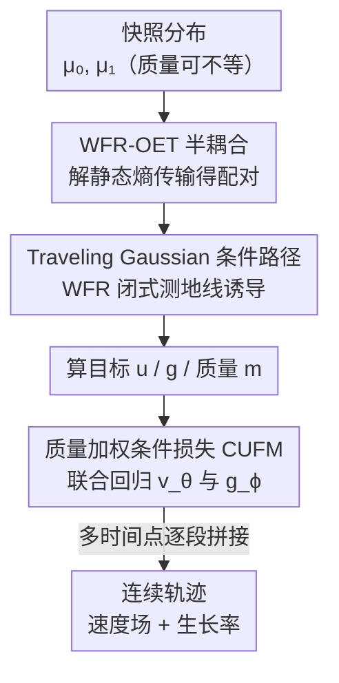

# WFR-FM: Simulation-Free Dynamic Unbalanced Optimal Transport

**会议**: ICLR 2026  
**论文**: [OpenReview](https://openreview.net/forum?id=wfr-fm)（⚠️ 链接以原文为准）  
**代码**: https://github.com/QiangweiPeng/WFR-FM (有)  
**领域**: 计算生物学 / 最优传输 / Flow Matching  
**关键词**: Wasserstein–Fisher–Rao、不平衡最优传输、Flow Matching、单细胞轨迹推断、生灭动力学

## 一句话总结
WFR-FM 把 flow matching 扩展到「质量不守恒」的动态不平衡最优传输：在 Wasserstein–Fisher–Rao（WFR）几何下，同时回归一个位移速度场和一个标量生长率函数，用解析的 Dirac-to-Dirac 测地线构造条件路径，从而**无需 ODE 仿真**就能恢复带细胞增殖/凋亡的单细胞动力学，在轨迹推断的精度、稳定性和效率上全面超过现有 ODE/FM 基线。

## 研究背景与动机

**领域现状**：单细胞转录组（scRNA-seq）测序是破坏性的，每个细胞只能测一次，因此实验只能给出少数几个时间点的「快照」分布。轨迹推断（trajectory inference）的任务就是从这些稀疏快照里重建出连续的细胞演化动力学。最优传输（OT）是这个领域的主流框架，分两类：静态 OT 只在时间点之间对齐分布、不显式建模中间过程；动态 OT 用神经 ODE / 连续归一化流（CNF）重建连续流，信息更丰富。

**现有痛点**：动态 OT 通常靠神经 ODE 实现，训练时要反复积分求解 ODE，计算昂贵且不稳定。为此 flow matching（FM）被提出——直接回归 ODE 的漂移场（drift），**免仿真**、稳定可扩展。但经典 FM 假设质量守恒（分布归一化），而真实细胞群体并不守恒：细胞会增殖、会凋亡，导致不同时间点的分布**总质量都不一样**（unbalanced）。

**核心矛盾**：要同时满足「免仿真训练」和「显式建模质量生灭」两件事很难。现有的不平衡 FM 大多只回归速度场、忽略生长动力学（UOT-FM、Corso 等）；最近的 VGFM 虽然联合学速度和生长，但它把生灭和位移**拆开**再用修正动力学近似，这偏离了不平衡 OT 的几何，而且后训练阶段仍然依赖 ODE 仿真，并非真正免仿真。Action Matching 假设能拿到连续密度曲线（scRNA-seq 拿不到），WLF 则要做内外双层优化、额外开销大。

**本文目标**：在 WFR 几何下，用一个**完全免仿真**的 flow matching 框架，**联合**回归位移速度场和生长率，并且保证学到的轨迹严格是 WFR 测地线。

**切入角度**：WFR 度量本身就把「位移」和「质量生灭」耦合在一个统一的作用量里，且两个 Dirac 测度之间的 WFR 测地线（traveling Dirac）有**闭式解**。作者意识到：只要把 FM 里那条「条件高斯路径」换成由 WFR 闭式测地线诱导的「traveling Gaussian」，就能把不平衡 OT 直接塞进 FM 的免仿真回归框架。

**核心 idea**：用 WFR 的解析 Dirac-to-Dirac 测地线作为条件路径、并把回归误差按质量加权，从而把「动态不平衡 OT」转写成一个简单的免仿真回归问题——同时学速度场 $v_\theta$ 和生长率 $g_\phi$。

## 方法详解

### 整体框架

WFR-FM 要解的是：给定起点测度 $\mu_0$、终点测度 $\mu_1$（总质量可以不等），找一条满足带源项连续性方程的测度路径 $\rho_t$，使 WFR 作用量最小。WFR 的动态形式为

$$\mathrm{WFR}^2_\delta(\mu_0,\mu_1)=\inf_{\rho,g,u}\int_0^1\!\!\int_X \tfrac12\big(\|u(x,t)\|_2^2+\delta^2\|g(x,t)\|_2^2\big)\rho_t(x)\,dx\,dt,\quad \partial_t\rho+\nabla_x\!\cdot(\rho u)=\rho g,$$

其中 $u$ 是位移速度、$g$ 是生长率、$\delta$ 是平衡「搬运 vs 生灭」的惩罚系数。直接优化这个泛函不可解，WFR-FM 的做法是仿照 conditional flow matching（CFM）：把难解的边际目标拆成「条件路径 + 条件损失 + 耦合」三件套，三者都由 WFR 几何指定，于是边际场恰好恢复 WFR 测地线。

整条 pipeline 是：先在数据上求解静态 WFR-OET 耦合 → 由耦合构造半耦合并采样 (起点, 终点) 配对 → 沿 WFR 闭式测地线构造 traveling Gaussian 条件路径，算出该点的目标速度 $u$、目标生长率 $g$、当前质量 $m$ → 用质量加权的回归损失同时训练 $v_\theta$ 和 $g_\phi$。训练全程没有任何 ODE 积分。

### 关键设计

**1. WFR-OET 半耦合：决定起点和终点怎么配对**

不平衡场景里「从 $x$ 出发的质量」和「到达 $y$ 的质量」可以不相等，所以普通 OT 耦合不够用，需要 WFR 特有的**半耦合**（semi-coupling）$(\gamma_0,\gamma_1)$：$\gamma_0(x,y)$ 是初始时刻从 $x$ 送出的质量，$\gamma_1(x,y)$ 是终末时刻被 $y$ 接收的质量。作者利用 WFR 与最优熵传输（OET）问题的等价性——把静态 WFR 距离写成一个带 KL 边际惩罚的传输问题

$$\mathrm{WFR}^2_\delta(\mu_0,\mu_1)=2\delta^2\inf_{\gamma}\Big\{\!-\!2\!\int\ln\overline{\cos}\big(\tfrac{\|x-y\|_2}{2\delta}\big)\gamma\,dxdy+\mathrm{KL}(\textstyle\int\gamma\,dy\,\|\,\mu_0)+\mathrm{KL}(\textstyle\int\gamma\,dx\,\|\,\mu_1)\Big\},$$

用 Sinkhorn 类求解器高效解出 OET 耦合 $\gamma$，再（Theorem 3.1）由 $\gamma$ 解析地构造出半耦合 $\gamma_0(x,y)=\frac{\gamma(x,y)}{\int_X\gamma(x,z)dz}\mu_0(x)$、$\gamma_1$ 同理。这一步保证了「谁该变成谁」的配对本身就符合 WFR 几何，而不是随便配一条直线。

**2. Traveling Gaussian 条件路径：把 WFR 闭式测地线塞进 flow matching**

经典 FM 在两个采样点之间用一条高斯桥（直线 + 高斯噪声）当条件路径；但在 WFR 里两个 Dirac 之间的最优路径不是直线，而是带质量变化的「traveling Dirac」，且**有闭式解**。两个 Dirac $m_0\delta_{x_0}$、$m_1\delta_{x_1}$ 的测地线满足 $m(t)=At^2-2Bt+m_0$、$u(t)m(t)=\omega_0$，其中 $A,B,\omega_0,\tau$ 由 $\|x_1-x_0\|$ 和 $\delta$ 解析给出（式 3.6）。作者据此定义条件高斯测度路径（CGMP），关键是把条件测度**解耦成质量和密度两部分** $\rho_t(x|z)=m_t(z)\,\tilde\rho_t(x|z)$，密度部分取高斯

$$\tilde\rho_t(x|x_0,x_1)=\mathcal N\!\big(x\,\big|\,x_0+\omega_0\Lambda_t(x_0,x_1),\,\sigma^2 I\big),$$

均值沿 traveling Dirac 的解析轨迹移动（$\Lambda_t$ 是对 $1/m_s$ 的积分，也有 arctan 闭式）。对应的条件速度场和生长率因此也是闭式的：$u_t(x|z)=\frac{\sigma'_t}{\sigma_t}(x-\eta_t)+\eta'_t$、$g_t(x|z)=\partial_t\ln m_t(z)$。作者证明当带宽 $\sigma\to0$ 时边际边界测度收敛到 $\mu_0,\mu_1$，且诱导的边际场 $u_t,g_t$ 恰好求解动态 WFR 问题（Prop 4.2）——这就是「最小化损失 = 恢复 WFR 测地线」理论保证的来源。一个有意思的副产物：即便起末质量相等，WFR 的质量轨迹 $m(t)$ 仍然非常数（先增后减），只有当 $\delta\to\infty$ 时才退化回守恒、整个方法退化成 OT-CFM（Prop 4.3）。

**3. 质量加权条件损失 CUFM：联合回归速度与生长**

有了闭式的条件目标，就把 $v_\theta$、$g_\phi$ 同时回归到它们上。难解的边际不平衡 FM 目标 $L_{\mathrm{UFM}}$ 含未知边际 $\rho_t$，作者改用条件不平衡 FM（CUFM）目标

$$L_{\mathrm{CUFM}}(\theta,\phi)=\mathbb E_{t,z,x\sim\tilde\rho_t(\cdot|z)}\big(\|v_\theta-u_t(x|z)\|_2^2+\kappa\|g_\phi-g_t(x|z)\|_2^2\big)\,m_t(z).$$

和平衡 CFM 相比，**唯一也是关键的区别是多了质量权重 $m_t(z)$**：平衡设定里每个粒子质量恒为 1，可以省略；但不平衡设定里粒子质量随时间变，回归误差必须按当前质量加权，否则「快消失的粒子」和「正在增殖的粒子」会被错误地同等对待。Theorem 4.2 证明 $L_{\mathrm{UFM}}=L_{\mathrm{CUFM}}+C$（常数与参数无关），两者梯度完全一致，所以优化这个可采样的条件损失等价于优化原始边际目标。$\kappa$ 平衡速度项和生长项的权重。

**4. 多时间点拼接 + mini-batch WFR-OET：落到真实 scRNA-seq 数据**

真实数据有 $K+1$ 个时间点。作者证明（Prop 5.1）多时间点 WFR 问题的解等于相邻时间点逐段 WFR 解的拼接，因此只需对每个相邻区间 $(\mu_{t_k},\mu_{t_{k+1}})$ 各求一次耦合、各构造一次条件路径，再把所有区间的 $\{x,t,u,g,m\}$ 拼成一个 batch 一起回归（速度场和生长率在所有区间**共享**，提升泛化）。为了让 OET 在大规模数据上可算，沿用 OT-CFM 的 mini-batch 策略：把 $\mu_0,\mu_1$ 切成 $B$ 个小批、各自解 OET 耦合 $\gamma^{(b)}$，再拼接近似全局耦合 $\gamma=\bigoplus_b\gamma^{(b)}$。这一步是把理论方法变成可扩展算法的工程关键，论文在 Appendix/Table 8 给了对 batch 大小的敏感性分析。

### 损失函数 / 训练策略
训练目标就是上面的 $L_{\mathrm{CUFM}}$。流程（Algorithm 1）：① 对每个相邻时间区间预计算（mini-batch）OET 耦合并构造半耦合 $\gamma_0^{(k)}$；② 训练循环里从 $\gamma_0^{(k)}$ 采样配对 $(x_{t_k},x_{t_{k+1}})$，按式 3.6 算 $A,B,\omega_0,\tau$，采样时间 $t$、沿 traveling Gaussian 采样 $x^{(k)}$，解析算出目标 $u^{(k)},g^{(k)}$ 和质量 $m^{(k)}$；③ 把各区间张量拼接，按质量加权 MSE 同时更新 $\theta,\phi$。关键超参：带宽 $\sigma$、WFR 惩罚 $\delta$、生长项权重 $\kappa$、OET mini-batch 大小 $B$。全程无 ODE 积分。

## 实验关键数据

围绕 5 个问题展开：Q1 能否把 $\mu_{t_0}$ 传输到各时间点、Q2 是否逼近动态 WFR 解、Q3 插值未观测时间点是否准、Q4 可扩展性、Q5 能否恢复生灭动力学。

### 主实验：合成数据上的分布与质量传输（Q1）

用 1-Wasserstein 距离（W1，衡量归一化分布相似度）和相对质量误差（RME，衡量是否抓住群体增长）评测。

| 方法 | Gene W1↓ | Gene RME↓ | Dyngen W1↓ | Gaussian(1000D) W1↓ |
|------|----------|-----------|------------|---------------------|
| SF2M | 0.224 | — | 1.277 | 3.543 |
| MIOFlow | 0.148 | — | 0.965 | 2.858 |
| TIGON | 0.045 | 0.014 | 0.512 | 2.263 |
| DeepRUOT | 0.043 | 0.017 | 0.623 | 3.785 |
| VGFM | 0.046 | 0.006 | 0.598 | 3.010 |
| UOT-FM | 0.093 | 0.010 | 1.204 | 2.771 |
| **WFR-FM** | **0.019** | **0.001** | **0.135** | **2.233** |

WFR-FM 在所有数据集上同时拿到最低 W1 和接近零的 RME，低维 Dyngen 上 W1 比次优（0.512）直接砍到 0.135，高维 1000D 也最优。

### Hold-One-Out 插值（Q3）：真实 scRNA-seq 多时间点

训练时挖掉一个中间时间点，看能否插值出来（W1，越低越好）。

| 方法 | EMT(10D) | EB(50D) | CITE(50D) | Mouse(50D) |
|------|----------|---------|-----------|------------|
| VGFM | 0.301 | 10.370 | 37.386 | 8.496 |
| DeepRUOT | 0.323 | 10.075 | 37.892 | 6.847 |
| TIGON | 0.360 | 11.080 | 38.159 | 6.868 |
| **WFR-FM** | **0.298** | **10.157** | **37.221** | **6.586** |

WFR-FM 在 EMT/CITE/Mouse 上最好，EB 上与最强基线持平。

### 路径作用量与生长率（Q2 / Q5）

| 评测 | 数据集 | WFR-FM | 静态参考 / 最佳基线 |
|------|--------|--------|---------------------|
| Path action（Q2，越接近静态参考越好） | Gene | 1.305 | 静态参考 1.333 |
| Path action | Dyngen | 9.410 | 静态参考 9.569 |
| 生长率相关 gcorr（Q5，越高越好） | Gene | **0.9913** | TIGON 0.9705 / Action Matching 0.5851 |

WFR-FM 的路径作用量在所有数据集上都最接近静态 WFR-OET 求解器给的参考值（说明它确实逼近 WFR 测地线，而不是像 Var-RUOT 那样靠牺牲分布保真度去压低作用量）；生长率与真值的 Pearson 相关达 0.9913，验证它真的恢复了生灭动力学而非只对齐边际分布。

### 关键发现
- **质量项是不平衡建模的命门**：CUFM 相对平衡 CFM 的唯一结构性差别就是质量权重 $m_t(z)$，正是它让模型能正确处理增殖/凋亡导致的质量不守恒。
- **免仿真带来效率优势（Q4）**：在 100D 大规模 EB 数据上，WFR-FM 兼顾高精度（优于只学速度场的方法）和高效率（优于 ODE 类方法），在运行时间/显存/精度三角上取得好平衡。
- **超参鲁棒**：对生长惩罚 $\delta$（Table 5）和 mini-batch OET 的 batch 大小（Table 8）都不敏感。
- **理论自洽退化**：$\delta\to\infty$ 时方法严格退化为 OT-CFM，说明它是平衡 FM 的真正几何推广。

## 亮点与洞察
- **把闭式测地线当条件路径**：WFR-FM 最巧的一步是认识到「两个 Dirac 之间的 WFR 测地线有闭式解」，于是直接用 traveling Gaussian 替换 FM 里的高斯桥，零成本把不平衡 OT 嫁接进免仿真框架——这是「方法可行」的根本。
- **质量解耦 + 质量加权**：把条件测度拆成 $m_t(z)\tilde\rho_t(x|z)$，密度走标准高斯回归、质量单独成一个标量回归目标 $g$，再用 $m_t(z)$ 给损失加权。这套「解耦再加权」的思路可迁移到任何需要在 FM 框架里建模「权重/质量随时间变」的任务。
- **理论与算法咬合**：Theorem 4.2（条件损失梯度等价）+ Prop 4.2（极限恢复 WFR 测地线）两条定理把「可采样的简单回归」和「难解的泛函优化」严格连起来，不是经验近似。
- **框架可推广**：作者指出只要静态 OT 可高效求解、Dirac-to-Dirac 路径有闭式解（如线性生长惩罚），同一套范式就能扩展到其他不平衡传输泛函，不止 WFR。

## 局限与展望
- **依赖静态 OT 求解**：和所有 OT-FM 方法一样，要先解一个静态 OT 问题，超大数据集上仍然昂贵；目前靠 mini-batch OT + 熵正则 Sinkhorn 近似缓解，但 mini-batch 拼接是近似、可能引入偏差。
- **未建模不确定性**：作者承认在噪声大的单细胞数据上引入不确定性量化（uncertainty quantification）会有帮助，当前版本是确定性回归。
- **闭式解的适用边界**：traveling Dirac 测地线的闭式表达只在 $\|x_0-x_1\|_2<\pi\delta$ 等条件下成立（$\overline{\cos}$ 做了截断），$\delta$ 选得过小可能让远距离配对落到截断区，几何含义需谨慎（⚠️ 细节以原文 Appendix 为准）。
- **评测以单细胞为主**：生成式不平衡数据上的实验相对单细胞较少，跨域泛化还需更多验证。

## 相关工作与启发
- **vs VGFM (Wang et al. 2025)**：VGFM 也联合学速度和生长，但它把生灭和位移拆开、用修正动力学近似同时演化，偏离不平衡 OT 几何，且后训练仍依赖 ODE 仿真；WFR-FM 用 WFR 闭式测地线统一二者、完全免仿真，且有「恢复 WFR 测地线」的理论保证。
- **vs UOT-FM / Corso 等**：这些不平衡 FM 只回归速度场、不显式建模生长率；WFR-FM 显式回归标量生长率 $g_\phi$，Q5 实验里生长率相关性远高于它们。
- **vs Action Matching / WLF (Neklyudov et al.)**：AM 假设能拿到连续密度曲线（scRNA-seq 难满足），WLF 要做内外双层优化、开销大；WFR-FM 只需快照 + 一次静态 OT + 简单回归。
- **vs ODE 类 RUOT（TIGON / DeepRUOT / Var-RUOT）**：它们靠反复 ODE 积分，慢且易不稳；WFR-FM 免仿真，效率和稳定性都更优，且作用量更接近静态参考（不像 Var-RUOT 靠牺牲分布保真度压作用量）。

## 评分
- 新颖性: ⭐⭐⭐⭐⭐ 首个用 WFR 闭式测地线把动态不平衡 OT 完全塞进免仿真 flow matching 的框架，理论+算法双落地。
- 实验充分度: ⭐⭐⭐⭐ 覆盖合成+多个真实 scRNA-seq、5 个研究问题、作用量/生长率/可扩展性多维度，但生成式场景偏少。
- 写作质量: ⭐⭐⭐⭐ 数学背景铺垫扎实、定理与算法对应清晰；符号较密，对非 OT 背景读者门槛偏高。
- 价值: ⭐⭐⭐⭐⭐ 给质量不守恒的单细胞轨迹推断提供了高效、稳定、有理论保证的统一范式，且框架可推广到其他不平衡传输问题。

<!-- RELATED:START -->

## 相关论文

- [\[NeurIPS 2025\] Variational Regularized Unbalanced Optimal Transport: Single Network, Least Action](../../NeurIPS2025/computational_biology/variational_regularized_unbalanced_optimal_transport_single_network_least_action.md)
- [\[ICLR 2026\] Fast and Interpretable Protein Substructure Alignment via Optimal Transport](fast_and_interpretable_protein_substructure_alignment_via_optimal_transport.md)
- [\[ICLR 2026\] Optimal Transport Unlocks End-to-End Learning for Single-Molecule Localization](optimal_transport_unlocks_end-to-end_learning_for_single-molecule_localization.md)
- [\[ICLR 2026\] MarS-FM: Generative Modeling of Molecular Dynamics via Markov State Models](mars-fm_generative_modeling_of_molecular_dynamics_via_markov_state_models.md)
- [\[ICLR 2026\] KGOT: Unified Knowledge Graph and Optimal Transport Pseudo-Labeling for Molecule-Protein Interaction Prediction](kgot_unified_knowledge_graph_and_optimal_transport_pseudo-labeling_for_molecule-.md)

<!-- RELATED:END -->
