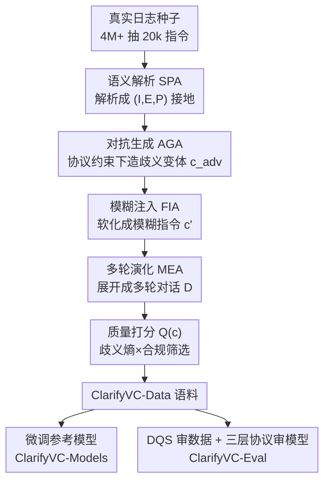

# ClarifyVC: Clarifying Ambiguous Commands in Vehicle Control with a Hybrid Data Augmentation Pipeline

**会议**: ICLR2026  
**OpenReview**: [https://openreview.net/forum?id=afO3vnSNsS](https://openreview.net/forum?id=afO3vnSNsS)  
**代码**: https://anonymous.4open.science/r/ClarifyVC  
**领域**: 对话系统 / 车载语音 / 数据增强 / Benchmark  
**关键词**: 歧义澄清、车辆控制、函数调用、多轮对话、数据增强

## 一句话总结
ClarifyVC 用一个 Agent 编排的四阶段数据增强流水线，从 2 万条真实车载指令里"种"出大量歧义丰富、协议合规的单轮/多轮对话，配上三层评测协议与数据质量分 DQS，在这套数据上微调后让车载语音指令的解析准确率提升约 15%、歧义消解提升约 20%、协议合规度达 98%。

## 研究背景与动机
**领域现状**：车载自然语言接口正成为人机交互入口，需要把模糊口语指令（"有点热""把那个开关打开"）映射成严格校验的、符合车机协议（schema）的函数调用。早期靠意图识别 + 槽位填充的结构化解析器，近年转向直接用 LLM 端到端解析。

**现有痛点**：真实车内场景里指令普遍模糊、协议映射不完整、上下文不断变化。传统意图/槽位方法在歧义和上下文漂移下表现很差；而现有数据集（Talk2Car、CI-AVSR、doScenes）几乎都是单轮指令-动作对，缺少交互式澄清，也缺乏"该不该追问"的安全失效度量。作者还引了一组公众态度数据：58% 的人对车载语音助手感到不安、25% 完全不信任。

**核心矛盾**：通用 LLM 推理能力强，但在安全攸关的控制场景里有三个硬伤——遇到模糊指令会"硬猜"（幻觉）、不确定时不会主动追问澄清、生成的调用不严格守协议。根因是缺少**贴近真实日志**的高质量数据和**能暴露这三类失效**的标准化评测。

**本文目标**：构建一个端到端框架，覆盖三个子问题——(1) 怎么规模化造出既真实又富含歧义、还协议合规的训练数据；(2) 用什么标准同时审计"数据够不够真"和"模型够不够可靠"；(3) 在这套数据上微调能否真正改善解析、澄清与安全合规。

**切入角度**：与其纯靠仿真造数据，不如**以真实日志为种子**（4M+ 生产级交互里抽出 20k+ 真实指令），再用多个专职 LLM Agent 分阶段地往里"注入"可控的歧义与对抗扰动，让合成数据天然带着真实分布。

**核心 idea**：用"真实日志种子 + Agent 编排的分阶段歧义注入"取代"纯仿真生成"，把现实接地、可扩展生成、标准化评测三件事紧耦合成一个框架（Data + Models + Eval）。

## 方法详解

### 整体框架
ClarifyVC 由三块拼成：数据流水线 **ClarifyVC-Data**、在数据上微调出的参考模型 **ClarifyVC-Models**、安全感知的三层评测 **ClarifyVC-Eval**。整条管线的转法是：拿真实车载指令当种子 → 用四个 LLM Agent 依次做语义解析、对抗生成、模糊注入、多轮演化 → 得到一个分层的歧义对话语料（先有对抗变体 $c_{adv}$，再变软成模糊指令 $c'$，最后展开成多轮对话 $D$）→ 在语料上微调开源模型 → 用 DQS 审数据、用三层协议审模型。

四个 Agent 各司其职、互不微调，只靠 prompt 工程驱动预训练 LLM：SPA/FIA/MEA 用 DeepSeek-R1（API），AGA 用 Qwen2.5-72B（vLLM）做协议约束下的对抗改写。这种"现成 LLM + 模块化"的设计让任一阶段都能即插即换，生成成本也压得很低（主要是 API 调用）。

### 关键设计

**1. SPA→AGA→FIA→MEA 四阶段分层歧义注入：把"硬指令"逐级变软**

这是数据流水线的主干，直接针对"造不出既真实又富歧义还合规的数据"这个痛点。四个阶段是递进的：SPA（Semantic Parsing Agent）把每条种子指令解析成标准化的 $(I, E, P)$ 三元组（意图/实体/参数）当作接地锚点；AGA（Adversarial Generation Agent）在**协议约束下**生成"语法合法但语义歧义"的对抗变体 $c_{adv}$；FIA（Fuzz Injection Agent）再把 $c_{adv}$ 软化成更口语的模糊指令 $c'$（省略参数、加主观修饰词、轻度扭曲），且两层都保留；MEA（Multi-turn Evolution Agent）把 $c'$ 展开成连贯的多轮对话 $D$ 以支持长程接地。最终形成一个分层池：$\text{SPA+AGA}\Rightarrow c_{adv}$；$+\text{FIA}\Rightarrow c'$；$+\text{MEA}\Rightarrow D$。作者强调这个顺序不是随手定的——消融里调换顺序或抽掉某一阶段都会掉点（如把 FIA、AGA 对调会大幅降低歧义多样性，抽掉任一阶段都让歧义覆盖明显退化），所以这条链是经验最优。

**2. 歧义熵×合规的样本质量分 Q(c)：在多样性和可执行性之间筛样本**

光生成还不够，得挑出"既够歧义、又仍然能合法执行"的样本，否则数据要么单调、要么全是没法落地的乱指令。作者给每个样本打分

$$Q(c) = \alpha \cdot H(c) + (1-\alpha)\cdot \mathbb{I}(c \text{ 协议合规}),\quad \alpha=0.6$$

其中 $H(c)$ 是歧义熵（衡量这条指令到底有多"模糊"），$\mathbb{I}(\cdot)$ 是 0/1 的协议合规指示。$\alpha=0.6$ 偏向鼓励歧义多样性，同时用合规项当硬约束兜底，让保留下来的样本既有挑战性又守得住车机协议。

**3. 数据质量分 DQS：用一把尺子审"数据够不够真"**

为了把"数据集自审"落地，作者定义数据质量分

$$\text{DQS} = \lambda_1\cdot \text{AD} + \lambda_2\cdot \text{PC} + \lambda_3\cdot \text{R},\quad (\lambda_1,\lambda_2,\lambda_3)=(0.4,0.3,0.3)$$

三个分量各管一件事。**AD（歧义多样性）** 看数据对五大歧义类别（强度、边界、实体、模式、指代）覆盖得均不均衡，用经验分布 $p(a)$ 与均匀分布 $u(a)$ 的 KL 散度归一化：$\text{AD}=1-\frac{\mathrm{KL}(p(a)\|u(a))}{\log|A|}$，越接近均匀分布、不被单一歧义类型主导，AD 越高。**PC（协议合规度）** 是金标准函数调用同时满足 JSON schema 有效性 $S_{schema}$ 与安全规则 $S_{safety}$（类型/范围/依赖）的样本比例。**R（真实性）** 对每条指令检索 $k$ 条最相似的真实日志，看它的金标准调用 $c^*_i$ 是否落在检索回来的日志主导动作-槽位模式（众数）里——也就是它像不像历史上用户真这么说过，而非合成造作的产物。权重 $(0.4,0.3,0.3)$ 是网格搜索出来、让 DQS 与人工评分的 Spearman 相关最大化得到的。

**4. 三层评测协议：把单轮准确率盖不住的失效家族拆开**

作者分析 20k+ 真实日志发现失效恰好聚成三类：欠规约（under-specification）、澄清不足、长程接地失败。三层协议正好一一对应：**Tier 1 单轮模糊指令解析**——在欠规约下考语义解析的细粒度正确性（IRA、PEP、IHR、FHR 等意图/函数级指标）；**Tier 2 极端模糊指令反问**——考模型在严重歧义下会不会采取安全澄清策略，即能否检测极端不确定、避免乱猜、并遵守交互协议（FDR、CQC、PCR）；**Tier 3 多轮对话**——考长程多轮接地，能否跨轮迭代补全缺失语义、维持对话与参数一致并可靠执行累积指令（DC、FESR、参数完整度）。与只看单轮准确率相比，这套协议还会追踪协议违规，给出更贴近运营安全的诊断，而且这些决策点在更广的人机交互/具身智能里也复现，因此可迁移。

### 一个完整示例
以三层评测里的几个真实交互为例，能看清"澄清"到底发生在哪一步。Tier 1（轻度模糊）："Increase the temperature." → 模型走推理路径直接补默认值"温度升高 2°C"，或走澄清路径反问"你想升到多少度？"。Tier 2（极端模糊）："Turn on that switch." → 信息严重不足，安全策略是不硬猜、而是反问"能指明是哪个开关吗？"。Tier 3（多轮）："It's too hot." → "想调空调还是开窗？" → "调空调。" → "请给出目标温度和风速。" → "22 度，中风。" → "好的，空调已设为 22°C、风速 2 挡。"——这一串展示了模型如何跨轮逐步补齐参数、维持上下文一致，最后才落到可执行的函数调用。

### 损失函数 / 训练策略
ClarifyVC-Models 通过对开源底座（LLaMA3-8B、Qwen2.5-7B/72B、DeepSeek-R1-Distilled 等）做监督微调得到，目标是 schema 对齐的函数调用，采用 teacher-forced 交叉熵，推理时用 JSON-schema 约束解码。训练在一个延迟测试集上 early stop，在独立的 2k/5k 测试集上评测，5 个随机种子取均值（标准差 <1%）。作者发布 Qwen2.5-7B-SFT，并指出 7B 在准确率与算力之间取得最佳折中——比更大底座推理成本低一个数量级，性能却相当甚至更好。

## 实验关键数据

### 主实验

数据质量（RQ1）：ClarifyVC-Data 在四项自动指标上全面超越既有数据集与蒸馏基线，人工盲评也给到 4.5–4.7/5（一致率 91–96%）。

| 数据集 | AD | PC | R | DQS |
|--------|----|----|----|-----|
| Talk2Car | 0.50 | 0.85 | 0.60 | 0.62 |
| doScenes | 0.56 | 0.81 | 0.64 | 0.65 |
| CI-AVSR | 0.53 | 0.82 | 0.61 | 0.64 |
| LLaMA3 Distilled | 0.62 | 0.80 | 0.72 | 0.70 |
| **ClarifyVC-Data** | **0.89** | **0.95** | **0.82** | **0.88** |

模型效果（RQ3）：在 ZS / FS / SFT 三档下评测十二个开源 LLM，微调一致大幅提升，尤其在歧义消解与多轮一致性上。整体汇报为解析准确率 +15%、歧义消解 +20%、协议合规 98%，同时推理延迟降低约 30%。

| 模型 | 单轮准确率 ZS→SFT | 模糊检测率 ZS→SFT | 多轮一致性 ZS→SFT |
|------|------|------|------|
| Qwen2.5-0.5B | 59.2 → 75.1 | 57.0 → 73.5 | 54.8 → 72.4 |
| Qwen2.5-7B | 74.3 → 89.0 | 72.0 → 87.6 | 70.2 → 85.4 |
| Qwen2.5-72B | 82.5 → 95.8 | 81.0 → 93.6 | 79.8 → 92.3 |

### 消融实验

| 配置 | 影响 | 说明 |
|------|------|------|
| 默认顺序 SPA→AGA→FIA→MEA | 最佳 | 歧义多样性/对话连贯/协议合规三者最佳折中（Table 17） |
| FIA↔AGA 对调 | 多样性大幅下降 | 顺序敏感 |
| 移除任一阶段 | 歧义覆盖明显退化 | 每个阶段都必要 |

### 关键发现
- 四阶段顺序是经验最优，调换或删除都掉点，说明分层歧义注入的"由硬到软"递进是有效的。
- 7B 模型是性价比甜点：推理成本比大底座低一个数量级，性能在本协议下却相当或更好。
- 多次运行方差极低（<1%），改进具统计显著性；零样本基线在 ClarifyVC-Data 上普遍掉点，反证该数据集语言复杂度/歧义多样性/多轮需求都更高。

## 亮点与洞察
- **"真实日志种子 + Agent 分阶段注入歧义"**是核心巧思：既保住真实分布（R 高达 0.82），又能规模化造出富歧义、协议合规的样本，绕开了纯仿真数据"不真实"和纯真实数据"难规模化"的两难。
- **DQS 把"数据集自审"量化成一把尺子**（AD+PC+R），其中用 KL 散度衡量歧义多样性、用日志检索众数衡量真实性，这套思路可迁移到任何"需要既真实又多样"的合成数据集评测。
- **三层评测显式对齐三类失效家族**（欠规约/澄清不足/长程接地），并把"该不该追问"这件安全攸关的事变成可量化指标（FDR/CQC/PCR），比单轮准确率更能反映运营安全。
- 把"安全澄清=不确定时主动反问而非硬猜"做成可训练、可评测的目标，对所有安全攸关的指令式 Agent 都有借鉴意义。

## 局限与展望
- 数据种子来自吉利的私有 4M+ 生产日志，外部难以完全复现，真实性优势部分依赖这份专有语料。
- 多个核心指标（IRA/PEP/FDR/CQC/DC/FESR 等）定义放在附录 C，正文只给名字，复现时需查附录；DQS 权重靠网格搜索拟合人工评分，换领域可能要重调。⚠️ 细节以原文附录为准。
- 评测大量依赖 LLM 生成与 LLM 充当流水线 Agent，可能引入生成器自身的偏置；"协议合规"绑定特定车机 HMI schema，迁移到别的车型/域需要重建 schema 与安全规则。
- 改进方向：把澄清策略和真实在线交互（in-the-loop）闭环训练，以及在真车上做 A/B 验证延迟与合规的实际收益。

## 相关工作与启发
- **vs Talk2Car / CI-AVSR / doScenes**: 它们提供真实指令-动作对与视觉接地，但基本是单轮映射、无交互澄清；ClarifyVC 把多轮澄清与安全合规度量补齐，DQS 全面占优。
- **vs 指令生成/蒸馏类流水线（如 distillation for instruction following）**: 它们很少把歧义绑定到真实日志、也不强制函数调用协议；ClarifyVC 以真实日志为种子 + 协议约束生成，迁移到部署系统更稳。
- **vs LogicalBeam 等逻辑消歧方法**: 那类聚焦解码期逻辑消歧，ClarifyVC 则从数据+评测+模型三端系统化地处理歧义与多轮语义。

## 评分
- 新颖性: ⭐⭐⭐⭐ Agent 分阶段歧义注入 + DQS + 三层评测的组合在车载 NLU 里是新的系统化方案
- 实验充分度: ⭐⭐⭐⭐ 12 个模型 × 3 档设置 + 多数据集对比 + 人工盲评 + 顺序消融，较全面
- 写作质量: ⭐⭐⭐⭐ 框架清晰、指标定义到位（细节在附录），易读
- 价值: ⭐⭐⭐⭐ 给安全攸关的车载/指令式接口提供了可复用的数据-评测-模型一体化范式

<!-- RELATED:START -->

## 相关论文

- [\[ICLR 2026\] AQuA: Toward Strategic Response Generation for Ambiguous Visual Questions](aqua_toward_strategic_response_generation_for_ambiguous_visual_questions.md)
- [\[ACL 2026\] GenesisFunc: Multi-Agent Data Generation for Accurate and Generalizable Function-Calling](../../ACL2026/dialogue/genesisfunc_multi-agent_data_generation_for_accurate_and_generalizable_function-.md)
- [\[NeurIPS 2025\] KL Penalty Control via Perturbation for Direct Preference Optimization](../../NeurIPS2025/dialogue/kl_penalty_control_via_perturbation_for_direct_preference_optimization.md)
- [\[ICML 2026\] From Self-Evolving Synthetic Data to Verifiable-Reward RL: Post-Training Multi-turn Interactive Tool-Using Agents](../../ICML2026/dialogue/from_self-evolving_synthetic_data_to_verifiable-reward_rl_post-training_multi-tu.md)
- [\[NeurIPS 2025\] Agentic Persona Control and Task State Tracking for Realistic User Simulation](../../NeurIPS2025/dialogue/agentic_persona_control_and_task_state_tracking_for_realistic_user_simulation_in.md)

<!-- RELATED:END -->
