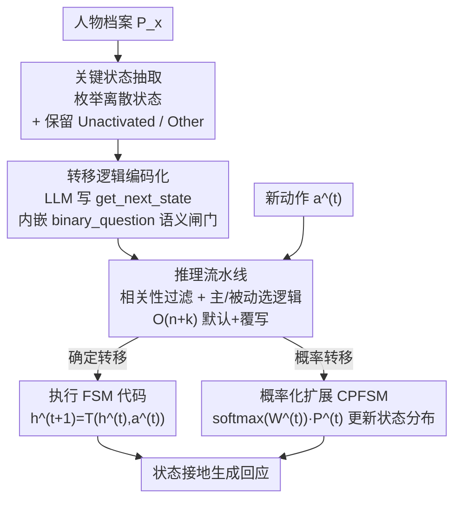

# Codified Finite-state Machines for Role-playing

**会议**: ICLR2026  
**OpenReview**: [https://openreview.net/forum?id=xSuDJTQ3Ew](https://openreview.net/forum?id=xSuDJTQ3Ew)  
**代码**: https://github.com/KomeijiForce/Codified_Finite_State_Machine （有）  
**领域**: 角色扮演 / 对话Agent  
**关键词**: 角色扮演, 有限状态机, 状态建模, LLM编码化, 概率转移

## 一句话总结
针对 LLM 角色扮演时只会模仿表层动作、记不住人物"内在状态"的问题，本文让 LLM 把人物档案自动**编译成可执行的有限状态机（CFSM）**，用代码显式记录角色状态及其转移规则，并进一步扩展成用概率分布建模状态的 CPFSM；在合成验证和 Fandom 真实剧情基准上都比纯 prompt 的状态建模基线更连贯、更可解释。

## 研究背景与动机
**领域现状**：用 LLM 做角色扮演（role-playing, RP）时，主流做法是把人物档案（性格、背景、口头禅）塞进 prompt，再让模型一句句生成符合人设的对话或动作。为了维持长程一致性，近期工作又加了记忆检索、角色卡迭代重写、剧情摘要等机制，本质都是"用自然语言文本去描述并更新角色的当前状态"。

**现有痛点**：作者指出这些 prompt-only 的方法主要捕捉的是**表层动作**，却追不住驱动交互的**隐状态（latent state）**。比如马里奥吃了蘑菇变成"超级马里奥"、吃了火花变成"火焰马里奥"——这些状态切换决定了角色后续能做什么（顶砖块、放火球），但纯 prompt 经常分不清当前到底处于哪个状态、误用转移条件、甚至凭空幻觉出不存在的转移。随着剧情变长，状态漂移和行为不连贯越来越严重。

**核心矛盾**：游戏设计里早有"有限状态机（FSM）"来刻画状态转移，它的优点是显式、确定、可调试、能把状态持久带出 LLM 的上下文窗口。但传统 FSM 靠**硬编码规则**，只在小而明确的状态空间里好用，根本扛不住角色扮演这种**开放、语义模糊**的文本世界——你没法手写枚举出"什么样的行为算'加入 SOS 团'"。于是出现了一个张力：FSM 的结构化可控 vs. 自然语言的开放灵活，二者似乎不可兼得。

**本文目标**：保留 FSM"显式状态 + 可解释转移"的强项，同时把它的刚性放松到能适配开放语义。

**切入角度**：作者观察到，每条转移约束的"合理性"其实可以从人物档案和场景里估出来——该精确的地方用确定规则，该灵活的地方留一个"语义问句"当软性闸门。关键是：**LLM 既能从档案里抽出关键状态，又能直接写出执行转移判断的代码**，因此可以把"判断条件"外包给一个嵌在代码里的 `binary_question(text, question)` 调用。

**核心 idea**：用 LLM 把文本人物档案**编码化（codify）成可执行的 FSM**——LLM 先抽关键状态，再生成一个 `get_next_state(state, scene, action)` 转移函数，函数内部用语义问句来判定条件；从而让角色逻辑既扎根于结构化、可解释的状态转移，又能适配开放语义。

## 方法详解

### 整体框架
CFSM 把角色扮演的状态建模拆成"离线编码 + 在线执行"两段。**离线阶段**：给定人物档案 $P_x$，LLM 先抽取一组离散关键状态 $H=\{h_1,\dots,h_n\}$，再把状态转移函数 $T:H\times A\to H$ 编译成一段可执行代码；这段 FSM 代码可以缓存、复用、被人审计。**在线阶段**：剧情按动作序列 $[a^{(1)},a^{(2)},\dots]$ 推进，每来一个新动作，系统就跑一遍转移函数算出下一个内部状态 $h^{(t+1)}=T(h^{(t)},a^{(t)})$，再让 RP 大模型在"当前状态 + 场景"的接地下生成回应。整套流程把状态转移和回应生成解耦，使转移本身确定、可解释、可持久。

形式化地，最基本的 RP 系统是 $r=\text{LLM}(s\mid I_g,I_x)$：全局指令 $I_g$ 编码通用扮演规范，角色指令 $I_x$ 编码人设，状态信息被写进 $I_x$ 来接地。状态以马尔可夫方式演化 $h^{(t+1)}=T(h^{(t)},a^{(t)},I_g,I_x)$，而本文的贡献就是把这个 $T$ 从"prompt LLM 生成一段状态文字"换成"执行编码化的 FSM 代码"。CPFSM 则进一步把单一活跃状态换成状态概率分布，用一个 logit 加权的转移矩阵来更新。

### 关键设计

**1. 关键状态抽取：把开放人设压成可枚举的离散状态集**

传统 FSM 卡在"得手工列出所有状态"，而开放角色的状态根本列不全。CFSM 让 LLM 直接从档案里抽：$H=\text{LLM}(P_x\mid I_{\text{extract}})$，$I_{\text{extract}}$ 是状态枚举指令。抽出的状态是语义上有意义的内部条件（如"长门有希处于未激活的社交状态""加入了文艺部""作为第三人加入 SOS 团"）。关键的两个特判：$h_1$ 固定保留为 **"Unactivated"**（同时充当初始状态 $h^{(0)}$），$h_n$ 固定保留为 **"Other"**，用来兜住所有没被显式建模到的状态。消融显示这两个兜底状态都不能删——它们专门处理"不确定 / 尚未触发"的情形，删掉就掉点。这一步把"无穷的自然语言状态空间"收敛成"有限可控的关键状态集"，是后面能写成代码的前提。

**2. 转移逻辑编码化：把人物行为逻辑编译成带语义闸门的可执行代码**

有了状态集 $H$ 和档案 $P_x$，下一步是生成转移函数 $T(h,a)=\text{LLM}(h,P_x\mid I_{\text{codify}})$。不同于硬编码规则，LLM 直接写出一段 `get_next_state(state, scene, action)`，里面用 `if/elif` 把"当前状态—动作"映射到下一个状态。最巧的是判定条件不写死成字符串匹配，而是调用一个预定义的 **`binary_question(text, question)`** ——它内部再问一次 LLM（或一个专门训练的判别器）"给定 {text}，{question}？回答 yes/no/unknown"。例如长门处于"文艺部成员"时，代码依次问"这个动作涉及加入 SOS 团吗？""涉及和阿虚互动吗？"来决定跳到哪个状态。这样**该确定的分支结构由代码保证（可调试、可审计），该灵活的语义判断交给问句**，恰好弥合了"FSM 的刚性"与"文本的模糊性"。编码一次即可缓存复用，在线时无需每步都 prompt LLM。

**3. CPFSM 概率化扩展：用状态分布和转移矩阵刻画模糊与随机**

确定性 CFSM 在"多个下一状态都说得通"时会贪心地只选一条路。CPFSM 把单一活跃状态换成**状态概率分布** $P^{(t)}=[p_1^{(t)},\dots,p_n^{(t)}]\in\Delta^{n-1}$，并用一个 logit 加权转移矩阵 $W^{(t)}\in\mathbb{R}^{n\times n}$ 来更新：每个元素 $w_{i,j}^{(t)}$ 是"在动作 $a^{(t)}$ 下从 $h_i$ 转到 $h_j$"的 logit，由对预定义转移问句 $q_{i,j}$ 取判别器输出 "True" 的对数概率得到。更新规则为

$$P^{(t+1)}=\text{softmax}(W^{(t)})\cdot P^{(t)}.$$

为了仍能兼容确定性 RP 系统，回应生成时取最可能的状态 $h_k$（$k=\arg\max_i p_i^{(t)}$）来接地。相比 CFSM，CPFSM 转移更细粒度、偏置更小，能表达"多种可能反应"的不确定性，适合更微妙或随机的扮演场景；代价是需要 logit、速度更慢、且依赖能给概率的判别器。

**4. 推理流水线与 O(n+k) 编码策略：先过滤、再选逻辑、低成本构建**

在线执行不是无脑跑转移。每来一个动作，先判断它**和角色是否相关**（防止无关或缺席事件触发误更新）；若相关，再判断角色在该动作里是**施动方（主动）还是受动方（被动）**，据此选用对应的（事先各自编码好的）转移逻辑。成本上，朴素地为每个状态对都写转移是 $O(n^2)$；本文用 **$O(n+k)$ 策略**：给全部 $n$ 个状态先赋默认转移（多半是停留原状态），只对档案里真正定义过的 $k$ 条转移做覆写。这让 FSM 构建随状态数近似线性增长，可扩展性显著优于 $O(n^2)$，同时保证常见情形有合理默认行为。

### 一个完整示例
以《凉宫春日》里的长门有希为例：**抽状态**得到 s0 未激活、s1 文艺部成员、s2 SOS 团成员、s3 与阿虚（直呼姓氏不加敬称）互动、s4 其他社交身份。**编码转移**后，当她处于 s1（文艺部成员），来了一个动作，代码依次问：①"涉及加入 SOS 团吗？"→ 是则跳 s2；②否则"涉及和阿虚互动吗？"→ 是则跳 s3；③否则"涉及文艺部之外的社交活动吗？"→ 是则跳 s4；都否则留在 s1。CFSM 走确定分支选一条；CPFSM 则把这几个问句的 "True" log 概率填进 $W$ 的对应列，softmax 后得到一个跨 {s2,s3,s4,s1} 的分布，再用最可能的状态去接地生成长门的下一句台词。整个状态轨迹显式可查，剧情推进时不会再"忘了她已经加入 SOS 团"。

## 实验关键数据

### 合成验证：LLM 真的记不住状态
作者用三个经典状态机（马里奥道具交互、使命召唤敌人反应、提利昂在维斯特洛的地图移动）各生成 10,000 条转移路径，按终止状态均衡采样测试集，路径长度从 1 增到 10。结论：**CFSM 恒为 100% 准确**，前向时间只正比于转移步数；而直接 prompt 的 GPT-4.1 / GPT-4.1-mini 随路径变长准确率明显下滑。加 chain-of-thought 能大幅提升（因为 CoT 实际上是在"模拟 FSM 运行"），但代价是约 **25×** 于 CFSM 的前向时间——这正反衬出 CFSM"又稳又快"的价值。

### 主实验（Fandom 基准，NLI Score）
Fandom 基准含 6 大作品（凉宫、K-On!、JOJO、钢炼、权游、降世神通）、83 个角色、5,141 个场景；预测用 GPT-4.1 做参考-预测的 NLI 打分（蕴含 100 / 中立 50 / 矛盾 0，人工校验三类准确率 91.0% / 89.5% / 88.0%）。RP 模型 GPT-4.1、判别器 GPT-4.1-mini：

| 方法（主角设定） | 平均 NLI |
|------|------|
| Vanilla（无档案） | 80.39 |
| Textual Profile | 81.10 |
| Codified Profile | 81.36 |
| PromptTrans | 81.23 |
| Character Updating | 81.47 |
| Plot Summary | 81.70 |
| **Codified FSM** | **82.65** |

CFSM 在全部六作品上都最高，主角平均 82.65、配角平均 84.60。一个值得注意的反例：广泛使用的摘要式状态建模 **PromptTrans 并不优于 Codified Profile**——案例分析发现它往往只是把场景里已有的表层信息重复一遍，没补出新的行为线索。

### 小模型 + 蒸馏判别器

| 方法（llama-3.2-1B 作 RP 模型） | 平均 NLI |
|------|------|
| Textual Profile | 57.16 |
| Codified Profile | 60.11 |
| **Codified FSM** | **62.77** |
| **Codified PFSM** | **63.32** |

即便 RP 模型缩到 1B，CFSM 仍大幅超过文本/编码档案基线；配上一个把 GPT-4.1-mini 蒸馏来的 0.1B deberta-v3 判别器，CPFSM 还能在 CFSM 之上再提升（蒸馏判别器设定下 CFSM 63.37 / CPFSM 64.14）。说明方法对模型规模鲁棒。

### 消融

| 配置 | 平均 NLI | 说明 |
|------|------|------|
| Codified FSM（完整） | 83.67 | —— |
| w/o State Registration | 82.58 | 总是从"未激活"转移，掉最多，状态连续性最关键 |
| w/o "Other" State | 82.92 | 去掉兜底状态掉点 |
| w/o "Unactivated" State | 83.17 | 同上 |
| w/o Identity FSMs | (略低) | 身份 FSM 提供结构支撑 |

**关键发现**：去掉**状态注册（state registration）**影响最大，印证了"把状态持续带下去"才是核心收益来源；"Other / Unactivated"兜底状态都对处理不确定情形有贡献；在多种 FSM 维度里，**性格（personality）**对动作一致性最关键，身份与能力提供结构支撑。

## 亮点与洞察
- **把"判断条件"做成可调用的语义问句**是最巧的一笔：FSM 的骨架（状态、分支）用代码锁死保证可调试，唯独把"这个动作算不算触发条件"这种模糊判断外包给 `binary_question`，等于在确定性结构里开了一扇可控的语义小窗——既不丢 FSM 的可解释，又能吃 LLM 的语义理解。
- **CoT ≈ 在脑内模拟 FSM**这个观察很有说服力：它把"为什么 CFSM 有效"讲透了——LLM 不是不会做状态转移，而是隐式做、又慢又容易漂；那不如把这套逻辑显式固化成代码，省下 25× 的推理开销还恒准。
- **编码一次、缓存复用、可人审**的工程属性，让角色逻辑从"每步都求 LLM"变成"离线编译 + 在线轻量执行"，可迁移到任何需要长程一致状态的 agent（游戏 NPC、任务型对话、剧情生成）。
- **判别器/生成器分工**（小而快的 mini 模型判条件、大模型生成回应）是个实用的成本切分思路。

## 局限与展望
- **依赖编码器质量**：转移逻辑由 LLM（默认 claude-4.0-sonnet）写出，弱编码模型可能写出不准的转移；作者发现 CPFSM 反而比 CFSM 更容易被弱编码器编出来（附录 E），但整体仍受编码能力制约。
- **CPFSM 的实用门槛**：概率转移需要判别器给 logit/对数概率，黑盒 LLM（如不暴露 logit 的）用不了；速度也比 CFSM 慢，submission 时甚至因 gpt-5 不支持 $T=0.0$ 而无法实验。
- **状态抽取的颗粒度由 LLM 决定**：抽多抽少、维度划分是否合理（性格/身份/能力）会影响效果，目前缺少对"该抽哪些 FSM 维度"的系统指导。
- **评测仍是 LLM-as-judge**：NLI 打分虽与人工校验一致性高（~88–91%），但本质仍由 GPT-4.1 评判，开放式场景评估放在附录、可能有评判偏置。

## 相关工作与启发
- **vs Codified Profile（Peng & Shang, 2025）**：同是"把档案编码成可执行代码"，但 Codified Profile 编码的是**场景→动作**（在回应生成阶段接地行为），CFSM 编码的是**状态→状态**（在状态建模阶段）。二者作用在不同环节，实验里 CFSM 把状态建模这层补上后稳定优于只做 Codified Profile。
- **vs PromptTrans / Character Updating / Plot Summary**：这三者都是"用自然语言文本描述并迭代更新状态"（状态卡重写、剧情摘要）。本文论证它们容易只复述场景表层信息、不补行为线索，而把状态换成**可执行代码 + 离散状态机**才真正带来一致性增益。
- **vs 传统硬编码 FSM**：保留显式状态与可解释转移的优点，但用 LLM 编码替代手工规则，从而能扩展到开放语义的角色扮演世界。
- **启发**：LLM-for-coding 的神经符号范式（把部分推理 offload 给代码执行）在这里被用来"写状态机"，提示了一条通用思路——凡是需要长程、可审计、可复用的状态/约束追踪，都可以考虑让 LLM 一次性编译成代码再轻量执行，而非每步 prompt。

## 评分
- 新颖性: ⭐⭐⭐⭐⭐ 把"LLM 编码化 FSM"引入角色扮演状态建模，并扩展出概率化 CPFSM，角度新颖且解释力强
- 实验充分度: ⭐⭐⭐⭐ 合成验证 + 6 作品真实基准 + 大/小模型 + 消融 + 成本分析，覆盖全面；评测主要依赖 LLM-as-judge
- 写作质量: ⭐⭐⭐⭐⭐ 用马里奥/长门等贴切例子讲清抽象机制，框架与公式清晰
- 价值: ⭐⭐⭐⭐ 给 RP/对话 agent 的长程一致性提供了可落地、可审计、可复用的状态建模范式

<!-- RELATED:START -->

## 相关论文

- [\[ACL 2025\] KokoroChat: A Japanese Psychological Counseling Dialogue Dataset Collected via Role-Playing by Trained Counselors](../../ACL2025/dialogue/kokorochat_a_japanese_psychological_counseling_dialogue.md)
- [\[ACL 2026\] ReacTOD: Bounded Neuro-Symbolic Agentic NLU for Zero-Shot Dialogue State Tracking](../../ACL2026/dialogue/reactod_bounded_neuro-symbolic_agentic_nlu_for_zero-shot_dialogue_state_tracking.md)
- [\[ACL 2025\] When Harry Meets Superman: The Role of The Interlocutor in Persona-Based Dialogue Generation](../../ACL2025/dialogue/when_harry_meets_superman_the_role_of_the_interlocutor_in_persona-based_dialogue.md)
- [\[NeurIPS 2025\] Agentic Persona Control and Task State Tracking for Realistic User Simulation](../../NeurIPS2025/dialogue/agentic_persona_control_and_task_state_tracking_for_realistic_user_simulation_in.md)
- [\[ICLR 2026\] DRIFT: Learning from Abundant User Dissatisfaction in Real-World Preference Learning](drift_learning_from_abundant_user_dissatisfaction_in_real-world_preference_learn.md)

<!-- RELATED:END -->
