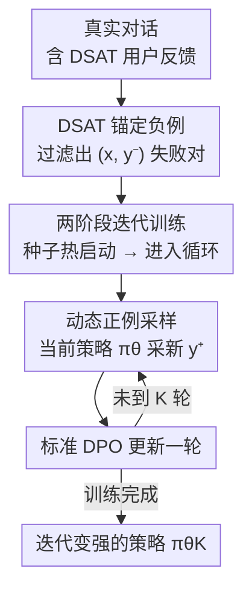

# DRIFT: Learning from Abundant User Dissatisfaction in Real-World Preference Learning

**会议**: ICLR2026  
**OpenReview**: [https://openreview.net/forum?id=sAzwmLa1Lw](https://openreview.net/forum?id=sAzwmLa1Lw)  
**代码**: https://github.com/cacayaya/DRIFT  
**领域**: 对齐RLHF  
**关键词**: 偏好学习, DPO, 隐式用户反馈, 自我改进, 梯度坍缩

## 一句话总结
DRIFT 把真实部署里大量但隐式的"用户不满"（DSAT）当作高质量负样本锚点，正样本则从当前策略动态采样，用标准 DPO 迭代训练，无需人工标注/奖励模型/更强模型生成的正例，就让 14B 模型在 WildBench 上超过 GPT-4o-mini。

## 研究背景与动机
**领域现状**：偏好学习是 LLM 后训练对齐的核心。RLHF 先训奖励模型再做 RL，DPO 则跳过奖励模型直接在偏好对上优化，更稳更省。但两者都依赖**昂贵、人工精修的偏好标注**，难以跨领域、随用户需求演化而扩展。

**现有痛点**：部署中的 LLM 系统其实每天产生海量真实交互数据，但现有方法用不上。一方面，平台靠"对比排序"或"点赞/点踩"显式收集反馈，可只有 1–3% 用户愿意给反馈，且给反馈的人往往持极端意见，不代表整体分布——显式正反馈又稀疏又有偏。另一方面，自生成式方法各有硬伤：Self-Rewarding 让模型给自己打分，但 chosen 和 rejected 同步变好、对比度持续衰减，偏好信号变弱；SPIN 把 SFT 金标准当 chosen、自生成当 rejected，可现实里金标准答案稀缺，难以推广。

**核心矛盾**：真实场景里**满意（SAT）反馈稀缺，而不满（DSAT）反馈天然丰富**——用户通过追问、纠错、反复打磨自然表达不满（WildFeedback 数据集里 DSAT 占 11.96%，SAT 仅 5.04%，前者是后者两倍多）。但已有方法都在"抢"稀缺的正例，把最丰富、最信息量大的负例信号浪费了。

**本文目标**：把"丰富但隐式"的用户反馈转化为可扩展、有效的偏好学习信号——具体就是：怎样只用 DSAT 负例，把模型迭代提升上去，同时不掉进自我改进方法常见的梯度坍缩/模式坍缩陷阱。

**切入角度**：与其把"正例少负例多"的不对称当缺陷，不如反过来利用它——真实 DSAT 反映了部署中真实的失败模式，是比人工构造负例更可靠的监督；正例则不用去抢，而是从不断变强的当前策略里动态采。

**核心 idea**：用"真实 DSAT 负例锚定 + 当前策略动态采正例"替代"固定正例 + 自生成负例"，在标准 DPO 框架里迭代训练，保住偏好间隔不衰减。

## 方法详解

### 整体框架
DRIFT（Dissatisfaction-Refined Iterative preFerence Training）的输入是真实交互中带不满信号的对话数据，输出是一个迭代变强的策略 $\pi_\theta$。整条管线只做一件简单的事：把每个训练对的**负例固定为真实 DSAT 回复**，**正例在每一轮从当前策略重新采样**，然后跑一遍标准 DPO。先用极少量"DSAT→SAT 修复"种子数据热启动得到初始对齐策略，再进入"采新正例 → DPO 更新 → 进下一轮"的迭代循环。

### 关键设计

**1. 把真实"用户不满"当作锚定负样本：用部署里的真实失败模式做监督**

针对"显式正反馈稀疏又有偏、自生成负例不可靠"的痛点，DRIFT 不再去构造或抢正例，而是把**真实 DSAT 回复直接固定为 rejected**。形式上，设 $X_\text{DSAT}\subseteq X$ 是观测到不满信号的 prompt 集合，对每个 $x\in X_\text{DSAT}$ 收集负例集合 $\text{DSAT}(x)=\{y^-:\text{用户表达了不满}\}$。这些 $y^-$ 来自 WildFeedback——它从百万级真实人机对话 WildChat-1M 里，用 SPUR（递归提示 GPT-4 学 SAT/DSAT 评分准则）自动打出每轮的满意/不满标签。

这样做有效，是因为真实 DSAT 反映的是模型在真实部署中**真的会犯的错**（如把克罗地亚货币答成已废止的库纳），比合成负例更具信息量、更贴近实际失败分布；而且 DSAT 本就比 SAT 丰富一倍多，供给充足，天然解决了"信号从哪来"的扩展性问题。和 SPIN（固定 SAT 正例 + 自生成负例）、IterDPO（两条 prompt 各生成一条再排序）相比，DRIFT 是唯一**既不需要正例、又直接利用真实用户反馈**的配置。

**2. 从当前策略动态采正样本：让正例随模型一起进化，防止梯度坍缩**

负例锚死之后，正例怎么办？DRIFT 的答案是：每一轮迭代，对同一个带 DSAT 的 prompt $x$，**用当前模型 $\pi_{\theta_k}$ 现采一条新正例 $y^+\sim\pi_{\theta_k}(\cdot\mid x)$**（prompt 里包含完整对话和一条"请改进"的显式指令）。正例随模型能力一起进化，于是 chosen 和 rejected 之间始终保持足够的对比度。优化目标就是标准 DPO 损失：

$$\mathcal{L}_\text{DPO}=-\mathbb{E}_{(x,y^+,y^-)}\Big[\log\sigma\big(\beta\log\tfrac{\pi_\theta(y^+|x)}{\pi_\text{ref}(y^+|x)}-\beta\log\tfrac{\pi_\theta(y^-|x)}{\pi_\text{ref}(y^-|x)}\big)\Big]$$

其中 $\beta$ 控制偏好间隔。这一设计是 DRIFT 跑得稳、跑得久的根本：作者从理论上证明它**维持一个不衰减的期望偏好间隔、避免梯度坍缩**。记隐式奖励间隔 $s=\beta(\log\frac{\pi^+}{\pi_\text{ref}(y^+)}-\log\frac{\pi^-}{\pi_\text{ref}(y^-)})$，则 $\nabla_\theta\ell=-\beta\,\sigma(-s)\,d_\theta$，其中 $d_\theta=\nabla\ln\pi_\theta(y^+|x)-\nabla\ln\pi_\theta(y^-|x)$。引理 1 证明：只要有非可忽略比例的样本满足 $\sigma(-s)\ge\tau$ 且条件梯度差 $\mathbb{E}[\|d_\theta\|\mid E]>0$，就有 $\mathbb{E}\|\nabla_\theta\ell\|\ge\beta\tau p_0\Delta_\text{cond}>0$——训练信号不会归零。相比之下，SPIN 拟合固定 SAT 集合，容易过拟合到一个次优小子集而梯度坍缩；Self-Rewarding 里 chosen/rejected 同步变好、对比度衰减，也会信号变弱。

**3. 两阶段迭代训练：种子热启动 + 逐轮单 epoch DPO**

DRIFT 的训练分两段。**热启动**：先在 491 条"回复经修订后从 DSAT 转 SAT"的种子偏好对（仅占 0.55%）上训练，得到一个初始对齐策略，给后续迭代一个好的起点。**迭代偏好训练**：之后每一轮都重新构造偏好对（负例固定为 DSAT，正例现采），然后**只跑一个 epoch 的 DPO** 再进下一轮——单 epoch 是刻意为之，防止迭代训练中过拟合。理论上定理 1 进一步保证：在 LJ-光滑假设下，每个 DPO 步以 $\beta\tau p_\text{imp}\lambda$ 的线性增量提升真实效用 $J$（直到 $O(\eta^2)$ 项），即迭代是单调改善的。这解释了为什么 DRIFT 能持续提升到 iter4 再进入平台期，而不是像基线那样 iter1 见顶随即衰退。

## 实验关键数据

### 主实验
模型用 Qwen2.5-7B-Instruct / 14B-Instruct，在真实数据集 WildFeedback 和合成数据集 UltraFeedback 上对比 SPIN、IterDPO。评测基准为 WildBench（Elo / Task Score）和 AlpacaEval2（Win / 长度控制 LC win rate）。

WildFeedback（真实数据，Full 设定用全部约 11k DSAT，取 iter2）：

| 数据集/模型 | 指标 | Base | SPIN(最佳) | IterDPO(最佳) | DRIFT |
|--------|------|------|------|------|------|
| WildFeedback 7B | WildBench Score | 48.66 | 42.86 | 46.31 | **51.69** |
| WildFeedback 14B | WildBench Score | 55.08 | 47.16 | 52.34 | **58.30** |
| WildFeedback 7B | AlpacaEval2 Win | 37.69 | 26.21 | 41.55 | **46.64** |
| WildFeedback 14B | AlpacaEval2 Win | 36.65 | 25.53 | 48.32 | **48.63** |

UltraFeedback（合成数据，取最佳轮）：

| 模型 | 指标 | Base | DRIFT | 相对提升 |
|------|------|------|------|------|
| 7B | WildBench Score | 48.66 | 50.91 | +4.62% |
| 14B | WildBench Score | 55.08 | 59.27 | +7.61% |
| 14B | AlpacaEval2 Win | 36.65 | 48.94 | +12.29% |

亮点：DRIFT 在所有指标、两种数据设定下都稳定超过 SPIN 和 IterDPO；其 Controlled 设定（仅 4k 样本）已能追平甚至超过 IterDPO 的 Full 设定；14B 提升幅度更大，说明方法对大模型更友好、利于 scale up；**14B 模型在 WildBench 上超过 GPT-4o-mini**。

### 消融实验
- **长程稳定性（5 轮，Qwen2.5-7B）**：SPIN 和 IterDPO 都在 iter1 见顶随后退化（SPIN 跌到 33.99，最严重）；DRIFT 持续提升到 iter4（52.47）后形成稳定平台（iter5 仍 51.22），验证其抗模式坍缩。
- **去引导消融（Unguided）**：把 DRIFT/IterDPO 改成只用原始 prompt 生成（对齐 SPIN 配置），DRIFT 仍稳定强于两个基线，且去引导版与完整版差距很小——说明增益来自"DSAT 负例锚定 + 策略动态采正例"的设计原理，而非引导提示/参考点。
- **探索能力分析**：用 UMAP + 奖励加权 KDE 构造"语义奖励地形"，度量各方法在全局高奖励区的覆盖份额。DRIFT 在 7B/14B 上都取得最大覆盖（14B 优势更大），即它在拿到高奖励的同时覆盖了更广的高奖励语义区域，而 SPIN/IterDPO 把输出挤在一小块子空间里。

## 亮点与洞察
- **视角反转**：把"正例稀缺、负例丰富"的数据不对称从缺陷变成资产——核心洞见是真实 DSAT 既丰富又贴近真实失败模式，是被严重低估的监督信号。
- **极简却有理论支撑**：方法本身就是"固定真实负例 + 动态采正例 + 标准 DPO"，没有新损失、没有奖励模型，但配了非平凡的理论（非衰减梯度下界 + 期望效用单调改善），解释了为什么不坍缩。
- **正例动态化是稳定性的关键**：让正例随策略进化，从机制上避免了 chosen/rejected 对比度衰减，这是 DRIFT 能长程迭代不退化的根因，也点出了 SPIN/Self-Rewarding 退化的本质。

## 局限性 / 可改进方向
- **依赖 DSAT 标注质量**：DSAT 信号靠 SPUR/GPT-4 自动打标得到，标注噪声或评分偏差会直接污染负例锚点；不同平台、不同满意度估计器下的鲁棒性未充分检验。
- **正例无质量校验**：从当前策略采的正例并未经任何质量过滤或验证，若早期模型较弱，"现采正例"可能本身质量不高，理论保证依赖"改进事件以正概率成立"的假设。
- **平台期天花板**：迭代到 iter4 后进入平台，缺乏继续突破的机制（如难度课程、负例多样性调度）。
- **仅在 Qwen2.5 7B/14B 上验证**：跨模型族、更大规模、多语言/多任务部署场景的可迁移性仍待考察。

## 相关工作与启发
- **从真实用户反馈学习**：相比 WildFeedback（GPT-4 识别不满、生成改进答案当 chosen）、Tan 等（抽读者中心问题 + 奖励模型排序）等需要更强模型/奖励模型构造正例的路线，DRIFT 不需要任何外部正例来源，只靠真实 DSAT + 策略自采。
- **自我改进与迭代 DPO**：SPIN（前轮当对手、SFT 当 chosen）、IterDPO、Self-Rewarding 及其变体（Temporal Self-Rewarding 用过去-未来锚定解耦、CREAM 用一致性正则稳信号）都在和"对比度衰减/模式坍缩"作斗争；DRIFT 用"真实负例锚定 + 新鲜正例"从数据侧天然规避了这个问题。
- **启发**：当某类监督信号（这里是负反馈）在真实分布里远比另一类丰富时，重新设计训练目标去"吃"丰富那侧、把稀缺侧交给模型自生成，可能比硬补稀缺侧更可扩展——这一思路可迁移到其他"正负不对称"的对齐/检索/推荐场景。

## 评分
- 新颖性: 4/5（视角反转 + 极简方法 + 理论支撑，但单元件都不新）
- 实验充分度: 4/5（真实+合成双数据、5 轮长程、探索性分析、去引导消融都到位）
- 写作质量: 4/5（动机清晰、图文与理论衔接好）
- 价值: 4/5（直接利用部署侧最丰富信号，工程落地价值高）

<!-- RELATED:START -->

## 相关论文

- [\[ACL 2026\] Preference Learning Unlocks LLMs' Psycho-Counseling Skills](../../ACL2026/dialogue/preference_learning_unlocks_llms_psycho-counseling_skills.md)
- [\[ACL 2026\] Template-assisted Contrastive Learning of Task-oriented Dialogue Sentence Embeddings](../../ACL2026/dialogue/template-assisted_contrastive_learning_of_task-oriented_dialogue_sentence_embedd.md)
- [\[ACL 2026\] Dual Hierarchical Dialogue Policy Learning for Legal Inquisitive Conversational Agents](../../ACL2026/dialogue/dual_hierarchical_dialogue_policy_learning_for_legal_inquisitive_conversational_.md)
- [\[ICLR 2026\] Non-Collaborative User Simulators for Tool Agents](non-collaborative_user_simulators_for_tool_agents.md)
- [\[ICLR 2026\] Flipping the Dialogue: Training and Evaluating User Language Models](flipping_the_dialogue_training_and_evaluating_user_language_models.md)

<!-- RELATED:END -->
