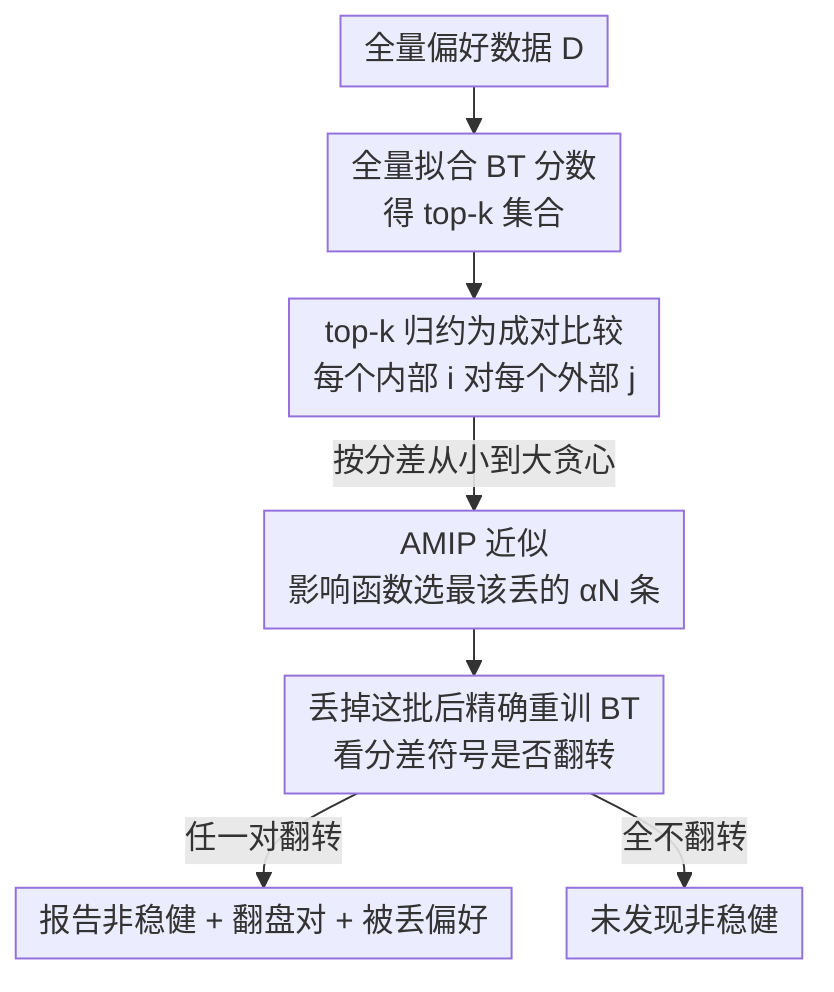

# Dropping Just a Handful of Preferences Can Change Top Large Language Model Rankings

**会议**: ICLR2026  
**OpenReview**: [https://openreview.net/forum?id=jNiEMDsRgc](https://openreview.net/forum?id=jNiEMDsRgc)  
**代码**: 待确认  
**领域**: LLM评测 / 排行榜稳健性 / Bradley–Terry  
**关键词**: 排行榜稳健性, 数据丢弃, Bradley–Terry, 影响函数, Chatbot Arena

## 一句话总结
本文提出一个计算极快的稳健性检验：在 Chatbot Arena 这类基于 Bradley–Terry 模型的 LLM 排行榜上，只要丢掉**最坏情况**下极小一撮（最少 0.003%、两条）人类偏好评测，就能让排名第一的模型换人——并且方法还能精确指出是哪几条偏好导致了翻盘。

## 研究背景与动机
**领域现状**：Chatbot Arena 及其衍生平台（Search/Webdev/Vision Arena、MT-bench 等）已经成为评估顶级 LLM 的"事实标准"。它们的运作方式是：用户给同一个 prompt 让两个模型作答、投票选出更好的一方（或平局），再用 **Bradley–Terry（BT）模型**把这些成对胜负聚合成每个模型的分数与排名。这套打分还被复用到 RLHF 奖励模型训练、查询路由等关键环节。

**现有痛点**：已有一批工作质疑排行榜的可信度，但它们关注的都是**对抗攻击**——注入几百条伪造投票能改变榜首（Min et al. 2025）、攻击者能识别模型输出并定向刷票（Huang et al. 2025b）、LLM-as-a-judge 容易被钻空子、数据泄露与选择性上报等等。这些都假设有**恶意意图**，且发生在数据采集阶段。

**核心矛盾**：人们默认大规模众包"以量取胜"——海量 prompt 和投票会把个体噪声平均掉，得到一个可泛化的稳定信号。但这个"稳定"从没被系统地检验过：如果排名其实建立在极少数评测之上，那它就既不稳定也不可泛化。

**本文目标**：在**数据分析阶段**（数据已采集完，可能本就含有恶意或敷衍用户）、**不需要任何对抗意图**的前提下，回答一个问题——"丢掉极小一撮人类（或 AI）偏好，榜首/前 k 名会不会变？"并且要能**精确定位**是哪些偏好驱动了翻盘。

**切入角度**：暴力枚举所有"小比例子集"在 Chatbot Arena 这种 5 万+ 评测的规模上组合爆炸、不可行。作者转向统计学与理论计算机近年的一条线——**数据丢弃稳健性（data-dropping robustness）**，尤其是 Broderick et al. (2020) 的 **AMIP（Approximate Maximum Influence Perturbation）**，用一阶 Taylor 展开近似"丢掉最坏子集会让某统计量变多少"，从而绕开组合搜索。

**核心 idea**：把 BT 排名问题归约成一系列**成对比较**的符号稳健性，用 AMIP 近似挑出最有影响力的那批偏好作为候选，丢掉后**精确重训** BT 模型验证排名是否真的翻转——既快又给出"确定性"结论。

## 方法详解

### 整体框架
方法要解决的问题是：给定一个装满成对偏好的 arena 数据集 $D$、一个名次 $k$、一个丢弃比例 $\alpha$，判断"丢掉至多 $\alpha N$ 条评测能否改变 top-$k$ 集合"，并在能改变时指出是哪些评测。整体转法分三步走：先把 **top-$k$ 稳健性归约成成对稳健性**，再用 **AMIP 近似**快速锁定每对模型最该丢的那批数据，最后**精确重训**做确定性验证。

输入是 $N$ 条形如 $(i_n, j_n, y_n)$ 的成对偏好（$y_n\in\{W,L,T\}$ 表示胜/负/平），输出是"是否找到 top-$k$ 非稳健"以及（若找到）翻盘的模型对 $(i,j)$、丢弃前后的分差、以及被丢弃的具体偏好集合 $\mathcal{I}$。

### 关键设计

**1. top-$k$ 稳健性归约成成对符号检验：把组合爆炸问题拆成可逐对验证的小问题**

直接验证 Definition 3（"不存在任何 $\alpha$-子集能改变 top-$k$ 集合"）需要枚举所有小比例子集，不可行。作者证明（Proposition B.1）：top-$k$ 集合的稳定性，等价于**所有"内部模型 vs 外部模型"对**的相对顺序都不翻转。也就是说，设 $\mathcal{K}_{\mathcal{T}}$ 是 top-$k$ 集合，只需对每个 $i\in\mathcal{K}_{\mathcal{T}}$、$j\notin\mathcal{K}_{\mathcal{T}}$ 检查这一对是否"成对稳健"。一对 $(i,j)$ 称为 $\alpha$-级**成对稳健**，当且仅当不存在丢弃方案 $w\in\mathcal{W}_\alpha$ 使分数符号翻转：$\{w\in\mathcal{W}_\alpha : \hat\theta_i(w) < \hat\theta_j(w)\}=\varnothing$。这一步把"判断整个 top-$k$ 集合"压成"最多 $k(M-k)$ 个成对符号问题"，每个都能独立、高效地检验——这是整套方法可计算的根基。

这里 $\mathcal{W}_\alpha := \{w\in\{0,1\}^N : \sum_n (1-w_n)\le \alpha N\}$ 是所有"丢弃至多 $\alpha N$ 条"的 0/1 权重向量集合；$w=\mathbf{1}_N$ 对应全量，$w_n=0$ 对应丢掉第 $n$ 条。

**2. AMIP 影响函数近似：用一阶 Taylor 把"丢哪批最致命"从组合搜索变成排序**

对某一对 $(i,j)$（不失一般性设全量上 $\hat\theta_i(\mathbf{1}_N)-\hat\theta_j(\mathbf{1}_N)>0$），最坏情况丢弃就是求解

$$\max_{w\in\mathcal{W}_\alpha}\Big[\hat\theta_i(\mathbf{1}_N)-\hat\theta_j(\mathbf{1}_N)\Big]-\Big[\hat\theta_i(w)-\hat\theta_j(w)\Big].$$

直接解这个离散优化仍然组合爆炸。AMIP 的做法是：把权重 $w$ 松弛成连续值，对 $\hat\theta_i(w)-\hat\theta_j(w)$ 在 $\mathbf{1}_N$ 处做**一阶 Taylor 展开**——这就是经典的**影响函数（influence function）**。BT 模型可写成 logistic 回归，于是每条数据点 $n$ 对某个模型分数 $\hat\theta$ 的影响 $\mathrm{IF}_n$ 有显式公式（Pregibon 1981 的一步 Newton 分数）。对每条偏好计算它对这一对的净影响 $\Delta_n(i,j)=\mathrm{IF}_n(i)-\mathrm{IF}_n(j)$，然后**直接挑出在负方向上最大的 $\lfloor\alpha N\rfloor$ 个**——它们就是最该丢的候选集合 $\mathcal{I}$。组合搜索就此退化成一次排序，这是"3 分钟跑完 5 万条评测"的关键。

**3. 近似选点 + 精确重训：让"非稳健"结论是确定性的，而不是近似的**

AMIP 只用来**挑候选**，不用来下结论。挑出 $\mathcal{I}$ 后，作者把这批偏好真正从数据里删掉、**精确重新拟合** BT 模型，得到 $\hat\theta_i(\tilde w)-\hat\theta_j(\tilde w)$，看符号是否真的从正翻负。只有真翻了才判为非稳健。作者强调：本文报告的所有非稳健都是**确定性（definitive）**的——"丢掉 $100\alpha\%$ 偏好改变排名"是经过精确重算验证过的事实，而非近似估计。代价是可能有**假阴性**（漏报）：AMIP 没找到能翻盘的子集不代表一定不存在，所以"未发现非稳健"是个保守结论。这种"近似加速搜索、精确兜底验证"的组合，让结论既快又可信。

**4. 贪心早停按分差排序：只要找到一对翻盘就够，优先查最脆弱的对**

由于"找到任意一对非稳健即可判定整个 top-$k$ 非稳健"，不必检查全部 $k(M-k)$ 对。作者用全量上的 BT 分差 $|\hat\theta_i(\mathbf{1}_N)-\hat\theta_j(\mathbf{1}_N)|$ 衡量"接近度"，**按分差从小到大**排序逐对检验——分差越小的对越容易翻盘（论文图 18 验证了这一相关性）。一旦发现某对 $\alpha$-级成对非稳健，立即早停并返回该对与被丢偏好索引。注意检验某对 $(i,j)$ 时**允许丢任意两个模型之间的对局**（不限于 $(i,j)$ 自己的对局），因为别的模型胜负也会通过 BT 的全局耦合影响这两者的分数。

### 损失函数 / 训练策略
BT 分数本身由（加权）极大似然拟合：$\hat\theta=\arg\max_\theta \sum_n [w_{WL}\,\mathbb{I}_{y_n=W}\log\sigma(\theta_{i_n}-\theta_{j_n}) + w_{WL}\,\mathbb{I}_{y_n=L}\log(1-\sigma(\cdot)) + w_T\,\mathbb{I}_{y_n=T}\{\log\sigma(\cdot)+\log(1-\sigma(\cdot))\}]$，其中 $\sigma$ 是 sigmoid。Chatbot Arena 用 $w_{WL}=2, w_T=1$ 把平局当作"一胜一负"来处理，并把分数仿射变换成 ELO 显示。作者指出该仿射变换严格单调、不改排名，也能与一阶 Taylor 展开交换，故不影响方法。

## 实验关键数据

### 主实验：各 arena 的 top-1 稳健性
对每个 arena 检验"翻转第一、二名最少需要丢多少条偏好"，按稳健性升序：

| Arena | 评判方 | 翻转榜首所需丢弃数 | 占比 |
|--------|------|------|------|
| Chatbot Arena | 人类 | 2 / 57477 | 0.0035% |
| Vision Arena | 人类 | 28 / 29845 | 0.094% |
| NBA Games | — | 17 / 109892 | 0.016% |
| Chatbot Arena | LLM | 9 / 49938 | 0.018% |
| Webdev Arena | 人类 | 18 / 10501 | 0.171% |
| Search Arena | 人类 | 61 / 24469 | 0.253% |
| MT-bench | LLM | 40 / 2400 | 1.67% |
| ATP Tennis | — | 6 / 278 | 2.16% |
| MT-bench | 人类 | 92 / 3355 | 2.74% |

只有 MT-bench 在 $\alpha=1\%$ 水平下稳健。作者归因于 MT-bench 用 80 道精心设计的多轮题、由专家标注，而其余平台都是大规模众包、prompt 与判断质量参差。

### 对照：最坏情况 vs 随机丢弃
关键对照实验（附录 Table 3）：把"丢弃"改成**均匀随机**丢 1%，100 次试验里榜首被改变的比例几乎都是 0（多数 arena 100 次都不变，Chatbot Arena 人类版也有 0.77 保持稳健，$\alpha=0.1\%$ 时升到 0.97）。

| 丢弃方式 | Chatbot Arena 榜首翻转 |
|------|------|
| 最坏情况（本文 AMIP） | 丢 2 条（0.003%）即翻 |
| 均匀随机丢 1% | 100 次里仅 23 次翻（0.77 稳健） |

这说明脆弱性来自**最坏情况**的少数关键偏好，而非随机噪声——也正是本文方法的价值所在。

### 关键发现
- **人类 vs LLM 评判没有系统性差异**：在同时有人类与 LLM 标注的 arena 里，两者谁更敏感不一致（Chatbot Arena 人类略敏感，MT-bench 反而 LLM 更敏感），无法断言哪种更脆弱。
- **不能归因于样本量小**：翻盘的 GPT-4-1106-preview 恰恰参与了全场最多对局，GPT-4-0125-preview 对局数也不少。脆弱性不是"小样本"造成的。
- **被丢偏好是"异常局"**：在 Chatbot Arena 上，让榜首翻盘的两条偏好，是强判官模型（GPT-5.1）判定为"非典型"的——GPT-4-1106-preview 在这两局里输给了排名第 43 的 Vicuna-13b 和第 45 的 Stripedhyena-nous-7b。丢掉这两次反常的失利就把它从第二抬到第一。
- **脆弱性与分差相关**：BT 分差越小的相邻名次越容易翻盘（附录 F.1）。
- **runtime 极快**：5 万条评测上检验 top-1 与 top-5 稳健性，在 Apple M1 Pro 个人电脑上 3 分钟内完成。

## 亮点与洞察
- **把"分析阶段的非对抗脆弱性"单独拎出来**：以往攻击榜单的工作都假设恶意注入；本文证明即便没有任何攻击者，仅仅是"换一批同样合法的标注者/少删几条"，榜首就会变——这是对"榜单可信度"更釜底抽薪的质疑。
- **近似搜索 + 精确验证的工程取舍很漂亮**：用影响函数把组合爆炸压成排序拿到候选，再用精确重训保证结论确定性，既要了速度又没牺牲严谨——这套"approximate-then-verify"范式可迁移到任何"丢数据看结论翻不翻"的稳健性审计。
- **最坏 vs 随机的对照点醒了人**：随机丢 1% 几乎不动榜首，但最坏情况丢 0.003% 就翻——这恰好说明 BT 聚合并没有像直觉那样"把噪声平均掉"，少数高杠杆偏好主导了顶部名次。
- **可解释的副产品**：方法不止给出"翻不翻"，还能点名具体哪条 prompt-response 对负责，便于人工审查这些可疑/异常评测，对榜单维护者很实用。
- **可迁移**：BT 模型也用于 RLHF 奖励建模与查询路由，这套稳健性检验天然能搬过去审计奖励模型对少数偏好的依赖。

## 局限与展望
- **只能给出确定性的"非稳健"，不能给出确定性的"稳健"**：AMIP 是近似选点，存在假阴性。"未发现非稳健"只是没找到，不等于真稳健，可能漏掉更刁钻的子集。
- **依赖 BT/logistic 这一族模型的可微结构**：影响函数近似建立在一阶 Taylor 与 logistic 形式上；换成非 BT 的排名机制（如纯 Borda/MWR）需要另立公式。
- **"最坏情况"框架的解读需谨慎**：丢 0.003% 是最坏情况而非典型情况，作者也强调随机丢弃下榜单相当稳。把它解读成"榜单完全不可信"会过度。
- **改进建议偏设计层面**：作者给出的三条建议（收集更丰富反馈如置信度、设计更具区分度的 prompt、提升标注质量）方向正确但都较粗，缺少可量化的落地方案。

## 相关工作与启发
- **vs 投票操纵类攻击（Min et al. 2025; Huang et al. 2025b）**：他们在**采集阶段**注入数百条对抗投票来改排名；本文在**分析阶段**不增不改、只删极少数合法投票（0.003% vs 他们的几百条），且无需对抗意图，揭示的是更内生的脆弱性。
- **vs Zhao et al. (2025)**：他们做的是针对三个测试模型的 case study，发现替换 10% 投票为随机标签会移动名次；本文不改投票、而是系统化地证明删 0.003% 即可翻盘，并能定位具体驱动偏好。
- **vs Perlitz et al. (2024)**：他们指出基于 Mean Win Rate 的绝对分排名可被"刷一堆略弱模型"操纵；本文聚焦成对偏好的 BT 排名，并把分析从 Chatbot Arena 扩展到视觉/网页/搜索/多轮对话多个平台。
- **vs Shiffman et al. (2023)**：据作者所知唯一一个把数据丢弃稳健性用于排名的前作，但它分析的是基因富集分析里 p 值的排名；本文把 AMIP 扩展到 BT 偏好排名这一全新场景。

## 评分
- 新颖性: ⭐⭐⭐⭐⭐ 首次把数据丢弃稳健性框架引入 LLM 偏好排行榜，揭示"非对抗、分析阶段"的新型脆弱性
- 实验充分度: ⭐⭐⭐⭐ 覆盖 5 个 LLM arena + 2 个体育数据集、含最坏 vs 随机对照与可解释定位，但稳健侧无确定性保证
- 写作质量: ⭐⭐⭐⭐⭐ 问题定义清晰、归约逻辑严谨、伪代码与公式完整
- 价值: ⭐⭐⭐⭐⭐ 方法快、易用、可即插即用审计任何 BT 榜单，对评测可信度社区有直接现实意义

<!-- RELATED:START -->

## 相关论文

- [\[ICML 2025\] Position: Uncertainty Quantification Needs Reassessment for Large-language Model Agents](../../ICML2025/dialogue/position_uncertainty_quantification_needs_reassessment_for_large-language_model_.md)
- [\[ACL 2025\] UniConv: Unifying Retrieval and Response Generation for Large Language Models in Conversations](../../ACL2025/dialogue/uniconv_retrieval_response_gen.md)
- [\[ICLR 2026\] Flipping the Dialogue: Training and Evaluating User Language Models](flipping_the_dialogue_training_and_evaluating_user_language_models.md)
- [\[ICLR 2026\] Understanding Language Prior of LVLMs by Contrasting Chain-of-Embedding](understanding_language_prior_of_lvlms_by_contrasting_chain-of-embedding.md)
- [\[ACL 2025\] Sparse Rewards Can Self-Train Dialogue Agents](../../ACL2025/dialogue/sparse_rewards_can_self-train_dialogue_agents.md)

<!-- RELATED:END -->
