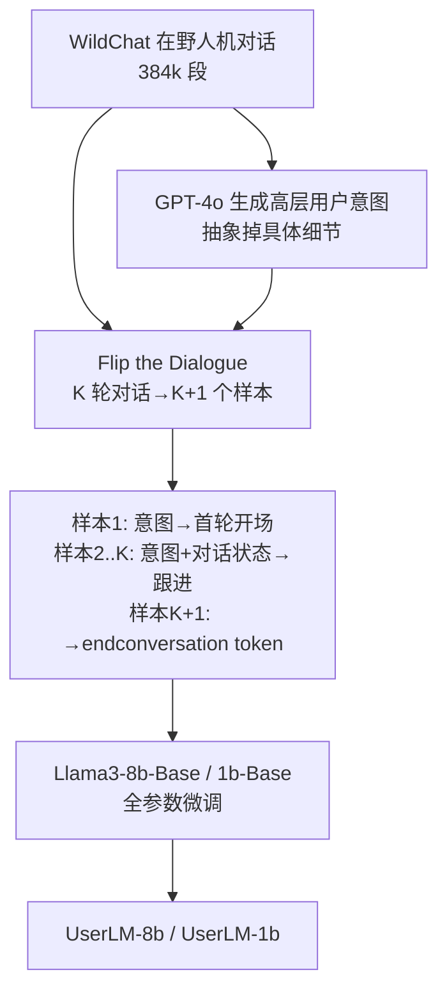

# Flipping the Dialogue: Training and Evaluating User Language Models

**会议**: ICLR 2026  
**OpenReview**: [https://openreview.net/forum?id=ykSmkVqzn4](https://openreview.net/forum?id=ykSmkVqzn4)  
**代码/模型**: [microsoft/UserLM-8b](https://huggingface.co/microsoft/UserLM-8b)  
**领域**: 对话系统 / 用户模拟 / LLM 评测  
**关键词**: User Language Model, 用户模拟器, 多轮对话, 助手评测, WildChat  

## 一句话总结
把对话"翻转"过来——不再训练 LLM 当好助手，而是专门后训练一个**用户语言模型（User LM）**去模拟真实人类用户，用它在多轮对话里逼出助手 LM 在真实场景下的短板（GPT-4o 任务成功率从 74.6% 掉到 57.4%）。

## 研究背景与动机
- **领域现状**：多轮交互式评测正成为评判助手 LLM 的重要方式。静态 benchmark 分数再高，部署到真实多轮对话里也常常露怯，于是大量工作用"模拟用户"来做交互式评测。
- **现有痛点**：主流做法是直接 prompt 一个助手 LM 让它"扮演用户"（"You are a user chatting with an AI assistant…"）。但助手 LM 是被后训练成**完美助手**的——回答详尽、结构清晰、无歧义无语病。而真实用户恰恰相反：很少一上来就把完整意图讲清楚，往往逐轮挤牙膏式透露需求，措辞随意、偶有错别字、想到哪说到哪，而且会主动结束对话。
- **核心矛盾**：论文给出一个反直觉的发现——**助手越强，模拟用户越差**。Llama3-8b-Instruct 在用户语言建模上 PPL 反而比 1b 更差；GPT-4o 也在若干指标上不如 GPT-4o-mini。因为"助手性"已经刻进模型骨子里：它们几乎从不结束对话、过度配合、容易被带偏，这会**系统性高估**被测助手的真实能力。
- **本文目标**：造一个专门的、可被"意图"引导的用户模拟器，让它既能被定向到具体任务（解数学题、写 Python），又能复现真实用户的多轮行为，从而给出更可信的助手评测。
- **核心 idea**：**「Flip the Dialogue」** —— 拿真实人机对话数据，把对话角色翻转过来，让模型去建模**用户话语的条件分布**（首轮以高层意图为条件，后续轮以意图+对话状态为条件），从而把"base 模型"后训练成与"助手 LM"对立的"用户 LM"。

## 方法详解

### 整体框架
方法分三步把现成的真实对话数据变成训练一个 User LM 的语料：先从 WildChat 在野对话里**为每段对话生成一个高层用户意图**，再把对话"翻转"——一段 K 轮对话拆成 K+1 个训练样本（首轮生成开场白、中间轮根据助手回复跟进、末轮生成结束信号），最后在 Llama3 **base** 模型上做全参数微调，让模型学会"在给定意图与对话状态下，下一句用户该说什么"。训练目标只覆盖用户话语，助手话语作为上下文条件。

### 关键设计

**1. 意图粒度的"中庸之道"：用高层意图而非完整脚本来引导用户。** 训练用户 LM 必须给它一个"意图"来导向对话，类比助手 LM 要 follow instruction。但作者发现意图的详略有一条窄缝：完全不给意图，模拟器没法被定向到想研究的任务，可用性归零；给一个把所有用户话都写死的"全规格意图"，模拟器就退化成照本宣科地复述意图、毫无价值。本文把意图定义为**高层对话目标**（只描述用户大致想干什么，不含具体措辞细节），由 GPT-4o 用 few-shot（3 个手工示例）对整段对话历史做摘要生成。消融显示：相比不给意图或给全规格意图，用高层意图训练出的模型更实用——既能被引导去模拟特定任务，又自己掌控语言选择，产出多样且真实的对话。

**2. 学会闭嘴：用特殊 token 建模"主动结束对话"。** 真实用户在拿到想要的信息或完成任务后会自然停下，且通常不给助手任何显式反馈就离开。这是助手 LM 几乎学不会的行为（它们倾向于无止境地聊下去）。本文给 tokenizer 加了一个特殊的 `<|endconversation|>` token，在每段对话的最后一个助手轮之后，把它作为要生成的输出来训练。这样用户 LM 就具备了"判断对话该不该结束"的能力——评测里把它当二分类用 F1 衡量，UserLM-8b 拿到 63.5，而 prompt 的助手只有 3–15。

**3. 翻转构造样本：一段对话榨出 K+1 个条件建模样本。** 给定一段 K 轮的真实对话，翻转后构造 K+1 个训练样本：第 1 个样本以"高层意图"为条件生成首轮用户开场；第 2 到 K 个样本以"意图 + 截至当前的对话状态（含历史用户话与助手回复）"为条件生成下一句用户跟进；第 K+1 个样本生成结束 token。形式上，模型学的是用户话语在意图 $I$ 与对话状态 $s_{<t}$ 下的条件分布 $P_\theta(u_t \mid I, s_{<t})$。这种构造让一段 3 轮对话就能产出 4 个样本，384k 段 WildChat 对话最终扩成约 105 万条训练样本。

**4. 从 base 而非 instruct 起步：用户角色与助手角色是 base 模型的两个对立分支。** 作者对比了从 Llama3-base 与从 instruct-checkpoint 起训：base 起步 PPL 显著更低（8b 在 PRISM 上 7.42 vs instruct 起步 27.25，差近 20 个点）。原因是 instruct 模型已被合成数据训成"帮手"，在语义分布上离真实用户很远；而 base 模型训练在大量自然文本（多为人写）上，天然更贴近真实用户分布。由此提炼出一个高层观察：**base 预训练模型是中性的通用底座，可被后训练成用户、助手这两个截然相反的角色。**

## 实验关键数据

### 主实验：分布对齐（PPL，越低越好）
在 WildChat 测试集（17,943 段）与域外 PRISM 数据集（8,011 段）上测困惑度，每个数据集分"不给意图条件"与"给意图条件"两列：

| 模型 | WildChat (无意图) | WildChat (意图) | PRISM (无意图) | PRISM (意图) |
|------|:---:|:---:|:---:|:---:|
| Llama3.2-1b-Base | 37.68 | 29.09 | 84.00 | 53.54 |
| Llama3-8b-Base | 98.29 | 48.13 | 89.98 | 40.86 |
| Llama3.2-1b-Instruct | 26.08 | 16.08 | 35.02 | 20.80 |
| Llama3-8b-Instruct | 26.19 | 21.40 | 40.25 | 36.29 |
| USP-8b | 32.08 | 21.78 | 50.91 | 30.16 |
| **UserLM-1b** | 8.30 | 7.78 | 18.58 | 10.33 |
| **UserLM-8b** | **5.60** | **4.33** | **14.92** | **7.42** |

UserLM-8b 的 PPL 比所有 baseline 低 60–70%；意图条件对所有模型都带来增益；PRISM 作为域外集 PPL 普遍更高但趋势一致，验证了泛化性。

### 主实验：与人类行为的细粒度对齐（Table 2）
六项内在指标，分多轮交互（首轮多样性↑ / 意图分解↓ / 对话结束 F1↑）与模拟鲁棒性（自然度↑ / 角色坚守↑ / 意图坚守↑）：

| 模拟器 | 首轮多样性↑ | 意图分解↓ | 结束F1↑ | 自然度↑ | 角色坚守↑ | 意图坚守↑ |
|------|:---:|:---:|:---:|:---:|:---:|:---:|
| Llama3.2-1b-Instruct | 81.36 | 15.72 | 3.47 | 0.14 | 77.55 | 54.95 |
| Llama3-8b-Instruct | 81.31 | 23.95 | 3.51 | 0.20 | 63.25 | 78.05 |
| GPT-4o-mini | 66.10 | 9.66 | 15.31 | 0.04 | 80.20 | 88.70 |
| GPT-4o | 74.42 | 7.68 | 1.38 | 3.31 | 38.85 | 70.95 |
| USP-8b | 94.37 | 6.33 | 21.31 | 77.73 | 98.05 | 97.55 |
| **UserLM-8b** | **94.55** | **2.69** | **63.54** | **80.21** | 93.95 | 94.65 |
| Human (参考) | 94.01 | 1.68 | — | 90.15 | — | — |

UserLM-8b 在首轮多样性（94.55，几乎追平人类 94.01）、意图分解（2.69，接近人类 1.68）、对话结束（63.54 碾压 prompt 助手的个位数）上全面贴近人类。AI 检测器（Pangram）给 prompt 助手的话语判 0–3% 像人类，给 UserLM 判 77–81%——说明用户话语与助手话语是两个不同分布，prompt 改不动助手的生成分布。

### 消融实验

| 消融维度 | 结论 |
|------|------|
| 训练时是否给意图（PRISM, UserLM-8b PPL） | 给意图训练 7.42 vs 不给 8.40；训练时带意图让模型对意图更敏感、更可引导 |
| 起始 checkpoint（PRISM PPL） | base 起步 1b=18.45 / 8b=7.42，远优于 instruct 起步 1b=27.25 |
| 模型规模 | UserLM 8b 在全部 6 项指标上都胜过 1b；而 prompt 助手放大规模几乎无改善（8b 仅 1/6 项胜 1b） |

### 关键发现：下游助手评测（Table 3）
用 65 个意图（GSM8k 数学 + HumanEval 编程）让模拟器与 GPT-4o 助手对话，每意图模拟 10 次（共 650 次）：

| 指标 | GPT-4o-mini | GPT-4o | UserLM-8b |
|------|:---:|:---:|:---:|
| 意图覆盖率(%) | 86.6 | 84.7 | 76.7 |
| 轮数方差 | 0.9 | 0.6 | 2.8 |
| 轮数范围 | 3.7–5.7 | 4.0–5.4 | 2.1–6.7 |
| Unigram 差异(词汇多样性) | 0.43 | 0.40 | 0.71 |
| **助手任务得分** | 73.2 | 74.6 | **57.4** |

UserLM-8b 让 GPT-4o 助手分数掉约 17 个百分点。它会更多重复关键信息、跳过非必要信息、甚至主动追加原意图没有的新要求（提供测试用例 34%、命名约定 21%、实现约束 20%），轮数与措辞都更多变——这些真实用户的"麻烦行为"正是 prompt 助手模拟不出来的，因此给出更可信的助手能力估计。

## 亮点与洞察
- **范式翻转**：把"训练助手"的思路镜像成"训练用户"，是一个干净有力的 reframing——用户和助手是同一个 base 模型可以走向的两个对立角色。
- **反直觉发现落地**："更强的助手 = 更差的模拟器"不仅是观察，还被 PPL、规模实验、内在指标三方面交叉验证，并解释为助手的"角色固化"与"谄媚性（sycophancy）"。
- **评测可信度的纠偏**：现有 prompt-助手模拟器会系统性高估助手能力；本文用更真实的模拟器把虚高的分数压回真实水平，对多轮评测的可信度是实质性贡献。
- **开源可复用**：发布 UserLM-1b/8b，且明确指出它们可进一步用于个性化用户建模、judge 模型、合成数据生成等下游用途。

## 局限与展望
- **通用人群、非个性化**：当前 User LM 模拟的是宽泛的大众用户，无法刻画不同人口学/persona（如非母语者的措辞习惯）的差异；作者把个性化用户 LM 列为重点未来方向。
- **数据与规模有限**：仅在 343,951 段对话上后训练 1b/8b 小模型，作者预期更大模型+更多数据会带来更强模拟器。
- **不能替代真实用户**：在法律、创意写作、科学等专业领域，与真实专家协作仍不可替代；模拟更适合"大规模发现影响广泛人群的系统缺陷"，专家研究用于"理解用户细微差异"。
- **小模型噪声**：UserLM-8b 在下游模拟时需加一组生成 guardrail 来对冲小模型噪声（仅用于下游实验，不影响内在评测）。

## 相关工作与启发
- **用户模拟的演进**：从任务型对话里的规则/agenda 系统（Schatzmann 等），到神经网络编码对话状态生成用户动作，再到近年直接 prompt 助手 LM 扮用户（Li et al. 2024 等）。本文指出 prompt 助手这条主流路线与真实人类行为对齐度低。
- **微调式用户模拟**：此前的微调方法（多基于 MultiWOZ 等任务型数据集）主要用于生成合成训练数据；USP-8b 等关注用户画像多样性。本文用通用 User LM 补全了"follow 意图 + 在与助手对话中模拟真实用户"这一空白。
- **模拟器评测**：领域内对"如何评测模拟器是否复现人类行为"研究稀少，多靠词汇/风格相关性或人工标注。本文的六项细粒度内在指标 + 下游任务评测是方法论上的补充。
- **启发**：把"角色翻转 + base 起步 + 高层条件 + 主动结束信号"这套组合，可迁移到其他需要"模拟另一方"的交互式评测场景（如模拟难缠客户、模拟提问学生）。

## 评分
- 新颖性: ⭐⭐⭐⭐⭐ "翻转对话训练用户 LM"是干净且有冲击力的 reframing，"更强助手=更差模拟器"的反直觉发现立得住。
- 实验充分度: ⭐⭐⭐⭐ PPL + 六项内在指标 + 下游任务三层评测，含意图/checkpoint/规模消融，并与 prompt 助手、USP-8b、人类参考全面对比。
- 写作质量: ⭐⭐⭐⭐⭐ 动机—方法—发现一条主线贯穿，图表（Fig.1 对比、Fig.2 流程）信息密度高，讨论部分对结论的边界界定清晰。
- 价值: ⭐⭐⭐⭐⭐ 直击多轮评测可信度这一痛点，开源模型可直接复用，且为个性化模拟、judge、合成数据等打开口子。

<!-- RELATED:START -->

## 相关论文

- [\[ACL 2026\] LOCKET: Robust Feature-Locking Technique for Language Models](../../ACL2026/dialogue/locket_robust_feature-locking_technique_for_language_models.md)
- [\[ICLR 2026\] Non-Collaborative User Simulators for Tool Agents](non-collaborative_user_simulators_for_tool_agents.md)
- [\[NeurIPS 2025\] Less is More: Local Intrinsic Dimensions of Contextual Language Models](../../NeurIPS2025/dialogue/less_is_more_local_intrinsic_dimensions_of_contextual_language_models.md)
- [\[ACL 2025\] UniConv: Unifying Retrieval and Response Generation for Large Language Models in Conversations](../../ACL2025/dialogue/uniconv_retrieval_response_gen.md)
- [\[ICLR 2026\] Understanding Language Prior of LVLMs by Contrasting Chain-of-Embedding](understanding_language_prior_of_lvlms_by_contrasting_chain-of-embedding.md)

<!-- RELATED:END -->
