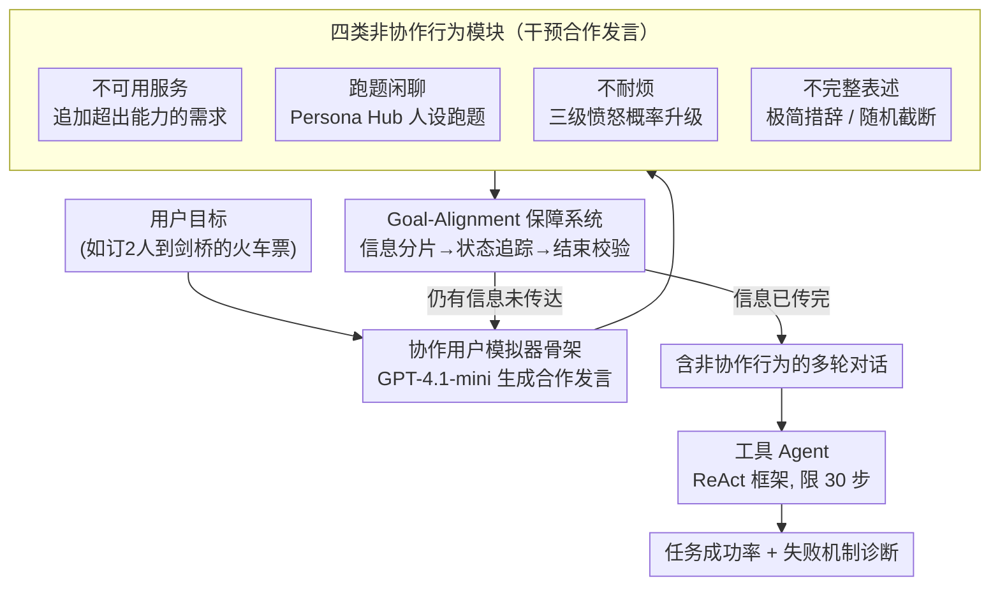

# Non-Collaborative User Simulators for Tool Agents

**会议**: ICLR 2026  
**arXiv**: [2509.23124](https://arxiv.org/abs/2509.23124)  
**代码**: [https://github.com/holi-lab/NCUser](https://github.com/holi-lab/NCUser)  
**领域**: 对话系统 / LLM Agent评测  
**关键词**: 非协作用户模拟, 工具Agent鲁棒性, 对话系统压力测试, 用户行为建模, 多轮对话评测

## 一句话总结
基于marketing研究定义四类非协作用户行为（不可用服务/跑题闲聊/不耐烦/不完整表述），构建了可保持goal-alignment的模拟框架，在MultiWOZ和τ-bench上系统暴露了SOTA工具Agent的行为特异性失败机制——跑题闲聊导致平均SR下降29.1%，且不同模型呈现截然不同的崩溃路径（GPT系列陷入helper API重复调用，Qwen系列倾向于幻觉编造API结果）。

## 研究背景与动机

**领域现状**：工具Agent（tool agent）通过多轮对话理解用户意图、调用API、返回结果来完成任务。近年来τ-bench、Apigen-mt等工作采用用户模拟器来开发和评测这类Agent，避免了静态数据集不能反映动态交互的问题。

**现有痛点**：现有用户模拟器和训练数据几乎全是"Agent友好"的——用户总是清晰表述、耐心等待、完全配合。但marketing研究（Bitner et al., 1990; Reynolds & Harris, 2009）和真实对话数据（LMSYS、WildChat）表明，真实用户频繁出现四类非协作行为：请求超出系统能力的服务、闲聊跑题、因延迟发怒、发送残缺信息。这些行为从未被系统性引入Agent评测。

**核心矛盾**：Agent在"温室环境"中训练和评测，部署到真实场景后面对非协作用户时表现可能远低于预期。但直接在prompt中描述非协作行为（如τ-bench的PBUS方式）效果有限——PBUS在多数非协作模式下几乎不造成性能下降，说明简单的提示描述无法产生足够挑战性的非协作行为。

**本文目标** (1) 如何定义和分类非协作用户行为？ (2) 如何构建既能模拟非协作行为又能保证goal-alignment的用户模拟器？ (3) SOTA Agent在非协作用户面前到底多脆弱，各自的失败机制是什么？

**切入角度**：从marketing研究中的顾客行为分类出发，将服务场景中的非协作行为映射到Agent对话场景，再通过模块化干预（而非简单prompt改写）实现可控的非协作行为模拟。

**核心 idea**：用模块化的行为干预架构（而非prompt描述）在协作用户模拟器基础上叠加四类非协作行为，同时通过dialogue state tracker和ending verifier保证goal-alignment。

## 方法详解

### 整体框架
输入是用户目标（user goal，如"预订2人火车票到剑桥"），输出是包含非协作行为的多轮对话。整个流程分三层：(1) 协作用户模拟器作为骨架，负责传达所有必要信息和意图；(2) 四个非协作行为模块分别对协作输出进行干预（增加/替换/截断用户发言）；(3) goal-alignment保障机制确保无论怎么干预，任务完成所需的全部信息最终都会被传达。Agent侧使用ReAct框架，限制30步推理。

### 关键设计

**1. 协作用户模拟器骨架（Collaborative User Simulator）：先给一个会好好说话的"地基"用户**

非协作行为不是凭空冒出来的，而是叠加在一个合作性用户之上。骨架沿用 τ-bench 的 LLM 模拟框架（GPT-4.1-mini），根据用户目标、指令和对话历史生成正常的合作发言，但额外挂了两个保障 goal-alignment 的模块。一是 dialogue state tracker：把用户目标拆成一组信息碎片（information pieces），每轮追踪哪些已传达、哪些还没传达；当模拟器想结束对话但仍有信息没说出口时，强制它继续把遗漏补上。二是 ending verifier：在信息已传达完、但 Agent 还没执行操作或还在等用户确认时，拦住对话不让它过早结束。之所以要这两层兜底，是因为 τ-bench 原始模拟器没有显式的 goal-alignment，一旦叠加非协作干预就容易丢关键信息或提前收尾，让评测结论失真。

**2. 四类非协作行为模块：把 marketing 研究里的顾客失常行为搬进对话**

四类行为各由独立的 LLM 模块对协作输出做干预（增加 / 替换 / 截断用户发言），而不是简单在 prompt 里描述"你要表现得不耐烦"——后者（即 τ-bench 的 PBUS）被证明几乎打不动 Agent，关键就在于"描述行为"和"产生行为"是两回事。四类行为分别是：

- **Unavailable Service（不可用服务）**：用 GPT-4.1-mini 分析原始用户目标，生成 3 条需要不存在的 API 或不支持参数的额外需求句子（如"订靠窗座位"但 API 无此参数），拼接到原始目标中。Agent 需要识别并礼貌拒绝这些请求。
- **Tangential（跑题闲聊）**：两阶段流程——先从 Persona Hub 随机采样人设特征，再基于人设生成 4 类闲聊对话行为（事实提问 / 观点提问 / 一般观点 / 非观点陈述）的跑题发言，与协作发言合并。当 Agent 忽略跑题内容时，GPT-4.1-mini 检测忽略行为并生成用户抱怨，替换或增补下一轮协作发言。
- **Impatience（不耐烦）**：在两种场景触发——Agent 显式告知失败、或用户已提供全部信息但目标仍未解决（被视为延迟）。触发时从三种对话行为（恶语谩骂 / 威胁 / 催促）中随机采样，且激活概率随触发次数递增，模拟真实愤怒升级；一旦爆发，后续所有发言都维持愤怒语气。
- **Incomplete Utterances（不完整表述）**：两种模式——极简表述（通过 LMSYS/WildChat 的 few-shot 示例做风格迁移，把"I want to reserve a train for 2 people"变成"Book train, 2"）和意外截断（随机截断协作发言，dialogue state tracker 将被截断的信息标为未发送，后续轮次重新传达）。

**3. Goal-Alignment 保障系统：保证 Agent 的失败是"扛不住"而不是"没听全"**

三个机制串起来兜住信息完整性：information sharding 把用户目标拆成原子化信息碎片，dialogue state tracker 逐轮检查每个碎片的传达状态，ending verifier 在对话收尾前再做一次最终校验。整体用 Initial Goal Alignment（IGA）指标量化——τ-bench 上 IGA 达 97.5% 以上。这一层是可信评测的前提：如果非协作行为让用户连必要信息都没说出来，那 Agent 的失败就成了评测缺陷而非鲁棒性问题，结论也就站不住脚了。

### 损失函数 / 训练策略
主实验不涉及训练。fine-tuning实验中使用Qwen2.5-3b/7b-instruct和Llama-3.2-3b-instruct在成功的协作对话上做SFT，训练数据来自GPT-4.1-mini与协作模拟器的MultiWOZ对话。非协作鲁棒性训练通过均匀/非均匀混合四类非协作数据实现。

## 实验关键数据

### 主实验：MultiWOZ与τ-bench上各模型在协作与非协作模式的成功率

| 模型 | 协作SR (M/τ) | 不可用服务SR (M/τ) | 跑题SR (M/τ) | 不耐烦SR (M/τ) | 不完整SR (M/τ) |
|------|-------------|-------------------|-------------|---------------|---------------|
| GPT-4.1-mini | 92.7 / 45.5 | 89.3 / 41.7 | 89.3 / 39.5 | 90.7 / 45.1 | 88.2 / 45.4 |
| GPT-4.1-nano | 23.6 / 12.0 | 16.9 / 10.0 | **9.8 / 6.8** | 26.7 / 8.8 | 14.7 / 8.0 |
| Qwen3-235b | 77.8 / 41.4 | 62.4 / 36.8 | 57.3 / 32.3 | 69.4 / 37.6 | 69.9 / 39.3 |
| Qwen3-30b | 48.3 / 27.9 | 47.2 / 26.6 | 27.2 / 20.4 | 41.0 / 24.8 | 26.1 / 30.1 |
| Llama-3.1-70b | 62.6 / 21.8 | 54.8 / 18.5 | 49.4 / 14.7 | 47.5 / 17.8 | 48.6 / 16.4 |

M = MultiWOZ, τ = τ-bench。SR为4次试验平均值。

### 各非协作模式的失败机制分析

| 非协作模式 | 相对SR降幅 | 主要失败机制 | 受影响最严重的模型 |
|-----------|----------|------------|-----------------|
| Tangential | **-29.1%**（最严重） | Agent注意力被闲聊分散，遗漏核心任务API调用；忽略闲聊触发用户抱怨→消耗推理预算 | GPT-4.1-nano（相对SR仅41.5%） |
| Unavailable Service | -11.3% | GPT系列反复调用helper API重取已加载文档；Qwen3-235b转向幻觉编造API结果 | Qwen3-235b（相对SR 80.2%） |
| Incomplete Utterance | -16.5% | Agent对截断信息产生API参数幻觉（编造不存在的参数名），MultiWOZ比τ-bench严重 | GPT-4.1-nano / Qwen3-30b |
| Impatience | -12.4% | 所有模型显著增加道歉频率，消耗推理步骤；道歉率越高的模型性能下降越大 | Llama-3.1-70b（相对SR 75.9%） |

### SFT训练实验：仅用协作数据 vs 混合非协作数据（Qwen2.5-3b-instruct, MultiWOZ）

| 训练数据 | 协作SR | 不可用服务SR | 跑题SR | 不耐烦SR | 不完整SR | 平均SR |
|---------|--------|------------|--------|---------|---------|--------|
| 仅协作 | 91.6 | 61.2 | 83.1 | 85.1 | 73.0 | 78.8 |
| 均匀混合非协作 | 93.5 | **85.7** | 87.4 | 89.6 | 78.4 | **86.9** |
| 非均匀加权 | 91.6 | **85.7** | 85.7 | 87.6 | **82.3** | 86.6 |

### 关键发现

- **跑题闲聊（Tangential）是最致命的非协作行为**。Agent被闲聊拉跑后难以回到任务正轨，"No book"和"No GT API"错误率显著上升。GPT-4.1-nano因闲聊应对能力最差，触发最多用户抱怨，加速推理预算耗尽，成功率暴跌至9.8%。
- **不同模型架构呈现截然不同的崩溃路径**。面对Unavailable Service时，GPT系列陷入helper API重复调用循环（反复取已加载的API文档），而Qwen3-235b虽避免了重复调用但转向幻觉编造API返回结果——两种失败机制导致的结果同样严重。
- **道歉是一个反直觉的性能杀手**。面对不耐烦用户，所有模型都大幅增加道歉频率，这看似合理的社交行为在30步推理限制下浪费了宝贵的行动预算，导致任务完不成。道歉率越高的模型（Llama-3.1-70b）性能降幅越大。
- **仅用协作数据训练小模型远远不够**。SFT后小模型在协作场景可达90%+ SR，但非协作场景的提升严重滞后，尤其是unavailable service模式（61.2% vs 91.6%）。混入非协作数据后平均SR从78.8%提升到86.9%。
- **模型大小不等于鲁棒性**。Qwen3-30b在unavailable service上的相对SR（97.7%）远优于更大的Qwen3-235b（80.2%），说明鲁棒性受架构和训练方式影响更大。
- **多行为组合的破坏力远超单一行为**。即使GPT-4.1-mini在单一非协作行为下几乎不受影响，在两种行为同时出现时SR显著下降（如TAN+INC组合在τ-bench上从45.5%降至34.6%）。

## 亮点与洞察

- **模块化干预 vs 纯prompt描述**：与PBUS（仅在prompt中描述非协作行为）相比，本文的模块化架构（separate LLM modules for each behavior）产生了真正有挑战性的对话——PBUS在多数模式下几乎不影响Agent性能，而本文框架造成了显著且一致的性能下降。这说明"描述行为"和"产生行为"是两回事，模块化干预是关键。
- **Goal-Alignment是可信评测的前提**：IGA指标确保了即使在非协作行为下用户仍传达了所有必要信息，因此Agent的性能下降可以归因于鲁棒性不足而非信息缺失。这一设计让评测结论可信。
- **跨域扩展能力**：框架已成功推广到ColBench（无工具使用的任务对话）和MINT（用户-Agent协作任务），观察到与tool-use场景类似的性能模式——说明非协作行为的破坏力不局限于工具调用场景。
- **愤怒升级的概率机制**：Impatience模块通过递增概率触发三级愤怒升级（从催促到谩骂），且一旦爆发后续保持愤怒——这种状态机设计比单次随机触发更贴近真实用户行为。

## 局限与展望

- **文化偏差**：四类非协作行为的定义基于西方marketing研究（Bitner 1990, Reynolds & Harris 2009），不同文化背景的用户可能呈现不同的非协作模式（如东亚用户可能更倾向沉默/被动抵抗而非谩骂）。
- **模拟器本身的自然度**：GPT-4.1-mini生成的非协作行为虽然在human evaluation中70%胜率优于PBUS，但与真实用户行为的差距未经量化。
- **防御方法缺失**：论文主要诊断问题，提出的"混入非协作数据训练"只是初步方案，缺乏更sophisticated的防御方法（如在Agent推理中加入非协作行为检测模块、动态调整推理预算分配）。
- **评测环境局限**：30步推理限制是合理的工程约束，但真实部署可能允许更多步骤，需要验证结论在不同预算下是否一致。
- **行为独立性假设**：虽然测了两两组合，但真实用户的非协作行为可能有更复杂的共现模式和时序依赖。

## 相关工作与启发

- **vs τ-bench (Yao et al., 2024)**：τ-bench提供了tool agent的多轮对话评测框架和协作用户模拟器，本文在其基础上增加了非协作维度。τ-bench的PBUS方式（纯prompt描述）被证明不够有效，需要模块化干预。
- **vs Apigen-mt (Prabhakar et al., 2025)**：Apigen-mt同样做prompt-based用户模拟但只关注协作行为，本文填补了非协作行为的空白。
- **vs Laban et al., 2025**：Laban等人研究了underspecification behavior（不完整表述），本文的incomplete utterance模块扩展了这一方向，并将其与其他三类非协作行为统一在同一框架下。
- 本文的框架可直接用于Agent部署前的压力测试，也可为Agent的对抗训练提供数据源。

## 评分
- 新颖性: ⭐⭐⭐⭐ 首个系统性非协作用户模拟框架，行为分类有理论依据，模块化架构设计精巧
- 实验充分度: ⭐⭐⭐⭐⭐ 5个模型×2个基准×5种模式+2个扩展基准+SFT训练实验+human eval+详细错误分析
- 写作质量: ⭐⭐⭐⭐ 结构清晰，分析深入，行为-失败机制的对应关系讲解得很好
- 价值: ⭐⭐⭐⭐ 填补Agent鲁棒性评测空白，框架开源可复用，对Agent部署有直接指导意义

<!-- RELATED:START -->

## 相关论文

- [\[ACL 2026\] Metro: Towards Strategy Induction from Expert Dialogue Transcripts for Non-collaborative Dialogues](../../ACL2026/dialogue/metro_towards_strategy_induction_from_expert_dialogue_transcripts_for_non-collab.md)
- [\[ICLR 2026\] Flipping the Dialogue: Training and Evaluating User Language Models](flipping_the_dialogue_training_and_evaluating_user_language_models.md)
- [\[ICML 2026\] From Self-Evolving Synthetic Data to Verifiable-Reward RL: Post-Training Multi-turn Interactive Tool-Using Agents](../../ICML2026/dialogue/from_self-evolving_synthetic_data_to_verifiable-reward_rl_post-training_multi-tu.md)
- [\[ACL 2025\] Know You First and Be You Better: Modeling Human-Like User Simulators via Implicit Profiles](../../ACL2025/dialogue/know_you_first_and_be_you_better_modeling_human-like_user_simulators_via_implici.md)
- [\[ICLR 2026\] DRIFT: Learning from Abundant User Dissatisfaction in Real-World Preference Learning](drift_learning_from_abundant_user_dissatisfaction_in_real-world_preference_learn.md)

<!-- RELATED:END -->
