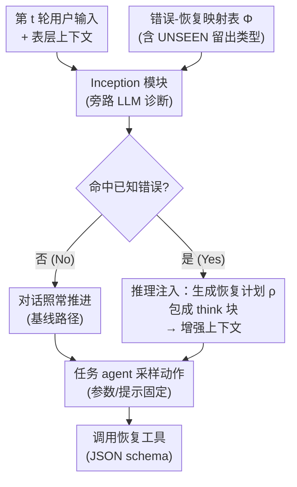

# ReIn: Conversational Error Recovery with Reasoning Inception

**会议**: ICLR 2026  
**arXiv**: [2602.17022](https://arxiv.org/abs/2602.17022)  
**代码**: [youngerous/rein](https://github.com/youngerous/rein)  
**领域**: 对话系统  
**关键词**: conversational agents, error recovery, test-time intervention, reasoning injection, tool-augmented dialogue, instruction hierarchy

## 一句话总结

提出 Reasoning Inception（ReIn），一种无需修改模型参数或系统提示的测试时干预方法，通过外部 inception 模块检测对话错误并将恢复计划注入任务 agent 的推理链中，在多种错误场景下显著提升对话任务完成率，且可泛化至未见错误类型。

## 研究背景与动机

LLM 驱动的对话 agent 在工具集成任务中表现良好，但在实际部署中面临用户引发的不可预测错误：

**用户侧错误被低估**：用户经常发出模糊请求（指代不明、多义解读）或超出系统能力范围的请求（不支持的操作、参数、领域）

**错误恢复 vs 错误预防**：已有工作主要关注错误预防（澄清、回退），而非错误发生后的诊断和恢复

**现实约束**：在实际系统中，任务 agent 的模型参数和系统提示通常已校准固定，修改成本高且可能引入副作用

核心挑战：如何在**不修改模型参数和系统提示**的约束下，使 agent 在遭遇用户错误时能够诊断问题并执行恢复？

## 方法详解

### 整体框架

ReIn 把"诊断错误"和"执行任务"解耦成两个角色：在每轮对话开始时，一个外部 inception 模块先扫描当前用户输入是否触发了已知错误，若触发就生成一段恢复计划，包成推理块塞进任务 agent 的内部推理上下文里，agent 随后在这段被"植入想法"的上下文上继续采样动作。整个过程不碰任务 agent 的参数和系统提示，只在推理链层面做测试时干预。

形式上，第 $t$ 轮用户从策略 $u_t \sim \pi_u(\cdot \mid \mathcal{C}_t, \mathcal{R}_{partial})$ 产生输入，agent 的内部上下文 $\tilde{\mathcal{C}}_t = \mathcal{C}_t \cup \sum_{k=1}^{t-1}\{z_k^{(i)}, \text{output}(z_k^{(i)})\} \cup \{u_t\}$ 累积了历史动作与工具输出，agent 据此采样动作 $z_t^{(i)} \sim \pi_c(\cdot \mid \tilde{\mathcal{C}}_t, \mathcal{L}, \mathcal{S})$。ReIn 要做的就是在 $\tilde{\mathcal{C}}_t$ 上额外注入一段恢复推理。

### 关键设计

**1. Inception 模块：用一个旁路 LLM 把"检测错误"从任务 agent 身上剥离出来**

ReIn 不指望任务 agent 自己发现问题，而是另起一个 inception 模块 $F$ 专门做诊断。它只看表层对话上下文 $\{\mathcal{C}_t, u_t\}$、工具列表 $\mathcal{L}$ 和一张错误-恢复映射表 $\Phi: \mathcal{E} \to \mathcal{T}$，输出二选一：要么是 `No`，表示没命中任何已知错误、对话照常走；要么是 $(\text{Yes}, \rho_t)$，表示命中了某类错误，并给出对应的恢复计划 $\rho_t \in \mathcal{T}$。把诊断单独拎出来的好处是，任务 agent 的系统提示通常被产品方校准固定、改不得，而 inception 模块是可替换的旁路组件，可以随意挑模型、改映射表，不影响主链路。

**2. 推理注入：把恢复计划伪装成 agent 自己的 `think` 内容，而非外部指令**

检测到错误后，ReIn 并不是直接给 agent 下命令，而是把恢复计划包进 `think` 标签，让它看起来像 agent 自己产出的思考。注入规则为

$$r_t = \begin{cases} \varnothing & F(\{\mathcal{C}_t, u_t\}, \mathcal{L}, \Phi, \mathcal{S}') = \text{No} \\ \texttt{think}[\rho_t] & \text{otherwise} \end{cases}$$

随后增强上下文 $\hat{\mathcal{C}}_t = \tilde{\mathcal{C}}_t \cup \{r_t\}$，agent 在 $\hat{\mathcal{C}}_t$ 上继续采样动作。关键在于"伪装成内部推理"这一步：相比把恢复计划作为用户消息或工具返回值硬塞，注入到推理链里更不容易被系统提示压制，agent 会顺着这段思考自然地走向恢复动作。

**3. UNSEEN 错误类型：刻意留两类错误不告诉 inception 模块，逼出泛化能力**

错误被组织成两大用户场景，各自配一种恢复出口：模糊请求（指代不明、多义解读、矛盾）走"生成内部错误报告"，不支持请求（不支持操作、不支持参数、不支持领域）走"转接人工客服"。

| 用户场景 | 错误类型 | 恢复计划 |
|---------|---------|---------|
| 模糊请求 | 指代不明 / 多义解读 / Contradiction(UNSEEN) | 生成内部错误报告 |
| 不支持请求 | 不支持操作 / 不支持参数 / Domain(UNSEEN) | 转接人工客服 |

其中 Contradiction 和 Domain 被标为 **UNSEEN**——它们故意不写进 inception 模块的提示里。因为同一场景下的错误共享同一条恢复路径，研究者想验证：模块能否凭借场景层面的归纳，把没见过的错误也导向正确的恢复出口，从而测出真实的泛化而非死记硬背。

**4. 指令层级中的定位：靠工具定义这个"中介"绕开最低优先级**

按 Wallace et al. 的指令层级，权威性从高到低是 System Message ≫ User Message ≫ Model Outputs ≫ Tool Outputs，而 ReIn 注入的内容本质属于 Tool Outputs，优先级最低，照理压不过系统提示。但实验给出一个关键条件：只要恢复动作在系统侧有对应的 JSON schema 工具定义，ReIn 的恢复计划就能真正驱动 agent 调用该工具、落地为行为；反之若只给文本指令而不定义工具，agent 会严格遵循系统提示、直接无视 ReIn，成功率掉到 0%。也就是说，工具定义是让低优先级注入得以生效的"授权中介"，这也把 ReIn 和未授权的恶意提示注入区分开来。

ReIn 是纯测试时干预，inception 模块直接复用现成 LLM，全程不涉及任何训练或损失函数。

## 实验关键数据

### 主实验

基于 τ-Bench 改造，98 个对话会话，588 个上下文实例（392 已见，196 未见）。

**Sonnet 3.7 作为任务 agent，不同 inception 模块效果**（零售领域 Pass@1）：

| Inception 模块 | 已见场景 | 未见场景 |
|---------------|---------|---------|
| 无 ReIn（基线） | ~15% | ~10% |
| Llama 3.2 3B | ~35% | ~25% |
| Llama 3.3 70B | ~55% | ~45% |
| Mistral Large 2 | ~55% | ~48% |
| Sonnet 3.7 | **~62%** | **~52%** |

ReIn 在所有 inception 模块下均显著提升任务完成率。不使用 ReIn 时，模糊场景的 Pass@1 接近 0%。

### 与提示修改方法对比

| 方法 | 已见场景 Pass@1 |
|------|-------------|
| 无 ReIn（基线） | ~15% |
| Naive Prompt Injection (NPI) | ~40% |
| Self-Refine (SR) | ~45% |
| **ReIn** | **~62%** |

ReIn 在**不修改提示**的条件下，超过了两种需要修改提示的方法。

### 消融实验 / 泛化分析

**泛化至未见错误类型**：ReIn 能有效识别和恢复 Contradiction 和 Domain 错误（未见类型），部分情况下甚至超过已见类型的性能。

**动态触发 vs 固定触发**：允许 ReIn 在每轮动态激活（而非仅在预定错误轮），在大多数场景下进一步提升任务完成率。

**3B 模型局限**：最小 inception 模块的激活率显著低于大模型（Sonnet 3.7 接近 100%，3B 明显更低），原因在于小模型对长上下文的理解能力有限。

### 关键发现

1. **指令层级实证**：ReIn 归属 Tool Outputs（最低优先级），但配合 JSON schema 工具定义可"绕过"指令层级；无工具定义时成功率为 0%
2. **错误类型差异**：不支持场景的基线 Pass@1 (~20%) 高于模糊场景 (~0%)，因为系统提示中已有简短的人工转接指引
3. **ReIn 的战略决策能力**：在案例分析中，ReIn 能在用户持续坚持错误信息时主动升级至人工客服，展现了超越预定义场景的灵活性

## 亮点与洞察

1. **极端约束下的有效方案**：在不能修改参数/提示的强约束下，仅通过推理注入就能大幅提升恢复能力
2. **指令层级的深入分析**：首次实证研究了 ReIn 与指令层级的关系，发现工具定义是关键中介
3. **泛化到未见错误**：共享恢复策略的未见错误类型也能被有效处理，实用价值高
4. **对话错误模拟方法**：系统地构建了用户引发错误的分类体系和受控模拟环境
5. **与 RAG/提示注入的精准区分**：清晰界定了 ReIn 与 RAG（信息检索 vs 错误恢复）和恶意提示注入（需工具授权 vs 未授权）的差异

## 局限性

1. 错误分类体系较为简化（仅 6 种类型），实际部署中错误种类远更复杂
2. 评测基于 τ-Bench 改造，对话轮数和场景多样性有限
3. inception 模块是额外计算开销，每轮对话增加一次 LLM 调用
4. 仅在 Claude 系列模型上测试，是否适用于其他 agent 框架未知
5. 当 ReIn 生成错误恢复计划时直接计为失败，缺乏容错机制

## 相关工作与启发

- **与 RAG 的关系**：RAG 处理知识缺失，ReIn 处理对话偏离；两者互补
- **与提示注入研究的关系**：ReIn 本质上是一种"安全的提示注入"，需要服务提供商授权的工具定义，符合指令层级规范
- **对实际部署的启发**：在 agent 已上线且不可轻易修改的场景下，ReIn 提供了一种轻量级的错误恢复增强方案
- **与 Self-Refine 的对比**：Self-Refine 需要修改提示且效果更差，ReIn 通过推理注入更加高效

## 评分

- **创新性**: ⭐⭐⭐⭐ — 推理注入是新颖的干预方式，与指令层级的结合分析有深度
- **实用性**: ⭐⭐⭐⭐⭐ — 直击实际部署痛点，无需重训或改提示
- **实验完整度**: ⭐⭐⭐⭐ — 多种组合对比充分，但数据集规模偏小
- **写作质量**: ⭐⭐⭐⭐ — 形式化定义清晰，实验设计严谨
- **综合评分**: ⭐⭐⭐⭐ — 实用导向的好工作，方法简洁有效，但理论深度有限

<!-- RELATED:START -->

## 相关论文

- [\[ACL 2026\] APEX-MEM: Agentic Semi-Structured Memory with Temporal Reasoning for Long-Term Conversational AI](../../ACL2026/dialogue/apex-mem_agentic_semi-structured_memory_with_temporal_reasoning_for_long-term_co.md)
- [\[ICLR 2026\] Think-While-Generating: On-the-Fly Reasoning for Personalized Long-Form Generation](think-while-generating_on-the-fly_reasoning_for_personalized_long-form_generatio.md)
- [\[ACL 2026\] Reasoning Gets Harder for LLMs Inside A Dialogue](../../ACL2026/dialogue/reasoning_gets_harder_for_llms_inside_a_dialogue.md)
- [\[ACL 2026\] Dual Hierarchical Dialogue Policy Learning for Legal Inquisitive Conversational Agents](../../ACL2026/dialogue/dual_hierarchical_dialogue_policy_learning_for_legal_inquisitive_conversational_.md)
- [\[ACL 2026\] STRIDE-ED: A Strategy-Grounded Stepwise Reasoning Framework for Empathetic Dialogue Systems](../../ACL2026/dialogue/stride-ed_a_strategy-grounded_stepwise_reasoning_framework_for_empathetic_dialog.md)

<!-- RELATED:END -->
