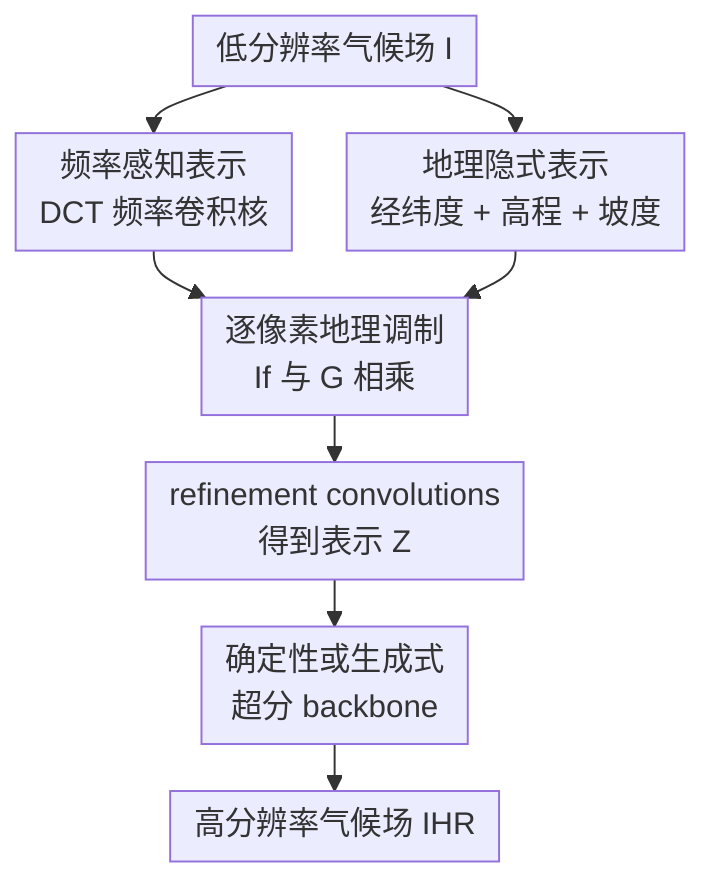

# GeoFAR: Geography-Informed Frequency-Aware Super-Resolution for Climate Data

**会议**: ICLR2026  
**OpenReview**: [https://openreview.net/forum?id=0WHpOekph0](https://openreview.net/forum?id=0WHpOekph0)  
**论文**: [Project Page](https://eceo-epfl.github.io/GeoFAR/)  
**代码**: https://eceo-epfl.github.io/GeoFAR/  
**领域**: 地球科学 / 气候数据超分辨率  
**关键词**: 气候降尺度、超分辨率、频率感知表示、地理隐式表示、复杂地形  

## 一句话总结
GeoFAR 将气候超分辨率中的低频偏置拆成“频率表达不足”和“地理条件缺失”两个问题，用 DCT 频率卷积核提取细粒度频带表示，再用经纬度与高程构成的地理隐式表示逐像素调制这些表示，从而在 ERA5、PRISM、CERRA 等多尺度气候降尺度任务上显著降低高频误差和复杂地形区域的预测偏差。

## 研究背景与动机
**领域现状**：气候降尺度的目标是把粗分辨率再分析或模式输出转成更细的区域气候场。传统动力降尺度依赖区域气候模型，物理解释强但计算代价高；近年来深度学习把问题写成超分辨率任务，用 U-Net、ViT、SwinIR、SRGAN、扩散模型或 Fourier operator 从低分辨率格点直接预测高分辨率气候变量，在成本和精度之间给出了更实用的折中。

**现有痛点**：气候数据和自然图像不同。大面积海洋、平原和缓慢变化的大尺度环流会让数据频谱高度集中在低频，而真正影响局地决策的细节常常出现在海岸线、山地、极地边缘、锋面和峡谷附近。普通 DNN 本身又有频率偏置，训练时更容易先拟合平滑的大尺度结构，最后得到的高分辨率结果看起来均值不错，却在复杂地形上过平滑或产生不可信的局部幻觉。

**核心矛盾**：气候超分既要保持宏观气候态的稳定，又要恢复与地理环境绑定的高频细节。直接把高程图作为额外通道拼到输入里，模型仍要自己学习“经纬度、高程、坡度和气候变量”之间的交互；直接使用小波或通用频率损失，也容易因为气候数据低频占比过高而把大部分能量压在少数低频子带里，无法真正让模型关注局地高频变化。

**本文目标**：作者希望构建一种可插拔的表示层，既能显式拆解气候场的不同频率成分，又能把每个格点的地理属性编码成连续表示，再把两者结合后送入任意超分 backbone。这样一来，方法不绑定某个具体网络，可以同时改进确定性模型和生成式模型。

**切入角度**：论文的关键观察是，高频误差并不是均匀分布的，而是和地理位置、高程、坡度等因素强相关。山区和平原需要的高频恢复策略不同，全球粗网格和欧洲 5.5 km 区域网格需要的地理条件也不同。因此，与其期待 backbone 自己从输入里“悟出”这些关系，不如在进入 backbone 前就构造 frequency-aware 与 geography-informed 的气候表示。

**核心 idea**：GeoFAR 用固定 DCT 基构造的频率感知卷积核生成多频带气候表示，再用球谐经纬度编码与地形差分编码生成 Geo-INR，对频率表示做逐像素调制，让超分模型在每个地点按当地地形和频率结构恢复高分辨率气候细节。

## 方法详解

### 整体框架
GeoFAR 接收一个低分辨率气候场 $I \in \mathbb{R}^{H \times W}$，目标是预测高分辨率气候场 $I_{HR} \in \mathbb{R}^{H' \times W'}$。它先用频率感知投影器 $P_\psi$ 将输入转为 $I_f \in \mathbb{R}^{d \times H \times W}$，再用经纬度和高程构造地理隐式表示 $G \in \mathbb{R}^{d \times H \times W}$，二者逐像素相乘得到 $M = I_f \odot G$，经过 3 个 $3 \times 3$ refinement convolution 得到最终表示 $Z$，再交给 U-Net、ViT、SRGAN、DSFNO 等超分 backbone。

这个流程的贡献节点只有三个：频率感知表示负责把气候场拆成更均衡的频率通道；地理隐式表示负责把位置、高程和坡度变成可学习的连续条件；逐像素地理调制负责让每个地点用自己的地理条件选择应该强化的频率结构。

### 关键设计
**1. 频率感知表示：用 DCT 卷积核避免气候数据被低频子带吞没**

气候场的低频能量太强，普通卷积或四子带小波分解很容易把大部分信息都塞进低频通道，模型看见的仍是“平滑占多数”的训练信号。GeoFAR 的做法是把卷积核权重直接固定为二维 DCT 基，每个 kernel 对应一个频率对 $f_n=(u,v)$，在局部 patch 上产生某个频率成分的响应。对于 patch $P$，二维 DCT 基可以写成 $B_{u,v}(x,y)$，对应响应为 $P_{u,v}(i,j)=\sum_x\sum_y P(x,y)B_{u,v}(x,y)$。

这样做的好处不是简单“加一个频域 loss”，而是把输入本身投影成 $d=N^2$ 个频率通道。论文默认 $N=8$，因此得到 64 个与 Geo-INR 维度对齐的频率通道。高频敏感 kernel 被反复暴露给模型，相当于在表示层把山地、海岸线、锋面这些局地变化从低频大背景里拉出来，减少 DNN 在训练中只依赖平滑低频结构的倾向。

**2. 地理隐式表示：把经纬度、高程和坡度联合编码成气候条件**

气候超分中的地理信息不是一张普通辅助图。纬度决定太阳辐射和大尺度环流背景，经度影响海陆分布，高程影响温度递减率和地形抬升，坡度又影响局地变化的方向性。GeoFAR 把每个格点写成三维地理流形上的点 $x=(\lambda,\phi,h) \in S^2 \times \mathbb{R}$，其中 $\lambda$ 是纬度，$\phi$ 是经度，$h$ 是高程，然后学习 $G(x)=NN(PE(x))$。

位置编码部分使用截断到 $L=7$ 的球谐函数 $Y_L(\lambda,\phi)$，得到 $(L+1)^2=64$ 个通道。球谐基比直接拼接经纬度更适合全球球面，因为小阶数捕捉大尺度空间模式，大阶数捕捉更细的位置变化。地形部分不仅使用绝对高程 $h$，还加入球面方向上的一阶导数 $\partial_\lambda h$ 和 $\partial_\phi h$，组成 $T=[h,\partial_\lambda h,\partial_\phi h]$。再用一个可学习的 $3 \times 3$ 卷积 $\Psi$ 对齐成与球谐通道数一致的地形差分编码 $\hat{T}$，最后令 $PE(x)=Y_L(\lambda,\phi)+\hat{T}(h(\lambda,\phi))$。

这一步解决的是“地理条件如何进入模型”的问题。相比把 elevation 当作额外输入通道，Geo-INR 不让气候变量和地形变量在第一层卷积里硬混，而是先把地理因素变成一个连续、可调制的地点表示。SIREN MLP 的正弦激活又适合表达细节丰富的连续信号，能把山区、海岸和平原映射到不同的地理表示空间。

**3. 逐像素地理调制：让不同地点选择不同的频率恢复方式**

频率表示 $I_f$ 和地理表示 $G$ 维度对齐后，GeoFAR 用逐像素乘法 $M=I_f\odot G$ 做 feature-wise modulation。这个操作看起来简单，但语义很直接：同一个频率通道在阿尔卑斯山区、地中海沿岸和平原上的重要性不应该相同，地理表示就像一个地点相关的门控因子，决定哪些频率响应应该被放大、哪些应该被抑制。

调制后的 $M$ 再经过 3 个 $3\times3$ 卷积细化成 $Z$，供下游 backbone 使用。由于 $Z$ 是 backbone 前的表示，GeoFAR 可以接入确定性模型，也可以接入 SRGAN 这类生成式模型。它并不要求改写 backbone 的主体结构，因此实验中能作为 U-Net、ViT、SRGAN、DSFNO 的外接增强层来验证“频率 + 地理”这两个先验本身是否有效。

### 一个完整示例
假设输入是 CERRA 欧洲区域 22 km 分辨率的 2m temperature，需要恢复到 11 km。普通 ViT 看到的是一个已经被双线性下采样平滑过的温度场，阿尔卑斯山附近相邻山谷和山脊之间的温度差在输入中被抹平，训练时全欧洲大量平原样本又会鼓励模型输出更平滑的结果。

GeoFAR 首先用 64 个 DCT 频率卷积核在局部 patch 上产生多频带响应，其中低频通道保留大尺度温度梯度，高频通道对山地边缘、海岸线和锋面附近的快速变化更敏感。与此同时，Geo-INR 给每个格点生成一个包含球面位置、高程和坡度的地理向量。阿尔卑斯的高海拔、强坡度格点会得到和 Napoli 这类平坦沿海城市不同的表示。二者相乘后，进入 backbone 的表示已经带着“这里是复杂地形，需要保留更多局地高频变化”的条件，最终预测能恢复山谷与山脊之间更细的温度结构，而不是只给出一片平滑过渡。

### 损失函数 / 训练策略
GeoFAR 默认用 MSE 监督高分辨率重建。对于确定性降尺度模型，优化目标可以概括为 $\hat{\theta}=\arg\min_\theta \mathbb{E}_{(I,I_{HR})}[L(f_\theta(Z),I_{HR})]$，其中 $Z$ 是 GeoFAR 生成的频率-地理表示，$f_\theta$ 是超分 backbone。论文还采用 residual prediction 作为强 baseline，让模型预测输入到目标之间的残差，从而把容量更多用于高频修正。

对于 SRGAN 这类生成式模型，GeoFAR 作为地理条件进入 generator，生成器用 MSE 贴近真实高分辨率场，判别器仍按经典二分类 BCE 区分真实场和生成场。作者强调这里的地理调制可以锚定生成式模型的局地细节，减少 GAN 在复杂地形附近产生不合地理条件的伪高频纹理。

实现上，ERA5/PRISM 训练 50 epoch，batch size 16，学习率 $2\times10^{-4}$，weight decay $1\times10^{-4}$；CERRA $\times2$ 训练 20 epoch，batch size 4，weight decay $2\times10^{-4}$；CERRA $\times4$ 和 $\times8$ 因显存限制 batch size 降到 1。所有设置都使用验证集 5 个 epoch 不下降即 early stopping。GeoFAR 的默认 embedding dimension 是 64，Geo-INR 使用两层 SIREN，FCK kernel size 为 8，stride 为 1，并用 padding 保持空间尺寸。

## 实验关键数据

### 主实验
论文在 ERA5、ERA5→PRISM、CERRA 三类设置上比较了通用 SR、气候降尺度方法和 GeoFAR 插件。下表摘取最能说明问题的 T2m 主结果，RMSE 和 LFD 越低越好，MB 越接近 0 越好。

| 设置 | 方法 | RMSE | MB | LFD | 说明 |
|------|------|------|----|-----|------|
| ERA5 5.625°→2.8125° | U-Net | 1.103 | 0.004 | 9.114 | 强确定性 baseline |
| ERA5 5.625°→2.8125° | GeoFAR[U-Net] | 1.076 | 0.001 | 9.068 | 全局设置最佳学习方法 |
| ERA5→PRISM 2.8125°→0.75° | U-Net | 1.501 | -0.094 | 7.953 | reanalysis 到 observation |
| ERA5→PRISM 2.8125°→0.75° | GeoFAR[U-Net] | 1.468 | -0.137 | 7.836 | RMSE 与 LFD 均改善 |
| CERRA 22km→11km | U-Net | 0.272 | 0.068 | 9.769 | 高分辨率欧洲区域 |
| CERRA 22km→11km | GeoFAR[U-Net] | 0.180 | 0.003 | 9.127 | 局地收益最大 |
| CERRA 22km→11km | SRGAN | 0.245 | 0.000 | 9.739 | 生成式 baseline |
| CERRA 22km→11km | GeoFAR[SRGAN] | 0.192 | 0.001 | 9.240 | 说明插件对生成式模型也有效 |

多变量联合降尺度中，GeoFAR[ViT] 相比 ViT 在所有变量上都降低误差，尤其是和地形关系很强的 surface pressure。压力层变量和更大倍率降尺度也保持一致收益。

| 任务 | 方法 | RMSE | MB | LFD / 相关指标 | 结论 |
|------|------|------|----|---------------|------|
| CERRA T2m/10u/10v/Rh2m/Sp 联合降尺度 | ViT | T2m 0.457 / Sp 277.719 | T2m 0.033 / Sp -11.007 | T2m LFD 10.966 / Sp LFD 23.808 | 多变量共享模型下误差较高 |
| CERRA T2m/10u/10v/Rh2m/Sp 联合降尺度 | GeoFAR[ViT] | T2m 0.262 / Sp 47.922 | T2m 0.001 / Sp 0.375 | T2m LFD 9.859 / Sp LFD 20.291 | 对地形相关变量提升明显 |
| ERA5 Z500 5.625°→2.8125° | U-Net | 49.060 | -0.980 | LFD 16.661 | 压力层变量较难 |
| ERA5 Z500 5.625°→2.8125° | GeoFAR[U-Net] | 48.683 | -0.195 | LFD 16.651 | 稳定小幅改善 |
| CERRA T2m 22km→5.5km | U-Net | 0.326 | 0.068 | LFD 11.517 | $\times4$ |
| CERRA T2m 22km→5.5km | GeoFAR[U-Net] | 0.235 | 0.000 | LFD 11.023 | 大倍率仍稳定 |
| CERRA T2m 44km→5.5km | U-Net | 0.482 | 0.034 | LFD 12.389 | $\times8$ |
| CERRA T2m 44km→5.5km | GeoFAR[U-Net] | 0.393 | 0.005 | LFD 12.047 | RMSE 低于 0.5K |

### 消融实验
消融表明，GeoFAR 的收益并不是来自单个小技巧。Residual prediction 先把 ViT 从直接回归目标改成预测残差，随后 FCK、2D-INR、Geo-INR 逐步带来更低的 RMSE 和 LFD；DWT 和简单拼接 elevation 反而不能替代核心设计。

| 配置 | CERRA RMSE | CERRA LFD | ERA5 RMSE | ERA5 LFD | 说明 |
|------|------------|-----------|-----------|----------|------|
| ViT | 0.380 | 10.496 | 1.125 | 9.184 | 原始 baseline |
| w/ DWT | 0.434 | 10.787 | 1.139 | 9.186 | 小波四子带不适合低频偏置强的气候场 |
| w/ Elevation | 0.381 | 10.451 | 1.117 | 9.146 | 直接拼高程收益有限 |
| + Residual | 0.233 | 9.664 | 1.110 | 9.141 | 残差学习先聚焦高频修正 |
| + FCK | 0.216 | 9.493 | 1.100 | 9.118 | 频率感知表示进一步改善 |
| + 2D-INR | 0.198 | 9.310 | 1.099 | 9.118 | 只用二维位置已有帮助 |
| + Geo-INR | 0.191 | 9.245 | 1.099 | 9.113 | 加入高程与坡度后最佳 |

附录还进一步拆解了 Geo-INR：embedding dimension 从 36 增到 100 只带来很小收益但降低 FPS，因此默认 64；球谐位置编码比 Direct 和 Space2Vec 更好；只用 elevation 能部分恢复性能，但加入地形差分向量最好。

| 分析项 | 配置 | RMSE | MB | LFD / 速度 | 说明 |
|--------|------|------|----|------------|------|
| embedding dimension | 36 | 0.192 | -0.001 | LFD 9.254 / 11.3 FPS | 较省计算 |
| embedding dimension | 64 | 0.191 | -0.001 | LFD 9.245 / 11.1 FPS | 默认折中 |
| embedding dimension | 100 | 0.190 | 0.000 | LFD 9.235 / 10.7 FPS | 提升很小 |
| 位置编码 | Direct | 0.195 | -0.001 | LFD 9.256 | 直接经纬度较弱 |
| 位置编码 | Space2Vec | 0.192 | 0.001 | LFD 9.253 | 有改善 |
| 位置编码 | SH | 0.191 | -0.001 | LFD 9.245 | 球面结构最合适 |
| 地形向量 | w/o | 0.198 | -0.001 | LFD 9.310 | 去掉地形变差 |
| 地形向量 | Elevation | 0.193 | -0.001 | LFD 9.260 | 高程有帮助 |
| 地形向量 | Vectors | 0.191 | -0.001 | LFD 9.245 | 高程 + 坡度最好 |

### 关键发现
- GeoFAR 的收益随空间分辨率提高而更明显。ERA5 全局网格较粗，每个格点聚合面积大，地理细节本来就被平均；CERRA 5.5/11/22 km 区域网格能保留更多地形差异，因此 Geo-INR 对局地高频恢复的作用更强。
- 高频改善不是“生成更多纹理”这么简单。论文用 DWT 把预测和真值分成 LL/LH/HL/HH 四个频带后计算 RMSE，GeoFAR 在各频带都降低误差，其中 HH 高频子带相对改善最大，说明它恢复的是更接近真实场的高频，而不是随意增加噪声。
- 高海拔区域收益最大。按高程分组评估时，GeoFAR 在从低地到高原的各组都降低 RMSE；超过 3 km 的区域，RMSE 从 1.755 降到 0.210，直接对应论文动机中的复杂地形问题。
- 表示相似性分析也支持地理编码的语义。Zermatt 的表示更接近阿尔卑斯和 Pyrenees 等山地，Napoli 的表示更接近平坦沿海和地中海周边区域，说明 Geo-INR 学到的不只是坐标 ID，而是与气候超分相关的地理相似性。
- 物理一致性方面，CERRA 风场实验中 GeoFAR 将 10u/10v 的 RMSE 从 0.341/0.355 降到 0.184/0.186，并把 kinetic energy spectral RMSE 从 60.998 降到 18.857，说明频率结构更接近真实风场能量谱。

## 亮点与洞察
- 这篇论文把“气候超分过平滑”解释成数据频谱、网络频率偏置和地理条件三者叠加的问题，而不是简单归因于 backbone 不够强。这个诊断很有价值，因为它解释了为什么通用 image SR 方法搬到气候数据上会遇到局地失败。
- FCK 的设计很干净：直接用 DCT basis 固定卷积核权重，让每个通道天然对应一个局部频率响应。相比学习一个完全自由的频率注意力，它更少依赖模型自己发现频带结构，也更适合低频占优的气候场。
- Geo-INR 的地形差分编码值得借鉴。很多地理任务只拼经纬度或 elevation，但局地气候变化经常由坡度和地形突变触发，把 $\partial_\lambda h$ 和 $\partial_\phi h$ 放进表示比单独高程更贴近物理直觉。
- “表示层可插拔”让贡献边界比较清楚。GeoFAR 不是提出一个全新的超分网络，而是证明 frequency-aware 与 geography-informed representation 可以系统增强不同类型的 backbone，这使得方法更容易迁移到天气预报、遥感温度下采样、降水 downscaling 等任务。
- 实验没有只停留在 RMSE，而是加入 LFD、wavelet subband RMSE、高程分组、表示相似性、风场动能谱等分析。这些指标更贴近论文声称的“高频”和“地理”贡献，也让结论比单表 SOTA 更可信。

## 局限与展望
- 当前地理因子主要描述地表：经纬度、高程和坡度对近地面变量很关键，但对压力层变量、锋面位置和大气动力过程仍然不够。未来可以把 pressure level、height、wind、humidity 等变量纳入多维 INR，形成更完整的大气状态条件。
- 论文虽然做了多变量联合降尺度实验，但跨变量关系没有被显式建模。温度、湿度、气压、降水和风之间存在物理约束，后续可以用共享 latent field、cross-variable operator 或 physics-informed loss 来避免单变量恢复正确但变量间不一致的问题。
- GeoFAR 的地理调制仍是数据驱动的，不能保证输出严格满足热力学、质量守恒或流体动力学约束。对于需要风险评估和长期气候投影的应用，最好结合硬约束或可微物理 solver。
- 高频恢复和不确定性估计之间还有空间。GeoFAR 可以接入 SRGAN，但论文主结果更强调点预测和频谱一致性；在极端事件、降水和风暴路径等任务中，校准过的不确定性可能和平均误差同样重要。
- 方法会增加少量参数和推理成本。附录显示 GeoFAR[U-Net] 比 U-Net 多约 0.9M 参数，在 534×534 CERRA 输入上 FPS 从 14.1 降到 11.0；这个代价不大，但在全球高分辨率多变量实时系统里仍需评估吞吐。

## 相关工作与启发
- **vs DeepSD**: DeepSD 也使用高程等静态特征辅助气候降尺度，但更接近把地形作为额外输入通道交给 CNN。GeoFAR 的区别是先把位置、高程和坡度编码成 Geo-INR，再对频率表示做逐像素调制，因此地理信息不是被动拼接，而是主动影响频率恢复。
- **vs Focal Frequency Loss / FACL**: FFL 和 FACL 在损失层面对频域误差施加约束，适合提醒模型关注难重建频率。GeoFAR 则在表示层显式构造频率通道，并把这些通道和地理条件相乘；它不只是惩罚频域误差，而是改变 backbone 看见的输入表示。
- **vs DWT / wavelet-based SR**: 小波分解提供 LL/LH/HL/HH 四个频带，但气候数据能量过度集中在低频，四子带粒度不足。GeoFAR 用 $8\times8$ DCT basis 得到 64 个频率通道，更细地覆盖频谱，并在消融中明显优于 DWT 替代设计。
- **vs 地理位置编码方法**: 先前地理编码工作常用于物种分布、遥感分类或全局 geo-embedding。GeoFAR 把球谐位置编码和 SIREN 引入气候超分，并进一步加入地形差分向量，说明地理隐式表示也可以作为连续条件服务于网格化物理变量重建。
- **启发**: 对地球科学任务来说，“空间位置”往往不是普通 coordinate，而是携带物理过程先验的条件变量。类似思路可迁移到海洋温盐场超分、空气污染下采样、城市热岛估计、山地降水订正等任务：先找出误差集中在哪类地理结构，再设计能调制局地表示的 geography-aware 模块。

## 评分
- 新颖性: ⭐⭐⭐⭐☆ 频率建模和地理 INR 都有前作，但把 DCT 频率卷积核、球谐位置编码、地形差分和可插拔气候 SR 表示层结合得很自然。
- 实验充分度: ⭐⭐⭐⭐⭐ 数据集、空间尺度、变量类型、下采样倍率、backbone 类型、消融和频率/高程分析都比较完整，且有 MODIS 泛化与物理谱指标补充。
- 写作质量: ⭐⭐⭐⭐☆ 动机和结果图很清楚，方法公式也完整；少数实现细节如不同 backbone 的接入方式主要放在附录，正文读者需要来回跳转。
- 价值: ⭐⭐⭐⭐⭐ 对气候降尺度这种高频细节和地理条件高度耦合的任务很有启发，尤其适合后续扩展到物理一致、多变量和不确定性建模。

<!-- RELATED:START -->

## 相关论文

- [\[NeurIPS 2025\] A Probabilistic U-Net Approach to Downscaling Climate Simulations](../../NeurIPS2025/earth_science/a_probabilistic_unet_approach_to_downscaling_climate_simulat.md)
- [\[CVPR 2026\] PhyOceanCast: Global Ocean Forecasting with Physics-Informed Diffusion](../../CVPR2026/earth_science/phyoceancast_global_ocean_forecasting_with_physics-informed_diffusion.md)
- [\[AAAI 2026\] RENEW: Risk- and Energy-Aware Navigation in Dynamic Waterways](../../AAAI2026/earth_science/renew_risk-_and_energy-aware_navigation_in_dynamic_waterways.md)
- [\[AAAI 2026\] MdaIF: Robust One-Stop Multi-Degradation-Aware Image Fusion with Language-Driven Semantics](../../AAAI2026/earth_science/mdaif_robust_one-stop_multi-degradation-aware_image_fusion_with_language-driven_.md)
- [\[ICLR 2026\] 揭示连续表示全波形反演的机制：一个基于波的神经正切核框架](unveiling_the_mechanism_of_continuous_representation_full-waveform_inversion_a_w.md)

<!-- RELATED:END -->
