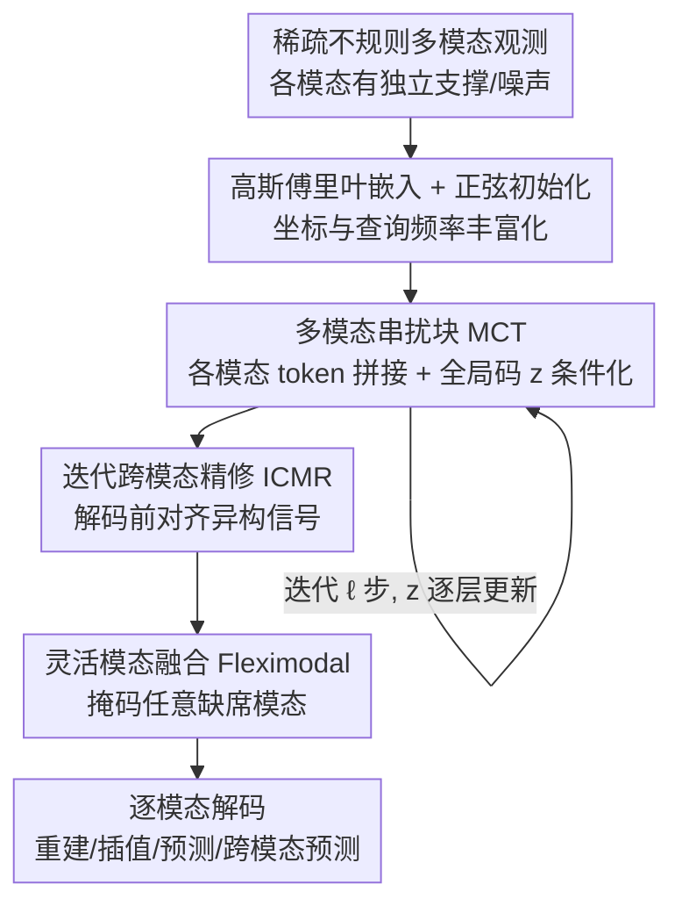

# OmniField: Conditioned Neural Fields for Robust Multimodal Spatiotemporal Learning

**会议**: ICLR 2026  
**OpenReview**: [https://openreview.net/forum?id=VpWDZ3yTBn](https://openreview.net/forum?id=VpWDZ3yTBn)  
**代码**: 待确认  
**领域**: 地球科学 / 时空学习 / 神经场（Conditioned Neural Fields）  
**关键词**: 条件神经场、多模态融合、时空预测、传感器稀疏、噪声鲁棒

## 一句话总结
OmniField 把"科学观测数据"（气候、空气污染）建模成一个**以可用模态为条件的连续神经场**，用多模态串扰块（MCT）+ 迭代跨模态精修（ICMR）在解码前对齐异构信号，无需打网格或插值预处理就能统一做重建/插值/预测/跨模态预测，相对 8 个强基线平均降低 22.4% 误差，且在重度传感器噪声下几乎不掉点。

## 研究背景与动机

**领域现状**：气候、空气质量、材料、粒子物理这类科学观测天然是多模态时空数据——温度/湿度/风速同时采集，PM2.5/O3/NO2 由不同监测站测量。主流处理方式分两派：一派从**数据侧**入手，用滤波、网格化/克里金插值、缺失填补先把不规则、带噪的采样"规整"成一份替身数据集（surrogate）再喂给模型；另一派从**模型侧**入手，用 neural ODE、连续时间隐变量、图动力学等方法直接处理不规则采样。

**现有痛点**：数据侧的预处理会引入系统性副作用——平滑偏置（smoothing bias）会削掉极值和高频结构，不确定性塌缩（uncertainty collapse）会把"猜出来的替身值"当成真值、丢掉插补本身的不确定性。模型侧的方法虽然尊重非网格采样，却普遍假设**固定的观测算子**和**跨模态共享的采样索引**；可现实中每个模态的传感器位置、稀疏模式、噪声结构都随空间/时间/设备而变，一旦违背这些假设就会出现似然误设（likelihood misspecification）。

**核心矛盾**：科学观测同时被两个挑战卡住——**数据挑战**（模态内稀疏、不规则、带 QA/QC 噪声，但跨模态相关）和**模态挑战**（可用模态集合随时空变化，模型若不能适应任意子集，可用记录就会被砍掉一大块）。已有方法要么破坏数据保真度，要么无法灵活吞下"今天只有 PM2.5 和 NO2、明天又多两个污染物"这种动态模态组合。

**本文目标**：构造一个网络 $F_\theta$，把不规则、带噪、多模态的观测直接映射到一个**连续时空场**，既不打网格也不做重度插补，同时统一支持四类任务：重建（$\Delta t=0$，预测已观测点）、空间插值（预测未见位置）、预测（$\Delta t>0$）、跨模态预测（预测输入中缺席的模态）。

**切入角度**：作者把问题归到**条件神经场（Conditioned Neural Field, CNF）** 这个抽象上——普通神经场只能拟合单个信号，而 CNF 接收坐标加一份从该实例观测里提炼的上下文摘要 $\hat y = F_\theta(x,t;c)$，从而用共享参数覆盖一整族信号。这给了"任意时空坐标可查询 + 不依赖网格"的天然框架。

**核心 idea**：在 CNF 骨架上做两件关键事——先用**频率丰富的嵌入**修复神经场的低频谱偏置以保住高频细节，再用**迭代式跨模态信息交换**在条件化解码之前把异构模态对齐，并辅以可处理任意模态子集的灵活模态掩码训练。

## 方法详解

### 整体框架
OmniField 采用 encoder–processor–decoder 三段式骨架，整体写作 $F_\theta = \{D_{\omega,m}\}_{m\in M_{all}} \circ P_\psi \circ E_\phi$：编码器 $E_\phi$ 把上下文集合 $C$（各可用模态的稀疏不规则观测）针对查询点 $(x,t)$ 聚合成一个排列不变、定长的局部摘要 $c(x,t)$；处理器 $P_\psi$ 把多分辨率坐标编码 $\gamma(x),\eta(t)$ 和上下文摘要融合成隐场 $h(x,t)$——这一段就是真正的"条件神经场"；解码器对每个模态用一个轻量头 $\hat y_m(x,t)=D_{\omega,m}(h(x,t))$ 出预测。

这个骨架本身是脚手架，作者识别出稀疏多模态观测带来的三个实际问题，并各用一个设计回应：**Q1** 怎么压住低频偏置、保住高频细节？→ 高斯傅里叶嵌入 + 正弦初始化；**Q2** 怎么对齐支撑集、尺度、噪声都不同的模态？→ MCT 串扰块 + ICMR 迭代精修；**Q3** 模态集合随时空变化时怎么照常工作？→ 灵活模态融合（Fleximodal）掩码。三个设计在骨架的不同环节插入，构成完整的 OmniField。

### 关键设计

**1. 高斯傅里叶嵌入与正弦初始化：把神经场从低频偏置里救出来**

CNF 的训练本质是用连续函数去拟合不规则、带噪的信号，标准 CNF 天然有低频（谱）偏置，而在稀疏科学观测上这个偏置被两件事放大：一是粗糙的、固定频率的位置编码（整数或对数步进的频带）对高频表达不足；二是随机初始化的可学习查询 token 对频谱覆盖很差，成了连续表示的瓶颈。作者把固定正弦傅里叶特征换成**高斯傅里叶特征（GFF）**：采样矩阵 $B\in\mathbb{R}^{d\times 1}$，元素 $B_{ij}\sim\mathcal N(0,\sigma^2)$，对坐标 $x$ 得到 $\gamma(x)=\mathrm{concat}(\cos(2\pi Bx),\sin(2\pi Bx))\in\mathbb{R}^{2d}$，从而给出更丰富、偏置更小的谱表示来捕捉高频细节。同时用**正弦初始化**稳定训练：用对数间隔频带和单位范数缩放（$s=d^{-1/2}$）的紧凑多尺度正弦模式去初始化 $M$ 个可学习查询，保证频率覆盖均衡。消融显示 GFF + 正弦初始化把 CIFAR-10 重建损失和气候预测分别改善了 ×2.74 和 30%。

**2. 多模态串扰块 MCT：在条件化之前先让模态互相通气**

单次 encode→process→decode 在模态支撑、尺度、噪声各异时无法充分表达细粒度的跨模态对应。MCT 让每个模态先各自经过单模态编码器 $E_m$，再把这些 token 跨模态拼接，并用一个轻量的**全局多模态码 $z$** 去条件化处理器：

$$h := \mathrm{MCT}\big(\{U^{t_{in}}_m\}_{m\in M_{in}}, z\big) = P\Big(\bigodot_{m=1}^{M}\big(E_m(U^{t_{in}}_m)\oplus z\big)\Big)$$

其中 $\bigodot$ 是跨模态拼接，$\oplus$ 是带广播的加法，$z\in\mathbb{R}^{1\times d}$ 是汇总当前所有模态中间特征的全局向量，$P$ 是带多层自注意力的多模态处理器。$z$ 身兼两职：一方面把所有模态聚合出的全局信息播报给各模态以促进跨模态通信，另一方面充当一个随网络层逐步演化的**信息瓶颈**，逼模型只保留最有用的共享结构。

**3. 迭代跨模态精修 ICMR：用全局码当桥梁反复对齐**

一次 MCT 还不够，ICMR 让全局码 $z$ 在多个处理器步之间充当**通信桥梁**，在各单模态编码器之间反复中继全局多模态信息。给定 $\ell$ 个 MCT 块，对 $k=0,\dots,\ell-1$：

$$h^{(k)} := \mathrm{MCT}\big(\{U^{t_{in}}_m\}_{m\in M}, z^{(k)}\big)\in\mathbb{R}^{n\times d}\;\Rightarrow\; z^{(k+1)}=\frac1n\sum_{i=1}^{n}h^{(k)}_{i,:}$$

即每步把上一步特征沿位置维做平均得到新的全局码喂回下一块，初始 $z^{(0)}$ 填零，最终的多模态神经场取 $g=h^{(\ell-1)}$。这种"解码前的多轮预条件交换"是鲁棒性的来源：在噪声实验里 ICMR 能把信息**绕过被污染的通道、从干净通道路由**过来，而缺这一步的 Mid-Fusion 会把任一模态的噪声直接放大并传播到共享表示。

**4. 灵活模态融合 Fleximodal：让一个模型吃任意模态子集**

科学数据常出现传感器或变量间歇性缺席，必须能在任意输入子集上工作。Fleximodal 给每个模态一个存在掩码 $\pi_m$：缺席通道在编码器处被零门控、在交叉注意力里被屏蔽、并从损失中排除（只有被监督的目标才贡献梯度），从而防止缺失输入泄漏信息。这和"训练期随机丢模态"的 ModDrop 不同——它是真实地按当天可用性掩码。在 EPA-AQS 上，真实的每日缺席自然把某些 $\pi_m=0$，作者就用当天的原生掩码评估、不做任何插补；为公平起见，所有基线（含 OmniField）在训练和测试都套同一套灵活掩码。

### 损失函数 / 训练策略
单步、共享参数训练（区别于 MIA 那种依赖双层优化的逐实例元学习）。损失只在被监督的目标模态/位置上计算，缺席模态被掩码排除。所有基线用相同的数据划分与逐模态 z-score 归一化，实验在单张 NVIDIA H100 80GB 上完成。

## 实验关键数据

### 主实验
在 ClimSim–THW（温度 T / 湿度 H / 风速 W 三模态，采样率仅 3.87%）上对比 8 个基线（RMSE，物理单位，越低越好，取 Mid-Fusion 列）：

| 模型 | 架构 | 参数量 | T (K) | H (10⁻³kg/kg) | W (m/s) |
|------|------|--------|-------|------|------|
| UNet | CNN | 53.1M | 4.49 | 1.74 | 5.41 |
| ResNet | CNN | 1.2M | 8.13 | 3.26 | 5.36 |
| OFormer | Transformer | 2.1M | 11.20 | 4.24 | 5.84 |
| FNO | Operator | 1.1M | 3.36 | 1.39 | 7.19 |
| CORAL | Operator | 2.0M | 13.12 | 3.80 | 6.76 |
| SCENT | CNF | 29.3M | 1.52 | 0.99 | 5.07 |
| PROSE-FD | Operator (MM) | 16.0M | 5.20 | 1.65 | 5.30 |
| MIA | CNF (MM) | 0.3M | 4.43 | 1.63 | 5.26 |
| **OmniField** | CNF (MM) | 37.4M | **1.07** | **0.66** | **4.86** |

OmniField 在大多数逐模态对比上领先，跨基准平均相对误差降低 **22.4%**。CNF 风格模型整体优于算子学习（FNO/OFormer）和标准 CNN；原生多模态设计（PROSE-FD/MIA）虽享多通道之利仍落后，说明"连续性感知条件化 + 迭代精修"带来的增益超过简单多通道融合。在真实 EPA-AQS 空气质量数据上，模态数从 M2→M4→M6 单调提升，OmniField 在每个层级都领先，并在六污染物全模态对比中取得整体 SOTA。

### 消融实验
ClimSim-LHW 上逐组件消融（括号内为相对误差倍数，越接近 ×1.00 越好）：

| GFF | 正弦初始化 | ICMR | CIFAR-10 (MSE) | T (K) | H | W |
|-----|-----|-----|------|------|------|------|
| ✓ | ✓ | ✓ | 0.0007 (×1.00) | 1.07 | 0.66 | 4.86 |
| ✗ | ✓ | ✓ | 0.0097 (×13.86) | 2.61 (×2.44) | 1.74 (×2.62) | 5.35 |
| ✓ | ✗ | ✓ | 0.0011 (×1.57) | 1.08 (×1.01) | 0.71 | 4.87 |
| ✓ | ✓ | ✗ | 0.0053 (×7.57) | 1.56 (×1.45) | 0.82 | 4.91 |
| ✗ | ✗ | ✗ | 0.0145 (×20.71) | 2.92 (×2.72) | 1.86 (×2.81) | 5.37 |

### 关键发现
- **GFF 贡献最大**：去掉 GFF 时 CIFAR-10 重建误差飙到 ×13.86、温度误差 ×2.44，是低频偏置失控的直接证据；正弦初始化单独贡献较小（×1.57）但与 GFF 协同稳定训练。
- **ICMR 决定鲁棒性**：在 ClimSim–THW 上随机给 1–2 个模态注入 $\sigma\in\{0.5,1.0,2.0\}$ 的高斯噪声（至少留一个干净模态），ICMR 在所有噪声强度下几乎维持干净输入精度，而 Mid-Fusion 随噪声单调恶化、最高噪声下温湿误差大幅上升——印证 ICMR 能把信息从干净通道路由、抑制被污染通道。
- **多模态确实有用**：四种多模态训练策略（Co-Location / Interpolation / Mid-Fusion / ICMR）中，保留原生稀疏的 Mid-Fusion 和 ICMR 明显优于强行共址或插值，说明"把模态特定传感器纳入训练"的价值。
- **跨域稳健**：在纯空间（CIFAR-10）、时空网格（RainNet 降水临近预报）、稀疏多模态点云（ClimSim）三种难度递增的设定上各组件都有正贡献，全模型一致最优。

## 亮点与洞察
- **把"预处理副作用"上升为核心矛盾**：作者没有把稀疏/噪声当工程细节，而是论证插值/网格化会引入平滑偏置和不确定性塌缩，从而把"不打网格的连续场"立成方法论卖点——这个 framing 比单纯刷点更有说服力。
- **全局码 $z$ 一码两用**：既当跨模态通信总线又当信息瓶颈，并通过迭代平均逐层演化，是个轻量却好用的 trick；这种"共享上下文向量在多分支间反复中继"的模式可迁移到任何异构传感器融合任务。
- **鲁棒性来自架构而非数据增强**：ICMR 的抗噪不是靠训练时加噪，而是靠"解码前多轮预条件交换"让模型学会路由——这点用 Mid-Fusion 对照得很干净，是最让人"啊哈"的地方。
- **新基准贡献**：开源了反映真实观测稀疏度的 ClimSim-LHW 和 ML-ready 的 EPA-AQS，便于在数据/模态双挑战下做系统评测。

## 局限与展望
- 作者把完整推导、消融与讨论大量推到附录（GFF 在 Appendix B、Fleximodal 在 Appendix C），正文对 $z$ 的瓶颈行为和 ICMR 收敛性只有定性描述，缺少理论刻画。
- 参数量偏大（37.4M）虽换来精度，但相对 MIA（0.3M）高两个数量级；论文称处于"有利的精度–效率前沿"，但正文未给出明确的算力/延迟数字（在附录表 4-8）。
- 评测域集中在气候与空气质量两类地球科学数据，跨模态对齐对模态间相关性较弱的科学领域（如材料、生物成像）是否同样有效尚待验证。
- ICMR 的迭代步数 $\ell$ 是关键超参，正文未充分讨论其与精度/算力的权衡。

## 相关工作与启发
- **vs SCENT**：SCENT 是可扩展、显式条件化的时空 CNF，统一插值/重建/预测，但是单模态骨架；OmniField 在其编码器上加 MCT/ICMR 做多模态对齐，ClimSim 上温度 RMSE 从 1.52 降到 1.07。
- **vs MIA**：MIA 用双层优化元学习逐实例隐表示，在稀疏自然图像上强但依赖 bi-level 优化；OmniField 追求**单步、共享参数**训练，对时空多模态数据更稳更省。
- **vs Mid-Fusion / 算子学习（FNO/OFormer/PROSE-FD）**：这些方法或假设固定观测算子、共享采样索引，或只做中段特征融合；OmniField 强调"解码前的迭代跨模态交换"才是稀疏带噪场景的关键，证据是它持续优于 Mid-Fusion 和原生多模态算子。
- **vs ModDrop 等丢模态训练**：ModDrop 仅在训练期随机丢模态；Fleximodal 按真实每日可用性掩码、训练与测试一致，更贴合科学数据的真实缺席结构。

## 评分
- 新颖性: ⭐⭐⭐⭐ 把 CNF 扩展到稀疏带噪多模态科学观测，MCT+ICMR 的迭代跨模态精修是有辨识度的新机制。
- 实验充分度: ⭐⭐⭐⭐⭐ 8 基线 × 4 数据集 + 模态缩放 + 噪声鲁棒 + 消融，并贡献两个新基准。
- 写作质量: ⭐⭐⭐⭐ 问题 framing 清晰、Q1–Q3 对应设计干净，但大量细节推到附录。
- 价值: ⭐⭐⭐⭐ 对气候/空气质量等稀疏多模态科学观测的统一建模有实用价值，鲁棒性结论尤其有吸引力。

<!-- RELATED:START -->

## 相关论文

- [\[ICLR 2026\] RainPro-8: An Efficient Deep Learning Model to Estimate Rainfall Probabilities Over 8 Hours](rainpro-8_an_efficient_deep_learning_model_to_estimate_rainfall_probabilities_ov.md)
- [\[AAAI 2026\] MdaIF: Robust One-Stop Multi-Degradation-Aware Image Fusion with Language-Driven Semantics](../../AAAI2026/earth_science/mdaif_robust_one-stop_multi-degradation-aware_image_fusion_with_language-driven_.md)
- [\[ICLR 2026\] The Seismic Wavefield Common Task Framework](the_seismic_wavefield_common_task_framework.md)
- [\[ICLR 2026\] TianQuan-S2S：通过引入气候态构建次季节-季节全球天气预报模型](tianquan-s2s_a_subseasonal-to-seasonal_global_weather_model_via_incorporate_clim.md)
- [\[ICLR 2026\] 揭示连续表示全波形反演的机制：一个基于波的神经正切核框架](unveiling_the_mechanism_of_continuous_representation_full-waveform_inversion_a_w.md)

<!-- RELATED:END -->
