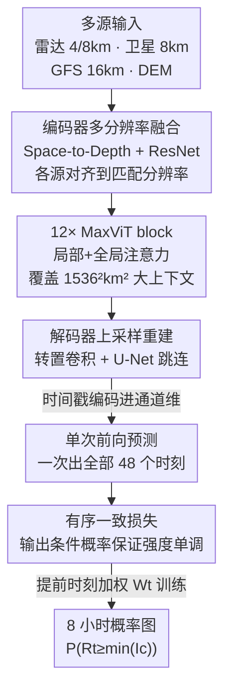

# RainPro-8: An Efficient Deep Learning Model to Estimate Rainfall Probabilities Over 8 Hours

**会议**: ICLR 2026  
**OpenReview**: [https://openreview.net/forum?id=tFAzcPuZcT](https://openreview.net/forum?id=tFAzcPuZcT)  
**代码**: https://github.com/rafapablos/RainPro  
**领域**: 地球科学 / 降水预报 / 时空预测  
**关键词**: 降水概率预报, 多源数据融合, 有序一致损失, 单次前向预测, MaxViT U-Net

## 一句话总结
RainPro-8 用一个仅 36.7M 参数的 MaxViT-U-Net，把雷达、卫星、数值天气预报（NWP）多源数据融合起来，通过「有序一致损失 + 单次前向预测全时刻」一次性输出欧洲 8 小时、高分辨率的概率性降水预报，精度超过现有 NWP、外推法和深度学习临近预报，同时推理比 MetNet 类方法快 48 倍。

## 研究背景与动机
**领域现状**：降水预报目前分裂成两端。深度学习「临近预报」（nowcasting）只能管到很短的提前量（通常 ≤2 小时），多基于雷达做类雷达图像生成；而「中期预报」（medium-range，如 GraphCast、Pangu-Weather）虽然能预测多天，但分辨率粗、依赖 ERA5 再分析数据，对降水这种高度局部、间歇的变量天然欠拟合，常常干脆不输出降水。MetNet 系列（1/2/3）是概率性降水预报的 SOTA，能在美国做 8–24 小时高分辨率预报并击败业务 NWP。

**现有痛点**：MetNet 有三个具体问题。其一，它用「降水分箱 + 交叉熵」做概率预报，但**忽略了分箱之间的有序性**——0.2mm/h 和 5mm/h 这两个箱不是无关类别，而是单调递进的强度，交叉熵把它们当独立类处理。其二，它依赖「lead time conditioning」，即模型一次只生成一个提前时刻的预报，要出 48 个时刻就得前向 48 次，推理代价极高，且不同时刻之间可能出现时间不一致。其三，MetNet-3 有 227M 参数、需要数百块 TPU 训数天，且只在美国数据上跑、代码不公开。

**核心矛盾**：要在 8 小时这个「临近与中期之间的空档」做高分辨率概率预报，必须同时解决三件事——融合时空分辨率各异的多源数据、处理降水分布的极度偏斜与稀疏、给出可靠的不确定性量化；而 MetNet 的范式在效率和一致性上付出了过高代价。

**本文目标**：造一个轻量、可在单卡训练、能整合多源数据、一次前向出全部提前时刻、且概率输出在强度维度上单调一致的 8 小时欧洲降水预报模型。

**核心 idea**：在 MetNet-3 架构上做三处关键改造——用「有序一致损失」把强度单调性写进训练目标、用「单次前向」一口气出所有提前时刻、用「提前时刻加权」替代采样来平衡远近时刻的难度，把参数压到原来的不到 20%。

## 方法详解

### 整体框架
降水预报被形式化为时空预测：输入是过去若干帧雷达 $X=[R_t]_{t=-T_{in}+1}^{0}$ 加上卫星、NWP 等异构源，输出不再是「类雷达图」，而是每个未来时刻、每个强度类别的**概率图** $Y=\bigcup_{t=1}^{T_{out}}\bigcup_{c=1}^{|I|} P_{t,c}\in\mathbb{R}^{T_{out}\times|I|\times H\times W}$，其中 $P_{t,c}$ 是「时刻 $t$、强度落入类别 $I_c$」的概率。整体是一个 U-Net 骨架：编码器在多个分辨率（4km/8km/16km）上分别融合对应的数据源并下采样到低分辨率表征，中间用 12 个 MaxViT block 在整个 $1536^2\text{km}^2$ 大上下文上做局部+全局注意力捕捉长程相互作用，解码器再用转置卷积逐级上采样、借助跳连重建高分辨率概率图。三个核心改造分别作用在「损失」「输出方式」「训练加权」上，让这个紧凑骨架一次前向就能吐出所有时刻的单调一致概率。

### 关键设计

**1. 有序一致损失：把降水强度的单调性写进训练目标**

MetNet 把每个强度箱当独立类别做交叉熵，丢掉了「降水强度本质有序」这个先验，导致可能预测「≥5mm/h 的概率 > ≥2mm/h 的概率」这种自相矛盾的结果。本文不再直接预测 $P(R_t\in I_c)$，而是把目标重定义为累积形式 $P_{t,c}=P(R_t\ge \min(I_c))$，并要求它单调递减 $P_{t,c}\le P_{t,c-1}$。做法是让模型只输出**相邻类别之间的条件概率** $P(R_t\ge\min(I_c)\mid R_t\ge\min(I_{c-1}))$，再由贝叶斯关系（注意到 $P(R_t\ge\min(I_{c-1})\mid R_t\ge\min(I_c))=1$）累乘得到任意类别的概率：

$$P_{t,c}=\prod_{j=2}^{c} P(R_t\ge\min(I_j)\mid R_t\ge\min(I_{j-1}))\times P(R_t\ge\min(I_1))$$

由于条件概率天然 $\le 1$，累乘结果自动满足单调性，从结构上杜绝了不一致。损失用无 reduction 的二元交叉熵（BCE）逐像素算，且只在「上一类别已激活」（$R_t\ge\min(I_{c-1})$）的像素上对类别 $c$ 求平均，逼模型真正利用类别有序性；雷达无覆盖（$R_t=-1$）的像素不计入损失。相比 MetNet 只在推理时用累积概率「补救」单调性，本文是在训练中就学到这种有序结构，因此更一致也更可解释。

**2. 单次前向预测：一口气生成全部提前时刻**

MetNet 的 lead time conditioning 每次只算一个时刻，要 48 个时刻就前向 48 次，推理昂贵且时刻间可能跳变。本文改成**单次前向出全部时刻**：把时间戳编码进通道维，模型输出 $B(TC)HW$ 再 reshape 成 $B\,T\,C\,H\,W$，一次拿到所有 $T$ 个时刻的概率图。这不仅带来约 **48× 的推理加速**，还因为所有时刻在同一次前向里联合生成，天然提升了时刻之间的时间一致性。它和有序一致损失正交：前者管「强度维」的一致，后者管「时间维」的效率与一致。

**3. 提前时刻加权：用损失加权替代采样来平衡远近难度**

提前量越长、降水越难预测，直接等权训练会被远端的高难度时刻拖累。MetNet-3 用「lead time sampling」——更频繁地采样短提前量样本。本文换成 **lead time weights**：每个训练样本都包含全部时刻，但在损失里按指数衰减给远端时刻降权。权重由衰减率 $\alpha$ 控制并归一化：

$$\text{weights}_{exp}[t]=\exp(-\alpha\times t),\quad \text{weights}_{norm}[t]=\frac{\text{weights}_{exp}[t]}{\sum \text{weights}_{exp}[t]}$$

再把归一化权重重新缩放成 $W_t=\text{weights}_{norm}[t]/\overline{\text{weights}_{norm}}$，使加权后总损失尺度与不加权时一致（实验取 $\alpha=10$）。这样模型既优先学好近端、又不放弃远端的困难时刻，在整个 8 小时范围上都受益——消融显示去掉它会明显掉点。

**4. 轻量多分辨率 MaxViT-U-Net：在紧凑骨架里融合异构多源数据**

为了在保持精度的同时把参数从 227M 压到 36.7M，骨架做了多处瘦身：编码器**提前下采样**（在 ResNet block 之前而非之后做下采样以省显存）、**内部通道减半**、去掉了地形嵌入。多源融合按分辨率分层进行——4km/8km 用雷达（兼顾局部细节与上下文）、8km 接卫星、16km 接 GFS 的大气变量，各源用 Space-to-Depth 卷积和 ResNet 在匹配分辨率上合并，并通过 pad/crop 做地理对齐。为兼顾效率，只在 8km/16km 用满 512km 上下文、4km 用 256km。中间 12 个 MaxViT block 结合局部邻域注意力和全局网格注意力，在整个 $1536^2\text{km}^2$ patch 上聚合信息以捕捉长程相互作用，这是 8 小时尺度上必需的。

## 实验关键数据

数据覆盖一年、超百万样本，源自 RainViewer 雷达、EUMETSAT 卫星、NOAA GFS、Copernicus DEM；在单张 H100 上训练约 13 小时、100k 步。评测指标为 CSI、FSS、FBI、CRPS、MAE、MSE（其中 MAE/MSE 对无雨主导的偏斜分布不敏感，仅作参考）。

### 主实验

8 小时多源预报，综合所有提前时刻与强度（Table 1）：

| 模型 | 仅雷达? | CSI ↑ | FSS ↑ | FBI ≈1 | MAE ↓ | MSE ↓ |
|------|--------|-------|-------|--------|-------|-------|
| **RainPro-8 (ours)** | × | **0.279** | **0.537** | 1.262 | 0.126 | 1.503 |
| MetNet-3* | × | 0.270 | 0.517 | 1.318 | 0.132 | 1.620 |
| GFS | × | 0.110 | 0.253 | 0.780 | 0.164 | 1.453 |
| PySTEPS | √ | 0.149 | 0.364 | 0.983 | 0.162 | 2.324 |
| RainPro-8R（仅雷达） | √ | 0.229 | 0.449 | 1.346 | 0.144 | 1.735 |
| Earthformer | √ | 0.111 | 0.267 | 0.163 | 0.110 | 1.358 |
| SimVP | √ | 0.122 | 0.287 | 0.189 | 0.118 | 1.340 |

RainPro-8 在 CSI/FSS 两个降水核心指标上全面领先，比业务预报方法整体高约 65%，比 MetNet-3* 略胜且额外带来 48× 推理加速与更一致的概率图。SimVP/Earthformer 的 MAE/MSE 最低，但那是 MSE 损失偏向「无雨」类的假象，并未转化为更高的 CSI/FSS。

### 消融实验

以 CRPS/CSI/FSS 衡量各设计的贡献（Table 2）：

| 配置 | CRPS ↓ | CSI ↑ | FSS ↑ | 说明 |
|------|--------|-------|-------|------|
| RainPro-8 (full) | 0.06096 | 0.2791 | 0.5367 | 完整模型 |
| 用 CE 损失（去 OC） | 0.06098 | 0.2787 | 0.5357 | 有序一致损失带来小幅但稳定提升 |
| lead time conditioning（去单次前向） | 0.06203 | 0.2695 | 0.5191 | 退回逐时刻预测，精度与速度双降 |
| 去掉 lead time weights | 0.06156 | 0.2733 | 0.5258 | 明显掉点 |
| 仅雷达 RainPro-8R | 0.06574 | 0.2289 | 0.4491 | 掉最多，凸显多源融合关键 |

### 关键发现
- **多源融合贡献最大**：去掉卫星/NWP 只留雷达（RainPro-8R），CSI 从 0.279 掉到 0.229，是所有消融里最大的退化，说明 8 小时尺度上雷达远不够用。
- **归因分析揭示数据源分工**：积分梯度（IG）显示近端由高分辨率雷达主导，约 4 小时后低分辨率雷达和卫星变重要，4 小时之后 GFS 变量（风场、垂直速度、风暴运动、比湿、地面气压、Best Lifted Index 等）影响显著上升——印证了不同提前量需要不同数据源。
- **有序一致损失的增益虽小但「免费」**：它和 CE 模型 CSI 差距仅约 0.0004，但带来结构性的概率单调一致（永不给更高强度更高概率），提升可解释性，且不增加推理成本。
- **泛化到短临雷达预报**：在 SEVIR 基准上，仅雷达的 2 小时版 RainPro-2R（CSI 0.3524、HSS 0.4501）超过 PhyDNet/MAU/ConvGRU/SimVP/Earthformer 等确定性模型，对生成式模型在像素级 CSI/HSS 上更优、在感知指标上略逊，且比 DiffCast 在 CRPS/FSS 上更好并快 13×。

## 亮点与洞察
- **用贝叶斯重参数把「单调约束」嵌进网络输出结构**，而非靠后处理或正则项硬掰——模型只学相邻条件概率、累乘自动单调，这种「让约束在结构上不可违反」的思路可迁移到任何有序回归/有序分割任务。
- **「单次前向出全时刻 + 损失加权」的组合拳**同时解决了效率（48×）和远近时刻难度失衡两个问题，比 MetNet「逐时刻条件 + 采样」既快又稳，是把工程效率和统计权衡一起优化的好例子。
- **用不到 20% 的参数复刻并超越 MetNet-3**，证明在欧洲这种气候复杂区域，紧凑架构 + 精心的多分辨率数据融合可以替代「堆算力」，对资源受限场景极有价值。

## 局限与展望
- 评测里的 MetNet-3* 是作者基于公开描述的复现版（原始 MetNet-3 代码/数据不公开、且为美国数据），并非官方权重，横向比较需带此 caveat。
- 模型在高强度（极端降水）和长提前量上 CSI 仍明显下降，反映极端事件的混沌本质难以被任何方法很好捕捉。
- 概率图在长提前量下趋于模糊，是不确定性增大的真实反映，但也意味着对「锐利单点暴雨」的定位能力有限——感知指标（LPIPS/SSIM）逊于生成式模型即体现了这一精度-锐度权衡。
- 评估限于欧洲一年数据，跨区域/跨气候带的泛化、以及加入更多观测源（如闪电、地面站）后的表现仍待验证。

## 相关工作与启发
- **vs MetNet-3**: 同为概率性降水预报且共享 MaxViT-U-Net 骨架，但 MetNet 用交叉熵忽略强度有序、靠 lead time conditioning 逐时刻预测、227M 参数需数百 TPU；本文用有序一致损失、单次前向、提前时刻加权把参数压到 36.7M 并单卡 13 小时训练，精度反超、推理快 48×。
- **vs Earthformer / SimVP**: 它们是仅雷达、固定分辨率的纯回归（MSE 损失）模型，无法吃异构多源数据，且 MSE 偏向无雨类导致 CSI/FSS 偏低；RainPro 通过多分辨率融合和概率输出在降水指标上大幅领先。
- **vs PySTEPS（外推法）**: 外推假设运动和强度恒定，提前量一长就失效，与 RainPro 的技能差距随时间快速拉大；RainPro 借 NWP/卫星在 4 小时后仍保持优势。
- **vs GFS（业务 NWP）**: NWP 有 spin-up 收敛慢，短提前量表现差，且分辨率粗；RainPro 在全提前量范围整体高约 65%。

## 评分
- 新颖性: ⭐⭐⭐⭐ 有序一致损失 + 单次前向 + 提前时刻加权的组合在概率降水预报里是扎实的范式改进，单点创新偏工程但整合得当。
- 实验充分度: ⭐⭐⭐⭐⭐ 多基线对比 + 完整消融 + 归因分析 + SEVIR 跨基准泛化，证据链完整。
- 写作质量: ⭐⭐⭐⭐ 动机清晰、公式推导完整，架构图信息密但可读。
- 价值: ⭐⭐⭐⭐⭐ 填补临近与中期预报之间的 8 小时空档，轻量可复现、代码开源，对气象业务和资源受限场景实用价值高。

<!-- RELATED:START -->

## 相关论文

- [\[ICLR 2026\] OmniField: Conditioned Neural Fields for Robust Multimodal Spatiotemporal Learning](omnifield_conditioned_neural_fields_for_robust_multimodal_spatiotemporal_learnin.md)
- [\[ICLR 2026\] TianQuan-S2S：通过引入气候态构建次季节-季节全球天气预报模型](tianquan-s2s_a_subseasonal-to-seasonal_global_weather_model_via_incorporate_clim.md)
- [\[ICLR 2026\] 揭示连续表示全波形反演的机制：一个基于波的神经正切核框架](unveiling_the_mechanism_of_continuous_representation_full-waveform_inversion_a_w.md)
- [\[ICLR 2026\] The Seismic Wavefield Common Task Framework](the_seismic_wavefield_common_task_framework.md)
- [\[CVPR 2026\] PhyOceanCast: Global Ocean Forecasting with Physics-Informed Diffusion](../../CVPR2026/earth_science/phyoceancast_global_ocean_forecasting_with_physics-informed_diffusion.md)

<!-- RELATED:END -->
