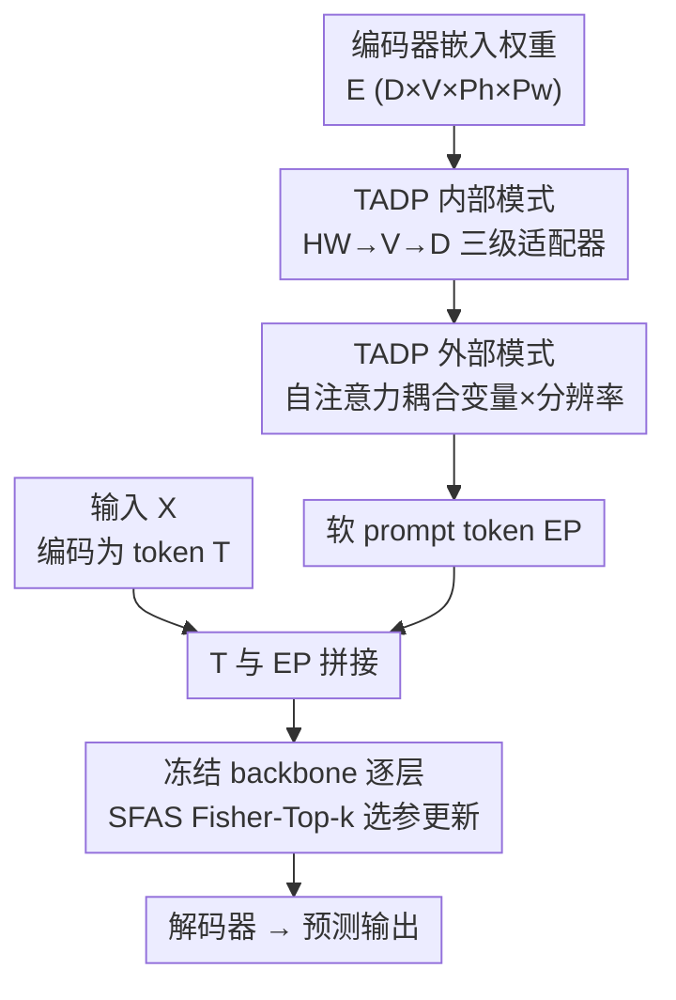

# Task-Adaptive Parameter-Efficient Fine-Tuning for Weather Foundation Models

**会议**: ICLR 2026  
**OpenReview**: [https://openreview.net/forum?id=eFExhM3tKr](https://openreview.net/forum?id=eFExhM3tKr)  
**代码**: https://github.com/ShileiCao/WeatherPEFT  
**领域**: 地球科学 / 气象基础模型 / 参数高效微调  
**关键词**: 天气基础模型, PEFT, 任务自适应 prompt, Fisher 信息, 参数选择

## 一句话总结
针对天气基础模型（WFM）微调，提出 WeatherPEFT：前向用 Task-Adaptive Dynamic Prompting（TADP）从编码器嵌入权重里抽出"变量×分辨率×时空"的任务特征生成软 prompt，反向用 Stochastic Fisher-Guided Adaptive Selection（SFAS）只更新 Fisher 信息最高的少量参数，在三个下游任务上用 ~0.3%–4% 的可训练参数追平甚至超过全量微调（Full-Tuning）。

## 研究背景与动机
**领域现状**：天气基础模型（如 Aurora 1.3B、Prithvi-WxC 2.3B）在大规模气象数据上预训练后，能迁移到降尺度、集合预报后处理、降水预测等多种下游任务，正在取代传统数值天气预报（NWP）。但模型越做越大，每个下游任务都做全量微调（Full-Tuning）在算力和存储上都不可持续——每个任务都要存一整套 10 亿级参数。

**现有痛点**：自然语言/视觉里成熟的 PEFT 方法（LoRA、DoRA、AdaptFormer、SSF、VPT 等）直接搬到 WFM 上效果明显掉点。论文在降尺度任务上量化了这个差距：DoRA 用 3.75M 参数，T2m 的 RMSE 比 Full-Tuning 高约 36%（1.228 vs 0.906）；在区域降水任务上 LoRA 的 12h SEEPS 比 Full-Tuning 高 62.8%。

**核心矛盾**：气象数据和 RGB 图像/词向量根本不同——它在**变量**（温度、湿度等不同物理量，且变量间相关性随任务变）、**分辨率**（5.625° vs 0.25° 不只是空间尺度，而是从静力大尺度动力学切到非静力对流尺度的物理 regime 切换）、**时空覆盖**（全球 vs 区域）三个维度上高度异质。而主流 PEFT 对所有输入、所有任务用**同一套**可训练参数，既无法感知当前任务的物理特性，也没意识到不同参数在不同任务里重要性不同（降水预测关键的参数未必是降尺度关键的）。已有的任务选择型 PEFT（Child-Tuning、SAM、SCT）虽然会挑参数，但都是训练前**静态**选定，无法动态适配气象的变量耦合和 regime 切换。

**本文目标**：让 PEFT 既能在前向**感知任务**（context-aware），又能在反向**按任务挑参数**（task-adaptive），且这两件事都要针对气象异质性专门设计。

**核心 idea**：把编码器嵌入层当成"任务信息的仓库"——它天然编码了输入变量、分辨率、天气现象，于是从嵌入权重里抽特征生成动态软 prompt（TADP）；再用 Fisher 信息加退火随机扰动来稳健地挑出当前任务最敏感的少量参数更新（SFAS）。两者一个管前向一个管反向，协同工作。

## 方法详解

### 整体框架
WeatherPEFT 在微调时**冻结**整个预训练 backbone（3D Swin Transformer U-Net），只训练两个轻量模块，它们作用在微调流程的两个不同阶段：

- **前向阶段——TADP**：不直接拿数据，而是拿编码器**嵌入层的权重** $E\in\mathbb{R}^{D\times V\times P_h\times P_w}$ 作为输入（$V$ 变量数、$P_h\times P_w$ patch 空间核、$D$ 隐藏维），先用三个层级化适配器抽"内部模式"，再用自注意力抽"外部模式"，生成软 prompt token $E_P\in\mathbb{R}^{P\times D}$，把它拼接到输入 token 前面送进 backbone 每一层。这样模型在每一层计算时都带着"当前是什么任务"的上下文。
- **反向阶段——SFAS**：backbone 参数虽然冻结，但仍需选一部分微调。SFAS 用 Fisher 信息衡量每个参数对损失的敏感度，加退火随机扰动后取 Top-k 生成 Fish Mask，只让被选中的参数接收梯度更新，其余保持预训练值不变。

两个模块互补：TADP 让前向"看得懂任务"，SFAS 让反向"只动该动的参数"，消融显示二者缺一都掉点。

### 关键设计

**1. TADP 内部模式：三级适配器按"空间→变量→特征"层级抽取嵌入权重**

针对气象数据三维异质（变量/分辨率/时空），TADP 不在数据上加 prompt，而是去挖嵌入权重里已经编码好的任务特征。它把嵌入权重的空间维展平为 $\hat{E}\in\mathbb{R}^{D\times V\times P_hP_w}$，然后串联三个适配器，每个都是 LayerNorm + 降维 + GELU + 升维的轻量结构，按由低到高的层级递进：HW-Adapter 先处理空间与分辨率信息（$P_h\times P_w$），建立"特征在空间位置上怎么交互"的基础语境；V-Adapter 在此基础上建模不同物理变量（温度、湿度等）之间的相互依赖；D-Adapter 处理由天气特性抽象出的高层属性（$D$ 维），整合前两阶段输出得到解释大气响应机制的普适模式。形式上：

$$E_{HW}=(\mathrm{Adapter}_{HW}(\hat{E}))^{\pi},\quad E_V=(\mathrm{Adapter}_V(E_{HW}))^{\pi},\quad E_D=\mathrm{Adapter}_D(E_V)$$

其中 $\pi$ 是把张量最后一维移到最前的换轴操作，恰好让下一个适配器作用在新的维度上，从而实现"空间→变量→特征"逐级聚焦。这种分层正对应气象数据"局部空间交互 → 变量耦合 → 抽象大气机制"的物理层次，比统一加一个 prompt 更能刻画当前任务的物理特性。

**2. TADP 外部模式：自注意力耦合变量与分辨率，生成注入式软 prompt**

光有内部分层特征还不够——变量和空间分辨率之间存在跨维度的耦合（例如不同分辨率下变量相关性会变），需要显式建模。TADP 把 $E_D$ 的前两维合并为 $\hat{E}_D\in\mathbb{R}^{VP_hP_w\times D}$，做一次自注意力把"物理量 $V$"和"空间分辨率特征 $P_hP_w$"耦合起来，再经线性投影压成 $P$ 个 prompt token：

$$\mathrm{SA}(\cdot)=\mathrm{Softmax}\!\left(\frac{E_{query}E_{key}}{\sqrt{D}}\right)E_{value},\qquad E_P=(\mathrm{MLP}(E_{SA}))^{\pi}$$

输入 $X$ 被编码器编成 $M$ 个 token $T\in\mathbb{R}^{M\times D}$ 后，生成的软 prompt $E_P$ 被拼接到 $T$ 前面，并送进 backbone 的**每一个** block。这样任务上下文不是只在输入端注入一次，而是贯穿整个前向计算，使冻结的 backbone 在每一层都"知道自己在做哪个气象任务"，实现 context-aware 的特征重标定。

**3. SFAS：Fisher 信息 + 退火随机扰动，动态挑选并稳健更新任务关键参数**

不同天气任务对参数的依赖不同（有些参数编码降水的混沌模式，有些专管降尺度的空间关系），所以反向时不能均匀更新所有参数。SFAS 用 Fisher 信息矩阵 $F_\theta$ 量化参数对学习目标的敏感度（Fisher 越大参数越关键），并用对角近似把它简化为向量。在有监督设定下用真实标签近似：

$$\hat{F}_\theta=\frac{1}{N}\sum_{j=1}^{N}(\nabla_\theta\log P_\theta(Y_j|X_j))^2$$

但天气任务异质性强，微调早期噪声大、Fisher 容易失真——早期高 Fisher 分的参数可能只是抓到了瞬时噪声而非真正任务相关特征。为此 SFAS 加一个**退火随机分量**稳定选择：

$$\bar{F}_\theta=\gamma\times\left(1-\frac{n_s}{t_s}\right)\odot M_{sc}+\hat{F}_\theta$$

其中 $\gamma$ 是初始系数，$M_{sc}\sim\mathrm{Uniform}(0,1)$ 是随机向量，$n_s/t_s$ 是当前步与总步数（每个 batch 算一步）。训练早期随机项大，给低 Fisher 参数一些被选中的机会、避免被初期噪声误导；随训练推进线性衰减到 0，最终回归纯 Fisher 选择。每步按 $\bar{F}_\theta$ 取 Top-k 置 Fish Mask 为 1（其余为 0），只更新这 k 个参数，$k$ 控制稀疏度。如此既保住不变的预训练物理先验，又把有限的更新预算花在当前任务真正关键的权重上。

### 损失函数 / 训练策略
沿用各下游任务自身的回归/概率评分目标（降尺度用纬度加权 RMSE、后处理用 CRPS、降水用 SEEPS/ACC/RMSE），WeatherPEFT 不改任务损失，只改"前向带什么 prompt、反向更新哪些参数"。backbone 全程冻结，只有 TADP 模块与被 Fish Mask 选中的 backbone 参数参与训练。

## 实验关键数据

三个任务均以 Aurora（1.3B，3D Swin-UNet）为基础模型，并在附录用更大的 Prithvi-WxC 验证；只统计 backbone 内的可训练参数。

### 主实验

降尺度（ERA5 5.625°→1.40625°，同时降尺度 68 个变量），纬度加权 RMSE（越低越好）：

| 方法 | 可训练参数(M) | T2m | U10 | V10 | T850 | Z500 |
|------|------|------|------|------|------|------|
| LoRA | 3.63 | 1.190 | 1.130 | 1.118 | 0.998 | 50.421 |
| DoRA | 3.75 | 1.228 | 1.140 | 1.120 | 1.024 | 50.061 |
| SSF | 3.92 | 1.180 | 1.106 | 1.094 | 0.987 | 48.342 |
| TADP Only | 2.22 | 1.183 | 1.118 | 1.105 | 0.996 | 49.809 |
| SFAS Only | 1.26 | 1.161 | 1.090 | 1.081 | 0.973 | 47.000 |
| **WeatherPEFT** | **3.48** | **1.119** | **1.057** | **1.051** | **0.950** | **44.922** |
| Full-Tuning | 1239.94 | 0.906 | 0.882 | 0.884 | 0.836 | 35.821 |

WeatherPEFT 用 3.48M 参数（约 backbone 的 0.3%）在所有 PEFT 里 RMSE 最低；把预算放大到 ~4%（52.47M）后 T2m RMSE 0.916 已逼近 Full-Tuning 的 0.906，部分变量（V10 0.875 vs 0.884）甚至更好。

区域降水预测（ERA5-CH 中国区 0.25°，预测未来 6h 累计降水），SEEPS↓ / ACC↑ / RMSE↓，这里 WeatherPEFT **超过**了 Full-Tuning：

| 方法 | 参数(M) | 12h SEEPS↓ | 12h ACC↑ | 24h SEEPS↓ | 36h ACC↑ |
|------|------|------|------|------|------|
| LoRA | 3.63 | 0.495 | 0.592 | 0.634 | 0.294 |
| Child-Tuning$_D$ | 3.39 | 0.407 | 0.694 | 0.565 | 0.364 |
| SAM | 3.39 | 0.421 | 0.673 | 0.598 | 0.299 |
| **WeatherPEFT** | **3.38** | **0.368** | **0.742** | **0.515** | **0.443** |
| Full-Tuning | 1246.77 | 0.304 | 0.797 | 0.452 | 0.481 |
| WeatherPEFT(~4%) | 52.37 | **0.302** | **0.805** | 0.437 | 0.518 |

放大预算后 WeatherPEFT（52.37M）在所有指标上全面超过 1.2B 的 Full-Tuning（12h SEEPS 0.302 vs 0.304、ACC 0.805 vs 0.797）。在集合预报后处理任务上，WeatherPEFT 用 3.18M 参数也在 Z500 上反超 Full-Tuning（CRPS 72.701 vs 73.760）。

### 消融实验

| 配置 | 降尺度 T2m RMSE↓ | 降水 12h SEEPS↓ | 说明 |
|------|------|------|------|
| TADP Only | 1.183 | 0.549 | 只前向加 prompt |
| SFAS Only | 1.161 | 0.459 | 只反向选参数 |
| WeatherPEFT(full) | 1.119 | 0.368 | 两者协同 |

### 关键发现
- **两个模块协同 > 单用**：TADP Only 和 SFAS Only 都比完整模型差，说明前向的任务感知和反向的参数选择是互补的，缺一个就掉点。
- **不同任务两模块的重要性不同**：在稀疏、局部性强的降水任务上 SFAS 比 TADP 更关键（SFAS Only 0.459 远好于 TADP Only 0.549）；这印证了"挑对参数"对捕捉降水稀疏信号的价值。
- **任务自适应选参确实有用，但还不够**：SCT、SAM、Child-Tuning 这些任务选择型 baseline 整体优于 LoRA，验证了选任务相关参数的直觉；但它们仍被 WeatherPEFT 大幅超过，说明只有自适应选参、缺了 TADP 提供的气象上下文感知是不够的。
- **PEFT 在气象域确实有大 gap**：常规 PEFT（LoRA/DoRA）即便放大参数预算也追不上 Full-Tuning，凸显科学领域微调的特殊性，而 WeatherPEFT 几乎补齐了这个差距。

## 亮点与洞察
- **拿"嵌入权重"而非数据生成 prompt**：TADP 把编码器嵌入层视作任务信息仓库，从权重而非输入特征里抽 prompt，巧妙地把"变量/分辨率/时空"这类任务级元信息显式注入——这个思路可迁移到任何输入异质、需要任务条件化的基础模型微调。
- **退火随机扰动稳住 Fisher 早期噪声**：直接用 Fisher 选参在早期会被瞬时噪声误导，加一个线性衰减的随机项让选择在早期"敢探索"、后期"收敛到纯 Fisher"，是个简单但针对性强的稳健化技巧，可复用到其他基于梯度敏感度的参数选择场景。
- **前向+反向双管齐下**：大多数 PEFT 只在一侧动手（要么加模块、要么选参数），WeatherPEFT 同时在前向（感知任务）和反向（挑参数）两个阶段设计，二者正交互补，这种"分阶段设计"框架本身值得借鉴。
- **PEFT 反超 Full-Tuning**：在区域降水上放大预算后全面超过 1.2B 全量微调，说明对异质科学任务，"少而精地更新对的参数 + 任务条件化"可能比"无差别更新全部参数"更不易过拟合。

## 局限与展望
- 方法在 Aurora / Prithvi-WxC 两个 WFM 上验证，但都是 Transformer 类 backbone；对其他架构（如纯图神经网络或谱方法的气象模型）是否同样有效未知。
- TADP 依赖编码器嵌入层确实编码了足够的任务信息这一假设；若某些 WFM 的嵌入层信息不充分，prompt 质量可能下降。
- Fisher 信息需要额外前向/反向来估计，$k$ 和退火系数 $\gamma$ 是新引入的超参，论文虽在附录做了敏感性分析，但跨任务自动选取仍需人工调。
- 只覆盖降尺度、后处理、区域降水三类任务，对中长期全球预报、数据同化等更复杂时序任务的适配性还有待验证。

## 相关工作与启发
- **vs 通用 PEFT（LoRA / DoRA / AdaptFormer / SSF / VPT）**：它们对所有任务/输入用同一套参数、面向 RGB 或词向量这类同质输入；本文针对气象的变量-分辨率-时空异质，前向做任务自适应 prompt、反向做任务自适应选参，因此在 WFM 上显著缩小与 Full-Tuning 的差距。
- **vs 任务选择型 PEFT（Child-Tuning / SAM / SCT）**：它们在训练前**静态**挑参数；SFAS 是**动态+退火随机**地按 Fisher 在线挑参数，能跟随气象 regime 切换重标定，且额外配了 TADP 的上下文感知，本文实验显示比纯静态选参更强。
- **vs 全量微调（Full-Tuning）**：Full-Tuning 每任务存一整套 12 亿参数、算力存储不可持续；WeatherPEFT 用 0.3%–4% 参数追平甚至超越它，是面向多任务 WFM 部署的现实方案。

## 评分
- 新颖性: ⭐⭐⭐⭐⭐ 首个系统研究 WFM 高效微调，TADP 从嵌入权重生成 prompt + SFAS 退火 Fisher 选参都针对气象异质性原创设计。
- 实验充分度: ⭐⭐⭐⭐⭐ 三类任务、十余个 PEFT baseline、两个 WFM、消融与放大预算设置齐全。
- 写作质量: ⭐⭐⭐⭐ 动机和方法层次清晰、公式完整，部分换轴/注入细节稍需对照图才好理解。
- 价值: ⭐⭐⭐⭐⭐ 让 10 亿级天气基础模型可在小参数预算下落地多任务，对气象 AI 实用部署意义大。

<!-- RELATED:START -->

## 相关论文

- [\[ICML 2026\] Scaling Laws of Global Weather Models](../../ICML2026/earth_science/scaling_laws_of_global_weather_models.md)
- [\[ICLR 2026\] The Seismic Wavefield Common Task Framework](the_seismic_wavefield_common_task_framework.md)
- [\[ICLR 2026\] RainPro-8: An Efficient Deep Learning Model to Estimate Rainfall Probabilities Over 8 Hours](rainpro-8_an_efficient_deep_learning_model_to_estimate_rainfall_probabilities_ov.md)
- [\[ICML 2026\] (Sparse) Attention to the Details: Preserving Spectral Fidelity in ML-based Weather Forecasting Models](../../ICML2026/earth_science/sparse_attention_to_the_details_preserving_spectral_fidelity_in_ml-based_weather.md)
- [\[NeurIPS 2025\] Adaptive Online Emulation for Accelerating Complex Physical Simulations](../../NeurIPS2025/earth_science/adaptive_online_emulation_for_accelerating_complex_physical_simulations.md)

<!-- RELATED:END -->
