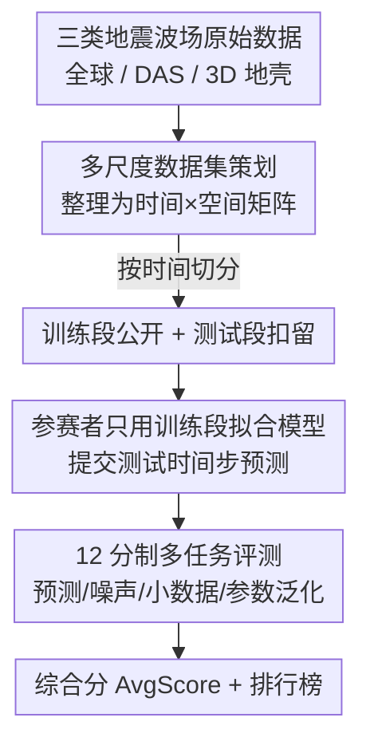

# The Seismic Wavefield Common Task Framework

**会议**: ICLR 2026  
**OpenReview**: [https://openreview.net/forum?id=u4N7Kl6gzE](https://openreview.net/forum?id=u4N7Kl6gzE)  
**代码**: https://github.com/CTF-for-Science/ctf4science  
**领域**: 地球科学 / 科学机器学习基准 / 时空预测  
**关键词**: 地震波场, 通用任务框架(CTF), 隐藏测试集, 多指标评测, 科学机器学习

## 一句话总结
这篇论文把 NLP/CV 里催生 ImageNet、AlphaZero 的"通用任务框架(Common Task Framework, CTF)"思路搬到地震学，提供三套多尺度地震波场数据集 + 一套 12 分制的隐藏测试集评测协议，并用它公平横评了 18 个主流科学机器学习模型——结果发现绝大多数复杂模型连"全预测 0"的朴素基线都打不过。

## 研究背景与动机

**领域现状**：地震波场建模（地震预警、地动预测、地下结构反演）本质是求解三维弹性动力学波动方程，但介质弹性性质在空间/深度上剧烈变化，连小尺度非均匀性都会散射、扭曲波形，产生高度非平稳、多频、多路径的复杂信号。一方面数值模拟成本随分辨频率和区域规模爆炸式增长，另一方面分布式声学传感(DAS)等新技术带来了密集观测数据。于是社区开始大量引入机器学习——神经算子(Neural Operator)、物理信息网络(PINN)、降阶模型、各类通用深度架构等——来加速波场重建与预测。

**现有痛点**：方法井喷的速度远远超过了"客观比较它们"的速度。地震学界沿用的是"自报告(self-reporting)"评测模式——作者自己同时发布训练集和测试集，社区各自跑分。这种模式让弱基线、报告偏差、评测口径不一致大行其道，更糟的是测试集对作者可见，天然给 p-hacking 和"在测试集上隐式调参"开了后门。除了蛋白质结构预测的 CASP，整个科学与工程领域基本都忽视了 CTF 这种"独立裁判 + 隐藏测试集"的严格范式。

**核心矛盾**：只有当测试集真正被扣留、由独立裁判打分时，方法之间才可能有严格、公正的对比；而现状是大家都在"自家出题自家判卷"，导致进展难以被可信地量化。

**本文目标**：为地震学搭一个可持续生长的 CTF——既要覆盖真实场景下的多种任务（预测、重建、噪声鲁棒、小数据、参数泛化），又要用扣留测试集 + 多指标打分把"谁强谁弱、强在哪"讲清楚。

**切入角度**：作者借鉴了 Wyder et al. 在经典非线性动力系统上做科学机器学习 CTF 的工作，把同一套"12 分制 + 隐藏测试集 + 排行榜"协议迁移到地震波场这一更难、更有社会意义的数据上。

**核心 idea**：用"通用任务框架 = 精心策划的多尺度数据集 + 隐藏测试集 + 多指标独立打分 + 排行榜"替代地震学里的自报告基准，让方法对比变得可复现、可公平横评。

## 方法详解

### 整体框架
这篇论文不提新模型，它的"方法"是一整套评测协议与数据基础设施。整体流程是：把三类地震波场数据各自整理成时间×空间的矩阵，按时间切成公开的训练段和扣留的测试段；参赛者只拿训练段拟合自己的模型，对指定时间步生成预测文件提交；独立裁判用同一套 12 个任务指标打分，再汇总成一个综合分(AvgScore)挂到排行榜。关键点在于：测试集对参赛者不可见，且打分不是单一数字，而是横跨"预测 / 噪声鲁棒 / 小数据 / 参数泛化"四类任务的 12 维剖面，从而刻画出每个模型"擅长什么、在哪类问题上靠谱"。

### 关键设计

**1. CTF 评测协议：用隐藏测试集 + 独立裁判堵死自报告的作弊口子**

针对"自报告评测让测试集对作者可见、滋生 p-hacking"这一痛点，CTF 把出题权和判卷权彻底分离：训练数据公开，但测试段的真值被扣留，参赛者只能对指定时间步生成预测文件提交，由独立裁判打分并上排行榜（初期通过 GitHub 包本地评测，计划 2026 年 3 月在 Kaggle 上线竞赛）。数据集体量被刻意做小——可在笔记本上跑——以"democratize access"降低参与门槛，避免基准只服务于有大算力的团队。这套"扣留测试集 + 第三方裁判"正是 ImageNet、CASP 之所以能驱动领域进步的核心机制，作者把它原样移植到地震学。

**2. 三套多尺度波场数据集：从行星到地壳覆盖真实地震学场景**

单一数据集无法代表地震学的难度谱，作者一次性提供三套尺度迥异的波场：(a) **全球波场**——基于 AxiSEM 在 IASP91 径向对称地球模型里预计算 Green's function，与震源机制卷积后得到分布在斐波那契球面上 2048 个传感器、采样 1 Hz、长达 3600 s 的垂向速度地震图（论文排行榜结果主要在这套上）；(b) **DAS 观测**——把通信光纤变成虚拟传感阵列，取 10 段 1 分钟、5 Hz、低通到 1 Hz 的真实海底观测，含遵循色散关系 $\omega^2 = gk\tanh(kh)$ 的浅海涌浪，是纯观测数据；(c) **3D 地壳合成波场**——在异质三维地壳模型里用双力偶点源（震源位置与走向/倾角/滑动角随机）模拟，在 $94\times94$ 网格上以 50 Hz 采样 6 秒（这套留给即将上线的 Kaggle 竞赛）。三套数据共同覆盖了重建与预测在噪声、小数据、参数依赖约束下的真实挑战。

**3. 12 分制多指标评分：拒绝赢家通吃，刻画"适合什么"而非"谁第一"**

把模型表现压成单一浮点数天然是"reductive"的，作者沿用 Wyder et al. 的 12 分制把评测拆成四类任务、共 12 个分数 $E_1\!\sim\!E_{12}$：**预测(2 分)** 给 $t\in[0,4T]$ 预测 $[4T,6T]$，短时用 RMSE 衡量轨迹精度($E_1$)、长时用功率谱误差衡量统计保真度($E_2$)；**噪声(4 分)** 在低/高噪数据上分别考重建去噪与预测($E_3\!\sim\!E_6$)；**小数据(4 分)** 只给少量快照 $M$ 做无噪/有噪预测($E_7\!\sim\!E_{10}$)；**参数泛化(2 分)** 考内插与外推到未见参数区($E_{11},E_{12}$)。每个分数都归一化为 $E_i = 100\,(1 - S(\tilde{X},\hat{X}))$，其中相对误差 $S_{ST}=\frac{\|\hat{X}[1:k,:]-\tilde{X}[1:k,:]\|}{\|\hat{X}[1:k,:]\|}$ 度量短时、$S_{LT}$ 在对数功率谱 $P(X,k,k)=\ln(|\mathrm{FFT}(X)|^2)$ 的前 100 个波数上度量长时统计匹配。分数裁剪到 $[-100,100]$，全 0 预测恰好得 0 分作参考基线，无法产出结果的任务记 $-100$。综合分 AvgScore 是 12 个分数的均值——之所以用多指标，是因为短时确定性预测、长时统计保真、抗噪、小数据、参数外推本就是相互冲突的能力，单一榜单会逼出"赢家通吃"却对具体科学用途未必合适的模型。

### 一个例子：为什么 LSTM 综合分最高却在小数据上垮掉
拿全球波场数据上的最佳模型 LSTM 走一遍：它的综合分 13.18 在全场领先，靠的是去噪任务——低噪重建 $E_3=69.7$、高噪重建 $E_5=48.83$ 都遥遥领先，作者归因于其参数量适中、表达力够强，在自回归预测的有限数据上起到了"隐式正则"的作用，比 DMD 这类统计方法更不容易过拟合噪声。但同一个 LSTM 在小数据短时预测上却塌方——$E_7=-40.07$、$E_9=-18.38$ 都是负分，即还不如全 0 基线。这个"同一模型在不同任务上天差地别"正是 12 分制要暴露的东西：如果只看一个综合榜，你会以为 LSTM 全面领先，但剖面告诉你它绝不能用在小样本预测场景。

## 实验关键数据

### 主实验
作者在全球波场和 DAS 两套数据上横评了 18 个高引模型（Chronos、DeepONet、FNO、KAN、LSTM、Moirai、NeuralODE、Opt DMD、PyKoopman、SINDy、Sundial、TabPFN 等），全 0 预测为参考基线（综合分 0）。下表为全球波场数据上的综合分 AvgScore（节选）：

| 模型 | AvgScore | 关键观察 |
|------|----------|----------|
| LSTM | **13.18** | 全场最高，靠去噪 $E_3/E_5$ 领先 |
| ODE-LSTM | 5.71 | 第二，RNN 类整体最稳 |
| Baseline Zeros | 0.0 | 朴素基线，全预测 0 |
| FNO | -30.92 | 多任务直接 -100，远不如 0 基线 |
| DeepONet | -50.10 | 神经算子表现垫底之一 |
| Chronos / Moirai / TabPFN / LLMTime / Sundial | -100.0 | 多个时序大模型在全球波场上几乎全任务崩溃 |

DAS 数据上结论类似：最佳是 PyKoopman(12.70) 与 ODE-LSTM(11.58)，Sundial 基础模型在短时预测 $E_1/E_7/E_9$ 上表现突出但综合分仍为负(-0.57)，而 LLMTime/Chronos/Panda 等大模型同样大面积 -100。

### 任务剖面对比（全球波场，节选 $E$ 分量）

| 模型 | $E_3$ 低噪重建 | $E_5$ 高噪重建 | $E_7$ 小数据短时 | $E_9$ 小数据有噪短时 |
|------|------|------|------|------|
| LSTM | 69.70 | 48.83 | **-40.07** | **-18.38** |
| ODE-LSTM | 65.78 | 41.10 | -67.04 | -0.29 |
| Reservoir | 75.37 | 33.63 | 1.61 | -100.0 |
| FNO | 80.82 | -100.0 | -9.36 | -100.0 |

### 关键发现
- **复杂模型普遍打不过"全预测 0"**：在全球波场上多数 ML 架构综合分为负，说明当前 ML/AI 离在地震波场上发挥实际作用还很远，数据集难度足以拉开模型分布。
- **RNN 类（LSTM/ODE-LSTM）最稳**：在两套数据上都排前二，去噪任务尤其强；作者归因于参数量适中 + MSE 训练带来的隐式正则，比 DMD 这类统计方法更抗噪过拟合。
- **没有"一招通吃"的模型**：RNN 综合分最高却在小数据短时预测 $E_7/E_9$ 上惨败；Sundial 短时预测强但综合分仍负。这正是多指标评分相对单一榜单的价值——逼出"按场景选模型"而非"选总冠军"。
- **所有模型在预测类指标上都没超过 50 分**，作者干脆省略了预测曲线图，因为"没有任何值得看的东西"。

## 亮点与洞察
- **把成熟领域的"评测范式"当作贡献本身**：论文最大的洞察不是某个模型，而是"地震学缺的不是算法，是 ImageNet 式的隐藏测试集 + 独立裁判"。这种"基础设施即贡献"的思路可以迁移到任何被自报告基准困住的科学子领域。
- **多指标剖面比单一榜单信息量大得多**：12 个分数让"同一模型在不同任务上天差地别"显式可见，避免了把"会去噪"误读成"全能"。这套打分逻辑（短时 RMSE + 长时功率谱误差 + 裁剪到 $[-100,100]$、0 基线对齐 0 分）很容易复用到其他时空预测基准。
- **"诚实地报告失败"**：作者大方承认绝大多数 SOTA 时序大模型在这套数据上全线崩溃，把负结果当成驱动社区改进的信号，而不是藏起来——这本身就是 CTF 精神的体现。

## 局限与展望
- **数据仍偏理想化**：全球波场来自轴对称地球模型，捕捉了速度随深度递增却省略了驱动真实地球动力学的异质地质结构；作者计划引入 REVEAL、火星等更复杂模拟扩展参数空间。
- **DAS 数据里地震信号偏弱**：未来希望加入地震波场更占主导、近地表强散射的 DAS 记录，以及实验室地震行为数据，进一步逼近有社会意义的强地动场景。
- **评测覆盖有限**：当前只评了 18 个模型、12 个指标、且 3D 地壳数据留给 Kaggle；作者计划在竞赛中提供 $P=100$ 个变参模拟、预测 $Q=10$ 个新初值，并扩到 $E_{13}\!\sim\!E_{22}$，期待更大训练数据能解锁模型能力、打过 0 基线。
- 自己的观察：综合分用 12 个 $E_i$ 简单平均、且崩溃任务记 -100，会让"在个别任务彻底失败"对总分的惩罚极重，可能掩盖某些"专精型"模型的真实价值——这与作者"鼓励 fit-for-purpose"的初衷略有张力，未来或可考虑加权或任务分层榜。

## 相关工作与启发
- **vs 自报告基准（地震学现状）**：自报告把训练/测试集都交给社区、降低作者评测负担，但测试集可见导致 p-hacking；本文用扣留测试集 + 独立裁判堵死这条路，代价是需要维护竞赛平台与裁判流程。
- **vs Wyder et al. 的科学机器学习 CTF**：本文直接复用其 12 分制评分协议，但把评测对象从经典非线性动力系统换成更难、更有社会价值的真实/合成地震波场，是该范式向具体学科的落地。
- **vs ImageNet / CASP / AlphaZero 等经典 CTF**：本文显式以这些为榜样，论证"隐藏测试集竞赛"是驱动 CV/NLP/RL 三大领域跃进的共同引擎，主张科学计算同样需要这种机制。

## 评分
- 新颖性: ⭐⭐⭐⭐ 把成熟的 CTF 范式系统迁移到地震学并配上三套真实多尺度数据，协议本身非全新但落地扎实。
- 实验充分度: ⭐⭐⭐⭐ 横评 18 个模型 × 12 指标 × 2 数据集，剖面清晰；但 3D 地壳数据未评、预测类全军覆没略显单薄。
- 写作质量: ⭐⭐⭐⭐ 动机与协议讲得透彻，诚实报告失败结果，可读性好。
- 价值: ⭐⭐⭐⭐⭐ 为地震学科学机器学习立了可复现、可公平横评的基础设施，长期价值高于任何单篇模型论文。

<!-- RELATED:START -->

## 相关论文

- [\[CVPR 2026\] SIGMA: A Physics-Based Benchmark for Gas Chimney Understanding in Seismic Images](../../CVPR2026/earth_science/sigma_a_physics-based_benchmark_for_gas_chimney_understanding_in_seismic_images.md)
- [\[NeurIPS 2025\] ControlFusion: A Controllable Image Fusion Framework with Language-Vision Degradation Prompts](../../NeurIPS2025/earth_science/controlfusion_a_controllable_image_fusion_framework_with_language-vision_degrada.md)
- [\[ICLR 2026\] TianQuan-S2S：通过引入气候态构建次季节-季节全球天气预报模型](tianquan-s2s_a_subseasonal-to-seasonal_global_weather_model_via_incorporate_clim.md)
- [\[ICLR 2026\] 揭示连续表示全波形反演的机制：一个基于波的神经正切核框架](unveiling_the_mechanism_of_continuous_representation_full-waveform_inversion_a_w.md)
- [\[ICLR 2026\] OmniField: Conditioned Neural Fields for Robust Multimodal Spatiotemporal Learning](omnifield_conditioned_neural_fields_for_robust_multimodal_spatiotemporal_learnin.md)

<!-- RELATED:END -->
