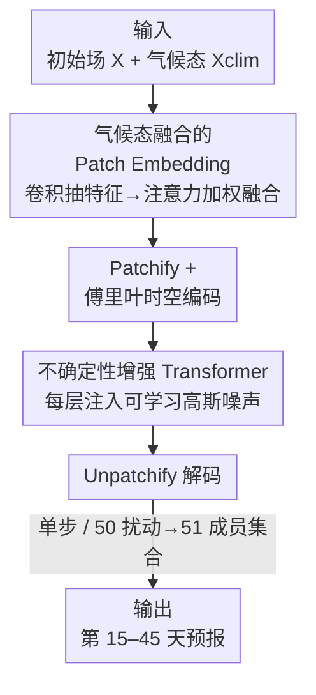

# TianQuan-S2S：通过引入气候态构建次季节-季节全球天气预报模型

**会议**: ICLR 2026  
**OpenReview**: [https://openreview.net/forum?id=7Dvmq7MhwU](https://openreview.net/forum?id=7Dvmq7MhwU)  
**代码**: https://github.com/zhangminglang42/TianQuan  
**领域**: 地球科学 / 天气预报 / Transformer  
**关键词**: 次季节-季节预报, 气候态融合, 不确定性建模, 模型坍缩, ViT

## 一句话总结
TianQuan-S2S 把"长期气候平均态"通过注意力融合塞进 patch embedding、并在 ViT 每一层注入可学习的高斯噪声，专治数据驱动模型在 15–45 天次季节预报上"越预测越糊"的模型坍缩问题，在 ERA5 上同时超过数值模式 ECMWF-S2S 和数据驱动的 FuXi-S2S。

## 研究背景与动机
**领域现状**：次季节-季节（Subseasonal-to-Seasonal, S2S，通常指超过 15 天、到 45 天甚至更长）预报对农业、能源调度、应急管理至关重要。传统数值天气预报（NWP）在 15 天内的中短期很强，但跨到 S2S 尺度时，参数化方案带来的近似误差会不断累积，且算力代价高昂（超算上模拟一个变量都要几小时）。近年的数据驱动模型（Pangu、GraphCast、FuXi 等）在中期预报上已能比肩 NWP 且推理只要几秒，被视为有希望的方向。

**现有痛点**：但数据驱动方法在 S2S 上仍然很弱，原因有两点。其一，**气候态建模不足**——气候态（climatology，几十年观测/再分析数据统计出的缓变气候模态）是 S2S 尺度上左右大气状态的关键信息，而现有方法几乎只盯着初始场，忽视了气候态。其二，**模型坍缩（model collapse）**——离散网格本身会在空间/时间平均时抹掉小尺度天气特征，随着预报时效拉长，系统逐步退化、丢失可靠结构，最终给出过度平滑、不真实的预测（论文 Figure 1 展示同一目标日的预报随时效增大而轮廓逐渐消失）。

**核心矛盾**：S2S 尺度上初始场的信息量随时效衰减得很快、本身就不足以支撑准确预测；而单纯依赖确定性回归又会把预测拉向"安全的平滑均值"，于是细节越掉越多。换句话说，**信息不够**（缺气候态）和**机制不对**（确定性建模天然过度平滑）这两件事叠在一起，导致长时效预报崩掉。

**本文目标 / 切入角度**：作者把问题拆成两半分别治。缺信息——就把气候态作为辅助先验补进来；过度平滑——就借鉴传统"扰动预报"（perturbed forecasting）的思路，往模型里注入随机性，防止预报塌缩到单一确定性轨迹。

**核心 idea**：用"注意力融合气候态 + ViT 逐层注入可学习高斯噪声"这两个简单设计，同时补足气候信息、抑制过度平滑，把数据驱动 S2S 预报的时效有效推到 15–45 天。

## 方法详解

### 整体框架
TianQuan-S2S 是一个**单步直接预报**模型：输入是过去 5 天的历史天气状态 $X_{t-4:t_0}\in\mathbb{R}^{H\times W\times K}$ 与对应的气候态 $X_{\text{clim}}\in\mathbb{R}^{H\times W\times K}$（$K=V_A\times C+V_S$，即高空变量数 × 气压层数 + 地表变量数），输出是第 15 到第 45 天的预测 $\hat{X}_{t_{15}:t_{45}}$。整条流水线分两大块：先在 **patch embedding 阶段**把初始场和气候态融合好，再送进一个**逐层加噪的 ViT** 做预测。

具体地，气候态先经多层卷积抽出气候特征 $F_{\text{clim}}$，初始场经"空间卷积 + 通道卷积"抽出增强特征 $F_X$；两者经注意力融合自适应加权得到融合特征 $F$；融合特征切 patch、加傅里叶位置/时间编码后进入 Transformer；ViT 的每一层都注入一份可学习的高斯噪声；最后 unpatchify 解码回网格，得到 15–45 天的预报场。训练时按 5 天间隔分别训练不同 lead time（15、20、…、45）的多个模型，各自出单步预测，拼成完整的 45 天预报。

### 关键设计

**1. 气候态融合的 Patch Embedding：把缺失的气候先验显式补进来**

这一步针对"气候态建模不足"。作者不把气候态当成又一个普通输入通道，而是给它和初始场各自设计特征抽取再做注意力融合。对气候态 $X_{\text{clim}}$，用多层卷积抽气候特征 $F_{\text{clim}}$，思路是借鉴"边缘先验"——卷积里显式编码像素对之间的差分，让网络学到气候的趋势信息。对初始场，则提出"空间卷积 + 通道卷积"双路：空间卷积 $F_s=f_{\text{conv}}([Y^s_{PAP},Y^s_{PMP}])$ 抓区域变化，通道卷积 $F_c=f_{\text{conv}}(Y^c_{PAP})$ 建模温度/气压/风等变量间的关系（$Y$ 是经过部分平均池化、全局最大池化处理后的特征），两路相加得 $F_X=F_s+F_c$。

随后用注意力融合把 $F_{\text{clim}}$ 和 $F_X$ 自适应整合。它先把两者按变量相加并展平 $A^{(v)}=\text{reshape}(F_X^{(v)}+F_{\text{clim}}^{(v)})$，做自注意力算出空间权重

$$W_{\text{att}}=\text{unreshape}\!\left(\sigma\!\left(\tfrac{Q^{(v)}K^{(v)}}{\sqrt{N}}\right)V^{(v)}\right)\in[0,1]^{H\times W\times C},$$

再以这权重做凸组合融合：$F=f_{\text{conv}}\!\big(F_{\text{clim}}\cdot W_{\text{att}}+F_X\cdot(1-W_{\text{att}})+F_{\text{clim}}+F_X\big)$。$W_{\text{att}}$ 相当于逐像素决定"这个位置该多信气候态、多信初始场"，比简单拼接或固定门控更灵活——消融里它也确实优于 Concat 和 Learnable Gate（见下文）。气候态在论文里按 1979–2016 年共 38 年的逐日气候（366 天）计算。

**2. 不确定性增强的 Transformer：用逐层可学习噪声治模型坍缩**

这一步针对"模型坍缩 / 过度平滑"。传统集合预报靠扰动初始场来刻画混沌系统的不确定性，但初始场扰动的影响会随时效迅速衰减，对 S2S 这种长时效几乎没用。作者的做法是把扰动从"初始场"挪到"模型内部"，且在 ViT 的**每一层**都注入噪声：

$$E^{(n+1)}=E^{(n)}+h_n\!\big(E^{(n)}\big)+g_n\!\big(E^{(n)}\big)\cdot\mathcal{N}(0,I),$$

其中 $h_n(\cdot)$ 是第 $n$ 层标准的注意力变换，$g_n(\cdot)$ 是不确定性块引入的**可学习**参数函数，决定每个位置注入多大幅度的高斯噪声。关键在于噪声幅度是学出来的、且每层都加：这让预报不会坍缩到单一确定性轨迹，能随时效增长持续刻画不确定性的增长，从而抑制过度平滑、保住小尺度结构。推理时对同一输入采 50 份随机扰动加回无扰动状态，构成 51 成员的集合，取成员均值作为集合预报。消融显示注噪层数越多效果越好（Layer 1 → Layer 1-7 → 全层 Default 逐步变好），噪声标准差 $\sigma\approx 1$ 时在正则化与精度间最优。

### 损失函数 / 训练策略
训练目标是**纬度加权均方误差**（latitude-weighted MSE），对预测 $\hat{X}_{t_{15}:t_{45}}$ 与真值逐格点计算：

$$L=\frac{1}{V\times H\times W}\sum_{v=1}^{V}\sum_{i=1}^{H}\sum_{j=1}^{W}L^{(i)}\big(\hat{X}^{v,i,j}_{t_{15}:t_{45}}-X^{v,i,j}_{t_{15}:t_{45}}\big)^2,$$

其中纬度权重 $L^{(i)}=\cos(\text{lat}(i))/\big(\tfrac{1}{H}\sum_{i'}\cos(\text{lat}(i'))\big)$——赤道附近格点覆盖面积更大、权重更高，极地权重更低。优化器用 AdamW（$\beta_1=0.9,\beta_2=0.99$，weight decay $1\text{e-}5$，位置编码不加 decay），学习率 $5\text{e-}5$，5 epoch 线性 warmup + 95 epoch cosine 退火，8 张 80GB GPU 训练。

## 实验关键数据

数据集为 ERA5（1979–2018，40 年），逐日按 6 小时平均，下采样到 5.625°（32×64）和 1.40625°（128×256）两种分辨率，取 13 个关键气压层；训练 1979–2015、验证 2016、测试 2017–2018。指标包括纬度加权 RMSE、ACC、以及集合预报的 CRPS / SME / RQE。对比基线：数值模式 ECMWF-S2S、数据驱动 ClimaX 和 FuXi-S2S、以及 Climatology 基准。

### 主实验
确定性预报（两种分辨率、四个变量 T850 / Z500 / T2m / Wind10）下 TianQuan-S2S 全面领先：

| 变量 | 指标 | 相比最好基线的提升 |
|--------|------|----------|
| T850 | 平均 RMSE | 改善 0.14 K |
| Z500 | 平均 RMSE | 改善 59 m²/s² |
| Wind10 | 平均 RMSE | 改善 0.353 m/s |
| Wind10 (day45) | ACC | 0.297 vs ClimaX 0.172 / ECMWF 0.112 |

集合预报（CRPS/SME/RQE，Table 1）上本文在几乎所有变量、所有时效上优于 FuXi-S2S 与 ClimaX，例如 day35 Z500 的 RQE 改善达 72。集合均值 RMSE（Table 2）在 T2m / T850 / Z500 上均优于 Climatology 基准；但 Wind10 上 FuXi-S2S 和本文都不如 Climatology——作者解释这是因为风场高度多变，ML 集合均值会把它过度平滑、反而抬高 RMSE，而 WeatherBench2 的 61 天滑窗气候基准本身更平滑稳定。

### 消融实验
四种配置交叉验证两个设计（Table 3，节选 day15→day45 的退化幅度）：

| 配置 | Z500 RMSE 退化 | T2m RMSE 退化 | 说明 |
|------|---------|---------|------|
| w/o noise & Clim. | +160 | +0.73 | 两个都去掉，退化最严重 |
| w/o noise | +81 | +0.295 | 只留气候态融合 |
| w/o Clim. | — | — | 只留噪声 |
| Default | 最小 | 最小 | 完整模型 |

融合策略与扰动方式对比（Table 4，集合均值 RMSE）：注意力融合优于 Concat 与 Learnable Gate；可学习逐层噪声优于"只扰初始场 IC Perturb"和"固定层噪声 FLN"；注噪层数从 Layer 1 增到全层，T2m / Z500 集合均值 RMSE 最多分别降 0.223 和 28.85。

### 关键发现
- **气候态主要补长时效**：加上气候态后，25 天之后的指标提升尤其明显（w/o noise & Clim. 的 Z500 退化 160、T2m 退化 0.73；只加气候态后分别降到 81、0.295），说明气候态确实是 S2S 的有效辅助先验。
- **噪声让模型更稳**：带噪声生成的模型比纯数据驱动直接预报更稳定，能缓解 FuXi/ClimaX 那种长时效崩塌；两个设计组合时增益进一步放大（w/o Clim. 把 Z500/T2m 平均 RMSE 降 26/0.19，Default 增到 54/0.57）。
- **风场是公认难点**：所有模型对 Wind10 都更吃力，本文虽各时效领先，但集合均值在 Wind10 上仍输给滑窗气候基准，揭示了 ML 集合均值对高变率场的过度平滑通病。

## 亮点与洞察
- **把扰动从"初始场"搬到"模型每一层"且幅度可学**：这是对传统集合预报思路的关键改造——初始场扰动在长时效会失效，而逐层可学习高斯噪声 $g_n(E^{(n)})\cdot\mathcal{N}(0,I)$ 能持续注入不确定性、抑制坍缩，思路直接可迁移到其他容易"越生成越糊"的回归/扩散式时空预测任务。
- **气候态不是多塞一个通道，而是用注意力逐像素加权**：$W_{\text{att}}$ 让模型自适应决定每个格点信气候态还是信初始场，比拼接/门控更细粒度，也更可解释。
- **两个"简单"设计打过强基线**：作者刻意强调 climatology incorporation 和 noise injection 都是轻量改动，却能同时超过数值模式 ECMWF-S2S 和 SOTA 数据驱动 FuXi-S2S，性价比很高。

## 局限与展望
- **风场仍是软肋**：集合均值在 Wind10 上不及气候基准，过度平滑高变率场的问题没真正解决。
- **多模型拼接而非端到端**：按 5 天间隔训练多个不同 lead time 的模型再拼成 45 天预报，工程上较重，时效间一致性、训练/存储成本都受影响；端到端长时序预测是自然的改进方向。
- **噪声为各向同性高斯**：注入的是 $\mathcal{N}(0,I)$，幅度可学但相关结构未建模，物理上大气扰动有空间/时间相关性，引入结构化噪声或物理约束可能更贴合。
- **评测范围**：测试集只有 2017–2018 两年，且分辨率最高 1.40625°，在更高分辨率、更长测试期下的表现仍待验证。

## 相关工作与启发
- **vs ClimaX**：同为 Transformer 直接预报，ClimaX 在长时效上严重丢细节、发生模型坍缩；本文加了气候态注意力融合与逐层噪声来"锚住"预报、减少漂移，长时效明显更稳。
- **vs FuXi-S2S**：FuXi-S2S 是迭代式集合预报 SOTA，25 天后能稳住但靠的是迭代；本文走单步直接预报 + 内部噪声集合，在关键气象变量上反超它，且推理更轻。
- **vs ECMWF-S2S**：数值模式精度高但算力代价大、有参数化累积误差；本文作为 AI 方法在多个变量上超过它，体现数据驱动 S2S 的潜力。

## 评分
- 新颖性: ⭐⭐⭐⭐ 把气候态注意力融合 + 逐层可学习噪声组合到 S2S，针对模型坍缩的切入点明确
- 实验充分度: ⭐⭐⭐⭐ 两种分辨率、确定性+集合、多基线、多组消融较完整，但测试期偏短
- 写作质量: ⭐⭐⭐⭐ 问题定义与公式清晰，框架图直观
- 价值: ⭐⭐⭐⭐ S2S 是有现实意义的难题，两个轻量设计实用且可迁移

<!-- RELATED:START -->

## 相关论文

- [\[ICLR 2026\] RainPro-8: An Efficient Deep Learning Model to Estimate Rainfall Probabilities Over 8 Hours](rainpro-8_an_efficient_deep_learning_model_to_estimate_rainfall_probabilities_ov.md)
- [\[ICLR 2026\] 揭示连续表示全波形反演的机制：一个基于波的神经正切核框架](unveiling_the_mechanism_of_continuous_representation_full-waveform_inversion_a_w.md)
- [\[ICLR 2026\] The Seismic Wavefield Common Task Framework](the_seismic_wavefield_common_task_framework.md)
- [\[ICLR 2026\] OmniField: Conditioned Neural Fields for Robust Multimodal Spatiotemporal Learning](omnifield_conditioned_neural_fields_for_robust_multimodal_spatiotemporal_learnin.md)
- [\[AAAI 2026\] MdaIF: Robust One-Stop Multi-Degradation-Aware Image Fusion with Language-Driven Semantics](../../AAAI2026/earth_science/mdaif_robust_one-stop_multi-degradation-aware_image_fusion_with_language-driven_.md)

<!-- RELATED:END -->
