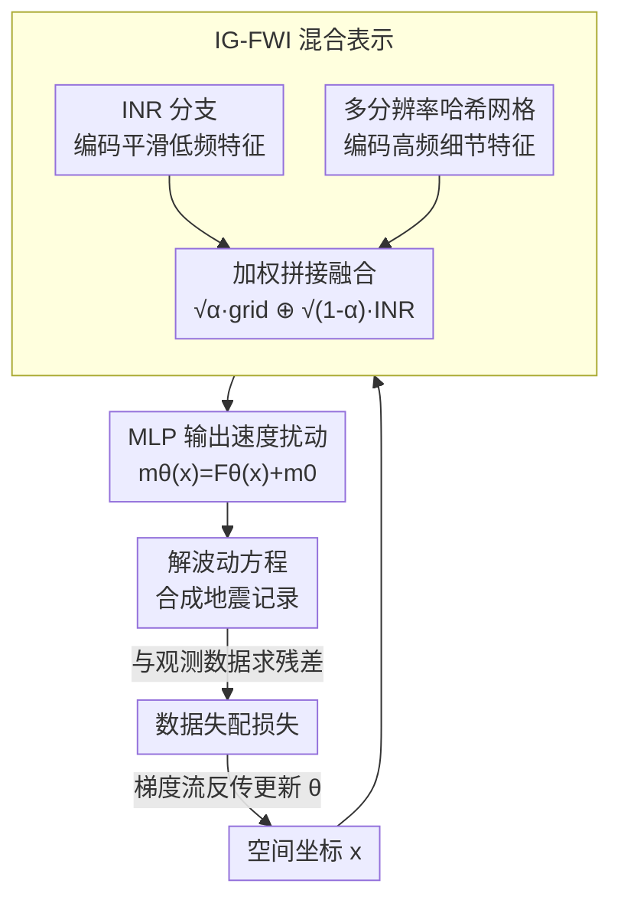

# 揭示连续表示全波形反演的机制：一个基于波的神经正切核框架

**会议**: ICLR 2026  
**OpenReview**: [https://openreview.net/forum?id=blqYa21WOv](https://openreview.net/forum?id=blqYa21WOv)  
**领域**: 地球科学 / 全波形反演 / 神经正切核理论  
**关键词**: 全波形反演, 连续表示, 神经正切核, 特征值衰减, 隐式神经表示

## 一句话总结
本文把神经正切核（NTK）理论扩展到全波形反演（FWI），提出"基于波的 NTK"统一刻画传统 FWI 与连续表示 FWI（CR-FWI），用其特征值衰减速率解释了"为什么 INR 表示更鲁棒却高频收敛慢"，并据此设计出 INR 与多分辨率网格混合的 IG-FWI，在鲁棒性与收敛速度之间取得更优权衡。

## 研究背景与动机
**领域现状**：全波形反演（FWI）是地震成像中的核心反问题——它把波动方程当约束，通过迭代最小化"观测地震记录"与"波动方程合成记录"之间的失配，来反演地下速度/密度模型。它理论分辨率最高，被广泛用于油气勘探、医学成像、无损检测等。近年兴起的连续表示 FWI（CR-FWI）用坐标神经网络（如隐式神经表示 INR）把速度模型参数化为一个连续函数 $m_\theta(x)=F_\theta(x)+m_0(x)$，再去拟合数据。

**现有痛点**：传统 FWI 对初始模型精度"臭名昭著地敏感"——初始模型不够准就会陷入 cycle-skipping（半周期波形错配导致反演彻底失败），而获得准确平滑的初始模型本身极难。CR-FWI 经验上确实缓解了对初始模型的依赖（哪怕用常数初始模型也能反演出像样结果），但它表现出两个一直没被理论解释清楚的现象：一是**鲁棒**——常数初始模型、劣质数据下仍能恢复；二是**收敛慢**——尤其高频分量收敛慢，要更多迭代才能到高精度。

**核心矛盾**：鲁棒性与高频收敛速度之间存在一个 trade-off，而 CR-FWI 为什么会落在"鲁棒但慢"这一端、其内在机制是什么，此前完全是黑箱。没有理论就无法有目的地设计"恰到好处"的表示。

**本文目标**：拆成两个子问题——(i) 能否建立统一理论框架，解释传统 FWI 与 CR-FWI 在鲁棒性和收敛性上的差异？(ii) 是否存在一种连续表示，能在鲁棒性与收敛性之间取得平衡？

**切入角度**：作者借鉴深度学习里分析无限宽网络训练动力学的神经正切核（NTK）。标准 NTK 在无限宽时收敛到一个确定核，其特征值衰减决定各频率分量的收敛速度（频率原则/谱偏差）。FWI 的训练同样可以沿核的特征向量方向分解，于是"特征值衰减速率"恰好是连接表示形式与收敛/鲁棒行为的桥梁。

**核心 idea**：把 NTK 嵌进波动方程约束里，构造"基于波的 NTK"，用它的特征值衰减谱统一解释 FWI 的鲁棒-收敛二难，再反过来设计衰减速率被刻意调控的新表示（顶点是 INR+网格混合的 IG-FWI）。

## 方法详解

### 整体框架
本文有"理论"和"方法"两条线。理论线：先为传统 FWI 推出波核 $\Theta_{\text{wave}}$（Prop. 2.1），再为 CR-FWI 推出基于波的 NTK $\Theta^{\text{ntk}}_{\text{wave}}$（Prop. 3.1），两者用同一框架统一（波核是基于波 NTK 在 Dirac 核下的退化特例），然后证明两条核心定理——它们在 FWI 非线性下都**不是**确定核（Thm 4.1），且 CR-FWI 的特征值衰减不慢于传统 FWI（Thm 4.2）。方法线：受"特征值衰减速率↔优化行为"启发，提出一族衰减速率被定制的连续表示（LR-FWI、MPE-FWI），最终给出在 INR 与多分辨率网格之间折中的 IG-FWI（Thm 5.1/5.2 保证其衰减介于两者之间）。

下图是 CR-FWI 的训练回路，以本文主推的 IG-FWI 表示为例：坐标 $x$ 输入双分支表示得到速度扰动，解波动方程合成地震记录，与观测求残差形成失配损失，再反传更新网络参数，循环至收敛。

值得强调的是，基于波的 NTK 不是图里的某个流水线节点，而是分析整个回路"沿哪个频率方向收敛多快"的理论透镜——它指导了为什么要把 INR 和网格混起来。

### 关键设计

**1. 基于波的 NTK：把波动方程约束嵌进神经正切核，统一传统与连续表示 FWI**

传统 FWI 的训练动力学此前缺乏 NTK 视角的刻画。作者从连续时间梯度流 $\frac{\partial m}{\partial \tau}=-\frac{\delta\mathcal{J}}{\delta m}$ 出发，对合成数据 $u^D_{\text{syn}}$ 求演化，证明传统 FWI 的合成数据演化由"波核"驱动（Prop. 2.1）：$\Theta_{\text{wave}}=\int_U \frac{\delta G}{\delta m(y)}\cdot\frac{\delta G}{\delta m(y)}\,dy$，它是逐点（point-wise）的灵敏度核乘积，因而会带来"拟合一个数据点反而损害另一个点"的不协调更新与严重串扰。换到 CR-FWI，优化变量从离散速度模型 $m$ 变成网络参数 $\theta$，作者证明此时演化由基于波的 NTK 驱动（Prop. 3.1）：

$$\Theta^{\text{ntk}}_{\text{wave}}=\int_U\int_U \frac{\delta G}{\delta m(y)}\cdot\frac{\delta G}{\delta m(z)}\cdot K_\tau(y,z;\theta)\,dy\,dz,$$

其中 $K_\tau(y,z;\theta)=\sum_i \frac{dm_\theta(y)}{d\theta_i}\frac{dm_\theta(z)}{d\theta_i}$ 正是网络的标准 NTK。关键在于：当把 $K_\tau$ 退化成 Dirac 核 $\delta(y-z)$，基于波的 NTK 就退回波核——于是两类 FWI 被纳入同一框架。与逐点的 Dirac 核不同，基于波的 NTK 是一个平滑、依赖网络结构的核，它通过不同速度点灵敏度核的乘积带来"全局协同更新"，这正是 CR-FWI 能缓解 cycle-skipping 的机制根源。

**2. 特征值衰减解释鲁棒-收敛二难：动态核 + 衰减更快**

有了核还不够，作者证明两条出人意料的定理来落地解释。其一（Thm 4.1）：与标准 NTK 不同，基于波的 NTK 即便网络宽度趋于无穷，在初始化时也不收敛到确定核、训练中也持续变化——根因是 FWI 的非线性（波核随速度模型变化而变）。但在"准静态"假设下，足够小的训练窗口内速度模型变化很小，核近似常数，于是其特征谱仍可定量估计局部收敛速率。把核做谱分解 $K=\sum_k\lambda_k\phi_k\otimes\phi_k$ 代入演化方程，可得数据失配沿各谱方向按 $e^{-\Lambda\tau}$ 衰减：**特征值越大的方向误差下降越快**。其二（Thm 4.2）：在 $\|K_\tau\|\le1$ 下，基于波 NTK 的特征值逐项不大于波核的特征值（$\mu_j\le\lambda_j$），即连续表示带来的平滑核"截断"了高频收敛方向。这两条合起来就讲清了机制：大特征值对应的低频分量被快速优化，从而缓解 cycle-skipping、降低对初始模型的依赖（这就是鲁棒）；而高频分量对应急剧衰减的谱尾、小特征值，收敛自然就慢（这就是高频慢）。

**3. 按需定制衰减速率的表示族：LR-FWI 与 MPE-FWI**

既然衰减速率决定优化行为，就可以反向设计表示来"调"这个速率。LR-FWI 利用地下参数固有的低秩与非局部相似性，用张量分解（如 Tucker/CP）把速度模型拆开、各低维因子分别用一维 INR 表示，$F_\theta(x)=F_{\theta_1}(x_1)\times C\times F_{\theta_2}(x_2)^\top$；它编码了平滑/低秩先验，经验上获得合适的衰减速率从而加速高频收敛（严格证明因张量积结构复杂留作未来工作）。MPE-FWI 用多分辨率哈希网格编码 $h(x)$ 取代纯 MLP，再过一个轻量 INR 输出速度值；Thm 5.1 证明其基于波 NTK 的特征值逐项不小于 INR 的（$\lambda_i(\Theta^{\text{ntk}}_{\text{MPE}})\ge\lambda_i(\Theta^{\text{ntk}}_{\text{INR}})$），即整条谱被抬高、衰减更慢，因而高频收敛更快、平滑初始模型下精度更高——但代价是鲁棒性下降（常数初始模型下 MPE-FWI 反而崩，见实验表）。这恰好说明"单纯抬高谱"不够，需要更精巧的折中。

**4. IG-FWI 混合表示：让特征值衰减落在 INR 与网格之间**

这是本文的方法落脚点。INR 衰减太快（鲁棒但高频弱），MPE/传统 FWI 衰减太慢（高频强但不鲁棒），作者直接把两者融合：用一个 tiny INR 把平滑特征编进隐空间，与多分辨率哈希网格特征按权重拼接，再过一个 tiny MLP 融合：

$$F_\theta(x)=\text{MLP}\big(v(x)\big),\quad v(x)=\sqrt{\alpha}\cdot h(x)\ \oplus\ \sqrt{1-\alpha}\cdot I(x),$$

其中 $h(\cdot)$ 是哈希网格编码、$I(\cdot)$ 是 tiny INR，$\alpha$ 是权重因子。Thm 5.2 证明在 INR 与网格梯度范数可比的归一化下，IG-FWI 的特征值满足 $\lambda_i(\Theta^{\text{ntk}}_{\text{INR}})\le\lambda_i(\Theta^{\text{ntk}}_{\text{IG}})\le\lambda_i(\Theta^{\text{ntk}}_{\text{MPE}})$——衰减速率恰好被夹在两者之间。于是 IG-FWI 同时继承了 INR 的鲁棒（低频快收敛、抗 cycle-skipping）和 MPE 的高频收敛优势，得到更准也更稳的反演。

### 损失函数 / 训练策略
目标函数即 PDE 约束下的数据失配 $\mathcal{J}(\theta)=\frac{1}{2}\|u^D_{\text{syn}}(\theta)-u^D_{\text{obs}}\|^2_{L^2(D\times T)}$，约束为合成数据须满足波动方程 $u^D_{\text{syn}}(\theta)=G[m_\theta]$；波动方程用有限差分数值求解，优化用梯度下降，速度模型重参数化为 $m_\theta(x)=F_\theta(x)+m_0(x)$。IG-FWI 的关键超参是网格分辨率、INR 频率基与权重因子 $\alpha$。

## 实验关键数据

### 主实验
在 Marmousi、SEG/EAGE Overthrust、Salt、2004 BP 等模型上，用不同初始模型（smooth/constant）及退化数据场景（高斯噪声、缺低频、稀疏炮）对比 MSE（越低越好，节选自 Tab. 1）：

| 数据集/场景 | ADFWI(传统) | IFWI(INR) | WinFWI(INR) | MPE-FWI | LR-FWI | IG-FWI(本文) |
|------|------|------|------|------|------|------|
| Marmousi-Smooth | 0.2132 | 0.1907 | 0.2013 | 0.1427 | 0.1638 | **0.1423** |
| Marmousi-Constant | 1.1522 | 0.9474 | 0.4689 | 2.2266 | 0.2893 | **0.2961**(次优) |
| Marmousi-缺低频 | 0.4975 | 0.3358 | 0.3460 | 0.3322 | 0.2276 | **0.1846** |
| Marmousi-稀疏炮 | 0.4730 | 0.3483 | 0.3239 | 0.3338 | 0.2641 | **0.1654** |
| Overthrust-Constant | 1.3364 | 0.6432 | 0.5738 | 1.2887 | **0.1592** | 0.5724 |
| 2004 BP-Constant | 0.4281 | 0.1412 | 0.1083 | 1.602 | 0.1248 | **0.0843** |

可以看到：传统 FWI 与 MPE-FWI 在 smooth 初始模型下高频收敛快，但一到 constant 初始模型就大幅劣化（MPE-FWI 在 Marmousi-Constant 甚至飙到 2.23）；纯 INR 方法在 constant 下稳但精度一般；IG-FWI 在多数场景拿到最优或次优，LR-FWI 在个别 constant 场景最优，整体印证"衰减速率折中→鲁棒-收敛兼得"。

### 消融实验

| 配置 | 现象 | 说明 |
|------|------|------|
| 网格分辨率过高/过低 | 反演质量下降 | MPE 网格尺度需适中，与理论一致 |
| INR 频率基过高/过低 | 反演质量下降 | INR 频率设置影响谱偏差 |
| 权重因子 $\alpha$ 扫描 | IG-FWI 对 $\alpha$ 较鲁棒 | 融合权重在较宽区间稳定 |

### 关键发现
- **特征值衰减谱排序**（Fig. 5c，Obs 2）：传统 FWI 衰减最慢，MPE 次之，INR 最快；IG-FWI 落在 MPE 与 INR 之间，LR-FWI 处于中间偏缓区——与 Thm 4.2/5.1/5.2 完全吻合，理论被实测直接验证。
- **核非平稳性**（Obs 1）：一维 FWI 实验显示基于波的 NTK 在初始化和训练中都不收敛到固定核，即便宽度趋于无穷，支撑 Thm 4.1。
- **鲁棒-收敛二难落地**（Obs 3-5）：传统/MPE 高频快但对初始模型与数据质量极敏感；INR 鲁棒但分辨率/收敛受限；IG-FWI 与 LR-FWI 在两端之间取得平衡，并在更真实的 2014 Chevron 盲数据与 3D Overthrust 上验证了可扩展性。

## 亮点与洞察
- **把 NTK 理论搬进 PDE 约束反问题**：这是首个从 NTK 角度分析 FWI 的工作，且揭示了"波动方程非线性导致核非平稳"这一与标准 NTK 截然不同的性质，为后续用随机分析研究 PDE 约束非线性反问题开了口子。
- **用一把"特征值衰减"的尺子统一解释鲁棒与收敛**：把地球物理里经验已知的"INR 鲁棒但慢"现象，归结为谱衰减快慢，机制清晰且可证明——这种"现象→谱→可控设计"的思路可迁移到其他 INR/PINN 类反问题。
- **理论直接指导架构**：IG-FWI 不是拍脑袋的混合，而是被 Thm 5.2 的夹逼不等式"保证"了衰减落在期望区间，理论与方法咬合得很紧。

## 局限与展望
- **LR-FWI 缺严格证明**：作者承认张量积结构复杂，LR-FWI 的特征值衰减速率目前只有经验验证、无严格数学证明，留待未来基于张量分解理论补全。
- **准静态假设的约束**：Thm 4.1 指出核全程非平稳，局部收敛分析依赖"足够小窗口内速度模型变化小"的准静态近似，全局训练轨迹的随机性刻画（需 SDE/概率界工具）仍是未来方向。
- **权重 $\alpha$ 与谱位置的精确映射未给**：IG-FWI 衰减被夹在两端之间，但"给定目标鲁棒-收敛点该取多大 $\alpha$"缺乏闭式指导，目前靠扫参。
- 实验主要在合成/半真实地球物理模型，医学成像、无损检测等同属 FWI 的应用域未实测。

## 相关工作与启发
- **vs 传统 FWI（ADFWI/MS-FWI 等）**：传统方法在离散速度模型上直接优化，对应 Dirac 波核、衰减最慢，高频快但极度依赖准确初始模型；本文用神经表示引入平滑核，以可证明的方式缓解了这一敏感性。
- **vs 纯 INR 的 CR-FWI（IFWI/WinFWI）**：它们经验上鲁棒却高频慢、且机制不清；本文不仅给出"为什么"（谱衰减最快），还指出其高频短板可被网格分量补偿。
- **vs MPE/网格表示**：单纯多分辨率网格抬高整条谱、高频强但不鲁棒；IG-FWI 把它与 INR 融合，用 $\alpha$ 把谱衰减拉回折中区间，是对"网格 vs 隐式表示"之争的一个理论化调和。

## 评分
- 新颖性: ⭐⭐⭐⭐⭐ 首次把 NTK 理论扩展到波动方程约束的 FWI，并据此设计表示，理论与方法都新。
- 实验充分度: ⭐⭐⭐⭐ 覆盖多个标准地球物理模型、多种初始模型与退化场景，并验证谱衰减理论；但部分仍是合成数据。
- 写作质量: ⭐⭐⭐⭐ 理论推导清晰、"现象→谱→设计"主线连贯，定理较密集需要一定背景。
- 价值: ⭐⭐⭐⭐⭐ 给 CR-FWI 的鲁棒-收敛二难提供了首个可证明的机制解释，并落到可用的 IG-FWI 方法。

<!-- RELATED:START -->

## 相关论文

- [\[ICLR 2026\] OmniField: Conditioned Neural Fields for Robust Multimodal Spatiotemporal Learning](omnifield_conditioned_neural_fields_for_robust_multimodal_spatiotemporal_learnin.md)
- [\[ICLR 2026\] TianQuan-S2S：通过引入气候态构建次季节-季节全球天气预报模型](tianquan-s2s_a_subseasonal-to-seasonal_global_weather_model_via_incorporate_clim.md)
- [\[ICLR 2026\] The Seismic Wavefield Common Task Framework](the_seismic_wavefield_common_task_framework.md)
- [\[ICLR 2026\] RainPro-8: An Efficient Deep Learning Model to Estimate Rainfall Probabilities Over 8 Hours](rainpro-8_an_efficient_deep_learning_model_to_estimate_rainfall_probabilities_ov.md)
- [\[ICML 2026\] Scaling Laws of Global Weather Models](../../ICML2026/earth_science/scaling_laws_of_global_weather_models.md)

<!-- RELATED:END -->
