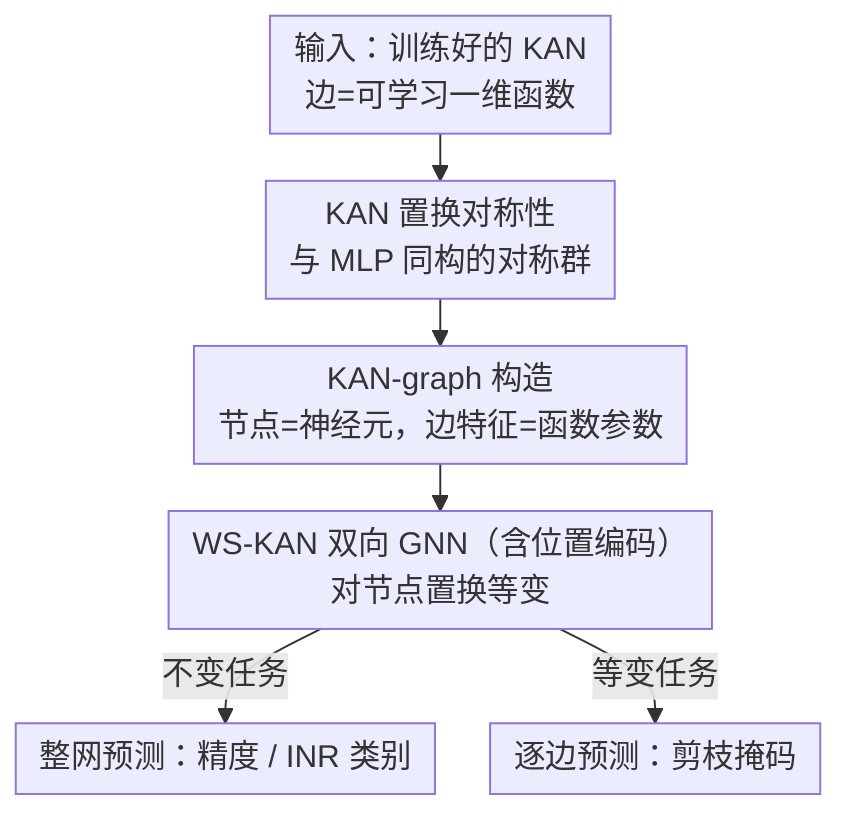

# A Graph Meta-Network for Learning on Kolmogorov–Arnold Networks

**会议**: ICLR 2026  
**OpenReview**: [https://openreview.net/forum?id=ONpyYavBqR](https://openreview.net/forum?id=ONpyYavBqR)  
**代码**: https://github.com/BarSGuy/KAN-Graph-Metanetwork  
**领域**: 图学习 / 权重空间学习 / Kolmogorov–Arnold 网络  
**关键词**: 权重空间模型, KAN, 图元网络, 置换对称性, 等变 GNN

## 一句话总结
本文证明 Kolmogorov–Arnold 网络（KAN）和 MLP 共享同样的神经元置换对称性，据此把一个训练好的 KAN 编码成「KAN-graph」（节点是神经元、边携带那条边上一维函数的参数），并设计首个直接在 KAN 上做学习的权重空间架构 WS-KAN（一个双向消息传递 GNN），在预测精度、分类 INR、预测剪枝掩码等任务上大幅超过对称性无关的基线。

## 研究背景与动机
**领域现状**：权重空间模型（weight-space model / 元网络）把另一张神经网络的参数当成「数据」直接输入，用一次前向就能完成「预测该网络在新数据集上的精度」「生成一组新权重」「分类隐式神经表示（INR）」等任务。这类模型的核心难点是架构设计：把所有权重拉平成一个长向量喂给 MLP，效果很差。

**现有痛点**：拉平的做法忽略了神经元置换对称性——交换某个隐藏层里两个神经元的顺序，网络算出来的函数完全不变，但拉平后的向量却变了，于是 MLP 会对「同一个网络的不同等价排列」给出不同预测。已有改进要么在线性层里做权重共享，要么把网络当成计算图、用 GNN（图元网络）天然尊重这些对称性，但这些工作只覆盖了 MLP、CNN、Transformer。

**核心矛盾**：KAN 是一类全新的网络范式——它的边上不是标量权重，而是**可学习的一维函数**（本文按原始 KAN 用 B-spline 参数化），保留万有逼近能力的同时带来更好的参数效率、更快的 scaling 和更强的可解释性。正因为它的「权重」是函数而非标量，已有针对标量参数网络的对称性分析和权重空间架构完全用不上，KAN 上的权重空间学习是一片空白。

**本文目标**：（1）搞清 KAN 有没有置换对称性、是什么；（2）找到一种能紧凑编码 KAN、并对这些对称性不变的表示；（3）造一个能直接在这种表示上学习、且尊重对称性的架构。

**切入角度**：作者观察到，尽管 KAN 的边携带函数而非标量，但「重排隐藏层神经元不改变所算函数」这件事和 MLP 一模一样——只要把对函数矩阵的行列置换定义清楚，对称群就和 MLP 完全相同。既然对称性结构一致，就能复用「网络即图、用等变 GNN 处理」这条成熟路线。

**核心 idea**：把 KAN 表示成一张图（节点=神经元，边特征=该边一维函数的参数），用一个对节点置换等变的 GNN（WS-KAN）去处理它，从而把图元网络这套范式首次搬到 KAN 上。

## 方法详解

### 整体框架
方法分三步走：先**证明 KAN 也具有和 MLP 相同的隐藏神经元置换对称性**（这是后续一切设计的理论依据）；再把一个训练好的 KAN **转成 KAN-graph**——有向图，节点对应神经元，每条边携带那条边上一维函数 $\phi^l_{p,q}$ 的可学习参数作为边特征；最后用 **WS-KAN**（一个带前向+反向双向消息传递、并加位置编码的 GNN）在 KAN-graph 上学习，输出可以是「整网一个标量预测」（不变任务，如精度预测、INR 分类）或「每条边一个预测」（等变任务，如剪枝掩码）。由于 GNN 对节点数和图结构不敏感，同一个训练好的 WS-KAN 可以直接作用到训练时没见过的、更宽或更深的 KAN 上。

### 关键设计

**1. KAN 也具有置换对称性：和 MLP 同构的对称群**

要把「网络即图、GNN 处理」这条路线搬到 KAN，第一步必须先说清 KAN 到底有哪些不改变函数的参数变换。作者把对一维函数矩阵 $\phi$ 的置换作用定义为 $(P_1\phi P_2)_{p,q}=\phi_{\sigma_1^{-1}(p),\sigma_2(q)}$，即按给定置换重排函数矩阵的行和列。在此定义下命题 3.1 证明：一个 $L$ 层 KAN 的对称群正是中间维度对应的对称群直积 $G:=S_{d_1}\times\cdots\times S_{d_{L-1}}$，对每个隐藏层 $l$ 同时对 $\phi^l$ 的列和 $\phi^{l+1}$ 的行施加同一置换 $P_l$，所算函数 $f_\theta(x)$ 保持不变。关键在于：这个对称群和经典 MLP 的**完全一致**，且与一维函数用什么方式参数化无关。这一结论是整篇文章的地基——既然对称性结构和 MLP 一样，就能直接复用图元网络这套思路。

**2. KAN-graph：把一维函数「装进」边特征**

有了对称性结论，就要找一个对这些置换不变的表示。作者构造有向图 $G=(V,E)$：节点集 $V$ 是神经元，边集 $E$ 是层间连接（邻接矩阵极度稀疏，非零只出现在相邻层之间的超对角块）。难点在于「边权」是函数不是标量。作者沿用原始 KAN 的 B-spline 参数化：每条一维函数写成 $\psi(x)=w_b\,b(x)+w_s\,B(x)$，其中 $b(x)=\mathrm{silu}(x)$，$B(x)=\langle c,\mathbf B(x)\rangle=\sum_i c_i B_i(x)$ 是固定 B-spline 基的线性组合。于是把这条函数的全部可学习参数「收集」进一个向量 $\tilde\phi^l_{p,q}:=[w^l_{b;p,q},\,w^l_{s;p,q},\,c^l_{p,q}]$，作为对应边的特征 $e^l_{p,q}=\tilde\phi^l_{p,q}$。这样隐藏层内神经元置换恰好对应 KAN-graph 节点的置换，图（即带特征的邻接结构）保持不变——表示天然把「不该被区分的等价 KAN」映射成同一张图。

**3. WS-KAN：前向+反向双向消息传递的等变 GNN（含位置编码）**

在 KAN-graph 上学习，作者用 Gilmer 等的消息传递框架，并刻意做成**双向**：每个节点同时聚合「出边邻居」（前向 $v_i^F$）和「入边邻居」（反向 $v_i^B$），边特征也按两端点状态刷新，最后 $v_i\leftarrow \mathrm{MLP}^{(3)}_v(v_i,v_i^F,v_i^B)$ 把自身、前向、反向三路信息融合。虽然 KAN 计算图本是单向（从前层指向后层），但作者发现额外让信息反向流动能显著提升性能。为了打破 KAN-graph 里可能出现的「人为对称」，再给每个节点和边加**位置编码**：同一中间层的所有节点共享一个位置嵌入，而输入、输出节点各自有独立嵌入（因为置换输入/输出节点会真的改变网络函数，不能当作对称），每条边则按其两端点获得唯一标识。直观地说，隐藏层内重排神经元不改变带位置特征的图，而把首层节点和末层节点对调则会改变它——位置编码让 GNN 既尊重真对称、又不被假对称误导。整套架构对节点置换等变，因此既能做不变预测（图级 readout）也能做等变预测（逐边输出）。

**4. 表达力理论：WS-KAN 能模拟 KAN 的前向传播**

施加群等变约束往往会削弱表达力，所以作者要回答「这个设计是不是太弱了」。权重空间文献的标准做法是证明架构能**模拟（逼近）输入网络的前向传播**。引理 4.1 先证：在温和假设下，存在一个单隐层 MLP 能在任意紧致域上以任意精度逼近 KAN 里那条 B-spline 一维函数 $\psi(\cdot)$。命题 4.2 据此证明：对任意 KAN $f_\theta$、任意 $\varepsilon>0$，存在一个 WS-KAN 使得在输入域上 $\sup_x |\mathrm{WS\text{-}KAN}(G)-f_\theta(x)|<\varepsilon$。证明思路是把 KAN 看成 $L$ 层连续函数的复合，用引理 4.1 让 WS-KAN 逐层逼近每一层、再借消息传递机制把逐层逼近拼起来。这条结论说明等变约束没有牺牲掉模拟前向所需的表达力，也为更强的函数逼近定理铺路。

### 损失函数 / 训练策略
不变任务（INR 分类、精度预测）对 KAN-graph 做图级聚合后输出整网预测；等变任务（剪枝）对每条边独立输出二分类掩码。每个实验报告 3 个随机种子的均值与标准差，测试结果按验证集性能选取。

## 实验关键数据

作者构造了首个「KAN 模型动物园」（model zoo）作为基准：用 MNIST / F-MNIST / K-MNIST / CIFAR-10 和一个合成数据集训练出大量 KAN，并生成对应的 KAN-graph。基线分两类——标准基线 MLP、MLP+置换增广、MLP+对齐、DMC（卷积作用于向量化参数）；消融基线 DS（DeepSets 作用于边特征集合，对 KAN 对称之外的更多置换也不变、且忽略图拓扑）、SetTrans（Transformer 作用于边集合，注意力随神经元数平方增长，只在小 KAN 上可行）。

### 主实验：INR 分类
为每张图像独立训一个 KAN-based INR（坐标→像素值），再用权重空间模型只看 INR 的参数预测原图类别。

| 方法 | MNIST | F-MNIST | CIFAR-10 |
|------|-------|---------|----------|
| MLP | 34.1 | 41.3 | 16.8 |
| MLP + Aug. | 62.7 | 63.0 | 28.2 |
| MLP + Align. | 81.0 | 73.6 | 30.0 |
| DMC | 73.4 | 73.1 | 33.0 |
| DS (Ours) | 59.1 | 65.9 | 23.2 |
| SetTrans (Ours) | 87.5 | 80.2 | 34.3 |
| **WS-KAN (Ours)** | **94.3** | **84.6** | **42.2** |

WS-KAN 大幅领先；SetTrans 第二，说明显式利用对称性有用，但它捕获的对称比 KAN 真实对称更宽因而次优；MLP 三个变体呈现 `Align. > Aug. > 朴素` 的稳定序，验证了作者的对齐技术有效。

### 精度预测与剪枝
直接从 KAN 参数预测其测试精度（为增加难度，给训练数据注入标签噪声以拉开 KAN 精度差异）；以及预测一个数据驱动剪枝算法（Oracle-prune）给出的逐边剪枝掩码。

| 任务 / 指标 | 数据集 | DS（次优） | **WS-KAN** |
|------|------|------|------|
| 精度预测 R² (×10²,↑) | F-MNIST | 89.73 | **92.27** |
| 精度预测 R² (×10²,↑) | K-MNIST | 94.07 | **95.69** |
| 剪枝掩码 ROC-AUC (%,↑) | MNIST | 95.45 | **99.54** |
| 剪枝掩码 ROC-AUC (%,↑) | K-MNIST | 95.45 | **99.46** |

剪枝是逐边的**等变**任务，WS-KAN 在 Accuracy 与 ROC-AUC 上全面领先，下游剪枝最贴近 Oracle 的「精度–稀疏度」权衡，且比逐次数据驱动的 Oracle-prune 快约**五个数量级**。

### 消融与关键发现
- **DS 几乎总是次优**：把消融基线 DS（DeepSets over 边特征）排到第二，说明「尊重 KAN 对称」这件事本身就带来大部分收益；而 WS-KAN 进一步利用图拓扑，才拿到最好成绩。
- **双向消息传递与位置编码**都被单独消融（附录 C.4），二者都有正贡献——反向信息流和打破假对称的 PE 缺一掉点。
- **OOD 泛化（Table 2）**：只在隐藏宽 $h=32$ 上训练的 WS-KAN，能直接用到 $h\in\{48,64,80,96\}$ 的更宽 KAN 上；F-MNIST 几乎不掉（$84.6\to82.2$），MNIST 随分布偏移增大而退化（$94.3\to57.1$）。这是 GNN 架构对图大小不敏感带来的天然好处。

## 亮点与洞察
- **「对称性同构」是全文支点**：先证明 KAN 和 MLP 共享同一对称群，整条「图表示 + 等变 GNN」的成熟路线就被一次性搬了过来——一个干净的理论观察直接解锁了一整套方法论。
- **把「函数当边权」收成向量**这一步很关键：B-spline 参数 $[w_b,w_s,c]$ 自然拼成边特征，使得「函数型权重」也能被标准消息传递处理，思路可迁移到其它一维函数参数化（如 Fourier/wavelet KAN）。
- **位置编码区分「真对称 vs 假对称」**：隐藏层内共享嵌入、输入输出节点独立嵌入，精准刻画了「哪些置换该不变、哪些不该」，这套区分对任意权重空间图模型都通用。
- **剪枝即一次前向**：传统剪枝靠激活/梯度反复跑数据，WS-KAN 学会从参数直接预测掩码，把数据密集型流程压成单次前向、快五个数量级——是「网络参数即数据」范式的一个有说服力的落地。

## 局限与展望
- **只覆盖 B-spline KAN**：边特征收集器是为 B-spline 参数化量身定做的，换成其它一维函数参数化需要重新定义边特征，泛化性待验证。
- **OOD 在分布偏移大时显著退化**：MNIST 上从 $h=32$ 外推到 $h=96$ 精度从 94 跌到 57，说明「能跑」不等于「跑得好」，宽度外推还需专门处理。
- **基准规模有限**：模型动物园建立在 MNIST 类小数据集 + 小 KAN 上，SetTrans 因平方复杂度只能在小图上比，更大 KAN、更真实任务上的结论仍是开放问题。
- **理论止步于「模拟前向」**：命题 4.2 只保证能逼近前向传播，距离更强的函数逼近定理还有距离，作者也把它定位为铺垫。

## 相关工作与启发
- **vs 针对 MLP/CNN 的图元网络（Lim et al. 2024; Kofinas et al. 2024）**: 他们把标量权重网络当计算图用 GNN 处理；本文指出 KAN 的边是函数而非标量，需要新的「函数→边特征」编码与对称性分析，是把这条路线首次扩展到函数型权重网络。
- **vs 权重共享线性层（Navon et al. 2023; Zhou et al. 2023）**: 那类方法在线性层里硬编码对称，难以适配 KAN 这种异构参数；本文用 GNN 走图路线，天然对图大小/拓扑不敏感，才换来对更宽 KAN 的零样本外推。
- **vs DeepSets/SetTrans 基线**: 它们对边特征集合不变，但忽略图拓扑、且把比 KAN 真实对称更宽的置换也当成不变；本文显式建模图结构，证明「恰好尊重 KAN 对称、不多不少」才是最优。

## 评分
- 新颖性: ⭐⭐⭐⭐⭐ 首个 KAN 权重空间架构，对称性分析 + KAN-graph + 表达力理论自成闭环
- 实验充分度: ⭐⭐⭐⭐ 三类任务 + OOD + 充分消融，但基准局限于小数据/小 KAN
- 写作质量: ⭐⭐⭐⭐⭐ 从对称性到图表示到 GNN 的推导逻辑清晰、图示到位
- 价值: ⭐⭐⭐⭐ 随 KAN 普及，理解/比较/利用已训 KAN 的权重空间工具会越来越有用

<!-- RELATED:START -->

## 相关论文

- [\[ICLR 2026\] FS-KAN: Permutation Equivariant Kolmogorov-Arnold Networks via Function Sharing](fs-kan_permutation_equivariant_kolmogorov-arnold_networks_via_function_sharing.md)
- [\[ICLR 2026\] Learning from Historical Activations in Graph Neural Networks](learning_from_historical_activations_in_graph_neural_networks.md)
- [\[ICML 2025\] GrokFormer: Graph Fourier Kolmogorov-Arnold Transformers](../../ICML2025/graph_learning/grokformer_graph_fourier_kolmogorov-arnold_transformers.md)
- [\[ICLR 2026\] Latent Geometry-Driven Network Automata for Complex Network Dismantling](latent_geometry-driven_network_automata_for_complex_network_dismantling.md)
- [\[ICLR 2026\] Are We Measuring Oversmoothing in Graph Neural Networks Correctly?](are_we_measuring_oversmoothing_in_graph_neural_networks_correctly.md)

<!-- RELATED:END -->
