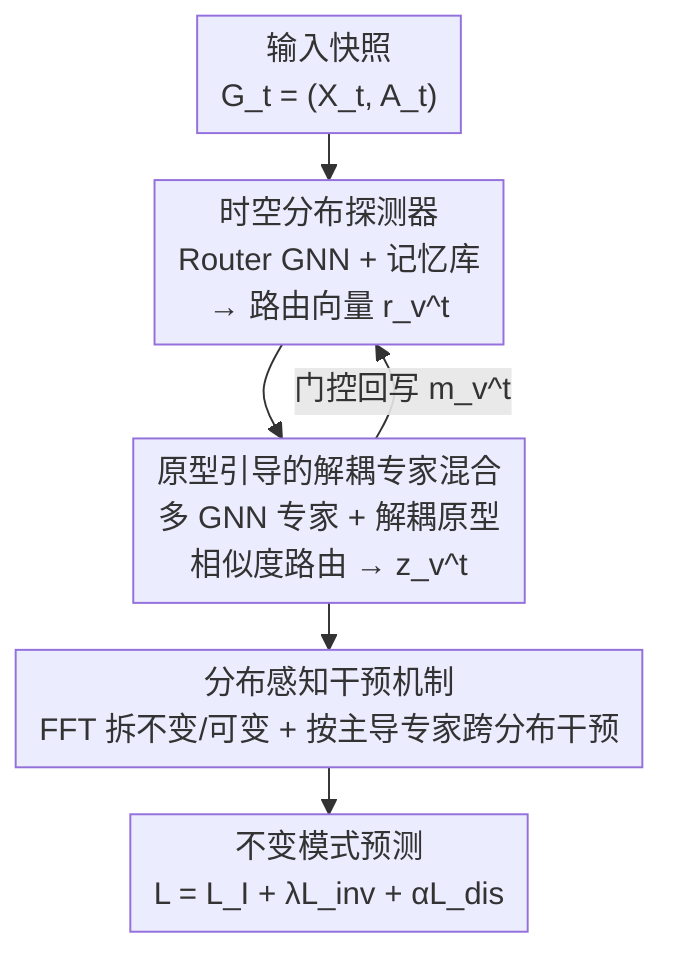

# Adaptive Mixture of Disentangled Experts for Dynamic Graph Out-of-Distribution Generalization

**会议**: ICLR 2026  
**OpenReview**: [https://openreview.net/forum?id=q0O5LO7X4I](https://openreview.net/forum?id=q0O5LO7X4I)  
**代码**: https://github.com/haibo12/AdaMix （论文承诺开源）  
**领域**: 图学习 / 动态图 / OOD 泛化 / 专家混合  
**关键词**: 动态图、分布偏移、自适应架构、专家混合（MoE）、解耦原型

## 一句话总结
针对动态图上"分布偏移本身会随时间演化"这一现象，本文提出 AdaMix：用一个时空分布探测器实时感知每个时刻的偏移，再用原型引导的解耦专家混合（多种 GNN 架构当专家）按偏移自适应路由，最后用分布感知干预机制挖掘不变模式，在真实与合成动态图数据集上显著超过固定架构的 SOTA。

## 研究背景与动机
**领域现状**：动态图 OOD 泛化（dynamic graph OOD generalization）的目标，是在图结构和节点特征随时间演化、训练/测试分布不一致的情况下仍能稳定预测。主流做法是"提取不变模式（invariant pattern）"——找出预测能力跨分布稳定的那部分结构与特征。代表方法 DIDA 用解耦的时空图注意力网络把节点轨迹拆成不变与可变两部分，再对可变部分做随机干预，逼模型只依赖不变模式；SILD 则进一步把不变模式建模搬到谱域。

**现有痛点**：这些方法清一色用**固定架构**（fixed-architecture）去抽不变模式。作者观察到一个被忽视的事实：动态图里的分布偏移不是静止的，而是**持续演化**的。比如学术合作网络里，论文数在涨（图变大）、引用关系在变密（节点度上升）、研究领域在分化（特征多样性增加）——偏移的"形态"本身在随时间改变（图 1 在 Collab 数据集上实测了节点数和平均度随时间单调上升）。

**核心矛盾**：最优架构和底层数据分布是绑定的。作者在 SILD 上换 GAT / GATv2 两种骨干跑（图 2），发现两者在不同时间段交替领先——说明**不同时刻可能需要不同架构**。那么一个一成不变的固定架构，注定在演化偏移的某些时刻是次优的。这是固定架构设计的根本天花板。

**本文目标**：分解为三个子问题——(1) 如何探测并刻画演化中的分布偏移，给架构决策提供信号；(2) 如何按不同的偏移特性动态路由不同的专家架构；(3) 如何保证这套自适应专家混合真能挖到不变模式。

**切入角度**：既然不同时刻要不同架构，那就别再固定架构，而是引入一个**自适应架构**（adaptive-architecture）——用专家混合（MoE）随时间动态调整模型架构。作者还给了理论命题：在不变性约束下，若存在两个时刻其最优架构不同，则自适应架构能比任何固定架构更有效地捕获不变/可变模式（命题 1）。

**核心 idea**：用"随分布偏移自适应路由的解耦专家"代替"固定架构"，来挖动态图上的时空不变模式——据作者所知，这是第一个从架构视角处理动态图分布偏移的工作。

## 方法详解

### 整体框架
AdaMix 处理的是动态图 $\mathcal{G}=\{G_t\}_{t=1}^T$，每个快照 $G_t=(X_t, A_t)$ 含特征矩阵和邻接矩阵，任务是用历史轨迹预测未来（链路预测或节点分类）。一个时刻 $t$ 的数据流是：先把当前快照喂给**时空分布探测器**，它结合当前 ego-graph 和记忆里的历史分布信息，为每个节点产出一个路由向量 $r_v^t$，刻画"此刻这个节点处在什么分布偏移下"；这个路由向量进入**原型引导的解耦专家混合**，通过和各专家原型做相似度匹配算出专家权重，把多种 GNN 架构专家的输出按权重加权，得到 MoE 节点嵌入 $z_v^t$；最后**分布感知干预机制**把所有 MoE 嵌入拆成不变模式和可变模式，并依据每个节点的主导专家，挑来自不同分布的节点互相做干预，强迫模型依赖不变模式做预测。三个模块依次串联，记忆库则在每一步用门控更新、把当前信息回写供下一时刻使用。

### 关键设计

**1. 时空分布探测器：把"此刻是什么偏移"显式编码成路由向量**

要按偏移自适应选架构，前提是先知道"现在处于什么偏移"。作者用一个 router GNN（记作 $\text{GNN}_r$）从节点的 ego-graph 轨迹学一个节点级路由嵌入 $r_v^t$。但只看当前快照会丢掉演化趋势，所以引入一个记忆库 $M=\{m_v\}$，每个节点维护一个累积历史分布信息的记忆向量。生成路由向量时把当前特征和上一步记忆拼接再投影：$r_v^t = \text{GNN}_r(\tilde{x}_v^t, A_t)$，其中 $\tilde{x}_v^t = \text{Linear}([x_v^t \| m_v^{t-1}])$。算完该时刻的专家权重和 MoE 嵌入后，再用门控机制更新记忆：$m_v^t = g_v^t \odot z_v^t + (1-g_v^t)\odot m_v^{t-1}$，门 $g_v^t = \sigma(\text{Linear}_{gate}([z_v^t \| m_v^{t-1}]))$。这套"当前 + 历史"的设计正好呼应了动机里的观察——偏移有趋势性，历史轨迹携带推断当前分布的有用信号；门控让记忆既能纳新又能留旧，使路由向量真正能从过去和现在共同推断出此刻的偏移。

**2. 原型引导的解耦专家混合：让每个专家专精一种"变化因子"并据此路由**

标准 MoE 里各专家彼此独立、缺乏关系建模，没法保证每个专家对应一个有意义的、解耦的变化因子。作者用 $K$ 个独立 GNN 架构当专家（如 GCN/GAT/GIN/GATv2），每个专家独立编码 $H_k^t = \text{GNN}_k(X_t, A_t)$，并给每个专家配一个可学习原型 $p_k$ 代表一种独特的变化因子。为让原型互相解耦，加一个相似度损失 $L_{dis}=\sum_k \sum_{k'\neq k} \frac{p_k\cdot p_{k'}}{\|p_k\|_2\|p_{k'}\|_2}$，最小化它就是逼各原型方向尽量两两正交，从而把专家推向不同的专精领域。路由时不直接学一个映射，而是让路由向量 $r_v^t$ 去和各原型算相似度再 softmax：$\alpha_{v,k}^t = \text{softmax}_k\big(\frac{r_v^t \cdot p_k}{\|p_k\|_2}\big)$，最后按权重聚合 $z_v^t = \sum_k \alpha_{v,k}^t h_{v,k}^t$。原型在这里既是解耦的锚点、又是路由的标尺：路由向量越像哪个专家的原型，就越多用那个专家——这正是"按当前偏移挑最合适架构"的落地方式。

**3. 分布感知干预机制：用主导专家区分分布，跨分布干预挖不变模式**

以往动态图 OOD 方法靠**随机**采样别的节点的可变模式来替换，从而逼出不变模式；但如果被采来干预的节点恰好和当前节点同分布，这次干预就没意义、效率低。作者的改进是借助专家权重来识别"谁和谁不同分布"。先把 MoE 嵌入 $Z$ 用 FFT 投到谱域（因为有些偏移在时域看不见、谱域才显形），用一个 MLP 算谱掩码 $m_I=\sigma(m/\tau)$、$m_V=\sigma(-m/\tau)$，再 IFFT 回去得到不变模式 $Z_I$ 和可变模式 $Z_V$。然后定义每个节点的主导专家 $e_v^t = \arg\max_k \alpha_{v,k}^t$——两个节点主导专家差很多，强烈暗示它们分属不同分布。干预时只挑主导专家不同的节点 $u$ 来替换 $v$ 的可变模式，不变性损失写成 $L_{inv}=\text{Var}(\mathcal{L}|_{z_{u,V}^{t'}})$，其中替换项只在 $e_v^t \neq e_u^{t'}$ 时生效（同主导专家则不替换）。这样保证"被不同分布的节点干预"，比随机干预更有的放矢。

### 损失函数 / 训练策略
总损失把三项加权合并：$L = L_I + \lambda L_{inv} + \alpha L_{dis}$，其中 $L_I$ 是基于不变模式的经验风险（用不变分类器 $f_I$ 配交叉熵），$L_{inv}$ 是上面的不变性方差损失，$L_{dis}$ 是原型解耦损失，$\lambda$ 与 $\alpha$ 是平衡系数。整体时间复杂度随节点数和边数线性增长，与现有动态图 OOD 方法（SILD、EAGLE）相当。

## 实验关键数据

### 主实验
真实数据集：链路预测用 Collab（1990–2006 学术合作网，AUC%）、Yelp（24 个月商家评论，AUC%）；节点分类用 Aminer 引文网（2001–2015，ACC%，按测试年份分 15/16/17）。测试集刻意取与训练不同的领域来模拟分布偏移。

| 任务 / 数据集 | Collab | Yelp | Aminer15 | Aminer16 | Aminer17 | Avg. |
|--------|------|------|------|------|------|------|
| DIDA | 81.87 | 75.92 | 50.34 | 51.43 | 44.69 | 68.87 |
| EAGLE | 84.41 | 77.26 | 51.48 | **54.87** | 45.97 | 70.81 |
| SILD | 84.09 | 78.65 | 52.35 | 54.11 | 45.54 | 71.14 |
| SILD-GIN | 75.18 | 81.55 | 49.04 | 51.15 | 23.68 | 66.01 |
| **AdaMix** | **84.85** | **82.65** | **52.95** | 54.58 | **46.50** | **72.95** |

AdaMix 在多数数据集上拿到最优或次优，平均分 72.95 领先所有基线。一个有意思的细节支撑了动机：SILD 换 GATv2 在 Aminer15 最好、但到 Aminer17 反被 GAT 超过——同一方法不同架构在不同时刻互有胜负，正说明"不同时刻需要不同架构"。

合成数据集（不同偏移强度 0.4/0.6/0.8）上对比更悬殊：

| 数据集 | Link-syn 0.4 | 0.6 | 0.8 | Node-syn 0.4 | 0.6 | 0.8 | Avg. |
|--------|------|------|------|------|------|------|------|
| EAGLE | 88.32 | 87.29 | 82.30 | 47.03 | 35.84 | 28.50 | 61.55 |
| SILD | 85.95 | 84.69 | 78.01 | 43.62 | 39.78 | 38.64 | 61.78 |
| GraphMETRO | 59.53 | 59.28 | 58.72 | 75.82 | 78.19 | 75.25 | 67.80 |
| **AdaMix** | **90.21** | **89.64** | **88.86** | **83.63** | **81.50** | **76.19** | **85.00** |

平均 85.00，大幅领先（次优 GraphMETRO 67.80）。更关键的是随偏移强度从 0.4 增到 0.8，基线普遍大幅掉点，AdaMix 掉幅最小（如 Link-syn 仅从 90.21 降到 88.86），印证其对强偏移的鲁棒性。

### 消融实验
作者在 Collab/Yelp/Aminer 及 Link-syn 三档偏移上对比八个消融版本（图 4）：

| 配置 | 说明与现象 |
|------|---------|
| Full | 完整 AdaMix |
| w/o dis | 去掉原型解耦损失（$\alpha=0$）：部分数据集明显下降且不稳定 |
| rep rou | 把原型路由换成简单线性 router：同样下降、不稳 |
| w/o mem | 记忆向量恒置零：明显掉点 |
| w/o mem&rou | 同时去记忆 + 换深层线性 router：明显掉点 |
| rep inv | 把不变性干预换成随机干预：次优 |
| w/o inv | 去掉不变性损失（$\lambda=0$）：次优 |
| w/o fft | 去掉 FFT/IFFT，只用时域：相比完整模型明显下降 |

### 关键发现
- **解耦原型是路由质量的关键**：w/o dis 和 rep rou 都掉点且不稳，说明解耦原型帮 router 更好地区分不同分布、选对专家。
- **历史记忆有用**：w/o mem 和 w/o mem&rou 显著下降，证明记忆里的历史分布信息确实帮助推断当前偏移。
- **跨分布干预优于随机干预**：rep inv 和 w/o inv 都次优，验证了基于专家的有的放矢干预对挖不变模式有效。
- **谱域建模捕到时域看不见的偏移**：w/o fft 明显下降，说明谱域不变模式建模能抓住时域观测不到的偏移。

## 亮点与洞察
- **把"架构本身"当成可路由的自由度**：以往 OOD 工作都在固定架构里抠不变表示，本文第一个指出"演化偏移需要演化架构"，用 MoE 让不同 GNN 架构在不同时刻/节点接管——这个视角转换很巧，且有理论命题撑腰（命题 1）。
- **原型一物两用**：可学习原型既当解耦锚点（互相正交逼专家专精），又当路由标尺（路由向量和它算相似度），把"专家分工"和"如何选专家"统一在同一组向量上，比黑盒线性 router 更可解释也更稳。
- **用主导专家定义"分布差异"**：把干预从"随机采样"升级成"采主导专家不同的节点"，等于用 MoE 的副产物（专家权重）免费换来一个分布判别器，思路可迁移到任何带 MoE 的 OOD 干预场景。
- **谱域 + 门控记忆的组合**：记忆门控负责沿时间累积趋势，FFT 负责暴露时域隐藏的偏移，两条正交的"看见偏移"的路子叠在一起。

## 局限与展望
- **专家是预设的若干 GNN 架构**：候选架构集合（GCN/GAT/GIN/GATv2）是人工选的，专家数量 $K$ 和具体架构种类如何影响表现、能否自动扩展专家池，文中未深入探讨。
- **多损失多超参**：$\lambda$、$\alpha$、温度 $\tau$、记忆门控等需要调，三项损失的平衡对结果可能敏感，调参成本和稳定性是落地隐忧。
- **快照式动态图假设**：方法建立在离散快照序列上，对连续时间事件流（continuous-time）的动态图是否直接适用、记忆更新如何细化，留待后续。
- **理论命题较弱**：命题 1 只论证"存在两时刻最优架构不同 → 自适应更优"，但何时真出现这种情形、自适应的收益边界，缺乏更定量的刻画。

## 相关工作与启发
- **vs DIDA**：DIDA 用固定的解耦时空注意力网络 + 随机干预抽不变模式；AdaMix 把架构本身做成自适应 MoE，并用主导专家做定向干预。区别在于 DIDA 一套架构走到底，AdaMix 按偏移换架构。
- **vs SILD**：SILD 把不变模式建模搬到谱域、但仍是固定架构；AdaMix 复用了谱域思想（FFT 拆不变/可变），但在其之上加了自适应架构路由。论文还做了公平对比——把 SILD 的骨干换成 AdaMix 用的同款专家架构（SILD-GCN/GAT/GIN/GATv2），结果这些固定单架构版本随数据集波动很大（如 SILD-GIN 在 Aminer17 只有 23.68），说明 AdaMix 的增益不是"引入了更强架构"，而是"会动态选架构"。
- **vs 静态图 MoE（GMoE / GraphMETRO）**：它们在静态图上用 MoE，但不处理时间演化的偏移、也没有记忆机制；AdaMix 把 MoE 和时空探测、跨分布干预耦合进动态图 OOD 框架。

## 评分
- 新颖性: ⭐⭐⭐⭐⭐ 首次从"架构自适应"视角处理动态图演化偏移，视角转换清晰且有理论支撑
- 实验充分度: ⭐⭐⭐⭐ 真实 + 合成数据齐全，消融覆盖八个变体，但专家数/架构选择的敏感性分析略缺
- 写作质量: ⭐⭐⭐⭐ 动机→挑战→方法三段递进清楚，图 3 框架图信息密度高
- 价值: ⭐⭐⭐⭐ "用 MoE 让架构随分布走"的思路对动态图乃至更一般的演化偏移问题有借鉴意义

<!-- RELATED:START -->

## 相关论文

- [\[ICLR 2026\] Diverse and Sparse Mixture-of-Experts for Causal Subgraph–Based Out-of-Distribution Graph Learning](diverse_and_sparse_mixture-of-experts_for_causal_subgraphbased_out-of-distributi.md)
- [\[ICLR 2026\] Out-of-Distribution Graph Models Merging](out-of-distribution_graph_models_merging.md)
- [\[ICLR 2026\] GDGB: A Benchmark for Generative Dynamic Text-Attributed Graph Learning](gdgb_a_benchmark_for_generative_dynamic_text-attributed_graph_learning.md)
- [\[ICLR 2026\] Global-Recent Semantic Reasoning on Dynamic Text-Attributed Graphs with Large Language Models](global-recent_semantic_reasoning_on_dynamic_text-attributed_graphs_with_large_la.md)
- [\[AAAI 2026\] Self-Adaptive Graph Mixture of Models](../../AAAI2026/graph_learning/self-adaptive_graph_mixture_of_models.md)

<!-- RELATED:END -->
