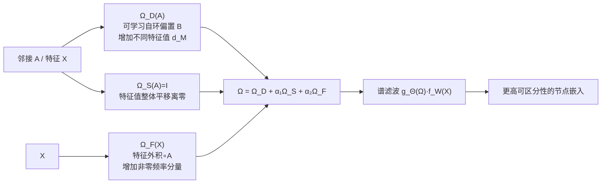

# AdaSpec: Adaptive Spectrum for Enhanced Node Distinguishability

**会议**: ICLR 2026  
**OpenReview**: [https://openreview.net/forum?id=eHhUYoZwWs](https://openreview.net/forum?id=eHhUYoZwWs)  
**代码**: [https://github.com/Mia-321/AdaSpec](https://github.com/Mia-321/AdaSpec)  
**领域**: 图学习 / 谱图神经网络  
**关键词**: 谱图神经网络, 节点可区分性, 图矩阵生成, 特征频率, 置换等变  

## 一句话总结
本文从"节点可区分性"角度刻画谱 GNN 的表达能力，证明可区分节点数的下界由图矩阵的不同特征值个数与节点特征的非零频率分量个数共同决定，并据此提出即插即用的自适应图矩阵生成模块 AdaSpec，在不提升计算复杂度阶数、保持置换等变的前提下显著增强谱 GNN 区分异配图节点的能力。

## 研究背景与动机
**领域现状**：谱 GNN（ChebNet、GPRGNN、BernNet、JacobiConv、ChebNetII 等）把图信号变换到谱域、用多项式图滤波器 $g_\Theta(M)=\sum_{k=0}^{K}\theta_k T_k(M)$ 处理特征，形式统一为 $\Psi(M,X)=g_\Theta(M)f_W(X)$。近年研究几乎都在比较"用什么多项式基"，而把图矩阵 $M$（归一化邻接 $\tilde A$ 或拉普拉斯 $\tilde L$）当成固定不变的输入。

**现有痛点**：谱 GNN 究竟能区分多少个节点、什么因素限制了它的表达能力，一直缺乏系统刻画。已有工作（Wang & Zhang, 2022）的均匀逼近定理要求"图矩阵无重复特征值且特征张满所有频率分量"，但真实图普遍存在对称结构（导致特征值重复）和稀疏特征（导致频率分量缺失），条件几乎不成立。Lu et al. (2024) 的特征值修正按排序索引重新赋值，**会破坏置换等变性**，理论上站不住脚。

**核心矛盾**：图矩阵与节点特征之间的相互作用如何决定节点可区分性，从未被系统分析——而恰恰是这个相互作用，而非滤波器多项式基，构成了表达能力的真正瓶颈。

**本文目标**：建立谱 GNN 可区分节点数的理论下界，并设计一个能同时改善图矩阵谱性质与特征频率覆盖、且保持置换等变与图连通性的图矩阵生成模块。

**核心 idea**：**双因素下界 + 可学习图矩阵**——可区分节点数下界 $=\min(d_M,\ \|\tilde X(M)\|_0)$，由图矩阵的不同特征值数 $d_M$ 与特征在特征基下的非零频率分量数 $\|\tilde X(M)\|_0$ 共同支配；于是用一个加性可学习矩阵把这两个量同时抬高。

## 方法详解

### 整体框架
AdaSpec 把固定图矩阵 $M$ 替换成依赖图结构与特征的可学习图矩阵 $\Omega(A,X)$，得到增强谱 GNN $\Psi^+(A,X)=g_\Theta(\Omega(A,X))f_W(X)$，其余滤波器 $g_\Theta$、特征变换 $f_W$ 不变，可挂到任意谱 GNN 上。$\Omega$ 由三个加性项构成，分别针对下界 $\min(d_M,\|\tilde X(M)\|_0)$ 的两个瓶颈：

$$\Omega(A,X)=\Omega_D(A)+\alpha_1\Omega_S(A)+\alpha_2\Omega_F(X)$$

其中 $\Omega_D$ 增加不同特征值个数、$\Omega_S$ 把特征值从零点平移、$\Omega_F$ 增加非零频率分量，$\alpha_1,\alpha_2$ 控制特征值范围以稳定训练。整个设计的约束是：$\Omega$ 必须与自同构群 $\mathrm{Aut}(G)$ 可交换（保证置换等变）且保持边连通性（$\Omega_{ij}\neq 0\Leftrightarrow e_{ij}\in E$）。

### 关键设计

**1. 双因素可区分性下界：把表达能力量化成可优化目标**。论文先把节点可区分性定义为"给非同构节点分配不同表示"的能力，再证明核心定理 5（Theorem 4.3）：对任意 $X\neq 0$，存在谱 GNN $\Psi(M,X)$ 至少能区分 $\min(d_M,\|\tilde X(M)\|_0)$ 个节点。直觉很清楚——当多个特征向量共享同一特征值，滤波器 $g_\Theta$ 对它们施加相同变换，无法分辨对应的结构差异；当特征在某些特征向量方向上没有频率分量，这些结构差异在嵌入里就"隐身"了。论文还给出两个真实图观察：归一化邻接 $\tilde A$ 普遍存在高重数特征值（尤其零特征值，源于图对称、重复子结构与稀疏低秩），且大量频率分量为零（稀疏特征投影到特征基后每个分量量级约 $O(k/\sqrt n)$，$n\to\infty$ 时非零比例趋零）。这把"提升表达能力"明确翻译成"抬高 $d_M$ 与 $\|\tilde X(M)\|_0$"两个可优化方向。

**2. $\Omega_D$ 可学习自环偏置：用对称破缺增加不同特征值**。为抬高 $d_M$，设计 $\Omega_D(A)=(D+B)^{-1/2}(A+B)(D+B)^{-1/2}$，其中 $B=\mathrm{diag}(b)$ 是非负可学习对角阵，初始化为 $b_u=1/D_{uu}$（同度节点起点相同）。它本质上修改每个节点的自环强度，从而改变节点自身的信息流。关键之处在于它对结构等价但特征不同的非同构节点 $u\not\sim v$（即 $s_u\sim s_v$ 但 $X(u)\neq X(v)$）赋予不同偏置 $b_u\neq b_v$，**打破结构对称、降低特征值重数**；而对同构节点 $u\sim v$ 训练始终保持 $b_u=b_v$，从而维持置换等变。论文证明 $d_{\Omega_D(A)}\ge d_{\tilde A}$，且总存在某个 $B$ 使 $\Omega_D(A)$ 拥有 $n$ 个互异特征值，下界因此不低于用 $\tilde A$ 的谱 GNN。

**3. $\Omega_S=I$ 特征值离零平移 + $\Omega_F$ 特征外积补频率：最小代价填两个洞**。零特征值会逼迫滤波器抑制对应频率分量，故用 $\Omega_S=I$ 把所有特征值平移一个标量 $\epsilon$——加单位阵只移动特征值、不动特征向量，对原矩阵改动最小，且互异特征值平移后仍互异、非零频率分量数不变。另一头，$\Omega_F(X)=\big(\sum_{i=1}^{h}\frac{X_{:i}X_{:i}^\top}{\|X_{:i}\|_F^2}\big)\circ A$ 用特征列外积（按 Frobenius 范数归一化，避免大幅值特征主导）再与 $A$ 做 Hadamard 积，使新图矩阵随特征自适应。论文证明（Theorem 5.2）对无重复特征值的对称矩阵 $C$，在温和的非零投影条件下加 $\epsilon\Omega_F(X)$ 严格增加非零频率分量数。$\Omega_F$ 与 $A$ 的 Hadamard 积保证只在已有边上取值，从而 $\Omega$ 仍与 $\mathrm{Aut}(G)$ 可交换并保持连通性（Theorem 5.4），最终 $\Psi^+$ 在 $f_W$ 等变时保持置换等变（Proposition 5.5）。

**4. 同阶复杂度：增强只是常数级开销**。$\Omega_F(X)$ 仅在邻接非零项上计算，预计算多花 $O(h(|V|+|E|))$ 但只算一次；前向/反向每步多算 $\Omega(A,X)$ 与 $B$ 的梯度，代价 $O(|V|+|E|)$，相对滤波器 $O(KT|E|)$ 与特征变换 $O(|V||W|)$ 不改变渐近阶。参数量只从 $1+K$ 增加 $|V|$ 个（对角 $B$），保证"增强而不增阶"。

## 实验关键数据

### 主实验表格
在 18 个节点分类数据集（6 小异配 + 5 大异配 + 7 同配）上，把 AdaSpec 挂到 5 个谱 GNN：(O) 为原模型，(M) 为加 AdaSpec。异配图部分代表性结果（准确率 / Minesweeper、Questions 用 ROC AUC）：

| Model | Texas | Wisconsin | Chameleon | Cornell | Minesweeper | Questions |
|---|---|---|---|---|---|---|
| ChebNet(O→M) | 38.67→**51.16** (+12.49) | 32.92→33.83 | 29.32→29.73 | 31.33→33.47 | 86.29→86.7 | 55.13→55.2 |
| JacobiConv(O→M) | 55.09→57.40 | 49.00→**52.33** | 34.29→**38.16** (+3.87) | 38.96→41.62 | 87.34→**89.13** | 64.72→65.80 |
| GPRGNN(O→M) | 48.15→**58.27** (+10.12) | 44.25→**53.25** (+9.0) | 32.50→32.82 | 34.39→36.13 | 87.15→88.58 | 53.14→**58.19** (+5.05) |
| BernNet(O→M) | 56.19→58.90 | 49.38→51.96 | 35.35→**39.61** (+4.26) | 36.82→40.23 | 76.54→76.95 | 64.86→65.20 |

同配图（Citeseer/Pubmed/Cora/Computers/Photo/Coauthor）上提升较小、个别略降，如 JacobiConv 在 Cora 上 77.15→**83.52** (+6.37)、ChebNet 在 Computers 上 82.64→85.14 (+2.5)。

### 消融实验表格
以 ChebNet+AdaSpec 拆解三项（$\Omega_D$ / $\Omega_S$ / $\Omega_F$）：

| 配置 | 结论 |
|---|---|
| 三项全开 | 一致取得最佳性能 |
| 结构主导图 (Chameleon, Cora) | $\Omega_D$（增不同特征值）优于 $\Omega_S$ |
| 特征主导图 (Texas, Roman_Empire) | $\Omega_S$（离零平移）优于 $\Omega_D$ |
| 仅 $\Omega_F$ | 单独使用即可提升（增非零频率分量有效） |

### 关键发现
- **异配 > 同配**：小异配图平均 +1.89% 准确率、大异配图平均 +1.27% ROC AUC、同配图平均仅 +0.43%——同配图低频已足够刻画平滑特征，多加频率反而可能有害；异配图需要更丰富谱模式，AdaSpec 补的频率分量正好用上。
- **小图 > 大图**：小图（Texas/Wisconsin/Cornell）平均 +3.45%，大图（Chameleon/Squirrel）仅 +0.46%——小图里改图矩阵能暴露关键结构，大图里既有结构占主导、改动收益被稀释。
- 三项组件互补，各自独立都能增可区分性，组合后最强。

## 亮点与洞察
- **把"表达能力"落到可计算的下界**：$\min(d_M,\|\tilde X(M)\|_0)$ 直接指明两个可优化旋钮，比抽象的均匀逼近定理更有操作性，也解释了为何固定图矩阵的谱 GNN 在对称/稀疏真实图上表达受限。
- **从"换多项式基"转向"改图矩阵"**：指出社区长期忽视的图矩阵作用，且证明改图矩阵与多项式基设计正交、可叠加。
- **理论自洽的对称破缺**：可学习自环 $B$ 既能对非同构节点破缺对称增不同特征值，又对同构节点保持一致从而严格保住置换等变，避开了 Lu et al. (2024) 破坏等变性的缺陷。
- **真正即插即用且不增阶**：仅加 $|V|$ 个对角参数、复杂度同阶，5 个主流谱 GNN 均可直接受益。

## 局限与展望
- 同配图与大图上提升有限甚至个别负向（如 ChebNet 在 Citeseer -0.69、Coauthor-Physics -0.1），说明 AdaSpec 收益强依赖图的异配/小规模属性，缺乏自动判断"该不该增频率"的机制。
- 下界是存在性保证（"存在某个谱 GNN 能区分至少这么多"），并不直接等价于训练后实际可区分性，理论与优化之间仍有缝隙。
- $\Omega_F(X)$ 的特征外积预计算在超大图/高维特征上仍带来一次性 $O(h(|V|+|E|))$ 开销，超大规模场景的实际成本未充分讨论。
- 仅在节点分类、多项式谱 GNN 上验证；有理式滤波器、图分类、链路预测等场景的适用性留待探索。

## 相关工作与启发
- **谱 GNN 与多项式基**：ChebNet/ChebNetII/JacobiConv/BernNet/GPRGNN 及 FavardGNN/UniFilter/PolyCF 关注"学什么基"，本文正交地关注"用什么图矩阵"。
- **谱 GNN 表达能力**：相比基于 WL 测试的图级表达能力分析，本文聚焦节点级可区分性，并把分析推广到含非线性 $f_W$ 的情形，给出严格下界。
- **图重连（Graph Rewiring）**：DropEdge/FoSR/DiffWire/GPER 等在空间域改拓扑以缓解过平滑/过挤压；AdaSpec 在谱域增强可区分性，二者机制不同且可组合，是互补而非竞争关系。
- **启发**：把"表达能力"翻译成可显式优化的谱量（不同特征值数 × 非零频率分量数），是一种把理论瓶颈直接转成模块设计的范式，可迁移到其他需要刻画表示坍缩的图/序列模型。

## 评分
- 新颖性: ⭐⭐⭐⭐ 从节点可区分性给出双因素下界，并把固定图矩阵改成可学习生成模块，视角与既有"换多项式基"主线明显不同。
- 实验充分度: ⭐⭐⭐⭐ 18 数据集 × 5 谱 GNN，覆盖同配/异配、大小图，附组件消融与复杂度分析；但缺与图重连、特征值修正等强基线的端到端对比。
- 写作质量: ⭐⭐⭐⭐ 定义—定理—观察—模块逐层推进，理论与设计对应清晰；个别表格数值排版有笔误。
- 价值: ⭐⭐⭐⭐ 即插即用、不增阶、保等变，对异配/小图谱 GNN 实用，且提供了量化表达能力的可操作框架。

<!-- RELATED:START -->

## 相关论文

- [\[ICLR 2026\] Low-Rank Few-Shot Node Classification by Node-Level Graph Diffusion](low-rank_few-shot_node_classification_by_node-level_graph_diffusion.md)
- [\[AAAI 2026\] Beyond Fixed Depth: Adaptive Graph Neural Networks for Node Classification Under Varying Homophily](../../AAAI2026/graph_learning/beyond_fixed_depth_adaptive_graph_neural_networks_for_node_classification_under_.md)
- [\[ICLR 2026\] Revisiting Node Affinity Prediction in Temporal Graphs](revisting_node_affinity_prediction_in_temporal_graphs.md)
- [\[ICML 2026\] Full-Spectrum Graph Neural Network: Expressive and Scalable](../../ICML2026/graph_learning/full-spectrum_graph_neural_network_expressive_and_scalable.md)
- [\[ICLR 2026\] Forest-Based Graph Learning for Semi-Supervised Node Classification](forest-based_graph_learning_for_semi-supervised_node_classification.md)

<!-- RELATED:END -->
