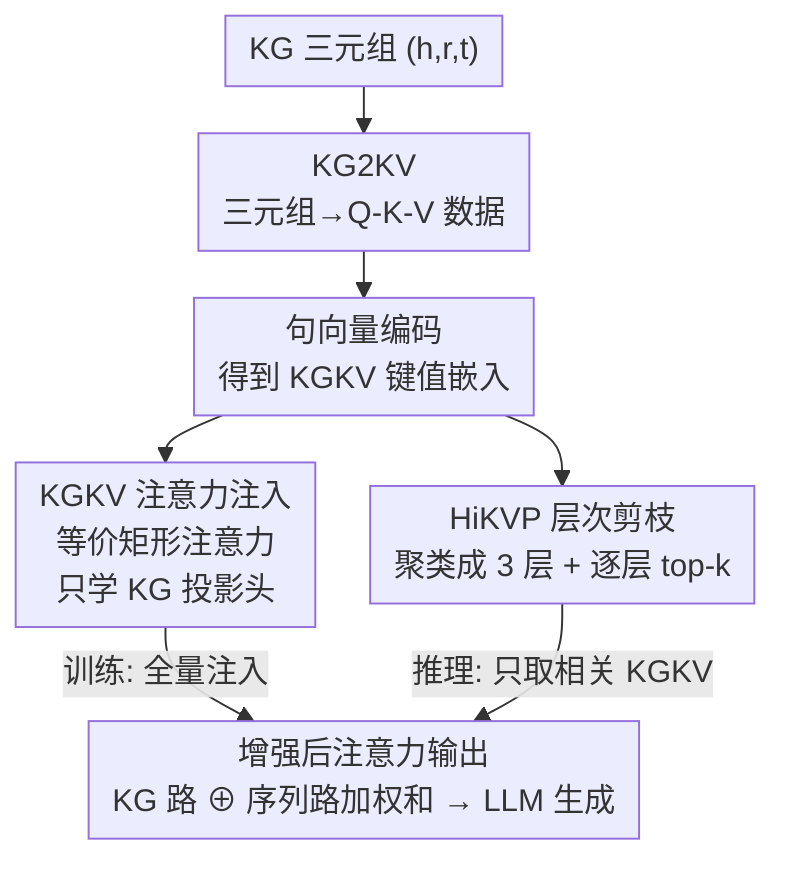

# AtlasKV: Augmenting LLMs with Billion-Scale Knowledge Graphs in 20GB VRAM

**会议**: ICLR2026  
**OpenReview**: [https://openreview.net/forum?id=6i1jVAYbHs](https://openreview.net/forum?id=6i1jVAYbHs)  
**代码**: 待确认（论文提供 Source Code / Data and Models 链接）  
**领域**: 知识增强 / 检索增强生成 / LLM 效率  
**关键词**: 知识图谱增强、参数化知识注入、矩形注意力、层次剪枝、可扩展性

## 一句话总结
AtlasKV 把知识图谱里的每条三元组直接转成 Q-K-V 数据并以注意力的方式注入 LLM，再用层次化键值剪枝把复杂度从线性压到次线性，从而在 20GB 显存内为 LLM 接入十亿级（1B triples）知识图谱，无需外部检索器、无需长上下文、也无需为新知识重训。

## 研究背景与动机
**领域现状**：给 LLM 补充外部知识主要有两条路线。一是**非参数化**的 RAG：用外部检索器从知识库/知识图谱里取回相关文本或子图，作为上下文前缀喂给 LLM。二是**参数化**：把知识写进模型，传统做法如 LoRA/adapter 需要重训，而 KBLaM 提出了一个新范式——把外部知识编码成一系列 key-value 表示，直接塞进 LLM 的自注意力层，既保留参数化方法的优点，又能在训练一次后以 training-free 的方式适配任意新知识库。

**现有痛点**：RAG 严重依赖检索器质量，且大规模知识增强时近邻搜索和超长上下文会带来巨大的推理延迟、还会踩 "lost-in-the-middle"；KBLaM 这个新范式虽好，却有两个卡脖子的问题——（1）**缺高质量训练数据**：它需要 query-key-value 句子作训练数据，用固定预定义 schema 从无结构文档里合成 Q-K-V，查询多样性极低（多样性比仅 0.003%），导致在分布外（OOD）场景泛化很差；（2）**扩展性差**：KBLaM 的矩形注意力是线性复杂度 $O((M+N)\cdot N\cdot D)$，当知识库规模 $M$ 涨到十亿级时，显存和算力开销仍然高到不可承受——KBLaM 处理 10 万条三元组就要 40GB+ 显存。

**核心矛盾**：知识规模 $M$ 与推理成本之间是线性绑死的，且训练数据的多样性决定了泛化上限，二者都被现有范式同时卡住。

**本文目标**：在不引入检索器、不依赖长上下文、不重训的前提下，让 LLM 端到端地吃进十亿级 KG，同时保证 OOD 泛化和极低显存。

**切入角度**：作者注意到一个关键巧合——KG 里的每条三元组 $(h, r, t)$ 天然能拆成 Q-K-V 结构，这和自注意力里的 Q-K-V 向量结构高度相似；同时知识在语义上本就是层次组织的，可以靠层次结构把推理时的算力/显存负担摊到每一层。

**核心 idea**：从**数据**和**算法**两个维度同时下手——用 KG2KV 把三元组自然转成高多样性的 Q-K-V 数据解决泛化，用层次化键值剪枝 HiKVP 把复杂度从线性降到次立方根级 $O((C\sqrt[3]{M}+N)\cdots)$ 解决扩展性。

## 方法详解

### 整体框架
AtlasKV 解决的是"把超大 KG 高效、可泛化地注入 LLM"。整体管线是：先把 KG 的每条三元组经 **KG2KV** 转成 Q-K-V 字符串，再用句向量编码器压成 key/value 嵌入（即 KGKV）；这些 KGKV 经**层次聚类**组织成 3 层结构；训练阶段，通过一个与 KBLaM 矩形注意力**等价**的注意力把 KGKV 全量注入 LLM 的注意力层，只学 KG 专属的 Q/K/V 投影头；推理阶段，则用 **HiKVP** 沿"根层→中间层→叶层"逐层 top-k 剪枝，只把与当前 query 最相关的少量 KGKV 上 GPU 参与注意力计算，从而把显存和算力压到次线性。最终注意力输出是 KG 部分与序列部分两路 softmax 的动态加权和，LLM 据此生成答案。

### 关键设计

**1. KG2KV：把每条三元组自然转成高多样性的 Q-K-V 训练数据**

针对 KBLaM "训练数据多样性低、OOD 泛化差"的痛点，AtlasKV 不再用固定 schema 去合成，而是直接利用 KG 自身海量的关系来造数据。对一条三元组 $(h, r, t)$，先**遮住头实体或尾实体**，被遮的实体就作为 value；再根据遮的位置把关系 $r$ 改写成一个名词短语作为 key 的属性。比如遮尾实体时，关系 "because" 被 LLM 改写成名词 "cause"，key 串就是 "the cause of John founded StockLemon.com"，value 就是被遮的尾实体；遮头实体时则把关系改写成反向名词 "result"。query 串则在 key 串前加上多样的提问前缀（"What is…"/"Tell me…"/"Provide details on…"），避免模型过拟合到某种固定问法。这样得到的 KGKV 经句向量编码器压成 $k_m, v_m$ 注入注意力层。由于 KG 的关系本身极其丰富，构造出的"询问属性"多样性远超合成法——表 1 显示 KG2KV 的多样性比达 **7.864%**（合成法仅 0.003%），且平均 token 成本更低（165.7 vs 349.9，因为只需输入被遮位置和关系）。训练时作者通常选命名实体作 key 来遮、选事件实体和关系作 value，因为事件实体语义更复杂、能逼着投影头学到更强的检索能力。

**2. KGKV 注意力注入：用与矩形注意力等价的形式 training-free 适配新知识**

KBLaM 的矩形注意力把 KB 的 key-value 对和原序列拼在一起做注意力。AtlasKV 用一个**等价**的注意力实现来注入 KGKV：第 $l$ 层第 $n$ 个 token 的输出写成 KG 路和序列路两个 softmax 结果的加权和

$$\tilde{y}^{(l)}_n = \lambda_{kg}\cdot \mathrm{Softmax}(\text{logits}_{kg})\cdot \tilde{v}^{(l)} + \lambda_{seq}\cdot \mathrm{Softmax}(\text{logits}_{seq})\cdot v^{(l)}$$

其中两路权重 $\lambda_{kg}, \lambda_{seq}$ 由各自 logits 的指数和**动态归一化**决定（$\lambda_{kg}=\frac{\sum_i \exp(\text{logits}^i_{kg})}{\sum_i \exp(\text{logits}^i_{kg})+\sum_i \exp(\text{logits}^i_{seq})}$），$\text{logits}_{kg}=\langle \tilde{q}^{(l)}_n, \tilde{k}^{(l)}\rangle/\sqrt{D}$。关键是**唯一可学的参数只有 KG 专属的 query 头 $\tilde{W}_Q$ 与 KG 投影头 $\tilde{W}_K, \tilde{W}_V$**，用 LLM 原始的自回归目标 $p(v|M,q)=\prod_i p_\theta(x_i|M, q_{<i}, v_{<i})$ 训练。因为只学几个投影头、LLM 主干冻结，所以训练完之后**换一套新 KG 不用重训**，直接编码进 KGKV 注入即可——这正是它相对传统参数化方法（LoRA/adapter 要重训）的核心优势。

**3. HiKVP：层次聚类 + 逐层剪枝，把线性复杂度压到次线性**

这是解决"十亿级 KG 显存爆炸"的算法核心。先做**层次聚类**：用 UMAP 降维、GMM 把 KGKV 的 key 聚成 3 层结构（高层 key 是低层 key 的池化），每层簇大小设为 $S=\lceil \sqrt[3]{M}\rceil$，把负担均摊到各层。推理时用**三步逐层 top-k 剪枝**，且充分利用 GPU/CPU 分层存储：① 初始只把根层 key $\tilde{k}_R$ 放 GPU，算 query 与根层的注意力分，取 top-$k_R$，经 mapping 拿到对应中间层 key，根层 key 卸回 CPU；② 把选中的中间层 key 上 GPU，同样算分取 top-$k_I$，拿到叶层 key，中间层卸回 CPU；③ 把选中的叶层 key 上 GPU，softmax 后直接取 top-$k_L$ 的 logits，并通过索引映射取回对应的 value 上 GPU，得到剪枝后的 $\overline{\text{logits}}_{kg}, \bar{\tilde{v}}^{(l)}$ 代入式（8）算最终输出（论文默认 $k_R, k_I, k_L = 128, 64, 16$）。这套流程把时间复杂度降到 $O((C_t\sqrt[3]{M}+N)\cdot N\cdot D)$、显存到 $O((C_m\sqrt[3]{M}+N)\cdot(N+D))$，其中 $C_t, C_m$ 是远小于 $M$ 的常数——这正是它能在 20GB 内吃下 1B 三元组、而 KBLaM 10 万条就要 40GB 的根本原因。一个有意思的发现是，即便加了剪枝，性能掉得也不多，因为训练出的专属头本就具备在不同语义粒度上做"模糊检索"的能力。

### 损失函数 / 训练策略
训练目标即 LLM 原始的自回归语言建模目标（式 7），在 query+answer 序列上逐 token 预测；只更新 KG 专属的 $\tilde{W}_Q, \tilde{W}_K, \tilde{W}_V$，主干冻结。训练数据 ATLAS-Wiki-QKV 由 KG2KV 从 ATLAS-Wiki（9 亿+节点、59 亿边）构造。值得注意的是训练阶段**不剪枝**（KGKV 规模无需太大即可凭泛化能力训好），剪枝只在推理时启用；作者还发现仅需 3K 步即可训好，远少于 KBLaM 报告的 20K 步。

## 实验关键数据

实验用 LLaMA3.1-8B-Instruct 作主干，all-MiniLM-L6-v2 作句向量编码器，GPT-4o/4o-mini 用于打分和关系改写。所有评测都在 **OOD 设置**下进行（训练用 ATLAS-Wiki-QKV，评测用 Enron、ATLAS-CC-QKV、ATLAS-Pes2o-QKV，后两者更难、询问属性更复杂）。

### 主实验：知识 grounding 准确率（ACC@1，3e3 步）

| 评测集 / KG 规模 | KBLaM | AtlasKV(128-64-16) | AtlasKV w/o HiKVP |
|------|------|------|------|
| Enron / $10^2$ | 50.9 | 67.3 (+16.4) | 76.4 (+25.5) |
| Enron / $10^4$ | 9.1 | 21.8 (+12.7) | 27.3 (+18.2) |
| ATLAS-Pes2o / $10^3$ | 5.5 | 52.7 (+47.2) | 72.7 (+67.2) |
| ATLAS-CC / $10^2$ | 21.8 | 89.1 (+65.5) | 96.4 (+72.8) |
| ATLAS-CC / $10^4$ | 3.6 | 40.0 (+36.4) | 61.8 (+58.2) |

在两个更难的数据集上 KBLaM 几乎崩溃（合成训练数据询问属性太少），而 AtlasKV 仅用 20K KGKV 样本、3K 步就大幅领先。显存方面（图 4），AtlasKV 增强 1B 三元组只需 **<20GB**，而 KBLaM 处理 10 万条就要 **>40GB**，ICL 超过 100 条三元组就要 48GB+ 跑不动。GPTScore（GPT-4o 打 0~1 分，图 5）上 AtlasKV 也显著高于 KBLaM；尤其即便 AtlasKV 训练数据里和 Enron 同款的询问属性很少，它仍在 Enron 上超过"训练数据恰好含完全相同询问属性"的 KBLaM，印证泛化来自 KG2KV 的多样性。

### 消融实验（ATLAS-Pes2o-QKV，ACC@1，3e3 步）

| 配置 | $10^2$ | $10^3$ | $10^4$ | 说明 |
|------|------|------|------|------|
| AtlasKV w/o HiKVP（全量） | 92.7 | 72.7 | 47.3 | 不剪枝，性能上界 |
| w/o HiKVP & Event | 80.0 | 34.5 | 9.1 | KG2KV 只用命名实体 |
| w/o HiKVP & Entity | 49.0 | 20.0 | 3.6 | KG2KV 只用事件实体 |

### 关键发现
- **KG2KV 的数据质量是泛化的根**：命名实体和事件实体**协同**最好；只用事件实体掉得最惨（语义太复杂，专属头从头学很难），只用命名实体掉得少一些（串更短、语义更简单）但仍明显不如协同——说明既要简单语义打底、又要复杂语义提升。
- **HiKVP 几乎免费换来扩展性**：开剪枝后相比全量版（w/o HiKVP）性能下降有限，却把显存从 40GB+ 压到 <20GB、复杂度从线性降到次线性。
- **训练动态健康**：从某一步起模型开始"学会从 KG 三元组里检索相关知识"，而非暴力过拟合。

## 亮点与洞察
- **三元组 ↔ Q-K-V 的结构同构**是全文最"啊哈"的观察：KG 的 $(h,r,t)$ 天然能映射成注意力的 Q-K-V，于是无需精心设计 schema 就能造出高多样性训练数据，多样性比直接从 0.003% 拉到 7.864%。
- **次立方根复杂度**靠"层次聚类 + GPU/CPU 分层 offload + 逐层 top-k"实现，把"知识规模"和"推理成本"解耦——这个三层 offload-prune 的思路可迁移到任何需要在有限显存里检索超大向量库的场景。
- **只学几个投影头**就实现 training-free 换知识库，等于把"知识"和"参数"解耦，既有参数化方法的低延迟，又有非参数化方法的可更新性。

## 局限与展望
- **依赖现成 KG**：方法假设三元组已抽好，KG 抽取质量直接决定上限，而抽取本身不在本文范围。
- **句向量编码器是瓶颈**：KGKV 的表达力受限于编码器（这里是小模型 all-MiniLM-L6-v2），复杂语义（尤其事件实体）压成单个嵌入可能丢信息——消融里只用事件实体性能暴跌也侧面印证。
- **大规模下绝对准确率仍偏低**：$10^4$ 三元组时 ACC@1 仍只有 40 左右，离实用 grounding 还有距离；超大 KG（1B）下只验证了显存可控，端到端问答质量未充分展开。
- **3 层、固定 top-k 的剪枝**可能不是最优；不同 query 难度对相关知识量需求不同，自适应层数/$k$ 值得探索。

## 相关工作与启发
- **vs KBLaM**：本文直接继承 KBLaM 的"KV 注入注意力层"范式，但 KBLaM 用固定 schema 合成数据（多样性低、OOD 差）+ 线性复杂度（10 万条就爆显存）；AtlasKV 用 KG2KV 提升数据多样性、用 HiKVP 把复杂度降到次线性，是 KBLaM 在"数据 + 算法"两端的关键升级。
- **vs RAG（ICL 检索增强）**：RAG 靠外部检索器取回长上下文，受检索器能力限制、有 lost-in-the-middle、大规模时延迟和显存暴涨；AtlasKV 无检索器、无长上下文，推理成本基本与检索知识规模无关。
- **vs CAG（缓存式增强）**：CAG 预加载文档并预算 KV 缓存，但成本随每增一条检索结果上涨；AtlasKV 用次线性的注意力式检索换来"推理成本独立于检索规模"。
- **vs LoRA/adapter 等传统参数化方法**：它们换新知识要重训，AtlasKV 只学 KG 投影头、换库 training-free。

## 评分
- 新颖性: ⭐⭐⭐⭐ 三元组↔Q-K-V 同构 + 层次剪枝把 KBLaM 范式从线性推到次线性，组合有想法
- 实验充分度: ⭐⭐⭐⭐ 三 OOD 数据集 × 多 KG 规模 + 显存/GPTScore/消融较完整，但绝对准确率和 1B 端到端问答展开不足
- 写作质量: ⭐⭐⭐⭐ 动机—痛点—设计对应清晰，复杂度推导和图示到位
- 价值: ⭐⭐⭐⭐ "20GB 接入十亿级 KG、无需检索器/重训"对低成本知识增强很有吸引力

<!-- RELATED:START -->

## 相关论文

- [\[ICLR 2026\] Actions Speak Louder than Prompts: A Large-Scale Study of LLMs for Graph Inference](actions_speak_louder_than_prompts_a_large-scale_study_of_llms_for_graph_inferenc.md)
- [\[ACL 2026\] Evaluating LLMs on Large-Scale Graph Property Estimation via Random Walks](../../ACL2026/graph_learning/evaluating_llms_on_large-scale_graph_property_estimation_via_random_walks.md)
- [\[AAAI 2026\] Assessing LLMs for Serendipity Discovery in Knowledge Graphs: A Case for Drug Repurposing](../../AAAI2026/graph_learning/assessing_llms_for_serendipity_discovery_in_knowledge_graphs_a_case_for_drug_rep.md)
- [\[ICLR 2026\] Controllable Logical Hypothesis Generation for Abductive Reasoning in Knowledge Graphs](controllable_logical_hypothesis_generation_for_abductive_reasoning_in_knowledge_.md)
- [\[ACL 2025\] Can LLMs Evaluate Complex Attribution in QA? Automatic Benchmarking using Knowledge Graphs](../../ACL2025/graph_learning/paper_2401_14640.md)

<!-- RELATED:END -->
