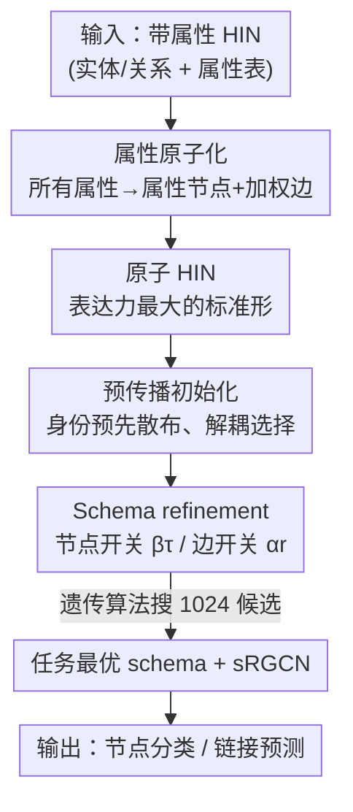

# Atomic HINs: Entity-Attribute Duality for Heterogeneous Graph Modeling

**会议**: ICLR 2026  
**OpenReview**: [https://openreview.net/forum?id=AG7fjg5azU](https://openreview.net/forum?id=AG7fjg5azU)  
**代码**: https://github.com/ntuidssplab/AtomHIN  
**领域**: 图学习 / 异构图神经网络  
**关键词**: 异构信息网络, Schema 设计, 实体-属性对偶, 图结构学习, HGNN

## 一句话总结
本文提出"实体-属性对偶"原理，把异构信息网络（HIN）里所有属性原子化为实体节点得到一个"原子 HIN"作为表达力最大的标准形，再用遗传算法在节点/边类型上做二元选择（schema refinement），让一个极简版 RGCN（sRGCN）就能在 8 个数据集的节点分类和链接预测上达到 SOTA。

## 研究背景与动机
**领域现状**：异构信息网络（Heterogeneous Information Network, HIN）用多种类型的节点（实体）和边（关系）来刻画文献库、电商、知识图谱、社交网络等系统，而异构图神经网络（HGNN）则在这种带类型的 schema 上做"类型感知"的消息传递。绝大多数研究都默认 schema 是给定的、固定的，专注于设计更强的 HGNN 架构（metapath、关系特定变换、异构注意力等）。

**现有痛点**：作者指出一个被长期忽视的事实——同一份原始数据可以派生出多种合法的 schema，而这些 schema 的选择会显著影响下游性能。以 IMDb 为例，它本来是从一张电影表构造的：actor、director 这些列被处理成实体节点，而 keyword、language、country 等被留作属性；但在另一些变体里 keyword 又被升格成实体。哪些列当实体、哪些当属性，完全是启发式、各数据集各做各的（HGB 把 actor/keyword 升成实体却把 language/country 留作特征，OGB 把文本词向量平均进 paper 节点却不建词节点）。

**核心矛盾**：schema 设计空间既无界又复杂——属性派生的关系会膨胀关系集，metapath 构造会随关系数指数增长，因此基准数据集只能临时拍板（ad-hoc）。这导致两个问题：基准比较不公平（不同 schema 不可直接比），以及大家可能一直在远离最优的 schema 上做研究，把模型架构的功劳和 schema 的功劳混在了一起。

**本文目标**：把"如何设计 HIN schema"这个开放问题，转化成一个有原理、可优化的结构学习问题。

**切入角度**：作者提出**实体-属性对偶（entity-attribute duality）**——属性可以被"原子化"成带关系的实体，而实体反过来也可以充当别的节点的属性。既然两者可以互相转化，那就不如先把所有属性都原子化到底，得到一个把全部 schema 选择都显式化、表达力最大的"原子 HIN"作为统一起点。

**核心 idea**：用"原子 HIN（最大表达力标准形）+ schema refinement（在节点/边类型上做二元选择来裁剪复杂度）"代替"人工启发式拍 schema"，让 schema 设计变成一个可搜索、可迁移的优化问题。

## 方法详解

### 整体框架
方法把"设计 schema"重新定义为"先到达表达力上限，再做减法"。给定一个带属性的 HIN，第一步把**所有**属性（二值、类别、甚至数值/预训练嵌入）都原子化成属性节点和加权边，得到表达力最大的原子 HIN——此时所有建模选择都被显式编码进了图结构。但原子 HIN 太复杂、参数过多容易过拟合，所以第二步引入 schema refinement：为每个节点类型配一个二元开关 $\beta_\tau$、每个边类型配一个二元开关 $\alpha_r$，决定保留谁、丢弃谁。为了让"删边"和"选节点"互不干扰，第三步用一次预传播（pre-propagation）把每个被选节点类型的身份信息预先散布出去。最后用遗传算法在这个二元空间里搜出任务最优的 schema，并配上参数共享极强的极简模型 sRGCN 做下游训练。

### 关键设计

**1. 实体-属性对偶与属性原子化：把"哪个当实体"这个选择显式化**

痛点直指 schema 设计的随意性——同一份数据，把谁当实体、把谁当属性是人工拍的，且各数据集不一致。作者的破法是干脆消除这个选择：定义**属性原子化（Definition 4.1）**，对任意属性 $f$（特征矩阵 $X_f$），为它的每一维新建一个属性节点 $u_j$，并把 $X_f[i,j]\neq 0$ 的位置变成一条从原节点 $v_i$ 到 $u_j$、权重为 $X_f[i,j]$ 的边，于是引入一个新节点类型 $\tau'$ 和新边类型 $r'$。这把二值、类别、数值属性统一转成了显式的结构和关系——二值属性产生稀疏星形邻接，数值属性产生稠密星形邻接，但形态一致。

把原子化施加到**所有**属性，就得到原子 HIN：一切信息都以结构形式表达，表达力最大，且所有建模选择都被显式摊开。理论上这有保证——**Lemma 4.3** 证明属性原子化"严格扩大了滤波器空间"：在 SHGC（谱异构图卷积，本文用作 HGNN 的统一形式，见公式 1）框架下，原子化后关系集 $R'\supset R$，由 $\{S_{r_1}\cdots S_{r_\ell}\}$ 张成的异构滤波器空间严格大于原来的空间。换句话说，把属性变成"实体+关系"不会损失任何东西，只会让 HGNN 能捕捉更多 metapath 式的关系模式。

**2. Schema refinement：用节点/边二元选择把无界设计空间收成可优化问题**

原子 HIN 表达力够了，但复杂度爆炸、参数过多易过拟合。这一设计针对的就是"如何在表达力和复杂度之间做减法"。作者定义两个基本操作：**边类型选择** $\alpha_r\in\{0,1\}$ 决定关系 $r$ 是否保留进消息传递（$\alpha_r=0$ 等价于把这个关系连同它的边整个删掉，因此对任何 HGNN 都是即插即用、无需改架构）；**节点类型选择** $\beta_\tau\in\{0,1\}$ 决定该类型是否被赋予唯一可学习身份嵌入。在 SHGC 框架下，refinement 写成

$$\bar{Z}=H\big(\alpha_1 S_1,\dots,\alpha_{|R|}S_{|R|}\big)\,X(\beta_1,\dots,\beta_{|T|}),$$

其中节点选择通过类型特定的单位矩阵叠加来实现：$X_0(\beta_1,\dots,\beta_{|T|})=\sum_\tau \beta_\tau \hat{I}_\tau$，只为信息量大的节点类型学嵌入以省参数、抗过拟合。这一步的妙处在于：现有所有基准 schema（vanilla schema）其实都只是原子 HIN 的某种 $(\alpha,\beta)$ 选择，于是"设计 schema"这个开放问题被收敛成了"在 $2^{|R|+|T|}$ 个二元向量里搜最优"的结构学习问题。

**3. 预传播特征初始化：让"删边"不会误伤"选节点"**

朴素的节点选择会引入隐藏依赖（Definition 4.2）：如果把某节点类型 $\tau$ 的所有关联边都删了，它的身份嵌入就成了孤岛、无法传到下游做预测——也就是说边的裁剪会反过来让节点选择失效，两个选择不独立、搜索时互相纠缠。本文的解法是在 refinement 之前先做一次预传播：

$$X(\beta_1,\dots,\beta_{|T|})=\Big(I+\sum_{\tau_i\neq\tau_j}\tilde{A}_{\langle\tau_i,*,\tau_j\rangle}\Big)X_0(\beta_1,\dots,\beta_{|T|}),$$

其中 $\tilde{A}_{\langle\tau_i,*,\tau_j\rangle}$ 是从类型 $\tau_j$ 到 $\tau_i$ 最短路径对应的邻接矩阵乘积。直觉很简单：每个被选节点类型先把自己的身份"散播"一次到其它类型，这样即使之后它的关联边被全部删掉，它的信号依然能被访问到。理论上这有两条保证——**Lemma 4.1（选择独立性）**：有了预传播后，节点选择与边选择彻底解耦，删光 $\tau_j$ 的边也不会产生依赖；**Lemma 4.2（预传播的中性）**：当 SHGC 阶数 $L$ 足够大时，把原始单位特征换成预传播特征只是滤波器系数 $\theta$ 的重参数化，**不改变模型表达力**。也就是说，预传播是"免费"地把节点选择和边选择正交化，让后面的搜索能干净地探索整个 $(\alpha,\beta)$ 空间。

**4. 遗传算法搜索 + sRGCN：在倾斜的二元空间里高效逼近最优 schema**

$2^{|R|+|T|}$ 的搜索空间过大，且高度倾斜——保留更多边一般提升表达力（Lemma 4.3），而稀疏或高基数节点类型则容易带来过多参数和过拟合，因此朴素网格/随机搜索无效。作者把 schema refinement 形式化为超参优化问题，用**遗传算法（GA）**搜：用 vanilla schema 初始化种群，把 schema 参数和模型深度 $L$ 联合优化，1024 个候选即可逼近最优（IMDb、PubMed 在 512 次试验内就接近收敛，尽管搜索空间高达 $2^{19}$、$2^{22}$）。搭配的模型 **sRGCN** 是 RGCN 的极简版，把关系特定的特征变换矩阵替换成关系特定的标量：$W_r^{(\ell)}=\theta_r^{(\ell)}I$。这并非随手简化——作者通过 Proposition 4.1/4.2 论证 RGCN、GTN 等都是 SHGC 的一阶近似，而在原子 HIN 上所有输入都退化成唯一身份嵌入，重特征变换/MLP 基本冗余，因此参数共享更强的 GTN 式架构反而更合适。sRGCN 就是顺着这一观察设计出的"极简却有效"的基线。

### 损失函数 / 训练策略
搜索阶段用 1024 个 GA 候选评估 schema，之后在搜出的最优 schema 上用 256 次试验微调 HGNN 超参；每个数据集遵循其基准既定的评测协议（节点分类用 Macro-F1/Micro-F1/Acc，链接预测用 ROC-AUC/MRR）。属性原子化、预传播、类型选择都是一次性离线预处理，开销极小（预传播复杂度 $O(|T||E|)$），整体搜索时间随预算 $B$ 线性增长 $O(B)$。

## 实验关键数据

### 主实验
在 8 个跨领域基准（文献、电商、知识图谱、社交、生物医学）上，sRGCN 跑在 refined 原子 schema 上、对比各 HGNN 在 vanilla schema 上的表现。

| 数据集 | 任务 / 指标 | sRGCN(Atomic) | 最强基线 | 提升 |
|--------|------|------|----------|------|
| IMDb | 节点分类 Macro-F1 | **68.97** | 67.10 (PSHGCN) | +1.87 |
| Freebase | 节点分类 Macro-F1 | **55.40** | 52.18 (HINormer) | +3.22 |
| DBLP | 节点分类 Macro-F1 | **95.55** | 95.27 (PSHGCN) | +0.28 |
| OGBN-MAG | 节点分类 Acc(Test) | **55.21** | 54.57 (PSHGCN) | +0.64 |
| Amazon | 链接预测 ROC-AUC | **97.85** | 95.17 (SlotGAT) | +2.68 |
| LastFM | 链接预测 ROC-AUC | **77.10** | 70.33 (SlotGAT) | +6.77 |
| PubMed | 链接预测 ROC-AUC | **90.11** | 88.07 (SlotGAT) | +2.04 |

总体上，节点分类 Macro-F1 最多提升 6.2%，链接预测 ROC-AUC 平均提升 4.9%；提升在属性丰富、schema 复杂的数据集（IMDb、Amazon、Freebase）上更明显。

### schema 变体与可迁移性（Table 3）
| HGNN | Schema | IMDb Macro-F1 | Amazon ROC-AUC |
|------|--------|---------------|----------------|
| sRGCN | Vanilla | 67.64 | 95.94 |
| sRGCN | Refined(sRGCN) | **68.97** | **97.85** |
| SimpleHGN | Vanilla | 63.53 | 93.40 |
| SimpleHGN | Refined(sRGCN) 迁移 | 65.89 | 96.50 |
| SimpleHGN | Refined(SimpleHGN) | 67.38 | 97.40 |
| PSHGCN | Vanilla | 67.10 | 94.12 |
| PSHGCN | Refined(sRGCN) 迁移 | 67.89 | 96.73 |
| PSHGCN | Refined(PSHGCN) | 67.89 | 97.13 |

可见：① 同一 HGNN 下 refined 一致优于 vanilla，schema 选择的影响可与架构本身相提并论；② 用 sRGCN 搜出的 schema 直接迁移到 SimpleHGN/PSHGCN 也能大幅提升（vanilla→迁移的跳变远大于再优化的边际增益），说明搜出的 schema 已接近各模型的最优。

### 关键发现
- **原子化引入的关系真的有用（Obs 1-3）**：refined schema 经常保留那些原本不在 vanilla schema 里、由原子化产生的关系；甚至数值属性派生的稠密邻接边也常被选中——作者解释这些边通过 metapath 编码了相似性（如 paper–author–paper 捕捉共同作者、embedding–paper 近似论文相似度）。
- **实体能当强属性（Obs 2）**：Amazon 里 item 本由 price/sales-rank 等属性描述，但 refined schema 反而直接为 item 学 ID 嵌入、同时保留 price 等属性，印证了对偶性。
- **即使已是原子形也需要 refinement（Obs 4）**：Freebase、LastFM 本就接近原子形、无法再原子化，但单靠"删节点/边"仍带来显著提升。
- **链接预测偏好删关系、连目标关系也删（Obs 5）**：LastFM 里删掉 user–artist（预测目标本身）反而更好，PubMed 删光所有边时最优——与过平滑现象一致，链接预测对过度连通更敏感。

## 亮点与洞察
- **把"对偶"做成方法论而非口号**：实体↔属性可互相转化听起来抽象，但作者用"原子化到底→再做减法"把它落成了可执行的标准形 + 二元搜索，并用 Lemma 4.3 证明原子化只增不减表达力，给"先到上限"提供了理论底气。
- **预传播是点睛之笔**：它用一次离线传播把"选节点"和"删边"正交化（Lemma 4.1），又证明不改表达力（Lemma 4.2），让搜索空间从纠缠变干净——这种"用初始化解耦两个离散选择"的思路可迁移到其它结构搜索问题。
- **极简模型 + 好结构 > 复杂模型 + 默认结构**：sRGCN 把变换矩阵砍成标量却拿下 SOTA，强烈支持"schema 设计是和模型架构同等重要的维度"这一主张，提醒社区重新审视基准 schema 的公平性。
- **搜出的 schema 可迁移**：一次 sRGCN 搜索的 schema 直接给别的 HGNN 用就很好，意味着 schema 搜索成本可摊销。

## 局限与展望
- 搜索仍依赖 GA + 大量试验（1024 候选 + 256 次微调），虽对单数据集是离线一次性开销，但在关系/节点类型极多的超大图上 $2^{|R|+|T|}$ 空间的可扩展性仍待验证；OGBN-MAG 上 GTN/SimpleHGN 等部分模型直接 OOM。
- 数值属性原子化会产生稠密邻接，虽然实验显示其有用，但对内存/计算的影响和"何时该原子化数值属性"缺乏明确判据，更多是 GA 替你试出来。
- 结论"schema 比架构更重要"主要建立在这 8 个基准上，且 sRGCN 这种极简模型在自然特征丰富、需要重特征变换的场景下是否仍占优，文中未充分探讨。
- 可改进方向：把 GA 换成可微的 schema 选择（让 $\alpha,\beta$ 端到端学习）、或用对偶性指导自动化的结构发现，减少对搜索预算的依赖。

## 相关工作与启发
- **vs 固定 schema 的 HGNN（HAN/MAGNN/RGCN/HGT/SimpleHGN/SeHGNN/PSHGCN）**：它们都在"给定 schema"上做更强的消息传递（metapath、关系变换、注意力、预计算传播），本文正交地指出 schema 本身可优化，并把这些模型统一解释为 SHGC 的一阶近似（区别只在参数共享方式）。
- **vs schema 构造工作（RelBench, Fey et al. 2024）**：RelBench 从关系数据库系统化构造 schema，但仍依赖数据库特定设计、产生多个合法变体；本文用原子 HIN 把所有 ad-hoc 实践统一成标准形，再把设计变成可优化的节点/边选择，覆盖并泛化了这些做法。
- **vs 软边权/可微 metapath 选择（GTN/MHGCN/RE-GNN）**：它们在固定关系集上学软权重，本文则在更大的原子关系集上做硬性二元选择，且证明原子化严格扩大了可学习的滤波器空间。

## 评分
- 新颖性: ⭐⭐⭐⭐⭐ 用"实体-属性对偶"把 schema 设计从被忽视的预处理提升为可优化的核心维度，视角新且有理论支撑。
- 实验充分度: ⭐⭐⭐⭐ 8 个数据集、节点+链接两类任务、跨 3 个 HGNN 的迁移性与搜索效率分析都覆盖，但超大图可扩展性证据偏弱。
- 写作质量: ⭐⭐⭐⭐⭐ 定义/引理体系清晰，RQ 驱动的实验组织和 Obs 1-8 把发现讲得很透。
- 价值: ⭐⭐⭐⭐⭐ 开源原子 HIN、搜出的 schema 和框架，为公平 benchmarking 和 schema-aware 学习铺路，对社区有方法论意义。

<!-- RELATED:START -->

## 相关论文

- [\[ICLR 2026\] Learning with Dual-level Noisy Correspondence for Multi-modal Entity Alignment](learning_with_dual-level_noisy_correspondence_for_multi-modal_entity_alignment.md)
- [\[ICLR 2026\] Beyond Entity Correlations: Disentangling Event Causal Puzzles in Temporal Knowledge Graphs](beyond_entity_correlations_disentangling_event_causal_puzzles_in_temporal_knowle.md)
- [\[ACL 2026\] AutoPKG: An Automated Framework for Dynamic E-commerce Product-Attribute Knowledge Graph Construction](../../ACL2026/graph_learning/autopkg_an_automated_framework_for_dynamic_e-commerce_product-attribute_knowledg.md)
- [\[AAAI 2026\] Spiking Heterogeneous Graph Attention Networks](../../AAAI2026/graph_learning/spiking_heterogeneous_graph_attention_networks.md)
- [\[AAAI 2026\] S-DAG: A Subject-Based Directed Acyclic Graph for Multi-Agent Heterogeneous Reasoning](../../AAAI2026/graph_learning/s-dag_a_subject-based_directed_acyclic_graph_for_multi-agent.md)

<!-- RELATED:END -->
