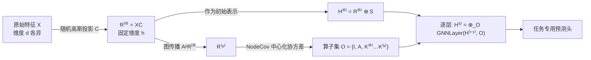

# Bridging Input Feature Spaces Towards Graph Foundation Models

**会议**: ICLR 2026  
**OpenReview**: [https://openreview.net/forum?id=Dt4XAIKYbf](https://openreview.net/forum?id=Dt4XAIKYbf)  
**代码**: 待确认  
**领域**: 图基础模型 / 图表示学习  
**关键词**: Graph Foundation Models, 特征异质性, 随机投影, 节点协方差, 跨数据集迁移  

## 一句话总结
ALL-IN 用「随机高斯投影 + 节点协方差算子」把维度/语义/取值范围各不相同的图节点特征统一成一个与原始特征空间无关的共享表示，让单个预训练 GNN 无需改架构、无需重训就能迁移到带全新输入特征的未见数据集。

## 研究背景与动机
**领域现状**：基础模型在语言、视觉领域之所以成功，很大程度依赖一个「共享输入空间」——文本是 token、图像是像素，预训练知识可以天然跨任务复用。图学习社区也想要这样的图基础模型（GFM），希望一个模型跨数据集、跨任务通用。

**现有痛点**：图数据偏偏没有共享输入空间。不同图数据集的节点特征不仅语义不同，连**维度 $d$、取值范围都不一样**：在维度 $d$ 上训练的 GNN，根本无法直接喂给维度 $d'$ 的图。现有 GFM 走两条路都各有缺陷——一条把图序列化成文本接 LLM，但会丢掉细粒度图结构；另一条用输入投影/专用编码器对齐特征空间，但往往绑死在特定任务或场景，换个数据集就要重新适配。

**核心矛盾**：要做到「特征对齐」，最自然的想法是学一个把各种特征映射到公共空间的投影；但只要这个映射依赖原始特征的**顺序、维度、基**，就无法对「特征重排、维度不匹配、基变换」保持鲁棒，迁移就会失效。换言之，矛盾在于既要构造与原始特征空间无关的表示，又要保留区分节点所需的判别力。

**本文目标**：提出一个简单、有理论保证的机制，让图模型对输入特征的顺序、维度、基都不敏感，从而真正跨数据集迁移。

**核心 idea**：**「不直接用原始特征，而是用特征经随机投影后的二阶统计量（节点协方差）作为图算子」**——节点协方差刻画的是「节点间相似度」，这个量与原始特征是几维、什么语义、什么基都无关，于是天然成为跨数据集的公共空间。

## 方法详解

### 整体框架
ALL-IN（All Input spaces）把原始节点特征 $X$ 先用一次性采样的随机高斯矩阵投影到固定维度的 $R^{(0)}$，再在这个投影空间上算一组节点协方差矩阵 $\{K^{(p)}\}$（含图传播后的高阶版本）。这些 $n\times n$ 协方差矩阵连同单位阵 $I$、邻接阵 $A$ 一起，作为 GNN 各层的**图算子**参与消息传递；同时 $R^{(0)}$ 本身也作为初始节点表示喂进去以保留一阶信息。下游不再触碰原始特征，因此换数据集只换预测头即可。

### 关键设计

**1. 随机高斯投影：把特征顺序「搅匀」成分布不变。** 每次前向都重新采样一个各向同性高斯矩阵 $C\in\mathbb{R}^{d\times h}$（$\mathrm{vec}(C)\sim\mathcal{N}(0,I_{dh})$），令 $R^{(0)}=XC$ 把任意维度 $d$ 的特征压到固定维度 $h$。关键性质（Proposition 4.1）是：对特征做任意置换 $XP$ 后，$R^{(0)}$ 与 $\bar R^{(0)}=(XP)C$ **在分布上相等**——随机投影把特征"混合"了，原始排列顺序在统计意义上失效。注意这是**分布不变而非逐点不变**：给定一个具体的 $C$，特征顺序仍会影响单次结果，于是模型既获得对重排的鲁棒性，又没丢掉区分节点的判别力（Theorem 4.3 证明随机算子 $\mathrm{NodeCov}(XC)$ 能区分确定性算子 $\mathrm{NodeCov}(X)$ 区分不了的节点对）。

**2. 节点协方差算子：用二阶统计量构造与特征空间无关的图算子。** 把 $R^{(0)}$ 的每一列当作节点上的 i.i.d. 信号，先中心化 $R^{(0)}_c=\Pi_c R^{(0)}$（$\Pi_c=I_n-\frac1n\mathbf{1}_n\mathbf{1}_n^\top$ 是几何中心化矩阵），再算
$$K^{(0)}=\mathrm{NodeCov}(R^{(0)})=\frac{1}{h}R^{(0)}_c {R^{(0)}_c}^\top\in\mathbb{R}^{n\times n}.$$
这个 $n\times n$ 矩阵刻画节点在投影空间里「特征活动如何共变」，即节点相似度，因此**与原始特征的语义、取值、维度全部无关**。理论上其期望恰好是中心化原始特征的 Gram 矩阵 $\Pi_c XX^\top\Pi_c$，并且期望算子对特征的任意正交变换（基变换）不变（Theorem 4.4），保证换一组正交基描述同一份信息时表示稳定。

**3. 高阶传播协方差：把图结构注入特征相似度。** 仅靠 $K^{(0)}$ 只有特征信息没有结构信息。于是先用邻接阵传播投影特征 $R^{(p)}=A^p R^{(0)}$，再对其算协方差
$$K^{(p)}=\frac{1}{h}R^{(p)}_c{R^{(p)}_c}^\top,\quad p=1,\dots,k,$$
$K^{(p)}$ 捕捉的是「聚合了 $p$ 跳邻域后」的节点相似度，$p$ 越大编码的全局结构上下文越多。Corollary 4.2 保证整套 $\{K^{(p)}\}$ 仍对特征置换分布不变。

**4. 多算子并行消息传递 + 保留一阶信息。** 把所有算子收进集合 $O=\{I,A,K^{(0)},\dots,K^{(k)}\}$，每层对每个算子各做一次消息传递再拼接：
$$H^{(\ell)}=\bigoplus_{O\in O}\mathrm{GNNLayer}^{(\ell,O)}(H^{(\ell-1)},O).$$
初始表示 $H^{(0)}=R^{(0)}\oplus S$ 直接带上投影特征 $R^{(0)}$（$S$ 为随机游走等结构编码），因为纯协方差是二阶量会丢一阶信息——例如 $X_v=-X_u$ 时两者协方差自相关项相同，但 $R^{(0)}_v=-R^{(0)}_u$ 在 $H^{(0)}$ 里仍可区分。对同样跨数据集变化的**边特征**，方法用同款随机投影 + 节点级聚合 + 协方差，得到 $K^{(p)}_{\text{edge}}$ 一并加入算子集，从而边信息也跨数据集兼容。

## 实验关键数据
两个核心问题：(Q1) 单个 ALL-IN 联合预训练在 9 个异质数据集上，相比每个数据集单独训练会不会掉点？(Q2) 冻结预训练表示后，迁移到带**全新输入特征**的未见数据集效果如何？

### 主实验表格
**Q1 — 联合预训练 vs 专用模型（9 个源数据集，分子/视觉/3D 形状混合，任务含分类与回归）：**

| 方法 | ZINC (MAE↓) | MOLHIV (AUC↑) | MNIST (ACC↑) | CUNEIFORM (ACC↑) | MSRC 21 (ACC↑) |
|---|---|---|---|---|---|
| ALL-IN-SPECIALIZED（逐数据集训练） | **0.1195** | 73.78 | 94.77 | 87.20 | 94.16 |
| ALL-IN（一个模型联合训练全部） | 0.1237 | **74.49** | **95.22** | **91.17** | **98.08** |

单个联合模型在 9 个里有 5 个反超专用模型，CUNEIFORM、MSRC 21 提升尤其明显，说明共享表示不仅不掉点还能从多源数据互相获益。

**Q2 — 冻结迁移到未见数据集（节点分类，全新特征）：**

| 方法 | CORA | CITESEER | PUBMED |
|---|---|---|---|
| GCN（监督，从头训练） | 78.86 | 64.52 | 74.49 |
| GRAPHANY | 79.36 | 68.42 | 76.30 |
| SCORE | 81.80 | 71.33 | **82.93** |
| AutoGFM | 80.32 | N/A | 78.28 |
| **ALL-IN** | **82.13** | 69.12 | 78.03 |

**图级迁移（未见数据集，全新特征）：**

| 方法 | MUTAG | PROTEINS |
|---|---|---|
| GIN（监督） | 89.40 | 76.20 |
| SCORE | 85.33 | 68.54 |
| ALL-IN-ONE | 79.87 | 66.49 |
| **ALL-IN** | **92.90** | **78.20** |

CORA 上 82.13% 超过监督 GCN 与多个 SOTA GFM；MUTAG 上 92.90% 同时超过监督 GIN 和 SCORE，且 ALL-IN 不像 GRAPHANY/GCOPE/ANYGRAPH 那样只支持节点分类，节点+图级任务通吃。

### 消融实验表格
论文以 "(0 props)" 变体（不带图传播协方差、只有 $K^{(0)}$）作为消融对照：

| 变体 | CORA | MUTAG | MSRC 21（源） |
|---|---|---|---|
| ALL-IN (0 props) | 79.26 | 92.50 | 97.51 |
| ALL-IN（含传播算子） | **82.13** | **92.90** | **98.08** |

无论源数据集还是迁移数据集，引入高阶传播协方差 $K^{(p)}$ 都稳定带来提升，验证了「把图结构注入特征相似度」这一设计的价值。

### 关键发现
- **分布不变 ≠ 表示退化**：随机投影换来的迁移能力没有以牺牲判别力为代价，反而在多个 benchmark 上超过专门设计的 GFM。
- **二阶统计量是跨特征空间的硬通货**：协方差天然抹掉维度/基/语义差异，是绕开「图无共享输入空间」难题的关键。
- **冻结即用**：迁移时编码器全程冻结、只训新预测头，证明学到的是通用表示而非过拟合到源任务。

## 亮点与洞察
- **抓住了 GFM 最本质的障碍**——别人在卷结构对齐、卷 LLM prompt，本文直指「特征空间不共享」这个根因，用一个统计学上干净的机制（随机投影 + 协方差）一招化解维度、顺序、基三类异质性。
- **理论与方法高度自洽**：分布不变（置换）、期望不变（正交基）、维度无关三条性质都有命题/定理支撑，且 Theorem 4.3 还反向论证了"随机"比"确定性协方差"更有表达力，逻辑闭环。
- **极简且无侵入**：不改 GNN 架构、不需重训、迁移只换头，工程落地成本极低。

## 局限与展望
- **稠密协方差的可扩展性**：$K^{(p)}$ 是 $n\times n$ 稠密矩阵，在超大图上和图 Transformer 一样面临内存/算力瓶颈；作者把「稀疏近似协方差算子」列为关键未来方向。
- **随机投影或非最优**：当前用的是各向同性高斯随机投影，作者指出探索结构化/可学习的输入投影可能进一步提升表达力。
- **理论条件偏定性**：跨数据集可迁移性的条件分析（Section 4.3）更多是定性/大投影维度下的一致性，对真实分布差异下的迁移保证仍有空间细化。

## 相关工作与启发
- **与 LLM-based GFM 的分野**：OFA、GraphText 等把图转文本接 LLM，会丢结构细节且依赖文本属性；ALL-IN 完全在图几何/统计层面工作，不需任务或领域特定的 prompt。
- **与特征对齐类 GFM 的对比**：AnyGraph、GCOPE、MDGPT 等学输入投影或对齐器，但常绑死单一任务（多只支持节点分类）；ALL-IN 用协方差天然不变性做到节点+图级通吃。
- **启发**：「把异质输入折叠进一个由二阶统计量定义的不变空间」这一思路，对任何缺乏共享输入域的模态（如异构表格、多源传感器）都有借鉴意义——当无法对齐特征本身时，可以转而对齐特征间的关系（协方差/相似度结构）。

## 评分
- **新颖性**: ⭐⭐⭐⭐⭐ 用随机投影 + 节点协方差直击"图无共享输入空间"根因，视角新、机制简洁，并配齐分布不变/期望不变的理论证明。
- **实验充分度**: ⭐⭐⭐⭐ 覆盖 9 源数据集联合预训练 + 节点/图级未见数据集迁移，对比 20+ 基线，(0 props) 消融到位；但超大图扩展性、随机投影的敏感性分析略缺。
- **写作质量**: ⭐⭐⭐⭐ 动机—方法—理论—实验逻辑清晰，图 1/图 2 直观；理论部分密度较高，需一定背景。
- **价值**: ⭐⭐⭐⭐⭐ 为 input-agnostic、可迁移的图基础模型指出一条简单可落地的路径，且核心思想可外推到其他无共享输入域的模态。

<!-- RELATED:START -->

## 相关论文

- [\[ICLR 2026\] Multi-Domain Riemannian Graph Gluing for Building Graph Foundation Models](multi-domain_riemannian_graph_gluing_for_building_graph_foundation_models.md)
- [\[ICLR 2026\] Graph Tokenization for Bridging Graphs and Transformers](graph_tokenization_for_bridging_graphs_and_transformers.md)
- [\[ICLR 2026\] Bridging ML and Algorithms: Comparison of Hyperbolic Embeddings](bridging_ml_and_algorithms_comparison_of_hyperbolic_embeddings.md)
- [\[ICLR 2026\] ReLaSH: Reconstructing Joint Latent Spaces for Efficient Generation of Synthetic Hypergraphs with Hyperlink Attributes](relash_reconstructing_joint_latent_spaces_for_efficient_generation_of_synthetic_.md)
- [\[ICML 2026\] When Do Graph Foundation Models Transfer? A Data-Centric Theory](../../ICML2026/graph_learning/when_do_graph_foundation_models_transfer_a_data-centric_theory.md)

<!-- RELATED:END -->
