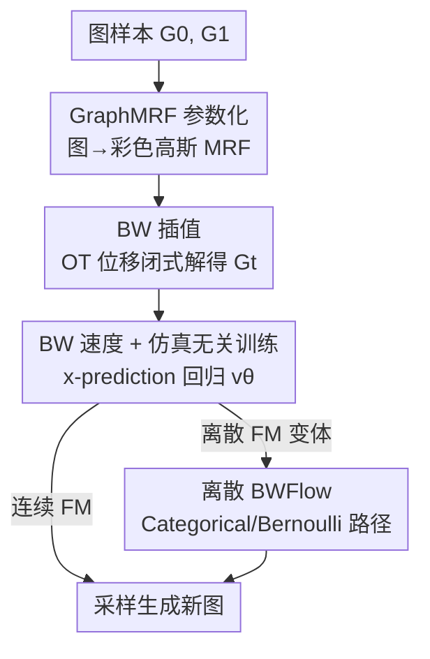

# Bures-Wasserstein Flow Matching for Graph Generation

**会议**: ICLR2026  
**OpenReview**: [https://openreview.net/forum?id=5Bl5qf3fON](https://openreview.net/forum?id=5Bl5qf3fON)  
**代码**: 待确认  
**领域**: 图生成 / 流匹配  
**关键词**: 图生成、流匹配、最优传输、Bures-Wasserstein、马尔可夫随机场  

## 一句话总结
针对现有图生成扩散/流模型「把节点和边拆开各自线性插值」导致概率路径不平滑、训练采样都难收敛的问题，本文用马尔可夫随机场（MRF）把图建模成一个相互耦合的彩色高斯系统，再用图分布之间的最优传输（Bures-Wasserstein）位移构造出一条平滑、闭式、仿真无关的概率路径，得到流匹配框架 BWFlow，在平面图与分子生成上取得更好性能、更快收敛和更高效采样。

## 研究背景与动机
**领域现状**：图生成（药物发现、电路设计、蛋白设计、社交网络分析）目前最强的两类方法是扩散模型和流模型。它们都能统一到「随机插值 / 流匹配」框架下：先从参考分布 $p_0$ 采样、从数据分布 $p_1$ 采样，再构造一条随时间连续的概率路径 $p_t,\ 0\le t\le 1$ 把两端连起来，然后训练一个模型去回归这条路径上的速度场（连续情形）或比率矩阵（离散情形），最后从 $p_0$ 出发沿学到的速度场积分得到近似服从 $p_1$ 的样本。

**现有痛点**：这套框架最核心的一步是「怎么构造概率路径 $p_t$」。文本/图像生成里通常直接在源、目标之间做**线性插值**。图生成模型几乎照搬了这套设计——把每个节点、每条边当成**互相独立**的对象，各自在「节点空间 ⊕ 边空间」这个分离（disjoint）的空间里线性插值。但图的关键恰恰是节点与边强耦合：一个节点的意义高度依赖它邻居的配置。线性插值切断了这种耦合，造出来的概率路径既不平滑也不规则——论文用一个 motivating example 展示：线性路径在 $t<0.82$ 时几乎是平的（远离数据），到 $t\approx0.82$ 才陡降。这导致两个直接后果：① 关键过渡区 $0.8<t<1$ 训练样本太少、速度场欠拟合；② 平坦区（$t<0.8$）学到的速度根本指不向数据分布，采样早期找不到正确方向，最终收敛失败、留下明显的「收敛 gap」。

**核心矛盾**：根因在于线性路径无法刻画图各组件的**全局协同演化（co-evolution）**，也无法在非欧的图分布之间保证**最优传输位移**。图是非欧、相互连接的对象，违反了「线性插值=OT 解」所需的欧氏 + 各向同性高斯假设，所以盲目线性插值得到的路径是次优的，甚至会跑出合法图的流形之外。此前一些工作（如 DeFoG 用 target guidance / time distortion / 随机注入）其实是用**启发式手段事后修路**才把性能救回来，并没有从原理上解决。

**本文目标**：抛开启发式修路，建立一个**有理论依据**的图概率路径构造框架，使得路径在每个时刻 $t$ 都平滑、都能给出指向数据分布的有意义速度。

**切入角度**：从统计关系学习借用**马尔可夫随机场（MRF）**——它天然把节点/边组织成一个相互连接的系统，两个 MRF 之间插值就捕捉了图系统的联合演化。再结合「图分布之间的闭式 Wasserstein 距离」，就能用最优传输位移来定义插值。

**核心 idea**：把图参数化成 GraphMRF（彩色高斯），在 MRF 之间做 **Bures-Wasserstein 最优传输插值** 替代节点/边独立的线性插值，从而得到尊重图几何、平滑且仿真无关的概率路径与速度场。

## 方法详解

### 整体框架
BWFlow 要解决的是「概率路径怎么构造」这一个问题，整体思路是把流匹配里那条原本靠线性插值拼出来的路径，换成在图分布的最优传输几何里推导出来的平滑路径。一次完整流程是：从参考分布和数据分布各采一个图 $G_0,G_1$；把这两个图分别转写成 GraphMRF（一个把节点特征与图结构耦合在一起的彩色高斯分布）；在两个 MRF 之间做 Bures-Wasserstein 插值，得到任意时刻 $t$ 的中间态 $G_t$（闭式解，无需仿真）；把 $G_t$ 转回图域，用它作为训练样本，以 x-prediction 的方式训练速度场 $v_\theta(G_t,t)$；推理时从 $G_0$ 出发，反复用学到的速度积分 $G_{t+dt}=G_t+v_\theta(G_t)\,dt$ 直到 $t=1$ 得到新图。整套既有连续流匹配版本，也推广到了离散流匹配版本。

### 关键设计

**1. GraphMRF 参数化：把图写成节点-边耦合的彩色高斯**

针对「节点/边独立建模切断了图耦合」这个痛点，作者用马尔可夫随机场把整张图建成一个相互连接的系统。具体把图的联合密度分解成 $p(G;\mathbf{G})=p(X,E;\mathbf{X},W)=p(X;\mathbf{X},W)\,p(E;W)$，其中节点特征密度按 MRF 假设拆成**节点势** $\varphi_1(v)=\exp\{-(\nu+d_v)\|Vx_v-\mu_v\|^2\}$ 和**成对势** $\varphi_2(u,v)=\exp\{w_{uv}(Vx_u-\mu_u)^\top(Vx_v-\mu_v)\}$ 的乘积。成对势里显式带上了边权 $w_{uv}$，这正是「节点意义依赖邻居」的数学化——边的存在与否直接进入了节点特征的联合分布。整理后节点特征服从一个**彩色高斯**

$$\mathrm{vec}(X)\sim \mathcal{N}(\mathbf{X},\Lambda^{\dagger}),\quad \mathbf{X}=\mathrm{vec}(V^{\dagger}\mu),\ \Lambda=(\nu I+L)\otimes V^\top V,$$

边则用 Dirac 发射 $E\sim\delta(W)$。这里 $L=D-W$ 是图拉普拉斯，$\otimes$ 是 Kronecker 积。这样做的好处有两点：一是协方差里出现了 $(\nu I+L)$，把全图结构信息（尤其是低频谱）编进了节点分布，等价于把图搬进了一个保留全局信息的「隐空间」；二是彩色高斯有闭式的 OT 距离，为下一步的解析插值铺好了路。作者也坦言（Remark）：MRF 对谱宽较窄的图增益明显，对谱宽很大的图（如树）帮助有限，这也解释了后面树图上的相对劣势。

**2. Bures-Wasserstein 插值：在图分布间走最优传输位移**

有了彩色高斯表示，就能把「两个图之间该怎么插值」变成「两个高斯之间的最优传输」。论文先把图 Wasserstein 距离分解为节点项与边项之和 $d_{BW}(G_0,G_1)=W_c(\eta_{X_0},\eta_{X_1})+W_c(\eta_{E_0},\eta_{E_1})$，再借高斯之间的闭式 OT 公式推出（Proposition 1，要求两个拉普拉斯 PSD 且只有一个零特征值）

$$d_{BW}(G_0,G_1)=\|X_0-X_1\|_F^2+\beta\,\mathrm{trace}\Big(L_0^{\dagger}+L_1^{\dagger}-2\big(L_0^{\dagger/2}L_1^{\dagger}L_0^{\dagger/2}\big)^{1/2}\Big),$$

其中第二项正是矩阵 Bures-Wasserstein 距离的形式。插值点定义为位移最小化问题 $G_t=\arg\min_{\tilde G}(1-t)\,d_{BW}(G_0,\tilde G)+t\,d_{BW}(\tilde G,G_1)$ 的解，闭式给出（Proposition 2）：节点特征仍走线性 $X_t=(1-t)X_0+tX_1$，但拉普拉斯走的是**非线性的 BW 测地线**

$$L_t^{\dagger}=L_0^{1/2}\Big((1-t)L_0^{\dagger}+t\,(L_0^{\dagger/2}L_1^{\dagger}L_0^{\dagger/2})^{1/2}\Big)^2 L_0^{1/2}.$$

关键在于：这条路径始终落在合法图流形上、尊重非欧几何，因此是平滑的——实验里它先把模型暴露到稍微偏离分布（A.Ratio 升高）做早期探索，之后单调收敛，正好填上了线性路径留下的收敛 gap。与之对比，谐波/几何插值会直接走出合法图域，让学习变成病态问题。这一步是全文的理论核心：把「修路的启发式」换成了「OT 几何下唯一确定的测地线」。

**3. Bures-Wasserstein 速度场与仿真无关训练**

有了闭式插值就能对时间求导拿到闭式**速度场**（Proposition 3）。节点速度是线性的 $v_t(X_t\mid G_0,G_1)=\frac{1}{1-t}(X_1-X_t)$；边速度则来自拉普拉斯的导数 $v_t(E_t\mid G_0,G_1)=\dot W_t=\mathrm{diag}(\dot L_t)-\dot L_t$，其中 $\dot L_t=2L_t-TL_t-L_tT$、$T=L_0^{1/2}(L_0^{\dagger/2}L_1^{\dagger}L_0^{\dagger/2})^{1/2}L_0^{1/2}$。训练采用 **x-prediction**：不直接回归速度，而是训一个去噪器 $p^\theta_{1\mid t}(\cdot\mid G_t)$ 去预测干净图 $G_1$，等价于最大化对数似然 $\mathcal{L}_{CFM}=\mathbb{E}\big[\log p^\theta_{1\mid t}(G_1\mid G_t)\big]$，其中 $G_t$ 因为有闭式插值可以**仿真无关**地直接采到（无需在训练时反复数值积分速度场）。这带来两点实际收益：训练更稳更省（避免在训练时评估条件向量场），采样时也能用很少的步数完成（见行为分析）。训练/采样分别对应 Algorithm 1、2：训练里采 $t\sim U(0,1)$、算 BW 插值、x-prediction、回传；采样里从 $\hat G_0$ 起，每步先预测 $\tilde G_1$、再算速度、再数值前进一步。

**4. 离散 Bures-Wasserstein 流匹配：把同一套路径搬到离散空间**

既有研究发现图生成的**离散**版本往往比连续版本更好，作者据此把 BWFlow 推广到离散流匹配。离散概率路径写成 $p_t(x_v\mid G_0,G_1)=\mathrm{Categorical}([X_t]_v)$、$p_t(e_{uv}\mid G_0,G_1)=\mathrm{Bernoulli}([W_t]_{uv})$，复用前面同样的 $X_t$ 与 $L_t$（Dirac 是 Categorical/Bernoulli 概率取 0/1 的特例，所以边界条件自然满足）。节点的离散速度可写成两个边界条件的混合 $v_t(X_t)=[\delta(\cdot,X_1)-\delta(\cdot,X_t)]/(1-t)$；但边的路径因为是**非线性**插值，不能写成边界条件的混合，作者另行推出

$$v_t(E_t\mid G_1,G_0)=(1-2E_t)\frac{\dot W_t}{W_t\circ(1-W_t)},$$

$\circ$ 为 Hadamard 积。这样同一套 BW 几何就同时覆盖了连续与离散两种流匹配，扩展了适用范围（多数图/分子基准其实更吃离散版本）。

### 损失函数 / 训练策略
核心目标就是条件流匹配的 x-prediction 似然 $\mathcal{L}_{CFM}=\mathbb{E}_{G_1\sim p_1,G_0\sim p_0,\,t\sim U[0,1],\,G_t\sim p_{t\mid 0,1}}\big[\log p^\theta_{1\mid t}(G_1\mid G_t)\big]$。为公平对比「路径构造」本身的贡献，实验里固定 backbone 为同一个 graph transformer，并**关掉**所有事后修路技巧（DeFoG 的 time distortion / target guidance、Cometh 的 predictor-corrector）。BW 插值会引入额外 $O(N^3)$ 的线性代数开销，作者指出在大而稀疏的图上可用 QR 分解的迭代最小二乘降到 $O(TN^2)$。

## 实验关键数据

### 主实验
平面图生成（planar/tree/SBM，关掉所有修路技巧，取收敛后最后 5 个 checkpoint 的 CAVG）：BWFlow 在 A.Ratio 上全面最优，V.U.N. 在 Planar / SBM 超过多数对手；唯一短板是 tree 的 V.U.N.（作者归因于树图谱型差异，MRF 对宽谱图增益有限）。

| 数据集 | 指标 | BWFlow | DeFoG(Flow) | Cometh(Diff) | 训练集上界 |
|--------|------|--------|-------------|--------------|------------|
| Planar | V.U.N.↑ / A.Ratio↓ | **84.8 / 2.4** | 77.5 / 3.5 | 80.5 / 3.0 | 100 / 1.0 |
| Tree | V.U.N.↑ / A.Ratio↓ | 81.5 / **1.3** | 83.5 / 1.9 | 84.5 / 2.0 | 100 / 1.0 |
| SBM | V.U.N.↑ / A.Ratio↓ | 84.5 / **2.3** | 85.0 / 3.4 | 77.5 / 4.7 | 85.9 / 1.0 |

3D 分子生成（忽略键型、只用二值邻接验证「生成图结构」的能力）：BWFlow 在 QM9、GEOM 上对 MiDi、FlowMol 都有明显提升。

| 数据集 | V.U.N.↑ | Mol.Stab.↑ | Atom.Stab.↑ | Angles(°)↓ |
|--------|---------|------------|-------------|-----------|
| QM9 — MiDi | 93.13 | 93.98 | 99.60 | 2.21 |
| QM9 — **BWFlow** | **96.45** | **97.84** | **99.84** | **1.96** |
| GEOM — FlowMol | 82.20 | 36.90 | 94.60 | 6.5 |
| GEOM — **BWFlow** | **87.75** | **46.80** | **95.08** | **3.96** |

### 消融实验
两个关键消融：① 把采样步数砍到原来的 3%（30 步 vs 1k 步），看少步采样的鲁棒性；② 换不同插值方式（谐波/几何/线性/BW），看路径构造本身的贡献。

| 配置 | 关键指标 | 说明 |
|------|---------|------|
| BWFlow（30 步，Planar） | V.U.N. 77.0 / A.Ratio 4.1 | 少步采样仍强，显著超 DeFoG-2（72.0 / 6.3） |
| BWFlow（30 步，SBM） | V.U.N. 52.0 / A.Ratio 2.6 | 超 DeFoG-2（47.5 / 3.1）、Cometh（43.0 / 3.3） |
| 插值=线性/谐波/几何 | V.U.N. 明显更低 | 谐波/几何会走出合法图域，线性路径不平滑 |
| 插值=Bures-Wasserstein | V.U.N. 最高 | 平滑、留在图流形内，收敛更快 |

### 关键发现
- **路径平滑度是性能主因**：BW 插值的 A.Ratio 沿 $t$ 先升（早期探索 OOD 样本）后单调收敛，恰好补上线性路径的收敛 gap；谐波/几何插值步出合法图域使学习病态。
- **少步采样优势最突出**：步数压到 3% 时 BWFlow 相对优势被放大，说明平滑路径让每一步速度都「指得准」，对步数预算不敏感。
- **MRF 的适用边界很清楚**：对窄谱图（planar/SBM/分子）增益大，对宽谱图（tree）几乎没帮助，这是 V.U.N. 在树上落后的直接原因——是诚实的负结果而非随机波动。

## 亮点与洞察
- **把「修路」换成「几何」**：以往靠 target guidance、time distortion 这类启发式事后把路径掰平，本文证明只要在正确的 OT 几何（图 Gaussian 的 Bures-Wasserstein）里推导，平滑路径是**唯一确定**地推出来的，理论上更干净。
- **彩色高斯带来双赢**：用 MRF + 彩色高斯既显式建了节点-边耦合，又保留了闭式 OT 距离/插值/速度，让整条路径**仿真无关**——这正是训练稳、采样省的根。
- **节点线性、边非线性的拆分很巧**：节点特征仍走简单线性插值，复杂性全压在拉普拉斯的 BW 测地线上，既抓住了结构耦合，又没让节点侧的计算爆炸。
- **可迁移点**：「先把对象嵌进一个有闭式 OT 的分布族，再在该族的 Wasserstein 几何里造流匹配路径」这一范式，可推广到其它非欧/结构化数据（点云、网格、关系数据）的生成。

## 局限与展望
- **不支持多种边类型**：框架建立在单一拉普拉斯参数化上，难直接处理多关系/多键型图（附录有初步尝试但不完整）；分子生成时只能忽略键型当二值邻接，作者认为补上键型可再涨一截。
- **额外计算开销**：BW 插值带来 $O(N^3)$ 的线代开销，大图上需用 QR 迭代最小二乘降到 $O(TN^2)$，但这只是初步实验。
- **MRF 通用性受限**：GMRF 只对窄谱图有效，对宽谱（如树）无增益，树图 V.U.N. 落后即源于此；扩展到更复杂谱型是明确的未来方向。
- **范围限定在流模型**：正文聚焦 flow，扩散版本只在附录讨论，尚未系统验证。

## 相关工作与启发
- **vs 线性插值流/扩散（DeFoG、Cometh、DiGress、GruM）**：它们把节点/边独立线性插值、再用启发式修路；BWFlow 用 MRF + BW 测地线从原理上构造平滑路径，关掉所有修路技巧仍更优，且少步采样优势更大。
- **vs Haasler & Frossard (图上 OT)**：本文在其基础上推出图分布之间**闭式**的 Bures-Wasserstein 距离与插值（Proposition 1-2），并落到可训练的流匹配框架，而非停在距离定义。
- **vs 一般 CFM / 随机插值（Tong et al., Albergo & Vanden-Eijnden）**：经典 CFM 在欧氏 + 各向同性高斯下线性插值=OT 解，本文指出图是非欧、互联对象不满足该条件，于是改用 GraphMRF 的彩色高斯几何重建 OT 插值。

## 评分
- 新颖性: ⭐⭐⭐⭐⭐ 把图生成的概率路径问题归约到图 Gaussian 的 Bures-Wasserstein 最优传输，理论自洽且首次给出闭式图 BW 插值/速度。
- 实验充分度: ⭐⭐⭐⭐ 覆盖平面图与 2D/3D 分子、含少步采样与插值消融，但对宽谱图（树）与多键型场景验证不足。
- 写作质量: ⭐⭐⭐⭐ 推导严谨、motivating example 清晰，但命题/附录密集，工程读者上手门槛较高。
- 价值: ⭐⭐⭐⭐ 给结构化生成提供了「嵌入有闭式 OT 的分布族再造路径」的可迁移范式，性能与采样效率均有实证收益。

<!-- RELATED:START -->

## 相关论文

- [\[ICLR 2026\] Topological Flow Matching](topological_flow_matching.md)
- [\[ICLR 2026\] Discrete Bayesian Sample Inference for Graph Generation](discrete_bayesian_sample_inference_for_graph_generation.md)
- [\[ICLR 2026\] GraphUniverse: Synthetic Graph Generation for Evaluating Inductive Generalization](graphuniverse_synthetic_graph_generation_for_evaluating_inductive_generalization.md)
- [\[ICLR 2026\] Global and Local Topology-Aware Graph Generation via Dual Conditioning Diffusion](global_and_local_topology-aware_graph_generation_via_dual_conditioning_diffusion.md)
- [\[ICLR 2026\] Controllable Logical Hypothesis Generation for Abductive Reasoning in Knowledge Graphs](controllable_logical_hypothesis_generation_for_abductive_reasoning_in_knowledge_.md)

<!-- RELATED:END -->
