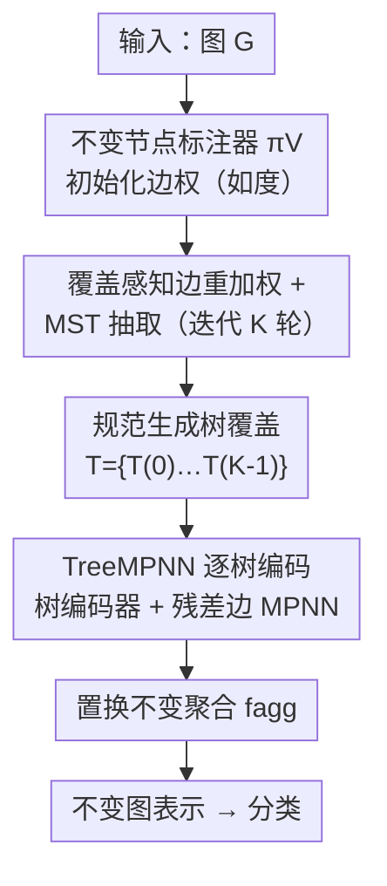

# Canonical Tree Cover Neural Networks for Expressive and Invariant Graph Learning

**会议**: ICLR2026  
**OpenReview**: [https://openreview.net/forum?id=yumDmlGCc9](https://openreview.net/forum?id=yumDmlGCc9)  
**代码**: https://github.com/MLD3/CanonicalTreeNNs  
**领域**: 图学习 / GNN 表达力  
**关键词**: 图正则化, 生成树覆盖, GNN 表达力, 同构不变性, 距离失真

## 一句话总结
针对"把图压成单条序列做正则化（canonicalization）会扭曲图上距离、且表达力被节点标注器卡死"这两个老毛病，本文提出 CTNN：把图表示成**一组规范化的生成树覆盖**（canonical spanning tree cover），每棵树用表达力强的递归树编码器处理再聚合，理论上既保不变性、又更好地保距离、还严格强于序列正则化，在稀疏分子/蛋白图分类上稳定超过不变 GNN 和序列正则化基线。

## 研究背景与动机

**领域现状**：在图表示学习里要让模型对图同构不变（节点重新编号不改变输出），主流有三条路。一是把不变性写进架构——消息传递网络（MPNN，如 GCN/GAT/GIN）靠对邻居做置换不变聚合天然不变；二是靠随机采样——随机游走网络（RWNN）采样若干游走序列喂给强序列模型；三是**正则化（canonicalization）**：给每张图算一个唯一的、同构不变的代表（representative），然后让任意一个表达力强但本身不具不变性的模型在这个固定输入上跑，从而绕开昂贵采样。

**现有痛点**：MPNN 的表达力被证明只等价于 1-WL 测试，还有 oversmoothing / oversquashing 的老问题，天花板很低。RWNN 虽然突破了 MPNN 的表达力，但在大数据集上采样成本可能高到不可接受。而现有的图正则化方法几乎都走同一条路：先给节点打标签（learned sorting 或像 canonical SMILES 那样的遍历），把整张图**拍平成单条序列**，再喂给序列模型——这里藏着两个致命缺陷。

**核心矛盾**：第一，拍平成一维序列会**严重扭曲图上的距离**。以 $n$ 个节点的星图 $S_n$ 为例，每个叶子到中心在图上距离都是 1，但摆到一条线上后叶子到中心的序列距离必然是 $O(n)$（拉伸 stretch）；同时图上互相距离为 2 的两个叶子，在序列里可能相邻、距离变成 1（收缩 contraction）。距离被拉伸和收缩后，结构信息对下游模型就更难捕捉。第二，**单条序列让整个流水线的表达力被节点标注器 $\pi_V$ 卡死**：哪怕下游序列模型是 universal 的，只要标注阶段（如 MPNN，等价 1-WL）丢了信息，后面再强也救不回来。

**本文目标**：找一种新的图正则化方式，既保住同构不变性，又能（i）更好地保持图上距离、（ii）不让表达力被单个标注器封顶。

**切入角度**：作者的关键观察是——序列的问题根源在于"单条 + 一维"。如果换成**树**来承载结构，距离失真天然更小（树上的距离更贴近随机游走距离）；如果换成**一组**代表而不是单个代表，就能突破单标注器的表达力上限。两者一结合，就是"一组规范生成树"。

**核心 idea**：用**规范化生成树覆盖**代替单条规范序列——每棵树由表达力强的递归树编码器处理，对一组树聚合得到不变表示；理论上树覆盖比序列更保距离，在稀疏图上只要对数棵树就能覆盖所有边，从而严格强于序列正则化。

## 方法详解

### 整体框架
CTNN 要解决的是"如何把一张图变成既不变、又保距离、又表达力高的输入"。它的整体转法是：不再产出一条序列，而是产出**一组生成树** $\mathcal{T}=\{T^{(k)}\}_{k=0}^{K-1}$。这组树用"覆盖感知（coverage-aware）的边标注 + 最小生成树（MST）抽取"迭代构造——每轮抽一棵 MST，把这轮用过的边加权惩罚，逼着下一轮去选还没覆盖到的边，于是 $K$ 棵树的并集能可证地覆盖全图的边。拿到这组树后，每棵树用递归树编码器（如 Tree-LSTM）处理，并补一个在"非树边"上的 MPNN 来捞回单棵树漏掉的局部连接，最后对整组树做置换不变聚合得到图级表示。

### 关键设计

**1. 覆盖感知的规范生成树覆盖：用迭代重加权 MST 逼出"对数棵树覆盖全图"**

序列正则化的第一个病是只有一个代表、表达力被标注器封顶。CTNN 的解法是构造**一组**树，并且保证这组树"看得全"。具体做法：用一个同构不变的节点标注器 $\pi_V$（如度 $\deg(v)$）初始化边权 $\pi_E^{(0)}(e) = -\big(\pi_V(e_u)+\pi_V(e_v)\big)$，让 MST 偏向连接高标签节点的边；每轮用 MST 抽取器 $C_{\text{tree}}$ 在当前边权下抽一棵生成树 $T^{(k)}$，并以根节点取树的中心；然后对这轮被选中的边施加惩罚 $\tau$ 来更新边权：

$$\pi_E^{(k+1)}(e) = \pi_E^{(k)}(e) + \tau\,\mathbf{1}\{e\in T^{(k)}\}$$

惩罚让已用过的边在下一轮"变贵"，于是后续的树被推着去选还没覆盖的边。理论保证（Lemma 5.3）：取 $\tau$ 足够大、迭代 $K\ge \Upsilon(G)\ln m$ 轮（$\Upsilon(G)$ 是图的 arboricity，即覆盖全图所需最少森林数），这 $K$ 棵 MST 的并集就能覆盖**所有边** $\bigcup_k E(T^{(k)})=E$。在稀疏图上 arboricity 是常数，于是只要 $K\ge O(\log|V|)$ 棵树就够——这正是"对数棵树覆盖全图"，也是后面表达力论证的地基。

**2. TreeMPNN：递归树编码器 + 残差边消息传递，既享受树的低失真又不丢局部连接**

光有树覆盖还不够，每棵生成树都丢掉了一部分非树边，单棵树会漏掉局部连接。CTNN 对每棵树用一个**递归树编码器** $f_{\text{tree}}$（如 Tree-LSTM，自底向上从孩子向父亲传播，依据置换不变聚合 $h_v=f_{\text{agg}}\{\Phi(h_c,x_v)\mid c\in C(v)\}$），它的好处是依赖路径短、不像长序列那样梯度爆炸/消失。同时对这棵树的**残差图** $G\backslash T^{(k)}=(V, E\setminus E(T^{(k)}))$ 上跑一个 MPNN（如 GIN）把漏掉的局部边补回来：

$$f_{\text{TreeMPNN}}(T^{(k)})_i = f_{\text{tree}}(T^{(k)})_i + f_{\text{MPNN}}(G\backslash T^{(k)})_i$$

再对全体树聚合：$f_{\text{CTNN}}(G)=f_{\text{agg}}\big(\{f_{\text{TreeMPNN}}(T^{(k)})\}_{k}\big)$。为什么这样有效：递归树编码器吃下的是低失真的树结构（树上距离贴近随机游走距离），避开了序列模型在被拉伸/收缩的距离上学习的困难；而残差边 MPNN 只在"漏边"上补一刀，把损失的局部连接捞回来——消融显示在边更密的蛋白图上这一项尤其关键。

**3. 在确定性正则化与概率不变性之间插值：靠节点标注器选档位**

CTNN 的不变性强度由 $\pi_V$ 决定，作者给了一个统一的"插值"视角。一端是**确定性正则化**：用真正的图正则化工具（如 NAUTY）作为 $\pi_V$，它能把所有节点区分开，配上对边权的单射初始化，得到的树覆盖就是确定的规范表示——同构的图被映到完全相同的一组树，$f_{\text{CTNN}}(G)=f_{\text{CTNN}}(g\cdot G)$ 对任意置换 $g$ 严格成立，特别适合完全图/正则图这类高对称结构。另一端是**概率不变性**：用便宜但有结构含义的标注器（如度、中心性、1-WL），它们同构不变但可能给不同节点打相同分，于是用随机打破平局（random tie-breaking），诱导出一个对节点重标号不变的"生成树覆盖分布"。形式化为 Theorem 4.1：$f_{\text{CTNN}}(G)\overset{d}{=}f_{\text{CTNN}}(g\cdot G)$，从而期望 $\Phi(G)=\mathbb{E}[f_{\text{CTNN}}(G)]$ 是严格的不变函数。一句话：便宜标注器换来概率不变 + 有用的归纳偏置，贵标注器换来确定不变 + 对称图也不怕，按需要选。

### 损失函数 / 训练策略
预处理（构造 $K$ 棵 MST）用 Kruskal 算法，总代价 $O(Km\log n + \pi_V)$，稀疏图 $m=O(n)$ 且 $\pi_V$ 便宜时很高效；关键是这组树**训练前算一次、各 epoch 复用**，避免了 RWNN 那种 on-the-fly 采样开销，内存只占 $O(Kn)$ 且天然按图并行。实验里统一取 $f_{\text{tree}}$=Tree-LSTM、$f_{\text{MPNN}}$=GIN、$f_{\text{agg}}$=SUM、$\pi_V(v)=\deg(v)$、$\tau=1$；分子数据集 $K=4$，蛋白数据集 $K=8$。

## 实验关键数据

### 主实验
分子（ClinTox/BACE/BBBP/HIV/PCBA）与蛋白（SCOP/GO BIO/GO MOL）图分类，报告 5 次随机划分的 median(min, max)（×100），对比不变 GNN、强表达力 GNN（GT/RWSE/GSN/ESAN）与正则化基线（Fingerprint/SMILES/Primary Seq./DGCNN/RCM）。摘取代表性列：

| 数据集 | 指标 | CTNN | 最强序列正则化基线 | 不变 GNN(GIN) |
|--------|------|------|----------|------|
| ClinTox | AUC | **84.7** | RCM 70.7 | 59.7 |
| PCBA | AUC | **87.4** | DGCNN 84.9 | 80.4 |
| GO BIO | AUC | **82.0** | Primary Seq. 74.3 | 66.3 |
| BACE | AUC | 79.3 | RCM 76.3 / Fingerprint 82.9* | 59.9 |

*Fingerprint 等领域专属正则化在个别分子集上更高，但依赖化学描述子、缺乏通用性；CTNN 在通用性下仍持平或超过所有序列正则化。

距离失真对比（50 次采样的均值±标准差，越小越好）佐证了机制——CTNN 的拉伸远小于序列，且**树永不收缩，contraction 恒为 1.00**：

| 指标 | 数据集 | SMILES | RCM | CTNN |
|------|--------|--------|-----|------|
| Max Stretch ↓ | ClinTox | 17.62 | 3.92 | **2.36** |
| Max Stretch ↓ | SCOP(蛋白) | NA | 34.68 | **17.85** |
| Max Contraction ↓ | 任意 | 4–6 | 5–6 | **1.00** |

### 消融实验

| 配置 | ClinTox | SCOP(蛋白) | 说明 |
|------|---------|------------|------|
| Single tree（单树替覆盖） | 78.2 | 68.7 | 边覆盖下降、失真上升；分子上影响小、蛋白上明显掉 |
| MPNN 替 TreeMPNN | 82.6 | 57.1 | 退回消息传递的 oversmoothing/oversquashing，普遍掉点 |
| TreeRNN 替 TreeMPNN | 84.3 | 64.8 | 去掉残差边 MPNN，分子几乎不变、密蛋白图掉点 |
| CTNN (full) | 84.7 | **72.1** | 各数据集持平或最佳 |

### 关键发现
- 三个设计（树覆盖、树编码器、残差边消息传递）在**稀疏树状的分子图上差异很小**（图本来就接近树），但在**更大更密的蛋白图上差异明显放大**——这恰好对应"覆盖与残差边在密图上才重要"的直觉。
- CTNN 的增益可归因于失真：树覆盖把拉伸压到远低于序列、且收缩恒为 1，给下游树编码器喂的是更忠实的结构。RCM 虽然降了 bandwidth、在分子上拉伸不错，但仍有收缩、且在大蛋白图上拉伸回升，暴露单序列正则化的根本局限。
- 增大 $K$ 在蛋白上持续涨点（边覆盖快速上升、平均失真下降）；CTNN 还在更大更密的脑图（NeuroGraph 7 类心理状态分类）上超过 GIN/RCM/DGCNN，说明它不局限于稀疏生化域。

## 亮点与洞察
- **把"正则化"从单条序列升级成一组树**是核心 aha：序列的两个病（距离失真、表达力被标注器封顶）其实都来自"单 + 一维"，换成"多 + 树"同时治好两个病，而且有 distortion 与 arboricity 两套干净的理论刻画。
- **覆盖感知的迭代重加权 MST** 很巧：用一个简单的"惩罚已用边"更新式，就把"对数棵树覆盖全图"变成可证结论，进而支撑严格强于序列正则化（$f_{\text{MPNN}}\prec f_{\text{CanTree}}$）和 universality 两个表达力定理。
- **确定性 ↔ 概率不变性的统一插值**很实用：同一框架靠换 $\pi_V$ 就能在"贵但确定（NAUTY）"和"便宜但概率不变（度）"间滑动，对称图用强标注器、普通图用便宜标注器，工程上可调。
- 思路可迁移：任何"为了不变性把图压扁喂强模型"的任务，都可以考虑用"一组低失真生成树覆盖"替换"单序列"，并用残差边补回漏掉的连接。

## 局限与展望
- 理论里的优良失真主要在**稀疏图**成立（树上距离与最短路同阶）；在**高度稠密图**上最短路远小于 hitting time，失真会变差，覆盖也需要更多树。
- 确定性不变需要 NAUTY 这类规范标注器，代价随对称性升高；便宜标注器只能给概率不变，依赖随机打破平局，单次输出仍有随机性（要靠期望/多树平均才不变）。
- 评测集中在分子/蛋白/脑图等生化与图分类任务，且都偏稀疏；对超大稠密图、节点级任务、长程依赖更极端的场景还需进一步验证。
- $K$、$\tau$、$\pi_V$ 的选择目前靠经验设定（分子 $K=4$、蛋白 $K=8$），自适应选 $K$ 或按图密度调度可能是改进方向。

## 相关工作与启发
- **vs MPNN（GCN/GAT/GIN）**：MPNN 把不变性写进架构但表达力封顶在 1-WL，还有 oversmoothing/oversquashing。CTNN 走正则化路线、用低失真树覆盖 + 树编码器，可证严格强于 1-WL 的 MPNN 标注器，实测在分子/蛋白上大幅领先。
- **vs RWNN（随机游走序列）**：两者都想突破 MPNN，但 RWNN 靠 on-the-fly 采样序列、成本高且仍受序列失真之苦；CTNN 训练前算一次树覆盖、各 epoch 复用，且树比序列更保距离。
- **vs 序列正则化（DGCNN/SMILES/RCM/Primary Seq.）**：它们都把图拍平成单序列，表达力被标注器卡死、距离被拉伸且会收缩；CTNN 用一组树严格突破单标注器上限，stretch 更小、contraction 恒为 1，性能持平或超过包括领域专属（SMILES/Primary Seq.）在内的所有序列正则化。
- **vs 子图 GNN（ESAN/GSN/RWSE）**：它们靠结构特征或子图分解把表达力推过 1-WL，是强基线（尤其蛋白），但仍以消息传递为底、继承 oversmoothing/oversquashing；CTNN 在分子上超过它们，归因于在低失真树覆盖上用递归树编码器。

## 评分
- 新颖性: ⭐⭐⭐⭐⭐ 把图正则化从"单序列"升级为"规范生成树覆盖"，并配以失真/覆盖/表达力三套理论，视角清新。
- 实验充分度: ⭐⭐⭐⭐ 覆盖分子/蛋白/脑图，主结果+失真+消融+敏感性齐全；任务仍偏稀疏生化域、缺节点级任务。
- 写作质量: ⭐⭐⭐⭐⭐ 动机—理论—方法—实验逻辑闭环，星图/环图等示例把抽象的距离失真讲得很直观。
- 价值: ⭐⭐⭐⭐ 给"不变且表达力强"的图表示提供了一条可复用的工程路线，思路易迁移到其他需正则化的图任务。

<!-- RELATED:START -->

## 相关论文

- [\[ICLR 2026\] Learning from Historical Activations in Graph Neural Networks](learning_from_historical_activations_in_graph_neural_networks.md)
- [\[ICML 2026\] Full-Spectrum Graph Neural Network: Expressive and Scalable](../../ICML2026/graph_learning/full-spectrum_graph_neural_network_expressive_and_scalable.md)
- [\[ICLR 2026\] On The Expressive Power of GNN Derivatives](on_the_expressive_power_of_gnn_derivatives.md)
- [\[ICLR 2026\] Are We Measuring Oversmoothing in Graph Neural Networks Correctly?](are_we_measuring_oversmoothing_in_graph_neural_networks_correctly.md)
- [\[ICLR 2026\] A Graph Meta-Network for Learning on Kolmogorov–Arnold Networks](a_graph_meta-network_for_learning_on_kolmogorovarnold_networks.md)

<!-- RELATED:END -->
