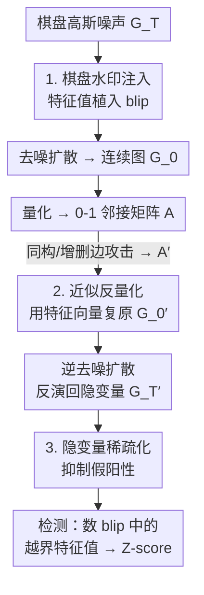

# CheckMate! Watermarking Graph Diffusion Models in Polynomial Time

**会议**: ICLR2026  
**OpenReview**: [https://openreview.net/forum?id=92fliNrbxY](https://openreview.net/forum?id=92fliNrbxY)  
**代码**: https://github.com/r-gheda/checkwate  
**领域**: 图学习 / 图扩散模型 / 合成数据水印  
**关键词**: 图扩散模型、生成式水印、图同构、谱方法、棋盘随机矩阵

> 说明：论文标题是 "CheckMate!"，但正文里把方法本体统一称作 **CheckWate**（CHE C K WA T E），本文沿用 CheckWate 指代方法。

## 一句话总结
CheckWate 是第一个面向**图扩散模型**的采样期水印框架：它把水印藏进噪声隐变量的**特征值**里（特征值对图同构不变），从而绕开图同构（GI）和图编辑距离（GED）这两个 NP-hard 障碍，做到 $O(N^3)$ 多项式时间的水印验证，在四个数据集、四种图攻击下都能稳定检出，而把图像/表格水印硬搬到图上的基线在同构攻击下几乎全军覆没。

## 研究背景与动机
**领域现状**：水印是数据所有者证明数据归属的经典手段，近年来被迁移到生成模型上，用于给合成数据打"产权标签"。在图像、表格等模态上，**采样期语义水印**（TreeRing、Gaussian Shading）已经成熟：在扩散模型的噪声隐变量里嵌入一个固定 pattern，生成时几乎不损质量，验证时把数据反演回隐变量、检查 pattern 是否还在。

**现有痛点**：合成图（分子、知识图谱、网络结构）越来越多被用于科学发现，但几乎没有可用的水印方案。传统做法是**后编辑水印**（post-editing）——直接在真实图上增删边来藏信息，既严重破坏图质量，验证又需要指数时间。把图像那套采样期水印搬过来又走不通，原因藏在图的两个独有性质里。

**核心矛盾**：第一，**图同构**。同一张图可以用 $N!$ 个不同的邻接矩阵表示（节点编号随便换，结构不变，见论文 Fig.1）。pattern-based 水印依赖"隐变量里某个固定位置有特定值"，但节点一置换，pattern 就被打乱；要判断两张图是否同构本身就是复杂度理论里悬而未决的 GI 问题，攻击者再增删几条边，就退化成 NP-hard 的图编辑距离（GED）问题。第二，**离散性**。图常用 0-1 邻接矩阵表示，而扩散模型工作在连续空间，生成时要经过一步**量化**（continuous → binary）。要验证水印就必须把离散图**反量化**回连续隐变量，而把一张被改过的图匹配回它的反量化版本，又绕回了 GI/GED。

**本文目标**：拆成三个子问题——(1) 找一种对节点置换天然不变的载体来藏水印；(2) 在不解 GI/GED 的前提下，把离散图近似反量化回连续隐变量；(3) 在反演误差 + 对抗扰动下控制假阳性。

**切入角度**：作者注意到**特征值是同构不变量**——置换矩阵 $A'=PAP^{-1}$ 不改变特征值谱。如果把水印编码进隐变量的特征值分布，那么无论图被怎样重新编号，水印信号都原封不动，而且求特征值只要 $O(N^3)$。

**核心 idea**：用"棋盘随机矩阵（Checkerboard Ensemble）"在采样期把一组**异常大的特征值（blip）**注入噪声隐变量，检测时只需反演回隐变量、看有没有这些越界特征值——用谱的同构不变性，把 NP-hard 的图水印验证降到多项式时间。

## 方法详解

### 整体框架
CheckWate 建立在 GruM 这类**在连续隐空间做扩散**的图生成模型之上。GruM 的噪声隐变量服从高斯正交系综（GOE，即对称高斯随机矩阵），其特征值全部落在 Wigner 半圆律的"主体（bulk）"内，半径约为 $2$。CheckWate 的全部花招都围绕"在这个谱上做手脚再原样找回来"。

整条流水线是：**采样期注入棋盘水印 → 去噪扩散生成连续图 → 量化成 0-1 邻接矩阵**（这是生成方，产出带水印的合成图，中间可能遭受同构/增删边等攻击）；验证方拿到一张图后走逆向：**近似反量化 → 逆去噪扩散反演回隐变量 → 检测特征值是否越界（blip）**。三件核心武器分别对应注入、反演、抗扰：棋盘水印、近似反量化、隐变量稀疏化。

### 关键设计

**1. 棋盘水印：把水印藏进同构不变的特征值里**

要藏一个对节点置换免疫的水印，作者用了 $(k,W)$-**棋盘系综**（Checkerboard Ensemble）。它把普通高斯噪声矩阵改造成：当行列下标满足 $i\equiv j\equiv u \pmod{k}$ 时，该位置取确定值 $W_u$；其余位置仍是标准高斯 $\mathcal{N}(0,1)$：

$$G^T_{ij}=G^T_{ji}=\begin{cases}\mathcal{N}(0,1) & i\not\equiv j \pmod k\\ W_u & i\equiv j\equiv u \pmod k\end{cases}$$

这种结构的妙处在谱上：棋盘系综有 $k$ 个特征值留在 bulk，剩下 $N-k$ 个被推到**blip**（远离半圆、量级约 $NW_u/k+O(\sqrt N)$）。GOE 本不该有 blip 特征值，所以"blip 里有没有越界特征值"就是一个干净的水印信号。检测时把图反演回隐变量 $G^{T'}$，归一化后看绝对值最大的 $N-k$ 个特征值是否 $\gg 2$（有水印）还是 $\le 2$（无水印）。论文用 Theorem 3.1 给出可检测性：带水印与不带水印的得分期望差约为 $\sqrt N\,W_u/k+O(1)-O(k^2)$，即水印强度正比于 $W_u$、反比于 $k$。$k$ 和 $W$ 是两个旋钮，调出**质量↔可检测性**的权衡：$k$ 越小、$W_u$ 越大，blip 特征值越多越强、水印越好检，但偏离高斯噪声也越多、生成质量越差。关键收益是绕开 GI——因为特征值在置换下不变，检测全程不需要解图同构，复杂度只有求谱的 $O(N^3)$，且无任何近似或泛化损失。

**2. 近似反量化：用特征向量把离散图复原回连续隐变量**

水印藏在连续隐变量里，但模型最终吐出的是量化后的 0-1 邻接矩阵 $A=\text{quantize}(G_0)$；而且攻击者可能交给你的是一个置换版 $A'=PAP^{-1}$。要检测水印，必须把 $A'$ 反量化回它对应的连续图 $G^{0'}=PG_0P^{-1}$，这一步若硬匹配又会撞上 GI/GED。作者绕过它的办法是利用**特征向量在置换下的协变性**：置换图的特征向量也跟着置换（至多差一个特征基的旋转），即 $V_{A'}=PV_AQ\approx PV_A$，其中 $Q=\text{diag}(Q_1,\dots,Q_m)$ 是按各特征值代数重数分块的旋转矩阵。据此 Theorem 3.2 给出近似反量化公式：

$$G^{0'}\approx V_{A'}V_A^{-1}\,G_0\,V_A V_{A'}^{-1}$$

当所有特征值互异时 $Q$ 退化为单位阵、公式**精确成立**；Theorem 3.3 进一步把 Frobenius 范数下的重构误差写成 $Q$ 的显式函数，结论是误差随**特征值重数**增大而增大（重数越高越难复原）。复原出 $G^{0'}$ 后，扩散过程就能按 DDIM/DBIM 这类隐式模型的常规套路反演回噪声隐变量。作者还用基于哈希的数字签名对密钥 $K=V_A^{-1}G_0V_A$ 签名，实现水印作者身份认证（不可伪造、不可抵赖）。这一步是整个框架"非盲（non-blind）"的关键——验证方需要持有原始隐变量信息，但换来的是可证误差界的精确反演。

**3. 隐变量稀疏化：抑制扰动引发的假阳性**

即便扩散过程完美反演，重构出的 $G^{T'}$ 仍会因近似误差（公式 3）和对抗扰动而带噪。麻烦在于特征值编码的是**全局**结构依赖，对扰动极敏感——本该留在 bulk 的特征值可能被噪声顶出 $>2$，造成"无水印图被误判为有水印"的假阳性。作者的对策是一个简单的稀疏化/异常检测：逐元素判断该值在原始噪声里出现的可能性，凡是既不像标准高斯、也不像棋盘确定值 $W$ 的"可疑项"直接置零：

$$G^{T'}_{ij}=\begin{cases}G^{T'}_{ij} & \max\big(\phi(G^{T'}_{ij}),\,\delta(G^{T'}_{ij})\big)>\theta\\ 0 & \text{otherwise}\end{cases}$$

其中 $\phi$ 是以 $0$ 为中心的高斯密度、$\delta$ 是以 $W$ 为中心的 Dirac 密度，$\theta$ 是容忍阈值。置零后 $G^{T'}$ 变成一个**稀疏 GOE**：随机矩阵理论指出，每行非零元 $q<N$ 时大部分特征值更紧地聚在零附近（密度 $\rho(\lambda)\propto 1/(|\lambda|\log^3|\lambda|)$，当 $\lambda\to 0$），虽然 bulk 外仍有指数尾，但 $q$ 足够大时这些越界特征值稀少且贴近 bulk，不会干扰检测。一句话：稀疏化把"扰动引发的特征值爆炸"按回 bulk 里，让真假阳性可分。

## 实验关键数据

**设置**：四个图扩散常用数据集——Planar、Tree、SBM、Proteins；因为图域此前没有语义水印，作者把 Gaussian Shading、TreeRing 两个 SOTA 改造到图上，再自设一个图不变但质量很差的 Bipartite 基线，外加 None（无水印参照）。质量用四个图统计量的 MMD（度 Deg.、聚类系数 Clus.、4 节点轨道 Orb.、拉普拉斯谱 Spec.）和 V.U.N.（有效/唯一/新颖率）衡量；可检测性用 **Z-score** 衡量，$>10$ 记为可检出。

### 主实验（无攻击下的质量与可检测性，节选自 Table 1）

| 数据集 | 方法 | Deg.↓ | Spec.↓ | V.U.N.(%)↑ | Z-score(反量化)↑ | Z-score(不反量化)↑ |
|--------|------|-------|--------|-----------|------------------|--------------------|
| Planar | Gaussian Shading | 0.0008 | 0.0093 | 62.5 | 57.6 ✓ | 5.9 |
| Planar | CheckWate | 0.0008 | 0.0078 | 67.5 | 67.6 ✓ | 0.7 |
| Proteins | None | 0.4315 | 0.2450 | – | – | – |
| Proteins | Gaussian Shading | 0.4358 | 0.2579 | – | 110.3 ✓ | 1.4 |
| Proteins | CheckWate | **0.0473** | **0.0440** | – | **404.7 ✓** | 2.0 |

CheckWate 在 20 个质量指标里 10 次最优、剩下 10 次有 9 次次优，质量与"可证无损"的 Gaussian Shading 相当；在 Proteins 上甚至**全面超过 None**（作者推测棋盘项补偿了隐式模型采样的随机性不足）。注意最后一列 **No Dequantization** 的 Z-score 几乎全军覆没——这直接证明：不做近似反量化，水印即使无攻击也基本检不出，反量化是整个框架的命门。

### 鲁棒性与消融（Table 2 / Table 3 节选）

| 配置 | 关键现象 | 说明 |
|------|---------|------|
| 四类攻击 5–20%（Table 2） | CheckWate 全部可检出，最低 9.7（SBM 20% 删点） | 同构/增删边/删点都扛得住 |
| 同构攻击下 Gaussian Shading / TreeRing | Z-score 一律 = 0 | 它们**不是图不变**的，节点一置换 pattern 全失 |
| Bipartite | Z-score 极高（数百~数千） | 最强可检测但质量崩塌（Proteins V.U.N.→0、MMD 翻数倍） |
| 理想反量化消融（Table 3） | 同构下 Gaussian Shading 掉到 ≈0.3–0.4，CheckWate 保持满分（Planar 46.5、SBM 86.8） | 证明 **特征值不变性** 才是抗同构的真正来源 |

### 关键发现
- **反量化是生死线**：去掉反量化，连无攻击场景水印都丢——这是 CheckWate 相对"直接套图像水印"的核心壁垒。
- **同构鲁棒性来自谱不变性而非反量化技巧**：Table 3 用理想反量化排除反演误差后，基线在同构下仍归零、CheckWate 仍满分，说明把水印放进特征值这一选择本身才是关键。
- **质量↔强度可调**：$k$ 越小、$W_u$ 越大水印越强但质量越差；作者通过 blip 特征值数量 $N-k$ 精确控制这个权衡。
- **重数是软肋**：反量化误差随特征值重数升高，但实测生成图的平均最大重数普遍很大却仍可检出，说明近似公式在实际谱分布下足够好用。

## 亮点与洞察
- **"换载体绕 NP-hard"的思路极漂亮**：别人盯着怎么更快解图同构，作者直接把水印挪到同构不变量（特征值）上，让 GI 问题在检测链路里彻底消失——这是把难题"绕过去"而非"解出来"的典范。
- **棋盘随机矩阵用得巧**：blip/bulk 的谱结构本是随机矩阵理论的纯数学结果，作者把"blip 里有没有越界特征值"直接当作可证可检的水印二元信号，理论（Thm 3.1 的 $\sqrt N W_u/k$）和工程旋钮（$k,W$）完美对应。
- **稀疏化抑假阳性可迁移**：用"既不像高斯也不像确定值 $W$ 就置零"来把扰动特征值按回 bulk，这套基于密度阈值的异常清洗思路，可以迁移到任何"谱域信号 + 全局敏感"的检测任务。
- **最 "啊哈" 的点**：图的同构歧义历来被当成水印的死敌，本文反过来把"对同构鲁棒"做成了相对图像/表格水印的独家卖点。

## 局限与展望
- **非盲水印**：验证需要持有原始隐变量/密钥 $K=V_A^{-1}G_0V_A$，无法像盲水印那样仅凭公开信息检测，限制了部分开放场景。
- **依赖连续隐空间扩散模型**：方法绑定在 GruM 这类"连续隐空间 + 可逆扩散（DDIM/DBIM）"的图生成器上，对纯离散扩散图模型是否适用没有验证。
- **重数敏感**：近似反量化误差随特征值重数升高（Thm 3.3），对高对称、高重数的图（如高度正则结构）可能退化，论文只给了实测平均重数偏大仍可用，缺最坏情形分析。
- **可改进方向**：把签名身份认证与多比特水印（不止"有/无"而是嵌入一段可读 payload）结合；探索对"局部扰动 + 全局重排"组合攻击的理论界。

## 相关工作与启发
- **vs 后编辑图水印（Zhao 2015 / Eppstein 2016 / KGMark）**：它们直接在真实图上增删边藏信息，需指数时间验证且损图质量，还对数据/攻击做强假设；CheckWate 在采样期入手、特征值载体、多项式验证、不损质量。
- **vs Gaussian Shading / TreeRing（图像/表格语义水印）**：这两者把 pattern 放进隐变量固定位置，依赖"位置不可置换"，搬到图上一遇同构就归零（Table 2/3 实测 Z=0）；CheckWate 用同构不变的谱载体根治这一点。
- **vs Bipartite（本文自设图不变基线）**：Bipartite 也图不变、Z-score 极高，但隐变量元素高度相关导致生成质量崩塌——反衬出 CheckWate "既图不变又保质量"的难得平衡。

## 评分
- 新颖性: ⭐⭐⭐⭐⭐ 首个图扩散水印框架，"用特征值同构不变性绕开 GI/GED"的切入角度很原创。
- 实验充分度: ⭐⭐⭐⭐ 四数据集 × 四攻击 × 多基线 + 理想反量化消融，证据链完整；缺离散扩散模型与组合攻击验证。
- 写作质量: ⭐⭐⭐⭐ 三大组件分工清晰、理论（三条定理）与工程旋钮对应明确，随机矩阵背景交代到位。
- 价值: ⭐⭐⭐⭐ 填补合成图水印空白，多项式时间 + 抗同构对图数据产权治理有实际意义。

<!-- RELATED:START -->

## 相关论文

- [\[ICML 2026\] Polynomial Neural Sheaf Diffusion: A Spectral Filtering Approach on Cellular Sheaves](../../ICML2026/graph_learning/polynomial_neural_sheaf_diffusion_a_spectral_filtering_approach_on_cellular_shea.md)
- [\[ICLR 2026\] $\ell_1$ Latent Distance Based Continuous-Time Graph Representation](ell_1_latent_distance_based_continuous-time_graph_representation.md)
- [\[ICLR 2026\] Geometric Graph Neural Diffusion for Stable Molecular Dynamics Simulations](geometric_graph_neural_diffusion_for_stable_molecular_dynamics_simulations.md)
- [\[ICLR 2026\] Global and Local Topology-Aware Graph Generation via Dual Conditioning Diffusion](global_and_local_topology-aware_graph_generation_via_dual_conditioning_diffusion.md)
- [\[ICLR 2026\] Learning Concept Bottleneck Models from Mechanistic Explanations](learning_concept_bottleneck_models_from_mechanistic_explanations.md)

<!-- RELATED:END -->
