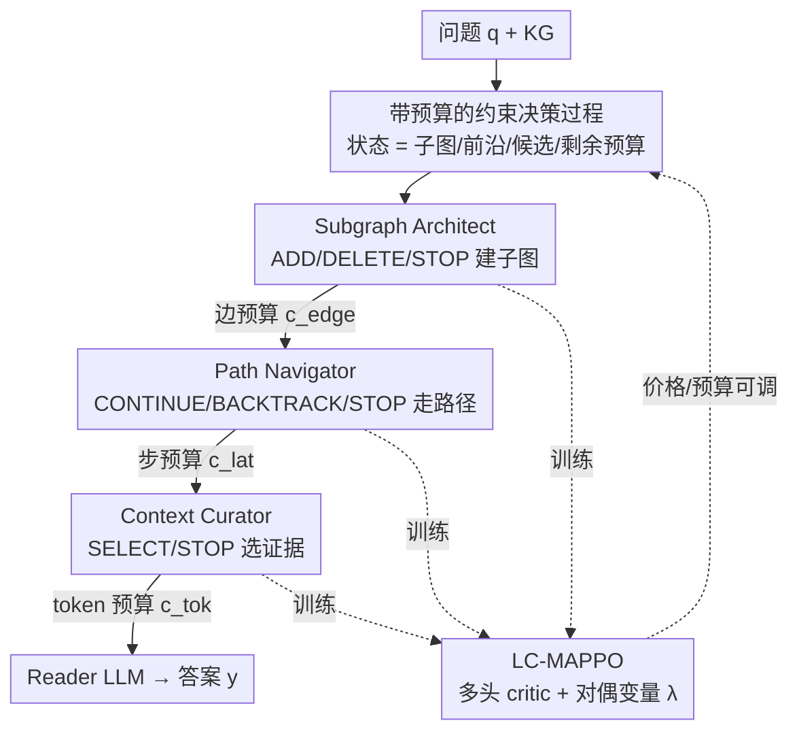

# CLAUSE: Agentic Neuro-Symbolic Knowledge Graph Reasoning via Dynamic Learnable Context Engineering

**会议**: ICLR2026  
**OpenReview**: [https://openreview.net/forum?id=97Qk741ih6](https://openreview.net/forum?id=97Qk741ih6)
**代码**: 待确认  
**领域**: 知识图谱推理 / 神经符号 / 多智能体强化学习  
**关键词**: 知识图谱问答, 多跳推理, 约束强化学习, 上下文工程, 多智能体

## 一句话总结
CLAUSE 把知识图谱多跳问答中"该检索什么上下文"本身当成一个带预算的序列决策问题，用三个协作的神经符号智能体（建子图 / 走路径 / 选证据）在「边数 / 步数 / token」三类资源约束下联合优化，配合提出的 LC-MAPPO 约束式多智能体 PPO 训练，单个 checkpoint 就能按每条 query 的预算或价格调节"精度–时延–成本"权衡，无需重训。

## 研究背景与动机
**领域现状**：用知识图谱（KG）给大模型补充结构化上下文，是多跳 KGQA（知识图谱问答）的主流路线。典型做法是先在 KG 里围绕问题实体建一个局部邻域（k-hop 子图），把里面的三元组串成文本喂给 reader LLM 作答。KG 的好处是实体/关系有类型、可做符号遍历、能留下可审计的证据轨迹（provenance）。

**现有痛点**：上下文"怎么拼"这件事常常和答案质量、运行时约束两头都对不上。固定的 k-hop 扩展会把大量三元组一股脑序列化进 prompt，token 量和时延双双膨胀，还混进干扰项（distractor）把精度往下拽；而"想得更久"的 chain-of-thought 只是把每步推理文本拉长，并不改变模型究竟能看到哪些证据，对端到端时延几乎没有控制力。更要命的是，真实部署受限的不只是 prompt 长度，还有**交互步数**（每多编辑/遍历/筛选一次就多一步时延），但大多数 pipeline 只暴露 hop 深度、度数上限、top-k 这种启发式旋钮。

**核心矛盾**：精度、时延、prompt 成本三者之间存在 trade-off，而现有方法把"建子图、走路径、选证据"三个环节割裂开、各自拍脑袋设阈值，既无法联合优化，也无法在不重训的前提下按部署约束（如"这条 query 最多 0.5 倍边预算、0.7 倍时延"）动态调整。

**本文目标**：把上下文构造本身变成**学习问题**——决定加/删哪些边、走哪条路径、保留哪些片段、何时停止，全都在交互步数和 token 的显式预算（cap）或价格（price）下完成。

**切入角度**：作者观察到"检索什么"远比"推理多久"更能左右端到端时延与精度，于是把 KGQA 重新表述成一个 **requirements-conditioned**（按需求条件化）的约束决策过程，让步数和 token 的消耗直接进训练目标，把停止规则和探索深度从硬编码变成可学习的策略。

**核心 idea**：用一个"预算感知的学习型控制器"替换脆弱的 k-hop 启发式——由三个神经符号智能体在约束马尔可夫决策过程（CMDP）里协同编辑 / 遍历 / 筛选 KG，并用 LC-MAPPO 把"任务奖励 + 三种资源成本"分头优化，使"精度–时延–成本"权衡变得显式且可调。

## 方法详解

### 整体框架
CLAUSE 要解决的是：给定知识图谱 $K=(V,R,E)$ 和自然语言问题 $q$，在每条 query 自带的三类预算 $\beta=(\beta_{\text{edge}},\beta_{\text{lat}},\beta_{\text{tok}})$（边编辑数 / 交互步数 / 选中 token 数）下，输出一个**紧凑、可溯源**的上下文，再交给 reader LLM 给答案。整体被建模成一个回合制（一个问题=一回合）的约束决策过程：在符号状态 $s_t=(q,G_t,F_t,P_t,b_t)$ 上（当前子图、前沿节点、候选池、剩余预算），三个智能体依次执行 **编辑→遍历→筛选** 三段循环，每动一次就更新成本计数器、重算剩余预算，任何一个智能体都可以发 STOP；当三者都停或任一预算耗尽，回合结束。三个智能体由 LC-MAPPO 联合训练，神经模块只负责打分排序，真正落地的动作全是离散的符号 KG 操作（加边/删边/续走/回溯/选中/停），因此轨迹可审计。

### 关键设计

**1. 把上下文构造重写成带三类预算的约束决策过程（CMDP）：让"检索什么"成为可优化目标**

这一步针对的痛点是：k-hop / 度数 / top-k 这些手调旋钮让运行时行为对调参极其敏感，也把精度–效率权衡藏了起来。CLAUSE 的做法是把整个上下文装配过程显式写成约束马尔可夫决策过程。动作分三族：EDIT $\in\{\text{ADD}(e),\text{DELETE}(e),\text{STOP}\}$、TRAVERSE $\in\{\text{CONTINUE}(r,v'),\text{BACKTRACK},\text{STOP}\}$、CURATE $\in\{\text{SELECT}(d),\text{STOP}\}$。三类成本按回合累加：边编辑 $C_{\text{edge}}=\sum_t \mathbf{1}\{a_t\in\{\text{ADD},\text{DELETE}\}\}$，时延（步数代理）$C_{\text{lat}}=\sum_t \mathbf{1}\{a_t\neq\text{STOP}\}$，选中 token $C_{\text{tok}}=\sum_t\sum_{d\in\Delta D_t}\text{tok}(d)$。优化目标是

$$\max_{\pi}\ \mathbb{E}_{\tau\sim\pi}\big[R_{\text{acc}}(\tau)\big]\quad \text{s.t.}\quad \mathbb{E}[C_{\text{edge}}]\le\beta_{\text{edge}},\ \mathbb{E}[C_{\text{lat}}]\le\beta_{\text{lat}},\ \mathbb{E}[C_{\text{tok}}]\le\beta_{\text{tok}},$$

其对应的拉格朗日量为 $L(\pi,\lambda)=\mathbb{E}[R_{\text{acc}}-\lambda^\top C]$，价格 $\lambda=(\lambda_{\text{edge}},\lambda_{\text{lat}},\lambda_{\text{tok}})\ge 0$。这样一来，"该不该再扩一条边、该不该再走一跳、该不该再塞一个 snippet"全都被同一个目标统一裁决，trade-off 从隐式变成显式可调。

**2. 三个神经符号智能体分工协作：把"建子图 / 走路径 / 选证据"拆开但联合优化**

针对"三个环节被割裂、各设各的阈值"这个痛点，CLAUSE 用三个职责清晰、却被 LC-MAPPO 联合训练的智能体接管整条流水线。**Subgraph Architect（编辑）** 先从问题里抽实体提及 $M(q)$，按锚定得分 $s_{\text{ent}}(v\mid q)=\max_{m\in M(q)} s_{\text{anch}}(m,v)$ 取 top-k 作种子建初始前沿；之后只在前沿邻接的候选边 $E^{\text{cand}}_t$ 里挑，给每条候选边算融合得分 $s(e\mid q,G_t)=w^\top h[\phi_{\text{ent}},\phi_{\text{rel}},\phi_{\text{nbr}},\phi_{\text{deg}}]$（实体/关系用冻结编码器的余弦相似，邻域和度数做先验、对 hub 节点限流），并按**价格塑形增益** $g(a,e)=s(e\mid q,G_t)-\lambda_{\text{edge}}\,c_{\text{edge}}(a,e)$ 决定加/删/停——只有增益为正且预算还在才落地，从根上避开无脑 k-hop。**Path Navigator（遍历）** 维护路径前缀 $p_t$，一个轻编码器输出 STOP/CONTINUE 终止头和续走候选 logits，BACKTRACK 是显式动作；每跳都加 $C_{\text{lat}}$，所以只有"塑形后期望价值超过当前步价格"才续走，发现的路径 $\Pi$ 直接当作人类可读的 provenance。**Context Curator（筛选）** 在候选池 $P_t$ 上做带显式 STOP 的列表式选择：$\max_{\pi_S} R_{\text{task}}(S)$ s.t. $\sum_{c\in S}\text{tok}(c)\le\beta_{\text{tok}}$，并用一个"冗余感知 + 受 token 价格 $\lambda_{\text{tok}}$ 条件化"的 STOP 头，产出紧凑互补的证据集。三者的成本在源头归属（编辑→$C_{\text{edge}}$、步→$C_{\text{lat}}$、筛选→$C_{\text{tok}}$），简化了信用分配。

**3. LC-MAPPO：用拉格朗日约束 + 多头 critic + 对偶上升把三种成本分头管住**

这是本文的训练核心，针对的是"普通约束 RL 把异质成本搅成一锅"的问题。LC-MAPPO 是 MAPPO 的拉格朗日约束 CTDE（集中训练、分散执行）变体：一个集中式 critic 估一个任务头 $Q_{\text{task}}$ 加三个成本头 $Q_{\text{edge}},Q_{\text{lat}},Q_{\text{tok}}$，再用单调 mixer 把各智能体的效用聚合。PPO 代理目标用 COMA 式反事实优势，作用在**塑形回报**上：

$$r'_t = r^{\text{acc}}_t - \lambda_{\text{edge}}c^{\text{edge}}_t - \lambda_{\text{lat}}c^{\text{lat}}_t - \lambda_{\text{tok}}c^{\text{tok}}_t,$$

这正是 CMDP 拉格朗日量的逐步实例化。关键在于它**不固定单一惩罚**，而是给三类成本各维护一个对偶变量并做投影上升 $\lambda_k\leftarrow[\lambda_k+\eta(\widehat{\mathbb{E}}[C_k]-\beta_k)]_+$（可选 PID 稳定），本质是对 Eq.1 拉格朗日量做随机对偶上升，把 $\lambda$ 推到恰好让 $\mathbb{E}[C_k]\le\beta_k$。任务头与成本头分离不仅改善信用分配，还赋予 $\lambda$ "影子价格"性质——最优对偶等于最优价值对预算的偏导，可预测精度–时延–成本前沿的局部斜率。

**4. 推理期的预算 / 价格双模旋钮：单 checkpoint 适配不同部署约束、无需重训**

前三个设计训出来的能力，要靠这一步才"可部署"。测试时智能体按学到的 STOP 贪心执行，运营方可以选两种模式：**cap 模式**——直接设 $(\beta_{\text{edge}},\beta_{\text{lat}},\beta_{\text{tok}})$ 拿硬保证；或 **price 模式**——固定价格 $\lambda$ 得到平滑 trade-off。二者都来自同一个 checkpoint，按每条 query 现场调整而不重训。因为所有决策都是符号级的离散动作，还能逐步导出"加了什么边、探了哪条路、选了哪些证据、在哪停的"完整轨迹用于审计与消融——这正是神经符号路线相对纯 LLM agent 的透明性优势。

## 实验关键数据

### 主实验
在 HotpotQA（distractor）、FactKG、MetaQA（1/2/3-hop）三个多跳 KGQA 数据集上，统一 retriever/reader/解码设置，对比预训练 LLM（无检索）、RAG 系（Qwen3-32B 上的 Vanilla/Hybrid/LightRAG/GraphRAG）、Agent 系（ReAct/GoT/AutoGen/KG-Agent）。精度用 top-1 精确匹配 EM@1。

| 数据集 | 指标 | CLAUSE | 最强 baseline | 提升 |
|--------|------|--------|--------------|------|
| HotpotQA (distractor) | EM@1 | 71.7 | 68.7 (KG-Agent) | +3.0 |
| FactKG | EM@1 | 84.2 | 82.1 (KG-Agent) | +2.1 |
| MetaQA 1-hop | EM@1 | 91.0 | 87.3 (KG-Agent) | +3.7 |
| MetaQA 2-hop | EM@1 | 87.3 | 78.0 (KG-Agent) | +9.3 |
| MetaQA 3-hop | EM@1 | 85.5 | 75.4 (KG-Agent) | +10.1 |

效率上（均归一化到 Vanilla RAG = 1.0×）：CLAUSE 的时延在多数设置低于 Hybrid/GraphRAG，远低于 AutoGen（如 HotpotQA 1.48× vs 2.43×），MetaQA 1-hop 甚至降到 0.98×（低于 Vanilla）；**平均边预算全设置最省**（0.74–0.90×），同时拿下最高 EM。论文摘要给出的标志性数字：MetaQA-2-hop 相对最强 RAG（GraphRAG）EM@1 +39.3、时延降 18.6%、边增长降 40.9%。

### 消融实验
在 MetaQA 上做核心消融（归一化到 CLAUSE = 1.0×）：

| 配置 | EM@1↑ | 时延↓ | 边预算↓ | 说明 |
|------|-------|-------|---------|------|
| CLAUSE (full) | 87.3 | 1.00 | 1.00 | 完整模型 |
| w/o Subgraph Architect (StaticRAG) | 74.8 | 1.32 | 1.44 | 去掉建子图，严重过扩展 |
| w/o Path Navigator (Greedy-Hop) | 82.1 | 1.18 | 1.22 | 去掉学习型续走/回溯/停 |
| w/o Context Curator (Top-k Rerank) | 80.6 | 1.24 | 1.07 | 无学习型 STOP，上下文冗长 |
| MAPPO (no duals) | 85.0 | 1.08 | 1.28 | 无对偶，边预算超支 |
| Fixed λ (no updates) | 84.6 | 1.06 | 1.15 | 固定价格，仍有持续违约 |

另在约束设置（边预算 0.5、时延预算 0.7）下对比约束算法：LC-MAPPO 相对 MAPPO 可行率提升 191%（0.340 vs 0.117），时延违约降 34%（0.577 vs 0.880），并学到更活跃的自适应对偶变量（0.004 vs RCPO 的 0.001）。

### 关键发现
- **去掉 Subgraph Architect 掉点最狠**（EM 87.3→74.8，边预算飙到 1.44×），说明预算感知的图编辑是抑制过扩展、保住精度的关键环节；没有它就退化成静态 RAG 的"先扩一大坨再说"。
- **三个智能体缺一不可**：去 Navigator 主要伤"有纪律的探索"（时延/边上升），去 Curator 主要伤"上下文紧凑度"（时延 1.24×），各自对应一类资源。
- **对偶变量的自适应更新很重要**：MAPPO 无对偶虽然 EM 还行（85.0），但边预算超支到 1.28×；固定 λ 也持续违约。只有让 $\lambda$ 随违约程度上升，才能真正把三类资源压在预算内。
- 多跳越深（MetaQA 1→3-hop）边预算和时延温和上升，符合"要探更深路径"的预期，但始终远低于其他 agentic 方法。

## 亮点与洞察
- **把"检索什么"而非"推理多久"当成学习问题**：这是全文最让人"啊哈"的视角转换——多数工作在拉长 CoT 或调 hop 数，CLAUSE 直接把上下文装配本身建模成带预算的决策过程，让时延/token 进训练目标，停止规则可学。
- **三类异质成本各给一个对偶变量**：相比 RCPO 把所有成本糅成一个惩罚，分头管理才能独立控制边增长、交互步数、token，且对偶的"影子价格"性质让 $\lambda$ 直接读出 Pareto 前沿斜率，理论上很优雅。
- **神经符号的可审计性是真卖点**：动作全是离散符号操作，能逐步导出 provenance 轨迹，这对需要溯源的部署场景（合规、可解释）比纯 LLM agent 友好得多。
- **单 checkpoint 双模部署**（cap / price）这个工程设计可迁移：任何"训练时带约束、部署时要按 SLA 现调"的任务（检索预算、推理预算控制）都能借鉴"对偶变量当可调旋钮"的思路。

## 局限与展望
- **依赖结构化 KG 与可靠实体锚定**：方法建立在 typed KG 之上，锚定弱时退回冻结编码器检索，KG 质量差或实体链接出错会直接拖累子图质量；论文未深入讨论 KG 噪声鲁棒性。
- **三智能体 + 多头 critic + 对偶上升的训练复杂度不低**：CTDE、单调 mixer、PID 稳定的对偶更新都引入额外超参与训练开销，收敛性虽在附录给出但实际调参成本值得关注。
- **reader 固定为 Qwen3-32B**：主结果在单一 reader 上得到，换更弱/更强 reader 时这套预算控制是否同样有效未充分验证。
- **横向比较需谨慎**：不同方法在不同 hop 难度下的时延/边预算不可直接比大小；摘要里 +39.3 EM 这类亮眼数字是相对特定 baseline（GraphRAG）在特定设置（MetaQA-2-hop）取得，不宜外推为通用增益。

## 相关工作与启发
- **vs 问题条件化子图构建 / 图引导 RAG（GraftNet、PullNet、GraphRAG）**：它们靠固定 hop/度数/top-k 规则装配局部邻域，运行时行为对手调敏感、精度–效率权衡不透明；CLAUSE 用学习型预算感知控制器替换这些启发式，子图增长全设置最省还拿最高 EM。
- **vs 路径/规则学习（MINERVA、NeuralLP、RNNLogic）**：它们在 KG 上遍历推导答案、优化任务奖励，但**没有显式的时延/token 控制**；CLAUSE 把交互步数和选中 token 直接写进约束目标。
- **vs Agentic LLM（ReAct、Graph-of-Thoughts、AutoGen、KG-Agent）**：它们交替规划/调工具，灵活但多步审议抬高交互成本、且每回合资源控制是隐式的；CLAUSE 在拿到 agent 级精度的同时把时延压到远低于 AutoGen，靠的是显式每回合预算 + 学习型 STOP。
- **vs 约束 RL（RCPO、固定惩罚 PPO、MAPPO/COMA）**：单惩罚的 RCPO 把异质成本搅成一锅难以独立调控；QMIX 类值分解受单调混合约束、COMA/MAPPO 原版缺乏强制每回合资源约束的机制；LC-MAPPO 用多头 critic 分离任务/成本价值 + 每预算对偶变量，单 checkpoint 同时支持预算 cap 与价格 trade-off。

## 评分
- 新颖性: ⭐⭐⭐⭐⭐ 把上下文工程重写成带三类预算的约束 MARL，视角和 LC-MAPPO 都新颖。
- 实验充分度: ⭐⭐⭐⭐ 三数据集 + 多家族 baseline + 完整消融 + 约束算法对比，但 reader 单一、KG 鲁棒性未测。
- 写作质量: ⭐⭐⭐⭐⭐ 形式化清晰、动机到方法逻辑顺畅，框架图与符号表完整。
- 价值: ⭐⭐⭐⭐ 对"有 SLA 约束的 KGQA/RAG 部署"有直接落地价值，可审计 + 可调旋钮是实打实的工程优势。

<!-- RELATED:START -->

## 相关论文

- [\[NeurIPS 2025\] Reasoning Meets Representation: Envisioning Neuro-Symbolic Wireless Foundation Models](../../NeurIPS2025/graph_learning/reasoning_meets_representation_envisioning_neuro-symbolic_wireless_foundation_mo.md)
- [\[NeurIPS 2025\] Agint: Agentic Graph Compilation for Software Engineering Agents](../../NeurIPS2025/graph_learning/agint_agentic_graph_compilation_for_software_engineering_age.md)
- [\[ICLR 2026\] DAMR: Efficient and Adaptive Context-Aware Knowledge Graph Question Answering with LLM-Guided MCTS](damr_efficient_and_adaptive_context-aware_knowledge_graph_question_answering_wit.md)
- [\[ICLR 2026\] Knowledge Reasoning Language Model: Unifying Knowledge and Language for Inductive Knowledge Graph Reasoning](knowledge_reasoning_language_model_unifying_knowledge_and_language_for_inductive.md)
- [\[ICLR 2026\] Controllable Logical Hypothesis Generation for Abductive Reasoning in Knowledge Graphs](controllable_logical_hypothesis_generation_for_abductive_reasoning_in_knowledge_.md)

<!-- RELATED:END -->
