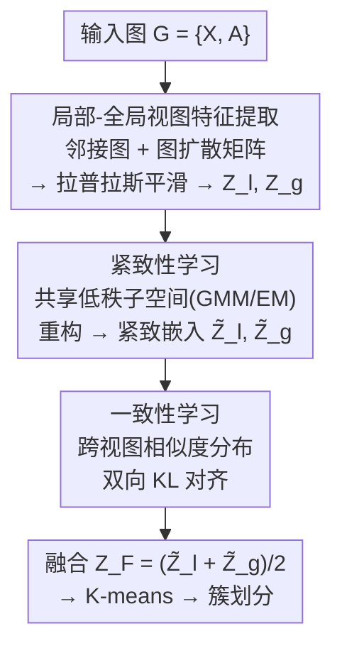

# Compactness and Consistency: A Conjoint Framework for Deep Graph Clustering

**会议**: ICLR2026  
**OpenReview**: [https://openreview.net/forum?id=9jdQLmPUHW](https://openreview.net/forum?id=9jdQLmPUHW)  
**代码**: https://github.com/juweipku/CoCo  
**领域**: 图学习 / 深度图聚类 / 自监督表示学习  
**关键词**: 深度图聚类, 低秩子空间, 图扩散, 局部-全局视图, 一致性学习

## 一句话总结
CoCo 用图卷积滤波从局部（邻接图）和全局（图扩散矩阵）两个视图提取互补的节点表示，再用一个共享的低秩子空间把两视图压成紧致嵌入以去冗余去噪（紧致性），最后用跨视图的相似度分布一致性损失打通两边语义（一致性），在五个图聚类基准上全面超过现有 SOTA。

## 研究背景与动机
**领域现状**：深度图聚类的主流做法是把图神经网络（GNN）当编码器，利用节点属性 + 图拓扑学到节点表示 $Z$，再在 $Z$ 上跑 K-means / 谱聚类等算法得到簇划分。代表工作如 SDCN 用 delivery operator 把自编码器和 GCN 桥接、MAGI 用模块度最大化作对比预训练任务、DMGC-GTN 用图平滑 + transformer 融合结构与特征。这类方法本质上靠自监督损失驱动训练。

**现有痛点**：作者点出两个根子上的毛病。第一，GNN 的局部消息传递只能传几跳，**捕捉不到节点间的全局/长程关系**——想传得远就堆深层，结果触发过平滑（over-smoothing），不同簇的节点表示变得难以区分。MAGI、DMGC-GTN 这类方法只在原图上做局部增强或随机游走，依然抓不住长程依赖，导致簇无法准确刻画真实社区结构。第二，图数据里**天然的冗余和噪声**会被现有方法忽略，污染训练过程、模糊掉重要的节点关系模式，最终学出判别力差的嵌入。

**核心矛盾**：一边是「想要全局信息但局部消息传递够不着、强行加深又过平滑」，另一边是「原始高维嵌入里混着冗余噪声、没人去清洗」。这两个问题分别对应表示的「覆盖范围」和「纯净度」，现有工作往往只顾一头。

**本文目标**：让学到的节点表示同时具备两个性质——**紧致性（compactness）**：去掉冗余噪声、抓住数据内在的低维结构；**一致性（consistency）**：局部和全局两视图的语义能互相传递、彼此增强。

**切入角度**：高维数据点往往内在地落在一个低维子空间上（low-rank assumption），所以可以让两视图共用同一套低维子空间来抽象、重构嵌入，既压掉冗余，又顺手缩小两视图的语义鸿沟。再配上图扩散把全局长程关系显式引入，就把两个痛点一起解决了。

**核心 idea**：用「图扩散补全局视图 + 共享低秩子空间做紧致重构 + 跨视图相似度一致性」三件套，把全局性、紧致性、一致性灌进一个联合框架 CoCo。

## 方法详解

### 整体框架
CoCo 要解决的是无标签图聚类，整条流程可以概括为：从同一张图派生出**局部视图**（原邻接图 $\{X, A\}$）和**全局视图**（图扩散矩阵 $\{X, \hat S\}$）→ 各自经拉普拉斯平滑滤波 + 独立 MLP 得到两视图嵌入 $Z_l, Z_g$ → 把两视图嵌入摞在一起，用一个 GMM 学出的**共享低秩子空间**重构成紧致嵌入 $\tilde Z_l, \tilde Z_g$（紧致性学习）→ 用跨视图相似度分布的 KL 一致性损失对齐两边语义（一致性学习）→ 融合两视图表示后跑 K-means 出簇。

这是一个清晰的「双路提取 → 共享压缩 → 跨视图对齐」pipeline，下图给出自上而下的数据流：

### 关键设计

**1. 局部-全局双视图特征提取：用图扩散显式补上长程依赖**

针对「局部消息传递够不着全局、加深又过平滑」这个痛点，CoCo 不去堆深 GNN，而是**额外造一个全局视图**。它用个性化 PageRank 定义图扩散矩阵 $S = \alpha\big(I_N - (1-\alpha)\tilde A\big)^{-1}$，其中 $\alpha$ 是 teleport 概率；$S$ 的元素衡量任意两节点对之间的影响力/相关性，刻画的是节点间的「软关系」，因而能全局地利用长程邻居信息。为降复杂度，论文用快速近似把运行时间压到线性，并对 $S$ 稀疏化（小于阈值置零）得 $S'$，再对称化为 $\hat S \triangleq (S' + S'^\top)/2$。于是 $\{X, A\}$ 当局部视图、$\{X, \hat S\}$ 当全局视图。

提取表示时，作者借鉴 SGC 的解耦思想——GNN 里图卷积滤波器和权重矩阵纠缠在一起会同时损害性能和鲁棒性，因此把二者拆开：先用广义拉普拉斯平滑滤波器去噪高频成分、融合属性与结构，$\tilde X_l = (I_N - \tilde L_l/k_l)^t X$、$\tilde X_g = (I_N - \tilde L_g/k_g)^t X$（$t$ 为滤波层数）。论文还给出 Theorem 1：取 $k_l = \tilde\lambda_l^{\max}$、$k_g = \tilde\lambda_g^{\max}$（两个拉普拉斯矩阵的最大特征值）是追求低通滤波的最优选择。最后把滤波后的特征喂进两个**不共享**的 MLP 得到可训练嵌入 $Z_l = \text{MLP}_1(\tilde X_l)$、$Z_g = \text{MLP}_2(\tilde X_g)$。

**2. 紧致性学习：一个共享低秩子空间，同时去冗余、对齐两视图语义**

这一步针对「原始嵌入里混着冗余噪声」的痛点，核心思路是让两视图**共用同一套低维子空间**来抽象和重构，既剥掉冗余，又顺带缩小两视图的语义鸿沟。把两视图嵌入摞成 $Z = (Z_l^\top, Z_g^\top)^\top \in \mathbb{R}^{\bar N \times D}$（$\bar N = 2N$），用一个**高斯混合模型（GMM）**去学最优低维子空间 $\Lambda \in \mathbb{R}^{\bar N \times K}$（$K \ll D$）。引入潜变量 $y_{jk}$ 标记 $z_{\cdot,j}$ 是否关联到子空间第 $k$ 列，目标是最大化 $\log p(Z|\lambda)$，并用 **EM 算法**迭代求解：E 步算潜变量后验

$$\gamma(y_{jk}) = \frac{\mathcal{N}(z_{\cdot,j}\,|\,\lambda_{\cdot,k}^{old}, \sigma I_{\bar N})}{\sum_{k'=1}^K \mathcal{N}(z_{\cdot,j}\,|\,\lambda_{\cdot,k'}^{old}, \sigma I_{\bar N})}$$

M 步更新子空间 $\lambda_{ik}^{new} = \frac{1}{\sum_j \gamma(y_{jk})}\sum_{j=1}^D \gamma(y_{jk}) z_{ij}$。为简化模型，作者固定混合权重相等、协方差各向同性：等权重能缓解簇坍缩、促进对嵌入空间的均匀覆盖；固定协方差则让模型拟合能力聚焦在「均值定义的子空间」上——因为在负 ELBO 界下，M 步最大化对数似然等价于最小化加权平方距离 $\sum_{j,k}\gamma(y_{jk})\|z_{\cdot,j} - \lambda_{\cdot,k}\|^2$。Remark 1 保证每轮迭代 $\log p(Z|\lambda^{new}) \ge \log p(Z|\lambda^{old})$，实验中 10 轮内即收敛、额外开销可忽略。

拿到最优后验 $\hat\gamma(y_{jk})$ 和最优子空间 $\hat\Lambda$ 后，做**特征重构** $\hat z_{ij} = \sum_{k=1}^K \hat\lambda_{ik}\hat\gamma(y_{jk})$。由于 $\text{rank}(\hat Z) \le K$，重构天然低秩——原始嵌入里那些表达不进受限子空间的噪声/不稳定波动，在重构回原维度时自然消失。论文还用 Theorem 2 论证这个重构有两个守恒性质：**个体质量守恒**（每个个体 $\sum_j z_{ij} = \sum_j \hat z_{ij}$，保证不系统性偏置任何个体，利于公平和可解释）和**最大变差保留**（$\hat Z$ 是所有低秩分解里最大限度保留总变差的解，强对齐主导模式）。最后用残差连接把重构表示注回梯度流：$\tilde Z = \hat Z + Z$——一方面让梯度能流过保持可训练，另一方面把低秩成分捕到的全局趋势和原始 $Z$ 里的局部细节结合，缓解纯低秩约束带来的过平滑、防止模型坍缩。

**3. 一致性学习：用跨视图相似度分布的双向 KL 打通局部-全局语义**

紧致性学到了去噪的两视图表示，但两边还是各看各的；一致性学习负责让它们互相「交底」。做法是在嵌入空间里比较每个节点对一组**锚点样本**的相似度分布：随机选一组锚点 $\{a_1, \dots, a_M\}$，对第 $i$ 个节点分别在局部、全局视图算它和各锚点的余弦相似度，再 softmax（温度 $\tau$）成相似度分布

$$p_m^i = \frac{\exp(\cos(\tilde z_i^l, \tilde z_{a_m}^l)/\tau)}{\sum_{m'} \exp(\cos(\tilde z_i^l, \tilde z_{a_{m'}}^l)/\tau)}, \quad q_m^i = \frac{\exp(\cos(\tilde z_i^g, \tilde z_{a_m}^g)/\tau)}{\sum_{m'} \exp(\cos(\tilde z_i^g, \tilde z_{a_{m'}}^g)/\tau)}$$

要让相似度度量全面就得有大量锚点，但一次性处理太多样本开销高，于是作者维护一个大小为 $M$ 的**记忆库队列**，随机节点动态入队出队，既保证锚点多样性又控制复杂度。然后用**双向 KL 散度**逼两视图的相似度分布一致：

$$\mathcal{L} = \frac{1}{2N}\sum_{i=1}^N \big(\text{KL}(p^i\|q^i) + \text{KL}(q^i\|p^i)\big)$$

最小化 $\mathcal{L}$ 就把局部、全局两边的语义知识互相迁移、彼此增强。值得注意的是，这里用相似度分布的一致性而非传统对比学习——后文消融显示它比 InfoNCE 更适合聚类。训练收敛后融合两视图 $Z_F = (\tilde Z_l + \tilde Z_g)/2$，在 $Z_F$ 上跑 K-means 得到最终簇划分。

### 损失函数 / 训练策略
训练只用一个一致性学习损失 $\mathcal{L}$（双向 KL）驱动自监督学习；紧致性学习里的低秩子空间求解通过 GMM + EM 迭代完成（在梯度流之外，靠残差连接注回）。关键超参包括图扩散 teleport 概率 $\alpha$、滤波层数 $t$、子空间维度 $K$、softmax 温度 $\tau$、记忆库大小 $M$、GMM 协方差尺度 $\sigma$。推理阶段对融合表示跑标准 K-means。

## 实验关键数据

### 主实验
在 Cora、AMAP、BAT、EAT、UAT 五个深度图聚类基准上，用 ACC / NMI / ARI / F1 四个指标，对比自编码器类（SDCN、DFCN…）与对比学习类（GDCL、ProGCL、CCGC、GraphLearner、MAGI…）方法。CoCo 在五个数据集上几乎全面最优，且在多个数据集上大幅超过次优。

| 数据集 | 指标 | CoCo (Ours) | 次优 (runner-up) | 提升 |
|--------|------|------|----------|------|
| Cora | ACC | 79.36 | 76.21 (MAGI) | +4.13% |
| Cora | F1 | 77.95 | 74.07 (MAGI) | +5.23% |
| BAT | ACC | 78.85 | 75.50 (GraphLearner) | +4.16% |
| BAT | NMI | 55.00 | 50.58 (GraphLearner) | +8.74% |
| BAT | ARI | 53.52 | 47.45 (GraphLearner) | +12.79% |
| UAT | ACC | 59.68 | 56.34 (CCGC) | — |
| AMAP | ACC | 79.27 | 77.25 (CCGC) | — |

> 论文观察：对比学习类方法整体优于自编码器类，因其能更有效挖掘图结构数据的内在语义；CoCo 进一步用跨视图一致性学习超过了传统对比学习。

### 消融实验
模型变体定义：M1/M2 = 仅用局部/全局拉普拉斯滤波特征；M3/M4 = 在 M1/M2 基础上加紧致性学习的低秩嵌入；M5 = 完整模型去掉紧致性学习。

| 配置 | 说明 | 结论 |
|------|------|------|
| M3 vs M1、M4 vs M2 | 加低秩映射 | 两种情况性能均提升，说明低秩表示有助于学到更好的簇分配 |
| M5 vs CoCo | 去掉低秩映射 | 性能下降，凸显紧致性学习的必要性 |
| M5/CoCo vs M1–M4 | 加 vs 不加一致性学习 | 两组间差距显著，说明一致性学习有效整合双视图语义 |

一致性损失替换对比（Cora）：

| 损失 | ACC | NMI | ARI | F1 |
|------|-----|-----|-----|-----|
| MSE | 77.84 | 60.31 | 57.81 | 73.89 |
| InfoNCE | 75.57 | 58.03 | 54.69 | 72.58 |
| Consistency (本文) | 79.36 | 60.71 | 58.76 | 77.95 |

### 关键发现
- **紧致性和一致性都不可或缺**：去掉低秩压缩（M5）或只用单视图（M1–M4）都明显掉点，两者合起来才有最大增益。
- **双向 KL 一致性 > InfoNCE / MSE**：在 Cora 上 Consistency 损失的 ACC 比 InfoNCE 高约 3.8 个点、F1 高约 5.4 个点，印证「跨视图相似度分布一致性比传统对比学习更适合聚类」这一核心论断。
- **子空间求解高效**：GMM/EM 子空间搜索在不同数据集上 10 轮内收敛，额外计算开销可忽略。

## 亮点与洞察
- **图扩散 + 共享低秩子空间的组合很巧**：图扩散负责把「全局长程关系」显式引入（绕开堆深 GNN 的过平滑），低秩子空间负责把两视图同时去冗余 + 对齐语义——一个模块顺手解决了两件事（去噪 + 缩小语义鸿沟）。
- **EM 求子空间放在梯度流外、再用残差注回**，是个干净的工程取舍：既享受 GMM 闭式更新的稳定与收敛保证，又不丢可训练性，还能用残差融合「低秩全局趋势 + 原始局部细节」防坍缩。
- **用相似度分布的一致性代替对比学习**：不需要构造正负样本对，靠锚点记忆库 + 双向 KL 就能做跨视图知识迁移，思路可迁移到其他双视图/多视图自监督场景（如多模态聚类）。
- Theorem 2 的「个体质量守恒 + 最大变差保留」给低秩重构提供了可解释性和公平性的理论背书，这在多数纯经验的图聚类工作里少见。

## 局限与展望
- **基准规模偏小**：Cora、BAT、EAT、UAT 等都是中小规模图，图扩散矩阵 $S$ 的求逆/稠密化在大规模图上的可扩展性需进一步验证（虽有线性近似，但稀疏化阈值、记忆库大小等在超大图上的鲁棒性未充分展示）。
- **超参较多**：$\alpha, t, K, \tau, M, \sigma$ 等都需调，跨数据集的敏感性和默认配置的普适性值得更系统的分析。
- **GMM 简化假设**：固定等权重 + 各向同性协方差虽利于稳定，但对簇形状各异、密度差异大的图可能限制表达力；放松这些假设（如可学权重/协方差）是否带来增益值得探究。
- **K-means 后处理**：最终仍依赖 K-means，对初始化和簇数 $C$ 敏感，端到端的可微聚类层或许能进一步提升。

## 相关工作与启发
- **vs MAGI / DMGC-GTN（全局信息）**：它们靠局部增强或随机游走获取邻域信息，抓不住长程依赖；CoCo 用个性化 PageRank 图扩散显式建模全局软关系，从机制上补齐长程视图，主实验在 Cora/BAT 上大幅领先。
- **vs SDCN / DFCN（自编码器类）**：自编码器路线靠重构驱动，语义挖掘弱于对比/一致性路线；CoCo 属对比学习大类但用一致性损失替代 InfoNCE，消融显示更适合聚类。
- **vs 传统对比学习（GDCL / ProGCL / CCGC）**：它们需要精心设计正负样本对；CoCo 用锚点记忆库 + 跨视图相似度分布的双向 KL，避开负样本构造，且把「紧致性（低秩去噪）」和「一致性（跨视图对齐）」拆成两个正交模块协同发力。
- **vs SGC（解耦架构）**：借鉴 SGC 把图卷积滤波器和权重矩阵解耦的思想来提升鲁棒性，但在其上叠加了双视图、低秩子空间和一致性学习三层创新。

## 评分
- 新颖性: ⭐⭐⭐⭐ 图扩散全局视图 + 共享低秩子空间 + 跨视图一致性的组合较新颖，模块各有理论支撑
- 实验充分度: ⭐⭐⭐⭐ 五数据集四指标全面对比 + 多种变体消融 + 损失对比，但基准规模偏小、缺大图验证
- 写作质量: ⭐⭐⭐⭐ 结构清晰、动机到方法链条完整，含定理与证明（附录），公式记号规范
- 价值: ⭐⭐⭐⭐ 把「紧致性」和「一致性」拆解为两个可复用模块，对自监督图/多视图聚类有借鉴意义

<!-- RELATED:START -->

## 相关论文

- [\[ICLR 2026\] Dual-Branch Representations with Dynamic Gated Fusion and Triple-Granularity Alignment for Deep Multi-View Clustering](dual-branch_representations_with_dynamic_gated_fusion_and_triple-granularity_ali.md)
- [\[ICLR 2026\] Confident Block Diagonal Structure-Aware Invariable Graph Completion for Incomplete Multi-view Clustering](confident_block_diagonal_structure-aware_invariable_graph_completion_for_incompl.md)
- [\[ICLR 2026\] Federated Graph-Level Clustering Network with Dual Knowledge Separation](federated_graph-level_clustering_network_with_dual_knowledge_separation.md)
- [\[ICML 2026\] Deep Neural Sheaf Diffusion](../../ICML2026/graph_learning/deep_neural_sheaf_diffusion.md)
- [\[ICLR 2026\] DHG-Bench: A Comprehensive Benchmark for Deep Hypergraph Learning](dhg-bench_a_comprehensive_benchmark_for_deep_hypergraph_learning.md)

<!-- RELATED:END -->
