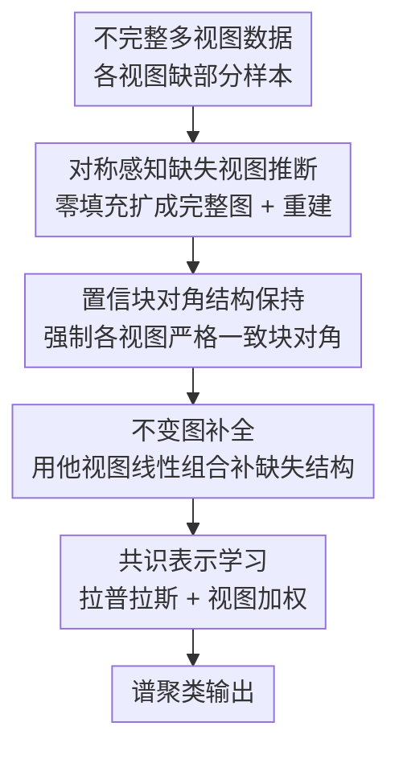

# Confident Block Diagonal Structure-Aware Invariable Graph Completion for Incomplete Multi-view Clustering

**会议**: ICLR2026  
**OpenReview**: [https://openreview.net/forum?id=YS8zgtES48](https://openreview.net/forum?id=YS8zgtES48)  
**代码**: 待确认  
**领域**: 图学习 / 多视图聚类 / 不完整多视图  
**关键词**: 不完整多视图聚类, 块对角结构, 图补全, 自表示, 张量低秩

## 一句话总结
针对部分视图缺失的不完整多视图聚类（IMVC），本文用一个"置信块对角正则"约束所有视图恢复出**严格一致的局部块对角结构**，再用跨视图的"不变图补全"项把缺失实例的真实结构推断回来，最后联合学一个共识谱聚类表示，在 BBCSport、COIL-20、Caltech-7、BUAA 等基准上全面超过现有 IMVC 方法。

## 研究背景与动机

**领域现状**：多视图聚类（MVC）的主流做法是为每个视图构相似度图，再把视图特定的图通过线性融合或张量操作合成一个统一图，最后在统一图上做谱聚类。当部分视图缺失时（不完整多视图聚类，IMVC），通常需要先补全或对齐，再聚类。

**现有痛点**：作者指出现有 IMVC 方法有两个具体毛病。其一，它们把精力放在**直接恢复缺失数据**上，但缺乏真实标签信息，补出来的值很可能不准，而后续聚类却把这些不可靠的值当真值用。其二，恢复的特征往往是**从完整实例那一侧学到的规律**直接套用到缺失实例上，忽略了完整实例和缺失实例之间的**分布差异**——换句话说，"照着完整样本长什么样去补缺失样本"这个假设本身就不成立。再加上传统图方法对相似度度量的选择很敏感，数据稀疏或缺失时容易崩。

**核心矛盾**：补全的目标应该是"恢复出缺失实例的**真实结构分布**"，但现有方法既没有一个可信赖的结构先验来约束补全结果，又没有显式建模"完整 vs 缺失"的分布鸿沟，于是补出来的图既不可信也不一致。

**本文目标**：拆成三个子问题——(1) 给所有视图的恢复结果一个**统一且严格的局部结构约束**，让补全有据可依；(2) 利用视图间的互补信息把缺失实例的**内在完整结构**推断回来；(3) 把上面两步和最终的共识谱聚类**联合优化**，让三者互相促进。

**切入角度**：作者的观察是——理想聚类对应的相似图应该是**块对角的**（同簇内实例互相连接、跨簇不连），而且这个块对角结构应该在所有视图间保持**不变（invariable）**。如果能强制每个视图恢复出同一个严格块对角结构，补全就有了一个跨视图一致的、可信赖的"锚"。

**核心 idea**：用一个**置信块对角正则**（confident block diagonal regularizer）强制所有视图共享严格一致的块对角局部结构，再配一个**不变图补全项**用其他视图的图线性组合去填补当前视图缺失实例的结构，三模块联合训练，取代"先各自补数据再融合"的旧范式。

## 方法详解

### 整体框架
输入是 $V$ 个视图的不完整数据 $\{X^{(v)} \in \mathbb{R}^{d^{(v)} \times n^{(v)}}\}_{v=1}^{V}$（每个视图只观测到部分样本），输出是一个跨所有视图的共识低维表示 $U \in \mathbb{R}^{n \times c}$，直接拿去做谱聚类。中间的转换分三步：先用投影把每个视图的不完整相似图 $S^{(v)}$ 扩成带零填充的完整图 $\tilde{S}^{(v)}$，并据此推断缺失视图（symmetric-aware missing-view inferring）；再用置信块对角正则 + 跨视图不变图补全，把每个视图恢复成结构一致、内在完整的亲和矩阵 $F^{(v)}$；最后从所有 $F^{(v)}$ 的拉普拉斯里学共识表示 $U$。三步写进同一个目标函数，用 ADMM 交替求解。

### 关键设计

**1. 对称感知的缺失视图推断：先把缺失图补成可对齐的完整图**

第一个痛点是缺失视图根本没法直接进入图融合。作者先对每个视图用高斯核 $s^{(v)}_{i,j}=e^{-\|x^{(v)}_i-x^{(v)}_j\|_2^2}$ 构对称相似图 $S^{(v)}$，再用一个 0/1 投影矩阵 $G^{(v)}$ 把不完整结构映射到完整尺寸：$\tilde{S}^{(v)}=G^{(v)}S^{(v)}G^{(v)T}$，缺失位置补零。然后用一个重建矩阵 $M^{(v)}$ 去拟合完整样本 $J^{(v)}$：

$$\min_{J^{(v)},M^{(v)}}\sum_{v=1}^{V}\|J^{(v)}-M^{(v)}\tilde{S}^{(v)}\|_F^2 \quad \text{s.t.}\ P_{ov}(M^{(v)}\tilde{S}^{(v)})=P_{ov}(\tilde{X})$$

这里 $P_{ov}$ 是 one-hot 编码的存在指示（某行为 1 表示该实例在视图 $v$ 中存在，0 表示缺失）。约束 $P_{ov}(\cdot)=P_{ov}(\tilde{X})$ 的作用很关键：它**只在已观测位置强制重建结果与真实数据一致**，让已知实例的几何结构原样保留，缺失位置才交给后面的结构约束去填——这样避免了"用补出来的假值污染真值"。

**2. 置信块对角正则：给所有视图一个严格一致、可信赖的块对角锚**

这是本文最核心的设计，针对"补全没有可信结构先验、视图间结构不一致"的痛点。作者要求恢复出的亲和矩阵 $F^{(v)}$ 满足块对角形态，并提出置信块对角正则：

$$\|F^{(v)}\|_k=\|F\|_{\circledast}+\lambda\|F\|_1$$

其中 $\|F\|_1$ 是 $\ell_0$ 的凸松弛（$\ell_0$ 本身是 NP-Hard），通过自表示 + $\ell_1$ 稀疏让 $F^{(v)}$ 选择性地只吸收其他视图里**最可靠**的连接信息来完成结构补全；$\|F\|_{\circledast}$ 是张量低秩（核范数）约束，把所有视图的 $F^{(v)}$ 堆成张量后压低秩，从而捕获**视图间的高阶相关性**。两项合起来的效果是：稀疏项保证块对角"干净"（跨簇尽量不连），低秩项保证各视图的块对角"对齐"（同一套块结构跨视图不变）。带这个正则的推断目标为

$$\min_{J^{(v)},M^{(v)},F^{(v)}}\sum_{v=1}^{V}\|J^{(v)}-M^{(v)}F^{(v)}\|_F^2+\|F\|_k \quad \text{s.t.}\ P_{ov}(M^{(v)}F^{(v)})=P_{ov}(\tilde{X})$$

"confident"（置信）就体现在这里——块对角是一个强且可靠的结构先验，强制所有视图共享它，等于给缺乏标签的补全过程注入了一个可信赖的监督信号。

**3. 不变图补全：用其他视图的图线性组合，填回缺失实例的真实结构**

光有块对角正则还不够，它**没有显式利用缺失实例在其他视图里残存的信息**。于是作者加一个跨视图补全项：当前视图的结构 $F^{(v)}$ 应该逼近其他视图扩展图 $\tilde{S}^{(i)}$ 的一个凸线性组合 $\sum_{i\neq v}\tilde{S}^{(i)}B_{i,v}$，且只在"两端样本都真实存在"的位置上算误差：

$$\min_{\phi}\sum_{v=1}^{V}\|J^{(v)}-M^{(v)}F^{(v)}\|_F^2+\lambda\|F\|_k+\sum_{v=1}^{V}\lambda_1\|(F^{(v)}-\textstyle\sum_{i\neq v}\tilde{S}^{(i)}B_{i,v})\odot E^{(v)}\|_F^2$$

约束 $0\le B_{i,v}\le 1,\ \sum_{i\neq v}B_{i,v}=1,\ B_{v,v}=0$ 让 $B$ 成为一个单纯形（simplex）权重——每个视图的缺失结构由其余视图的图按凸权重补出来。$E^{(v)}=Q_{v,:}^{T}Q_{v,:}$ 是缺失指示构成的掩码（$Q_{i,j}=1$ 表示第 $j$ 个实例在第 $i$ 视图存在），逐元素乘 $\odot$ 保证只在可观测实例对上保结构、缺失对才靠补全。"不变（invariable）"指补出来的结构要和块对角锚保持一致，于是缺失实例的内在结构被互补信息恢复，而不是凭空猜。

**4. 共识表示学习与联合目标：把补全直接接到谱聚类上**

最后引入一个共识学习模块，从所有视图补全后的结构 $Y^{(v)}=\sum_{i\neq v}\tilde{S}^{(i)}B_{i,v}$ 的拉普拉斯里学一个统一低维表示 $U$，并给每个视图一个自适应权重 $\alpha^{(v)}$（值越大表示该视图越重要）。完整目标把四件事拧成一股绳：

$$\min_{\Phi}\sum_{v=1}^{V}(\alpha^{(v)})^r\Big(\|J^{(v)}-M^{(v)}F^{(v)}\|_F^2+\lambda\|F\|_k+\lambda_1\|(F^{(v)}-Y^{(v)})\odot E^{(v)}\|_F^2\Big)+\sum_{v=1}^{V}(\alpha^{(v)})^r\lambda_2\,\mathrm{Tr}(U^TL_{Y^{(v)}}U)$$

约束含 $U^TU=I$、$F^{(v)}$ 对称非负且对角为零、$B$ 的单纯形约束等。其中 $L_{Y^{(v)}}$ 是补全结构 $Y^{(v)}$ 的拉普拉斯。把谱聚类项 $\mathrm{Tr}(U^TL_{Y^{(v)}}U)$ 直接放进联合目标，意味着补全质量和聚类目标互相反馈——补得好聚类才好，聚类需求又反过来引导补什么，避免了"补全和聚类两阶段割裂"的老问题。

### 损失函数 / 训练策略
整个目标用 **ADMM（交替方向乘子法）** 求解，引入辅助变量 $Z^{(v)}$（处理张量低秩 $\|Z\|_{\circledast}$，对应一个 t-SVD 张量核范数闭式解）、$R^{(v)}$、$P^{(v)}$（处理 $\ell_1$，用收缩算子 $\Omega$ 求解）等，交替更新 $Y^{(v)},B,U,Z^{(v)},J^{(v)},M^{(v)},F^{(v)},P^{(v)}$ 及拉格朗日乘子 $C^{(v)}_{1\sim4}$，$\mu$ 按 $\mu=\min(\rho\mu,\mu_{\max})$ 递增。更新 $U$ 是一次特征分解（取 $\sum_v L_{Y^{(v)}}$ 最小 $c$ 个特征向量），$B$ 用加速投影梯度法解单纯形问题。视图权重 $\alpha^{(v)}=(\omega^{(v)})^{1/(1-r)}/\sum_v(\omega^{(v)})^{1/(1-r)}$，$\omega^{(v)}$ 为第 $v$ 视图对总目标的贡献。总时间复杂度 $O(Vcn^2+V^2n^2+Vn^2\log n)$，主要开销在特征分解和 t-SVD/FFT。

## 实验关键数据

### 主实验
在 BBCSport、COIL-20、Caltech-7、BUAA 四个数据集上、30%/50% 两种缺失率下比较 ACC/NMI/Purity，对手包括 AWIMVC、UEAF、AGC_IMVC、LBIMVC、HLSCG 等 SOTA IMVC 方法。本文（Proposed）在几乎所有设置下取得最佳。

| 数据集（30% 缺失） | 指标 | 本文 | 之前最好对手 | 提升 |
|--------|------|------|----------|------|
| BBCSport | ACC | 84.77 | 82.17 (HLSCG) | +2.6 |
| BBCSport | NMI | 71.23 | 70.31 (LBIMVC) | +0.9 |
| COIL-20 | ACC | 84.05 | 83.54 (AGC_IMVC) | +0.5 |
| Caltech-7 | ACC | 66.73 | 65.13 (HLSCG) | +1.6 |
| BUAA | NMI | 68.48 | 66.83 (MVL_IV) | +1.7 |

50% 缺失下同样领先（如 BBCSport ACC 75.48 vs 74.66、Caltech-7 ACC 64.38 vs 63.45）。

### 消融实验
在 COIL-20 与含 10% 高斯噪声的 Noisy COIL-20 上，按 10%/30%/50% 缺失率对比"完整模型（置信块对角正则 + 低秩约束）"与"仅低秩约束模型"。

| 配置 | 关键指标 | 说明 |
|------|---------|------|
| Full（CBDS 正则 + 低秩） | 最高 ACC | 完整模型 |
| 仅低秩约束 | 明显更低 | 去掉置信块对角正则后聚类精度显著下降 |

在 Noisy COIL-20（30% 缺失）上本文 ACC 75.24 仍高于所有对手（AGC_IMVC 72.55、LBIMVC 73.66），说明块对角约束对噪声也更鲁棒。

### 关键发现
- **置信块对角正则是主贡献**：去掉它只留低秩约束后掉点明显，说明严格一致的块对角先验比单纯压张量低秩更关键。
- **参数稳定性好**：$\lambda_1$ 在 $[10^{-5},10^3]$、$\lambda_2$ 在 $[10^{-5},10^{-2}]$、$\lambda$ 在 $[10^{-5},10^{-2}]$ 范围内 ACC 都很稳，不需精细调参。
- **收敛快**：聚类精度几轮内稳定，目标值单调下降，经验证明 ADMM 求解收敛。
- 噪声场景下优势更突出，因为块对角约束把跨簇的噪声连接压掉了。

## 亮点与洞察
- **把"块对角"从聚类后处理升级为补全的先验约束**：传统块对角约束多用在自表示矩阵上做子空间聚类，本文把它当成跨视图共享的、可信赖的结构锚来指导缺失补全，思路新颖且可迁移到其他缺失数据恢复任务。
- **稀疏 + 张量低秩的分工很巧**：$\ell_1$ 负责块对角内部"干净"，张量核范数负责跨视图"对齐"，一项管簇内一项管视图间高阶相关，职责清晰。
- **掩码逐元素乘保住真值**：用 $E^{(v)}=Q^TQ$ 掩码只在真实观测对上算结构误差，是处理"补全不该污染观测"的干净做法，可复用到任何"部分观测 + 补全"的图学习场景。
- **补全直接耦合谱聚类**：把谱聚类拉普拉斯项写进联合目标，避免两阶段割裂，这个"任务驱动补全"的范式值得借鉴。

## 局限与展望
- **复杂度偏高**：含特征分解 $O(cn^2)$ 与 t-SVD/FFT $O(V^2n^2+Vn^2\log n)$，$n$ 大时（实验里数据集都只有几百到一千多样本）扩展性存疑，缺大规模数据上的效率验证。
- **实验规模较小**：四个数据集样本量都不大（BUAA 仅 90 样本/类的子集、BBCSport 116 样本），且全部跑在 MATLAB + CPU 上，未与深度 IMVC 方法在大数据上正面比拼。
- **块对角假设的适用性**：严格块对角隐含"簇结构清晰、簇间近正交"的前提，对簇重叠严重或层次结构数据可能不适用，论文未讨论。
- **缺失机制单一**：只评测了随机均匀缺失（random missing），未考虑结构化/非随机缺失。
- 原文写作有不少笔误（如 symmetric-aware 与 confident-aware 混用、公式变量符号不统一），部分推导细节需以原文为准 ⚠️。

## 相关工作与启发
- **vs AGC_IMVC / LBIMVC（图补全类 IMVC）**：它们也学跨视图公共图，但本文额外用置信块对角正则强制结构严格一致、并显式建模缺失实例的内在结构，在多数据集上稳定超过这两者。
- **vs 张量低秩多视图方法（如 HLSCG）**：本文不只压张量低秩，还叠加块对角稀疏约束做"对齐 + 干净"双重控制，噪声场景下优势更明显。
- **vs 深度 IMVC**：深度方法靠自编码器补全、需大量数据和调参；本文是优化求解的图方法，参数少、范围鲁棒、小样本可用，但缺大规模和非线性表达上的对比。

## 评分
- 新颖性: ⭐⭐⭐⭐ 把置信块对角约束作为跨视图共享先验来驱动缺失图补全，角度新。
- 实验充分度: ⭐⭐⭐ 对比和消融较完整，但数据集偏小、未对比深度方法、无大规模效率验证。
- 写作质量: ⭐⭐ 思路清晰但笔误和符号不一致较多，部分公式需以原文为准。
- 价值: ⭐⭐⭐⭐ 在 IMVC 上稳定 SOTA，块对角 + 任务驱动补全的范式有迁移价值。

<!-- RELATED:START -->

## 相关论文

- [\[ICLR 2026\] Constant Degree Matrix-Driven Incomplete Multi-View Clustering via Connectivity-Structure and Embedding Tensor Learning](constant_degree_matrix-driven_incomplete_multi-view_clustering_via_connectivity-.md)
- [\[ICLR 2026\] Dual-Branch Representations with Dynamic Gated Fusion and Triple-Granularity Alignment for Deep Multi-View Clustering](dual-branch_representations_with_dynamic_gated_fusion_and_triple-granularity_ali.md)
- [\[ICLR 2026\] Multi-Scale Diffusion-Guided Graph Learning with Power-Smoothing Random Walk Contrast for Multi-View Clustering](multi-scale_diffusion-guided_graph_learning_with_power-smoothing_random_walk_con.md)
- [\[ICLR 2026\] Structure-Aware Graph Hypernetworks for Neural Program Synthesis](structure-aware_graph_hypernetworks_for_neural_program_synthesis.md)
- [\[ICLR 2026\] Compactness and Consistency: A Conjoint Framework for Deep Graph Clustering](compactness_and_consistency_a_conjoint_framework_for_deep_graph_clustering.md)

<!-- RELATED:END -->
