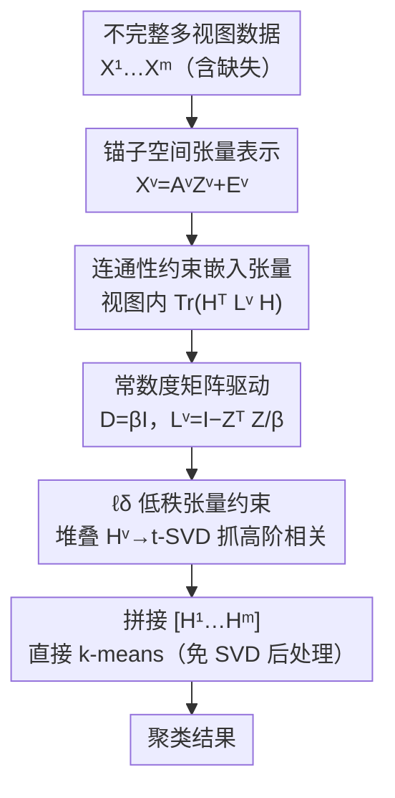

# Constant Degree Matrix-Driven Incomplete Multi-View Clustering via Connectivity-Structure and Embedding Tensor Learning

**会议**: ICLR2026  
**OpenReview**: [https://openreview.net/forum?id=yMMb3rCuNM](https://openreview.net/forum?id=yMMb3rCuNM)  
**代码**: 待确认  
**领域**: 多视图聚类 / 图学习 / 张量低秩  
**关键词**: 不完整多视图聚类、常数度矩阵、连通性约束、嵌入张量、ADMM

## 一句话总结
CAMEL 把"图连通性约束"和"潜在嵌入张量的低秩约束"统一进同一个目标，并用一个常数度矩阵 $D=\beta I$ 替换 Laplacian 里随数据变化的度矩阵，把度矩阵构造从 $O(n^2)$ 降到 $O(1)$，在不做 SVD 后处理的前提下直接对潜在嵌入跑 k-means，九个不完整多视图数据集上又快又准。

## 研究背景与动机
**领域现状**：多视图聚类（MVC）想把同一批样本的多种视角/模态（如图像的纹理、颜色、LBP 特征）整合起来挖掘潜在簇结构。现实中常有视图缺失，于是衍生出不完整多视图聚类（IMVC）。其中张量方法因为能建模跨视图的高阶相关性而最受关注——把各视图的图/系数矩阵堆成三阶张量，再施加低秩约束。

**现有痛点**：张量方法分两派，各有硬伤。**后处理派**从锚图/系数矩阵 $Z^v$ 出发，必须先做 SVD（或谱聚类）才能拿到能聚类的潜在嵌入，再跑 k-means——这一步不仅增加计算开销，还把"图学习"和"嵌入学习"解耦成两个阶段，误差会在两阶段间传播，导致次优解。**免后处理派**（Xu et al. 2025、Liu et al. 2025）直接学潜在嵌入矩阵 $H^v$，k-means 可以直接用，省了 SVD；但它们丢掉了连通性约束，无法显式保留每个视图底层图的全局几何结构。

**核心矛盾**：想保留几何结构最自然的办法是给邻接矩阵加连通性约束，这要构造 Laplacian $L^v=I-(D^v)^{-1/2}S^v(D^v)^{-1/2}$；而度矩阵 $D^v$ 要对相似度矩阵 $S^v\in\mathbb{R}^{n\times n}$ 逐列求和，复杂度 $O(n^2)$，在大规模数据上直接成为瓶颈。更糟的是，已有连通性方法把潜在嵌入表示成跨视图的单一共识矩阵，天然容不下张量约束，于是"低秩 + 高阶相关"和"图连通性"二者难以同时拿到。

**本文目标**：(1) 让连通性约束与潜在嵌入张量的低秩约束在同一个模型里协同优化；(2) 把连通性约束的度矩阵开销从 $O(n^2)$ 砍下来；(3) 全程免 SVD 后处理。

**切入角度**：作者观察到——度矩阵本来就是从含噪的 $Z^v$ 算出来的、本身就不准；而且连通分量划分是"粗粒度"操作，邻接图只要抓到大致结构就够了。既然度矩阵注定不精确，那干脆用一个常数近似它，省下的算力还不损害聚类。

**核心 idea**：用常数度矩阵 $D=\beta I$ 替换可变度矩阵，把 Laplacian 简化为 $L^v=I-\frac{1}{\beta}(Z^v)^\top Z^v$，并把视图特定的连通性约束与 $\ell_\delta$ 低秩张量约束联合进一个 ADMM 框架。

## 方法详解

### 整体框架
CAMEL 的输入是 $m$ 个视图、含缺失的多视图数据 $\{X^v\}_{v=1}^m$（$X^v\in\mathbb{R}^{d_v\times n}$），输出是 $n$ 个样本的簇标签。整条管线可以分成四块：先用锚子空间把每个视图分解成 $X^v=A^vZ^v+E^v$（锚矩阵 $A^v$ 正交、系数矩阵 $Z^v\ge 0$）；再对每个视图学一个潜在嵌入 $H^v$，并对其施加**视图特定的连通性约束** $\mathrm{Tr}((H^v)^\top L^v H^v)$ 以保留图的几何结构；这里的 Laplacian 用**常数度矩阵**做近似，把昂贵的度矩阵构造干掉；最后把各视图的 $\{H^v\}$ 堆成张量 $\mathcal{H}$ 施加 $\ell_\delta$ 低秩约束以抓高阶相关，拼接 $[H^1,\dots,H^m]$ 后直接 k-means 出结果。整个目标用 ADMM 联合求解，并给了收敛性保证。

### 关键设计

**1. 锚子空间张量表示：用免后处理的潜在嵌入而非系数张量**

针对"后处理派必须做 SVD、还误差传播"的痛点，CAMEL 把低秩约束**直接施加在潜在嵌入 $H^v$ 构成的张量上**，而不是施加在子空间系数 $Z^v$ 构成的张量上。每个视图先做锚分解 $X^v=A^vZ^v+E^v$，其中 $(A^v)^\top A^v=I$（正交约束保证锚的判别性多样性）、$Z^v\ge 0$、$E^v$ 是重构误差。关键在于：聚类真正用的是 $H^v$ 这层"干净"的表示，而非含噪的 $Z^v$；因为低秩张量约束直接落在 $H^v$ 上，k-means 可以直接在 $\{H^v\}$ 拼接后的矩阵上跑，彻底省掉为提取嵌入而做的 SVD，从源头切断了两阶段误差传播。

**2. 连通性约束的嵌入张量联合学习：让每个视图显式保留图的几何结构**

针对"免后处理派丢掉连通性、保不住全局几何"的痛点，CAMEL 把连通性约束**改写成视图特定形式**塞进子空间结构里。对每个视图加一项 $\mathrm{Tr}((H^v)^\top L^v H^v)$，其中归一化 Laplacian $L^v=I-(D^v)^{-1/2}S^v(D^v)^{-1/2}$，相似度矩阵 $S^v=(Z^v)^\top Z^v$。这一项强迫 $H^v$ 顺着图的连通结构走，把邻域信息保留下来、提升表示判别性。同时模型对堆叠张量 $\mathcal{H}=\Phi(H^1,\dots,H^m)$ 施加 $\ell_\delta$ 低秩约束抓高阶相关。整体目标为

$$\min \;\|\mathcal{H}\|_{\ell_\delta}+\lambda_1\sum_v\|E^v\|_F^2+\lambda_2\sum_v\mathrm{Tr}\big((H^v)^\top L^v H^v\big)$$

约束为 $X^v=A^vZ^v+E^v,\,Z^v\ge0,\,(A^v)^\top A^v=I,\,(H^v)^\top H^v=I$。这样连通性（保几何）和张量低秩（抓高阶相关）第一次在同一个目标里协同优化。

**3. ℓδ 范数低秩张量约束：比核范数更平滑紧致的秩代理**

低秩张量约束的秩函数 $R(\cdot)$ 用 $\ell_\delta$ 范数近似，其标量形式为 $f(x)=\frac{(1+\delta)x}{\delta+x}$。对三阶张量 $\mathcal{H}$，

$$\|\mathcal{H}\|_{\ell_\delta}=\frac{1}{n_3}\sum_{k=1}^{n_3}\sum_{i=1}^{h}\frac{(1+\delta)S_f^k(i,i)}{\delta+S_f^k(i,i)}$$

其中 $S_f^k$ 是对 $\mathcal{H}$ 各前向切片做 t-SVD（$\mathcal{H}_f^k=U_f^k S_f^k (V_f^k)^\top$）得到的奇异值切片，$h=\min(n_1,n_2)$，$\delta>0$ 是秩函数参数。相比传统张量核范数对所有奇异值一视同仁地线性惩罚，$\ell_\delta$ 对奇异值的惩罚更灵活——大奇异值近饱和、小奇异值受压，是更平滑也更紧的代理，能更好地逼近真实秩。

**4. 常数度矩阵近似：把度矩阵构造从 O(n²) 砍到 O(1)**

这是 CAMEL 的核心创新，针对"连通性约束的 $O(n^2)$ 度矩阵瓶颈"。即便重排优化步骤能把 $S^v=(Z^v)^\top Z^v$ 的计算降到线性，度矩阵 $D^v$ 仍要对 $S^v\in\mathbb{R}^{n\times n}$ 逐列求和，$O(n^2)$ 跑不掉。作者直接用常数度矩阵 $D=\beta I$（$\beta>0$ 控制度的量级）替换可变度矩阵，于是 Laplacian 简化为 $L^v=I-\frac{1}{\beta}(Z^v)^\top Z^v$，度矩阵构造降到 $O(1)$。这个近似有三点理由：① $Z^v$ 本身含噪，从 $(Z^v)^\top Z^v$ 算出的度矩阵本就不准，用一个合理近似不会比它更糟；② 连通分量划分是粗粒度操作，邻接图抓到大致结构后得到的 $H^v$ 就足够可靠；③ 张量约束还能进一步过滤近似度矩阵、重构误差和缺失数据带来的噪声。最终整体复杂度 $O(mtn\log n+d_{\max}tn)$。

### 损失函数 / 训练策略
用 ADMM（Lin et al. 2011）优化。引入辅助张量 $G$ 和拉格朗日乘子 $W,Y^v$，构造增广拉格朗日函数后交替更新五组变量 $A^v,Z^v,E^v,H^v,G$（复杂度分别为 $O(d_vtn+d_vt)$、$O(d_vn+d_vtn+tn)$、$O(d_vtn+d_vn)$、$O(tcn+c^2n)$、$O(mtn\log(mn)+m^2tn)$）。$\lambda_1,\lambda_2$ 只做 trade-off。理论上（Theorem 1）证明了迭代序列 $\{J_p\}$ 有界、且任一聚点都是满足 KKT 条件的稳定点，保证收敛。

## 实验关键数据

### 主实验
九个公开数据集（Yale3 / MSRCV1 / Still-DB / EYaleB10 / COIL20MV / Mfeat / Scene / Scene15 / Noisy MNIST / CIFAR10，规模 165→50000），与 BSV、Concat、PVC、IMVC-CBG、PSIMVC-PG、SCSL 六个 baseline 比，缺失率 $r\in\{0.1,0.3,0.5\}$，指标 ACC/NMI/PUR，各跑 5 次。CAMEL 在几乎所有数据集和缺失率下都大幅领先。

| 数据集 (缺失率) | 指标 | CAMEL | 次优 baseline | 提升 |
|--------|------|------|----------|------|
| MSRCV1 (0.1) | ACC | 97.81 | 74.76 (SCSL) | +23.05 |
| MSRCV1 (0.1) | NMI | 95.61 | ~66.58 | +29.03 |
| Yale3 (0.5) | ACC | 61.82 | 40.44 (PVC) | +21.38 |
| Still-DB (0.5) | ACC | 74.78 | 29.94 (IMVC-CBG) | +44.84 |

> 注：以上为正文/表 2 中可定位的代表性对比，部分次优值以表内可读项为准（⚠️ 精确次优行以原文表 2 为准）。MSRCV1 上缺失率越高 CAMEL 反而更稳（0.5 时 ACC 仍 97.90）。"OM" 表示 baseline 在大规模数据上爆显存。

### 消融与效率
- **常数度矩阵 vs 可变度矩阵**：用 $D=\beta I$ 后度矩阵构造从 $O(n^2)$ 降到 $O(1)$，在大数据集上是能否跑得动的关键（多个 baseline 直接 OM）。
- **连通性约束 + 张量低秩联合 vs 单独**：去掉连通性约束就退化成免后处理派、丢几何结构；去掉张量低秩则抓不到跨视图高阶相关——两者协同才拿到最佳。
- **$\ell_\delta$ vs 张量核范数**：$\ell_\delta$ 作为更紧的秩代理带来更好的低秩逼近。

### 关键发现
- 常数度矩阵这个"近似反而不亏"的洞察是性能与效率双赢的关键：因为度矩阵本就含噪、连通分量又是粗粒度操作。
- 缺失率升高时 CAMEL 退化平缓（MSRCV1、Still-DB 上 0.5 甚至优于 0.1），说明连通性 + 张量低秩的联合约束对缺失鲁棒。
- 超参搜索范围：$\lambda_1\in[10^{-8},10^{-3}]$、$\lambda_2\in[10^{-4},10^{-2}]$、$\beta\in[10^1,10^4]$、$\delta\in[10^{-3},10^0]$。

## 亮点与洞察
- **"不准的东西就别精算"的工程哲学**：度矩阵从含噪 $Z^v$ 来，本就不精确，那花 $O(n^2)$ 精算它没意义——直接常数近似省两个数量级算力，准确度还不掉。这个"误差容忍 → 复杂度降级"的思路可迁移到其他含噪中间量的近似。
- **把连通性约束改成视图特定形式**，绕开了"共识矩阵容不下张量约束"的结构障碍，让"图几何"和"高阶相关"第一次共存于一个目标。
- **全程免 SVD 后处理**：低秩约束直接落在聚类真正使用的潜在嵌入 $H^v$ 上，从源头切断两阶段误差传播。

## 局限与展望
- 常数度矩阵 $D=\beta I$ 假设各节点度相近，对度分布极不均匀（强 hub）的图可能损失结构信息，论文未深入讨论这种极端情形。
- $\beta$ 搜索范围跨四个数量级（$10^1$–$10^4$），实际部署时对 $\beta$ 的敏感性与自适应选取值得进一步研究。
- 实现基于 MATLAB、在 CPU（i7 + 16GB）上跑，未给出 GPU/更大规模（>50000 样本）的扩展性验证。
- 仍依赖锚的数量 $t$ 等超参，锚的选取质量对结果的影响未单列消融。

## 相关工作与启发
- **vs 后处理派（Gu & Feng 2024、Zhang et al. 2023）**：他们在系数/锚图张量上做低秩、再 SVD 提嵌入，CAMEL 直接在潜在嵌入张量上做低秩、免 SVD，避免两阶段误差传播。
- **vs 免后处理派（Xu et al. 2025、Liu et al. 2025）**：他们省了 SVD 但丢掉连通性约束、保不住几何结构，CAMEL 用视图特定连通性约束补回几何，同时保住免后处理优势。
- **vs 普通连通性方法**：它们构造 Laplacian 要 $O(n^2)$ 度矩阵、且共识矩阵难配张量约束，CAMEL 用常数度矩阵降到 $O(1)$ 并改成视图特定形式兼容张量。

## 评分
- 新颖性: ⭐⭐⭐⭐ 常数度矩阵近似 + 连通性/张量低秩联合是一个干净且有理论支撑的新组合。
- 实验充分度: ⭐⭐⭐⭐ 九数据集、三缺失率、六 baseline、三指标，但缺 GPU/超大规模与 $\beta$ 敏感性深入分析。
- 写作质量: ⭐⭐⭐⭐ 动机推导清晰，三点近似理由有说服力；缓存文本含少量笔误。
- 价值: ⭐⭐⭐⭐ 给"连通性 + 张量低秩 + 免后处理"的 IMVC 提供了又快又准的实用范式。

<!-- RELATED:START -->

## 相关论文

- [\[ICLR 2026\] Confident Block Diagonal Structure-Aware Invariable Graph Completion for Incomplete Multi-view Clustering](confident_block_diagonal_structure-aware_invariable_graph_completion_for_incompl.md)
- [\[ICLR 2026\] Dual-Branch Representations with Dynamic Gated Fusion and Triple-Granularity Alignment for Deep Multi-View Clustering](dual-branch_representations_with_dynamic_gated_fusion_and_triple-granularity_ali.md)
- [\[ICLR 2026\] Multi-Scale Diffusion-Guided Graph Learning with Power-Smoothing Random Walk Contrast for Multi-View Clustering](multi-scale_diffusion-guided_graph_learning_with_power-smoothing_random_walk_con.md)
- [\[ICLR 2026\] Compactness and Consistency: A Conjoint Framework for Deep Graph Clustering](compactness_and_consistency_a_conjoint_framework_for_deep_graph_clustering.md)
- [\[ICML 2026\] T-GINEE: A Tensor-Based Multilayer Graph Representation Learning](../../ICML2026/graph_learning/t-ginee_a_tensor-based_multilayer_graph_representation_learning.md)

<!-- RELATED:END -->
