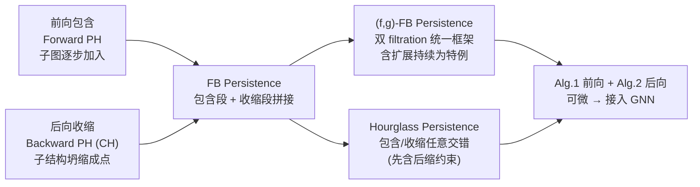

# Contraction and Hourglass Persistence for Learning on Graphs, Simplices, and Cells

**会议**: ICLR 2026  
**OpenReview**: [https://openreview.net/forum?id=mWN6cpA6Wr](https://openreview.net/forum?id=mWN6cpA6Wr)  
**代码**: [https://github.com/Aalto-QuML/Hourglass](https://github.com/Aalto-QuML/Hourglass)  
**领域**: 图学习 / 拓扑数据分析 / 持续同调  
**关键词**: Persistent Homology, Graph Neural Networks, Contraction, Hourglass Persistence, Expressivity, Stability  

## 一句话总结
本文指出主流 GNN 里基于"只往里加子图"(inclusion-based forward PH)的持续同调存在表达力与度量缺陷，提出用"收缩"(contraction)反向杀死永生拓扑特征，并把包含与收缩交错排列成 **Hourglass Persistence**，在严格证明表达力更强、可度量、稳定的同时给出可微算法，插进 GNN 后在多个图数据集上稳定超越已有 PH 方法。

## 研究背景与动机
**领域现状**：消息传递 GNN 的表达力被 Weisfeiler-Lehman 层级卡住，难以捕捉环、空腔这类高阶拓扑信号。拓扑数据分析里的持续同调(PH)能在 filtration 过程中追踪拓扑特征的"生与死"，因此近年被大量用来给 GNN 加 buff（RePHINE、TOGL 等）。

**现有痛点**：几乎所有 PH 流水线都用 **inclusion-based filtration（前向持续，forward PH）**——按 filtration 函数值由小到大不断往图里塞顶点和边。这种"单向只增"视角有两个硬伤：(1) 在图上前向过程里一旦一个环诞生就**永远不会死**，新连通分量却能不断冒出来，信息分布天然不对称；(2) **不可度量**——两张不同图的持续图里"永生特征"(b, ∞)数目不同，bottleneck 距离会算出 ∞，没法稳定比较。

**核心矛盾**：前向 PH 只描述特征"如何出现"，却无法描述它"如何消失"，既丢信息又破坏度量性，而简单地"给永生特征塞一个有限死亡时间 N"又对扰动极其敏感。

**本文目标**：找到一种**有原则的拓扑操作**来"杀死"这些永生特征，让持续图既更有表达力又可度量、可稳定。

**核心 idea**：**用收缩(contraction)做"时间倒流"**。前向 PH 是把子结构逐步加进来的时间正放，而收缩是把子结构逐步坍缩成点的时间倒放。作者把"收缩序列的持续同调"称为 **Contraction Homology (CH)**，进而把前向包含与后向收缩拼起来甚至**任意交错**，得到一族沙漏形(hourglass)的拓扑描述子。

## 方法详解

### 整体框架
论文围绕一根主线层层加码：先用收缩构造 **Backward PH(BH)**，证明它与 forward PH 互不包含；再把前向包含段 + 后向收缩段拼接成 **Forward-Backward (FB) Persistence**，证明严格强于两者之和；接着发现"中间复形(intermediate complexes)谁先谁后收缩没有正则理由"，于是放开顺序得到 **Hourglass Persistence**；最后用两个 filtration 函数 $f, g$ 抽象出统一的 **$(f,g)$-FB Persistence**，把扩展持续(extended persistence)也收编为特例，并配套可微算法塞进 GNN。

### 关键设计

**1. 收缩同调与后向持续(Backward PH)：让永生的环死掉。** filtration 把图切成 $\varnothing = G_{-1}\subset G_0\subset\dots\subset G_n=G$，定义**中间复形** $\mathrm{IC}_i(G)$ 为 $G_i - G_{i-1}$ 的闭包。后向持续不是去缩超水平集，而是反向逐个把中间复形商掉：$G \to G/\mathrm{IC}_n(G)\to G/(\ast\cup \mathrm{IC}_{n-1}(G))\to\dots\to\ast$，最终全图坍成一个点，每步取商映射的诱导同调 $H_i$。这一倒放过程恰好补上前向的盲区——**前向里环只生不死，后向里环可以被杀死；前向能不断生新连通分量，后向除首步外不再生分量**。作者用 Proposition 1 给出具体图对：存在 $G,H$ 前向 PH 看不出区别但后向能区分，反之亦然，即两者表达力**互不包含**，缺一不可。

**2. 前向-后向持续(FB Persistence)：拼接才是 1+1>2。** 既然两个方向各有盲区，直接把包含序列和收缩序列首尾相接：$H_i(G_\bullet + (G_\bullet)^v)$，让一个特征"如何出现(前向)"与"随后如何消失(后向)"被赋予有限寿命，永生特征被自然杀死、度量性恢复。关键结论 **Theorem 1**：FB 持续**严格强于**前向与后向之和——它能恢复前向也能恢复后向，但存在图对 $G,H$ 前向与后向都相同、FB 却不同。直觉是"怎么把前向死亡时间和后向死亡时间拼接对齐"本身蕴含额外信息。

**3. Hourglass Persistence：解放收缩顺序换表达力。** 中间复形满足 $\bigcup_i \mathrm{IC}_i(G)=G$ 且彼此最多在顶点相交，所以**按任何顺序**收缩都会终止于单点；同理 filtration 也只是"按某种升序生成中间复形"的特例。基于这一组合洞察，定义 $(\sigma,\tau)$-FB 持续：用排列 $\sigma$ 决定包含顺序、$\tau$ 决定收缩顺序。更进一步，**没有理由非要等整图加完才开始收缩**——只要"一个块被收缩前必须已被包含"，就能像沙漏一样在前向步与后向步之间来回切换，这就是 **Hourglass Persistence**(Definition 9)。Proposition 2 证明它**比 FB 持续更强**；而且交错还能**限制全生命周期里出现过的最大空间规模**，给出"运行时间 ↔ 表达力"的可调权衡，利于在大图上 scale。

**4. $(f,g)$-FB 统一框架与稳定性：收编扩展持续并给度量保证。** 用两个 filtration 函数 $f$(决定包含)、$g$(决定收缩)抽象出 $(f,g)$-FB 持续，序列为 $\varnothing\subset G^f_0\subset\dots\subset G^f_n=G=G^g_0\to\dots\to G^g_m=\ast$。它统一了多种构造：**Proposition 3** 证明扩展持续等价于 $(f,-f)$-FB 持续；**Proposition 5** 又给出反例说明 FB 持续与扩展持续**确实不同**（FB 能分辨而扩展持续不能）；Proposition 6 说明 $(f,f)$-FB 退化回前向 PH 不增信息。框架还能"把 graph 换成 cell complex"无痛推广到单纯复形(用加 $v^+$ 顶点的"单纯商"技巧)与正则胞腔复形。稳定性方面 **Theorem 2** 给出 bottleneck 稳定界：$d_B \le 2\lVert f-f'\rVert_\infty + \lVert g-g'\rVert_\infty + \lvert \max(f)-\max(f')\rvert$，保证输入 filtration 扰动不会让输出剧烈跳变。

**5. 可微算法：前向记账 + 后向收缩，端到端插进 GNN。** Algorithm 1(ForwardInclusion)在标准并查集上额外维护(i)生成森林的邻接信息与(ii) $\mathbb{F}_2$ 上的基本环基(fundamental cycle basis)：每条新边若连通两个分量则记 $H_0$ 死亡、合并分量；若已连通则与森林路径构成一个新独立环，记 $(f(e),\infty)$。Algorithm 2(BackwardContraction)按 $g$ 顺序把顶点并入一个"超级节点(supernode)"：顶点收缩时若来自不同分量则杀死较年轻的 $H_0$ 区间；边收缩(成为超级节点上的自环)时通过约简环基给一个 $H_1$ 区间补上有限死亡时间。两段都可微，配 GIN/GCN backbone 与 DeepSets 池化编码持续图，端到端训练时**连 vertex/edge filtration 和收缩顺序一起学**。

## 实验关键数据

### 主实验（六数据集，PH 变体对比，GIN backbone）

| Dataset | PH | RePHINE | Fwd-only | Bwd-only | **Ours** |
|---|---|---|---|---|---|
| NCI109 (Acc%↑) | 76.76 | 77.89 | 77.00 | 76.35 | **77.89** |
| PROTEINS (Acc%↑) | 69.35 | 69.94 | 70.24 | 70.54 | **73.51** |
| IMDB-B (Acc%↑) | 68.67 | 70.67 | **74.67** | 74.33 | 72.00 |
| NCI1 (Acc%↑) | 79.24 | 78.75 | 76.72 | 75.75 | **81.27** |
| ZINC (MAE↓) | 0.43 | 0.41 | 0.62 | 0.61 | **0.40** |
| MOLHIV (AUC%↑) | **74.34** | 72.88 | 70.00 | 70.59 | 72.34 |

GCN backbone 上同样趋势：PROTEINS 72.32、NCI1 78.67、ZINC 0.44、MOLHIV **76.37** 均为最佳或次佳。整体上 **Ours 在 12 个设置(6 数据集 × 2 backbone)里有 9 个取得最优或次优**。

### 消融实验（拆开前向/后向）
- **Fwd-only**(只学前向 filtration、关掉收缩)通常优于标准 PH，验证"学 filtration"有用。
- **Bwd-only**(只学收缩顺序)在多个数据集上也优于 PH，与 Fwd-only 互有胜负、整体相当——说明**收缩本身就是独立有效的信号**。
- **Ours**(联合学包含+收缩)几乎总是超过两个单边消融，证明包含与收缩编码的是**互补**的结构信息。

### 与扩展持续对比（Table 2，Accuracy%）

| Dataset | ExtP | PersLay | **Ours** |
|---|---|---|---|
| NCI109 | 78.21 | 68.28 | **78.21** |
| PROTEINS | **74.11** | 66.07 | 73.21 |
| IMDB-B | 63.00 | 70.00 | **73.00** |
| NCI1 | 78.59 | 68.86 | **81.51** |

把扩展持续直接嵌进前向-后向框架(用 $-f$ 当收缩调度)就稳定超过 PersLay 的后处理式做法，而完整 $(f,g)$ 模型再进一步超越扩展变体。

### 关键发现
- 收缩不是单纯加速 PH 计算的技巧，而是**承载独立拓扑信息**的一等操作。
- 包含与收缩**互补**，联合学习是拿到最强性能的关键。
- 框架在分类、回归、分子性质预测三类任务上都成立，泛化性较好。

## 亮点与洞察
- **视角翻转**：把"收缩"从 PH 的加速工具升级为提供新信息的核心操作，"时间倒流"杀死永生环这个直觉简洁有力。
- **理论扎实**：几乎每个构造都配最小见证图(minimal witness graph)与构造性证明，表达力链条 Hourglass ≻ FB ≻ Forward+Backward 层层严格，还顺手厘清了与扩展持续/zigzag/bipath filtration 的关系。
- **可度量 + 可稳定**：用收缩杀死永生特征顺带解决了 bottleneck 距离的 ∞ 问题，并给出函数时间下的稳定性定理。
- **工程落地**：Alg.1/Alg.2 可微、可插入任意 GIN/GCN 流水线，把 filtration 和收缩顺序一起学。

## 局限与展望
- **Hourglass 的函数时间稳定性未解**：由于包含与收缩步骤交错，函数值赋值不再正则，目前只证明了组合时间(combinatorial time)下的稳定性，函数时间稳定性留作未来工作。
- **运行时间 ↔ 信息的权衡未充分探索**：Hourglass 提供了中间规模控制的可调旋钮，但何时、如何收缩才最优仍是开放问题。
- **实验规模偏小**：数据集均为中小型标准图分类/回归基准，缺少大规模图或工业级场景验证，IMDB-B、MOLHIV 上并非总最优，说明增益与数据特性相关。

## 相关工作与启发
- **PH 增强 GNN**：RePHINE、TOGL、PersLay、GEFL 等都用 inclusion-based filtration；本文是首个系统把"收缩方向"作为信息源并证明其与前向互补的工作。
- **扩展持续(Extended Persistence)**：经典上用 $f$ 正向、$-f$ 反向解决永生特征问题；本文证明其等价于 $(f,-f)$-FB 持续，但更一般的 $(f,g)$ 与 hourglass 严格更强。
- **离散 Morse 理论与 collapse**：历史上收缩多用于**加速** PH 且尽量不改输出；本文反其道用收缩**主动改变**拓扑来提取信息，是思路上的反转。
- **zigzag / bipath filtration**：同样混合不同 filtration 方向，但本文的中间复形商化机制与之不同，提供了新的组合自由度。
- **启发**：当某个流水线长期只用"单向"操作时，往往值得问一句"反过来做会暴露什么被忽略的信息"——这种对称性补全的思路在很多表示学习问题里都可能复用。

## 评分
- **新颖性**: ⭐⭐⭐⭐⭐ 把收缩从加速工具升格为信息源、提出 hourglass 任意交错的持续描述子，视角与构造都很原创。
- **实验充分度**: ⭐⭐⭐ 覆盖分类/回归/分子三类任务且消融清晰，但数据集规模偏小、部分设置非最优，缺大规模验证。
- **写作质量**: ⭐⭐⭐⭐ 理论链条层层递进、见证图与命题编排清楚，Figure 1 总览友好；符号偏密，对非 TDA 读者门槛较高。
- **价值**: ⭐⭐⭐⭐ 既给出可证明更强的拓扑描述子，又有可微算法直接落地 GNN，为 PH-on-graph 这条线提供了新的设计维度。

<!-- RELATED:START -->

## 相关论文

- [\[NeurIPS 2025\] Graph Persistence goes Spectral](../../NeurIPS2025/graph_learning/graph_persistence_goes_spectral.md)
- [\[ICLR 2026\] Efficient Learning on Large Graphs using a Densifying Regularity Lemma](efficient_learning_on_large_graphs_using_a_densifying_regularity_lemma.md)
- [\[ICLR 2026\] TGM: A Modular and Efficient Library for Machine Learning on Temporal Graphs](tgm_a_modular_and_efficient_library_for_machine_learning_on_temporal_graphs.md)
- [\[ICLR 2026\] Towards Improved Sentence Representations using Token Graphs](towards_improved_sentence_representations_using_token_graphs.md)
- [\[ICLR 2026\] EvA: Evolutionary Attacks on Graphs](eva_evolutionary_attacks_on_graphs.md)

<!-- RELATED:END -->
