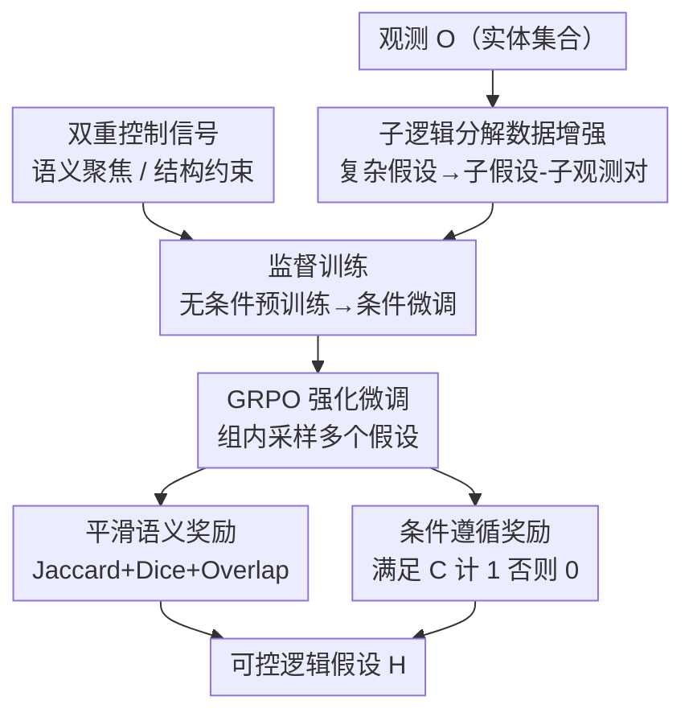

# Controllable Logical Hypothesis Generation for Abductive Reasoning in Knowledge Graphs

**会议**: ICLR2026  
**OpenReview**: [https://openreview.net/forum?id=oTgJg0M9kY](https://openreview.net/forum?id=oTgJg0M9kY)  
**代码**: https://github.com/HKUST-KnowComp/CtrlHGen  
**领域**: 知识图谱推理 / 溯因推理 / 可控生成  
**关键词**: 知识图谱、溯因推理、逻辑假设生成、可控生成、强化学习（GRPO）

## 一句话总结
本文提出 CtrlHGen，把知识图谱上的溯因推理（从观测实体反推合理逻辑假设）升级成"可控"任务——让用户能指定假设的语义方向和结构复杂度；通过子逻辑分解的数据增强缓解"长假设样本稀缺"、用 Dice/Overlap 平滑的语义奖励加上条件遵循奖励缓解"奖励过敏"，在三个 KG 数据集上既更服从控制信号、语义相似度也优于 baseline。

## 研究背景与动机

**领域现状**：知识图谱上的溯因推理（abductive reasoning）要解决的问题是——给定一组观测实体（如三种自身免疫疾病、三名 NBA 球员），反推出一个能"解释"它们的逻辑假设（一阶逻辑查询），其结论集合应尽量覆盖这组观测。它在临床诊断、异常检测、科学发现里都有用。AbductiveKGR（Bai et al., 2024b）首次把这个任务形式化成"逻辑查询生成"，并用监督 + 强化学习的 Transformer 来生成假设。

**现有痛点**：真实 KG 动辄上百万条事实，一个观测往往能反推出**大量看似合理但冗余或不相关**的假设。哪怕在只有 24,624 实体、351 关系的小数据集 DBpedia50 上，平均每个观测都能生成约 50 个合理假设；图越大数量越爆炸。用户其实只关心某个侧面（疾病的病理？治疗？易感人群？）或某种粒度（粗略共性还是精细区分），但现有方法一股脑全吐出来，没有任何控制手段。

**核心矛盾**：要把"可控"做进来，作者发现生成**长而复杂**的逻辑假设时撞上两道墙：(i) **假设空间坍缩（Hypothesis Space Collapse）**——合理假设的数量随逻辑长度增加而急剧下降，长逻辑（三谓词）的有效参考假设极少，模型缺样本学不会复杂结构，结构复杂度控制就无从谈起；(ii) **假设奖励过敏（Hypothesis Reward Oversensitivity）**——前作用 Jaccard 分数当奖励，但 Jaccard 对集合级一致性的评判太严苛，假设里一个谓词的微小偏差（如把"列入官方总统档案"换成别的）就能让结论集合从 2 个炸到 45 个、Jaccard 从应有值暴跌到 0.044，奖励剧烈抖动、训练被带偏。

**本文目标**：(1) 定义并实现可控溯因推理，支持**语义内容控制**（聚焦某个实体/关系侧面）和**结构复杂度控制**（指定逻辑模式 / 实体数 / 关系数）；(2) 让模型在长复杂假设上也学得会、训得稳。

**切入角度**：复杂假设虽然样本稀少，但它由更简单的子逻辑组合而成，而子逻辑既结构相关又语义相关、样本充足——可以"以简带繁"；同时奖励之所以过敏，是因为单一 Jaccard 太"非黑即白"，换成更宽容的相似度族就能平滑梯度。

**核心 idea**：用**子逻辑分解的数据增强**破解空间坍缩，用 **Jaccard+Dice+Overlap 的平滑语义奖励 + 条件遵循奖励**破解奖励过敏，二者嵌进"监督 + GRPO 强化"的两阶段训练，得到可控的假设生成器 CtrlHGen。

## 方法详解

### 整体框架

CtrlHGen 要解决的是：给定观测 $O$（实体集合）和控制条件 $C$，生成一个一阶逻辑假设 $H$，使其结论集合 $[H]_G$ 既贴近观测 $O$、又满足 $C$ 指定的语义/结构约束。整条管线分三步：先**构造观测-假设训练对**（并用子逻辑分解做增强以补足长逻辑样本），再**监督训练**一个 decoder-only Transformer 学会基础生成与条件遵循，最后用 **GRPO 强化微调**在双重奖励（语义对齐 + 条件遵循）下打磨质量与可控性。

控制条件 $C$ 来自两个维度：**语义聚焦**（从目标假设里采一个实体或关系当条件，把生成约束到 KG 的某个语义区域）和**结构约束**（强制某个逻辑模式、或指定实体数 `[ne]`、或指定关系数 `[nr]`）。这两类信号既参与监督阶段的条件微调，也在强化阶段被条件遵循奖励兑现。

### 关键设计

**1. 双重控制信号：把"想要哪种解释"变成可输入的约束**

可控溯因推理是本文新提出的任务，关键在于把用户意图编码成模型能吃的 token。作者设计了两类正交的控制信号。**语义聚焦**：从目标假设中随机采一个实体或关系作为条件 $C\in\{T_e\}$ 或 $C\in\{T_r\}$，引导模型只在 KG 的某个语义区域里找解释（如对三种自身免疫病，分别聚焦"病理/治疗/易感人群"得到三种不同侧面的假设）。**结构约束**则控制假设的复杂度，含三种：强制一个用 Lisp 式算子 token 表示的预定义逻辑模式、用特殊 token `[ne]` 限定假设恰好含 $n$ 个实体、用 token `[nr]` 限定恰好含 $n$ 个关系。形式上控制目标是：找到假设 $H$ 使结论 $[H]_G$ 贴近观测 $O$，同时 $H$ 满足 $C$。正是这套"可输入的约束"把原先一股脑生成 50 个假设的过程，收窄到与用户意图对齐的少数几个。

**2. 子逻辑分解数据增强：以简带繁，破解假设空间坍缩**

长逻辑假设的合理样本天然稀少，直接训练学不会复杂结构。作者的思路是：复杂假设由子逻辑拼成，而子逻辑既与原假设结构/语义高度相关、又样本充足，可以拿来"垫脚"。具体地，对一个复杂逻辑模式 $P$ 下的假设-观测对 $(H,O)$，按可识别的子逻辑模式 $P_{sub}$ **递归分解**出子假设，再把子假设在 KG 上执行得到对应的子观测：

$$\{(H^i_{sub}, O^i_{sub})\}_{i=1}^n = \big\{\, (f(P^i_{sub}, H),\ [f(P^i_{sub}, H)]_G)\ \big|\ P^i_{sub}\subseteq P \,\big\}$$

其中 $f(P^i_{sub}, H)$ 是由子模式生成的子假设，$[\cdot]_G$ 表示在图上查询得到结论。每个子假设都是原假设的子集，因此与原假设强对齐，模型可以从简单子模式逐步爬到复杂模式。作者从 13 种逻辑模式里挑了 5 种复杂模式（up、3in、pni、pin、inp）做分解。消融显示这一招对含析取、否定的复杂模式提升 Jaccard 最明显，且简单模式（如 1p）也跟着受益——说明收益来自模型真正理解了内部逻辑结构，而非依赖外部提示。

**3. 平滑语义奖励：用 Dice + Overlap 给过敏的 Jaccard 兜底**

前作单用 Jaccard 当奖励，它对集合级一致性评判太严，一个谓词写错就让结论集合规模剧变、奖励暴跌，训练被错误方向带偏。作者保留 Jaccard 作主奖励（取其严格性），但补两个更宽容的相似度系数——Dice 和 Overlap——来平滑梯度、容忍轻微失配：

$$R_{sem}([H]_G, O) = \lambda_1\frac{|[H]_G\cap O|}{|[H]_G\cup O|} + \lambda_2\frac{2|[H]_G\cap O|}{|[H]_G|+|O|} + \lambda_3\frac{|[H]_G\cap O|}{\min(|[H]_G|,|O|)}$$

三项分别是 Jaccard、Dice、Overlap，$\lambda_1,\lambda_2,\lambda_3$ 为权重。Dice 对交集的"奖励"比 Jaccard 更高、对并集膨胀更不敏感；Overlap 用较小集合归一，进一步缓冲规模失衡。三者加权后奖励曲面更平滑，模型探索时不会因一步小错就掉进奖励悬崖。消融里去掉 Dice/Overlap 后性能变差，印证单靠 Jaccard 太严会阻碍收敛。

**4. 条件遵循奖励 + GRPO 组相对优化：让"可控"在强化阶段被真正兑现**

光有语义奖励只保证"解释得准"，不保证"服从控制"。作者加了一个二值的**条件遵循奖励**：生成假设 $H$ 满足条件 $C$ 记 1、否则记 0（$R_{cond}(H,C)$），并与语义奖励加权成总奖励 $\hat R = \alpha R_{sem} + (1-\alpha) R_{cond}$，$\alpha$ 平衡"准"与"服从"。由于溯因推理本就该产出多个合理假设而非唯一答案，作者用 **GRPO**（Group Relative Policy Optimization）优化：对同一观测和条件采样一组假设 $\hat H = H_1,\dots,H_k$，用组内归一化后的奖励 $\hat R'_i$ 做相对优化，并加 KL 项约束策略 $\pi_\theta$ 不偏离参考模型太远、配合梯度裁剪稳住训练：

$$J(\theta)=\mathbb{E}\Big[\frac{1}{k}\sum_{i=1}^{k}\frac{1}{|H_i|}\sum_{t=1}^{|H_i|}\frac{\pi_\theta(h_{i,t}\mid O,C,h_{i,<t})}{\pi_{\theta_{old}}(h_{i,t}\mid O,C,h_{i,<t})}\hat R'_i - \beta D_{KL}[\pi_\theta\|\pi_{ref}]\Big]$$

按"组"而非单个样本优化，恰好契合溯因推理"多个合理解"的本性，能整体抬升一组假设的质量而非过拟合某一个。消融显示去掉条件遵循奖励后语义相似度略升、但条件遵循准确率从 93.5% 掉到 68.3%，证明这项奖励是"可控"落地的关键。

### 损失函数 / 训练策略

监督阶段用自回归损失 $L_{AR}=-\sum_i \log p_\theta(h_i\mid h_{<i}, O, C)$ 训练 decoder-only Transformer（12 层），分两小步：先**无条件预训练**（只喂观测 token，习得通用假设生成能力），再**条件微调**（拼接观测 token 与控制条件 token，学会服从约束）。强化阶段用上文 GRPO 目标微调，提升对未见 KG 的泛化与条件遵循。优化器 AdamW，4×A6000 48GB。

## 实验关键数据

### 主实验

在 DBpedia50、WN18RR、FB15k-237 三个 KG 上，以 8:1:1 划分、开放世界假设下增量构图，验证/测试集含训练未见实体以考察泛化。评估语义相似度（Jaccard/Dice/Overlap）、条件遵循准确率（Accuracy）和结构相似度（Smatch）。相比无条件的 AbductiveKGR，加入控制条件后语义相似度普遍提升、多数条件遵循准确率超 80%。

| 数据集 | 条件 | Jaccard | Accuracy | Smatch |
|--------|------|---------|----------|--------|
| FB15k-237 | uncondition (AbductiveKGR) | 61.4 | — | 61.4 |
| FB15k-237 | pattern | 65.5 | 98.9 | 82.3 |
| FB15k-237 | relation-number | 65.1 | 99.4 | 82.4 |
| WN18RR | uncondition | 72.6 | — | 56.4 |
| WN18RR | pattern | 77.0 | 93.5 | 83.3 |
| DBpedia50 | uncondition | 64.3 | — | 51.0 |
| DBpedia50 | pattern | 73.8 | 88.4 | 79.2 |

结构条件（尤其固定格式的 `pattern`）整体优于语义聚焦条件；`specific-relation` 的条件遵循偏好明显高于 `specific-entity`。

与先进 LLM 对比（FB15k-237，五种条件平均）差距悬殊——LLM 难以真正理解结构化数据、且其内置知识可能与 KG 冲突：

| 模型 | Jaccard | Accuracy | Smatch |
|------|---------|----------|--------|
| GPT-4o + 2-hop 子图 | 2.4 | 77.5 | 37.9 |
| DeepSeek-V3 + RAG | 5.3 | 76.6 | 41.8 |
| GPT-5(Thinking) + 2-hop 子图 | 18.7 | 92.8 | 32.9 |
| **CtrlHGen** | **64.3** | **96.6** | **73.3** |

### 消融实验

奖励函数消融（WN18RR，`pattern` 条件）：

| 配置 | Jaccard | Accuracy | Smatch | Average |
|------|---------|----------|--------|---------|
| w/o RL（仅监督） | 71.5 | 81.5 | 79.0 | 78.3 |
| w/o Dice & Overlap | 74.8 | 90.3 | 82.0 | 82.1 |
| w/o 条件遵循奖励 | 77.5 | 68.3 | 75.0 | 78.0 |
| CtrlHGen（完整） | 77.0 | 93.5 | 83.3 | 84.3 |

### 关键发现
- **子逻辑分解贡献最大**：对含析取/否定的复杂模式 Jaccard 提升最明显，且简单模式（1p）也受益，说明模型是学到了内部逻辑结构而非靠外部提示；同时两种设置下 Accuracy 相近。
- **条件遵循奖励是可控性的命门**：去掉它语义相似度略升，但条件遵循 Accuracy 暴跌（93.5%→68.3%），二者存在张力，需要奖励设计来平衡。
- **平滑奖励改善收敛**：去掉 Dice/Overlap 后整体均分从 84.3 降到 82.1，单 Jaccard 太严会拖慢收敛。
- **强化学习提升泛化**：相比仅监督，RL 显著改善对未见图的泛化、并降低准确率方差。
- **可视化证实可控性**：不加约束时模型倾向生成关系更多的假设、难产出单关系假设；加 relation-number 约束后绝大多数生成假设的关系数都对齐期望。

## 亮点与洞察
- **"以简带繁"的数据增强很巧**：把样本稀缺的复杂假设递归拆成样本充足、且与原假设强相关的子逻辑，再回 KG 执行得到子观测，凭空造出高质量训练对——这套思路可迁移到任何"长结构化输出样本稀缺"的生成任务。
- **诊断奖励过敏的角度漂亮**：作者用一个"总统档案 vs 全部 45 位总统"的例子，把 Jaccard 因单谓词偏差导致结论集合规模剧变、奖励暴跌的机制讲得很直观，再用相似度族（Dice/Overlap）平滑，是"换更宽容的度量"而非"重新设计奖励"的低成本解法。
- **GRPO 用在溯因推理上很自然**：溯因本就该产出多个合理解，按组优化恰好对上"整组质量"而非"单解最优"，比逐样本 PPO 更贴任务本性。
- **强 baseline 实验有说服力**：连 GPT-5(Thinking) 在结构化 KG 查询生成上 Jaccard 也只有 18.7，凸显"理解 KG 结构"是 LLM 短板、专用结构化生成器仍不可替代。

## 局限与展望
- **生成器是从零训的 12 层小 Transformer**，与大规模预训练 LLM 解耦，知识与推理能力受限于训练 KG；如何把 KG 结构理解注入通用 LLM 仍是开放问题。
- **控制信号偏"低层"**：目前是实体/关系/模式/实体数/关系数这类显式约束，尚不支持自然语言意图（如"从治疗角度解释"）直接驱动，离真正的用户友好可控还有距离。
- **奖励权重 $\lambda_1,\lambda_2,\lambda_3,\alpha$ 为超参**，论文未充分给出敏感性分析，跨数据集是否需重调不明朗。
- **评测仍以集合相似度为主**：Jaccard/Dice/Overlap 衡量结论覆盖，但"假设是否真的有解释价值/可读性"难以量化，案例分析虽给了直觉但缺系统化人评。

## 相关工作与启发
- **vs AbductiveKGR (Bai et al., 2024b)**：前作首次把 KG 溯因形式化为逻辑查询生成、用监督+RL 训练，但完全不可控、且单用 Jaccard 奖励易过敏。本文在其框架上加入双重控制信号、子逻辑分解增强和平滑+条件遵循奖励，把任务升级成可控、并稳住训练。
- **vs 演绎/归纳推理（复杂查询回答、规则挖掘如 AMIE/RLogic）**：那些任务是"已知规则/查询求答案"，本文是"已知观测反推假设（逻辑查询本身）"，方向相反、更依赖对逻辑结构的生成能力。
- **vs LLM + 子图/RAG 的溯因尝试**：直接把 2-hop 子图塞进 prompt 让 GPT-4o/DeepSeek/GPT-5 生成假设，效果远逊本文，说明结构化查询生成需要专门的结构感知建模而非纯语义大模型。

## 评分
- 新颖性: ⭐⭐⭐⭐ 首次提出 KG 上的可控溯因推理任务，子逻辑分解增强 + 平滑奖励的组合针对性强、思路清晰。
- 实验充分度: ⭐⭐⭐⭐ 三数据集、多控制条件、消融与可视化齐全，还对比了含 GPT-5 在内的强 LLM baseline。
- 写作质量: ⭐⭐⭐⭐ 两大挑战的诊断（坍缩/过敏）用图例讲得直观，方法与动机对应清楚。
- 价值: ⭐⭐⭐⭐ 把溯因推理从"全量吐假设"推向"按需可控"，对临床/科学发现等需精准解释的场景实用，且数据增强思路可迁移。

<!-- RELATED:START -->

## 相关论文

- [\[ACL 2026\] CoG: Controllable Graph Reasoning via Relational Blueprints and Failure-Aware Refinement over Knowledge Graphs](../../ACL2026/graph_learning/cog_controllable_graph_reasoning_via_relational_blueprints_and_failure-aware_ref.md)
- [\[ICLR 2026\] Inductive Reasoning for Temporal Knowledge Graphs with Emerging Entities](inductive_reasoning_for_temporal_knowledge_graphs_with_emerging_entities.md)
- [\[ACL 2025\] Extending Complex Logical Queries on Uncertain Knowledge Graphs](../../ACL2025/graph_learning/extending_complex_logical_queries_uncertain_knowledge_graphs.md)
- [\[CVPR 2026\] Graph2Eval: Automatic Multimodal Task Generation for Agents via Knowledge Graphs](../../CVPR2026/graph_learning/graph2eval_automatic_multimodal_task_generation_for_agents_via_knowledge_graphs.md)
- [\[ICLR 2026\] Knowledge Reasoning Language Model: Unifying Knowledge and Language for Inductive Knowledge Graph Reasoning](knowledge_reasoning_language_model_unifying_knowledge_and_language_for_inductive.md)

<!-- RELATED:END -->
