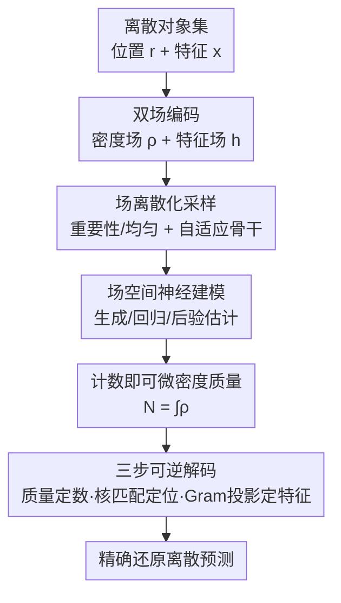

# CORDS - Continuous Representations of Discrete Structures

**会议**: ICLR 2026  
**OpenReview**: [https://openreview.net/forum?id=RObkOKADBU](https://openreview.net/forum?id=RObkOKADBU)  
**代码**: 待确认  
**领域**: 表示学习 / 生成模型 / 集合预测  
**关键词**: 可变基数、连续场、可逆表示、核叠加、分子生成

## 一句话总结
把"预测数量未知的一组对象"这件事统一改写成连续场上的推断：CORDS 用一个**可逆**映射把离散对象集编码成一个密度场（编码位置与个数）加一个特征场（携带属性），模型全程在场空间里学习，需要时再精确解码回离散集合，从而在分子生成、目标检测、仿真推断等任务里无需 padding、也无需专门的计数头就能处理可变基数。

## 研究背景与动机

**领域现状**：大量学习问题需要预测"一组对象"，但对象个数 $N$ 事先未知——目标检测里一张图有几个框不确定、分子生成里给定性质并不能唯一决定原子数、天文源检测里要从观测里恢复一份数量不定的源目录。处理这种可变基数，经典做法有变分推断做模型选择、可逆跳跃 MCMC、贝叶斯非参；深度学习时代则普遍走"预分配超额容量再抑制多余部分"的路线（如 DETR 固定 query 槽位、padding 到最大长度）。

**现有痛点**：这些做法本质上都在**回避**对基数分布 $p(N)$ 的直接建模。padding/截断引入人为上限，场景一旦比训练时更密集就直接漏检；显式推断 $N$ 又往往很难，导致条件生成、仿真推断里的采样很低效。另一条线是"连续表示"（neural field、坐标模型、把分子表示成体素密度），它们确实不用预先固定对象数，但**计数仍然只是间接推断**，而且对象属性常常是事后用一个辅助分类器或峰值检测启发式补上去的，并没有内建进表示本身。结果就是：连续场给了灵活性，却没给"计数 + 特征"的统一处理。

**核心矛盾**：可变基数的根本困难在于离散结构（一个集合，元素数会变）和神经网络喜欢的固定维张量之间的不匹配。要么用 padding 把离散塞进固定形状（牺牲外推与效率），要么用连续场换掉离散（但计数和特征又落了空）。

**本文目标**：找到一个**单一**表示，让计数、位置、属性三者都直接长在表示里，而且既能在连续场空间里方便地学习/生成，又能**精确**（不是近似、不靠阈值）地还原出原始离散集合。

**切入角度**：作者从核叠加（kernel superposition）这个观察出发——如果把每个对象画成一个积分为常数 $\alpha$ 的核，那么把所有核叠加起来得到的密度场，其**总质量**就等于对象个数，**形状**就编码了对象位置。只要核满足温和条件，这个"集合 → 场"的前向映射是可逆的，于是连续场不再只是近似工具，而是离散集合的等价表示。

**核心 idea**：用一对"密度场 + 特征场"作为可变大小集合的可逆连续表示——密度质量即计数、密度形状即位置、对齐的特征场经投影即属性，模型在场空间训练、解码时精确还原离散集。

## 方法详解

### 整体框架

CORDS 要解决的是"集合 ↔ 连续场"的双射对应：给定一组对象 $S=\{(r_i, x_i)\}_{i=1}^N$（位置 $r_i\in\Omega\subseteq\mathbb{R}^d$、特征 $x_i\in\mathbb{R}^{d_x}$），先**编码**成密度场 $\rho(r)$ 与特征场 $h(r)$；由于场定义在连续域 $\Omega$ 上，训练前要**离散化采样**成有限个点喂给网络；神经模型（生成/回归/后验估计）完全在场空间里学习；需要离散预测时再走**三步可逆解码**把场还原成集合。整个流程在不同模态间是同一套——区别只在环境域 $\Omega$ 的选择（图像是像素网格、分子是三维空间、光变曲线是时间轴）。

### 关键设计

**1. 双场编码：用核叠加把"集合"摊成"场"**

痛点是离散集合没法直接喂进偏好固定维张量的网络。CORDS 取一个连续正核 $K(r;s)\ge 0$，其积分质量 $\alpha=\int_\Omega K(r;s)\,dr$ 与中心位置无关（实验里用各向同性高斯核 $K(r;r_i)=\exp(-\lVert r-r_i\rVert^2/2\sigma^2)$）。把核分别按位置叠加、按特征加权叠加，得到一对对齐的场：

$$\rho(r)=\frac{1}{\alpha}\sum_{i=1}^{N}K(r;r_i),\qquad h(r)=\frac{1}{\alpha}\sum_{i=1}^{N}x_i\,K(r;r_i).$$

密度场 $\rho$ 只管"哪里有对象、有几个"，特征场 $h$ 在**同一支撑**上摊开对象属性。这一步的巧妙在于：它把"对象个数"从一个离散的、要被显式建模的标签，变成了密度场的一个连续泛函（总质量），并且让属性天然地和位置绑定在同一张场上，而不是事后再拼。这与核均值嵌入（KME）同源——KME 用核加权叠加把分布嵌成函数，CORDS 用同样的原理把有限集合表示成场，但额外要求能构造性地解回原集合。

**2. 三步精确可逆解码：让"场 → 集合"是双射而非阈值启发式**

连续表示一直被诟病"只能近似还原、靠峰值检测/阈值猜对象"。CORDS 证明在温和条件下编码是可逆的，并给出三步构造性解码。**第一步定计数**：每个核积分恒为 $\alpha$，所以 $N=\int_\Omega\rho(r)\,dr$ 直接读出个数。**第二步定位置**：个数已知后，位置由密度形状决定——因为 $\rho$ 按定义就是核平移的叠加，求解核匹配问题 $\min_{r_1,\dots,r_N}\int_\Omega\big(\rho(r)-\frac{1}{\alpha}\sum_i K(r;r_i)\big)^2 dr$ 即可，若场确实来自前向编码则原始中心达到全局最优，实践中梯度优化的近似解（必要时 L-BFGS 精修）已够用。**第三步定特征**：位置固定后，记 $\kappa_i(r)=K(r;r_i)$，它们张成特征场所在子空间，于是恢复特征就是把 $h$ 投影到这组基上——构造 Gram 矩阵 $G_{ij}=\int\kappa_i\kappa_j$、投影矩阵 $B_{i:}=\int h\,\kappa_i$，解线性系统 $B=\frac{1}{\alpha}GX$。在温和核假设下 $G$ 对称正定，特征有唯一闭式解 $X=\alpha G^{-1}B$，**精确**等于编码时的原始属性。三步合起来就构成有限集合与场之间的双射，这是 CORDS 区别于 VoxMol/FuncMol 等"靠阈值/辅助分类器"方法的根本点。

**3. 计数即可微密度质量：可变基数天然内建，无需 padding 或计数头**

既然 $\hat N=\int\rho$ 是密度场的可微泛函，"对象个数"就成了一个可以和别的目标一起被优化、被正则化的连续量。这带来两个直接好处。其一是外推：检测里基于 query 的模型受槽位预算硬性封顶，场景对象数超过槽位就必然漏；CORDS 里场景变密只是密度质量变大，解码对更大场景依旧有效，网络结构无需改动——这正是它在 OOD 计数下掉点更小的原因。其二是条件生成：以往把条件 $c$ 和个数 $N$ 离散成 bin 当作联合类别建模，一旦某个 bin 训练时没见过就采不出该 $c$ 下的 $N$（支撑缺口）；CORDS 直接对连续性质 $c$（如极化率 $\alpha$）条件化，$p(N\mid c)$ 作为条件场分布的一部分自然涌现，即便训练时挖掉一段 $c$，推断时仍能恢复出连贯的原子数分布。

**4. 场离散化采样 + 任务自适应骨干：把"连续场"落到"有限输入"**

场定义在连续域上，训练需要有限表示，CORDS 在采样点 $\{r_i\}_{i=1}^M$ 上取值 $(\rho(r_i),h(r_i))$，把元组 $\{(r_i,\rho_i,h_i)\}$ 直接喂网络（注意这与传统 neural field 把信号隐式存进网络权重不同，这里是显式操作采样到的场值）。采样与骨干按域配对：分子在三维空间里信号只占一小块、均匀网格分辨率随尺寸立方增长且强加人工边界，故用**重要性采样**——按密度比例抽点、把样本集中到有信号处，并配 Erwin（一个分层、置换不变、能扩展到上千点的 transformer）；图像/时间序列本就在规则网格上，用**均匀采样** + 标准 2D/1D CNN 利用局部性。这样 CORDS 既能用点集 transformer 啃不规则三维几何，又能在天然有网格结构处用紧凑 CNN。

### 损失函数 / 训练策略

不同任务共享同一套编码/解码，训练目标随任务而变。生成任务（QM9/GeomDrugs）联合建模坐标与场值，对整组 $\{(r_i,\rho_i,h_i)\}$ 做去噪/流匹配。检测任务在密度场与特征场上做逐像素 MSE，并加一个计数惩罚把可微基数也一起优化：

$$\mathcal{L}=\mathcal{L}_{\mathrm{MSE}}+\lambda\,(\hat N-N)^2,\qquad \hat N=\int\rho(x,y)\,dx\,dy.$$

仿真推断（FRB 光变曲线）则用流匹配后验估计（FMPE），学一个时间相关向量场把简单基分布输运到目标后验 $p(\rho(t),h(t)\mid \ell)$，推断时采样场再解码成分量参数，$p(N\mid \ell)$ 随之自然得到。

## 实验关键数据

四个任务覆盖四种域（像素网格 / 三维空间 / 时间序列 / 抽象连续域），都用同一套场表示。

### 主实验

QM9 与 GeomDrugs 无条件分子生成（RDKit 标准评测，越高越好）：

| 模型 | QM9 Atom(%) | QM9 Mol(%) | QM9 Valid(%) | GeomDrugs Atom(%) | GeomDrugs Valid(%) |
|------|------|------|------|------|------|
| EDM | 98.7 | 82.0 | 91.9 | 81.3 | 92.6 |
| GeoLDM | 98.9 | 89.4 | 93.8 | 84.4 | 99.3 |
| Rapidash | 99.4 | 92.9 | 98.1 | – | – |
| **CORDS** | 97.9 | 82.3 | 91.0 | 78.4 | 94.6 |

CORDS 用的是**非等变、域无关**的骨干，却进入了 E(3) 等变 GNN（EDM/GeoLDM/Ponita）的整体性能区间——这正是作者所说"competitive"的含义。在按 VoxMol 的 OpenBabel 后处理协议下，CORDS 的分子级稳定性 93.8% 优于 VoxMol（89.3）与 FuncMol（89.2），且唯一性 97.1% 也更高。

### 消融 / 分析实验

MultiMNIST 目标检测，分布内 vs OOD（图中数字数超训练上限 $N_{\max}=15$），所有网络统一 8M 参数：

| 指标 | 模型 | 分布内 | OOD | 相对掉点(%) |
|------|------|------|------|------|
| AP | DETR | 81.2 | 65.4 | 19.5 |
| AP | YOLO | 71.9 | 54.3 | 24.5 |
| AP | **CORDS** | 76.8 | 64.2 | **16.4** |
| AP75 | DETR | 74.2 | 55.1 | 25.8 |
| AP75 | **CORDS** | 68.0 | 53.7 | **21.0** |

分布内三者都有竞争力，但一旦对象数超训练范围，固定 query 的 DETR 因容量上限严重低估，CORDS 凭"密度质量即计数 + 计数惩罚"把相对掉点压到最小（AP 掉 16.4% vs DETR 19.5% / YOLO 24.5%），验证了可变基数被表示本身吸收的好处。

### 关键发现
- **计数惩罚 + 密度质量**是 OOD 鲁棒的关键：把基数当可微量正则化，使表示在场景变密时更稳定，而非靠预设容量。
- **特征直接建在场里**让 GeomDrugs 上的电荷等非类别特征能直接建模并解码回图，省掉了 VoxMol/FuncMol 对电荷的启发式处理——而这恰是大分子上 validity/atom stability 的关键。
- **连续条件化**让 $p(N\mid c)$ 在挖掉一段 $c$ 后仍能恢复连贯的原子数分布，避开了离散 bin 的支撑缺口。
- 高保真分子重建需要密集采样（约 $10^3$ 点/分子），是精度与算力之间的现实权衡。

## 亮点与洞察
- **把"计数"从离散标签变成连续泛函**：$N=\int\rho$ 一行就让可变基数变成可微、可正则的量，这是全文最"啊哈"的地方——不再为 $p(N)$ 单独设头/设槽，个数自然落在密度质量里。
- **可逆性是真·双射，不是近似**：三步解码（质量→个数、核匹配→位置、Gram 投影→特征）给出闭式且唯一的特征解 $X=\alpha G^{-1}B$，把"连续场只能阈值近似还原"的老问题彻底关掉，这比 VoxMol/FuncMol 靠峰值检测+辅助分类器更干净。
- **一套表示打通四个领域**：同样的编码/解码/目标在分子、图像、天文光变曲线上原样复用，只换环境域 $\Omega$，体现了表示设计的普适性。
- 可迁移思路：任何"输出是数量不定的一组带属性对象"的任务（关键点检测、事件序列、点过程后验）都可以套这套"核叠加编码 + 三步解码"，把基数交给密度质量。

## 局限与展望
- **采样开销大**：分子高保真重建需约 $10^3$ 点，难以直接扩到更大的图，存在算力瓶颈。
- **定位精度依赖核中心拟合**：核匹配的近似解需要 L-BFGS 等精修才更准，精修又加延迟，形成速度—精度权衡。
- **重叠核难分近邻**：检测里相邻对象的核重叠会妨碍分离，需要细调核宽 $\sigma$；作者建议未来用可学习、空间自适应的核来分离近邻实例。
- **检测仅验证于 MultiMNIST**：尚未在 COCO 这类有重遮挡、类别多、拥挤的大规模基准上检验；分子条件生成也只做了单性质，pocket 条件配体设计、区域 inpainting、多性质控制等更难设置留待将来。
- 个人观察：分子生成上 CORDS 只是"进入区间"而非超越等变 GNN（QM9 Mol 82.3 vs Rapidash 92.9），普适性是以单点最优为代价换来的；它的真正卖点在"统一 + 可变基数 + 连续特征"，而非刷分。

## 相关工作与启发
- **vs VoxMol / FuncMol / ProxelGen（连续/体素分子表示）**：它们同样把分子表示成密度/神经场、不用预先固定图大小，但最终靠阈值或辅助分类器恢复原子与特征，计数与特征只是间接建模；CORDS 用构造性的三步双射精确解码，且特征直接长在场里。
- **vs DETR / YOLO（检测器）**：query/anchor 方法用槽位或密集预测隐式封顶基数，超容量即漏检；CORDS 把基数编进密度质量，对 OOD 计数更鲁棒。CenterNet、crowd counting、显微检测等热力图/密度图方法最接近本设定，但它们只做定位、不从场里恢复对象级特征。
- **vs 流匹配后验估计 FMPE（仿真推断）**：常规 SBI 仍用 padding 处理可变事件数；CORDS 让 $p(N\mid\ell)$ 从学到的场分布里自然涌现，免去对计数的显式建模。
- **vs 核均值嵌入 KME**：同源于核加权叠加，但 KME 用于嵌入分布做学习，CORDS 在可辨识假设下额外给出回到底层集合的构造性解码。

## 评分
- 新颖性: ⭐⭐⭐⭐⭐ 把可变基数集合统一改写成可逆连续场、计数即密度质量，视角清新且跨域普适
- 实验充分度: ⭐⭐⭐⭐ 四域验证面广，但缺系统模块消融，分子上未超等变 GNN、检测只到 MultiMNIST
- 写作质量: ⭐⭐⭐⭐⭐ 编码/解码的数学叙述清晰，可逆性三步讲得透彻
- 价值: ⭐⭐⭐⭐ 给"数量未知的对象集合预测"提供了一个干净、可复用的统一表示范式

<!-- RELATED:START -->

## 相关论文

- [\[ICLR 2026\] $\ell_1$ Latent Distance Based Continuous-Time Graph Representation](ell_1_latent_distance_based_continuous-time_graph_representation.md)
- [\[ICLR 2026\] Towards Improved Sentence Representations using Token Graphs](towards_improved_sentence_representations_using_token_graphs.md)
- [\[ICLR 2026\] Discrete Bayesian Sample Inference for Graph Generation](discrete_bayesian_sample_inference_for_graph_generation.md)
- [\[ICLR 2026\] Exchangeability of GNN Representations with Applications to Graph Retrieval](exchangeability_of_gnn_representations_with_applications_to_graph_retrieval.md)
- [\[AAAI 2026\] Hyperbolic Continuous Structural Entropy for Hierarchical Clustering](../../AAAI2026/graph_learning/hyperbolic_continuous_structural_entropy_for_hierarchical_clustering.md)

<!-- RELATED:END -->
