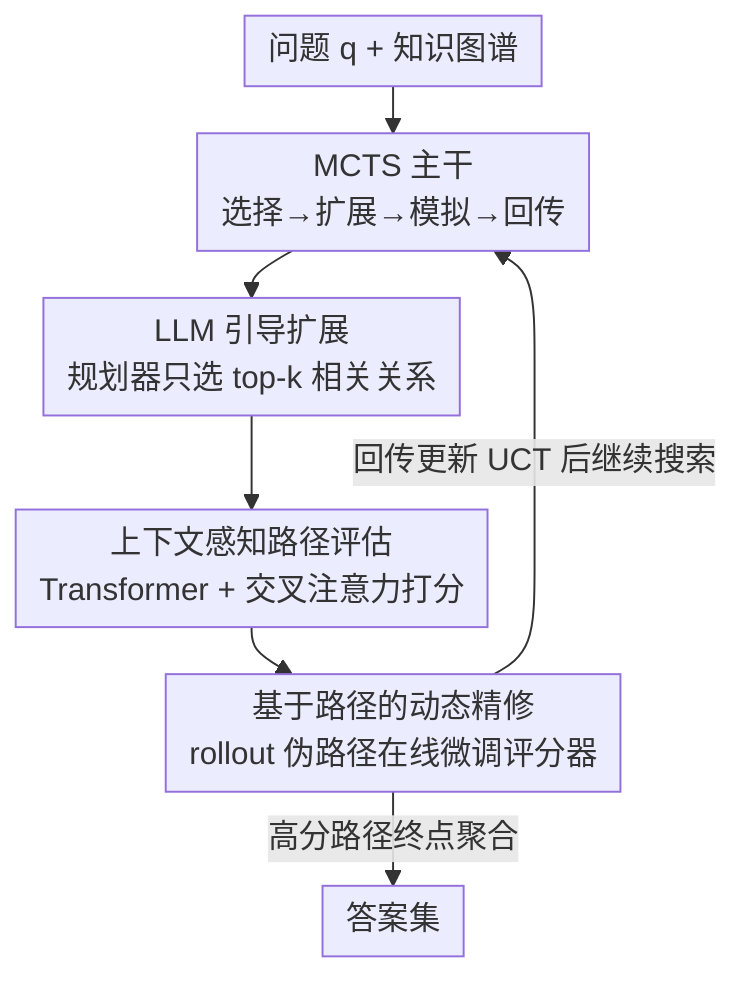

# DAMR: Efficient and Adaptive Context-Aware Knowledge Graph Question Answering with LLM-Guided MCTS

**会议**: ICLR2026  
**OpenReview**: [https://openreview.net/forum?id=mUx7WLC8q6](https://openreview.net/forum?id=mUx7WLC8q6)  
**代码**: 待确认  
**领域**: 图学习 / 知识图谱问答 / LLM 推理  
**关键词**: KGQA, 蒙特卡洛树搜索, LLM 规划器, 路径评估, 伪路径自训练

## 一句话总结
DAMR 把 KGQA 建成一棵由 LLM 规划器引导扩展的蒙特卡洛树搜索：LLM 只在扩展步选 top-k 相关关系把搜索空间剪小，路径打分交给一个轻量 Transformer 评分器（交叉注意力联合编码问题与关系序列），并用搜索过程中产生的伪路径在线微调这个评分器；最终在 WebQSP（Hits@1 94.0）和 CWQ（78.0）上超越所有 SOTA，同时把 LLM 调用次数和 token 消耗分别砍掉 50%+ 与 75%+。

## 研究背景与动机
**领域现状**：知识图谱问答（KGQA）要把自然语言问题映射成在知识图谱上的多跳推理路径，从主题实体一路走到答案实体。现有方法分两大流派：一是 **retrieve-then-reason**，先用图神经网络（GNN）或规则启发式抽出候选路径，再让 LLM 在候选上生成答案；二是 **dynamic path generation**，用 LLM 配合 in-context / CoT 或 MCTS 这类引导搜索，把检索和推理统一成边搜边推的过程。

**现有痛点**：前一派路径是静态抽取的，GNN 在推理时无法注入问题特定语义、规则又天生死板，无法随推理上下文动态精修；后一派虽然灵活，但把 LLM 绑死在每一个决策步上——每扩展一跳、每评估一条路径都要调一次 LLM，导致推理成本高、扩展性差，而且常用的打分函数是固定的静态 scorer，捕捉不到路径语义在多跳过程中的漂移。

**核心矛盾**：动态 KGQA 同时被三件事卡住——(1) 搜索时 LLM 被滥用，效率低；(2) 多跳路径的语义随每加一跳而演变，静态打分跟不上这种演变；(3) 想训一个可靠的路径评分器，但动态搜索产生的大量是残缺、无效的路径，正样本稀缺、监督噪声大，纯 RL 又受困于稀疏奖励和训练不稳。

**本文目标**：拆成三个子问题——怎么把推理模块化以减少 LLM 在搜索中的过度调用；怎么对不断演变的推理路径做准确评估；怎么在监督稀缺下训出可靠的评分器。

**切入角度**：把 LLM 从「每步都参与」降级为「只在扩展步当规划器」，把繁重的逐路径打分交给一个可训练、可在线适应的小模型，并把 MCTS 搜索本身当作监督信号的来源（rollout 产生的中间路径就是伪标签）。

**核心 idea**：用 LLM 引导的 MCTS 当主干，让一个上下文感知的轻量评分器替 LLM 做路径评估，再用搜索过程中自产的伪路径持续微调这个评分器——既省 LLM 又让评估随语义演变而自适应。

## 方法详解

### 整体框架
DAMR 把 KGQA 形式化为：给定问题 $q$ 和知识图谱 $\mathcal{K}=\{(e_s, r, e_o)\}\subseteq \mathcal{E}\times\mathcal{R}\times\mathcal{E}$，找一组从主题实体出发、经多跳关系到达正确答案的推理路径。整个系统是一棵 MCTS：每个节点是锚定在某个实体上的「推理状态」，每个动作是选一条出边关系把路径延长一跳。MCTS 的四个标准阶段——选择、扩展、模拟、回传——被分别接管：**扩展**阶段由 LLM 规划器只挑 top-k 相关关系（设计 1），**模拟**阶段由轻量 Transformer 评分器给候选路径打可信度分（设计 2），**回传**阶段顺手用本轮搜索产生的伪路径在线微调评分器（设计 3）。如此循环，最后把高分路径到达的实体聚合成答案集。LLM 只在扩展步被调用一次，其余全靠小模型，这是它「又快又准」的根。

### 关键设计

**1. LLM 引导扩展：把 LLM 从每步决策降级为只做关系剪枝**

直接对知识图谱做多跳搜索，分支爆炸——一个实体动辄几十上百条出边，纯 MCTS 会在无关方向上浪费大量 rollout，而把 LLM 绑在每个决策步上又太贵。DAMR 的做法是：MCTS 负责探索与利用的平衡，LLM 只在**扩展**这一个阶段出手当「关系筛选器」。选择阶段沿 UCT 从根走到叶节点，UCT 定义为

$$UCT = \frac{w_i}{n_i} + C\sqrt{\frac{\ln N}{n_i}}$$

其中 $w_i$ 是节点 $i$ 的累积奖励、$n_i$ 是访问次数、$N$ 是父节点访问次数、$C$ 调节探索与利用。到达叶节点后，取出该实体 $e_i$ 的全部出边关系 $R_{e_i}=\{r_1,\dots,r_n\}$，把问题 $q$ 和候选关系一起喂给 LLM，只留下语义最对齐的 top-k 条：

$$R_{top\text{-}k} = \text{LLM}(q, R_{e_i})$$

只有这 top-k 关系会生成子节点。关键在于：LLM 每个问题平均只被调用个位数次（WebQSP 上 7.1 次），却把搜索空间从「全部出边」剪到「语义相关的少数几条」，这是效率与质量双赢的来源——而不是像 ToG/RwT 那样每条候选路径都要 LLM 重新评一遍。

**2. 上下文感知路径评估：用可训练的小模型捕捉多跳路径的语义演变**

LLM 把扩展方向选对了，但不保证一条路径在更长的上下文里仍然成立——早期看着对的轨迹，多走几跳可能就跑偏了。以往要么用静态打分函数、要么用浅层相似度，都跟不上路径语义随每加一跳的漂移。DAMR 在 MCTS 的模拟阶段插入一个轻量 Transformer 评分器。给定问题 $q$ 和候选关系路径 $p_r=(r_1,\dots,r_l)$，先用预训练 LLM 把 $q$ 和每条关系 $r_i$ 编成 $z_q,z_{r_i}\in\mathbb{R}^d$，给每跳加可学习位置编码 $e^{pos}_i$ 后送进 Transformer：

$$E_{p_r}=\text{Transformer}([z_{r_1}+e^{pos}_1,\dots,z_{r_l}+e^{pos}_l])$$

再用交叉注意力让路径表示去 attend 问题嵌入，注入问题特定信息：

$$H = E_{p_r} + \text{CrossAttn}(E_{p_r}, z_q),\quad \text{CrossAttn}(E_{p_r}, z_q)=\text{softmax}\!\left(\frac{E_{p_r}\cdot z_q^T}{\sqrt{d_k}}\right)\cdot z_q$$

然后对关系做注意力池化 $s_{p_r}=\sum_i \alpha_i h_i,\ \alpha=\text{Softmax}(\text{MLP}(H))$，让模型自动突出路径上信息量大的跳；最后把池化表示与问题嵌入拼接过 MLP 得可信度分 $S(q,p_r)=\text{MLP}([s_{p_r}:z_q])$。评分器靠**预训练**先具备判别力：从局部子图采正负路径（正样本连到正确答案；负样本分两类——逼近但错过答案的 hard negative，以及绕开答案实体的随机游走 negative），用成对排序损失

$$\mathcal{L}_{PR}=-\frac{1}{M}\sum_{i=1}^{M}\log\sigma\!\big(S(q,p_i^+)-S(q,p_i^-)\big)$$

鼓励正路径得分高于负路径。这个小模型在模拟阶段完全不碰 LLM，是 token 消耗骤降 75% 的直接原因。

**3. 基于路径的动态精修：把搜索过程自产的伪路径变成持续监督**

预训练好的评分器是静态的，泛化不到搜索时不断演变的路径分布；而高质量人工监督又稀缺。DAMR 的解法是让评分器在搜索中边用边学：把 MCTS rollout 产生的高置信中间路径当**伪路径**，无需额外标注就能持续适配新的推理上下文。回传阶段，评分器给出的可信度分沿被访问节点传播，每个实体 $e_i$ 更新访问次数与聚合值 $w_{e_i}=\frac{\sum_j n_{e_j}\cdot w_{e_j}}{\sum_j n_{e_j}}$，从而精修后续选择用的 UCT，把搜索逐步偏向高质量路径。构造微调监督时，**不用评分器自己的预测当标签**（避免自我确认偏差），而是用搜索经验得到的「search value」$w_{e_i}=\frac{w_{p_r}}{n_{e_i}}$（$w_{p_r}$ 是经过该路径的累积奖励）；对一对路径按相对 value 定伪标签：$w_{e_i}>w_{e_j}$ 时 $p'_i$ 为正、$p'_j$ 为负，否则反之。再用同一个成对排序损失（Eq. 7）微调评分器。论文还给了理论分析（伪标签聚合的方差随采样数与轮次双重衰减、成对排序更新方向与真实排序风险一致、整个精修映射是 Banach 压缩映射收敛到唯一不动点），论证这套自训练稳定收敛、不会因伪标签噪声漂移——⚠️ 具体证明细节以原文为准。

### 损失函数 / 训练策略
评分器统一用成对排序损失 $\mathcal{L}_{PR}$（Eq. 7），分两阶段：预训练用子图采样的正负三元组 $(q,p^+,p^-)$，序列零填充并掩码做高效 batch，跑 15 个 epoch、学习率 $1\times10^{-4}$；微调用搜索中采的伪路径对，跑 10 个 epoch、学习率 $1\times10^{-5}$。规划器用 GPT-4.1，问题/关系嵌入来自 Qwen3-Embedding-8B（1024 维），评分器内部用 128 维、两层 Transformer，Adam 优化。

## 实验关键数据

### 主实验
两个标准 KGQA benchmark：WebQSP 与 CWQ，各从测试集均匀采 1000 问，指标为 Hits@1 与 F1。

| 数据集 | 指标 | DAMR | 之前最强（DP） | RwT | 提升 |
|--------|------|------|----------------|------|------|
| WebQSP | Hits@1 | 94.0 | 87.5 | 87.0 | +6.5 |
| WebQSP | F1 | 81.7 | 81.4 | 79.7 | +0.3 |
| CWQ | Hits@1 | 78.0 | 75.8 | 72.4 | +2.2 |
| CWQ | F1 | 75.1 | 69.4 | 66.7 | +5.7 |

DAMR 在四项里全是最优，尤其 WebQSP Hits@1 大幅领先；通用 LLM（ChatGPT 66.8 / Llama3-8B 30.3 Hits@1）因为没有图谱接地，明显不如「LLM+KG」一类方法。

### 效率分析

| 方法 | WebQSP #Tokens | WebQSP #Calls | CWQ #Tokens | CWQ #Calls |
|------|----------------|---------------|-------------|------------|
| DoG | 22,538 | 30.9 | 37,741 | 58.1 |
| ToG | 16,372 | 23.2 | 26,183 | 41.9 |
| RwT | 10,680 | 15.1 | 17,885 | 28.6 |
| DAMR | 3,931 | 7.1 | 9,266 | 16.8 |

相对最强基线，LLM 调用减少 50%+、token 消耗减少 75%+。原因正是 LLM 只在扩展步被调一次、模拟阶段的路径评估完全由小模型承担。

### 消融实验

| 配置 | WebQSP Hits@1 | WebQSP F1 | CWQ Hits@1 | CWQ F1 | 说明 |
|------|---------------|-----------|------------|--------|------|
| DAMR（完整） | 94.0 | 81.7 | 78.0 | 75.1 | 完整模型 |
| w/o PE | 91.2 | 78.2 | 74.3 | 72.1 | 去掉路径评估模块 |
| w/o FT | 91.9 | 80.1 | 75.1 | 73.0 | 关掉评分器在线微调 |
| w/ GPT-4.1 | 92.5 | 79.8 | 74.9 | 72.4 | 用通用 LLM 替评分器 |

### 关键发现
- **路径评估模块（PE）贡献最大**：去掉后 CWQ Hits@1 从 78.0 掉到 74.3，说明没有可信度打分就无法有效排序候选路径，搜索退化。
- **在线微调（FT）确有用**：关掉后两数据集普遍下滑，证明让评分器适配搜索中演变的路径分布是必要的，而非一次预训练到位。
- **专用小评分器 > 通用大 LLM 评估**：用 GPT-4.1 替评分器反而更差（CWQ F1 72.4 vs 75.1），微调后的轻量 scorer 能捕捉更细粒度的路径语义差异，且不增 LLM 开销。
- **超参敏感性**：每步选 $k=3$ 条关系、路径长 $L=4$ 是综合两数据集的最优折中——$k$ 太大引入无关候选且增成本，CWQ 因问题更复杂需要更深推理（$L=4$ 才饱和），WebQSP 三跳后基本不再涨。

## 亮点与洞察
- **「LLM 当规划器、小模型当裁判」的分工很巧**：把昂贵的 LLM 限定在它最擅长且代价可控的关系剪枝上，把高频的路径打分交给可训练小模型——既不牺牲语义质量，又把成本压到对手的 1/4，是这篇最实用的工程洞察。
- **把搜索过程本身变成监督来源**：用 MCTS rollout 的中间路径自产伪标签、且用「搜索经验值」而非评分器自身预测当标签，绕开了 RL 稀疏奖励和自我确认偏差两个老问题，这个 self-training 思路可迁移到任何带搜索的推理任务。
- **交叉注意力 + 注意力池化的路径编码**：让路径表示显式 attend 问题、再加权聚合各跳，把「路径在当前问题下是否合理」做成可学习的上下文敏感打分，比静态相似度更贴合多跳语义演变。
- **理论与工程闭环**：用压缩映射论证自训练收敛，给「边搜边微调会不会漂」这个直觉担忧上了一道形式化保险。

## 局限与展望
- **只在 WebQSP / CWQ 两个 Freebase 系 benchmark 上验证**，且各采 1000 问；对更大规模、不同 schema 的知识图谱（如开放域、含噪声的工业 KG）泛化性未知。
- **依赖强 LLM 规划器与强嵌入模型**（GPT-4.1 + Qwen3-Embedding-8B），换成更弱的 LLM（论文附表显示 Llama2-13B 等会掉点），实际部署成本仍受 LLM 价格约束。
- **伪路径质量受早期搜索质量影响**：理论保证的是渐近稳定，冷启动阶段若 rollout 噪声大，对小数据/长尾问题是否依然稳健值得进一步验证。
- **多答案聚合策略写得较略**：高分路径终点如何聚合成答案集、阈值如何定，可改进点之一。

## 相关工作与启发
- **vs retrieve-then-reason（GNN-RAG / DoG 等）**：他们先静态抽路径再让 LLM 答，推理时无法注入问题语义；DAMR 边搜边评、评分器还在线适配，灵活性和准确率都更高。
- **vs LLM+MCTS 动态生成（DP / RwT）**：同样用 MCTS，但 DP/RwT 把 LLM 或静态 scorer 绑在评估上，DAMR 用可微调小模型替评估，既省 LLM 调用又能捕捉语义演变，主结果与效率双双领先。
- **vs RL 路径推理（DeepPath / MINERVA）**：它们只在到达正确答案时给奖励，受困稀疏奖励、训练不稳；DAMR 用中间路径做密集伪监督，学习信号更稠密稳定。
- **vs 伪标签自训练**：把半监督里的 pseudo-labeling 搬到推理搜索中，用「搜索经验值」而非模型自预测定标签，缓解自我确认偏差，是对经典自训练的针对性改造。

## 评分
- 新颖性: ⭐⭐⭐⭐ 「LLM 规划 + 小模型评估 + 搜索自产伪路径在线微调」三件套组合新颖，且配了收敛性理论
- 实验充分度: ⭐⭐⭐⭐ 主结果/效率/消融/超参/不同 LLM 都覆盖，但仅两个 benchmark、各 1000 问，规模偏小
- 写作质量: ⭐⭐⭐⭐ 三挑战→三模块的结构清晰，方法与理论交代完整
- 价值: ⭐⭐⭐⭐ 在准确率提升的同时把 LLM 成本砍到 1/4，对实际部署 KGQA 很有吸引力

<!-- RELATED:START -->

## 相关论文

- [\[ICLR 2026\] Glance for Context: Learning When to Leverage LLMs for Node-Aware GNN-LLM Fusion](glance_for_context_learning_when_to_leverage_llms_for_node-aware_gnn-llm_fusion.md)
- [\[NeurIPS 2025\] ReMindRAG: Low-Cost LLM-Guided Knowledge Graph Traversal for Efficient RAG](../../NeurIPS2025/graph_learning/remindrag_low-cost_llm-guided_knowledge_graph_traversal_for_efficient_rag.md)
- [\[ICLR 2026\] Entropy-Guided Dynamic Tokens for Graph-LLM Alignment in Molecular Understanding](entropy-guided_dynamic_tokens_for_graph-llm_alignment_in_molecular_understanding.md)
- [\[ICLR 2026\] CLAUSE: Agentic Neuro-Symbolic Knowledge Graph Reasoning via Dynamic Learnable Context Engineering](clause_agentic_neuro-symbolic_knowledge_graph_reasoning_via_dynamic_learnable_co.md)
- [\[ACL 2025\] Ontology-Guided Reverse Thinking Makes Large Language Models Stronger on Knowledge Graph Question Answering](../../ACL2025/graph_learning/ontology-guided_reverse_thinking_makes_large_language_models_stronger_on_knowled.md)

<!-- RELATED:END -->
