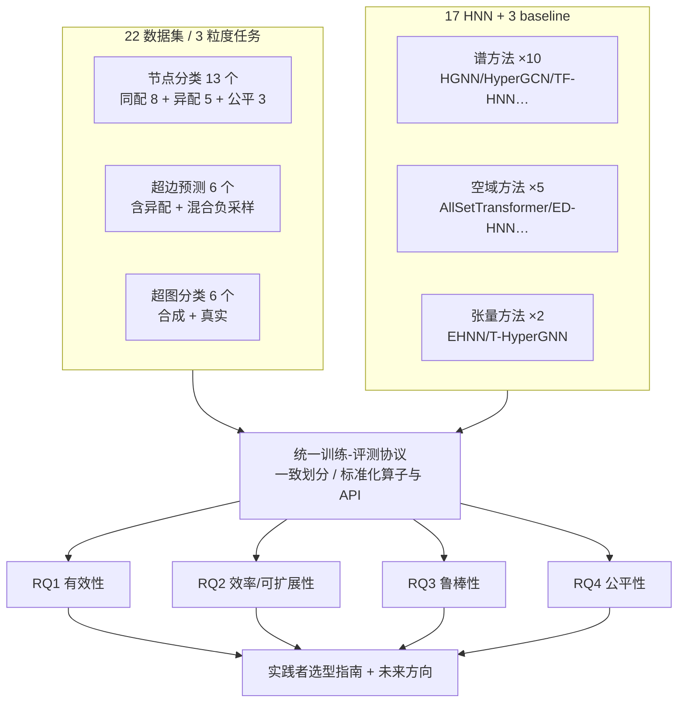

# DHG-Bench: A Comprehensive Benchmark for Deep Hypergraph Learning

**会议**: ICLR 2026  
**OpenReview**: [https://openreview.net/forum?id=lhsb1ChUDF](https://openreview.net/forum?id=lhsb1ChUDF)  
**代码**: [https://github.com/Coco-Hut/DHG-Bench](https://github.com/Coco-Hut/DHG-Bench)  
**领域**: 图学习 / 超图神经网络 / Benchmark  
**关键词**: 超图神经网络, Deep Hypergraph Learning, Benchmark, 鲁棒性, 公平性, 高阶交互  

## 一句话总结
DHG-Bench 是首个面向超图神经网络（HNN）的综合性基准，在统一实验协议下从**有效性、效率、鲁棒性、公平性**四个维度系统评测了 17 个 SOTA HNN 算法 × 22 个数据集（覆盖节点/超边/超图三种粒度任务），用大量对照实验揭示了现有 HNN「换数据换任务就崩」「大图跑不动」「特征/标签噪声扛不住」「比 MLP 更不公平」等系统性短板。

## 研究背景与动机
**领域现状**：现实系统中大量存在「多方/群组」交互——多位作者合写一篇论文、一群蛋白质共同参与反应——这些**高阶关系**用超图（一条超边可连接任意多个节点）建模最自然。把普通 GNN 强行套到超图上（clique expansion，把超边拆成两两边）会塌缩高阶结构、丢信息，于是专门的超图神经网络（HNN）成了深度超图学习（DHGL）的主流范式，已在推荐、3D 检测、疾病诊断等场景刷出 SOTA。

**现有痛点**：HNN 算法层出不穷，但评测体系严重缺位——(i) 各论文用各自的数据集、baseline、数据划分和超参，**没法公平比较**；(ii) 几乎只盯着「有效性」，对效率、鲁棒性、公平性这些**部署关键维度**几乎无人系统评估。已有工具包（HyFER、DHG、TopoX）要么只给极少甚至不给定量结果，要么只收录 2023 年前的老方法，**都不支持异配超图数据集，也不支持超图级（graph-level）任务**。

**核心矛盾**：社区急需一个标准化、多维度的基准，但「收齐先进算法 + 覆盖三种粒度任务 + 引入异配/公平数据集 + 统一可复现协议」这件事此前没人做。

**本文目标**：建一个第一个综合性 HNN 基准，统一实验设置，把分散的算法/数据集/任务收拢到一起做多维度对照分析，并开源易用的库。

**核心 idea**：**统一协议 + 四维评测 + 三粒度任务**——用标准化算子与 API、一致的划分与处理策略保证公平比较，再在有效性之外加入效率、鲁棒性、公平性三个维度，配合精心设计的扰动与公平指标，把「现有 HNN 到底进步了多少、短板在哪」量化讲清楚。

## 方法详解

### 整体框架
DHG-Bench 不是提出新模型，而是一套「数据集库 + 算法库 + 评测协议」的基准系统：横向收齐 22 个数据集（覆盖节点分类、超边预测、超图分类三种任务，含同配/异配/公平敏感三类特性）和 17 个 HNN 算法（谱方法/空域方法/张量方法三大类，外加 MLP、CEGCN、CEGAT 三个 baseline），纵向围绕四个研究问题（RQ1 有效性、RQ2 效率、RQ3 鲁棒性、RQ4 公平性）设计统一的训练-评测流水线，所有方法在同一套划分与处理策略下复现对比。

### 关键设计
**1. 三粒度任务覆盖：把评测拉到节点之外**　以往工作几乎只做节点分类，DHG-Bench 把超边预测和超图分类一并纳入统一协议。节点分类用 50%/25%/25% 划分，给标注节点集 $V_L$ 训练分类器 $f_\theta: v \mapsto \mathbb{R}^C$ 预测未标注节点标签；超边预测把候选超边 $c \in 2^V \setminus E$ 交给二分类器 $f'_\theta: e \mapsto \{0,1\}$ 判断是否属于目标集 $E'$，并按 60%/20%/20% 划分、配合 SNS/MNS/CNS 三种启发式混合负采样制造对比样本；超图分类则在 80%/10%/10% 下训练 $f''_\theta: G \mapsto \mathbb{R}^C$ 预测整图标签。三种任务用同一套库实现，才暴露出「节点分类强的方法到超边/超图就掉队」这一关键现象。

**2. 算法谱系三分法：谱 / 空域 / 张量**　基准按 message passing 的数学机理把 17 个 HNN 归为三类，保证覆盖面而非只挑热门。谱方法基于超图拉普拉斯算子做谱卷积（HGNN、HyperGCN、PhenomNN、SheafHyperGNN、TF-HNN 等 10 个）；空域方法绕开谱域、用「节点→超边、超边→节点」两阶段邻域聚合（HNHN、UniGNN、AllSetTransformer、ED-HNN、HyperGT 等 5 个）；张量方法用张量运算捕捉高阶交互（EHNN、T-HyperGNN）。这种分类让「谱方法对结构噪声更脆弱」「张量方法效率瓶颈最严重」等结论能落到机理层面。

**3. 同配/异配/公平三类数据特性：制造区分度**　基准刻意引入 5 个异配数据集（Actor、Yelp、Amazon-ratings、Twitch-gamers、Pokec）和 3 个公平敏感数据集（German、Bail、Credit，含性别/种族/年龄等敏感属性），而非只用 Cora/Pubmed 这类同配学术网络。正是异配数据让「多数 HNN 在异配图上反而打不过只用节点特征的 MLP」这一反直觉现象浮出水面，也让公平性评测有了载体。

**4. 四维扰动与公平度量：把可信度量化**　鲁棒性维度从结构、特征、监督三个角度模拟现实噪声：结构上随机删/增超边、特征上加噪声/做掩码、监督上注标签噪声/制造标签稀疏，并扫不同强度逐一训练测试。公平性维度采用两个群体公平指标——人口均等差 $\Delta_{DP}$（demographic parity）和均等几率差 $\Delta_{EO}$（equalized odds），在三个公平敏感数据集上用平均排名综合刻画各算法在「准确率 vs 公平」上的取舍。这套设计把过去被忽略的可信维度变成了可对比的定量结论。

## 实验关键数据

### 主实验表格（节点分类，部分代表数据集，准确率 %）

| 方法 | 类别 | Cora | DBLP-CA | Trivago | Actor(异配) | Yelp(大图) |
|---|---|---|---|---|---|---|
| MLP | baseline | 75.33 | 85.54 | 36.76 | **86.06** | 31.84 |
| CEGCN | GNN+clique | 76.90 | 89.75 | 47.24 | 67.41 | OOM |
| HGNN | 谱 | 77.90 | 91.00 | 57.67 | 77.83 | 33.71 |
| HyperGCN | 谱 | 78.38 | 89.51 | 42.39 | 81.82 | 29.29 |
| **TF-HNN** | 谱(解耦) | **79.47** | 91.38 | **90.79** | 85.96 | **35.16** |
| AllSetTransformer | 空域 | 78.02 | 91.51 | 59.92 | 85.66 | 33.18 |
| ED-HNN | 空域 | 78.58 | 91.55 | 75.99 | 85.77 | 34.84 |
| EHNN | 张量 | 76.51 | 90.47 | OOM | 86.21 | 34.09 |
| T-HyperGNN | 张量 | 74.20 | 85.44 | OOM | 85.32 | OOM |

注：异配数据集 Actor 上 MLP（86.06）反超几乎所有 HNN；大图 Yelp/Trivago 上大量方法 OOM。

### 消融/分维度实验

| 维度 (RQ) | 关键观测 |
|---|---|
| 有效性 (RQ1) | 节点分类强的 HNN 到超边预测全面失灵：DBLP-CA 上 TF-HNN 的 AUROC/AP 比最佳的 HyperGCN 低 13.76%/16.70%；超图分类合成数据轻松 90%+、真实数据极少超 70% |
| 效率 (RQ2) | Yelp 上 ED-HNN/EHNN 相比 HGNN 仅微涨精度，训练时间却长 9×/23×；T-HyperGNN 比最快的 HGNN 慢约 406×；Yelp 上 17 个方法里 8 个 OOM |
| 鲁棒性 (RQ3) | 结构噪声普遍扛得住（Cora 删 90% 超边仍有 7/10 方法掉点<7%），但特征噪声/标签噪声杀伤更大；谱方法对结构扰动更脆弱 |
| 公平性 (RQ4) | MLP 在两个公平指标上排名最好但准确率最差——HNN 的高阶消息传递在提升精度的同时**放大了偏见** |

### 关键发现
1. **clique expansion 不可取**：HNN 普遍优于 CEGCN/CEGAT，证明把超边拆成两两边会破坏高阶结构。
2. **异配是命门**：多数 HNN 在异配数据集上跑不过只用特征的 MLP，现有高阶消息传递在异配下反而有害。
3. **效率-效果难两全**：多数先进 HNN 要么大图 OOM、要么算力翻几十倍只换微小精度提升；TF-HNN 的**解耦/免训练消息传递架构**是少数能兼顾效果、速度与显存的方案。
4. **可信度被严重忽视**：HNN 对特征/标签噪声脆弱，且比 MLP 更不公平，部署风险被以往评测掩盖。

## 亮点与洞察
- **第一个真正多维度的 HNN 基准**：把效率、鲁棒性、公平性这些「部署才会暴露」的维度第一次系统量化，价值远超又一张精度排行榜。
- **反直觉结论有据可查**：「HNN 在异配图上打不过 MLP」「高阶传播放大偏见」这类发现，对正在卷新架构的 HNN 社区是有力的冷水与方向校准。
- **解耦架构是赢家**：TF-HNN 在有效性/效率/鲁棒性/公平四个维度都没明显短板，论文据此把「设计更强的解耦 HNN」点为最有前景的方向。
- **可落地的选型指南**：直接给出 node→TF-HNN、edge→EHNN/HyperGCN、graph→AllSetTransformer 等实践建议，对工程选型友好。

## 局限与展望
- **不提新方法**：作为 benchmark 论文，本身不贡献新模型，结论是「诊断」而非「治疗」。
- **扰动主要在节点分类上做**：鲁棒性实验受篇幅限制集中在节点分类，超边/超图任务的鲁棒性仍待补全（库支持扩展）。
- **公平评测样本有限**：仅 3 个公平敏感数据集、2 个群体公平指标，个体公平与更多敏感场景未覆盖。
- **未来方向**：作者明确指向三条路——面向多样数据/任务的**自适应 HNN**、面向大图的**高效解耦架构**、面向噪声与对抗的**鲁棒 HNN**。

## 相关工作与启发
- **对标已有工具包**：HyFER 仅 3 个模型、DHG/TopoX 只收 2023 年前方法且无异配/超图级支持，DHG-Bench 在覆盖面与评测维度上是明确升级。
- **承接图机器学习的可信潮流**：把 GNN 领域已成熟的鲁棒性、公平性评测范式（$\Delta_{DP}$、$\Delta_{EO}$）迁移到超图，填补了 DHGL 在可信维度上的空白。
- **启发**：(1) 做新 HNN 时务必带上异配数据与可信指标，否则容易「同配刷分、部署翻车」；(2) 解耦/免训练消息传递可能是 HNN 走向大规模的关键路线；(3) 高阶结构在带来表达力的同时也会放大噪声敏感与偏见，需要在架构层面对冲。

## 评分
- **新颖性**: ⭐⭐⭐⭐ — 不是新方法，但「首个四维度 × 三粒度 HNN 基准」填补了明确空白，异配/公平维度的引入有真正的洞察价值。
- **实验充分度**: ⭐⭐⭐⭐⭐ — 17 算法 × 22 数据集 × 4 维度 × 多强度扰动，统一协议复现，覆盖与严谨度都属一流。
- **写作质量**: ⭐⭐⭐⭐ — RQ 驱动、insight 编号清晰、配选型指南，结构工整易读。
- **价值**: ⭐⭐⭐⭐⭐ — 开源可复现库 + 系统性诊断 + 实践选型指南，对 HNN 社区的研究与落地都有长期参考价值。

<!-- RELATED:START -->

## 相关论文

- [\[ICLR 2026\] GDGB: A Benchmark for Generative Dynamic Text-Attributed Graph Learning](gdgb_a_benchmark_for_generative_dynamic_text-attributed_graph_learning.md)
- [\[ICLR 2026\] LRIM: a Physics-Based Benchmark for Provably Evaluating Long-Range Capabilities in Graph Learning](lrim_a_physics-based_benchmark_for_provably_evaluating_long-range_capabilities_i.md)
- [\[ICML 2026\] What Makes a Desired Graph for Relational Deep Learning?](../../ICML2026/graph_learning/what_makes_a_desired_graph_for_relational_deep_learning.md)
- [\[ICLR 2026\] Pairwise is Not Enough: Hypergraph Neural Networks for Multi-Agent Pathfinding](pairwise_is_not_enough_hypergraph_neural_networks_for_multi-agent_pathfinding.md)
- [\[ICLR 2026\] Is Graph Unlearning Ready for Practice? A Benchmark on Efficiency, Utility, and Forgetting](is_graph_unlearning_ready_for_practice_a_benchmark_on_efficiency_utility_and_for.md)

<!-- RELATED:END -->
